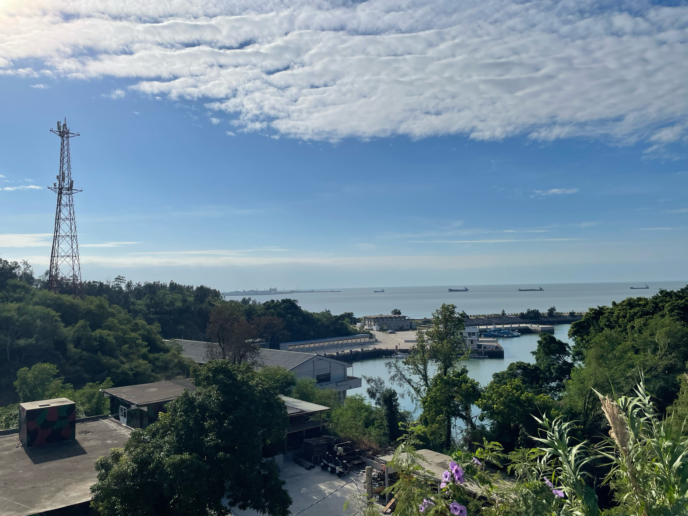

keywords: 精實案, 義務役, 兵役, 金門

# -3 懶腰

寫於 2024 年一月

這兩年又陸續回去了幾次服役時所在的防區。每次回去，總少不了看看金湖鎮環保站—也就是漁村營區，料羅灣旁的防衛部工兵營部暨營部連。

營區大部分被保留下來，但總是有些變化。原本從大門往下走，經過二級廠之後，右邊該有三間庫房，分別是經理、化學庫房與彈藥庫，現在只賸下一間。左邊的大寢室前，應該有一棵大樹，那是在上工或出公差回來時，可以稍事休息的地方，其實也是老兵私下集合菜鳥的一個當方，當年雖然撐過丹恩颱風，2023 年也沒撐過杜蘇芮颱風，被連根拔起。倒是，牆上寫著「浴室」、「廁所」的那兩塊壓克力板，居然還維持著二十多年前的原貌。

再往下走，左邊那條路上，原本的戰情室、副營長室、參謀主任、情報官與後勤官的房間，以及更下面一點的那個本來就很少用的作戰中心，因為沒有使用，整個荒廢了。那條路的終點，應該是我們以前稱做海龍坑道—現在稱為漁村小艇坑道—的入口，在 2023 年底，那條路反而被挖斷了，底下看到一台水泥預拌車，還有一些施工人員，一問之下，才知道這邊也在進行坑道活化工程，預計 2024 年春天完工，要把漁村坑道改建成像是翟山坑道、九宮坑道那樣的觀光坑道，搞不好還會有紀念品店，賣些風獅爺之類的文創商品。

跑去鄰近的高洞坑道看看—那個坑道就在工兵營以前盜採砂石的礫灘旁，以前五噸車就停在坑道前頭。坑道裡頭也開始有了些水泥設施，看來也在活化工程的範圍內。將這些地方整理出來，延續這些地方的故事，總是好事一件，只是不知道我以後是否還認得這些地方，像我就覺得馬山三角堡被縣政府重新塗刷之後，顏色變得好奇怪。

右邊那條路上，在籃球場周圍，無論是營辦室、文書寢室、糧秣庫房，都還保持完好，只是，那幾棵樹什麼時候長這麼高了？離開這裡的時候，那幾棵樹的高度都還搆不到二樓的圍牆，到了 2023 年，卻已經可以嚴嚴實實地蓋住二樓的人事官與通信官的房間。是了，我講的是從連集合場旁邊，穿過曬衣場，從機槍堡往下看的角度，從這個地方，除了可以看到下面的營部，更下面的新湖漁港，更遠處的料羅港，看到東半部的料羅灣，那一片我以為看膩了的海。

說起來這裡也是可以看到藍眼淚的勝地。後來當人們講到藍眼淚的時候，我也才想起我在服役的時候就看過了，有幾天在晚點名結束後，我遠遠看到新湖漁港出去的地方，泛著灰藍色的微光，那時候只覺得奇怪，在陣地關閉時間、燈火管制的防區，怎麼看起來有人往海上打燈，但是在忙碌的軍旅生涯中，也沒時間與心思去細想。連上也沒人去想那塊海上有些什麼，想著都是怎樣快點離開這裡，一堆人都說沒見過。

我雙手插著腰，耳邊是海風聲與浪濤聲，然後，伸了一個懶腰。

我記得我在防衛部的支援令到期，歸建回連上之後，一個星期四的上午，我也來這裡，耳邊是一樣的海風聲與浪濤聲，一樣伸了一個懶腰。

△

星期四上午得看莒光日，就算我還有一堆積假，想要走出營區補假，也得看完莒光日再說。連上為了讓大家距離那兩台電視近一些，莒光日前會先將中山室裡頭那幾張鐵板桌搬到連集合場上，午餐前復位，但這幾天也不知怎麼的，這些桌子還有備膳台一直擺在連集合場上，用餐時間也都直接在連集合場上打飯，弟兄或是在中山室跨坐在長板凳上，或是就蹲在集合場的角落，抱著碗公吃飯。

看完了粟奕倩的莒光日—那時我也想不到就在幾週後，幾乎跟我離開防區、離開軍旅生涯的同時，粟奕倩也離開了—其他人都還在寫莒光作文簿，但我已經是黑軍了，三名么八么四梯弟兄退伍之後，接下來就會是我，也沒有人要求我寫心得作文，我就穿上衣服。去連辦公室拿張徒弟幫我開好的假單，拎著一個綠色帆布打茫包，隨性穿越連集合場的這些桌子，到了機槍堡一趟。

我插著腰，看著海。

太陽好大，天好藍，海也好藍。連集合場的水泥地都是燙的，平常總是懶洋洋躺在水泥地上的黑妞，似乎也嫌棄這塊水泥地，跑去趴在機槍堡旁長滿牽牛花的一小塊泥巴地上，吐著舌頭。這幾天機槍堡也安上了偽裝網，牽牛花也順著偽裝網攀上了機槍堡，這個角落就被爬藤肆意地佔據。

營辦室、營長室這些地方，像是被我踩在腳下，而營部連的種種，中山室、製磚廠、安官室、二級廠、大小寢室、各個庫房這些迷彩工寮、連長副連長輔導長士官長這些長官，甚至更遠一點的太武山，還有在太武山上的一切，現在全都在我的身後。我已經要準備離開這些了，以後也只會離得愈來愈遠。

我心裡想著幾件事，我該去那加雜貨店打混呢？要在營區外面最近的那家，還是去靠近山外的那家萬年青？等下中午要在外頭吃，還是乾脆也回連上吃完飯再出去？我在防衛部政戰部支援的時候，我就想寫這段日子發生在工兵營的那些事，如果要寫，我該寫什麼？我該怎麼寫？我寫了之後，我可能會惹上什麼麻煩？

我還想著其他的事情，想著一些當時的我，只有著朦朧的感受，但還看不出有任何關聯，也沒有辦法整理成文字的思緒。

△

我想念五叔，還有五叔的一家人。

我想念五叔的手搖磨豆機，還有那一把八角型的金屬咖啡壺。我想念五嬸剛烤好的杯子蛋糕，與五叔的手沖咖啡是怎樣的絕配。我想著大三哪年，母校七十週年校慶的時候，我在幫校園中的一份學生報紙製作七十週年專刊，那時候商學院剛落成，我還去問了五叔，這座嶄新的建築物應該要怎樣拍照才好，五叔用他的經驗告訴我，要在一大早太陽剛出來的時候拍。還有那個總是跑來跑去的小堂弟。

我總以為在軍中的這段日子，製磚、搬水泥、拖鋼筋、搬塊石、站哨、參一業務…已經讓我沒時間去想家裡的事，這裡有好多莫名其妙的事，但每件莫名其妙的事，又總似乎在召喚我在八十七年二月十七日那個上午的無助。

五叔的相機與相機包，過去半年多還在陪著我，在我支援防衛部政戰部這段期間，陪我在全防區東奔西跑，去了別人不能去的擎天戰情室，上了別人不能上去的離島，那個相機包現在還暫時寄放在營辦室的參一保密櫃裡頭。而五月把最後一次返台假放完收假那天，搭乘軍包機返防，降落的時候，風好大，機身劇烈搖晃，停妥之前又是一個急煞，全機官兵都可以感受到劇烈地作用力與反作用力，我不禁在想，五叔一家人最後感受到的是什麼？最後想著的是什麼？

假期結束了，椅背上的螢幕，顯示飛機已經到了桃園上空，四叔已經在接機大廳等著了。堂弟、堂妹可能已經迫不及待要跟四叔講這趟印尼之旅有多好玩，多麼捨不得南國的風情，偏得回到濕冷多雨的台北，不過，明天又會是新的一天，堂弟、堂妹會回到校園，度過他們應該要度過的童年，五叔要繼續職場上的任務，但晚上再花點時間塗塗改改，就可以把碩士論文交出去了，而五嬸可能想著新的食譜，接著，突然機身劇烈換晃動，緊接著就是巨響…。

我想著，新訓中心明明就準備了那麼多的籤，這一梯明明也沒幾支外島籤，怎麼就偏偏是我抽中外島呢？每天全世界有那麼多的航班，有那麼多的飛機起降，五叔一家人，怎麼偏偏就搭上了那班 CI676 呢？我的命運，我的親人的命運，到底在誰手中？

可是，就在防區，我又感受到，別人的命運在我手中時，我也是一樣的無助。

八十八年九月六日，對我來說，那天整個工兵營有三件最重要的事。第一，營部連伙房那位學長不假離營已經一天了，照理說在外島遇到這種狀況，應該要發動雷霆演習，所有人出去把人找回來，但工兵營一個人都沒派出去，因為那天是高裝檢受檢的日子，二級廠要把所有的輪車、工兵機械全都整理得美輪美奐，所有身上有裝備業務的人全都參與受檢。

同時，工一連有一位弟兄從前一天傍晚開始就牙齦血流不止，家長要求馬上回台灣住加護病房，人事官要求我早上就生出他的返台假單，他什麼時候能走，全看我什麼時候可以把流程辦完。接下來四周，我也都幾乎都在最後一刻，辦出為他看護的弟兄的返台假單，然後，他還是走了，大好青春就此凋謝，我負責辦理傷亡通報，兵資登錄，還有一處五科辦理撫卹與軍人保險所需要的那些卷宗。

在工兵營或是其他的防衛部直屬部隊裡，任何一個人要返台，要蓋上五個章—我這個承辦人的章，營長的章，防衛部承辦人一處差假官的章，一處處長的章，最後是防衛部參謀長的章。那天我還有哨，放著待命班不管，八點部隊可以放行人員的時候我就出門了，要在十二點站哨之前辦完，營長也沒批這份文，口頭講一下，就把營長章蓋上了。

因為高裝檢，防衛部一處的軍官也都在陪檢，我在太武山上大概迷路了將近四十分鐘才找到一處的長官，但找不到參謀長，最後請一處通融，先讓人回去，隔天再去參謀長那邊補辦流程。這可能是我能夠做到的極限了，起碼我還是騎著剛買不久的腳踏車狂衝上太武山，而不是去山外等公車，但一個月之後，人還是走了。家屬並沒有責怪部隊，沒有人責怪我。

真要說起來，可以埋怨的事情實在太多了。如果身體原本有這樣的疾病，怎麼還要讓這樣的人服役？還是，這個部隊到底是怎麼把人操出這樣的病出來？為什麼這件事剛好發生在高裝檢的同一天？人事官就不能放下高裝檢，從連上出一台小車跟我一起去趟太武山上加速流程嗎？防衛部一處的長官也有必要參與高裝檢嗎？三軍總醫院又給了他怎樣的照護？可是，那個早上，能不能讓他回去，能不能住進加護病房，最大的變數，是我。

如果我可以騎得更快一點，如果我可以不管太湖路經武路口那個衛兵一路狂衝，如果我沒有在太武山上花了四十分鐘才找到防衛部勤務連，如果我可以更清楚防區哪個單位到底在那個地點，如果我不是參謀長前腳剛走我才抵達，如果可以早個幾小時幾分鐘辦出這份假單、可以搭上早個幾班的班機，事情會不會不一樣？我不知道，因為已經沒有如果了，我也覺得，那天已經到了我的極限了。我真的不知道，如果可以重來一次，我能不能夠用更快的速度跑出流程，而那個月，工兵營還有因為實施提前退伍以及九二一震災帶來的一大堆人事業務的衝擊，後面幾次派去三總的假單，也都來得又快又急，我還是都想辦法及時生出了假單，不是嗎？

呵，在我開始接參一業務的時候，人家都跟我說接這個業務可以經常洽公，可以走出營區晃到山外去，一堆弟兄都覺得營部文書就是在打茫，就連營長也覺得我只是送送假單而已。怎麼都沒有人告訴我，這其實是個人命關天的差事？而我又怎麼到了這麼晚才發覺？九月六日那個早上，我又意識到了嗎？是不是該有人把參一到底是怎樣的業務好好寫一寫，講清楚這是怎樣的義務？而如果我知道五叔一家人會在那個二月十六日離開，那我能不能做得更好？

說起來我也只是個來服役的阿兵哥，奉著長官的命令承辦相關業務，這樣的事有什麼值得我難過的嗎？說起來這些都是生命中零碎出現的片段，但我大概就像是山外的金龍照相館拍的那些「金門留念」的照片，我也是一張重複曝光的底片，重複印著巨大的失敗。我也沒想過要贏得什麼，但好奇怪，我感覺輸了，明明已經到了極限，但還是輸了，但我甚至不知道輸給了誰。

更不要說過沒多久，又有個新兵在第一次返台的最後一天喝農藥自殺，我這樣想辦法在文書機器當中想辦法讓你的同連弟兄可以接受照護，又一邊按照防區規定讓新兵優先安排返台，你還是同一批新兵當中第一個返台的，我還安排了軍包機當中最難排的、每個週五只有一班的南機，到底是怎麼了？你知道你還有個同梯看了有樣學樣，隔週也在收假前喝農藥，但是救了回來，你已經看不到了，你知道把他救回來之後，過沒幾個月，他也在欺侮新兵了。為什麼要這樣呢？我能做的都做了呀！但同時間有個營部連弟兄得後送，好像又被我搞砸了。

如果有人把命運交給了已經到達極限的我，我也只能有這樣的表現，那我不是一樣也把我的命運，交給了許許多多一樣到達極限的人嗎？那我又還能夠埋怨什麼？怪罪什麼？

淚水與憤怒總會停止，有些人有些事會闖入又離開你的人生，而我也慢慢理解，這裡每個人也都是被扭曲的，在這樣的地方，每個人都這樣，營部連那些誰爽誰操誰能誰又不能領領導加給，已經跟我沒關係了，都過去了。但總有種感受，不會因為離開這裡就會停止，反而就在此時此刻更加強烈。

一種感受是虧欠。過了二十年，我還是會想著五叔與弟兄的死，而我想著的大概不是死亡本身，而是，死亡會放大虧欠，讓虧欠變成永遠不可逆的虧欠。而在虧欠之上，更是壟罩著厚厚的一層—

徒勞。

△

擎天操演期間，防衛部的作戰計畫中，工兵營營部明明就是第一波就會被消滅的部隊，還要繼續道路阻絕灘案阻絕，就是個笑話。整個精實案的過程就是巨大的花式紙上作業，而做完這些業務，基層不對的運作一樣什麼變化都沒有。工兵營還在繼續大興土木，但現在才剛結束一輪裁軍，接下來幾年還有精進案、精粹案，這些營舍蓋出來沒幾年，就變成緬甸蟒蛇還有孔雀的棲息地。而一晃眼二十年，一開使講什麼量小質精戰力強，有天卻又發現裁軍裁過頭了，又要開始恢復役期，講得在精實案之前部隊多有戰力國防多麼強大，反反覆覆、來來回回。

役男一邊被要求最大的愛國心，被丟進一個最封閉最腐敗而的組織裡頭，一邊期待你完全沒有智商，但又能做出超越那些軍官智商以上才能完成的任務。說是要來保衛國家，我們卻連我們是個怎樣的國家，甚至是不是個國家都講不清楚。而生命根本就脆弱到無法保衛，明明就在和平的時代，卻連及時後送都這麼困難，一個人根本什麼都保衛不了。

我又伸了一個懶腰。

徒勞。都是徒勞。

這裡的生活完全就是薛西弗斯神話的翻版，而且還不是種象徵或比喻，就是字面意義上的。薛西弗斯被諸神處罰搬石頭，從山下搬到山上，石頭滾落，又從山下搬到山上，不斷循環，永不停止，工兵營弟兄也不知道是得罪了哪個神明，也在海邊搬石頭，把一車一車石頭載到像是無底洞一般的工地之後，繼續回去搬石頭。薛西弗斯與其說是一名神話中的人物，根本更像一位工兵大學長。

擎天操演、重新編成、甚至我處理過的每張假單，每次都像搬石頭一般，耗盡全身氣力、搞到傷痕累累，但事後也沒人記得，也沒人在乎。退伍之後，不會有人記得我在漁村營區的一切，甚至，我就算從這個地方走到新湖漁港還是海龍坑道，一頭跳進料羅灣裡溺死，接著會順著海流漂到哪裡？成功？夏興？歐厝？我會被人打撈起來，還是會卡在軌條砦、還是石蚵柱上？可能我會震動一些長官，誰會在乎？前幾年小金門有個連長在自己的房間拿佩槍自裁，更早以前還發生過二一三，最後也都埋在歷史的塵埃當中。

我有好多東西想寫，寫了又能如何呢，寫與不寫，又有什麼差別呢？防區、國軍、長官，就是這個德行；人心，就是這麼回事。徒勞，在當兵的時候搬石頭、拖鋼筋、搬水泥還不夠，要退伍的時候，還自己抓了塊石頭在身上，想要搬上可能根本不存在的山，而最後，還不就像是薛西弗斯一樣，除了看到石頭再次滾落，還能看到什麼？

我楞了一下。

…可能是一片海吧？

△

那個瞬間我好像明白了很多事。

當兵實在是什麼有用的東西都學不到，但是在那個瞬間，我好像了解到什麼在一生當中最重要又最理所當然、最有用又最沒用的事，了解之後對我的人生也沒什麼改變，而那到底是什麼，我也怎麼都無法跟別人講清楚。我也從來沒想過，居然是在軍中知道的，我的確學到了些什麼，但過程怎麼跟別人講的完全不一樣。

當然，在別人眼中，那個當下，就是個黑軍學長跑到機槍堡邊鬼混而已。

那個瞬間，我想到幾個大概只有我自己覺得好笑的笑話。既然薛西弗斯搬過這麼多趟石頭，那麼，如果他一開始是抱著搬，很快就會發現這樣太花力氣，知道要換成要用肩膀扛，最好呢，在他準備扛起石頭之前，還有人負責幫忙上肩。再來，他會發現直挺挺站著搬，會重心不穩，又要穩又要能搬得快，那他遲早也會發現那套我剛下部隊時學會的七星步，要半蹲著狂奔。當然，體力也很重要，工兵弟兄都靠阿比活血補充元氣，如果要調製好喝的阿比，那我就得把龍淵介紹給他了。接著，可能就會跟一些愛逞強愛表現的弟兄在搬水泥時那樣，一次扛一顆石頭不夠，非要扛個兩三顆，雖然做這樣的事情，對於退伍還有其他事情一點幫助都沒有。

當然，薛西弗斯得要記得他前一次是怎麼搬的，記得他上一次的姿勢與走過的路徑，然後，他除了可以找到比上次更舒服、更優雅的姿勢，也可以找到最輕鬆、最短的路徑吧。即使每次石頭總會從山上落下，但是在每次的磕磕碰碰昏昏沉沉搖搖擺擺跌跌撞撞中，總是還有機會能繼續尋尋覓覓縫縫補補敲敲打打。即使每次石頭總會從山上落下，但是在山上，或許能看到一片海，可以在海邊伸個懶腰，在湛藍穹空下展開肱臂。

伸完這個懶腰之後，該扛的石頭，還是得扛，沒有放下這回事，還是會累、會煩、會疼。只是，在那個懶腰中，在朗朗白日、蔚蔚青天、茫茫海濱當中，你會看到一片風景，而螻蟻般扛著石頭上山的人、從山上落下的石頭，就跟任何一磚一瓦一草一木一樣，不過只是風景的一部分。任何組合風景的一部分，會需要為什麼會處在這片風景中的理由嗎？就算有，就算沒有，重要嗎？

那個瞬間我彷彿可以看到不同時間的自己：八十七年二月十七日的自己、八十八年一月十六日剛抵防的自己、八十八年九月六日在太武山上的自己、搬水泥搬石頭的自己、寫假卡登兵資的自己、夕陽還有天狼星下的自己，都在此時此刻重疊。之後，再次回到這個地方，我還在這裡，看到在尚義機場退伍當天的自己，當然此刻伸著懶腰的自己。

徒勞。徒勞。我看到的每個自己，每個時刻，都是徒勞。

既然都是徒勞，也不差再多個一件兩件吧。就算不是這件，也總會有另一件徒勞。

我也有點搞懂為什麼我會佔了一個戰鬥工兵職缺，記著我來當兵其實是來做工，更是得在各式各樣的徒勞中無盡地戰鬥。但，當我身著懶腰的時候，我會想到，我會記得，我也只是風景的一部分。我當參一管差假的時候，也常跟人講句奇怪的話，好像我可以仗著自己業務隨意亂搞：「下次什麼時候返台啊？多久沒去台灣看看啦？」再接一句更莫名其妙的話：「台灣啊，台灣的風景，可是很好的。」不過，即使我急著想離開這裡，但連上的風景，其實也不差。

我想記住這一片風景，好的那面，糟糕的那面，我都想記住。

△

儘管機槍堡是一個屬於全連的角落，誰都會偶而來這邊看向東方想家，但真要說起來，黑妞才是這個角落的主人。整個營部與營部連，每個人都在必須獃著的辦公場所，在固定的時間集合，能夠在這個營區來去自由的，想盡情獃在自己喜歡地方的，大概就只有營部連的黑妞，還有屬於營部的豆花吧。在我到部之前，他們就已經在這裡好幾年了，老兵都交代，看到黑妞與豆花，根本就該叫學長；而他們這年也辛苦了，既然是在連上搭伙，自然也陪著我們一起吃了蟑螂米。

豆花總是趴在營長室前面那塊地，而且看到營部軍官就拼命搖尾巴跑跑跳跳，看到新兵就會止不住狂吠，菜鳥身上的菜味，居然是連狗都可以辨識出來的。平常不去招惹豆花也沒事，但有些菜鳥就是得經過那裡，像是還菜到不行就得天天從營部連下去營辦作業的營參一。黑妞倒是從來就不曾對連上任何人吠過。

黑妞還是把自己懶洋洋地埋在牽牛花叢中，他的眼神已經沒有我剛到部時那麼光亮了。換算成人類的年紀，也已經七八十歲，以他的年紀，看著營部連的弟兄來來去去，我在這裡搞懂的事情，他也應該早就懂了吧？黑妞總是在這裡，我也不知道是因為是因為連上弟兄在這裡餵食你，所以你都在這，還是因為你都在這，所以要餵你就得來這。你喜歡這個角落嗎？

在退伍一年之後，聽說有天全連都找不到黑妞，最後才發現他自己找了一個漂亮的牽牛花叢，靜靜躺下了，有位學弟還哭了一整天。 黑妞自然沒看到工兵營搬離漁村營區這些後來的事，但，對你來說，本來營部與營部連的種種，就也只是風景而已吧？你最後還是選擇了牽牛花，你一定還記得牽牛花，就像我還記得你一樣。黑妞，你喜歡牽牛花嗎？你看，過了二十年，這個角落，還是長滿了牽牛花。

那，同樣是爬藤植物，你喜歡珊瑚藤嗎？雖然我們連上沒有，但一出了營區，去湖前那條我們躲憲兵的泥巴小路上，夏天的時候，在木麻黃與馬尾松的枝椏上，珊瑚藤開得比牽牛花更過分，會在我們的頭頂上，垂落一串又一串像是紅寶石一般的花朵，隨著海風搖曳，當我們的軍靴踏著像軟墊般的木麻黃枯葉走去，會在泥土味、青草味與牛糞味當中聞到花香。

你會往下頭跑到海邊去嗎？往下的小路上，沿途總會有種像是毛球般長著刺毛的白色小花果，粘在我的迷彩服，寫著陸軍兩字的汗衫還有六分頭上，怎麼拍都拍不掉，那邊還有把我三條迷彩褲都鉤破的瓊麻，再過去是鐵絲網與佈雷區，就別過去了。可是沙灘上，還會躺著海邊月見草，即使葉片上都沾滿了沙粒，但也不影響他展現生意盎然。你喜歡那種黃色的小花嗎？

你喜歡這片風景嗎？

這片風景中，沒有一株花朵，會因遲早會枯萎，會因為花粉不見得有機會傳向遠方，會因為沒有人看著就不會綻放。

你喜歡這片風景嗎？

這片風景呀，我啊，過了這些年，很多時候，呵，還是覺得恨死了。
