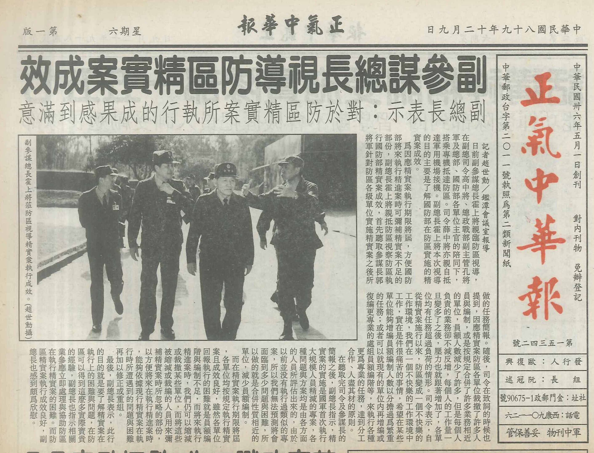

# 00 驗證

「精實案之後，防區已經不是個快樂的工作場所了。」防衛部司令對長官們說。「官兵在這個環境中工作，實在很痛苦。」

那是我這個外島工兵退伍幾個月之後的事情了。因應九十年一月二日開始兩岸小三通—退伍前聽說，小三通的碼頭工程，也是我所在的工兵營做的—八十九年十二月時，防衛部有著滿滿的行程，因為每個星期都有長官來訪。小三通的前一週，來的是國防部伍部長；前兩週，來的是總長湯一級上將，陪同總長來的，還有本軍總司令陳上將、總政戰部主任鄧上將、海軍副總司令常中將、空軍副總司令黃中將、聯督室主任朱中將—我服役期間，我叫他司令—以及參謀本部的許多長官。

在更前一、兩週前，副總長霍上將，在本軍副總司令、總政戰部副主管，以及又一群國防部官員的陪同下，也來到防區，這行人倒不是來關注小三通的狀況，而是來視導在這之前的兩三年間，防區執行精實案的成果，來到太武山上聽取簡報。是的，精實案，打造量小、質精、戰力強的新一代國軍的那個精實案。

防衛部司令薛中將說，精實案期間，防區裁撤了不少單位，也減少了不少員額，但是業務卻不減反增，官兵承受了以往所沒有的壓力。副總長聽取防區報告之後表示，防區的精實案執行成果非常好，在執行期限前順利完成任務，深感欣慰；此外，每個單位都在反應員額不足，但接下來，在精進案當中，國軍仍然可以縮減或裁撤一些單位—所以，如果有個單位說員額不足，工作壓力大，我們可以縮編另外一個單位，另一個單位在縮編後多出來的人（我們稱為編餘人員），就可以被改分配到那個說員額不足的單位，解決員額不足的問題了。

至於這個被縮編的單位是不是又遇到員額不足…總之，副總長對於國軍組織的這番睿智的洞見，總讓我想到一句成語，叫做挖東邊的什麼補西邊的什麼。

這段指示，紀錄在八十九年十二月九日的軍中報刊「正氣中華報」中。

同一時間，我開始在網路上發表我的故事—我的軍旅故事，我的防區故事，我的精實案故事。

