# 15 壯遊

寫於 2022 年九月

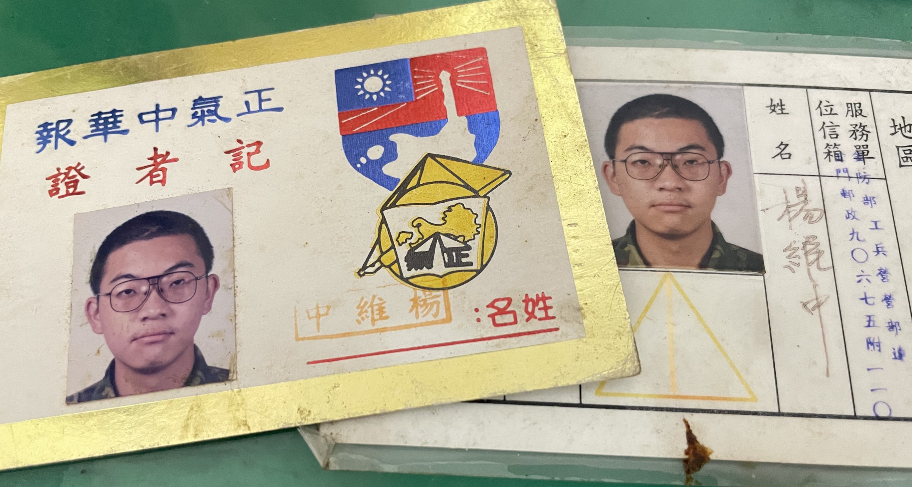

二十年前，我就想過《防區狀況三生效—驗證精實案》，應該會有第十五章，但當時的我寫不出來。

## ▲ 前言

二十年前，我從尚義機場與防衛部一處長官握手告別，搭上Ｃ１３０運輸機降落松山機場之後，我做了一顆炸彈，帶著滿滿的怒氣擲往身後那個黑暗、冰冷，又讓我憤怒的世界。我相信這顆炸彈應該會爆炸，它會在某個我所不知道也看不到的地方、以我不知道也看不到的形式開始爆炸。

我想要炸掉的，是那個基層營連的義務役官兵被層層幕僚文書作業壓到喘不過氣的國軍；是幕僚軍官將自己的業務拋到義務役官兵身上，挪用官兵的戰備與訓練時間，把義務役官兵被埋進簿冊、公文、卷宗、看板、資料袋…的那個國軍；讓義務役官兵承擔軍官責任，又需要承擔士兵懲處的那個國軍；讓某些義務役官兵嘗上業務甜頭，導致基層營連領導統御完全失靈的那個國軍；那個上級單位自己業務做不完，還不斷透過支援調用榨取下級單位人力資源的那個國軍。那個除了無盡業務、無盡空虛與無盡絕望之外，什麼都不是的國軍。

不過，既然我看不到，所以我也不知道它到底炸成什麼樣子，我就念點書弄到一個學位、求職、在職場上生存，中間還經歷一次很大的改行，過我的日子去了。二十年後我重新踏上防區，看到原本應該擠滿阿兵哥的山外街道變成疏疏落落冷冷清清，變得我又熟悉、又陌生，阿兵哥都不見了，給阿兵哥去的網咖、電玩店、紀念品店、三溫暖，都不見了，連司令部都變成只是指揮部了。那個世界真的不見了嗎？是我的炸彈造成的嗎？還是，即使我什麼都沒做，從精實案開始，最後還是會抵達現在這個終點？

在全面募兵制推動之後，役男只需要受四個月的軍事訓練，似乎直接消滅了可以讓幕僚軍官寄生在義務役官兵身上吸血的源頭。訓練一個搞懂各種人事規定與作業流程的參一文書，少說也要三個月，役男在軍中如果只有四個月的時間，勢必難以讓義務役從事幕僚軍官應該擔任的業務。軍隊變成以志願役組成，專業的軍官、專業的士官，還有專業的士兵。

我丟出去的炸彈，是在網路上發表十七萬字的《防區狀況三生效—驗證精實案》。我憤怒地寫著：精實案前後什麼都變了，但是什麼都沒變。可是，過了二十年的時間跨度，又突然發現當中有太多無法忽視的變化。那個時候大家都還只有撥接網路，手機與 ADSL 的發展才剛起步，別說智慧型手機了。但二十年後，科技推陳出新，也夠一個役男變成除役十年的有著啤酒肚的大叔，曾經那想要扣緊現實的十七萬字，也變成了充滿時代感的十七萬字。
早先幾年還有人願意討論，還有人願意記得，那就夠了。

剛發表的時候還有不少朋友討論這部作品。開頭大概就是自我介紹，說我是哪個部隊的文書，《防區狀況三生效》真的描述了基層營連的文書生活，聽說有些部隊把 PDF 檔案列印之後在營連辦公室之間瘋傳，封面還寫上「文書必看列入移交」這種很誇張的標題。

也有人說我放大了我的服役經歷，還有人過得比我還苦，我相信的確如此，但以我的能力，也只能夠寫出我自己的故事而已，我感受到了委屈，但與其說苦，我更覺得我的服役經歷是莫名其妙。人事規定與流程莫名其妙，戰備搞得莫名其妙，各種政策來得莫名其妙，有辦法開始動筆《防區狀況三生效》，也很莫名其妙。

寫出《防區狀況三生效》最初幾個章節，找了個朋友看過，問問意見，他只嘆了口氣。「這種題材喔，唉，你想寫、你有時間寫、又有能力寫，你就去寫吧」。想寫嘛，傷得夠重，就會想寫吧。時間嘛，大多數人在退伍之後該是投入職場，根本沒時間立刻回顧服役的種種，我居然很幸運地在防區服役期間考上碩士班，從退伍到開學之間只有一週，無縫接軌，而求學期間還的確有些時間可以寫點東西。

至於能寫嘛，服役期間，大概是我一生當中智力最低落的時候，長官們也希望你智力低落，可是我居然在破冬的時候，居然意外找回了稍稍能夠駕馭長篇文字的能力。意外地莫名其妙。

我去支援了政戰部的政戰綜合組，成為防衛部的新聞兵。

## ▲ 電話

防區，十一月，一個平凡的星期四，記得那天沒有衛勤，早上看完莒光日，下午收收文、弄弄假單，晚上穿上制式寶藍色體育服，這天居然還洗澡了。快要晚點名前，安官室廣播，叫我去接軍線電話。

「防衛部長官，找你的。」「誰？一處？差假室？」「對方沒說。」接過電話。我應該沒搞砸業務吧？

「長官好！」「你就是楊 ○○？」「報告是！」奇怪的開頭，我需要向上呈報的一處長官，不會不知道我是誰。

說到這個「報告是」。幾個月後，我去報考碩士班面試這關時，一群考生聚在一間教室裡等著助教輪流叫號，助教一樣問到「你是不是楊 ○○ 同學？」我不假思索，大聲喊出了「報告是！」，當時教室裡的考生，包括我未來的同學，都用一種奇異的眼光看著我。看看部隊對我做了什麼。

「你是不是 ○ 大新聞系畢業的？還有多久退伍？距離退伍有沒有超過半年？你有沒有接業務？」我一一回答之後，聽到軍線另外一頭電話放下，還有人回頭說話：「喂！工兵營有個 ○ 大新聞系畢業的，居然都已經要破冬了我們都不知道，這個專長調查是怎麼做的？」後面是一連串常見的軍中髒話。轉頭回來「喂！楊 ○○，你有沒有單眼相機？沒有？你下次返台什麼時候？喔。叫你們連長接電話。」

半個小時之後，被叫進連長室。開頭就是想都沒有想過的話。

「你下個月下業務，現在開始交接，營長會從最近的新兵裡頭挑兩個出來，分別接你營級還有連級業務。防衛部要你下個月返台假回來之後，就去支援政戰綜合組。我等下會去找營長。」

我要下業務了？

## ▲ 下業務

營部連參一的業務確定交給安胖子，再來，就是我的營參一業務。

我平常都是牽著腳踏車就衝上太武山上去，今天得先去山外市區然後改搭藍一路公車，因為我身邊多了一名新兵。帶他進了坑道，告訴他收發要去文卷室，去一處各辦公室處理一下當天該做的業務，順便讓新兵認識該認識的人。

回程必定經過山外，新兵以新奇的眼光看著山外的這三條街，我說，以後你放假就會來這個地方，但現在我們有個購物行程。你還沒有口哨對不對？我幫你弄一個，雖然你現在還不用站哨，但是站哨還有揹待命班，都需要口哨，所以我們胸前都一定會別一個口哨，另外隨時插一支筆。文供站在那邊，防衛部會定時發一些假卡，但如果不夠的話，還是要去文供站。你有幾條綁腿？你有擦皮鞋用的化妝棉嗎？好，學長都先買給你，鞋油也順便來一盒，毛巾肥皂洗衣粉也帶一點好了。

你看，學長對你好不好？

大聲講出來啊！學長對你好不好？

現在學長要給你身上最重要的寶物，這個寶物學長隨時帶在身上，跟錢包、口哨、軍人身分證一樣重要，但是現在要給你了，這個寶物叫做校對章。我們再過去刻一個可以連續出水的級職章吧，對，學長對你好，我們就挑最貴的那種來刻，你在這邊寫上「工兵營參一」，下面寫你的名字，店家就會刻給你。集滿了這兩個印章之後，就可以產生神奇的法力，打開一扇你從沒想過的大門，直通地獄的深淵…。

其實那段時間我還是可以站哨的，可是排長停止排我的哨，我就分別在連部與營部兩個辦公室交接業務，看得約翰心裡癢癢的，也開始從他手上的校訓預士名冊中物色人選，一時之間兩個辦公室的人都變多了，變得熱鬧許多。

沒有衛勤加上返台假的日子過得特別快，我返台休假一趟，十二月一個星期六晚點名之後，其他弟兄穿著體育服在寢室擦皮鞋準備休假、然後就寢，我穿著整套丙種服裝加上毛領夾克，蹲坐在空蕩蕩的連集合場，我一邊是到部以來就沒有拿出來過的黃埔大背包，裡頭是我另外兩套衣服、膠靴、體育服、內衣褲，還有，嗯，一些東西；另一邊是我的水桶，是我的毛巾肥皂還有半包洗衣粉，還有吃飯用的、其實沒有很乾淨的塑膠碗公。

水桶旁邊，則是在這個部隊不太應該出現的黑色相機包，返台的時候帶來的，裡頭是我叔父以前使用的 Nikon F90 相機、閃光燈，一個廣角定焦鏡頭，還有一個變焦鏡頭。

吹著海風，看看這個連集合場，防衛部的小車直接開了進來，熄燈後的一片漆黑中，就只有小車的遠光燈的光亮，行李上手，去往一個距離工兵營十分鐘車程，其實我也很常來的地方，幫輔導長送返台假假單的地方。

隔天我就回了工兵營。

我的腳踏車還在連上嘛！我還用得上我的腳踏車，我得牽走啊！

而且，要我去支援的軍官，昨天晚上看了我一眼，就叫我回連上找經理士，看看有沒有比較像樣的褲子。我的兩條褲子都有補釘，都是搬塊石的時候割破的，整個工兵營誰的褲子不是這樣？破爛的皮靴與衣裳是我們工兵營榮耀的標誌啊！去防衛部一處的時候，也沒有人講話。

新聞官說，去找兩條好一點的褲子。在司令面前，你不可以穿成這樣。

其實我還頂想讓司令看到我穿破褲子，然後問我為什麼。

## ▲ 政戰綜合組

剛來的時候，我不是很習慣這個地方，這個地方的人，可能也不習慣我。

我不習慣這個地方怎麼會這麼爽。對，我是來這裡爽的。我二十年來一直都不太敢講這段經歷，我跟連上一些弟兄都還有聯絡，他們那時候就知道我很爽，去防衛部哪有不爽的，但他們不知道我有多爽。

我的新工作可以叫做新聞兵、新聞士，但是通常都被長官叫做照相兵，總之是新聞官的文書。我不可能看到防衛部的編裝表，但感覺起來，新聞官底下應該沒有文書編制，但加上我，他有四名文書。就跟參謀分參一二三四，政戰一樣區分政一二三四五，我的工作屬於政二，而防衛部將政一二五合併成政戰綜合組，簡稱政綜組。

政戰部有一棟自己的獨立辦公室，政綜組在一個開放辦公室裡頭，政三四在各自獨立的小房間。軍官睡在旁邊一間，嗯，忘記有幾層樓，總之就是長得像水泥集合公寓的軍官大樓裡頭，軍官都睡在二樓以上，一樓有兩個房間，政戰部的其他阿兵哥像傳令、駕駛、處理政戰人事的文書，在另外一頭，另一個房間睡了四個新聞兵，外頭寫了面招牌，說，這個寢室也是報社。

政綜組組長養了一條又大又遲鈍的狗，政三四則養了好幾條又小又兇的狗兒，就算是政綜組的人接近都會狂吠不止，平常看到的也都是一群小狗在欺負一隻大狗。政三政四養的狗，真的特別會咬人。

新聞兵的房間又有一道牆格成兩區，內側是寢室、外側則是我們的辦公區。寢室有兩張雙層的行軍床，一張床睡了兩個大我四五梯的下士，雖然梯次這麼近，畢竟新來乍到，還是叫了學長；另外一個比我菜的下士讓我睡下鋪，四個人都來自不同的部隊。比我老的那兩個下士已經自己拿美工刀拆了臂章裡頭的圖案，變成了在防區代表尊榮身分的空三角，我也可以這麼做，但沒有，我不確定是不敢還是不想。

辦公區擺了四張有玻璃桌面的辦公桌，一人一張，另外就是電腦、印表機、衣櫃與一些文書櫃，還有用來放置相機與底片的防潮箱，攝影器材當然都是照相兵自備的。我的桌上通常堆著文具，用來畫版用的蠟筆、長尺，計算版面字數用的計算機，還有一台方塊形的、長著伸縮天線、大概只有五六吋的黑白迷你小電視，是開始來支援的時候，從留給我的櫃子裡翻出來的，不知道是什麼前人留在這裡，可以拿來看些三台的新聞，但是訊號很爛。

喔，對了，雖然現在是冬天，還是可以提一下，這個房間有冷氣。我們睡覺有冷氣。

整個一樓不到十個阿兵哥共用一台洗衣機，洗衣服不用跟人搶，房間裡頭有自己的浴室，用的是電熱器，不需要等到有人燒鍋爐，什麼時候都可以洗澡，平常軍官也不太會來看照相兵的內務，我後來很多時候根本沒有折棉被。剛踏進這個房間，我還真恨防區怎麼專長調查這麼不確實，不然我剛下部隊就可以直接來這邊爽。

照相兵還有其他支援政戰部的兵，每天早上先穿運動服，跟著軍官一起升旗與早點名，然後在太武山的山路上，跑個精實的…一千公尺。通往政戰部上的路植滿楓樹，入秋之後，沿途就是一片通紅，跑步的時候會看到其他部隊—也不確定是本部連還是通信營—的弟兄在掃落葉，都覺得不好意思。

我帶來的膠靴鎖在櫃子的底層派不上用場，而在連上吃飯要自備碗公，到了政戰部也用不上，自從離開新訓中心與壽山前運站，還有一次在花崗石醫院之外，我終於又用上了餐盤吃飯，而且不用自己洗；碗公就一直只留在房間裡，只有趕不上吃飯時間，自己弄點東西吃才用用到。由於在連上是自備碗公，大家的碗公也洗得不怎麼乾淨，連上還有個規矩—在別的地方。人們舀湯的時候，大概會盡量避免把湯灑出大湯鍋外，但在工兵營營部連，則是寧可把湯灑出去，灑到連集合場的水泥地上，也不要讓經過某個人的髒碗的湯汁流回湯鍋中，污染整鍋湯。

換好衣服之後，就開始一天的工作，週四不用看莒光日，晚上九點晚點名，但週六晚上通常沒有晚點名。

照相兵的工作以日與週為周期。每晚政戰部會收到司令與副司令辦公室的通知，知道隔天的行程，然後派人去拍照，長官去哪裡，你就去哪裡，由於主要活動都在上午，下午就去山外沖洗照片，由於沖印行靠近山外心輔室，等照片沖洗的時候，還可以去心輔室喝喝茶、聊聊天，嗑幾顆心輔室固定會準備的貢糖，培養對於這種用花生做成的零食的真正品味—好的貢糖要帶來香氣的滿足，所以，除了蒜味竹葉貢糖之外，其餘都是邪魔歪道。

有時高賓來訪，還需要製作相本，這點容後再提。

以週為單位的工作，則是編輯一份叫做正氣中華報的軍中刊物，有四個版面，每周六發行，所以每周六各部隊的政戰文書要跑來政戰部一趟領取我們編的報紙還有其他政戰宣傳物，你看這國軍是怎麼使用人力的。

防衛部自己當然沒有能力印刷報紙，是與當地的地方報社合作，報社屬於縣政府，位在成功，那個地方以鍋貼以及一棟美麗的白色洋樓著稱；每天的拍照任務也是採訪任務，把各位長官慰勉官兵的話抄回來，不過我們通常也會先拿到講稿。

所謂的「採訪」工作很多集中在週一，像是司令講話、主官佈達、戰備演練，都在週一，之後回來寫稿，週二就就要拿舊報紙畫版，以及把一些各部隊用稿紙寫成的稿件打成電子檔，存在軟碟片中，晚上十點，其實已經是陣地關閉時間，我們帶著騎機車把版面與文字檔交給報社的一位許先生，請他用北大方正排版軟體製作大樣，大約工作到十二點回政戰部休息，拿到大樣之後，週三我們會開始校對是否有編輯錯誤之處，新聞官也要上簽，向大主任請示修改意見，在核可之後，一樣要在陣地關閉時間前往地方報，請對方調整，最後送印。

這時候阿兵哥外出其實是違反規定的，可是報社都是在半夜工作，我要是大膽一點，也可以半夜在營區外逗留，但陣地關閉的防區其實也只是一片死寂。半夜在地方報社工作後，隔天早點名可以報補休。

新聞兵有兩台軍綠色的打檔車，是在防區各地執行拍照任務，以及前往報社的主要交通工具。我們統一在環島南路上的加油站加油，軍用車輛去加油有一些特別的規定，可是我忘了。我在支援政戰部期間，沒有看過這兩台車進廠保養過，據我所知，這兩台車也沒有帳。

這份刊物也有上下級單位之分，下級是四個聯兵旅與兩個指揮部的新聞兵，會提供跟他們部隊長相關的報導—我們會刊在報紙的二版上—還有各單位投稿副刊的稿件。同屬政戰部的心輔室也會提供一些文章。我們刊載在頭條的稿件，還會再供稿給龍潭的總部，他們有另外一份宣傳刊物，叫做忠誠報。忠誠報的編排特色是什麼可以用在版面上的東西統統用上去，像是會用上古印體或隸書體編排報導內文，然後所有可以用色塊襯底的地方，都要有顏色。

來說頭版。別的地方怎麼編輯頭版可是大學問，我求學時所知道的新聞學的核心，就是決定什麼新聞可以變成頭版頭條，不過，在更後來的網路時代裡，這種新聞學、還有怎麼做報紙的技藝，看起來也是很具有時代感的知識。軍中刊物簡單一萬倍，反正就按照軍階排下來就對了：頭條司令、二條副司令、三條是大主任，還有空間的話可以塞一下參謀長。不過，如果有長官的長官，頭條還是得讓位。

寫作的時候，反倒有其他的重點—不可以直接稱呼每個部隊，而是要用另外一個代稱，像是五五六六部隊、七七八八部隊之類的，後來又改成可以寫虎軍部隊、誠實部隊之類的，明明所有人都知道那是哪個部隊還要故作神祕，其實有種微妙的喜感。我那時候就想，如果我要寫點什麼軍事喜劇或搞笑的題材，就應該用上這種風格。

另外就是些行政雜務，像是跟沖印行結算沖洗與膠卷費用，造冊呈文把副刊的稿費請下來…等等。如果稿件成功登上副刊，可以獲得新台幣一百元的稿費，但是要去申請這筆費用，必須先造一份稿費清冊，上面要蓋上阿兵哥的印章，我們總不可能跟各部隊蒐集了印章再去請款，所以就先幫作者先刻了印章，一顆印章四十元，所以作者最後實際可以得到六十元，還有一顆印章。稿費要親自來防衛部領取，不過防區離島部隊的官兵，按規定不能來本島，我也沒看到本島部隊有誰來領稿費。

總而言之，這個單位就是—太爽了啊啊啊啊啊啊！在連上的業務世界亂得讓我覺得不真實，這個單位爽得讓我覺得不真實，爽到我自己都覺得這個單位應該要裁撤掉。

新來乍到，這個單位看起來又不太會管理我生活作息，在這份刊物上，我也應該可以榨取出些什麼。總之，我現在得先訂出我的個人計畫。

## ▲ 計畫

我必須先在這個地方立足。然後，我已經破冬，接下來要破金冬了，我該為退伍以後打算。

一月一日，新的命令下來，役期直接統一縮減到一年十個月，我再扣掉大專集訓，就變成一年九個月，算了一下，退伍時間就是九月二日，這樣就有機會趕上開學。約翰去考公費留考實在也讓我心癢癢的，上次休假的時候跟約翰在山外會合，他已經在看要申請哪些國外學校了，讓我也還想再去唸個碩士；報名簡章叫學校寄來部隊沒什麼問題，我也可以在政戰部準備自傳等材料，可是，考試一定得返台，碩士班分筆試與口試，我只剩下一次八天的返台假。

因應役期縮減，防區也取消了最後一航次的返台假，原本總共四十天的返台假，變成總共三十二天。

只夠報考一間學校，而且得拆假。八天的返台假可以拆成兩次事假，剛好排在筆試與口試時間，作業會比較麻煩，不過現在參一是我徒弟，去年又一整年跟差假室往來，想唸書這件事情還算正當，總有辦法的吧。

我在軍中不可能做任何考前準備，只能硬著頭皮考。我想唸的學校在台南，筆試這部份，學校安排了台北考場，沒什麼問題。但如果幸運進入口試，就頂辛苦的—返台還是得先看一下父母，所以當軍包機九點多落地，先回家吃個飯，準備一下文具，下午稍微補眠，坐晚上十一點多最後一班火車南下，到台南大約是第二天早上五點，可以在勝利路或是育樂街休息一下，然後應試，考完之後再馬上搭個六小時左右的火車回台北，應該還是得補眠，如果能看看其他親戚朋友最好，因為第四天下午就要返防了。

聽起來是個極限行程，必須要有備案，考不上的機率太高了。

以我的所學來看，我很有可能會去新聞界找工作，那我得盡早恢復編輯以及寫作能力，我的打字速度沒受到什麼影響，天天打呈函令稿，不是問題，有問題的是文字的組織能力。最好還可以累積一些作品為面試加分。我後來去念碩士班，才發現英文根本忘光了，用了碩一一整年才把英文補回來，那是更之後的事了。

不過我得先在這個單位裡頭站好腳跟，搞定新聞官，還有同一個寢室的另外三個人。

剛開始支援的前幾天我就搞砸了。我的黃埔大背包帶了半罐沒吃完的肉鬆，還有沒喝完的防區特產。同一個寢室的人對肉鬆沒什麼意見，去口福麵包買了條吐司，三口兩口把肉鬆吃掉。

去年十一月知道要支援政戰部之後，有次下午跟徒弟經過山外，一時興起買了罐肉鬆，晚餐時間在中山室，弟兄們看著電視、用碗公扒飯的時候，我就很招搖地在全連面前拿出肉鬆，往我的碗公灑，自己幫自己加菜，這個舉止讓我變成中山室的焦點。連長從軍官桌上起身，走到我身邊，看了我兩眼，拿起我的肉鬆—我不知道他要做什麼—回頭回到軍官桌上，自己碗裡也灑了一點，然後把肉鬆還給我，匡的一聲，把鐵罐放在鐵桌上。

我覺得在連上幹這種事，已經很節制了。我平常就多買些麵包，連上有人晚點名之後開小伙，其實我不太去的。我那個時間得登文啊！

防區特產就比較麻煩了，被報告到新聞官那邊。防區的冬天那麼冷，然後以工兵營的標準，我已經是最不能喝，最節制的兵了啊，而且我也不是沒看過防區軍官自己喝成什麼樣子。總歸是新來乍到，可惜了，倒掉吧！可惜了，我那微薄的薪餉啊！

更麻煩的是其實我並不擅長攝影，技能點數沒有點到那邊，入伍前就沒有碰過幾次單眼相機。我在學校所修的學分大多是文字採訪編輯相關，另外就是一些因為學電腦桌上排版軟體而接觸的電腦知識，像是當年出現了瀏覽器軟體，所以學了一點最早的 HTML，做了所謂的個人 Home Page，還有一點 C 語言。反而是到了政戰部，我才非得使用單眼相機拍照不可。

在進入二十一世紀的前幾天，我就很快搞砸了。一月第二週，司令一場演講之後，返台休假，可是我那天拍的照片全部失焦，雖然我學到教訓，以後只要是長官的照片，統統用廣角鏡頭，拍攝過程全都不變焦。但問題是，當周就變得沒有照片可用。

我在課堂上學到，如果我在照片的周圍加上一圈比較重的黑框，其實可以掩飾照片的瑕疵，我這麼做了，但看來沒辦法說服同一個寢室中的另外兩位下士。他們的技能點數倒是整個點在攝影上，平日在房間裡頭，聊的就是各種攝影器材，在防區哪裡可以弄到一些特殊感光度的膠卷，休假的時候可以去拍些什麼，有些用自己的膠卷，大部分用公家的膠卷，然後把部隊跟自己的照片一起拿去沖洗。

他們跟新聞官報告，「拍出來的照片都失焦了！什麼 ○ 大新聞系！真的不行就丟回工兵營吧！」

這個批評聽起來事關母校聲譽，而攝影記者抱怨文字記者不擅長攝影，這種事大概只會在軍中發生吧？我沒多注重母校聲譽，但我已經決定要報考碩士了，如果我不能在這裡立足，這時候回到連上，會導致計畫生變。

我需要一個立足點。兩位下士只想拍照，就樂個輕鬆，另外一個菜鳥還有行政工作，我就自告奮勇，以後畫版我來，危機感讓我得拿出一些真本領，各種平面出版品的版面知識這方面，我好歹在學校修過十二個學分。我先看準三版副刊，我要先讓副刊變成我的遊樂場，拿出耳目一新的副刊。

## ▲ 副刊

以一個修過編輯課程的新聞系畢業生來看，就算這只是一份少量的軍中刊物，也實在太不用心了。這份刊物的副刊完全沒有用到吸引讀者的編輯手法，就只是把內文跟標題統統丟到版面上，滿滿的都是字，平面排版需要注意的閱讀視覺動線、標題的濃淡搭配、吸睛的插圖…統統都沒用上。

更不要說版面上最困難的元素，會不會、敢不改、有沒有想到使用這個元素，完全可以展現版面的高下之分，那就是留白。我現在想要在版面上搞事，要搞就搞大的，我要搞個這份刊物上從來沒出現過的大面積留白。

來稿紙堆中看看有什麼可以用的稿件。弟兄們，你們的稿件會不會登上我的副刊，重點不是你文章寫得好不好，全防區寄來的稿件，我都覺得差不多，而是這個星期我想搞什麼事。嗯，這幾篇看起來還可以，先留著，但這不是我要的。我想要的文章是，在文字中就帶有視覺性，讓我可以用具備衝擊性的視覺元素還有留白搭配這篇文章，我要嚇死你們。

這個稿件有點意思，〈生命中的驚嘆號〉，好，那我就用個版面中的驚嘆號來回應你。

整個版面我要用扇形編排，其他文章置於左右兩側，標題使用仿宋字，這樣才可以凸顯正中央的頭條。我給這個頭條將近一半的版面，但其實內文的部分只佔這塊空間四分之一左右，但一篇文章在版面大小，本來就不是按照字數決定的，是按照重要性決定的，是由編輯希望讀者第一眼看到什麼，然後讓讀者願意繼續閱讀內文決定的，是由編輯的意圖決定的。在留白的正中央，我要做一個十公尺以外都能看到的驚嘆號！

地方報電腦室的那位大哥拿著我畫的版走出房間，氣急敗壞的找我，「那個軍隊裡頭新來的！你畫的這是什麼版？」

當我們把稿件與版面帶去地方報之後，會先在電腦室門外等候，等到上機排版做的差不多，列印一份大樣出來，我們再校對一下標題有沒有打錯字，確認無誤後才會拿回部隊讓新聞官上簽。但是他現在才做到一半，就出來找我。「我看不懂你這個鬼畫符的版！你給我這個東西，是不是要讓我不能下班？你中間這一大塊是什麼意思？」「我想要留白。」「報紙版面這麼珍貴，你要拿來留白？」「對。」

「然後這一大塊黑黑的又是什麼？」「我希望拉出一塊黑色有圓角的區塊，上面標題反白，用圓體字，雖然顯眼，但卻是比較柔和的造型…」「你別說了，你進來電腦室，你告訴我你要怎麼做，我做這行十幾年，就是沒看過你這種版。」

我們比平常多花了一個小時排版，平時十點鐘來，十二點鐘走，這天搞到一點。我還記得大哥臉上表情的變化，首先是氣嘟嘟的，氣的是身邊這個新來就在亂搞的小子，氣的是讓他晚下班，隨著電腦螢幕上成品慢慢成形，他的表情變得困惑，他好像慢慢搞懂我想要他做出的是什麼東西，還有我為什麼得畫出那個他看不懂的版，他好像想跟我說些什麼，但他對我的氣頭還沒完全消。大樣列印出來，我確認無誤，他又拿回那個大樣，左看看，右看看。

就是這個版面，生命中的驚嘆號。

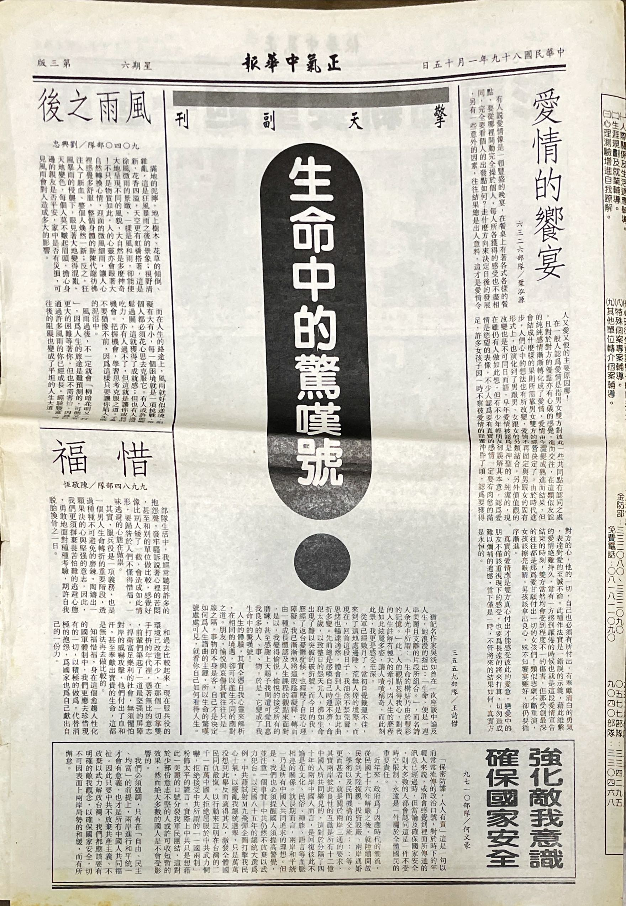

與前一期副刊比較一下。

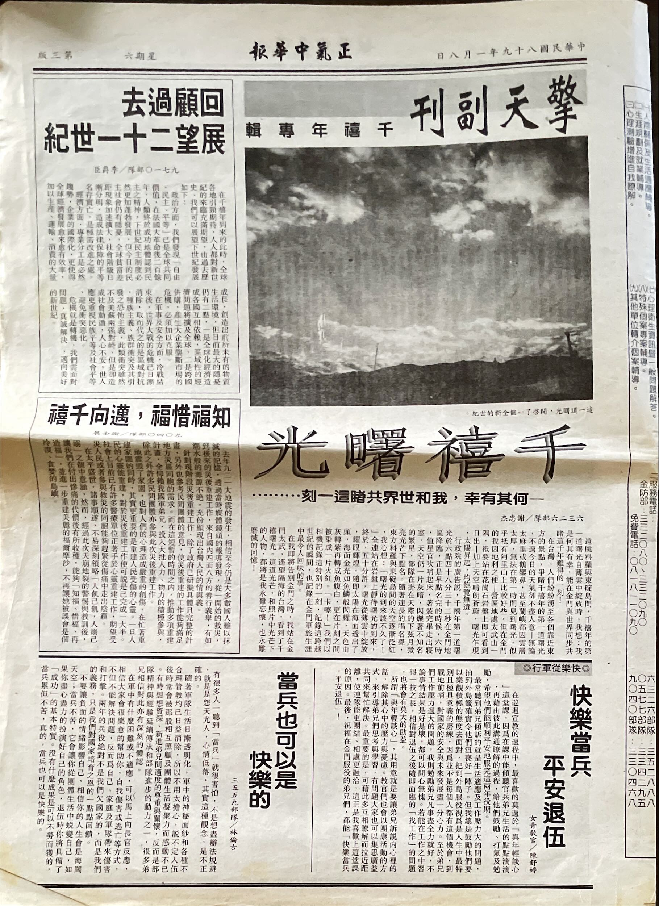

我不知道全防區有多少人注意到我做了這個版面，但是新聞兵寢室裡頭的人都看到了，新聞官看到了，各旅也看到了。隔天週六，我去山外拿照片的時候，被南雄旅的新聞兵叫住，是個。「你就是那個防衛部新來的新聞兵對嗎？」應該是我停在沖印行的機車，還有防衛部直屬營連的臂章讓他交叉比對出我的身分，「今天那個副刊是你做的對不對？我就知道一定是不同的人做出來的，防區終於來了一個會玩版面的人了！」

我都已經快要破金冬了。

這個菜鳥後來在電視台從事體育播報工作，好像二十年都在同一家電視台，應該也發展得很不錯。

這個版面還是太刺激，後來我還是回來使用比較保守一點的版面，也比較符合地方報那些大哥習慣的工作方式。我後來畫版的方向，對於每個區塊的字數控制與大小要求不那麼嚴格，讓我畫的版與他們實際上機做出來的東西，就算有些誤差，看起來也不會太奇怪。太刺激的東西還是偶一為之，不然會產生美感疲勞。

不過一些基本要求還是要有的，版面的重點、還有文章間的主次關係必須做出來。我需要圖片豐富版面，而圖片又必須能夠搭配文章主題，我在軍中也沒有圖庫可以使用，那就自己畫插圖吧，這也是寢室裡頭幾位沒有點過的技能吧！過了一週，接近農曆新年，主題是「每逢佳節必思親」，我繪製的插圖第一次在正氣中華報登場。

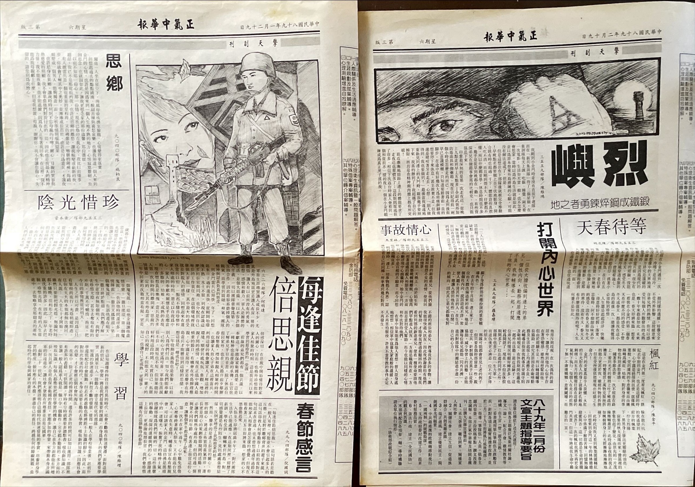

為了保持副刊的水準，我必須花更多時間，副刊又沒有時效性，所以我就索性將編輯副刊的時間改成週日晚上。週日白天休假，其他人可能騎機車四處拍照，我騎著我的單車去山外，可能跟約翰會合，也可能就直接溜回連上，連上總有留守的衛哨與待命班可以聊天打屁。晚上就回去做副刊，後來我連續兩個月返台，有幾周就把編副刊的時間拉到更早，一個週日就連做之後兩週份的副刊。

而我在這期報紙，做出副刊加上插圖更大的變化，就是直接把四版變成了專題報導。

## ▲ 專題報導

時間跳到 2022 年。2019 年開始，縣政府開放大膽島觀光，我認真研究了大膽烈嶼跳島遊網站，發現大膽島的觀光路線很有意思—這哪是什麼觀光路線，這就是防衛部司令的巡視路線！因為 2020 年之後的肺炎疫情，縣政府長時間關閉了大膽觀光，實在很可惜。2022 年九月重新開島之後，我趕緊搶了個名額，十月終於又登島一次。

我很想找個還有聯絡的連上弟兄，一起走一趟大膽，玩一場巡視大膽的家家酒，真可惜這趟其他弟兄時間沒辦法配合。你當司令走最前頭，我當旅長隨侍在後，我們可以想像後面還有防衛部的大主任，後頭又跟著一大批軍官，包括大膽部隊的主官、旅部與防衛部的參謀。我們先在碼頭上岸，走過那面寫著「鳥抓人不抓」的心戰牆，接著，你走到哪裡，兩側的阿兵哥不管在做什麼，可能正在清掃環境，都會跳起來立正敬禮：「司令好！」

在這片浩浩蕩蕩的隊伍中，有個照相兵跟著跑跑跳跳，平常他跟在隊伍後頭，但是當司令停下來，開始對幕僚講話，他就得跳出來，拍攝司令的鏡頭。

大膽分成北山與南山，之間用沙洲連接，然後整個構成一個海灣，裡頭停滿了…對岸的船。其實你搭飛機前往防區的時候，就會先經過二膽、大膽，你可以從天上看到整個大膽的全貌，也可以看到這些船。我們搭乘悍馬車駛過沙洲，從南山前往北山巡視一圈之後回來，最後抵達還在軍事管制區中、無法進入的大膽觀測所，有個房間有著無敵海景，擺著幾張師爺椅，司令、大主任、旅長對著這面海景坐著，軍官在長官們身後排成一圈。而我們的家家酒現在需要一個道具。

那是我第二次去大膽的事情，當長官們坐下，就看到阿兵哥端上有蓋子的茶杯，還有一盤點心。新聞官拉了拉我的衣服，小聲說：「你知不知道他們吃的是什麼？你一定不知道大膽的特產是什麼對吧？」當然不知道，而且，我需要特別知道我吃不到的東西嗎？「那是大膽伙房自己製作的綠豆糕啊！」

幾位長官其實根本沒有動那一盤點心就離開了。但如果我下次再登上大膽，我想去試試看那個綠豆糕的味道，其實我覺得所有地方的綠豆糕味道都應該差不多，但就是很想知道弟兄們端給司令、端給長官的是什麼味道。離開播音站之前，我還回頭看了桌上的綠豆糕兩眼。在精實案、精進案、精粹案之後，大膽即使還有少量駐軍，但伙房或許再也做不出綠豆糕了。

第一次去大膽還有防區各個離島，倒沒有這麼從容。要過年了，司令這趟的目的是要慰勉離島官兵，要去的地方還不少，包括大膽、二膽、東碇、草嶼、后嶼，所以搭著海龍的小艇一上島，就直奔中山室，離島弟兄早就在中山室等著了。新聞兵裡頭，就只有我這個新來的還沒去過離島，那就是我了。這趟行程的內容我就在此掠過，請參見一月二十九日我在正氣中華報四版的專題報導，我重寫一次，應該還是差不多。

我回到政戰部，直接跟所有人講，我們的四版也是一整個不行，我要改掉。

我想要喚醒我在系上選修的另外十來個採訪寫作學分。

正氣中華報的四版原來叫做「防區剪影」，就是很隨便的把幾張照片擺在版面上，這哪是新聞版面的水準，根本就是犯罪筆錄最後面的證物照，我們到底是在做報紙，還是在做筆錄？九月我就要退伍了，我想現在做點可以讓我之後方便找工作的作品，這種東西哪有辦法讓我找到新聞界工作？我要改成專題報導。

這是我在防區第一次出海，從水頭碼頭出發，乘風破浪，讓我激盪不已。這整個行程充滿動感，我也該用一種充滿動感形式，重現這一段旅程。我們是報紙，不是影片，我們沒有連續的影像可以表現動感，但如果我用連續的照片，應該可以一定程度再現出某個動感的場景，但最主要還是在學校學過的—用文字「寫現場」。

大四做過最後一次專題報導的作業之後，就沒有寫過要「寫現場」的報導，但現在就是個該「寫現場」的時候。所謂「寫現場」大概是：雖然我跟司令就在同一艘船上，但現在，我不是他的阿兵哥，也不是一個需要吃飯睡覺的人，我就是一雙不帶情感的眼睛與一支不帶思想的筆，寫景色、寫對話、寫行動、重現當時，讓讀者自己判斷當時的氣氛與情感是什麼。

要「寫現場」其實很吃對於當時畫面的記憶力，當時發生了什麼，如果你沒記住，你之後就寫不出來。能夠鍛鍊「寫現場」的方式只有一個，就是寫，一直寫、一直寫。新聞系能教的，也就只有這些。

我要寫一月隆冬裡海上的風浪，寫司令搭著怎樣的船，寫船上的那些口令，寫中山室裡頭擠滿了人多熱鬧，寫因為中山室就是這麼小，所以司令與阿兵哥的距離有多近，寫司令與阿兵哥的對話，喔喔！司令與阿兵哥還有肢體互動呢！好煽情的素材啊！

「喂！你怎麼會連續用三張差不多的照片？我們沒做過這種東西！」

我連續拍了三張照片，司令先是近距離跟一個阿兵哥講話，下一步居然是幫阿兵哥扶正小帽，接著對後面的阿兵哥講話。如果版面不夠，我會只挑扶正小帽的那張，因為這是這三張照片中的高潮，可是三張照片起擺出來，就會產生一種延續的感受，司令會不會幫第二名弟兄也扶正小帽呢？還是有其他的肢體互動？有了第二名弟兄，還有沒有第三名呢？對，懸念，沒講出來的故事比講出來的還多。我要這三張照片，放上去。

「喂！最後這張根本就沒有拍到司令的臉，這種照片你也敢用喔？」

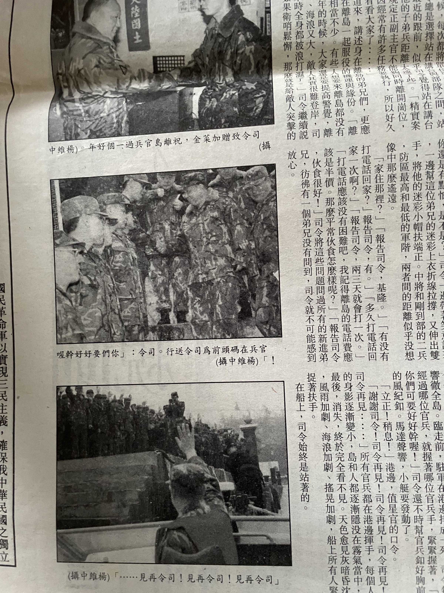

「這是岸上弟兄告別司令的照片，我已經在船上，就只能夠拍到司令對著弟兄揮手的背影。我要能拍到臉，就只能夠從岸上拍，你是希望我留在島上不要回來是不是？而且這樣拍，要不就是只有一堆弟兄的背影遮住司令，要不就是司令背後是一片大海，這是什麼鬼照片？」

「我們從來沒用過沒臉的照片啊！」

「這整個專題都在講司令，版面中有八張照片，中間又有連貫的關係，七張有司令的臉，你覺得誰會看不出來第八張照片裡頭的背影是司令？你是不是太低估國軍弟兄的智商了？」

有一點我還真的很佩服司令，風浪那麼大，所有軍官還有我一個兵都只能坐在船上，他在船上卻簡直像得了膝蓋不能彎曲的病，總是直挺挺站著，看著前方的海。

標題是「司令離島送溫情」，你只用幾張像證物照的照片，怎麼有辦法表現溫情？溫情是口號表達不出來的，是言語和行動中洋溢出來的。新聞官跟我說，這是他在軍中所看過，最肉麻、最濫情的一篇報導，但我卻寫得很開心，我感覺有股力量重新回到體內—我的寫作速度恢復了！我的寫作訓練回來了！我的「寫現場」回來了！

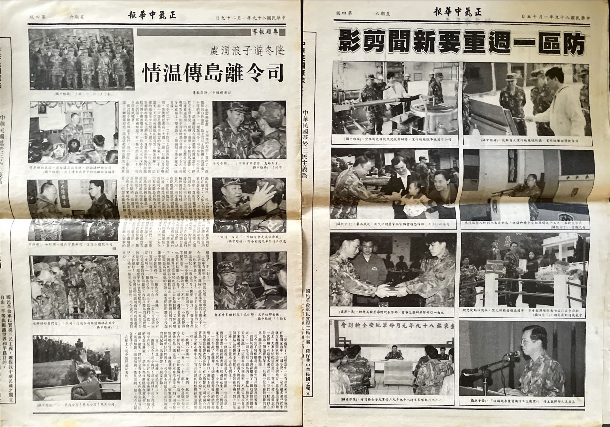

比較一下原本的新聞剪影。

四版現在也是我的了。服役期間，我去過防區超過半數的離島，但每個島上的停留時間都很短，大概最多獃一個小時，就搭船前往下一站，每次出發的港口也不一樣，去大二膽等西邊的離島，是從水頭碼頭出發，像是去北碇等東邊的離島，則會從我熟悉的新湖漁港出發。除了大膽之外，我印象最深刻的，就是北碇那個壯觀的白色燈塔了，一登島，就可以立刻感受到那座燈塔的巨大感，我不知道我今生還有沒有機會，在北碇島上，仰望那座燈塔。

接下來就過年了，政戰部除夕晚上也有簡單的加菜，回到寢室之後，原本嫌棄我攝影能力的下士，喝了點防區特產（其實你們也有在喝嘛！），醉茫茫的找我，跟我說，他之前看錯我了，現在他才搞清楚，我的專長到底在哪裡，你的報導寫得不錯，你的版面也很不錯。

謝謝你，我很開心。在防區很少人誇獎我。

我拍照實在不太行，但我學過怎樣的版面上使用照片。我覺得我們關係還可以更好一點，我們應該可以一起搞點事，培養一下革命感情。

初一初二中午回連上開心吃加菜。過年雖然是假日，但大過年，整個山外也沒什麼開門的店家，部隊在中午也辦加菜，但政戰部居然中午沒有供餐，軍官都去外頭吃飯，其他新聞兵也各自想辦法，但我就騎上單車回連上大吃一頓。因為精實案編成之前很少撥補士官，之後卻來了大批校訓預士，工兵營大量送訓，於是士官都是菜鳥，一堆老兵在中山室吃吃喝喝，一堆下士班長在打飯洗餐桶，我也可以加入他們，但應該會有人阻止我。那頓喝得亂七八糟，算了，這裡是工兵營。

加菜就是要回連上吃，要跟迷彩服上都是補釘、藏青汗衫總被水泥弄得灰濛濛的大夥吃，和一起製磚、出公差的弟兄吃。跟軍官吃加菜多沒意思。

## ▲ 基層部隊巡禮

「學長，你想不想多去幾個不同的部隊看看？」我問隔壁的下士。

「什麼意思？」

「學長也快退伍了，接下來應該也會去找攝影相關的工作，也需要累積攝影作品。我們現在大概都是拍些司令、副司令他們講話的照片，然後學長休假會去拍些風景啦，用長時間曝光表現閩南老建築質感這類的作品，但我覺得我們可以一起弄些不同的東西。況且就算防區就這麼一丁點大，我們很多地方也沒去過。」

「你繼續說。」

「總部在忠誠報上面，有一系列部隊巡禮文章，我覺得他們應該是叫各部隊供稿的，但沒差。四版現在被我改成專題報導版，其實很缺稿件，前幾週我都在硬掰出一些跟裝備保養有關的文章，有點掰不太下去了。我覺得我們也可以搞一個自己的部隊巡禮，學長攝影，我負責採訪寫作與版面，這樣報社有稿件，防區弟兄們也可以難得登上我們的版面，各部隊輔導長有成績，新聞官也有成績，學長跟我也都可以累積作品，豈不一個美哉？特別是…」

我停了一下。

「有些照片不在防區還拍不到，學長想不想拍一些海龍蛙兵的擺拍？」

我打動了他，但我們就只是個下士與一兵，要跑進人家的部隊裡頭，還是需要新聞官的力量。

新聞官核可了我們的計畫，通知防區各部隊的輔導長，調查哪些部隊有意願準備應付這系列專題報導的工作。我們要過去採訪，對方也需要準備，你不通知就直接跑過去，人家也搞不好出任務去了；你想要在報紙上展示那些國軍裝備，對方就需要陳列裝備，你想要報導部隊操練，對方就要集結全副武裝的部隊。

調查下來，可以去的部隊沒那麼多，但如果我們把遇到重要假日的那幾周，都變成專刊，像是母親節專刊、端午節專刊之類的，我們可以採訪的部隊，大概可以支撐三、四個月的稿量，但後來有次我真的完全擠不出東西出來，拿著相機，把我的衣服丟進水桶，拿到軍官大樓一樓的洗衣機旁隨便亂拍幾張照片，掰了一篇「怎樣寶貝你的迷彩服」。我自己洗衣服根本都是隨便亂洗，有時候草綠汗衫放在水桶泡水，還可能幾天都忘了拿，而且我心知肚明，想要寶貝你的迷彩服，第一步就是不要分發到工兵營。

我當時在想，如果真的再想不出寫什麼題材，就自暴自棄回去做新聞剪影算了…可是，就像前面說過，我想拿這個作品找工作。還好，後面幾周我從自己的工兵營挖出了點東西，司令又去了一趟離島，讓我有題材可寫。

我們來訂個計畫。週一到週四，我們大概都有司令等部隊三長的任務，大多在上午，同時三四也差不多要編輯頭二版了，最適合去採訪的時間是週六—週六上午本來就是裝備保養時間，三長也沒活動，所以對方部隊本來就會陳列裝備，然後我們請對方輔導長協助我們做些示範，一個上午，就可以完成採訪。

拿著剛拍好的照片去山外沖洗，回政戰部吃飯，下午去拿沖好的照片，就可以開始用照片構思該怎麼寫報導。跟副刊不一樣，副刊是我需要生出圖片搭配弟兄們的文章，而這種有極大比例在「寫現場」的文字，先看到照片會比較容易發揮：照片拍到的，就是文字裡頭提到的，就算還不知道整篇文章要怎麼組成，都先把「這是什麼照片」寫下來，接著想辦法生點文字連接這些破碎的片段，通篇重讀一次，遇到不通順的地方，改，兩千字的稿件我大概可以在二到三個小時內完成。然後畫版，這樣在週一下午或是晚上，我就可以做完整個四版。

第一站我們要去哪裡？兩棲營啊！就因為有人想拍照，才開始這個系列的嘛！

實際去兩棲營採訪的時候有點失望。現在才三月，天氣還是冷得要死，海灣上空烏雲密佈，兩棲營弟兄還是穿著迷彩服在海邊訓練，而不是打著赤膊穿著紅色小短褲，我們完全拍不到原本期待的陽光、沙灘、肌肉、汗水這種充滿男性費洛蒙與睪丸酮的照片。我們原本還想在拍攝搶背運動的時候，故意說我們沒拍到，角度不好，故意叫人家多摔幾次…。天氣真爛，但來都來了，我們就繼續完成既定的採訪任務。

文字方面，我先「寫現場」，描述照片中出現的是怎樣的場景，接著讓部隊長登場，先解釋現在正在做什麼，再來就可以繼續深挖，之所以要做現在這項訓練，背後的原因自然是兩棲營負擔的任務…從一個小的點、小的場景出發，慢慢寫出部隊的故事，最後隨便寫個意義不明但是看起來很有力的結尾。後來我發現很多商業報導也是這麼寫的。總之—搞定，出刊，收工！

五月的時候，兩棲營有一個叫做余國輝的二兵，在泳訓測驗補測時失蹤，過了七天才被打撈出來。我不知道我去採訪的時候，余國輝是否也在行伍當中，也不知道我是否留下了他的身影。公祭那天我跟著政戰部的長官去了，好幾個單位的長官輪流致意，我看到我們營長代表防衛部直屬營連。

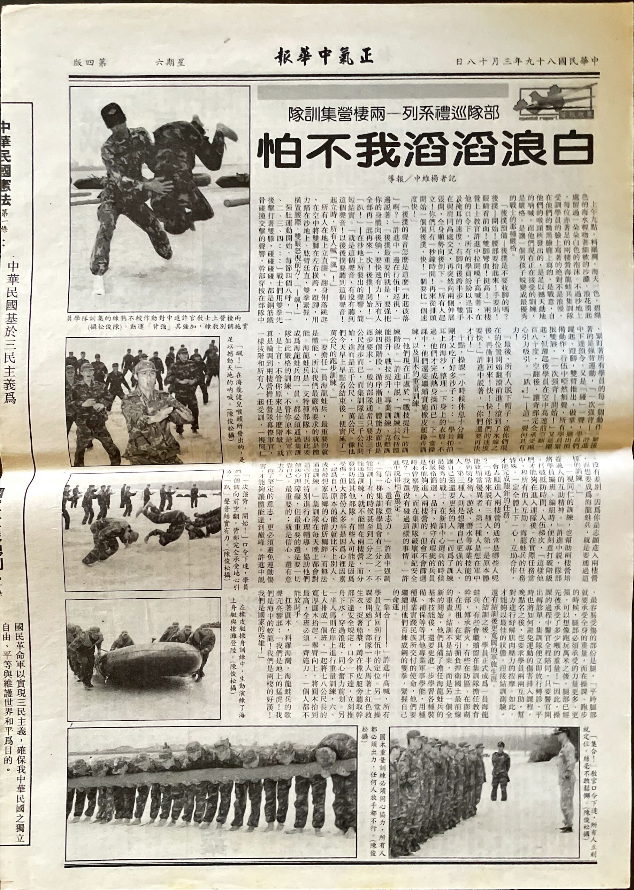

第二站去哪裡呢？輪到我挑選了。

在部隊中做了三個月的報紙，還我自己搞出專題報導來訓練自己，我想試試看我現在文字的火候到底如何，可以寫出多顛三倒四、似是而非、胡言亂語的違心之論，我想寫寫看那種無恥到讓人既錯愕又啞然的文字。上次我用版面驚嚇了大家，這此我要用文字帶來更大的驚嚇。當年有個名詞還沒被發明出來，現在我們知道，這叫做「幹話」。

走，去憲兵連！

我這樣寫：「你對憲兵的印象是什麼呢？是抓違紀、把你送去軍紀再教育嗎？…但其實憲兵是一種服務三軍、所有友軍的軍種喔！防區有好多的單位，都是憲兵負責衛勤工作，而且憲兵並不是在找大家麻煩，而是在協助大家改進缺點而已。你現在對憲兵的印象，又是什麼呢？」

標題：「憲兵是防區官兵的好朋友」。

印象就是你在胡說八道啦！

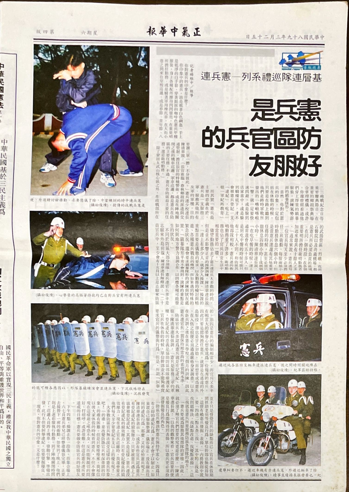

報紙一出，我感覺防區每個地方，都有些小小的騷動。工兵營的政戰士來政戰部拿報紙的時候，直接跑來找我說你寫這什麼東西，去山外一趟，心輔室還有其他連兵旅的新聞兵，看到我的第一個話題就是這篇報導。至少，我知道我做了一份有人在看的刊物，即使只是軍中的內部報紙，還是有人在看的。

第三站去幹訓班，去年這個時候，工兵營就在做幹訓班校閱場工程，我也去海邊搬了一堆塊石，我想去看看那片巨大的水泥地上都在做些什麼…最後，部隊巡禮系列總共做了六期，我們後來還去了裝騎連、甲補庫、醫護連，以防區部隊的數量來說，這個系列還可以繼續做下去，如果再多寫幾個部隊，說不定可以幫防衛部做出個宣傳出版品出來。但是，跟我這個文字記者搭配的攝影記者退伍了，我一個人無法繼續這一系列報導，而新聞官挑來的新兵，也還沒辦法撐起這個系列。

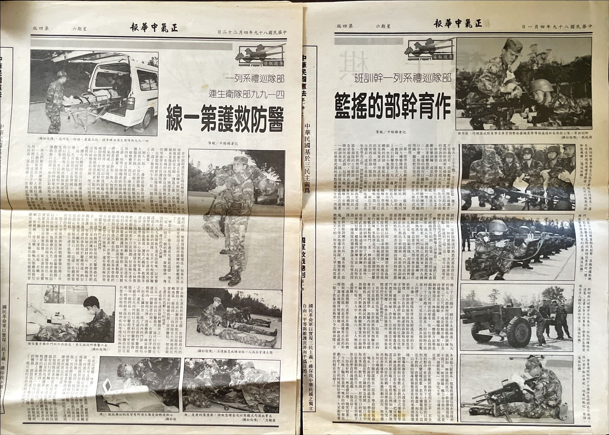

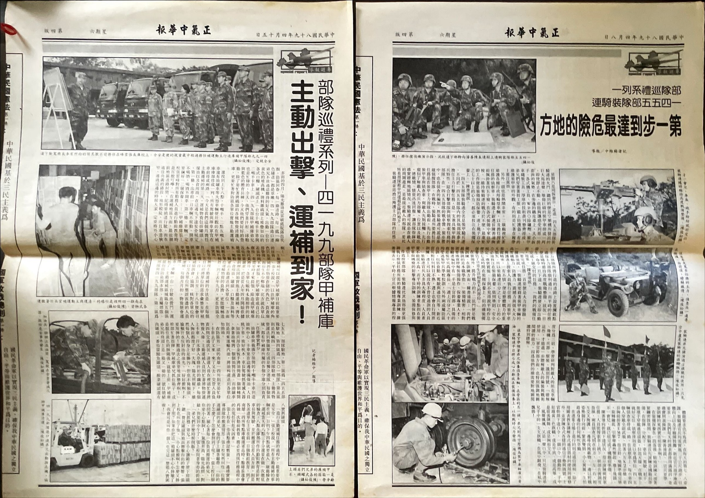

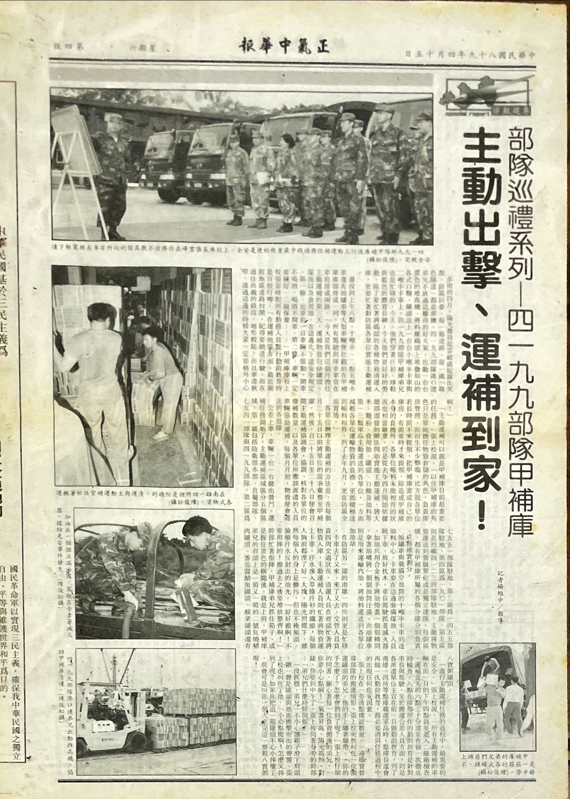

什麼都是假的，退伍才是真的。祝你鵬程萬里。希望這篇對你的部隊甲補庫的採訪，是值得紀念的退伍禮物。

說到退伍，約翰也退伍了，沒在連上送別約翰，有些可惜。之前返台考筆試的前一天，還先回連上睡一晚，是我最後一次看到穿著迷彩服的約翰。連上有弟兄遇到我，問我，約翰退伍那個晚上為什麼不回連上？那晚，我得在地方報社編版與校對。

我也去了雜貨店換了臂章，祝賀自己升上上兵，還有考上碩士班。我不知道到底怎麼考上的，在僥倖通過第一關筆試之後，可能從防區特地飛回來考試這件事，打動了教授。知道考上的消息，我迫不及待打電話給已經退伍的約翰。

在基層部隊巡禮系列中，我寫了不少部隊的報導，但整個防區所有部隊中，有一個才我最想寫的。

不用說你也知道是哪個。

## ▲ 醞釀

我要開始寫工兵營了。

這幾天，其實政戰部正忙著一件還不能夠公開的大事，而且對我們阿兵哥也保密，那就是新任總統、而且是第一任原本的反對黨籍的候選人選上的總統，在完成交接的隔天，就要前往防區巡視，其中還包括大、二膽，而政戰部這邊才剛換新聞官，是由另外一個部隊的營輔導長調任，一上任就遇到這種大事，整個政戰部都忙得不可開交。但再忙也不可能不注意到，大樓外開來了五噸傾卸車，要來政戰部施工—呵，全防區哪個單位會有這種車輛？

帶著相機從房間跑出去，五噸車一定來自我們營部連，一看，駕駛就是我那位受了兩次返台駕訓的弟兄，我當時一定不會知道，二十年後，他會和我一起回到變成金湖垃圾場的漁村營區喝酒，但他卸下工材之後就把車開走了。至於來構工的弟兄呢，一問之下，來自工二連。工二連就在太武山上，而且我現在所在的這棟大樓，就是幾年前由工二連蓋的—我的連長八十五年任官，分發到防區的第一個職缺，就是去工二連當排長，聽說在灌漿的時候，還把一堆喝完的瓶瓶罐罐一起丟了進來。

既然鄰近，由工二連來構工，也沒什麼好奇怪的，但畢竟駐地分散，二連的長官與弟兄我都不熟，但同屬工兵營，而且我好歹前幾個月也還在幫大家送返台假單，我就去拍個照，問問這次做的是什麼工程啊，之前在附近還做了什麼工程啊，也就寫了篇報導填充版面。其實弟兄受訪前，應該要先知會一下營輔導長，不過說起來我做的是防衛部的工作，新聞官、大主任批可，我就讓我的部隊登上我編輯的版面上了。

不過這個工程畢竟不大，就是用水泥弄個擋土牆，就算我再怎麼寫現場，描寫場景與行動的細節，還是只夠我寫半版，版面的下半部塞點政令宣導。不夠，我想寫的不只半版。

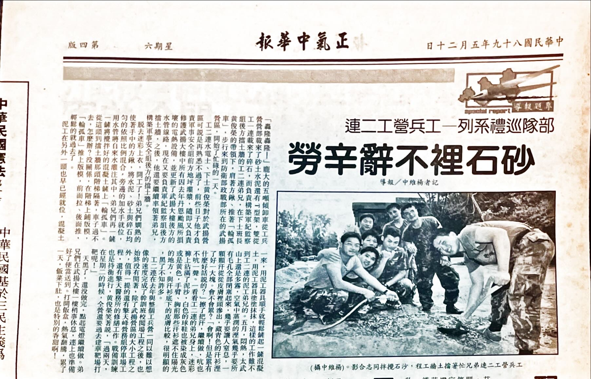

轉眼就是端午節了。司令在端午節前，用了三個下午，去所有離島慰問。我們出動兩名新聞兵，我這次被分配到去距離防區最遠的東碇，我對東碇的印象不像大膽或北碇那麼強烈，只記得東碇島的入口好窄，坐船要坐好久。而到了端午節呢，政戰部一樣沒東西吃，我要回連上吃加菜。

先不管我這個營長天天要把我關起來，他弄起端午節前一天晚上的這個烤肉晚會，的確很有特色，不只是因為人家都是中秋節烤肉、我們選在端午節烤肉，或是讓其他幾個工連的人也一起過來營部同歡—就我印象中，就只有女青年工作大隊來工兵營時有過那麼一次—而是整個氣氛都很有工兵特色。

話說女青年工作大隊，也在精實案、精進案裡頭，一路被裁掉了。

這個晚會啊！首先，我們去工兵基地把 M2 框桁橋運來連上，拿橋材搭一個舞台出來—我在旁邊拍照，自然沒有下去搬橋材，但感覺搭舞台還是比真的架橋輕鬆一點，橋材只是立起來，沒有要真的抬起來，我每次只要聽到「抬起預備」這個口令都想罵髒話。牽了電線、掛上燈光還有政戰兵弄出來的舞台佈置，弄上音響設備，堆上獎品之後，居然也是有模有樣。

我沒想到，比我菜個幾梯的一級兵工還有一級輪車管制士他們，還搞出了一個舞團出來，用平常穿著的迷彩服，搞出一套舞台裝，平常工兵營一堆任務，他們只排練了一天就上陣，為這個晚會開場，居然還跳得有模有樣。更有意思的是，居然連長也上去一起跳，不過，我們也不用期待再沒有排練的狀況下，連長在舞台上有什麼好表現了。

烤肉架用的是我們連上自己做的空心磚，晚上照明的燈光則來自傾卸車的車燈，全營就在傾卸車的包圍中烤肉。要拿營部連中山室的那幾張桌子板凳容納全營，還是頂困難的，每一桌都擠到不行，然後因為有營部長官參加，尤其是營長，烤肉的時候大家也不感太放肆。但是隔天呢，營部連有自己的加菜，那個就恐怖了，全連一起喝到吐…我怎麼知道的？只要有加菜，我就會出現在連上啊！

那天還有抽獎活動，有營長獎、副營長獎、輔導長獎、連長獎…不記得獎品是哪些東西了，因為我沒有參加抽獎。支援人員還參加連上的抽獎，那也太過分了。但我給了我自己一個很棒的獎品，我給了我部隊一個整版報導，我也希望連上，不管是誰，也留了一份這期的報紙收藏。

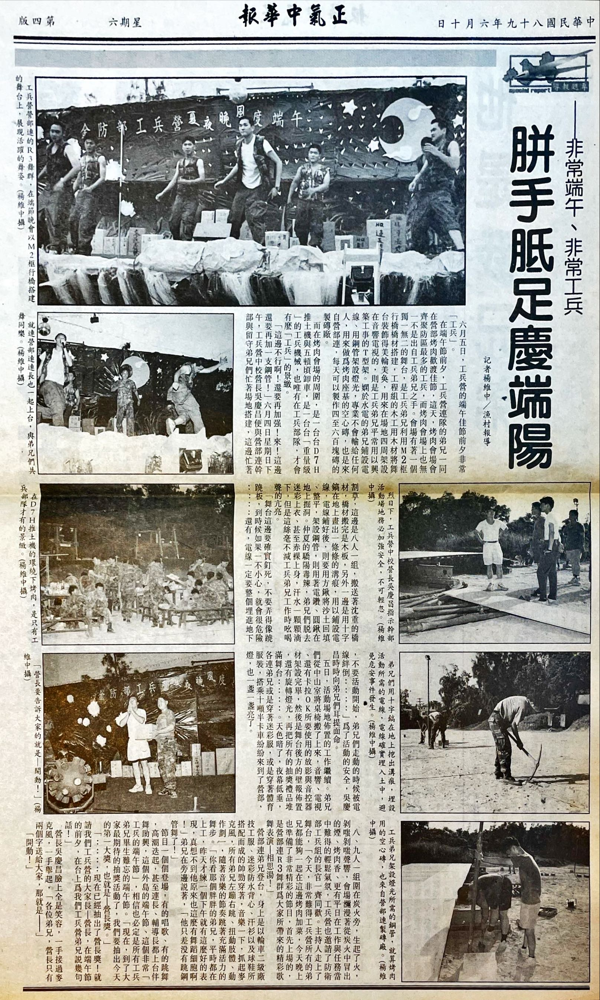

我寫了不少部隊的報導，如果我一到防區，馬上開始在政戰部支援，成為新聞官的文書，我應該就會滿足於這些。可是我太清楚我擺在版面上的東西都只是擺拍，都只是政戰宣傳可以刊載的東西，就算我在這份報紙上寫我的部隊，也是一樣。而真的當你進入到這些部隊，你看到的就不會是這樣，你會看到國軍這台機器到底怎麼運轉，看到各種荒謬造假的文書業務，千絲萬縷所織成的蛛網。

我還想寫別的東西。

## ▲ 相本

照相兵還有一個任務，就是在長官的長官，像是總司令、總長、部長…來到防區巡視的時候，製作贈送長官的相本。

相本是一種只有少數人可以獲得的防區伴手禮。當貴賓來到防區巡視的時候，從上午抵達開始，照相兵會在一旁一路拍攝長官講話，拍攝到的照片除了會用在刊物上之外，還要馬上送到山外沖印出來，並且將這些熱騰騰的照片貼在長寬都大約三十公分、有十幾頁內頁的相本上。政戰部要趕在貴賓在下午登上班機離開防區之前，把相本送到機場，讓司令拿出這份伴手禮，貴賓這時候可能會打開翻上幾頁：哎呀！這不就是上午的照片嗎！你們這麼快就已經做成這麼精美的禮物，幫我紀錄這趟旅程啦！沒什麼啦，這就防衛部的一點小小的心意，不算什麼啦！

相本必須要在時效內完成，自然不可能在沖印完成後，拿去防衛部處理，作業地點會在山外的心輔中心，除了新聞兵之外，也會叫心輔中心的士官兵下來一起作業，甚至會叫上幾個聯兵旅的新聞兵，新聞官也可能下來一起貼。

相本需要一定的美工編排，呈現出一定的質感。買來的相本通常封面有些跟我們的主題不太相符的圖像，像是有個巨大的寶寶在地上爬行，或是有個西方小男生親吻一個西方小女生，角落還用花體字寫上 LOVE 字樣—絕大多數都是假設你是為了存放結婚或是孩子成長紀錄照用的。我們首先要用雲彩紙或粉彩紙把整個相本包起來，表面要像戰備用的看板一樣平整，然後用雷射印表機與美術紙，印個幾個大字，建議使用仿宋字體，內容可能是什麼「總司令戰地足跡」、「戰地跫音」等等，割下來，貼到封面上。這道工序，會在貴賓來臨的前一天完成。

內頁也不是只把照片貼上就好，每張內頁也需要黏貼一些文字。像是，當總司令走出機場，我們拍個他與司令握手的照片，就可能寫上個「恭迎總司令蒞臨防區」，總司令可能會走過一排部隊，就寫個「總司令慰勉官兵辛勞」。接著，貴賓與司令坐上司令辦公室的廂型車，後面則跟著一台政戰部的車，一起去一個我從來搞不清楚到底在哪裡的戰情室，總司令會在這邊發表談話—在這裡拍攝的照片，我們會放在報紙的頭版上：防區這份刊物，以及所有軍中報刊的報導，都是按照階級排下來的，這週頭條報導就要請司令讓個位子，要留給長官的長官。這時候，可能已經拍了一卷膠卷。

這種場合需要出動兩位照相兵，幾個照相兵之間會決定誰的攝影能力比較強，就待在政戰部的廂型車上，留下來繼續拍攝，做相本用的照片可沒有失敗的空間；另外一人在政戰部待命，一卷膠卷拍完，就透過軍線通知目前所在地點，請前往取走膠卷，去山外沖洗照片。其他人已經在心輔室待命了，洗出多少照片，就貼多少。快到中午的時候，第二批照片送到，裡頭全都是長官們跟火炮的合照，大的砲，小的砲，全都是差不多的照片，到底怎樣才有辦法寫出不一樣的標題？好難想啊！不行！時間不夠了！

像總司令這樣的貴賓，我們會一次做兩本相本，如果相本在運送過程中出了什麼意外，像是掉到地上沾滿泥巴，那還有另外一本可以備用，如果兩本運送過程都沒問題，那就兩本一起送出去，這是防區兩倍的心意。

但有些貴賓來訪時，像是婦聯會勞軍，我們就要做出十本相本來。

現在其他新聞兵都比我菜，這次由我負責主要拍照任務。

星期日，一排珠光寶氣的夫人們走出機場。「哎呀！凱生！」「哎！是大嫂啊！好久不見啦！上次見面已經是…對！大嫂跟學長過得好不好啊？」「我們都很好啊，就是悶了點，所以才跟姊妹們一起來你們島上散散心啊。」「好…好…唉呦！大姐，原來你也來啦？喂！照相兵！過來拍照！」

廂型車開往山上，我也裝上閃光燈，一行人魚貫走進坑道，參訪擎天廳—之前除了在還是二兵的時候，被輔導長來帶來這裡聽司令講話，就是去年颱風的時候，跟連上一起搬台 5KW 發電機幫防衛部供電，這次則是讓我知道我多麼不會在漆黑的坑道裡拍照。坑道外頭已經擺好了一排座位，等夫人們出來，逐一就座，首先是由一群全副武裝的阿兵哥示範基本教練，從臂章看來，來自防衛部附近的裝甲旅，好的，拍部隊，拍夫人，一卷膠卷拍完了，送出去。

再來輪到比較有娛樂性的防區猛男秀兩棲蛙兵上場。夏天了，兩棲蛙兵的服裝，成了你印象中的那個樣子，打赤膊、紅短褲與白色珊瑚鞋，先是跪臥挺腹，蛙兵從背後抓住雙腳，挺直腰桿，在官夫人面前展示鍛鍊過的腹肌，又像是不斷把紅短褲裡頭的東西頂向天空；再來就是搶背運動了，蛙兵一個個確實的向前翻滾，乾淨俐落，不愧是防衛部的門面。夫人們交頭接耳、說說笑笑。

操演結束，掌聲爆出，夫人們都笑了，司令也笑了。照相兵在旁邊都沒閒著，全程拍攝完，又被叫過去，幫司令、夫人還有蛙兵弟兄拍張大合照。

繼續前往下一站，幾台廂型車開到防區有名的牛肉餐廳，我跟著防區軍官一起走進餐廳大門。二樓已經擺好了宴席，大概有五桌，已經擺好了飯菜，每桌都還有幾瓶防區特產，防衛部軍官均已就座，有一桌留給了駕駛兵、傳令兵、照相兵這些阿兵哥，等著司令與夫人們一起坐上主桌。我走在最後方，當我上到二樓，司令已經拿著杯子，跟大家講話了。

「不要拍了！」新聞官看到我還把相機拿在手上，沒收進相機包裡，起身把我拉下來，「進了餐廳以後，都不要拍！吃完飯，趕快把底片送回去！我們還有兩三個小時，可以把相本做出來！」

我先借了電話打到心輔室，找人騎機車把我接回山外。從山外過來也要花時間，我就在掌聲、人聲與碗盤的碰撞聲中，先回到士兵桌，夾點毛肚、牛筋還有餃子，囫圇吞下，身邊的阿兵哥也是吃了點東西，趁機坐在位子上補眠；至於其他幾桌，既然新聞官都叫我不要拍了，那我就不講了，只覺得跟疲憊的士兵桌比起來，軍官桌完全就是不同的氣氛。也好，今天星期日，司令就要交接了，他應該也想輕鬆一下，也應該輕鬆一下，軍官們也想在主官交接的這段時間，輕鬆一下。

只是，主桌的各位長官、各位夫人，你們都已經到了防區最有名的牛肉餐廳了，可以不要只顧著講話、顧著敬酒、顧著客套，你們可以動一下筷子嗎？你們知道在一個一下部隊，連上就沒有新米，只有可怕的庫存米可以吃，搞到成天挨餓的阿兵哥眼中，你們這樣把飯菜放涼—就算這個餐廳的價位也就只是熱炒店水準—多麼該遭天譴？

在你們桌上，是別的地方難得一見的生牛肉片，這道菜平常不在菜單上，本來只應該在冬天才會提供，但不知道是不是因為訂席的是司令，於是夏天也可以有這種口福。生牛肉需要當天現殺，端上來的時候，看的是那粉紅色的色澤，沒有什麼多餘的調味，吃的是他的鮮嫩，那個東西很好吃的啊！你們怎麼捨得就這樣讓餐廳收走、倒掉？

罷了。心輔室的桌上已經堆滿了照片，還有美工刀、膠水等種種器具，快點啊，我們已經貼好了幾本？新聞官也過來聲聲催促，咦？這本怎麼貼歪了？咦？黏上去的照片，怎麼又脫落了？咦？這本怎麼貼得跟其他本不太一樣？咦？時間怎麼不夠了？

夫人和官兵的照片在我眼前一張張掠過。我不斷想著，他們在翻閱我手中這本相本的時候，看到的是什麼？想到的是什麼？是精彩的表演？防區名產辛辣又充滿香氣的口感？防衛部熱情的招待？姊妹們一起出遊的興致？我拍了一個上午的照片，讓他們看到什麼？

部隊外面的人看到了什麼？休假在雜貨店看電視，那些一直不斷重播的軍教片，又在演些什麼？

軍方的官方宣傳裡頭寫了些什麼？我做了半年的軍中報刊，我每週寫了些什麼？

我還在連上的時候，我每天又都在做些什麼？

沒過幾天司令交接了，新任的司令聽說還是前任司令的學長，幾次去拍攝新司令的場合，尤其是兩位司令一起上離島的那次，都聽到不少對前任司令作為的嘮叨，不外乎是哪個命令、哪個措施是在浪費時間，傳令下去，這個、那個，以後都不用做了，他後來甚至把在防區的休假直接延長到晚上八點，還改了榮譽假規定。我還剩下兩個月不到，聽到新司令一直這麼說什麼什麼以後不用做，讓我也都不想做了。

我去向新聞官報告。

「報告！」我說，「我想歸建。七月一日，做完司令交接這一期之後，我想回連上。」

## ▲ 歸建

「根據規定，支援本來不可以超過兩季。」我好歹也幹過參一，這時候雖然荒廢已久，有些事情還是記得的。「我在這邊已經滿半年了，再不歸建，我就會變成黑兵。我也只剩下兩個月了，要把我改編到別的部隊，只是為了繼續支援兩個月，也沒有意義。」

「我們這裡是防衛部，防區的最高單位，不是底下那些單位，防衛部不會督導自己的支援調用。你真的想的話，反正只剩下兩個月，還是可以在政戰部退伍。」

這段時間，新聞官應該很需要來自文書的協助。他剛接業務就處理新總統來訪，聽說訪問過程中，還有民間人士闖入軍方的管制區，他被長官—大主任啦、組長啦—釘得亂七八糟，我卻這時候報告說，我想歸建。

「你想回連上真正的理由是什麼？」

是什麼呀？

說起來，那個部隊把我虐成這樣，那邊還有一個天天說要把我關起來的營長，我回去工兵營的理由是什麼啊？回去讓他關？

可是我錯過約翰退伍了，還有好多弟兄的退伍。接下來我要退伍了，我不要錯過我自己在連上的退伍。

剛來的時候，如果有學長退伍，晚點名結束，連長會公布退伍人員出列，就是發退伍煙的時間，退伍人員走進成講話隊形的連隊裡為弟兄遞煙、下一梯次要退伍的弟兄則跟在後面幫忙點煙，但有些人已經偷偷離開集合場。冷不防，一桶水就惡狠狠潑到退伍弟兄身上，接著就是互相潑來潑去，連長也允許連集合場上舉辦十五分鐘的潑水節，學長脫掉濕衣服之後，換上的就是便裝。

有些學長會希望學弟去山外的贈品店，訂一組寫著榮退紀念，一套三把的裝飾用指揮刀，隔天十噸半卡車會載著穿著便服的退伍人員，手上拎著榮退指揮刀。那個太誇張了，不需要這樣。

但我想要親眼看我的參一徒弟銷毀我的假卡，寫我的退伍令。我想要盯著他，一筆一劃好好的做好我的退伍令，我不要退伍令上有任何修正液的痕跡。我想看他什麼時候去防衛部用鋼印，然後比別人提早幾天看到自己的退伍令，提早知道退伍令正躺在參一的保密櫃裡。說實在，這些事情他們本來就會去做，但一個參一文書兵看到另一個文書兵透過業務服務自己，總有種莫名的安慰；我為別人做這麼多次這種事情，現在也輪到有人為我做這些。

當參一最有意思的地方在於，你要去宣教那些自己都沒體驗過的事。你還是二兵的時候接了參一，自己都沒有返台過，也從來沒有去過機場，卻要跟返台人員宣教去機場哪裡領機票；你自己都還在軍中，卻要去跟退伍人員宣教要去哪裡做歸鄉報到。現在換成別人為我做這些，真有意思。

「退伍的時候，有些事情，還是只有連上才能做。我想回連上。」在政戰部寫了一堆胡說八道，這個倒是真心話。

還有，我開始想一個故事。

要把這個故事想清楚，應該得回連上。

小車又開進連集合場，把我、黃埔背包、相機包與水桶丟在連上。一樣，我隔天還是回了政戰部，把我的腳踏車牽回連上；防衛部到工兵營之間這段路我不知道走過多少次，但是小車接送仍然是必要的，代表新聞官確實把我接走，現在又歸還給連長。不過，政戰部似乎沒有通知連上我要歸建，小車一離開，連長走出他的房間，來到連集合場。

「連長好！」我敬了一個軍禮。

「你這次回來幹嘛？」

「報告連長！上兵楊 ○○ 歸建工兵營營部連！」

「那你幹嘛回來？」

「報告連長！想念弟兄！想念連長！」其實就是支援令到期了，不過，連「憲兵是防區官兵的好朋友」我都能寫出來，還有什麼肉麻話我不敢講的？

「還真的勒！」連長揮揮手打發我下去，去忙別的事。

我去找排長幫我找個床位，找經理士領了床棉被與蚊帳，重新睡回大寢室，但是連鋼盔 S 腰帶都懶得發給我了。連上變化不少，但刻意回來吃加菜，加上週日會溜回連上，兩次返台考試、還有外公的喪假（唉）的前一天晚上，我也都先得回連上睡一晚—因為一定還會有其他人正在返台，就暫時找張空床睡一晚—隔天在營部拿了假單之後，被人事官跟著全營休假人員一起送去機場，還算是能跟上連上的變化。就在這個寢室裡頭，一些菜鳥大概會嫌棄我這個去防衛部爽了半年的學長，他們也應該都有自己的眼光、自己的故事，但我不可能了解每個人在想什麼。

仔細一想，這個連上也有百來個弟兄，來來去去的人更多，很多弟兄不了解我的業務，而光是這個連上，也有太多事情我不知道了，但即使如此，這個部隊，也還是值得一個故事。

排長也不排我的哨，這段時間，我是連上的閒人。我把腳踏車交給了兩個徒弟，你們誰需要外出，都可以用這台車，營參一應該比較需要，畢竟要跑防衛部一處，可是我用得到的時候，你們不能跟我搶，反正再過一陣子都是你們的，然後總有一天在這個連上被騎到損壞、最後不知去向。我不是很需要外出了，除了有一週我得了蜂窩性組織炎，得去一趟縣立醫院，我也開始沒什麼興致去山外，反而比較想待在連上  -  這應該也是個違反常識的行為。

連長看我一個閒人晃來晃去，又沒有什麼任務可以交給我，干擾他管理連隊，還是打發我出營門休假，眼不見心不煩—出門吧！沒有人可以阻止我進連辦公室，使用參一櫃，我也知道怎麼開自己的假單。大多時間，就耗在營區外面的雜貨店，叫一盒阿薩姆奶茶，看著電視裡頭重播無數次的「同花打不打得過 Full House」這類的電影，然後拿本筆記本亂畫亂寫，居然還寫了一首歌出來。

既然我白天也不在連上，晚上就按時回寢室就寢，營長或許也不知道我回來了。

中午通常還是先回連上吃飯再出來吧，整天都在外面，太花錢了。這個連的老兵其實有種奇怪的資格，可以在飯菜還沒端上中山室之前，就拿碗公先去伙房打飯菜來吃，我倒是覺得在中山室吃一吃就好。

我已經考上碩士班，不用在這個時候煩惱退伍以後的事。一般考上碩士班的學生，會在這個時候找指導教授，然後準備開學之後的學習與研究計畫，思考應該選修哪些學分。幾個月前我就只是憑感覺挑了一所學校，有哪些老師、哪些必修選修，我人還在防區，也沒辦法去學校搞清楚，一切等開學之後再說了。

我正在想一個故事，一個防衛部新聞兵寫不出來的故事，一個推翻我在政戰部那些違心之論的故事，一個當下的故事，一個你在外頭看不到的故事，一個你從來沒有看過的故事，一個忠於我自己內心的故事，一個我想寫，而且可能只有我能寫的故事。我想寫一個讓人充滿驚嚇的故事，就像我在「生命中的驚嘆號」或「憲兵是防區官兵的好朋友」那樣，嚇死你的故事。這個故事就在這裡，是這裡的故事，但也可能是每個部隊都會遇到的故事。

在我的軍旅生涯中，應該分成三個階段吧，而我甚至有三個徒弟。

首先是被丟到防區，在連上徬徨無助的二兵，然後來到營級，被精實案與大退潮、被巨大文書作業壓得喘不過氣的營參一，同時接了連參一，在營辦理頭被戲稱是「防區直屬工兵營營部暨營部連參一文書、差假士、總收發、人事官通信官業務指定代理人、專職衛勤待命班、製磚廠製磚公差不二人選之綜合業務參謀兵」；居然又到了防衛部，在許多場合，跟在司令的身邊，看到司令部的種種，而我去斗門西洪南雄瓊林料羅拜訪了好多部隊，整個機場以東踏遍我的足跡，離島也去過，我所去過的地方，應該比許多軍官能去的，都多上許多。我有一段奇妙的軍旅生涯，我應該比許多人看到了更多事情。而且，我重拾了我的寫作能力。

我在一種近乎極限的狀況下考上碩士班，我接下來會比許多人更有時間。而這可能都是為了安排我去寫一個故事，因為我想寫，而且我能寫。

我有一段奇妙的軍旅生涯，但我也慢慢了解，我的軍旅生涯全是錯的。我在進入工兵營的時候，我佔的職缺是橋樑排的戰鬥工兵，我應該讓部隊授予我戰鬥工兵的訓練，獲得架橋的專長，而不是去做實際上該是人事官來做的業務；我也根本不應該前往政戰部支援，政戰部的編裝中如果沒有新聞兵的職缺，那根本就不該辦這份刊物、幫貴賓做什麼相本。這一切都是錯的，我好想寫出來，說，我經歷的這一切都是錯的。

有時候我也覺得我自己是個怪人，很多事情我可以選擇不用去做，但如果有什麼事看起來只有我能做的時候，我就會忍不住不去做。我應該是個強迫症患者。

我想要寫的題材會不會有什麼風險？如果有人想對我不利怎麼辦？他們一定可以知道我在哪個學校，讀哪個科系，可能會派出穿著制服，帶著白色膠盔、繫著白色腰帶的憲兵，衝進植滿鳳凰木的校園中把我帶走，如果在陳水扁執政的時代，真的發生這種事情的話…我好期待啊！校長會不會帶領師生在門口擋住軍隊？我會不會在某個平行時空當中，變成一個反對黨領袖，並且改寫台灣政治版圖…

為了寫這個故事，現在，讓我能夠多記得一些此刻的事情吧！

讓我記得從連集合場旁的曬衣場，往下看到營辦與漁港，是怎樣的風景。讓我記得海風吹拂時芒草如何翻動，又怎樣吹開了營辦室的木門。讓我記得我們連上居然有會抓老鼠的狗，讓我記得豆花與黑妞，讓我記得他們趴在陽光燦爛的集合場上的樣子，他們抓到老鼠還會丟在連集合場向我們炫耀，可是我沒篇幅寫你們的故事。甚至是籃球場旁邊那個廁所也好，那幾個蹲式馬桶總是堵塞，也總是有人把廁所門弄壞。入夜之後，讓我記得海面遠方的漁火與天上的星。

我正在想一個故事，想著想著就退伍了。平平淡淡又平平安安的退伍了。

退伍前唯一一件好笑的事情，就是我也得了蜂窩性組織炎，我的屁股上長了一個膿包。我跟連長報備之後就一個人晃去山外的縣立醫院，我這麼一個阿兵哥就脫了迷彩褲趴在床上翹高屁股，大夫戴上橡膠手套，用消毒過的手術刀，在我的屁股上畫了個十字，然後擠啊挖啊把膿弄出來，用來擦拭的衛生紙上有白色、黃色的膿還有紅色的血跡，發出著惡臭。抹上抗生素還是什麼的、貼上紗布，回到連上大概兩三天沒洗澡。不過，還是平安退伍了。

一直想著退伍，總覺得退伍會是多轟轟烈烈的事情，但平平淡淡的也不錯。

退伍這天雖然平凡，但我之前得到了一項專屬於參一的尊榮待遇：我的連參一徒弟，讓我親手寫了自己的退伍令。

我這一梯也就只有我一個人，晚點名的時候，連長叫我出列，大家拍拍手，謝謝，我要離開了。

九月一日，我又受到了另外一項尊榮待遇，因為我曾經是新聞兵而有的待遇。我這個梯次退伍的人非常少，全防區加起來大概才十個人左右，在我們退伍令生效的前一天，剛好有一班 C130 運輸機班次，就讓我們搭軍機退伍。而政戰部其實每天早上有一項任務，要到機場領取當天的青年日報、忠誠報等報紙，還在政戰部的另一位新聞兵，也跟著一起跑來機場，當我在退伍人員行伍之間，而防衛部一處處長與大家一一握手送別時，我還留下了退伍那一刻的照片。

C130 運輸機的引擎聲真的很吵，走出軍用機場，台北人多得讓我好不習慣。

## ▲ 構思

這個故事好難寫。真的寫起來，篇幅應該會超過我以前寫過的任何東西。

來麥當勞吹冷氣整理一下思緒。聽說這間麥當勞，也是個青春校園愛情小說發生的場景。

我想寫精實案。在連上一開始我也只知道執行命令—去庫房搬米，出列；去搬塊石，出列；去戰備、去跑待命班，去處理因為大退潮造成的人事與差假作業，但如果把這些事情擺在一起，嘗試找出一個關聯，我得到了三個字：精實案。

但到底該從哪裡開始寫呢？這樣的故事好像沒有人寫過？基層營連一開始根本不知道怎麼執行精實案，我也不知道該從哪裡開始寫精實案。講精實案不可能不講業務，在部隊裡頭大家都有業務，但好像沒有以業務為中心發展出的軍旅故事？這怎麼寫？

我現在最熟練的寫作技術，就是「寫現場」，那，先做點寫作實驗。

說起精實案，大家都可以寫出「我是某某部隊的參一/三/四，精實案的時候，真的是做到沒日沒夜，滿滿地都是血淚…」，我想要更有力的文字，我應該可以改成—先直接用「寫現場」，描寫部隊實際發生的景象，然後慢慢地、一點一點地，揭露後面的原因是精實案。我現在擅長寫兩千字左右的稿件，先寫個一篇短篇練練手吧，先選糧秣庫房的故事，嗯，效果還可以，這樣寫起來，大概會變成「精實案血淚短篇故事集」之類的作品。

接下來寫塊石與莒光日，莒光日的內容，剛好可以跟部隊裡頭亂成一團做個對比，應該可以產生情境喜劇的效果；然後那次水泥預拌車撞上安官室實在很好笑，還不知道跟精實案有什麼直接關係，但先寫個短篇。精實案重新編成過程中，有一大堆的人事文書作業，先寫個當時在營辦作業的現場好了。這幾個短篇寫出來之後，好像可以再用時間軸連在一起，之間再寫一些「欲知後事如何」的連接段落，效果就變成有點像是職場單元劇—一開始沒想到會變成這樣，但這就是我目前能寫出的東西，現在，可能寫了大概三到四成吧？

繼續把幾個印象深刻的章節寫出來，寫一寫就會發現有些前後矛盾，同時發現有些後面發生的事情，原因在更早之前就出現了，當時在連上反而都沒注意到。我應該回頭埋一些伏筆，順道把情緒不連貫的地方改了，沒必要講的就刪了，我想在敘事上保持一種快節奏。

人物太多了，可能得合併一些現實生活中的人；個性也可能得比平常更誇張一點，要有點卡通化，這個故事中每個人都是配角，主角是精實案。我應該不用太去照顧每個人的個性，這不是一個由角色驅動的故事，這是政策與時代驅動的故事，而說實在，在這個環境中，每個角色最後也都只有一種感受吧，唉！

我只能夠盡量確保「寫現場」的那些文字中的視覺逼近原始的印象。文字圖片影片等重現手段，最後都會有或多或少的失真，我的失真程度到哪呢？我自己都還是有些遲疑。

我該把自己的感受寫進去嗎？想了想，放吧，不過還是盡量使用「寫現場」，把感受寫進動作裡，但最後還是寫成直接開罵了…。

整理下來，我可以寫十四個單元。我應該有機會可以寫第十五個單元，後來這段經歷真的很有意思，但寫下去，可能會這個故事在剛發表時候，性質變得很奇怪，我不打算一開始就搞什麼自我指涉的後設文學。以後再說吧！

我還記得那時候，有天晚上我做了個惡夢。我夢到我正在作一本全新的年籍冊—也就是點名簿—已經寫好了插條，而且將插條一一插好，夢裡的場景大概是連辦公室吧，我突然把年籍冊掉到地上，碰一聲，所有插好的插條撒落滿地。我就突然驚醒，努力確定自己是在光復宿舍裡，我已經不在那個地方。

最後我只剩下兩個問題：擎天操演那段我還不知道怎麼寫，但是不可能避開不講。還有，這個故事應該叫什麼名字？我不可能用「軍旅憶昔」或「我在工兵營的日子」—跳到二十年後，我可能會覺得「從零開始的異世界生活」很不錯，這裡根本就是個異世界。或許，我可以叫它「國軍精實案災情現場」，但跟我已經寫出來的部分，情緒上搭不太起來。再想想。

還記得擎天操演那時候，我一直被處分，處分並不嚴重，就只是跟連長室前面那道牆的感情培養得很好而已，但處分的理由實在讓我在意。連長說戰備的時候文書不能加班，結果他自己也有一堆業務叫文書做，結果做他的文書業務還因此被他處分；人事官要我做他的業務，說就算我揹待命班也不用去，結果他自己反而又跑去敲了待命班。我服從長官的命令，最後卻因為長官的命令被處分，我也不可能抗命。

如果這些文書作業這麼重要，連上這麼多人，總是可以把我排開的吧？真的需要一邊揹待命班一邊作業嗎？這樣不管怎樣都會一直被處分啊？我怎麼會當兵當成這樣？那時候我其實可以…呃…那時候我…還是，嗯，二兵。好，不用說了，我懂了。菜不該死，菜是罪該萬死。擎天操演的目的是驗證精實案成效，我驗證出了我罪該萬死。

擎天操演這段，就寫這兩個故事吧，寫出來的成品看來也頗有肢體喜劇的效果，現實中的小故事，變成文字之後，我們也總是可以擠出點寓意，像這兩個小故事，就是小兵夾在戰備訓練與幕僚業務之間必然的結果。不過，人事官與連長，都是跟我最密切的長官，他們都還在部隊裡，我應該把他們寫成這樣嗎？…但…我還是很想寫出來啊！那時候的遭遇太荒謬了！連長凹我戰備前一整晚不能睡，就算他自己也只睡兩個小時，還是處分了我啊！

話說回來，我好像想講的，就是一個小兵夾在戰鬥工兵與營級業務之間，結果什麼都做不好，而這件事卻發生在整年最嚴肅的戰備中，擎天操演可能是某種意象的中心。標題直接寫成「擎天操演」也不太對，有沒有別的說法？

嗯…防區狀況三生效？

## ▲ 連長

二十年後，我還是忍不住播了一通手機給連長。

二十年沒跟連長講過話了，我甚至沒有連長的手機號碼，用網路查到連長應該所在的服務單位，過程有點像是某個時期綜藝節目的「超級任務」單元，對方說連長不在位子上，要我留電話讓連長回播。我等著，但是我一直沒有準備好怎麼開口。

「○○ 啊！我是 ○○。」連長不再用「連長」自稱，居然用的是自己的名字。好不習慣，但我還是沒辦法不叫他連長。

連長好…二十年沒聽到連長聲音，有點激動…我上個月回了一趟防區，回來就好想找找弟兄，然後也好想跟連長講講話。跟連長報告，我們幾個梯次相近的弟兄其實弄了一個 LINE 群組，我前幾周放假也回去了一趟，對，我們應該過陣子還會一起回去看看，那個誰之前已經車禍去世了，然後那個誰告別式的時候還有去看他…。連長最近過得怎麼樣？

連長有自己的人生，這段就跳過。—連長你應該知道我退伍之後不久寫了一個故事對吧？其實我二十年前就該打這個電話的，但我一直不敢問我造成了連上什麼困擾或影響…連長平常帶弟兄去構工、架橋、救災，都是衝第一的，這些我都沒寫到，我只寫了我最在意的那個片段，可是當時的我，就是好想、就是好想把這個故事寫下來。

結果反而變成連長來安慰我了。他說他從來沒放在心上，反而要我不要放在心上，上頭的長官也的確來連上問過話，後來也沒有怎樣。連長自己也看過我寫的東西，他說，自己也覺得頂好笑的。不管怎樣，二十年過去，總算可以跟連長好好講一講。

「○○，很謝謝你還記得連長。」他開始自稱「連長」了，啊！自然多了！舒坦多了！

連長，我也很謝謝你記得我，也願意打這通電話給我。對了，其實我總覺得我對工兵營長官應該沒什麼影響，我看了新聞，豬頭營長居然當上了中將，國軍以前有工兵的中將嗎？以前我們叫他豬頭，他整天要關我這個文書兵，過了二十年，沒想到連天弓飛彈的生產都歸他管了。身為一名工兵，我都覺得他是工兵之光了！

「營長？營長？喔，你說 ○○。」連長的經歷中接觸過不只一個營長，稍微在記憶中搜尋一下。「真的要說，時勢造英雄，而且他的成績有被長官看見。其實還不只是工兵，他是理工出身的，現在爬得比正期班出身的還高。我們這位長官，真的很厲害。」

我將連長加入了 LINE 群組，原本覺得跟一個中年退伍軍官加 LINE，可能會有導致群組裡頭充斥長輩圖的風險。還好這件事情沒發生。

## ▲ 營長

2022 年九月六日的報導：檢方起訴一名原本任職於國防部軍備局的呂姓中校，原因是擅離崗位十分鐘，去營區對面的手搖飲買飲料，觸犯陸海空軍刑法第 35 條：衛兵、哨兵或其他擔任警戒、傳令職務之人，不到或擅離勤務所在地者，處一年以下有期徒刑、拘役或新臺幣十萬元以下罰金。

2020 年四月起，呂姓軍官開始任職國防部軍備局生製中心第 202 廠品保室副主任，202 廠位於宜蘭縣礁溪鄉。在 2021 年二月二十日早上八點至隔天早上八點三十分，他擔任留守幹部暨緊急應變組組長，駐守生製中心第 202 廠光旭營區，也就是當天的值星官，但是在晚間六點五十八分未經核准就離開營區值日官室的勤務所在地，徒步前往附近的麻古茶坊買飲料，直到晚間七點八分才回營。全案經憲兵指揮部宜蘭憲兵隊移送偵辦，呂姓軍官也已經在 2022 年二月退伍。

值星官的確不應該亂跑，但擅離職守十分鐘，聽起來其實可大可小，主官應該會有很大的權力，決定要怎麼處理這個事件，但直接勒令退伍、送軍法處理這個決定嘛…我總覺得在事件的後面，有著不少我們看不到的更多積怨與憤怒吧。

話說，我不知道二十年的時間，把我變成怎樣的人，但我還是隱隱覺得，國防部軍備局的主官，還是當年那個操守實在沒話說，但天天要把我抓去關的人。

## ▲ 還是營長

我不想調職。

我不想調職，而且我不想調職到防區，可是我就是得調職到防區，而且已經調到了防區。

我已經步下班機，踏上了防區的土地。雖然我早就知道，在我的軍旅生涯當中，遲早會有外島經歷這一站，加上我迷彩服衣領上的城堡，將我調職到防區，成為防衛部直屬工兵營的營長，我自己也講不出什麼不應該的道理。但儘管如此，我實在不想調職。

小車在伯玉路上奔馳，八月的陽光下樹影晃動，開往山上的核心區。當時我還不知道兩個月之後防區迎來一個巨大的颱風，這整座山的每顆樹都被吹得東倒西歪，我要帶領工兵營救災，還讓我的第一次返台休假直接延後了一個月。我更不知道這次的颱風對我只是小試身手，在幾年之後，我會遇到一個更大的颱風，遇到更大的災情，率領一整個軍團救災。

當時，我還不知道後來的這些，只知道前兩天拿到的幕僚名單來看，這個部隊居然有工兵兵科的人事官，這是什麼莫名其妙的安排？想想這個部隊連起碼的公文紀律都沒有吧？聽說是因為現在的營長覺得，如果工地裡頭人手不夠的話，還可以派人事官去監工。唉…別嘆氣了，先去防衛部報到吧。

離開防衛部，小車駛過大門，來到接下來幾年我要管理的部隊。這哪裡是個部隊？你看看這些兵！這簡直就只是個施過迷彩的工寮啊！

經過安官室，怎麼會是一個一兵在站安官哨？這個部隊沒有士官嗎？我總覺得在這個工兵營的兵，四大戰工，大概一個都不會。算了，我可以申請一大批校訓預士，在人力結構上整個清洗這個不對的體質，然後需要來弄個幾次基地訓練，才能把這裡整頓成一個像樣點的部隊。可是聽說防區的工兵基地現在是荒煙蔓草一片…我的天…。我想做的事，少說還要半年一年才能開始。

辦完交接，來到我的座位—這個部隊的問題太多了，該從哪裡開始？呃？我桌上這些簽呈是怎麼回事？我的幕僚怎麼把公文搞成這樣？傳令兵！幫我把營部的收發叫過來！順便叫他帶一把尺！

嗯，是個剃了光頭的高個子小朋友，聽說他還負責送假單，這種明明國中生就可以做的事情，防區的部隊居然還需要特別派一個人做，什麼亂七八糟的。我要做的事情太多了，可是我得一步一步來，我要有耐心，我慢慢教你，我現在要好好教育他新頒布的國軍新公文格式，收發！過來！你看這部份，核判區分怎麼會是用電腦打上去的？核判區分應該要蓋核判章啊！底下的官章也蓋得亂七八糟…。好，我已經教過你一次了，你回去告訴所有的軍官，以後按照營長的指示寫簽呈，聽到了沒有？

過了一天，所有的簽呈，還是同一個樣子。

我的命令沒有傳達下去嗎？我還不夠有耐心嗎？我才來第一天，你們全部一起公然抗命？

傳令兵！把收發叫過來！什麼爛兵！再亂搞，就統統關起來！

我…

我…我先停在這裡。我想從營長的角度，試試看寫出一個他的防區故事，但…我怎麼愈寫愈覺得—我真該被他關起來？

是啊，你來到這裡，看到一個亂七八糟的部隊，人家也同樣看到亂七八糟的部隊，從別人的眼光中，你也是那個亂七八糟部隊的一員；你從來就不是什麼被害者，寫了十幾萬字，也不能夠澄清什麼，你到了這裡之後，你也是把軍隊搞成這樣的共犯之一。

你早就知道你已經被工兵營同化了，二十年前就知道了，你的迷彩服跟其他弟兄一樣破爛，小帽與汗衫上，都是汗水被風乾之後的鹽漬，而你的身體已經習慣營辦室的桌子與那個大寢室，可以在這裡睡得安穩，去了防衛部居然還覺得不自在，最後居然還跑回來。弟兄在喝的時候，你也跟著一起喝。你跌跌撞撞學業務的過程中，搞砸的事情少過嗎？你有沒有忘過要呈報弟兄的返台假？你是不是有次把關防蓋成上下顛倒也照樣送出去？人家想要改變工兵營，不先關你，難道還有別人？

誰不想要讓部隊更像樣呢？你手上有一支破筆，人家手上是懲處，你覺得人家是狗官，人家才覺得你是爛兵呢！所以，如果你希望部隊變得更好，你又是這樣的兵，你想改變國軍，可以做的事情，可能不是退伍之後寫這十幾萬字，而是從你自己開始嚴格執行軍紀。

你可以先幫你自己寫禁閉單，反正相關業務你都做過，士評會記錄也自己寫一寫，反正誰都知道不會真的開士評會，以你文筆絕對可以把你自己寫得罪該萬死，接著請輔導長帶你去體檢，蓋上營長章，就可以把自己送進去了。你之所以回到連上，搞不好是覺得，整個防區你看過大大小小的部隊，就是有個地方你沒真的進去看過，只有營長可以送你進去。這邏輯怎麼亂七八糟，又還頂有道理的。

說到處分，不禁又想起一件往事，就是豬頭這個外號是怎麼來的。奇怪，怎麼又跟我有關係。

有天晚上大約十點，在營辦室，剛登記完當天的文，我和營參四各自在位子上趴著閉一下眼睛，稍晚我們得一起去擔任十二點半的大門衛勤。營長平常不會進營辦室，但是他急著要找一位軍官，衝進營辦室就看到我們。

「收發！搞什麼鬼！每天都在鬼混！在營辦室就只知道睡覺！都不做事！你看你旁邊的營參四，人家都已經作業累到睡著了！」

他看到營辦室裡頭只有兵，沒有軍官，走掉了。我又是張大了嘴巴，旁邊的營參四則開始放聲狂笑：「真是個豬頭！」這個外號不脛而走，整個工兵營上下，都頂認同這個外號。

我只能真心希望沒有一個單位是以這種方式決定獎懲。工兵營也好，軍備局也好。

## ▲ 尾聲

工兵營後來離開漁村駐地。從 2006 年開始，原本的漁村營區變成了鎮公所的資源回收站，原本的大門被封閉起來，鎮公所從另外一頭開了新的大門，在原本油庫的地方搭了新的車棚停放垃圾車。從前傍晚時分，會有公差、洽公的軍士官，陸續回到這個營區，現在，則是帶著斗笠、手上有袖套的清潔人員，陸續離開這個資源回收站。

營區其他房舍都大致保留完好，在防區眾多廢棄營舍中，由於還有人繼續使用，可說是狀態仍然非常好的一個。或許是因為鄰近山外，讓縣政府樂意使用這個營區，當時其他連的弟兄也很羨慕我們的地點，不過，還有很多鄰近山外的營區，沒有漁村營區這麼幸運。

營部辦公室後面那一大塊芒草被鏟平，用來堆放各種回收資源，在那一塊空地下，我們曾經埋了從糧秣庫房清出來的、爬滿蟑螂的米包。當時負責拿布袋撿拾蟑螂屍骸的一位弟兄說，根據布袋的大小與數量，他猜我們應該殺了兩萬隻蟑螂，聽說台灣有些地方為了餵食紅龍，還會以一隻五塊錢收購蟑螂。當時他覺得根本是把整袋的現金拿去丟掉。

營區外面原本一片空曠的地區，也被規劃成金湖市港重劃區，由於接近衛福部醫院、以及 2014 年開始營運的昇恆昌金湖飯店，在 2022 年時，房價也達一坪二十萬元之譜。

工兵營營部後來移防，移防之後就已經不是我所熟悉的那個工兵營了，根據新聞報導，這段期間工兵營也傳出連長盜賣軍用電纜情事，聽說在精進案期間，也裁撤了工三連。2013 年精粹案之後，防衛部的工兵裁到只剩下一個連。原本在尚義的工一連柳營營區在縣政府重新規劃之下，變成了「柳營步兵軍事體驗園區」，裡頭有不少的體能設施，是個假期的好去處。不過個人總覺得在工兵的營區體驗步兵，是個很奇怪的選擇，縣政府或許可以規劃個工兵體驗營區，讓大家體驗搬水泥、做空心磚、架橋等工兵生活，或是國軍文書體驗園區，來做做假卡、發發人令、寫寫線傳。

正氣中華報於民國三十七年二月二十二日創刊，是一份軍報，最早在江西創辦，隨著國民政府在大陸失利，正氣中華報隨著國軍一同移防到了防區，十六年後，民國五十四年十月三十一日，正氣中華報社同時發行了另外一份報紙金門日報。民國八十一年十一月七日，金門解除戰地政務實驗體制，防衛部部接手正氣中華報，並改以周報形式對軍中發行，金門日報則改隸金門縣政府所有。在我退伍一、兩年之後，防衛部在九十一年時停辦正氣中華報。聽說防衛部在停辦正氣中華報的時候，也沒有留下留下這十年的舊報紙，甚至把「正氣中華報」這五個字的匾額都弄丟了，這份刊物的內容，以及十年來的新聞兵的青春回憶，大概也就跟防區許多被植被鋪滿的廢棄營區一樣，湮沒在時間的長河中。聽說金門日報社對軍方沒留下正氣中華報的文物有些意見，因為正氣中華報的歷史，也是金門日報的歷史。

《防區狀況三生效》故事中的許多場景，現在都是可以直接拜訪的地方。《防區狀況三生效》的故事會隨著時間，與你所知的現實愈來愈遙遠，但我希望這份材料，可以讓人日後除了官方宣傳之外，知道精實案下基層營連的滴滴點點，記得我們這群一起驗證精實案的弟兄。我在剛發表《防區狀況三生效》的時候，很多以前連上的弟兄，會以為我會走上寫作之路，我也曾經這麼以為。沒想到，我在 2003 年碩士畢業的時候，又認識了一批難得的朋友，讓我後來走上軟體工程師的道路。

我說完了我所知道的那一年：我當兵的那年，我來到防區的那年，防區狀況三生效的那年，驗證精實案的那年，充滿巨大變動與混亂的那年。工兵、參一文書、精實案…這些入伍前從來沒有想到的名詞，從此跟我不斷糾纏的那年。那是我不堪回首，但是又好想要牢牢記住的那年，做那些業務的時候讓我好想哭，回想起那些業務又讓我好想笑，我後來還經歷了很多事，但回頭看看，可以給我最多故事可以講的，總是那一年。

那一年，我剛離開學校，就被丟進了中華民國最大又最不自由的組織中，經歷幾十年來最大的組織調整。

那一年，我是個苦悶抑鬱，居然又意外重拾所學、意氣風發的少年。

那一年，是我花了最多時間書寫的那年，我想記得那一年。

那是我就此一回的少年。
