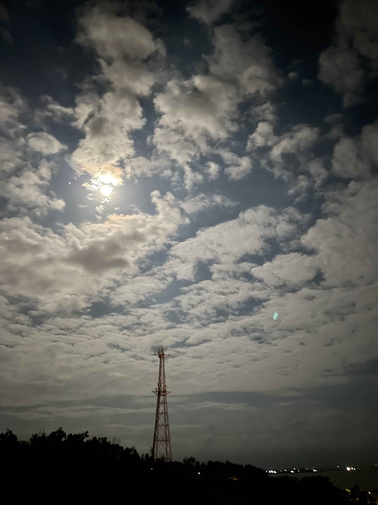

# 16 消逝

寫於 2022 年十一月

不知道從哪天開始，我就從一個剛退伍寫文章衝撞國軍的小子，變成一個憶苦思甜的老兵了。

我是個工兵，是個參一文書兵，也擔任過一陣子政戰部的新聞兵，但經歷二十年的歲月，最終到了坐四望五的年紀，不但退伍多年，甚至也除役多年，成為每年縣政府「老兵召集令」活動要召集的那種老兵。是個覺得應該沒有機會抽到限量的紀念酒，但又難免還是嚮往可以抽到紀念酒的老兵。一個多年後看到在精實、精進、精粹案之下，如今多少營區都已經廢棄，感到無比唏噓的老兵。在已經實施全面募兵制之後，又聽說義務役役期要改回一年，又不禁擔憂的老兵。

在我二十幾歲的時候寫的這些文字，停止衝撞的哪天，就從我如何讓長官、讓我認識與不認識的人看到精實案下的基層部隊到底有多混亂，變成我今生滿滿的回憶了。那天，我有個舅舅，請我們家裡吃了一頓飯。

## ▲ 指南山莊

商周版本的《驗證精實案》出版的幾個月後，接到家母的電話，說，我們那個平常很少往來、幾年都不見得見到一次的舅舅—其實應該說是表舅，是家母的表哥，但家裡還是要我稱他舅舅—要找我們家吃飯，三姨媽家、五姨媽家都會去。

家母轉述，舅舅交代，我一定要出席，他很想要見見我，印象中這位舅舅很少請我們這家吃飯，而且既然是家母轉述，那也變成家母要我去赴宴，那就變成非去不可了。

宴會時間在週末，地點是指南山莊營區。在我求學期間，指南山莊對我來說，就是塊隔開了母校兩個校區中間的一塊地；在母校開始鋪設學術網路的那幾年，由於兩個校區之間隔了一個指南山莊，沒辦法把網路電纜拉過去，所以兩個校區分別架設了發射站，用無線的方式傳送網路訊號；有些附近居民大概覺得發射站所發出的電波會影響身體健康，三不五時會往發射站丟石頭，只要哪個發射站被打歪了，偏離訊號傳送的軌道，山上的那個校區就會斷網。說也奇怪，如果照原本的電波軌道，還不見得會把電波打到居民身上，你把他打歪了，不就更有可能往你身上發射電波嗎？

而退伍之後，看到這個營區，也整個覺得不習慣。我習慣的營區是用空心磚加上水泥建造的，外牆塗上迷彩，在這種營區裡頭，來來往往的都是穿迷彩服的人。指南山莊讓我無法聯想到營區，這地方給我的感受倒像是南海路上的博物館那類型的建築物。

總之，我知道指南山莊在哪裡，從來搞不清楚裡頭是個怎樣的地方，做的是些什麼業務。

舅舅來金門看過我。下部隊那年的七月，一個萬里無雲的大熱天，舅舅來看過我一次。快十一點左右，安官室接到電話，要找連長，轉接到連長室之後，連長廣播找我，要我把衣服穿好，把皮靴稍微弄乾淨點—工兵弟兄的鞋一向是全防區最髒的，我還搞不清楚狀況，就被連長叫上了小車，前往花崗石醫院，帶到花崗石醫院的一間會客室。連長先請示進入，關上門，在房間裡頭講了兩句話，又出了房間，叫我進去，我看到在穿著軍便服的舅舅坐一張辦公桌後。

我突然想起來，明明家裡在六月初的端午節擴大眷探看過我，端午節後，營部正忙著弄精實案部隊重新編成的時候，又不知道為什麼一直打到連上找我，說會有人來看我，家母在我入伍前兩年生了一場病之後，詞彙變得比較有限，話也講不清楚，我也搞不懂誰會來看我。應該是在端午節期間，家母遇上了舅舅，舅舅就答應了如果到防區公出，就會來看看我。舅舅讓連長先離開，讓我在花崗石醫院獃到快要下午兩點，讓花崗石醫院出了台小車，再把我送回連上，連上下午兩點的集合、任務分配，也差不多結束。

連上知道這件事情的人應該不多。連長應該沒有跟別人提過，我總覺得連長隱藏了很多連上的秘密，其他知道的，就是小車駕駛與接電話的安官了，駕駛小車的學長記得應該隨著八、九月提前退伍案之後的大退潮一起退了，哨上的安官雖然七月才剛晉升下士，但因為家住中部，十月多也因為震災辦了提前退伍，就像我也不知道許多同在連上的弟兄的事情一樣，營部的長官與連上弟兄應該都不知道我這件事。

站安官的下士學長下了哨，脫了衣服，只穿條草綠汗衫坐在大寢室外的大樹下，準備去出製磚廠的公差—理論上有衛勤的弟兄也揹待命班，不該出公差，但這個部隊從來就沒遵守這個規矩—看到我回來，用一種像是埋怨的語氣說，「吼！原來你也有『八苦』喔！」

我不置可否，也不知道怎麼回答。但我好歹也知道只要抽到了防區的籤，不管有什麼「八苦」，除非部隊移防，否則在退伍之前，就始終會在防區，頂多在防區的不同單位間調動。我們工兵營屬於防衛部的直屬部隊，防衛部總不可能移防吧？平常我會接觸到一處、三處的文書，在本部連也不見得過得有多好，在我當時的認知中，也沒有政戰部這類的單位。也或許是某個時候開始，我也就認定自己是個外島工兵，就是這個工兵營的參一，我也沒說什麼，就把衣服也脫了，我正精神飽滿，跟著一起去製磚廠收磚，這天大太陽，空心磚下午就該曬得差不多了。

在花崗石醫院的那兩個小時也沒發生什麼。有人打了兩個餐盤上來，我和舅舅各一份，在辦公桌的兩側用餐，花崗石醫院的飯菜比較像…住院餐，沒特別好吃也不算難吃，而防區到底哪些單位用餐盤、哪些像連上用碗公吃飯，對我來說一直是個謎。舅舅一邊吃，一邊說，他早上九點抵達防區，參加一個單位的開幕儀式發表致詞，下午再去幾個單位，就要搭機回去了，稍微推算，那大概三、四點就要去機場，是個來去匆匆的行程。

面對舅舅，我也不知道該用面對家人、還是面對長官的方式答話，舅舅也沒問我過得好不好之類的，他應該也知道基層營連的生活就是那樣，反倒是他跟我講了比較多家裡的事情。吃了十五分鐘的午飯，看到我人還活著四肢完好，就打算午睡一下，也招呼我一起睡一覺—軍中在午餐後，原本就是午休時間，這間會客室裡頭也安排了兩張床，我也樂得在這裡歇一頓—這可是冷氣房呢！在連上哪有在冷氣房睡覺的待遇？

沒脫掉迷彩服，我就躺上床鋪，閉眼之前，閃過一個念頭：如果日後，我要用惡毒的文字遊戲描述這天發生的事，或許可以寫成—這裡有個基層工兵部隊的參一文書兵，才剛與弟兄們完成巨大又浪費人力的精實案文書作業，拿到一份根本不該用在外島部隊的編裝，他的部隊正面對著編現不足的窘境，接下來幾個月還會更加嚴重，這時候有機會見到國防部人力司的將官，但是長官這時候只顧著沈睡…。我該寫出這麼惡毒的文字嗎？咦！我是不是已經寫出來了？

搭捷運到動物園，再轉乘二三六公車到達母校門口，一路上想著，在我開始一開始動筆之前，其實也沒想過到底是要寫給誰看的，只覺得我在政戰部期間寫過好幾個部隊的報導，只想寫篇屬於我的部隊的故事，但說不定我是想讓舅舅看到，我這樣一個從小在星星泡泡堆中、吃著配給的大米與沙拉油長大，喝水的杯子上總寫著「黃復興黨部敬贈」的眷村第三代小孩，想讓我的這些叔叔伯伯知道，我所看到在精實案下的部隊是什麼樣子。徒步走上指南山莊，跟大門衛哨說我是軍眷，就放了我進去。大門進去第一棟建築物就是餐廳，推開白色的木門，家母、還有其他家母那邊的親戚，像是三姨媽、三姨丈、五姨媽、五姨丈，都已經入座了，我也到家母身邊坐下。

餐廳裡頭，看起來就只有我們家這一家軍眷桌。環顧四周，旁邊還有七、八張桌子，那邊是一片鬧哄哄的青色，鬧哄哄的是屬於宴會的交談聲，至於為什麼是青色？那七、八桌滿滿坐著的，都是穿著軍便服、有說有笑的國防部軍官啊，而且連舅舅他那一房的家人也沒來。我不禁想到，在兩千多年前，項羽曾經請了劉邦吃了一頓酒宴…。

宴會開始了，舅舅站了起來，他同樣穿著軍便服，從他所在的軍官桌走到了餐廳前頭。「楊 ○○！過來！」也不知道這是一道是由將官下達給一個小兵，還是長輩下達給晚輩的命令，不管是哪種，在這個場合，我沒有任何可以抗命的機會。舅舅一把把我抓了過去，左手持著杯子，右手摟著我，手掌搭在我的右肩上，以宏亮的聲音說著：

「各位長官！各位同袍！各位弟兄！」

指南山莊餐廳裡安靜了下來，目光都看著舅舅，還有舅舅身邊的我。

「耽誤大家一些時間！」舅舅繼續說，「在這邊，我要跟大家介紹一下，這位—」舅舅拍了我的肩膀，「就是我的外甥。我這個外甥啊！他啊！他很優秀啊！」接下來，他每說一個字，就拍了我一下肩膀：「他啊！很．會．寫．文．章！」

餐廳依然是安靜的。舅舅把我推開，下了另外一道命令：「好了！去吃飯！」

屬於宴會的那種吵鬧又回來了，舅舅回到他的軍官桌，我灰溜溜地回到家母身旁坐下，而且突然可以理解為什麼家父為什麼沒來，為什麼不太想出席這個場合。「怎麼回事？」家母看起來搞不清楚狀況，「嗯…舅舅誇獎我，說我很會寫文章。」「喔！好棒喔！很會寫文章！好棒喔！」

我們這桌軍眷桌就繼續各種家常話題—最近碩士班讀得怎麼樣啦？什麼時候要畢業啦？畢業以後打算做什麼啦？我那個嫁到國外的表姊可能什麼時候要回來啦？南門市場附近有一家很好吃的點心你們有沒有吃過啦？啊姊夫有沒有打算退休啦？菜餚一道一道端上餐桌，我也就拿起筷子吃了起來。中華民國國軍教會我不少事情，我想其中有一項應該是，就算是多尷尬的飯局，只要是能吃的食物，我都應該吃下去。

飯局差不多要收尾了，其他軍官桌的那一大片青色慢慢散去。舅舅又走了過來，告別我們這家子人，又把我抓了過去。他一邊跟我說話，一邊用拳頭搥我胸口。

「你啊！（搥）楊 ○○ 啊！（搥）你小子啊！（搥）年輕人啊！（搥）年輕人啊！（搥）很厲害嘛！（搥）很會寫嘛！（搥）很會寫嘛！」

搥搥搥搥搥。

## ▲ 塵封

我不知道因為我，讓舅舅遇到了什麼事，面對了什麼壓力，我也不太敢開口問，但就算我不知道這些，我就算再笨，也不會不懂舅舅的意思：小子啊！你夠了吧？

但我這樣也夠了吧？我不知道這七八桌國防部軍官裡頭有哪些人，但我一個小兵寫的東西，我所看到的精實案下的基層營連，也已經被國防部的長官們看到了。我有好多事情想要記住，也希望能被更多人記住，長官們或許也會記住吧？

其實我也不指望多少人可以看到，而是有能力改變些什麼的人能看到，離開那個地方我也不能做些什麼了。2002 年有次國防部找我去看了一個新的人事系統，看看軍中有哪些進步，我也只是走馬看花，這套系統改變多少、好不好用，該是去問還在每個月還在做人令做線傳的人吧。

展示結束，當時的總司令霍守業還見了我五分鐘，給了我兩份外島服務紀念章—這玩意在拍賣網站上，市價一個一百六到一百八之間，我那時在想，或許，我的紀念章不太一樣，因為是總司令給我的，不過，說起來，全軍拿到的外島服務紀念章，都是總司令給的。

我都來給軍方摸頭了，接下來還要寫碩士論文，真的沒力氣再管這些事情了。這樣，對我而言，應該夠了吧？

再一次遇到舅舅，他也已經退伍了，那天在外婆家，他梳了一個油頭，穿著有變形蟲花紋、有點花俏的襯衫，變成了一身的商人打扮，又過了幾年，有陣子又在新聞上看到他。在這幾年之間，花崗石醫院也被裁撤了，指南山莊營區這塊地也被交給了母校，成為校地的一部分。我所去過的營區、去過的軍事設施，還有我過去的部隊，都隨著歲月慢慢消失。

在工兵營搬離漁村營區的時候，我正在寫碩士論文。之後我在學校做了一陣子行政工作，在準備轉行成為軟體工程師的時候，國軍繼續精實案之後的精進案，2007 年防衛部從司令部降為指揮部，各旅又改編為守備大隊的時候，我正式改行；在 2013 年精粹案的時候，我在一家本土的軟體公司擔任手機 App 開發的小主管，管理十名軟體工程師，最近幾年我又換了一次工作。我的時間放在職場上，我認識了很多的新朋友，我賺取薪資然後繳稅給中華民國。軍旅、以及防區發生的種種，也離我愈來愈遠。

但過去總是陰魂不散，記憶總是等著在一個你沒想到的時刻回來侵襲你，有些你沒想過的鑰匙會扭開櫃子上的那把鎖。像是，在 2022 年中開始，你又感受到備戰的緊張氣氛，你從新聞上，看到正在將義務役從四個月的軍事訓練變回一年時間的消息，你突然想回去一趟，你又真的去了一趟。還有，你聽到有人告訴你，弟兄不在了。

這些，也讓我開始回想二十年前的一切，想到我當初還有一段沒寫出的第十五章，我趕緊寫了下來。還有—我不滿的是什麼？我又曾經收穫過什麼？

## ▲ 不滿

過了二十年，我似乎有能力說明上個世紀九零年代的國軍遇到什麼問題。

軍中分成領導職與幕僚職，領導幹部負責管理、統御部隊，幕僚職則負擔那些一日不可停下的業務。由於基層幹部人數不足，在補充幹部的時候，優先補充領導幹部，導致幕僚軍官缺員，在晉升時，也往往看重在領導職、而非幕僚職的表現。九零年代，大專教育普及，大批的大專兵進入軍中，這些大專兵比軍校教育出來的軍官，更清楚怎樣經手業務，結果就是，大量的日常業務，就落在義務役官兵的身上，以士代官、以兵代官，居然變成了常態，至少在外島陸軍如此。

而在外島，還會有因為是在外島，所以產生出的業務。在薪餉的部分就多出一筆外島加給業務，休假的部分還多出了返台、眷探、返台特別榮譽假等不同種類的假期，還有隨之而來的差假人數管制、機位安排等工作，假單這種應該很簡單的東西，卻成了一種特別複雜的稀缺資源，每個部隊居然還需要有人專門負責。加上外島駐地分散，又導致許多可以在營部統一負責的業務，分散到了連隊、甚至排級的單位，有更多的人員必須承擔業務。

這同時也就代表著，大批原本應該從事戰鬥工作的人員，得去擔任非戰鬥性質的工作。在這種狀況下，還想要看起來有著優秀的訓練與戰備表現，就讓部隊走上了造假這條路，讓基層營連造假的誘因太大了。一個被送到外島的阿兵哥，就這樣一直做著業務，奮力用文書維持著讓部隊得以運作的那個軀殼。承辦業務所需要的知識不是透過系統化訓練，而是讓流水的兵之間透過師父徒弟傳承，參一二三四各參文書都沒有相關的訓練班隊，而業務做不好，改進措施也不是看看基層到底是誰在承辦這些業務，而是下達更多的規定，印行沒有人去看的手冊。

然後國軍推動了精實案，朝著精簡的方向前進，但是國軍這個巨大的暴力機器，還是先維持著原本的步伐，按照慣性的軌跡移動。我在部隊裡頭的貢獻是什麼呢？我做的，都與大方向背道而馳。姑且不論部隊帶給我個人什麼，部隊要我做的事，要我付出的，我在二十年之後還是一樣困惑。

我在政戰部，幫一份兩年之後就被裁撤掉的軍中刊物，維持了半年的生命。我所屬的工兵部隊在裁軍的大時空之下繼續大興土木，好讓日後縣政府有著大大小小的營區可以拆除—就在各師改編成聯兵旅，大量部隊移防回台灣的那天，我們應該要知道防區以後不會有那麼多的士官，也不需要自己訓練那麼多士官了，防衛部選擇了擴建幹訓班校閱場。

幹訓班校閱場是合併原本幹訓班以及被裁撤的明德班而成的，裁撤明德班是裁軍大方向的結果，不也就清楚代表了，我們不需要這麼大的幹訓班？

那這個工程的意義到底是什麼？因為我們還有個工兵營，所以要讓工兵營有事情做？但是在精實案部隊重新編成的前後，因為不確定之後的編制，我的部隊因此並沒有撥補到足夠的兵員，編成之後的員額也變少了，但部隊還是照著慣性運作，各種日常業務，還是那麼多。

別說為誰而戰，為何而戰了。在這個豬吃人狗吃人的環境中，我在戰鬥嗎？我能戰鬥嗎？或是，我能夠支援了哪場戰鬥、哪種戰鬥？部隊曾經讓我學會任何一種戰鬥方式嗎？我做的哪件事情跟戰鬥有關嗎？國家召集了我，但我到底捍衛了什麼？如果我真的從事了某種戰鬥，大概也只是與體制、與各種作業規定奮戰。

我恨死了這一切，我恨死了那段疲倦、空虛、胡搞瞎搞的軍旅生涯。但是在拉大的時間維度之後，以前當兵時每天那種不真實的感受，或許也隨著精粹案之後全面募兵制的實施而消失了，消失的好不真實。

我恨的對象不見了，我應該要開心吧？但好奇怪啊，當我沒有對象可以恨了，身邊愈來愈多人沒有相同的經驗，想要描述那個已經過去的時空，但愈來愈少人可以和你交集，有時反而覺得寂寞了起來。

你看，一群男性聚在一起，最能夠討論的話題，就是女人還有當兵。在一家軟體公司，一個主要由十來個男性工程師與專案經理構成的部門裡頭，前者嘛，公司的人力資源部門不希望你談，後者嘛，你突然發現，整個部門裡頭居然只有兩三個人當過兵，免役的、服替代役的、反而才是主流。

## ▲ 收穫

可是我在軍中還是學了不少東西。

我沒學會多少戰鬥工兵技能，服役期間就滿懷著恨意架過兩次橋（但說也奇怪，我去我們的 LINE 裡頭問，架兩次橋居然已經是最多的了，其他人就只有個一次，或根本沒架過橋），但我其實在工兵營學會不少東西。我學會了一種用方鍬鏟沙時省力的技巧，也學會了在搬水泥的時候，如何放低身體重心後，兩腳都大步橫跨，好快速奔跑的那種叫做「七星步」的步伐。

龍淵，我那個弟兄，那時候也教會我怎樣調製提振精神的飲品。

如果早上八點鐘被安排的任務是去製磚廠，那麼大約十點到十點半左右，就會做好可以鋪滿製磚廠那塊泥巴地的數量的空心磚，接著就是讓日光曝曬，下午再來收磚，「小蜜蜂」也會準時出現。我們會買一瓶一公升的沙士與維士比，然後看龍淵表演。

大家先用幾個紙杯分掉介於三分之一到一半的沙士，然後直接從瓶口倒入維士比，蓋回瓶蓋，快速晃動，就成了散發著一點點酒香，有著一層泡沫，喝起來甜味中帶著酸味與酒香的特調，一口下去，馬上舒緩了搬磚一個上午的酸痛。如果沒有出花力氣的公差，可別隨便喝，否則晚上睡不著，隔天無論是衛勤、業務還是公差，全都作息大亂。

雖然碳酸飲料那麼多種，龍淵總是挑選沙士，我們幾個菜鳥也一向信任龍淵的鑑賞能力，就算小蜜蜂也賣套好的特調，我們還是喜歡看龍淵表演。根據他的說法，無論是奶茶、椰奶，也都可以套維士比，而真正的行家會套番茄汁—以上都不是我能夠接受的味道，也沒看龍淵調製就是了。

而服役期間，總覺得退伍之後，我會的那些參一業務知識一定一點用處都沒有，但沒想到我卻因此跟家父有了話題。

入伍之前那段時間我完全不知道可以跟家父聊些什麼，甚至在新訓期間放結訓假的時候，還因為受不了家裡的氣氛，衝出家裡，又沒錢、又沒地方可去，就索性提早一天跳上往苗栗的車，回新訓中心收假。大門哨看到有新兵會想提早收假，覺得莫名其妙—哪有人不想放假想回營區，還再三確認，如果我進了這道門就不能出去了，你確定？如果我當時知道我會抽到外島籤，就不會那麼確定了。

原本鬧哄哄的新訓中心，在新兵結訓假期間變得冷冷清清，想起來我這個剛入伍的新兵，體驗的是新訓班長的日常。但整個營區就我一個新兵，換掉一身衣服睡覺，早上還是照平常時間起床，留守的班長讓我一個人在中山室讀那本家裡帶來，叫做昨日之島的小說，中午也沒進餐廳，就跟著留守班長兩個人吃麵條。空蕩蕩的新訓營區其實也頂舒服的，這種事只有自己提前收假的怪咖才會知道。

退伍多年後，為了報稅，在家裡翻找東西的時候，我翻開了父親的那本檔案夾，就饒富興味的翻了起來—你看這種有一堆直式的格子，最上頭是一堆人名的公文，還能是什麼？是人令。家父是陸軍官校專修班出身，在軍中服役五年，我快速翻過去，看到了少尉任官與晉升中尉的人職令，以及砲兵專長與情報專長的人專令。

家父在砲兵學校結訓後，就分發到雄獅部隊擔任砲兵觀測官，駐地在防區東邊，我不禁在想，我的外島籤運應該來自遺傳，不過如果你去像「金門部落」這種社團上講這個，就會有人來按讚，留言說「父子都好籤」。在這份人令上，看到他的出生年月日，比實際上小了四歲，也就是，當時他謊報年紀去念軍校，而在防區任官的那個二月，呵，怎麼跟我一樣是在要大過年的時候去，實際年齡還不到十七歲。我開了口。

「你這麼小就去防區當軍官了啊？」

「你才知道啊！一結訓就坐開口笑補給船，坐在補給品的箱子上面送到前線啦！一到料羅碼頭，也沒有人來接我們，我就跟我的同學從碼頭一路走路到太武山上的防衛部。」「你們怎麼走的啊？料羅到我們漁村五公里，漁村到太武山上又是五公里。」「反正我們中午到，一直走到天黑才到防衛部報到，晚上雄獅部隊才派車來載我們。到了碼頭都還沒人來接，根本就是欺侮人…」看來有些事情過了六十年，還是會讓人耿耿於懷。

「你有空幫我去西吳看看。」「那是什麼地方？」我還真沒聽過西吳，從地圖上來看，這裡介於陽翟與山后兩個比較大的聚落之間，獃過防區的人想來都去過陽翟與山后，但中間這個西吳我還是第一次聽過。「整個西吳就只有一戶人家，從這戶人家出去，有七八個碉堡，我們那時候就一兩個班睡一個碉堡，全連都在碉堡裡頭，你去看看那些碉堡還在不在？」怎麼找啊？六十年了耶！

「你們那時候都做些什麼啊？」「出任務啊！構工啊！每天還要跑馬山，跑美人山啊，美人山後面還有一個觀測所，我們帶的通訊設備，都是那時候最新的，還有山后，山后有個小姐好漂亮，那時候都是她在幫我洗衣服。然後我們還會去打砲，從我們這邊打宣傳彈，可以打到集美。」「哪裡？」「廈門的集美區啦！比廈門島還要更遠的地方！」

「那個時候擎天廳才剛蓋好，才正要開始挖人工湖，然後我們部隊則是要去修一條路，我們那條路就是從沙美出去，然後一直往西邊走…」「喔？原來環島北路是我爸修出來的？」「你幫我把這幾張照片弄進手機裡頭，這些都是特地去陽翟照相館請人家拍的…」

「你那時候連上的觀測官應該相當於排長，還要掛紅色月經帶揹值星對不對？」「開始掛紅布條就是我們那時候開始的啊。」「你那個時候才開始有紅布條？」「你才知道啊！而且那時候連上還有個老士官，那時候當到了准尉，整天都看我們這些菜鳥軍官不順眼，都覺得我們是不會做事的小朋友。」

「你那時候本來就只是小朋友，不過…准尉？那又是什麼？」准尉是一種介於士官與軍官之間的階級，在民國六十九年制定《陸海空軍軍官士官任官條例》時廢除，在時間的長河當中，軍中消失的東西遠比我知道的還多上許多。甚至，連值星帶都走進了歷史。

我繼續翻，翻到一張搭船回台灣休假的公文，用鋼板刻的，不過聽說並沒有成功回台，然後有一張結訓證書，一紙人專令，又多了一項砲兵專長。接下來也很有趣，居然有三份晉升中尉的人令，陸總部發了一份，雄獅部隊發了兩份。

「我看看喔。陸總部這份文如果要到防區，那時候應該得坐船，可是我爸那時候早就應該晉升了，所以可以合理判斷，雄獅部隊那時候就自己先幫你發了人令，這樣你才可以領到中尉薪水，可是…為什麼雄獅部隊又先後發了兩份？」多年之後，你兒子也一度被國軍資訊系統荼毒過一番，而你這個兒子，又突然感受到，在沒有資訊化之前、在國軍人事主檔存在之前的人事作業，可能有多可怕。

晉升中尉的同時，雄獅部隊移防回到台灣，接下來又調職到情報總隊，也是一個現在已經不存在的單位，所以我看到了調職人令，兩份情報訓練的結訓證書，還有因此去取得的兩份人專令，這時候開始，寫上的就是真實的出生日期了。

「我那個時候有機會去兩個單位，一個是去情報總隊當審訊官，去這裡就可以每天上下班，我就每天都去外面那邊搭公車。」「另外一個呢？」「陸軍儀隊，那麼操，誰要去啊？」「你有沒有想過，改天你會有個兒子，會希望有個去過陸軍儀隊的爸爸？」「沒想過。」

「你這個時候還去申請補發砲校結訓證書，你這些人令都留著，怎麼會把結訓證書給弄丟了？」「那是被人家弄丟的啊，我到雄獅部隊之後，結訓證書放在人事官那邊，結果就被人家給弄丟了。」「人事官怎麼會弄丟你的結訓證書？」「那個人事官死掉了，那時候有好多東西，都在他的箱子裡頭，結果部隊把人家整個箱子的東西都丟了。」「人事官死了？」「砲彈炸死的。」

「金東電影院還在不在？」「還在，不過我當兵的時候就荒廢了，連山外的電影院都荒廢了。」「以前砲彈專門打金東電影院，蓋了就炸，炸了再蓋，蓋了再炸…」

再翻過一頁，呵，我所辦理過最複雜的參一業務之一，是婚報表啊！這時候父親已經離開軍中，但母親還在軍中服務，所以這其實是母親的婚報表，另外還有一份政戰部門的調查表，評估家母是不是打算跟匪諜結婚之類的。

軍人婚姻業務作業規定在民國九十四年廢止了，我也搞不清楚現在是否需要填寫婚報表，以我看來，家裡這份婚報表是不合格的，這份婚報表上，在填寫介紹人的地方，只寫了介紹人的姓名，卻沒有蓋上介紹人的章，我如果呈報這樣的婚報表，一定會被防衛部打槍。但這份婚報表還是經過主官批可，蓋上關防生效了，我也對當年承辦這份婚報表的參一文書滿懷感激，如果沒有人處理這些麻煩的業務，也就不會有我了。或許，我辦過的婚報表，也讓一些寶貴的生命因此可以來到這世上。

不太對勁，少了點東西。

我看到了人職令、人專令，但是還有一種人令，怎麼沒看到人勤令？「你這個兵到底怎麼當的啊？服役五年，居然連一支嘉獎都沒有，反而是退伍一年之後協助動員召集，記了一個沒用的小功。你什麼人令都留了，總不會把人勤令丟了吧？是你當兵有什麼問題？還是你的長官有問題？雄獅部隊與情報總隊都有問題？」

父親開始一陣苦笑。「我那時候的所有獎勵啊，都被上尉以上的軍官搶走了！」「當年都沒有人幫你記嘉獎，要不要改天你兒子來幫你寫點東西，幫你寫個少年任官記？」「唉！不必了！不—必—了！」父親伸了個懶腰。

父親把快要六十年前在軍中所有跟他有關的文書全都留下來了，也應該是想記得些東西，也想被記得，或許在我打開這份檔案夾的時候，對他來說，也夠了吧？結果卻跟我想得不一樣，家父看我翻這些人令翻得這麼開心，又讓我看了家裡頭更多的人令；雖然他留下了自己的各種文書，但家裡還有對他來說更重要的東西。

那是一份民國三十九年九月一日，由陸軍總司令孫立人頒布的調職人令，在眾多的調職人員當中，有位官階是軍薦二級的軍用文職人員，從陸總部第四組組長，調職成為第二組的組長。

我也搞不清楚軍用文職人員是什麼，查了一下，根據一份民國四十八年的總統府公報，「軍用文官任用暫行條例，現任軍用文職人員登記條例，軍用文職人員轉任普通公務員條例，軍用技術人員任用暫行條例，暨軍法及監獄人員任用暫行條例，予以廢止。」這應該是一種民國四十八年之前才存在的名堂。至於民國三十九年的時候，陸總部每個辦公室到底在做些什麼，我也搞不清楚。

那是爺爺的調職令。我不知道父親是什麼時候，還去想辦法從祖父的同僚那邊，找回紀錄了祖父一生經歷的人令，他也打算把這些都交給我。但是，過了七十年了啊，陸總部裡頭的軍用文職人員到底在做些什麼工作啊？我還是不懂爺爺當年做了些什麼。

我沒去過外島，沒做過參一，應該沒辦法開啟這些話題，看出人令裡頭的名堂。可是，我下部隊佔的是個橋樑排的戰鬥工兵缺，如果是個正常點、按照編制用人的部隊，我又不該懂這麼多奇奇怪怪的參一業務。

我還有哪些收穫呢？我和弟兄們又走了一趟防區，好像找到答案了。

## ▲ 歸途

「十月連假，我們回連上喝酒！」

八月的時候，對岸的無人機開始滋擾防區，滿滿的都是相關新聞，我想起身邊有人之前旅遊時在新湖漁港打卡，提到去新湖漁港前沒看到什麼營區，只看到一個清潔隊，查了一下，才突然發現原來我的營區十多年前就變成縣政府的機關用地，停滿垃圾車了。出於好奇，又剛弄完一個比較大的客戶案子，就請了年假回防區走了一趟，當成自己的生日禮物，在東邊這一帶亂騎腳踏車，這一趟下來，二十年來我對防區或是壓抑或是遺忘的感受，就一發不可收拾了。

幾個弟兄弄了一個 LINE 群組，然後翻箱倒櫃找出以前的通訊錄，在臉書上名字看起來很像的人也亂加一通，把連長也加進來，但大部分人都還是失聯了。像是約翰，退伍一年後出國留學，就找不到聯絡方式。然後，跟我梯次相近的二級兼一級糧秣士（黑牌的，業務是糧秣，但其實軍階只是兵而已），在群組中留言提議；他三年前去過一趟，然後在群組裡頭，貼了一堆漁村營區的照片。

「有誰想要去？」

「我才剛去一趟…嗯，去就去。」我回應，因為上半年度疫情爆發，我都沒有放年假，多的是年假可以放。不過，「那邊現在是縣政府的地，有人在那邊上班耶。」

「那就晚上進去啊。我們就進去喝酒，去山外弄點滷味什麼的帶進去吃，又沒有要做什麼。」

「山外早就什麼都沒了啦，你真的要吃東西，去市港路或是環島南路上找熱炒店或是海產店還比較實際。」

「我想想喔，既然漁村變成廢棄營區了，那我應該可以來幹一些以前不能在連上幹的事情，嘿嘿。」我在群組裡頭留言。「我想在連集合場上裸奔，然後要在連長室喝酒，一邊喝還要一邊開直播，叫連長來看，跟連長說，嘿！我在你房間喝酒！喝一喝要去營長門口上廁所，尿在他的門上，最後跳上司令台光著屁股打手槍，最後我要射在司令台的那面中華民國國旗上，施放二十一世紀最燦爛的一道煙火！」

我在剛下部隊的時候，還真的想過，在哪天早點名還是晚點名的時候，就乾脆把褲子脫了，當著全連的面前打手槍，讓全連都覺得我是個神經病然後辦因病停役。後來我一直沒有執行這個計畫，一方面我發現，以種種跡象來看，其實全連、全營、全防區甚至全軍，應該都有神經病，光是脫褲子打手槍的神經病程度，應該沒辦法達到停役標準，而想搞因病停役的這個念頭可能會讓我之後更麻煩。更實際的原因是，我在講話隊形當中，根本就硬不起來。

「你認真？如果真的要去，我還想帶小孩去耶？」我們的行政留言。

「你才認真？帶老婆小孩去我們當兵的地方，他們才會無聊到死吧？跟家裡請假嘛！」「這樣我沒辦法，而且幾年前我其實回去過。」「哦？」

「政戰士學長？菜鳥參四班長？去嘛去嘛！」

「不行，要帶小孩。」

最後我們湊齊了三個人：來自台北的營參一，來自台中的二級與一級糧秣士，來自高雄的駕駛兵。我額外多請了兩天假，加上原本的十月連假，總共來五天，糧秣士安排了四天，駕駛兵呢，只能來兩天。感謝兩位大嫂，把老公借給我玩上個幾天。八月底決定要走這一趟，三個人馬上訂了機票住宿。

以我的時間軸來看，十月七日，我第一天下午抵達，第二天早上先走我的行程，下午另外兩位抵達，放好行李，我們先在金城會合，再去連上喝酒；第三天，我先退房，搬到另外兩位所住的旅館，我們三個人再先一起隨意吃喝，送駕駛兵去機場，然後隨性亂走—後來去了瓊林與成功—晚上參加從金城總兵署出發的「後浦情事」導覽，第四天去小金門，第五天再一起去機場，各自飛回台北與台中。

這趟我終於去了小金門，原本以為十月大橋就可以通車了，還在想能不能弄個跨海大橋單車行程，沒想到要到月底才通車，所以還是搭乘渡輪，然後在九宮碼頭租借公共腳踏車環島。我以前還真沒來過小金，以前如果沒有通行證，大金的阿兵哥不能去小金，反之亦然，但是在 LINE 群組裡頭一問，一堆人居然二十年前放假就換了便服去過了，還說什麼「那時候碼頭的憲兵也都知道你是換了便服的阿兵哥但是心照不宣」這種話，真是…。我還真不懂，像我這麼守規矩的阿兵哥，怎麼那時候營長一天到晚說要把我抓去關，而且那時候，去小金也只能去東林與西方，那跟我們去山外也沒什麼差別嘛。

在那個半小時一班的渡輪上，電視播著總統府前的國慶直播，這次國慶的重頭戲是來自日本京都橘高校的表演，但整個地面都是濕的，看來台北得下個一週的雨，防區倒是豔陽高照、萬里無雲，繞了小金一圈居然又整個曬黑了。

我們先從九宮碼頭沿著九井路衝到湖井頭—中間在東林買個喝的，逛一下烈嶼文化館—然後往北走環島自行車道，經過紅土溝、貓公石、勇士堡、金剛堡，中午吃三層樓餐廳的芋頭大餐，再經過防雷區公園，那天不知道為什麼不讓我們過去往將軍堡的路，所以繞個彎去了后麟、麒麟山，回到羅厝。之後，再走南邊這段，經過東崗—對，三七事件的那個東崗、在青歧看看復興嶼，騎到南山頭據點，天色晚了，走八青路回程，再從八達樓子轉回九宮碼頭。

小金門的自行車道帶給我的樂趣一點都不輸給日月潭。這條路還保留著以前戰備道的情調，以前防區很多條路，都只是在泥巴路上鋪著兩道只有輪胎寬的水泥，以前去工一連，就是在一片草叢之後，出現一條這樣的戰備道，但從工一連變成現在的柳營軍事體驗園區之後，反而變成一大塊讓我認知錯亂的停車場—小金門的自行車道在原本的基礎上，又在兩道水泥中間，加上一道紅色的路面，比以前乾淨很多。

周圍都還是我又熟悉又習慣的景色，身邊的樹木因為爬滿像牽牛花與珊瑚藤這類爬藤，也讓樹叢後的事物顯得更加隱密，也用紫色與粉紅色妝點這份隱密。在這種隱密之中，隨時會藏著一個營區，而外島服役的經歷可以培養出察覺那裡可能會有個營區的一定能力，會讓你看到了什麼可疑的地方，就忍不住停下來看看，這趟自行車之旅，又有點像是個尋寶之旅。

腳下的一根一根的落葉像是被烤過了一般，那是木麻黃與松樹的針葉。話說颱風那天整座太武山上，在國家公園裡頭，到底吹倒多少棵樹，工兵營還有全防區所有部隊，去拉直、鋸開了多少棵樹。總感覺在防區，植樹節是個比軍人節還重要的節日，軍人節還可能因為管制休假沒得放，植樹節時還真的得去種樹。

「老婆你看，這個地方好漂亮！這邊有好大的一片海，而且還可以直接看到廈門！」我身邊的糧秣士拍了張照片，再用手機把照片與訊息傳給在台中帶小孩的老婆，然後轉過頭來跟我說，「○ 的！這是什麼恐怖的地方！」

紅土溝據點的哨亭可以讓每個站過夜哨的阿兵哥先發出「哇」一聲驚呼，然後從心底升出一種痛苦感受，叫出一聲「喔喔」。這個哨亭直接就在海邊，對著北方的海，也就是說，冬天的時候，冷風會直接灌進來，感覺就算上哨前喝個十桶八桶的薑湯都不夠；而颱風那天晚上，應該整個哨亭都會被海浪吞沒，颱風那天我們在大門哨都可以撿到從海上飛過來的魚了，這邊又不知道會撿到些什麼。

「有沒有突然感覺我在工兵營很幸福？至少我們大門哨距離海邊還有個兩、三百公尺。」「那我們下次找個冬天晚上來這裡體驗這個哨如何？」「不行不行不行，むりむりむり！」我們的糧秣士學起了動畫人物，做起在空中揮巴掌的動作。

不行，這種痛苦的感覺愈來愈強，在防區遊歷的時候，實在不要去聯想自己在這些地方當兵，把別人的跟自己曾經的痛苦一起疊加在心上，會巨大到無法承受。去下一站吧，但沒想到晚點再經過東崗的時候，那種感覺更強烈了，我無法想像自己有沒有能力去執行那樣的命令。

這趟我又去了一次大膽。算一算，這是我第四次登上大膽，在政戰部支援的時候，我上來了三次，都是二十年前的事了。支援期間，司令還另外上了三次大二膽，分別是陪同總司令、總長與新任總統，但是是由新聞官與其他的新聞兵出任務。

前往大膽的船早上八點半從小金門九宮碼頭出發，算算時間，七點就得從金城車站搭公車到水頭碼頭，搭乘七點半的渡輪到小金，八點在九宮碼頭的大膽旅遊櫃台報到，那等於六點多就得起來了—我抵達的第一天，下飛機後就只能簡單逛一下總兵署，買一些隔天要回連上用的防區名產，還有一些是帶回去孝敬家裡老人家的，反正中興路上最不缺的就是防區名產，當晚大概十點就先睡了，為了助眠，也先加減喝一點。

大膽行程真的很熱門。由於大膽島不大，所以一船大約三十到四十人，團進團出，一團觀光時間是三個小時，一天頂多就是三船，一天能容納的遊客也就大約上百人，一年之內開放的時間有限，冬天不開放、週一不開放、風浪大時不開放、疫情期間更是有兩年不開放，很多本地居民也在搶這個行程，因為那也是個連本地人都長時間不能去的地方。我看準時間搶到名額，這天天氣又好，我又幸運了一次。

沒看過這麼空蕩蕩的大膽碼頭，二十年前來這裡，碼頭上早就排好兩排穿著紅色急救被新的阿兵哥，船還沒停好，就已經聽到好大的一聲「司令好」！上岸後，有左右兩條路，以前都直接往左邊走，現在反而是我不能進去的地方。

以前出任務，總是來去匆匆，沒什麼兵的大膽島雖然奇怪，卻可以把神泉茶坊、北安寺、神雞寺、心戰牆這些地方好好走走—縣政府聘請的導遊非常專業，從大膽戰役開始，一一講解每一個景點。導遊說，大膽開放觀光之後，首先回來的，就是以前在大膽服役的官兵，每個上來都哭得唏哩嘩啦的，好吧，一個多月前光是騎腳踏車經過湖前的路口，就莫名戳中我的哭點，更何況是大膽這種地方，晚上還要在連上喝酒，我得堅強點。

很意外在神泉茶坊的牆上，看到一張民國八十九年朱司令、薛司令與歐主任，與大膽官兵的合照—這不就是我拍的嗎？這是我第三次、也是服役期間最後一次上大膽，那時候朱司令正要交接給薛司令，所以在薛司令佈達之前先上來一趟，五月份新總統就職第二天就來防區，而且來了大二膽，搞得新聞官與另一個新聞兵筋疲力盡，另一個菜鳥應該還沒辦法處理這個場合，就由我出任務。我興沖沖地把我在大膽島上看到我拍的照片這件事，傳到金門部落社群上，結果以前的新聞官上來留言，我又與新聞官透過網路聯絡上了，這又是另外一個故事。

離開前在紀念品店買了四件Ｔ恤，原本的官兵活動中心生明廳居然變成紀念品店了。紀念品店沒辦法刷卡，如果還有機會來的話，我要提醒自己多帶點現金。

當然，這趟最重要的行程，還是回連上喝酒。我最近才來過一次，糧秣士則是三年前來過，來自高雄的駕駛兵也是二十年來第一次回來，這一趟，有點像是我們當他的導遊，但明明駕駛兵應該比我們去過更多地方才對。

下午從九宮、水頭回到金城，與另外兩位弟兄會合，我帶上飲料，把兩件大膽紀念 Ｔ恤給了他們，吃了一家位在車站再過去一些的地方、同時賣牛肉麵、廣東粥、餡餅與捲餅的店，真懷念啊，這也是二十年就有的店。接著就從準備搭公車—以前我們來金城，都是搭公車，所以搭公車自然是旅程中必要的一環，不過現在的公車不太一樣，以前公車的車頭大大的，下車要拉繩子，現在則是嶄新、現代、乾淨又明亮的車型；往山外的公車路線，也跟以前不太一樣，也難怪，現在不行駛花崗石醫院了。

「我們要搭藍一還是紅一路公車？」紅一路是幹線公車，直接走伯玉路，而且會經過營區外面的陶瓷廠，要去連上，紅一路會比較快，但算算時間，等下藍一路就要發車了，藍一路中間會去機場、瓊林、還有太武山上繞一圈，然後直接從太武山前往山外。我跟我們的駕駛兵說：「你二十年都沒回來對不對？也沒看過現在的山外對吧？那我們也去山外晃一下，都不一樣了。真的，都不一樣了。」

繞遠路就繞遠路，跟我們從前在這個島嶼上花過的時間比起來，不差這點時間，上車吧！

我的悠遊卡剛好沒錢，另外兩位台中人與高雄人沒有悠遊卡，也沒帶悠遊卡的習慣，上車就開始湊零錢。「去山外兩段票，要二十四塊對吧？」以前車票應該沒這麼貴，但我猛然想起，對唷，我以前是軍人。我正要投幣，沒想到公車司機大哥馬上伸手把錢箱摀住。「先等等。你是軍人嗎？」

我沒想過還會有人問我這個問題。我都退伍二十年，甚至除役十年了，我身材還這麼胖，體重九十幾公斤，怎麼還有人會當我是個軍人？後來跟連長聊到這件事，他聽到也哈哈大笑，「不會啊，你現在的身材頂像個高階國軍幹部。」這是在諷刺我，還是本軍現任司令徐將軍？「算算年紀嘛，你說你是個少將副旅長，也頂有說服力的。」「防區現在已經沒有旅了啦！」「對喔，講旅就暴露年紀了，現在都是守備大隊。」

公車搖搖晃晃，一路說說笑笑。到了，感受一下吧，這荒涼的山外。

這個曾經為了讓軍隊消費而存在，一個因為裁軍而沒落的小鎮。

## ▲ 山外

一行人經過山外籃球場，走復興路，我抬頭看了眼土地銀行樓上，以前在這樓上有家牛排館，在支援政戰部的時候吃過幾次，沒了。山外雖然也就只有三條街，但二十年前，除非遇到過年，也是一到週日就鬧哄哄，塞滿阿兵哥的三條街，現在一個阿兵哥都看不到。

我們直接走到復興路底，先去看我們的駕駛兵最懷念的地方，整條復興路只有一半的店家門是開的，其餘的，都用拉上了的鐵捲門，回應著十月份下午四點蕭瑟的涼風。

糧秣士手指指向前方，對駕駛兵說著「你想要找以前跟龍淵打撞球的彈子房對不對？以前在轉角的那個頂尖高手，沒了。」「我當兵放假最常來的地方就這樣沒了喔？」「對，你看，沒了。現在是貢糖的門市了。」服役的時候沒聽過這個貢糖品牌，或許是退伍之後才出現的，這家有抹茶以及桂花口味的貢糖，這些口味對我來說有點離奇。

旁邊，喜相逢與談天樓兩家老店都還在，也是在山外附近服役的阿兵哥必定常去的店家，不過疫情期間不開放內用，門口還是排了四五個人等著取餐。以前放假我也會買喜相逢的閩式燒餅來解饞，但通常不到中午就賣完，現在已經傍晚了。

復興路上有文供站，還有金源成這類的軍用品店家。以前需要買收發文簿之類的簿冊、買卷宗、補充假卡啦休假預排表之類的表格，弄點列印用紙，得去文供站，現在呢，沒了。以前內衣內褲襪子破了、毛巾髒了，得買新的，大概都會來復興路；要買放假前擦皮鞋的鞋油與化妝棉，甚至大手筆買雙新的迷彩鞋，要買把皮帶擦亮的銅油，綁腿斷了、小帽弄丟了，也是來這裡。幾家軍用品店還在，但是燈光昏暗，門可羅雀，而且也買上了一兩排的貢糖，做起銷售名產的生意。

轉個彎，繞到中正路上，以前轉角那邊有家叫做離家五百哩的咖啡牛排館，在二十年前大概是整個山外最有格調的餐廳吧，整個內部都是木頭裝潢，在一堆牆面只有水泥漆的山外店家中，顯得格外突出。以我那一個月六千塊的薪餉來說，花個兩百塊來這吃上一餐，根本就是極致的奢華，那是我在山外最喜歡的店。一樣，沒了。旁邊應該有家漫畫出租店，還有好幾家網咖，都沒有了。

「我們現在三個人走在一起，但以前放假來山外，好像都去不同的地方？」「欸！對耶！你都跟龍淵去敲桿嘛，我後來都去營區外面，市港路那家京帝比較多。我倒是都不知道我們的大參一放假都去哪裡？」「網咖比較多囉，放假就去網咖寫信，一次收個幾週份量的電子郵件，平常在連上也不方便用紙筆寫信。」除此之外，我也在網咖看了當年有名的網路大作少年阿賓，這就不用跟弟兄說了。

「你們以前在僑聲戲院看過電影嗎？」我問了一句。「沒有。那什麼地方？」「就這裡啊！」我指著旁邊這座灰色的二層樓建築物，上面還掛著紅色的「僑聲戲院」四個大字，現在擺滿了抓娃娃機台。

僑聲戲院對我而言，算是二十年前在精實案中首先消逝的事物吧。聽說在八十五年左右，在東邊這頭的部隊，還會輪流讓軍官帶隊，帶阿兵哥去僑聲看電影。「我們這幾梯不都是大概八十八年一月抵防，然後就差不多要過年，就算我們是菜鳥，也都出去放假了嘛。我那時候就在僑聲看過一次電影。」我真的不記得當時看的是什麼，只記得三月一日其他各師改編成聯兵旅，大量部隊移防台灣之後，僑聲戲院也就同時停止營業，從此金屬防盜拉門就再也沒有打開過，還上了一個大大的銅鎖，整個山外街上，就屬這裡特別的漆黑。如果那次過年錯過了僑聲戲院，那恐怕還真不知道這是什麼地方。

關門的僑聲戲院門外，倒是開了家當時山外最好吃的雞排，我自己不常吃雞排，不過人事官如果知道我會去山外，會要我來買個兩塊雞排，一塊他自己吃，另一塊不加醬不加辣的給他的狗吃。我最常買的零食反而是炭烤火雞翅，我買過的火雞翅應該比雞排加上蚵嗲還多，用竹籤穿過大大的火雞翅之後，刷上醬汁炭烤，烤成了紅通通的顏色，除了山外的店家外，小蜜蜂也在賣—不過說也奇怪，退伍回到台灣之後，我好像也沒看過哪裡在賣火雞翅，鹹酥雞攤沒有，菜市場也沒看過，我也沒看過防區哪裡在養火雞，那防區哪來這麼多火雞翅？我看，就只能去問問每天晚上，在料羅灣海面上的點點漁火了。

即使那時候僑聲戲院已經關門，我們都還是可以在山外消磨一整天。吃東西，看漫畫，泡網咖，打電動，都有地方，在連上沒時間洗澡、睡覺，也可以花個一百塊去趟二樓的三溫暖，脫到只賸內褲沖個涼，真的很有閒錢，再下來一樓，按摩一節四百塊—純的啦！「攏無去啦！」糧秣士說，「山外啥咪攏無去啦，你懷念的東西都沒了。沒什麼好看的了，去連上吧！」

從自強路過山外橋，這邊有些房子被漆成五顏六色，現在居然也被當成一個景點，我們打算從太湖路繞到市港路上。「萬年青的招牌還在耶！」「沒營業了吧？」果然，玻璃大門深鎖，從門外偷看個兩眼，兩邊擺雜物的櫃子，居然也還跟二十年前沒多大差別。

萬年青往往是我們週日放假的第一站，或是最後一站。這是一家提供繡名條、繡臂章、兼營各種飲料零食，可以讓阿兵哥在這裡一邊吃炒泡麵配一個紙盒的阿薩姆奶茶、一邊看電視的雜貨店，從萬年青的後門出去，就是一條穿過湖前里的泥巴小路，走這條路比較不會遇到憲兵。每個工兵營營部連的新兵，會來到這裡，在嶄新的迷彩服上繡上那個你接下來軍旅生涯所歸屬的標記，一個也可能在你心中烙印一輩子的標記—那是個中間有個一豎的三角形。

放假的時候，幾個工兵營營部連的阿兵哥可能會先在這裡集合，再一起進入山外，或是快要收假前，在這邊再消磨一點最後的時間。如果你希望的話，也可以直接在這消磨一整天，像是你快要屆退，一直補假，又沒有動力去些別的地方，又沒多少錢，就可能這麼做。

工兵營營部連的阿兵哥常來，其他幾個工連的人來到營部洽公後，或許是前往山外搭公車的路上，也會經過萬年青，或許是受到營部連的人的影響，也常來。周圍還有一些其他部隊，也常來。

「那時候有三個剛結訓的海龍菜鳥，擋了我的電視。」糧秣士說，「那時候我就坐在後面一張桌子那邊喝阿薩姆看電視，那三個菜鳥進來，屌得很呢！直接走進來就走到最前面，擋住後面所有人，我就說，喂！你們擋住電視了。他們看了看我，什麼話也不說，就繼續擋在前面。」

「呵！人家覺得自己是防區戰力，瞧不起你啊。那你怎麼辦？」

「我就說，你們就是要擋住電視是不是？兩棲營的是不是？我跟你們的哪幾個班長很熟，結果他們就直接嚇到跳起來。」

當時工兵營兼辦兩棲營的一些營級文書作業，包括兵工、糧秣等，說起來這也相當合理，我們好不容易訓練出一個蛙兵，沒有讓他掉進業務地獄的道理，就讓工兵營代勞吧！如果防衛部是一支要射到太空的火箭，兩棲營就是要升空的衛星，工兵營就是下面幾截，升空過程中被燃燒、被拋棄的部分。我們的糧秣士，自然經常與兩棲營負責一級業務的班長往來，有時那些班長想打茫，也私下會叫工兵營用電話紀錄下個統一作業，洽公洽一洽就洽到山外去了。而在兩棲營菜鳥的眼中，這些班長，就是集訓過程中帶給他們魔鬼訓練的班長。

「你覺得我們這種沒戰力的業務士，用業務玩人家好嗎？」

「歹勢喔！我嘛愛看電視！」

「說到業務，龍淵明明也是個專科生，那時候居然沒有業務，就一直是連上弟兄，一直出公差，然後老了當伙委。在營部連可以一直撐著不接業務，說起來還真厲害，真想問問當初怎麼辦到的。」

可惜沒機會了。

## ▲ 大門

沿著市港路走到環島南路，在便利商店買了一罐兩公升的塑膠瓶裝無糖茶，又去旁邊的熱炒店，炒了三道菜，還有炒飯、炒麵，裝了五個便當盒，五點了，跨過環島南路，看到一根漁會的石柱，石柱上有船錨的裝飾，寫著新湖漁港。漁村到了。

「這邊怎麼變成這樣？」駕駛兵問。在以前的印象中，這根石柱旁邊有兩條明顯的路，左邊柏油路往下會到達新湖漁港，右邊又是一條好天氣滿是風塵、壞天氣滿是泥濘，寬大的泥巴路，泥巴路右邊是一塊空地，停滿了一大堆的五噸傾卸車、好幾台十噸半與二噸半軍卡，旁邊有兩塊大牌子，大大寫著「軍紀似鐵軍令如山」，但現在，右邊這條路上，卻蓋了一大排民房。

「我三年前上次來也找不到入口。大門外面這些地原本就屬於民間的，十幾年前就蓋了這些房子，跟我走。來，我們穿過這條巷子，沒東西對不對？來，再拐個彎！」在糧秣士的帶領下，我們看到，以前用來停車的那塊空地，大小只賸下一半，絕大多數被後來種植的樹木佔據，賸下那一半，還蓋了一個跟我們的曬衣場那邊差不多的雨棚，變成人家的停車格了。

在路的左邊，記得除了好幾台Ｄ４Ｈ以外，有一條水溝，我們營區的軍線電話的纜線，就沿著水溝拉出來。連上的有線電通訊士經常需要沿著這條水溝查線，因為我們這條軍線沒有什麼遮蔽物，太明顯了，別的部隊如果缺了電話線，就把我們這條線剪回去用，我們的軍線就斷了。如果想要知道被剪掉的是哪段，就得一路查線。

更後頭，呵，一個營區的大門，被一道迷彩鐵皮籬笆擋了起來，防區現在不知道多少廢棄營區，大門也都是這個樣子。大門擋住了怎麼進去？要從縣政府從另外一頭開的新大門進去嗎？拜託，我們怎麼會不知道怎麼進出？這可是我們的營區！

大門正哨的哨亭已經不能進去了，一棵樹木直接長在大門正哨的上方，樹根直接插進哨亭裡。大門副哨倒是沒有什麼變化，「我上次是白天來，看到這個副哨，我都快要哭了。你看這底下水泥地的花紋，跟我以前站哨的時候，根本都還是一模一樣！我就覺得，我到了這個地方，應該要拿把槍在這裡站哨才對，怎麼會什麼人都沒有了？」我說：「你站哨的時候都在看地板喔？哇！裡頭管制看板居然還在！」

二十年前冬天站夜哨的時候，寒風刺骨，就算大門哨上有兩件國軍斗篷，像是包了一件毛毯站哨，瑟縮地抱著槍，還是止不住寒意，常常就卯起來把管制看板拆下來，放在門口擋風。現在這裡居然還有塊破破爛爛的管制看板。營區建在海邊的斜坡上，從大門哨往下看，應該可以直接看到安官室，但現在卻被樹木擋住了視線。

大門還有製磚廠這裡鬼故事最多了，聽說有個大我大約三十幾梯的學長在入伍前是乩童，有特殊體質，他就有好幾個故事。在我到部前一個月，就看到有個女鬼的頭從大門這邊一路飄到製磚廠，而製磚廠那邊的確有兩個清朝的墳；又一個晚上，他跟另外一位學長站對哨，另一位學長突然尿急，又在哨上，反正大半夜沒人，就直接轉身往草堆解決，結果他突然大叫千萬不要轉身，因為有個白衣服的女鬼就在他身後看著他尿尿。

我們的糧秣士跟這位學長一起站哨的時候，也發生過故事。那時候有台小車固定停放在大門外頭，到了晚上，那台車的頭燈就會忽明忽暗，學長就嚇著叫糧秣士去看有沒有人，糧秣士不怕這些東西，但也不想離開崗哨。

我自己不太相信這個故事有鬼神的成分，因為我也在站哨的時候看過，那是在迎接高裝檢的時候，其他三個工連的車輛，也都要來營部這邊陳列受檢，工連的人白天把車開來，晚上回去，我們營部連二級廠的人，半夜就上去，把工連車上的料件摸走，裝在營部連的車輛上。打開那台小車的頭燈是為了照明，仔細看的話，後面還會有一堆手電筒的光線晃來晃去。至於我怎麼看二級廠幹工連料件這件事呢？嗯，這麼說吧，我是營部連的人。

三個人拿起手機亂拍一陣。「話說…我們以前站哨有沒有在問口令啊？站住口令誰的那個？」「對方大概就回答『防衛部督導』、『叫你們連長出來』之類的吧，你看到小車上面的人肩膀上掛空三角，你敢不放他過去？」

我又想到一個故事。

「我想起來，那時候站夜哨，都是行政來接我的哨。」然後，無論是我站內衛兵，去大寢把熟睡中的行政叫起來站哨，還是我在大門上，等著安官把他帶上來接哨，他都帶著無奈又哀怨的眼神。

這什麼故事啊？

退伍多年後，行政告訴我，他在剛接行政業務的時候，在交接給他的文書、印章等業務所需的東西中，還有一個盒子，一打開，整盒的借據，借據上面都是連上弟兄的名字。他跟一位學長在大門站對哨的時候，學長就直接問他，還有沒有得借，他拒絕了，不該再把連上的經費借出去了，學長就跟排長反應，這個當行政的菜鳥態度不好。

我負責參一收發業務，大門夜哨第一班剛好是我的作業時間，第一班是最舒服的哨，但我沒辦法站。我請排長盡量幫我排第二班哨，這樣我可以在做完業務，精神還正好時站個哨，還會有比較完整的睡眠時間。行政來接我的哨，代表，他每次都被排到最艱苦的第三班。

然後他每天六點就要去山外市場買菜。

## ▲ 製磚廠

「來！你看，製磚廠都還在！」「水泥庫房呢？」「還在，都還在！」

從大門進去直接往右邊走到底，就是製磚廠，這裡有營部連菜鳥最常出的公差，這裡有讓菜鳥成為營部連一員的必經歷程。

製磚廠周圍的樹叢有兩條小路，一條通往下面的二級廠，集合點名如果是要出製磚廠公差，就是從連集合場經過二級廠過來；另外一條小路通往營區外，早上製磚的時候，小蜜蜂就停在那裡，晚點名之後則在大門外出現；更出去一點，我記得有工程組的辦公室，還有一個庫房，裡頭有池像個大澡堂的戰備用水。但是以現在的天色，也看不到這兩條路，製磚廠以外，也不是我會去的地方。跟工程組的弟兄不熟，他們比較常跟著工連的弟兄去工地，他們或許會懷念他們的辦公室吧？不過，根據我看到的一份資料，這一塊已經在 2012 年的時候拆掉了。

「有沒有覺得很懷念啊！」駕駛兵環顧四周，「有喔！卡早的時陣，這邊攏嘛是磚仔啊！」「然後在水泥庫房裡頭，被壓在最下面的那些水泥，全都硬的要死，那時候都要搬啊。來，過來，帶你們看我的辦公室！」

製磚廠旁邊就是通信兵工辦公室。「就這邊，你們以前好像也都不會來我的辦公室。」「我怎麼記得糧秣的辦公室應該在二級廠的二樓，然後又常在連辦作業，你到底是在哪裡作業？」「我一開始只做二級，後來才去兼了一級，二級糧秣就在這個打茫的辦公室，來，過去看！」

旁邊有間一樣是空心磚搭建，漆了迷彩的小辦公室，牆上有兩道門，牆上有人用噴漆寫了字—1898T。「○ 的，么八九八梯，這麼菜也敢寫出來！」「○ 的，對啊，么八九八梯，然後…人家看你么八么么梯也很菜。呵呵。」「那你么八么五更菜！」

「後面那間是通信庫房，通信設備都在那裡，前面這間就是我跟兵工的辦公室，裡頭…咦，怎麼打通了？上次來還沒把兩間打通。誰人有電火？電火照過來…」裡頭也沒東西了，遍地的瓦礫還有雜物。

「夏天的時候這個辦公室很熱，我都在這裡打赤膊。」「滿像你會做的事。」「然後兩棲營的班長來洽公，也都是來我這個辦公室，有次他一進來，就說，吼！你們工兵營這個辦公室，真的好熱喔！吼！你們都在這邊打赤膊喔！那我也要！他一脫了上衣，我看了看，就…默默地把汗衫穿回去了。」

「哈哈！」我說，「對了，我還記得有次學長晚點名之後，在製磚廠開小伙，連長就直接氣呼呼地衝上來抓，直接一腳踢翻了他們的東西，可是你後來跟醫務兵都在醫務室、就在連長室旁邊開小伙，他也睜隻眼、閉隻眼，我後來問了他為什麼，他說，他不討厭弟兄開小伙，但是他很討厭有人賭錢。營部長官在副營長室開小伙，他也不去，因為他們也在打麻將。我又問，大寢那時候也賭很兇啊，就寢時間、大家上床之後，幾個人用一副象棋一樣可以賭…他就嘆口氣，說，這種事情真是抓不完…」

「那些學長也找過龍淵麻煩。你也知道龍淵樣子就痞痞的嘛！有個學長就跟龍淵說，有好幾個學長看龍淵不順眼，要龍淵改一改他的態度，龍淵也很猛，就說，那麻煩把對我有意見的學長一起集合起來，晚點名之後，一起來製磚廠，一個一個來，一次乎伊解決。」

「別別別別別！」我忘了這已經是二十年前的事，或著，我又跟二十年前那個自己疊合在一起了，「打架一定是關禁閉！全營送禁閉都是我的業務，我可不要親手把你們送進去！」

「都過去了啦！而且龍淵還真的把那些學長嚇退了。…其實這後面還有一條路，可以從化學庫房上來，你們應該都沒走過，那才是從連集合場過來最短的路，我後來都走那邊上來作業。那邊草很高，有次晚上很暗，我摸黑上來，我一踩到一個地方，我就覺得不對勁，全身雞皮疙瘩都起來了，我就知道我踩到什麼了。」「哇！你也可以感應到喔！」

全連都知道製磚廠旁邊還有什麼。

有次，接連兩位弟兄向連長報告，說半夜做了夢，夢到穿著清朝衣服的女孩子向他們哭訴，說她的屋頂破掉了，在海邊吹海風，好冷。第一位是我們那位當過乩童的學長，連長總覺得他平常就裝神弄鬼的，一開始半信半疑，但另外一位弟兄，平常在連上就比較孤僻些，跟連上其他人也沒什麼來往，連他都跟連長報告，連長就覺得，這兩個人沒什麼合謀的理由。

那，寧可信其有，上製磚廠一看，昨天出了台咖辣整地，還真的把人家的墳給挖破了。那是閩南式的墳，查了一下資料，叫做龜殼墓，整個外觀像是半顆球，下方埋著死者的棺槨，昨天咖辣一鑿下去，現在看起來就像是個打破的蛋殼。趕緊找泥工用水泥補上吧！

「咦？這個景色？」從通訊兵工庫房走出幾步，我問了句「我以前看過這個景色嗎？」「有啦！是你早就忘了！」另外兩人一起回答。

那是西沉的夕陽。漁村營區在料羅灣中央，蓋在從西北往東南的斜坡上，早上，我們可以從料羅港那邊看到旭日東昇，但往西，視線就被山坡擋住了，唯一能看到夕陽的地方，就是營區的西北角，也就是製磚廠。

我隱約想起了我曾經看過，但實在太稀罕了，傍晚五點有一次全連集合，我們這個時間，不外乎就是在連集合場，就是去伙房扛餐桶到中山室，而且，到了傍晚，也已經收磚完畢，用來製磚的版模也會在我現在視線前方堆成一面小牆。傍晚還在製磚廠，而且沒有那些版模，服役期間到底發生過幾次？一次？兩次？

前方是一排稀疏的樹叢，掩映著後方那料羅灣的西半部，往上，是從橘色、到深紅、到藍紫色的壯麗漸層，往下，是這片漸層在灣面上的倒影，夕陽把這排樹叢變成了寂寥的剪影。樹影搖動，雲彩飄動。製磚廠的建物都還在，但製磚用的器物都不在了，也沒有製磚的人了，但就因為如此，我不預期看到的景色，就這麼在我眼前浮現了。

## ▲ 安官室

從製磚廠走回大門，繼續往下走，首先看到油庫已經不在了，然後到達安官室。菜鳥開始衛勤任務，從這裡開始當內衛兵，人員晉升士官後，在這裡站安官，但連上缺人的時候，老兵也會被安排站安官。

安官桌，還有安官桌上的軍線電話，衛勤紀錄簿、電話紀錄，滅火器，沒了。以前牆上除了管制看板，還有面小白板，想要休返台休假的人員可以在這面小白板上自行登記，連長核可後再由連級參一送假單到營部，有陣子這兩個角色都是我就是了。安官室裡頭有個鐵門，是軍械室，鐵門現在還是緊緊鎖著，我們的營區變成清潔隊之後，縣政府應該繼續用軍械室鎖上貴重物品。

我後來才知道軍械室裡頭除了槍，還有其他裝備，像是地雷探測器，畢竟平常就是排隊取槍之後就被趕出去了。平常社會治安平靜的防區，在八十九年一月發生了件大事—金城發生銀行搶案，兇嫌搶劫時連開三槍，而兇槍又疑似來自三年之前的殺警奪槍案。縣政府向軍方求助，我們連長就親自帶著軍械士兩個人，用地雷探測器—其實也就是金屬探測器—在現場尋找彈殼。連長說，只找到兩個，另一個不知所蹤。

安官室也有好多故事。除了水泥預拌車倒車的時候撞倒過安官室，我身邊的糧秣士看到我從大門騎腳踏車下來都想對我開槍以外，有次營輔仔在自己房間裡喝了酒，還跑到營部連來發酒瘋，不但跑到我們連長那邊，打破了連長室窗戶的玻璃，最後又跑到安官室裡頭吐。算了，喝到吐儼然是我們工兵營營部連的傳統，跟我鄰近幾梯的，除了醫務兵還有電台總機兩個人酒量好、千杯不醉之外，哪個沒喝吐過？我們阿兵哥如此，好像也沒必要用不同的標準看待長官，不過，不是假日還這麼喝，還是過分了些。

最後一次在連上吃加菜，是八十九年的端午節，端午前夕有營部的晚會，端午當天晚上是營部連的加菜。那天晚上怎麼可以這麼瘋啊？那時候我還在政戰部支援，吃完加菜要回政戰部，所以我沒喝，連上三長的長官桌也很克制，其他幾桌都喝瘋了，廁所全都是嘔吐物的味道，有一桌擺明了就是要把上士士官長灌倒，士官長已經先吐過一輪，又被拉上來繼續喝。聽說我回政戰部，晚點名之後，伙房還在繼續續攤，五六個人一起把好幾瓶酒倒進一個大鍋中，開始划酒拳，輸了就用碗公撈起來喝，喝了就去吐，吐完繼續喝…。

因為我有相機，開始吃加菜之前，幫每一桌都拍了張合照，裡頭沒有龍淵。返台人員與衛勤自然不會一起來吃加菜，但仔細一看，伙房人員也不在，龍淵那時候是伙委，應該在伙房吧？

說到吐，就得提一下我身邊這位糧秣士的事蹟，我跟他一起清了蟑螂米糧秣庫房之後，被連長送去太武山公墓旁邊一個單位受一個月的補給訓，回來接替原本的糧秣士，在還搞不清楚狀況的時候，還被後勤官抓去問「我們還要吃多久的蟑螂米」，順便重返搬塊石的行列。這傢伙去受訓的時候忘了帶臉盆，還打軍線回來叫我幫他帶去—平常在連上洗澡洗衣都用藍色小水桶，新訓中心帶去的臉盆都放在床下當擺設，難怪忘記帶去，而菜鳥裡頭，就只有我因為要去一處差假室報假還有收發，有機會到太武山上。哪些部隊用臉盆，哪些用水桶，哪些用餐盤，哪些用碗公，對我來說一直是個謎。

受訓就有機會正常休假，不然菜鳥在連上就只有站衛勤積假的份。這位弟兄那時候明明感冒了，休假還是想去山外，打算直直穿過太武山公墓，到公車站搭乘藍一路公車，沒想到才沒走兩步，肚子裡頭就是一陣絞痛，他就直接吐在公墓裡頭先烈的墳上。他跟我講了不少在受訓單位遇到的鬼故事，我心想，我們這些阿兵哥盡幹些這種事，那地方鬧鬼也沒什麼奇怪。

「你那時候不也就在這邊，弄破了價值十四萬的輪胎？」糧秣士問我們的駕駛兵。「對啊，在開傾卸車的時候，就在這旁邊倒車，然後油庫那邊有根刺，輪胎就破了。我就想，死了，還被叫進營長室裡頭，但沒想到營長很好，直接說用營部的經費處理。」

「你覺得營長很好？」我說：「他那時候天天要把我關起來。」「對啊，在營長室裡頭，他就叫我不用負責。」唉！該怎麼說我這位長官呢？愛恨分明吧？愛之欲其生，恨之欲其死，看來當年營長喜歡你，恭喜啊！

我又想到，安官室有個叫做「咚咚鏘」的故事。剛到部的時候，已經快要過年了，過年前每天早點名完畢，大家去掃地準備扛餐桶的時候，就聽到安官室開始全連廣播，播放新年音樂的錄音帶，前奏是一段爆竹聲，接著就是「咚咚鏘，咚咚鏘，咚咚鏘咚鏘咚鏘」。剛到部的時候什麼都不懂，還以為這是部隊裡頭的一部分習俗。

後來人家跟我說起，我才知道這是前一任差假士的傑作，我接的就是他的業務。

他即將在過年的前幾天退伍，已經不管事了，業務交給了小江，對這位學長最大的印象，還是他那身迷彩服—我在新訓中心領到的是第三代迷彩服，穿個一年，加上平常隨便亂洗，迷彩會變淡，原本綠色的部分變成黃色，讓你隱約看起來有個老兵的氣勢；但他那身不知道是什麼時候留下來的迷彩服，整個被洗成了白色，在行伍當中格外顯眼，有種在少年漫畫裡頭，整個學園裡頭就只有學生會長穿的是白色學生服的那種概念。

雖然不管事，但還是每天固定去站第四班安官夜哨，下哨之後還繼續留在安官室，等著在早點名之後放「咚咚鏘」。等大家做完晨間掃除，吃完早餐之後，他就補假去了。這個「咚咚鏘」應該有很多層意義，可能是慶祝新年即將來到，可能是宣告他稍晚要去補假，可能是強調他就即將退伍，可能是想熱切地告訴所有人，我這個人就在這裡，可能在這種環境當中，不做點這樣的事情，沒辦法支撐自己繼續活下去。

我那個連長也很妙。十月份大颱風之後，他不知道從哪裡弄來一對鞋盒大小的黃色石獅子，就是在大膽島上生明路一路上左右兩邊擺設的那種，他把這對石獅子當成寶貝，擺在他門口的屋頂上，你有事要找他報告，在進入連長室之前，就看到迷彩營房的頂上長出兩個黃色的凸起。一兩個月後防衛部下了一紙命令，要求各部隊營區加強偽裝，他的屋頂上蓋了一層迷彩偽裝網，那一對石獅子還是留在那，被蓋在偽裝網底下。之所以擺著這對石獅子，也是一樣的道理吧？

我呢，或許就是非得寫點東西不可。

## ▲ 大寢

安官室這邊，路又分成兩條，右邊是平的，通往連集合場，左邊又是下坡路。左邊這條路的左側先後是輪車二級廠、彈藥庫、經理庫房、化學庫房，右側呢，則是浴室、廁所、大小寢室，那時候浴室裡頭全連共用一台洗衣機，經常搶不到，那就自己拿水桶隨便亂洗。寢室與中山室其實是上下兩層，因為營區在斜坡上，分別得從不同的入口進出。

「你說你在政戰部有冷氣，其實我也不會羨慕啊，大寢就算在夏天也很涼爽，我根本就不用開冷氣。」「你看我歸建之後，不也是一樣回來，跟大家一起睡大寢？」

在週日放假的時候，其實大寢通常也充滿嘔吐物的味道。在防區服役一段時日之後，許多學長實在覺得無處可去，能做的就是午餐時間開始喝，兩點左右回到連上，在寢室倒頭就睡，兩三個小時之後就會酒醒，剛好趕上五點鐘的集合，但這段時間可能突然覺得反胃，就…賸下來，就是菜鳥的工作了。「但我沒想到老了之後還會有這種事。」糧秣士說。

「我那時候返台回來，一回到大寢，就聞到我的床上有味道，雖然已經清過了，但還是有味道。龍淵那時候就睡我隔壁床，我就問龍淵，到底是誰幹的？龍淵反而用覺得奇怪的表情看著我，說，就是我幹的啊！我就睡你隔壁床，如果不是我，還會是誰？—我，我那時候實在不知道要怎樣跟龍淵生氣。」「哈哈！」

第一次睡進大寢的夜晚就充滿震撼。新訓中心教你的是，早上起床之後，要用兩兩互助的方式折蚊帳，工兵營營部連誰給你來這套，直接利用床一角的柱子固定蚊帳後，一個人就折起來了，而且速度比什麼兩兩互助還快。然後，就是一連串在晚點名之後，還要參與大寢新兵額外集合的日子。

二十年後回想起來，我那時就是一個需要教育的新兵。在我成為參一之前，在夾在各連、營部與防衛部之間的人事業務之前，我必須先成為營部連的一員，新訓中心的那些根本無法讓我在營部連生存，我必須在製磚廠學會鏟沙與扛水泥的技巧，而大寢集合呢，則給了我扎實的衛哨兵訓練，讓我在面對衛勤督導的時候，問到任何守則，都可以對答如流，不會讓營部連被督到倒。

「連長，你看看營部連到底對我做了什麼。」二十年後，我跟連長喝咖啡，告訴他我還可以背出衛哨兵守則，我還真的就當場背出來，他又是一陣哈哈大笑。問題不在退伍之後還記得這個幹嘛，而是忘不了，那是被大寢的訓練直接刻進身體裡的。來！大寢集合！蹲下！抱頭！蛙跳開始！服裝整齊！換腳！配件光亮！換腳！精神飽滿！換腳…這次不行！從頭開始！服裝整齊！配件光亮！…也不知道是不是因為那陣子背得特別溜，營部連有次辦衛勤示範，排長特別要我去示範內衛兵。

在寢室裡頭要學會的，還包括當你站內衛兵夜哨時，怎樣有效地、不失粗魯地把下一班衛勤從睡夢中叫醒，而且不影響鄰床弟兄。二兵菜鳥站哨都從內衛兵開始，升了一兵才開始站大門，也就是說，通常都是最菜的菜鳥去叫哨，去把學長叫起來。菜鳥帶著手電筒叫哨時，可能會輕拍弟兄，輕聲說起床站哨了，這樣不會有什麼效果，但你也不可能一掌往學長頭上巴下去。合理的部隊實務作法是，你就把他的棉被扯掉，他就會自然因為寒意清醒。

「你去政戰部支援的時候，後來到連上的菜鳥，攏是下士仔內！都是班長內！但一個比一個不會做。」糧秣士跟我抱怨，「我穿好裝備要去站大門，安官連怎麼帶上哨都不會，反而要我一個該被帶的來教他怎麼帶哨，這也太扯了！」「沒辦法吧，我們精實案重新編成期間就沒怎麼補士官，大地震的時候，又因為提前退伍退掉一堆，也沒有比較資深的士官教他們。」

我繼續說。「話說那個兩九梯後來接營參四的那個菜鳥，說起來他已經很不錯了，連上沒人的時候我看他一直揹值星，他也被我點過。我從政戰部回來，不久你們先退，我在大寢就是黑軍，他也是大寢最老的下士，有次晚上七點集合，我也索性去出個公差，他帶隊，部隊亂七八糟的，我就直接點他，說班長你是不知道要把部隊整理一下是不是？怎麼會是我一個兵來教他怎麼當班長啊？我把他送三個月工兵機械士官班的時候，多想把他名字劃掉寫我的名字上去，回來還要我告訴他什麼時候該當個班長，真是。」

「有次去領料也是，那時候你去支援了，排長帶二十名公差搬水泥。我們這邊十個老鳥一組，另外一邊有十個菜鳥下士，分別搬兩堆，我們這邊三兩下就搬完，我們就坐在那邊看他們慢慢搬。等到搬完，排長看水泥都上車了，就叫我們上車回連上，那些菜鳥還在唉他們都沒休息到。自己搬得慢怪誰啊？對了，那次是你開車嗎？」「不記得了。」

「不一樣啊！」我說：「你菜的時候學過啊，你也不要忘了你是怎麼才學會的，然後我們這幾梯，還有像龍淵那樣的。」「唉。龍淵啊，這傢伙明明就壯的跟牛一樣，搞什麼東西。」

那時候部隊的各參業務，都靠師父徒弟這種奇怪的方式傳承，但每個部隊裡頭，又有每個人都得學會的基本技能，好在部隊中可以生存，可以加入連隊中某種無形的多數，這種技能也不是透過什麼系統化教學、而又是某種奇怪的方式傳承，又讓當時的部隊出現奇怪的多數欺侮少數。唉，制度，好討厭這個詞啊。

二十年過去了，在這二十年間，部隊還是如此嗎？現在，還是如此嗎？

## ▲ 營辦

跟二級廠的人不熟，跟他們的老闆副連長也是，也沒有業務來往。只知道，只要有工程的時候，工兵營出車出得沒日沒夜，二級廠也修車修得沒日沒夜，高裝檢的時候，一樣沒日沒夜。我也很想聽聽他們怎麼組出那台水泥預拌車。

彈藥庫、經理庫房、化學庫房，都不是平常會進去的地方，只記得在戰備的時候，我們的糧秣士的散兵坑在化學庫房後面，那邊樹上長了一張跟雙人床一樣大的蜘蛛網，上面有好幾隻拳頭大的大蜘蛛，得先清掉蜘蛛網才能挖散兵坑。我的散兵坑則靠近垃圾場。挖散兵坑大概是少數讓你慶幸身在工兵營的時刻—我們有挖土機。

再下去路又岔成兩條，左邊往戰情室，荒廢了，後面還有副營長、營輔導長、參謀主任、後勤官…等營部軍官的房間，最後會通往海龍坑道，或現在所謂漁村小艇坑道的入口，天黑了，往下什麼都看不到，別去了。

右邊呢，兩邊是司令台與營長室，營長室就別看了，太多糟糕的回憶。而這邊發生過最扯的事情，大概還是發生在營長交接的前幾天吧，有天晚上小車回到營區，直接開到營長室前，下車的是個化了妝穿著洋裝的女人，進了營長室，與營長一起過夜；第二天則是回來兩台小車，分別去了營長與副營長室。還真的只能在過了二十年後，才能寫這段。

至於司令台，上面堆滿雜物，以前連上阿兵哥只有被營長罰站才會站上司令台，這樣營長才能從房間看到你；營部軍官會叫你去戰情室罰站，我自己比較常去連長房間外面那道牆報到。

連長、連士官長都處分過我，大部分是因為我人背著防毒面具在營辦作業，但是安官室敲了待命班，有次則是站白天的正哨，有車輛出入，我去拉烏爪釘，回頭才看到士官長，沒跟士官長敬禮；晚餐時間，大家開始用餐，士官長在中山室關掉電視，宣布我的處罰。在全連前面被處分真是窩囊，我不甘不願的去拿鋼盔、Ｓ腰帶著裝，但二十年後，突然覺得罰站這種事好青春。

「咦？伙房沒了？三年前還在的！」小江與龍淵曾經的據點沒了。「這也太可惜了，我原本還想幫你去油水分離槽那邊安排一些有趣的體能活動。」「別鬧了，這把年紀哪玩得動。啊啊啊！我的庫房！我的罐頭庫房也被拆了！」

這條路到終點了，是營區的東南角，也是營區的最下方，這邊有個籃球場，但是籃球架已經被拆掉了。周圍還有，哈，大米糧秣庫房，還有一塊Ｌ型的二層樓建築，這座建築的左邊呢，一樓是文書寢室，伙房兵、還有營部文書兵通常睡這裡，像是小江、約翰等，我則是一直睡大寢；二樓則是人事官與通信官的房間。

糧秣士開口：「你還記不記得有陣子，有個一連的學長長期進駐？」就是小鼎嘛，他還幫我站過哨。「知道啊，他那時候在營辦睡睡袋、打地鋪，怎麼了？」「他後來在文書寢有張床，我睡在他上鋪。」「你不是睡大寢？」「後來才搬的啦！」「所以小江他們那樣睡覺的時候，你也睡旁邊喔？」「沒差啦，部隊什麼人都有。」

「那個學長因為進駐，所以不用參加營部連的集合，他也很奇怪，睡覺的時候不是腳，而是頭在外面。」「所以？」「我從上鋪跳下來要去盥洗集合的時候，我就一腳踩到他的頭上！」「哇靠！」

Ｌ型建築的右半邊，一樓是常年大門深鎖的軍官康樂室，參三也把一些教案看板堆在這裡。想到到二樓的話，樓梯在文書寢旁邊，那邊原本還有幾台插電話卡的公共電話，上到二樓，會先看到一小塊文書兵，以及人官、通信官使用的曬衣場，人事官也在這養他的狗，再過去呢，會是營辦，我的辦公室。我收發文、整理假卡、處理各種參一業務的營辦，我經歷戰備、營長交接、地震提前退伍，還有精實案的營辦。不過，天黑了，夠了，不用上去了，我也說過太多營辦裡頭的故事了。

「你很少來我的辦公室，我也很少來營辦。」糧秣士說：「我好像只有來找過你一次。我那時候幫一個工一連的同梯問你，他想安排返台的時間有沒有機位，我就看你打開櫃子翻翻文件就說搞定了，那個時候我真的覺得你身上有光環。」

「你少來，然後你看我還不是一天到晚在連上罰站。說起來就算是在同一個連上，大家也好像不清楚彼此的業務，我不知道你在上面的辦公室幹嘛，你也不知道大地震那天半夜我就在抄電話紀錄，你們吃早飯的時候我都已經去過機場了…算了，肚子餓了，上去開吃吧！」

## ▲ 連集合場

延原路上去，在營長室旁邊有一道階梯，上去就是連集合場。一邊是中山室，一邊則是連辦室、醫務室、連長室以及輔導長室。中山室後面還有好幾個小房間，包括副連長、排長、士官長，以及行政的房間，那些不是我會去的地方。

連集合場周圍的幾個建築，都漆上了比服役期間看來更嶄新的迷彩，看來曾經重新粉刷過。不過，現在全都是金湖清潔隊的辦公室，都上鎖了。

連上弟兄在中山室吃飯、喝水、擦槍、看莒光日、寫作文簿、在裝備保養日寫保么五洞洞兩表、剪頭髮—連上有弟兄有理髮專長，連長就讓他在連上賺點外快，理一次五十元，比從外面請髮婆便宜，要送人去禁閉也更方便了。

中山室最前頭有台電視機，下面橫著放了兩張長方形包鐵皮的桌子，是長官桌，接下來有八九張桌子直的排成三行，每張桌子配備兩張板凳，後面有張配膳台，在中山室的最後面則擺了幾張桌子，上面有幾個有水龍頭的大鐵桶，是主要的飲水來源，大家都拿鋼杯或水壺來這裝水，菜鳥要負責定時把大鐵桶拿去伙房，從 RO 逆滲透機補水。莒光日得把桌子搬到集合場上，板凳也排成並排的，好讓大家可以離電視近些，看完再把桌子搬回來。

在我服役的前後，中山室裡頭的活動就有很大的變化。除了週一的莒光夜取消，改成週四寫莒光作文簿，首先是寫信這件事—剛到部的時候，晚餐時間還經常發信，把送到連隊信箱的信件分給大家，如果晚上七點集合後沒有任務，還是有些人會在中山室寫信，但那年行動電話開始普及，即使在防區，往往手機收到的是對岸的訊號，手機也慢慢取代公共電話與寫信，我這樣沒辦手機反而是少數。智慧型手機給部隊帶來的衝擊一定更大吧。

連上每次集合，人數有多有少，但是在八十八年五月以前，每個月十八日晚上七點的集合，大概都是人最多的時候，那時候外島加給還不是直接入庫，行政會在中山室發現金，參加集合就是為了領錢，沒有人會跟自己的薪餉過不去。連上有一些不太好的風氣，有時候債主就直接找上行政，說要直接幫欠債的弟兄領外島，有時還會同時有兩個債主一起上門，搞到行政都不知道怎麼辦。

時代在變化，部隊也一直都在變化，但退伍的時候總有種錯覺，你以為揮別了一段人生中的時光，時間就在你所離開的地方凍結，但每個地方的時間都還是繼續流動，事物不斷地出現與消逝。你曾經想要改變國軍，但後來，你認識的那個國軍，又好像變到了一點都不賸，你又開始希望有什麼可以凝結時間。

回想起來，那時候支援政戰部對大的好處之一，大概是我把相機帶到了防區，又在退伍前帶到了連上，我就在營區裡跟大家亂拍了一堆照片，但畢竟得花自己的錢買底片與沖洗，沒辦法在政戰部那樣毫不節制的亂拍。

「我有你退伍那天的照片。」我跟駕駛兵說，「我有張你們那梯三個人，在連辦已經換好便服的照片，但你們隔天就走了，我也來不及洗給你們。我再翻拍或是掃描一下，用手機傳給你。」

我也有張跟龍淵在連辦室的合照。

那天是什麼狀況呢？我也在照片裡頭，所以是用腳架拍的，時間應該是八月，我跟龍淵都已經換好了體育服裝，幾個菜鳥還在穿迷彩服，那應該是在吃完晚飯到晚點名中間這段時間，我跟龍淵兩個老兵，應該都洗好澡了，幾個菜鳥要不就是還沒洗澡，要不就是稍晚還有衛勤，還不能換衣服。

我的連級參一徒弟在旁邊打電腦。雖然規定是營部才有電腦，但營部連也有一台，據我所知三連也有一台，當時還是營辦那三台比較新一些，在開始推行新公文格式之後，為了方便打出新公文格式要求，只出現在「中國海字集」裡頭的符號，我們還自己弄了一個符號輸入表格，叫他漁村符號輸入法，英文叫 EHQ-Symbols Input Method，EHQ 就是工兵營營部的意思。

幾名弟兄還用個當時熱門的九零年代樂團，幫這三台電腦命名，兩台５８６一台６８６，分別叫做「Rage」、「Against」、「The Machine」—在營區裡，大寢可能有人在放「月亮惹的禍」或「相思湯」，連長在他房間放他的法爾可、放他的阿瑪迪斯，營辦也可能有人一邊處理文書，一邊放著 Rage Against the Machine 的 Bombtrack 這些吵死人的歌。

扯遠了，我徒弟在用電腦打什麼呢？連級參一業務中用得到電腦的部分不多，做年藉冊、點名簿、開假單、做積假統計、做緊急召回名冊、登兵資，都是紙上作業，我接手連級參一那一小段時間，把連上的梯次表數位化了，原本這份表格只有連上每個人的代號與姓名，後來又把每個人入營、退伍、到部時間打進去，因為是營部連的業務，資料就存在營部連這台電腦裡，也一併交接了出去。我徒弟在更新這份表格嗎？還是他也把什麼業務自己數位化了？還是連長又交辦要打什麼文書？

菜鳥行政坐在他旁邊，說起來也頂搞笑，一個受過正經訓練的預財士一下部隊還沒辦法馬上接行政，因為行政還有人做，反而先去接參三，但或許因為他做過連辦室裡的業務，他不會只獃在行政室裡頭，而出現在連辦，出現在這張照片中。再過來這個菜鳥接什麼業務啊？忘了。後面書櫃堆了一堆歪歪倒倒的卷宗與圖書，有兩本磚頭大小的紅皮書顯得格外顯眼，就算沒辦法從照片中看到書上寫什麼字，但一看就知道，那是國軍人事法規彙編。再過來，就是龍淵跟我了。

每個人都被陽光曬黑了。我跟龍淵穿著短褲，可以明顯看到在我跟龍淵的身上，平常穿長褲曬不到的大腿，跟臉啊、手啊，完全就是兩種顏色，我自己也露出了一部分汗衫下的身體，我徒弟也露了一小截上臂，都是不同的顏色。菜鳥就算了，我跟龍淵應該都沒什麼任務了，怎麼還這麼黑啊？防區夏天的天氣還真好，光是走路就可以曬黑。

每次都覺得龍淵那副表情實在是…不知道該怎麼說。龍淵像是一個各種奇妙成分的組合，斯斯文文的細眼睛戴個眼鏡，卻又有一對帶著殺氣的劍眉，身形算是精瘦但其實根本壯的要死，說話有種微妙的喜感但你又知道這個人你惹不起，看起來有點獨來獨往、感覺似乎都仰著頭看人，又其實很好相處，跟他講話有時候會很想生氣，但這個人又讓你不知道怎麼對他生氣—在笑起來的時候，很難讓人不注意到，他的牙齒好白，好平。

說起來，龍淵這個名字應該來自易經：「或躍在淵，无咎。」解釋裡頭包括：「進退無恆，非離羣也」，非要亂解釋的話，進退無恆或許說的是在連上沒有固定業務吧，但也跟弟兄們都很親近，像是，龍淵其實不太會進來連辦，但還是來了，我就把他拉進來拍照，我那時候看到什麼人都拉進來亂拍一通，龍淵也就是那副雖然不知道我在拍什麼，但反正要拍就拍的樣子。現在想起來，我在軍中遇過一堆亂七八糟的事情，但我還是好幸運，留下了這樣一張照片。

但「无咎」是沒有災禍的的意思，我的弟兄怎麼又這麼離開了呢？

## ▲ 機槍堡

連集合場靠海的這一邊，是所有阿兵哥來到工兵營的第一站，無論是從料羅碼頭來的新兵，從其他部隊改編來的人員，只要是帶著巨大的黃埔背包，被十噸半卡車載來，都是先在這裡將部隊整理好，然後帶去中山室填資料、知道每個人有什麼專長，所有人員都先在營部連獃個幾天，等著營長決定人員應該分發到哪一連。

他們稍晚會參加第一次部隊集合，因為還沒做好點名簿插條，在連隊裡頭還沒有他們的位子，他們會先排在第三排的後方，看著全連其他人穿著褪色染灰又滿是補釘的迷彩服，沾滿泥巴的迷彩鞋，意識到自己接下來也會變成這個樣子，然後在心裡暗暗叫苦。

我遇到的第一任營長會一個個面試新兵，會要新兵伸出雙手，看一看、摸一摸，新兵這時完全搞不清楚狀況，但道理很簡單—工兵營是個動手的單位，先看你有沒一雙做工的手，如果不是，再看看是不是雙修車的手，如果是，那該去哪就很清楚了，如果只是雙細皮嫩肉的手，就…再想想你還能幹什麼。

在連集合場靠海的這一邊，所有阿兵哥來到工兵營的第一刻，也會馬上學到，這裡就是漁村營區景觀最好的地方，過去點，在連輔導室旁，是連上弟兄的曬衣場，再過去點，有一座沒有機槍的機槍堡，底下由一堆沙袋構成，上半部則是由金屬構成，像是個鳥籠般的棚架，上頭攀滿了牽牛花，有陣子也掛上了偽裝網。這裡是屬於漁村營區的觀景台，從這裡，可以由上而下，俯視新湖漁港，還有營區下方的籃球場、營辦等，後頭的料羅灣與料羅碼頭，那是往東的方向，日出的方向，台灣也在那個方向。

連上許多地方，都是一些人員的辦公處所，這個業務的負責人，不見得會去另一個辦公室，但這裡是個屬於每個人的角落，機槍堡對所有人開放，在沒有任務的時候，誰都可以來這邊坐個一陣，來打茫一陣，就算你是最菜的菜鳥，稍微在這坐上一陣，也不會被老鳥趕開，全連似乎都有個默契，有人坐在這裡，就別去打擾了。誰都知道，其他人也想往東方看到些什麼。

服役的時候，總在這個地方思念遠處。退伍二十年後，我們又奇怪地思念這個角落。說到要回一趟連上，直覺反應就是要聚在這裡，是因為這裡景觀最好嗎？是因為這裡是唯一一個全連所有人的交集？還是因為我們思念著，當年跟我們一起在這裡思念遠方的弟兄？

「你很誇張耶。」我跟糧秣士說，「你居然還自備野餐墊。沒事從台中帶野餐墊上飛機，幫幫忙！在這個連上有什麼地方我們是沒辦法坐、沒辦法躺的？」我被反嗆回來：「你也一樣誇張好不好，你自己看你帶了多少酒？」

二十幾度的氣溫，海風吹來，正是舒服的時候；漁村營區晚上的燈光不像二十年前那麼多了，在我們周遭是一片漆黑，倒是底下的新湖漁港，也不知道用上了多少盞、多少流明的燈，在沒有了燈火管制之後，簡直就是亮得無法無天。往天上看，今天能見度並不好，看不到我們習慣的滿天星斗，看不到獵戶座與天狼星—我昨天飛機降落的時候，從天上居然看不到大、二膽，就只是一片白濛濛。即使如此，從電塔的方向往上看，在雲層破開之處，有好大、好亮的的一輪明月，今天還個是木星凌月的日子。

我也感謝營區旁邊的這座電塔。—就在這個月，縣政府在網路上，弄了一個一三四高地的高解析度即時影像，一三四高地就在花崗石醫院那條路前面更往上走一點。鏡頭會定時旋轉，往山外、尚義、瓊林三個方向拍，當鏡頭對往山外的時候，可以看到整個山外與塔后。

鏡頭中間是山外車站、往左邊可以看到衛福部立醫院、人工湖，人工湖旁那棟巨大醜陋的灰色方塊就是免稅店了，後頭磚紅色的那排建築是金湖國中；再往右邊拍不到西洪，但是可以在右後方最遠處，看到一座小島，我真沒想到從太武山上可以拍到北碇。左邊這一側，可以看到赤后山，看到料羅碼頭與新湖漁港，我們的營區在一大片樹叢之後，但沒關係，只要在新湖漁港周圍，找到這座電塔，就可以知道，漁村營區就在下方。

就像張惠妹那首歌寫的一樣，海有著不同的顏色，今晚的海是平靜的顏色，在濃厚的深灰色中帶了點青紫，海與天的交界又是漁火點點。這面海每天就隨著天氣，在灰色與青紫色之間以不同的比例變化，我只有在颱風那天看過一次完全不一樣的顏色，那天整片海與天都是黑的，是完全沒有半點光亮的黑，然後看到這片黑不斷擴散，吞噬下方的整塊新湖漁港，下哨之後趕快躲回大寢，聽到的全都是乒乒乓乓—斷裂的樹木、鐵皮撞上營舍的聲響。但是今晚，料羅灣就跟現在吹著的海風一樣溫柔。

野餐墊鋪好，放上酒瓶與塑膠瓶茶飲、打開便當盒、分好碗筷，拆開便利商店買來的那組紙杯，倒上了四杯酒。我馬上就抓起紙杯喝上三四口，我又被嗆了，「哪有人這樣喝高粱的啦？也不先吃點東西墊墊胃，一點常識都沒有，是不是工兵營出來的啊？這麼喜歡抓兔子喔？」「對不起喔，你已經講太晚了，哈哈！」

漁村營區裡頭的聲音，也像一杯酒一樣，是用各種成分調和而成的。有集合時唱歌答數的聲音、點名的聲音、車輛出入的聲音、安官室的廣播、從二級廠傳來的敲打、軍官跟老兵罵人的聲音…但現在就只有我們的談話，還有構成漁村營區各種聲音的基底—風聲，樹木晃動時葉片發出的沙沙聲，還有那低沈卻又舒緩的海潮。

又是一個熟悉的聲音，一班飛機在尚義起飛之後，從我們頭頂上飛掠而過，「原來今罵暗時七點擱有飛機。」「你在買機票的時候，從網站上不就應該知道了？」

糧秣士開口。「我們可以聊聊你的事了。我們裡頭，就只有你不是抽籤抽到，是自願來防區，去海龍沒通過期末測驗才來工兵營的。結果勒，就被送到台灣受駕訓，還受訓兩次，在台灣的時間比誰都多，我們不想來的反而菜的時候接業務，就想走都走不了。」我也說：「你那時候也跟我說接了參一會爽，那個咚咚鏘會爽不是因為他接參一，是因為他老好不好？」「吼！講這啥咪話？我豈會知影我會受駕訓做駕駛？攏嘛係連上派我去的啊！」「反正可以回台灣就是爽啦！喝！」

三只紙杯乾杯，而我們這三只紙杯，再與放在野餐墊上的那一杯乾杯。喝！

「那你還辦過三次眷探假，你怎麼說？」「啊就家裡愛來啊。然後那時候連長也很好笑，看到我要送眷探假，還張大眼睛看我，說怎麼又要眷探，但他還不是批了。」「你家裡人都要來了，他哪能不批？誰知道你會不會去申訴？」批准眷探假的權責在連級，連長批了就可以去，防衛部差假官督導或許有意見，但很少督導這塊，最常看的還是部隊是否未經核備就管制休假之類的。「反正你就是一直在爽啦！喝啦！來來來！飲落飲落！」

「受那麼長的駕訓，回來又一直出車，整天都在營區外面，駕駛又不排哨，每天回連上都只有睡覺而已，結果連上一堆好玩的事情，你都不知道。」我也說，「如果你可以獃久一點，反而應該是你開車載我們兩個出去玩吧？我們那時候都被你們駕駛載著出公差，被載到哪裡都搞不清楚，一連柳營、二連翠谷、三連…湖前吧？後來是苗圃是不是？都搞不清楚怎麼去，一堆工地我們也沒去過，結果你一下就要回去了。」「啊就沒時間啊！」「○ 的！理由勒！喝！」

「所以你那時候幹嘛自願到外島？」「啊我還有一個哥哥，那個時候也正在本島當兵，我就不想跟我哥哥一樣，也不想要常常回家裡，我就想那我就乾脆去外島，然後一定可以去外島的方式，就是去報名海龍啊。」

「○！有病喔！別人都是有兄弟已經在外島，所以按規定可以留在本島，就只有你因為有兄弟在本島，自己要來外島！然後自願外島，又那麼長時間在本島！喝啦！我看我們全連都是神經病！」

我也說：「這太扯了！龍淵也一定他 ○ 的覺得很扯對不對？」我喝完我手中這杯，拿起野餐墊上的另一杯酒，往外灑了出去，然後想起自己也曾經在新訓結訓假提早收假這回事，沒想到同連的弟兄有人比我更絕。

酒杯再次斟上。「所以你什麼時候可以開車帶我們去玩？要到外面，我們才有你的故事可以聽！」「下次啦！下次一定會去！一定！一定！」「一定個屁啦！下次都不知道什麼時候了！搞不好我們想去高雄找你，你也沒空！喝！我還順便幫龍淵喝！」

我們繼續天南地北地聊，聊當年的蟑螂米，聊出過的公差，聊這二十年來大家做些什麼，聊疫情，聊手機，聊投資，聊繳稅，聊房價，聊貸款，聊婚姻，聊各自的中年危機，聊這個年紀還能吃什麼不能吃什麼，聊還能夠聯絡上誰又找不到誰…

「我們這麼鬧，縣政府的人白天來上班，會不會以為這裡頭鬧鬼？」「有差嗎？你二十年前就已經知道這裡鬧鬼了！反正本來就會鬧鬼，讓他們又以為鬧鬼一次，有什麼差？漁村營區來來去去那麼多人，搞不好什麼大學長什麼菜鳥也都回來鬧過啊！」說真的，我還真希望鬧鬼，我希望有些鬼跟著我們一起回到連上。

「○！我們已經喝多少了？這麼黑看不到…才三個人就已經喝一半了？誰一直在喝啊？」我們都是到了防區才開始喝高粱，然後跟著連上其他人學會所謂喝高粱的技巧，總會有人不懷好意地給初學者一杯不太對勁的份量，然後看你被嗆到，看你出糗，然後你才開始大概跟上大家的節奏。

你得先吃點東西墊底，拿起酒杯，放大你的嗅覺，聞聞那濃郁的酒香，然後一口下肚，閉上嘴、或許也稍微閉上眼，感受到除了酒精以外，那股香氣也一起進入體內，你可以先把這口酒含在口中一陣子，在舌頭上，酒是甜的，等到把酒吞嚥下去之後，喉嚨卻是辣的，只需要花上一點點的停頓，你可以感受一口酒如何給你兩種感受，酒也就不那麼嗆了，身體也熱了起來。接著，一口酒，再吃點下酒菜，再來口茶舒緩，繼續循環，肩膀開始鬆弛，頭也開始慢慢有些暈眩…中間得去幾次廁所，畢竟茶也喝了不少，而且據稱也可以排出一些酒精，就可以再喝多點，再多感受點那股酒香。另外兩位找地方排水去了，我也不知道怎麼了，今天就是不想照這套走。

「你是故意的啊？喝太快了啦！」他們回來了。

我管你的。我高舉紙杯。

「酒就是要拿來喝的！—這裡頭沒人了！我認識的人都不在這裡了，我的部隊都移防了，我的部隊都被縮編了，我的營區都不再是營區了！我都退伍二十年了！我都已經除役十年了！可是！我過了二十年又可以跟弟兄在連上喝酒！現在，我在這裡，有酒！有菜！有飯！有麵！有肉！有風！有海！有月！月亮上面還有那麼亮的一顆星！我還有弟兄！酒就是要拿來喝！這個時候不喝，我要什麼時候喝？」

我繼續說。

「我幹嘛不喝啊！我他 ○ 的幹嘛不喝啊！我節制什麼啊！我隔了二十年才又這樣喝酒！我那時候巴不得離開這裡永遠不回來，那個時候的時間好慢，每個日子都好長，我覺得什麼都沒變，但我離開之後，怎麼一下就沒了二十年啊！我這二十年又 ○ 你 ○ 的幹了些什麼啊？！我還有幾個二十年啊！二十年！我 ○ 你 ○ 的—二．十．年！」

「啊，隨便你了啦！」

你知道那時候的我怎麼了嗎？

那時候的我，好感慨喔。我感慨什麼都會離開我，我知道稍晚我們一定會離開，會叫一台車回到金城，再過幾天又會搭機離開這座島嶼，離開現在在我身邊的一切，我不知道什麼時候，我才能夠重新擁有這些，我甚至不知道會不會有下一次。

那時候的我，好不甘心喔。什麼都要消失了，這裡有太多錯的事情，太多糟糕的事情，但對的、錯的、好的、壞的，都要消失了嗎？都要被遺忘了嗎？我可能永遠不知道我們在這裡所做的一切，有什麼意義，但是有意義、沒意義的，都要一起消失了嗎？在這防區的種種就這麼消失了嗎？我的付出、我的足跡，都要消失了嗎？

但是，那時候的我也…

好滿足喔！

## ▲ 驗證

這到底是怎麼樣的感覺啊？漁村營區到底是怎麼樣的一個地方啊？我在這裡到底感覺到什麼？

我當年明明就是不願意來到這裡的，我根本就是在沒有選擇的狀況下，隨著籤運被送到這裡、屬於這裡，遇到從沒有遇過的長官與弟兄，在沒有選擇的狀況下出公差、接業務。這些公差與業務的內容想起來實在太沒有意義，長官們的領導方式，也不希望你思考裡頭有什麼意義，用最沒效率的方式完成最少的任務。這個地方總是搞到人仰馬翻之後讓人心灰意冷，還有一堆偷雞摸狗與違法違紀，這個地方明明就是一堆破事鳥事，可是…這些破事鳥事，又全都是我的故事。

我到底應該怎樣形容這一個地方啊？其他人會怎樣說他們自己的部隊？上次在金門部落社群裡頭看到，那群一樣二十年沒回連上，所以那七八個帶著高粱與部隊軍旗重回營區的南雄兵，他們怎麼說的？我在 YouTube 上看到，那段騎著機車要重回東崗據點的影片，他在一大片草叢中，想找那片被湮沒的牆，他怎麼說東崗據點？以前每次出完公差，連長把我們趕上十噸半，自己也去副駕位子上押車前，他又說我們要回到哪裡？他怎麼說我們漁村營區？

大家都說：回家。

家，一個你居住、歸屬的地方，一個你知道這裡的故事，又留下你的故事的地方。

是啊，在退伍多年之後，再去想為什麼自己會被分發這個部隊，簡直就跟問你爸媽為什麼會把你生在這個家一樣。你沒有辦法決定你被生在哪個家裡，每個家都一定有讓你痛苦的地方，但不管你多不願意，多痛苦，那都是你的家。

我們始終可以用功利主義的角度計算當兵這件事。我們可以計算在服役期間少賺了多少錢，計算政府到底用多少錢購買了我的生產力，購買了我的青春，我又用我的多少稅金支撐了這個軍隊，這個軍隊又有多少戰力。我們可以討論戰略與戰術，討論我們到底要怎樣的國防。

從新聞中斷斷續續還是可以看到一堆軍中破事鳥事。可是，在 2022 年十月，只要在這個地方居住繳稅的人，從各種跡象來看，都可以感受到得備戰了，沒有意外的話，義務役役期又要從四個月的軍事訓練調回一年，此時此刻，政府就只是在等選舉結束而已。

有朋友算了一下：要維持約二十萬部隊的規模，每年至少要招募到三、四萬人志願從軍，而台灣年滿十九歲，進入役齡的男性人口，2022 年已不到十二萬人，再過幾年還會降到八萬人以下—我自己其實也得為台灣少子化擔上一定的責任—還想要全志願役是天方夜譚。參考十月十八日參謀本部人事次長李定中的說法，2021 年國軍的編現比為 90%，到了 2022 年則是 85%，根據 2022 三月份聯合報記者洪哲政的報導，有許多部隊的編現比還不到八成：

「國軍士兵編現比不及八成部隊，有陸軍特戰、兩棲部隊、砲兵部隊、陸軍防空部隊。士官編現比不及八成的，則有陸軍機步部隊、砲兵部隊、裝騎部隊、火箭部隊、防空飛彈部隊。軍官編現比不及八成的則有海軍陸戰隊兩棲偵搜大隊及其所屬單位、步兵營、戰車營、砲兵營各連及守備中隊、運輸車中隊、砲車中隊、防備連、飛彈連；空軍防空暨飛彈部隊；憲兵 202 指揮部。」

可是在軍中走過這一遭，自己也心知肚明，又不是延長役期、就代表有戰力，就讓我多當個幾個月甚至幾年的參一，多編多少期的軍中報刊，我也不覺得我有戰力。

基層幹部仍然不足。比方說，國防部為了增加基層軍官，與幾所大學合辦了一個國防學士班，2019 年招募十名、報到九人，三年後只賸下五人在學：2020 年招募 20 人，報到 20 人，兩年後也只賸五人：2021 與 2022 分別招募 40 人及 80 人，但只招到 14 人及 25 人…我猜最後每年也都是賸下五人吧。

業務不會因為幹部不足而消失，招了多少官兵進來，部隊有多少人，就會產生多少讓部隊可以起碼動起來的業務，幹部不足就會讓義務役之間自己用奇怪的方式傳承部隊實務，幕僚的工作掉到義務役身上。延長役期之後，也不知道又有多少是真正的戰力，多少是丟去承辦因為延長役期而產生的新業務。

從我服役時的精實案開始，國軍已經精到再無可精了，接下來，國軍會因為恢復役期，回到我們開始碰撞精實案的時代嗎？我們的下一代服義務役時，還會遇到跟我們一樣的破事鳥事嗎？國軍到底會怎樣啊？但我也不能做些什麼了吧，八、九月份無人機騷擾防區離島，我透過軍人之友社捐給大膽守備隊兩萬塊的加菜金，我能對國軍做的也只有這樣。

但隨著時代的改變，戰爭型態的改變，就算從四個月的軍事訓練，恢復成一年役期，外島防區恐怕還是不需要像當年的兵力。我們記憶中的那個山外一去不回了，我的漁村營區不會再有部隊進駐了，我的營區還有幸被保留下來，我當年把我的故事寫了下來，我還可以在這裡緬懷那些故事，而我不知道有多少一樣有著無數故事的營區，已經被怪手化為齏粉。

可是在功利主義之外，我們又有各自的人生歷程，用一段一段的經歷構成人生。一開始，我來到這裡，是離家，而你沒想到離家之後，反而對你自己的家裡了解更多了；然後，你又回到這裡，你也沒想過，這又是一次回家，人生中，似乎總有一個家其實是在遠方。這是個豬吃人狗吃人的家，但豬吃人狗吃人的家，仍然是個家。

早知道我會把這裡，把漁村營區、把防區，也當成一個家，服役的時候，我乾脆借錢去營區外面的市港路上買上一戶，遷戶籍當個外島本地人算了。這樣我週末的時候還可以穿著便服在外面夜宿，這樣連上有人放假想找地方喝想聚賭，我還可以酌收個場地費，還可以跟連長說我有地方可以幫你窩藏多餘料件。家裡人想來看我，叫他們自己飛來就好了，本地人不能辦眷探，可是我自己就是參一，呵呵。

你看外面那個房價，我那時候買現在也賺上一筆了，現在也來開個文創民宿什麼的。不過，我只是一個月薪只有五千五的二兵，本地人也沒有外島加給的樣子，根本就沒有任何還款能力，應該不會有哪家銀行會想借錢給我，哈！

千金難買早知道。別說到了防區之後要不要買房子這種當初想都不會想的計畫了，如果當年不用當兵，我現在會變成怎樣的人？如果我抽到的不是外島籤，我在料羅碼頭抽到的不是工兵營，我沒去接那個營參一業務，我又會變成誰？我從來就不知道我走上的是幸運還是不幸的道路，但無論走上哪一條其他的道路，我應該都不會知道，我在毫無選擇的狀況下，有了一個家，有一個心理的原鄉。雖然我這個家啊，在當地人的眼中，大概也就只是被軍方長時間佔用的一塊地吧。

此時此刻，我就在這個家裡，貼著地面，聽著料羅灣的海潮，像是用輕聲的耳語，告訴我，我究竟是誰，這個聲音告訴我，我收穫了一個家，而我回家了…還在…我的家還在…雖然有些不一樣了，但還在，防區多少弟兄的家都不見了…

我好滿足喔。來這趟之前，我訂了好多瘋狂的計畫，但是我一件都沒做。不用了，夠了，我滿足了。

二十年前開始動筆的我，還是太年輕、太天真了吧，怎麼會以為那時候的我，就有辦法驗證什麼鬼精實案？我那窺看糧秣庫房的狹窄視野，那能看出後來的二十年？我哪會知道這一路精一路驗證到多年後究竟如何，我那會知道防區最後大約留下三千人的軍力，哪會知道最後的全募兵制，哪會知道最後義務役變成四個月軍事訓練，這樣的確不會有義務役黑牌文書兵了，但也好多…好多…都沒有了…。

而我也沒有想過，要去驗證一些更簡單的事情，像是驗證出我就只是個外島工兵，我就只是個料羅灣旁的阿兵哥，我來自這裡，我來自漁村工兵營…。夠了…不用再驗證什麼了…。

## ▲ 重逢

再次睜開眼睛的時候，我發現我在曬衣場的鐵棚下，躺在野餐墊上，空著的便當紙盒被裝在塑膠袋裡收好，我那兩位弟兄不在身邊，但可以聽到他們在講這年頭手機夜拍有多好，手機快要沒電了，有沒有行動電源…看來又去營區裡頭亂拍一陣。我拿起我的手機看看時間，然後看到 LINE 群組裡頭有新的留言。

第一則：「楊 ○○ 倒了。」

第二則：「楊 ○○ 哭了。」

第三則：「哭個屁啊！」

後面是好幾張他們在營區裡的夜拍。我放下手機，我想再躺一下。

我知道我的胃現在是什麼狀況，我稍晚要找個地方，噴散出從前大寢裡頭到了假日會聞到的那個味道。我果然是工兵營的一員。

我真的好滿足啊！如果真有什麼缺憾的話—龍淵，多希望你也在這裡。

不過，我們總有一天會重逢。

龍淵，除了你，我應該還會遇到更多人，像是由我呈報傷亡通報那些一連的弟兄吧，但今天就抱歉了，你們大概也不會特地想來營部吧，今天就先讓我們營部連弟兄先慶祝一會兒。

或許我也會遇到寫約旦狂人的王兄吧，當年我們各自寫了千禧年兩大軍中禁書，一本約旦狂人一本防區狀況三，一本寫本島一本寫外島，一本寫領導統御一本寫參謀業務，在一個虛偽的環境中說點心中的大實話，然後我們的營長後來都高升、都上位了耶，你的營長當上少將，我的營長還當上中將。你先離開了，我還可以再繼續多看些，看看國軍、看看台灣、看看世界還能變成什麼樣。

我想再躺一下。—料羅灣啊！你還歡迎我嗎？星空啊！你一直看著我嗎？時間啊！你在笑我嗎？

我想再躺一下，這時候我心底卻滿是音樂。有個樂團叫做「草東沒有派對」，如果我要弄一個樂團的話，可能就變成「金東沒有部隊」吧？

LINE 群組裡頭的各位啊，你們沒有來，是你們的損失啊！下次一定要想辦法來啊！多一些人來啊！失聯的也想辦法再聯絡上啊！如果你也是工兵營弟兄，也快點聯絡我們吧！不要再等了，再等下去，又有更多東西要消逝了！伙房被拆掉了，罐頭庫房也拆掉了，而你不覺得我們又到了一個不安又不確定的年代嗎？在未知的未來之前，我們再來吃口肉吧，喝口酒吧！

來啊！快來啊！快來我們的漁村工兵營啊！

下次不要再等這麼久了，不要再等二十年了！

而再過二十年後，我們也一定要再重逢！

