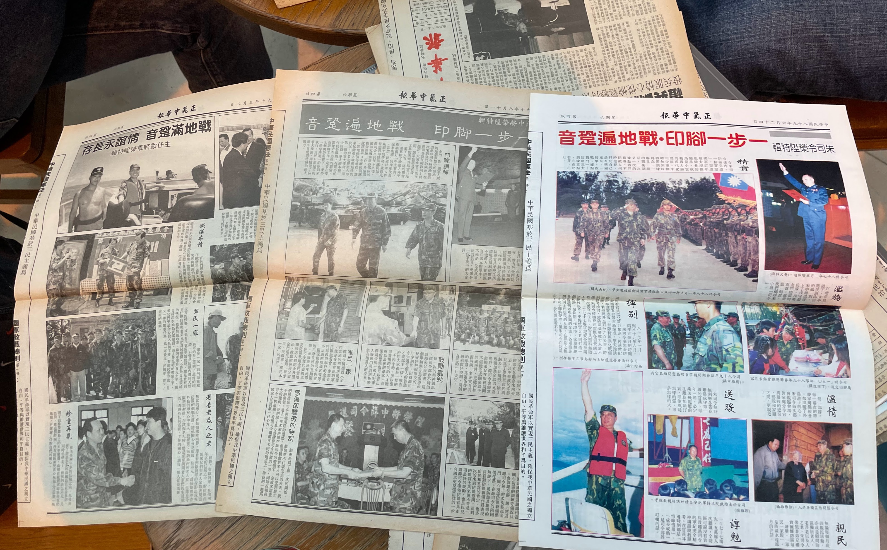
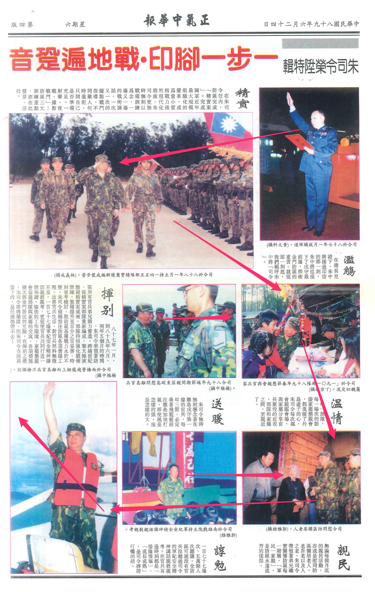
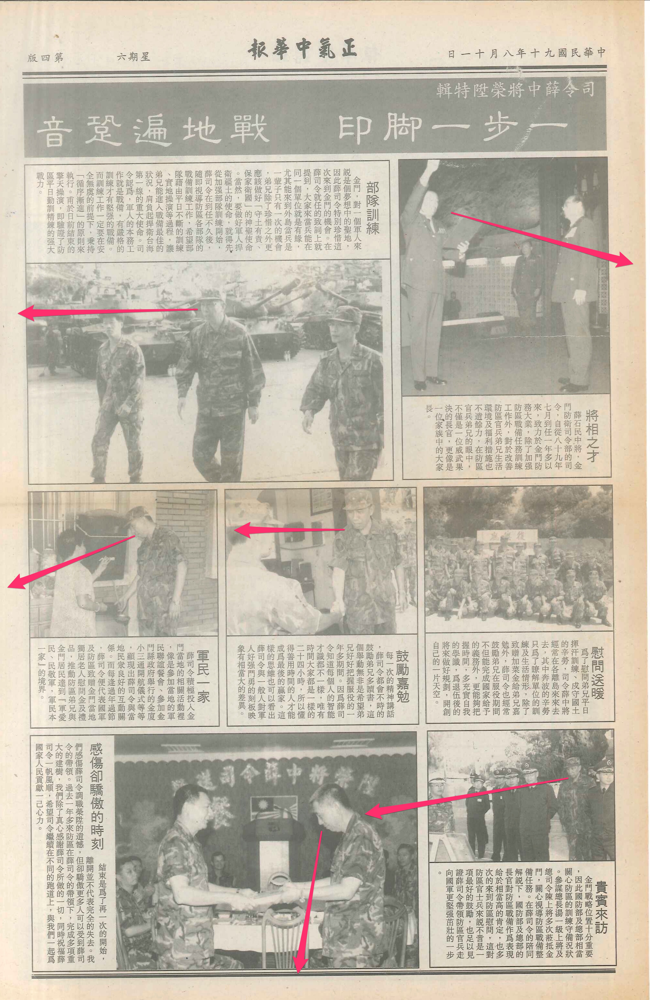

# 17 交接

寫於 2022 年十一月

「學長，我問你，我帥不帥？」我楞了一下。

—我沒有想到，二十年沒見，雅雄問了我這樣的問題。

—我也沒想到，雅雄等了二十年，想問我的，是這樣的問題。

## ▲ 八十九年

陸軍一八四一梯的雅雄從傳播科系畢業後，跟前一年多也是從某個傳播科系畢業的一八一五梯學長一樣，想辦法撐著不去當兵，這個一八一五梯的傢伙撐到十二月，雅雄則多撐了一個月，撐到了隔年—民國八十九年—一月，才剃了光頭、入伍接受新訓。

「么么九旅！么么九旅！」經歷兵變後，雅雄抽中這支籤，但完全搞不懂抽中的是什麼單位，只聽到新訓中心的班長嘆了口氣，說，既然叫做一一九，就是讓你在抽中後，忍不住想要打一一九電話求救—說起來，這應該是個只在一年內才誕生的新笑話，因為在一年前，這個單位還叫做三一九師。部隊名稱是虎軍部隊，更常見的說法則是金東旅。又過了幾年後，經歷了大家都搞不清楚的什麼精進案、精粹案，金東旅也不是旅了，先變成金東守備大隊，再變成金門守備大隊。

接著，雅雄經歷了對個人而言終生難忘，但放在整個防區來看，又完全千篇一律的外島故事—他被送到高雄壽山前運站，在滿滿的工業霧霾當中，看了兩天灰濛濛的漢神百貨，高雄市區的街景對他來說又近又遠，那層霧霾似乎讓景色變得如夢似幻—明明漢神百貨就在眼前，讓你覺得伸手就能一把搆到，但你就是困在這個營區裡，哪都去不了。

緊接著揹起黃埔背包，在十三號碼頭被押上了運兵艦，在黑暗的船艙中，躺在像是棺材般大小的吊床上，閉著眼睛想睡卻又因為船的搖晃而睡不著，船艙中不久冒出嘔吐物的味道，這股氣味讓其他原本不想吐的人也跟著一起吐起來。眼睛再次適應刺眼的陽光之後，背包再次上手，碼頭上一輛輛的十噸半車將各單位的新兵載到該去的地方，雅雄被分發到裝步營中，跟其他人一樣，他的迷彩服上繡上了一個嶄新的黑色三角形，裡頭則還有一個 T 字形的圖樣。他用覺得新奇的眼光穿上了毛領迷彩夾克，看著他的部隊，後來有了機會，又看到了可以去打茫的山外。

雅雄在部隊裡接的業務是伙委，每天早上六點，就跟著連上的車輛一起前往山外市場買菜；這種每天都可以離開營區的差事，怎麼會輪到菜鳥？我們不清楚真正的原因，只是難免會懷疑這個部隊與市場的店家之間之前是不是發生過什麼，還是這個部隊發生了什麼不可言說的原因，非得抓個菜鳥頂著業務。

但雅雄與金東旅的緣份其實並沒多久。雖然他直到退伍，肩膀上掛的都是有著 T 的三角形，他一直建制在金東旅，但金東旅並不是他的部隊。從四月中開始，他要去長期支援了—有天，旅部調查部隊中誰有新聞專長，他自告奮勇舉手報名，一開始，他以為有機會成為旅部的政戰兵，但他反而被小車接到了太武山上，接下來天天面對一群肩膀上掛著空三角的軍官，甚至是空三角軍官中最大的那個。他支援防衛部的政戰部去了，他也沒想到，他會成為那幾年間，在政戰部支援時間最長的新聞兵。

雅雄要開始面對新的挑戰，他在傳播科系就讀的四年期間，學的都是影像媒體，也一直立志要進入影像媒體工作，事實上他也真的如此—在退伍二十年後，他成為資深的電視體育播報工作者，轉播過大大小小的體育賽事，包括亞運、奧運，頭銜是製作人。但政戰部要他做的，除了拍照、寫稿之外，還有他沒學過的編報，他除了要幫防衛部的長官攝影，撰寫投稿總部忠誠報的稿件外，還要編一份防衛部自己的、有四個版面的週刊。

他帶著那道新奇的眼光，住進了政戰部軍官大樓一樓。他所在的房間外，掛著一幅紅色匾額，尚書：「正氣中華報」。住進這間房間前，裡頭原本有四名新聞兵，兩員的主要興趣是攝影，在雅雄開始支援之後就退伍了；實際與雅雄一起工作的另外兩位，一位比他資深個十梯左右，一樣來自金東旅，工作內容除了採訪寫稿之外，還包括財務行政相關工作，像是稿費、相片沖印等等費用的報支等。

另外一位主要負責報紙的編排工作，包括要為這份刊物四個版面畫版，在三版副刊上繪製必要的插圖，在四版上規劃了一些專題報導，每週有兩個晚上，在晚點名之後的十點左右騎機車要跑地方報社，跟報社的人員一起上機排版。他與雅雄差了二十六梯，聽說再過一個多月就要升上兵。

跟雅雄身上還算嶄新的深綠色迷彩服比起來，他的迷彩服已經褪色變成黃色了，褲子倒是頂新的，因為原本的褲子因為工程被弄到都是補釘，來政戰部支援之前還特地換過—但他居然還在報紙上寫過「怎樣寶貝你的迷彩服」這種專題。他肩膀上的三角形裡頭有著一豎，代表來自防衛部的直屬部隊之一，他來自工兵營，還能是誰呢？—就是我。

我和另外一位新聞兵都有自備的相機，雅雄自己沒有設備，我們讓他用政戰部僅有的那台沒有自動對焦功能的 FM2 相機。一開始分配的任務，還是從報紙頭版—也就是防衛部自己的那些歌功頌德的官樣文章，三長—司令、副司令、大主任—主持了什麼操演、什麼月會、怎麼慰勉官兵、有什麼指裁示事項，還有就是長官的長官，包括總司令、總長、部長…。新人一開始連擎天廳、幹訓班這些地方在哪都搞不清楚，就先從比較簡單的任務，像是從大主任的稿件開始，如果三長同時有行程，就往往還是我去司令那邊，雅雄就去副司令或大主任那邊。

我剩下四個月就退伍，是下一個要退伍的新聞兵，而我計畫兩個月後—支援滿兩季—就歸建，去跟連長討一下我破冬前、還沒開始支援政戰部之前在連上的積假，總之我在政戰部的時間不多了。雅雄明確表示，他在軍中不想要碰跟錢有關的業務，那他自然得跟我交接。就算沒做過報紙，也得學會這份業務。

我快速講解了怎麼畫版—我大二開始學排版，在學校修了十二個編輯相關學分，在工兵營上工、搞參一業務、搞精實案文書一年之後，沒想到在軍中還有機會用上，更沒想到要教人。過了三四年後，我回到母校當了兩年電腦室以及排版教室的助教，同時自學電腦程式，或許這段經歷，也幫我累積教母校學弟妹排版的能力。

我從我那一片狼藉的辦公桌翻出畫版的基本文具—舊報紙、紅色的旋轉蠟筆、長尺還有計算機，講了什麼是版面的天地，S 型彎彎曲曲的線條加上個箭頭是走文方向，方塊裡頭畫條對角線代表標題，打個叉則是圖片，圖片附近的走文標示自然就是圖說…。接著就是幫我們製版、印刷的地方報社要怎麼去，那兩台機車要去哪裡加油等等。

我猜想這段時間，雅雄應該都覺得我這個學長怎麼都不理他，一到週日放假的時間我就不知所蹤—我騎著單車，跑去山外或是連上，去找我自己在連上的弟兄去了。雅雄下部隊沒多久就來到政戰部，與建制的部隊好像也沒什麼聯繫，跟政戰部其他單位的義務役阿兵哥，像是美工兵、心戰隊、電視修復站等等…比較要好，常常在鑑潭山莊那邊練球，聽說後來還組了一隊，去打了山外車站對面籃球場舉辦的金湖盃。後來報紙上也出現一系列跟政戰部有關的報導，像是防區的派報工作、心戰工作隊專題…是的，雅雄延續了我在報紙上開始的專題報導，繼續做了防區的景點專題、坑道專題等等。

該怎麼說呢，總覺得講這種話實在很不應該，那時候的我，總覺得這些學弟嘛，身上都是…好重的菜味，呵呵。

五月新任的新聞官上任，上任後五天，新當選的總統就職，隔天就來到防區，這個任務由新聞官親自出馬，不是很順利，為了避免又出什麼狀況，五、六月份的一些重要任務，像是司令分成三天的離島慰問、朱司令交接給薛司令等任務，還是由我們兩位比較資深的新聞兵負責，我也繼續寫了幾篇我想寫的專題報導，寫的是我自己的部隊—工兵營。

時光飛逝，該來的時候總是會來，和雅雄一起在擎天廳拍完典禮，做完新司令宣誓就職的那期之後，晚上，正氣中華報社內也辦了一場小小的交接。我清空了我的辦公桌，把迷彩服、體育服收進黃埔背包，把盥洗用具毛巾收進藍色水桶，然後把畫版器具、算字數用的計算機、編輯工具書、連同我用來畫插圖的那些替針筆、鉛筆、水彩用品等，交給了雅雄，另外一位新聞兵還幫我們拍了交接照片。

我們還用沒拍完的底片，亂拍了一堆我合雅雄的合照—畢竟在那個需要底片與沖洗才能得到影像的時代，一卷底片沒拍完就送印有些浪費。這些照片的內容全都意味不明，我們從庫房裡頭找到美工兵用保麗龍做的「防衛部優秀士官兵表揚」這幾個字，然後有時候拿著「防衛部」，下一張照片拿著「優秀」…其實這些照片算客氣的，我還被拍過睡覺中的照片。

七月歸建連上之後，那幾週，我還會在中山室翻了一下我離開之後報紙。這幾期的報紙大概有司令主持重砲演練、檞樹飛彈演練等—說到檞樹飛彈，聽說那天飛彈發射出去之後，根本就沒有打到標靶，在場是一片尷尬的沉默，直到司令主動站起來拍手鼓掌，才化解了那陣尷尬。順利出刊就好，報紙看起來還算有模有樣，我就是個朱司令時代的新聞兵，到了薛司令的時代，就交給你們了，我總是得離開的。

下一次見面，已經是二十幾年之後了。

## ▲ 2022 年

雅雄應該很意外會收到我傳過去的訊息，以及臉書加好友的請求吧。

2022 年，我預約了登上大膽島的行程，而且順利成行—很多人還因為天氣、風浪導致行程被取消。算起來這是我第四次來到大膽，距離上次已經二十多年，又是感慨、又是興奮，興沖沖地把我在大膽島的照片傳到臉書的金門部落社群上，沒想到當年的新聞官上來留言，提到正氣中華報社在九十一年結束，很多東西都沒留下，很想再看看二十年前的那些報紙。我只保留了我支援期間編的那些，大多不在這任新聞官任內，如果要找更多的報紙，只能找比我菜的新聞兵。

二十年前還沒有現在這些交友平台，通訊軟體又幾乎每隔幾年大家用的都會換一輪，從即時通道 MSN 到現在大家在用的一大堆軟體，我又是比較晚才開使用手機，軍中一堆人的手機號碼我都沒留著。我在臉書上用我記得的名字亂搜索，一個呢，找不到，後來才知道他改了名字—一個台灣人舉凡改了名字或去了對岸發展，就不太會出現在臉書上，但有些人還是可以完全不接觸社群網站，這也很厲害。另一個呢，雅雄，一下子就找到了。

二十年沒聯絡，在傳訊息過去之前是有點忐忑的。「您好，我是二十年前在防區服役時，和您一起在政戰部支援，來自工兵營的楊 ○○…」接著說明新聞官想找找看以前的舊報紙，是否留存，他可能已經忘了我這個人了吧？我自己就想不太起來大部分工兵營連上弟兄的名字了，也或許覺得，過去的事就已經過去了，大有可能直接已讀不回。

「學長好！」我沒想到是這麼熱情的回應。「向學長報告，舊報紙目前不在身邊，週末的時候要回去找找。很感謝學長當年的照顧，讓雅雄可以在二十年前平安退伍！雅雄也跟著學長學會抽煙喝酒，在軍中就學會怎樣邁入社會！週末會跟學長以及新聞官答覆！」

等等…我什麼時候教你抽煙喝酒了？我的確有抽煙，但喝酒也都是在外面或是在連上喝，我不是什麼好人，但我也不記得我有特別帶壞你。而且就算在學校的時候我大你一屆，比你早入伍二十幾梯，都已經是二十年前的事了。「不用叫我學長啦，是我來麻煩你的。」

「二十年前學長不是這樣教的！我還是二兵的時候，學長就已經是上兵了，那時噢我看到學長都怕得要死！我遇到學長，不可能不叫學長！」

等等…我以前欺侮過你嗎？我對玩兵的理解是—少說要找個像伙房後面的油水分離槽之類的地方青蛙跳，我在連上就沒做這種事了，更不可能在政戰部眼皮子底下這樣搞吧？不過呢，如果在軍中，有人說你欺侮過他，那…應該就是有了，只是你應該忘記了。

過了一兩週，雅雄找到報紙，我也翻出我手上的那幾份，新聞官找大家餐敘，雅雄找到了另一位政戰部新聞兵，還有當時南雄旅的新聞兵—南雄旅畢竟是距離防衛部最近的部隊，人力不夠的時候—尤其是貴賓來訪時，要幫貴賓拍攝照片，並且在貴賓離開時就送上紀念相本這種外交任務—我們這些政戰部的新聞兵，往往就直接下個電話命令到南雄旅要求支援，往來也特別密切。

五個人於是愉快地重逢，在餐廳裡吃吃喝喝，雅雄還帶了兩公升的白色罈裝酒，十五年前出廠—平常大家什麼種類的酒都喝，但獃過防區的人相逢，哪有道理不喝防區的酒？

話題包括二十年來大家的發展如何啊，大家最近有沒有回去過啊，還有沒有遇到政戰部的其他人啊，我們服役所在的防區變化到底多大，我們以前去的沖印社也倒了…一邊聊，一邊翻著舊報紙，話題又回到過去—還記得我們以前有兩台沒有帳也沒有牌的機車對不對？後來大燈壞了也沒辦法修，晚上去編報，還得一手拿著手電筒，還被菜鳥憲兵記了違紀。車子後來還掉漆了，外面那層漆掉了之後，裡頭原本的藍色露了出來，對，那兩台車，原來來自海指部，不知道怎麼的就弄到政戰部…。

時間晚了，大家紛紛離席，但雅雄看來還有話要跟我說，我們還有半罈酒，兩人就去續攤了。雅雄說的每句話都讓我覺得，呃？有這麼誇張？

## ▲ 續攤

「呃…你真的沒有必要叫我學長，都二十年了。」我說。

「學長 ─」雅雄拉長了尾音。「也許過了今天，我就不會叫你學長了，但我今天，不管怎樣，一定要叫你學長！我原本都快忘記當年的事情了，但學長傳訊息過來，我又去翻了舊報紙，回想起來，學長真的影響我很大。」

「有這麼誇張？」我哪能對你做什麼？

「有——」雅雄又拉長了尾音。「我努力把學長留下來的東西傳承下去，透過學長留下來的作品，讓我可以在政戰部支援一年半。我原本支援到期就要歸建，但後來的新聞兵不行，又要我回來支援，支援期間，有次我還差點被關禁閉，也被司令擋下來，我想都是因為我從學長那邊學到的東西的關係—像我寫稿寫不出來的時候，我都會想以前的新聞兵會怎麼做，看看舊報紙，然後想到像學長在寫稿的時候，有時候會點根煙擱桌上，或是把煙掛在耳朵上，我也這麼做，就把稿子寫出來了，也學會抽煙了。我努力把學長的東西傳下去，後面的人怎樣我也沒辦法，但至少我想辦法傳下去，而且…報社不是在我手上結束的。」

「等等等等…」這一大段話的資訊量太大，前後邏輯也有點跳躍，我消化不了。

「你先說，關禁閉是怎麼一回事？你在政戰部，誰要關你禁閉？」

「有一次防衛部辦活動，在擎天廳，我遲到了，已經到了該拍照的時間，所有人都在找新聞兵，等我到場的時候，政綜組組長還有大主任，都氣得跳腳，說要關我禁閉。」「哇！活動遲到，你也夠大膽！」「但司令在旁邊，聽到之後，又馬上發飆，說，『誰敢關我的新聞兵！』政戰部的人就不講話了。」「呵！不簡單！司令喜歡你。」「厲害吧！要能夠在防衛部裡頭生存也不容易耶！可能是我們後來常幫司令做相本，也可能司令有看我們的報紙，但我都是跟學長學的。」

我忍不住從基層營連的參一角度想事情。連上有個人支援在外，平常在連上沒有貢獻，參一要處理你的支援令就夠煩了，突然還要幫這個人弄禁閉二聯單還有士評會紀錄，光想就煩。不過，導致要關禁閉的事情都不在連上發生，士評會要怎麼開？怎麼評？算了，反正真的要關，士評會紀錄一定是假的，反正軍中什麼都是假的。不過如果我遇到同樣的狀況，朱司令應該會送我進去吧？我自己的部隊長官應該也很樂意辦理這個業務。至於 2013 年之後，禁閉制度大改，我也搞不清楚現在的部隊是什麼狀況了。

「那你怎麼回到連上以後，又回去政戰部繼續支援？」

「後來找來的幾個新聞兵，也都只對拍照有興趣，拍照以外的事情都不太管，我已經回到連上兩個星期，政戰部又突然打電話到連上，然後我又被小車載上太武山上。為了要解決一個人不能支援超過兩季的問題，就軍史館命案之後的那個命令…」

果然又是那招啊，我在當工兵營參一的時候，我知道三處還有工兵組都愛用這招，雅雄則讓政戰部用上了。

「…政戰部就想辦法讓我改分配，我就從原本的裝步營，改編到另外一個裝步營去。新單位沒有一個人認識我，我在新單位也一個人都不認識，退伍前歸建之後，一堆學弟看到我，就說，哇，原來你就是那個傳說中的學長！」

有時候，我會想像雅雄說不定是另一個平行宇宙的自己。

如果我也跟雅雄一樣，下部隊兩三個月之後，防衛部就知道我算是有新聞專長，讓我在軍中的日子大部分在政戰部度過，我會怎麼樣？我可以遠離連上的蟑螂米，不用去海邊搬那些要放在水泥地坪下的塊石，工兵營蓋好幹訓班校閱場的時候我只需要去拍照，我也不必在戰備的時候躲散兵坑，不用因為其他人弄高裝檢所以有站不完的哨，不用在颱風之後救災…但我也因此少了很多回憶吧？

我也不知道，如果那時候給我更多的時間弄那份軍報，我會不會疲乏，搞不出什麼有趣的花招。就算在連上天天有人說要把我抓去關，看來在政戰部也一樣有被關的機會。反正，在這個宇宙中，我的日子就是這樣了，都過去了，我相信我得到的一定是最好的安排。

「既然我在政戰部，時間又這麼長，我就想辦法多賺一點錢。我們平常就要寫一些副刊的稿件，如果沒有人投稿，就得用自己的稿件填充版面，對不會？反正時間已經花下去了，我寫好稿件之後，還會繼續投稿到忠誠報、青報、地方報，他們也不會管我一稿多投，我就不相信青報的編輯會看防區的地方報，反過來他們也不會去看青報，我就想辦法多賺點稿費。在我退伍的時候，我存了十萬塊。」

我服役的時候，每個月抽煙喝飲料這些開支，大概花三四千塊吧，一年十個月下來存款大概三萬出頭，存十萬的確頂厲害的。我編報紙的時候，總想搞出一些新奇的專題報導，但這些稿件很難去別的報刊投稿，我還真沒有這方面心思，而雅雄那些「談兵變」、「傷心故事」、「感情系列」這一系列少男懷春的濫情文字，我大概也寫不出來。「那也很厲害啊，來，喝一杯！」

「我在政戰部，連上不認識我，也頂方便的。」雅雄繼續說。「我想要安排返台的時候，就直接打軍線到連上給連長，說，喂！你就是那個什麼裝步連的連長是不是？我防衛部少校新聞官，你們連上有個雅雄在我這邊，對，他想要返台，時間是什麼時候到什麼時候，你們連上安排一下…然後我到時候就去連上睡一個晚上，隔天返台。不過也不知道是不是因為這樣得罪參一，退伍之後我居然被教召了三次。」

「呵，不然你以為我支援令到期之後，幹嘛急著要回去工兵營？」

一名參一文書在軍中的最後一件工作，也是最棒的一份工作，就是寫自己的退伍令，然後送去上鋼印。寫退伍令有幾個重點，像是最好一次寫對，就算退伍是件高興的事，但任何人都不想拿到一份塗塗改改的退伍令。退伍令上包括像是姓名、兵籍號碼、出生日期、籍貫、役種、退伍原因、生效日等資訊，但一名參一會更關心另外一個欄位—軍職專長。

基層營連參一其實沒多少機會參與教召單位的作業，但或多或少參與過同心演習，在師父與徒弟之間，也就口耳相傳哪些專長比較不會被教召，或是那些專長在教召過程中比較爽，一下就被志願役佔滿，不需要再召義務役，然後在自己的退伍令啦、兵資啦，登錄這些專長。

每次舉辦教召時，教召單位應該會評估這次要召集哪些專長的人，而他們能參考的，也就只有在退伍時登錄的專長—就算大家都知道基層部隊根本就沒有按照專長用人，一個人在服役期間，做的根本是跟職缺無關的工作。但登錄的專長是什麼，教召單位就相信是什麼。

我從我師父小江那邊學交接來的是，只要哪個專長看起來特別沒戰力，就去選那個專長。退伍令上寫的專長，就是退伍時你所佔的職缺的專長代號，所以參一在退伍的幾個月前，就得想辦法把自己調到那個職缺上，除了要把自己名字的年籍冊插條插到新的位子外，還需要弄調職人令以及線傳。通常還可以看到一種說法，是把你的「線」調到哪裡。

我在退伍前兩個月回到連上，目的之一，也包括確認我的「線」、確認我在哪個職缺上，還有退伍令上寫的是什麼專長。我退伍後從沒被教召過，我想主要原因是退伍一週之後就開學，成為碩士生，根據兵役法第四十三條可以免召。但當時，我也不知道我會不會唸一唸就不唸了，該做的還是得做。而我退伍後，我在連上的職缺會空出來，交接給下一個懂得箇中巧妙的人。

得罪了參一是不是就會比較容易被教召？別的單位如何，我還真不知道，更不知道二十年後的狀況。但在我服役期間，在我的部隊中，似乎容易被教召的專長遠多於那些看起來沒戰力的專長，參一會把這些職缺留著自己留著用，如果為了整人特地調職，還要搞人令發線傳，煩死了。我或許可以下一個沒怎麼經過驗證的結論—只要你不是參一，沒有親手幫自己做一些操作，或是沒有跟參一特別好，都有很高的機率被教召。

不過…你小子組長也不怕、大主任也不怕、冒充新聞官也不怕、自己連上主官也不怕，怎麼會怕我一個兵啊？還說跟我學抽煙喝酒，我的確在政戰部抽煙，但喝酒都回連上喝啊…

「我說，你覺得，你到底跟我學了些什麼啊？」

「很多——喔！就拿排版來說，學長那半年留下很多不同變化的版面，我們遇到類似的狀況，就可以直接套用。然後，有一些特別罕見的狀況，就非得參考學長的版面，像是隔年薛司令榮陞，就不是平常會遇到的任務，我們都不會做，就只能參考學長前一年做過的朱司令榮陞…尤其是這個標題—『一步一腳印，戰地遍跫音』，這個標題真的很好用，我們也一起拿來用了。另外，大主任榮陞的時候，也用了差不多的標題。」

話說，如果在入伍前學過一兩個比較少見的字，就可以在軍中顯得很厲害的樣子。除了「跫音」這個例子外，平常好端端的講「繼續」就好了，你如果寫個「賡續」，似乎長官看到就會覺得很高興。有次我幫政綜組組長抓刀，幫他弄個檢討會報資料，就用上了「賡續」，從那之後，就看他一直用、一直用。

又扯遠了，我們來看看雅雄的版面。

## ▲ 版面

我皺了一下眉頭。

雖然雅雄幾乎完全照著我的版面，製作薛司令榮陞的特刊，甚至用了一模一樣的標題，雅雄覺得學到我的精華，但我知道，雅雄的版面違反了一些基本的避忌。雅雄的版面中，視覺動線的安排很奇怪。

在上個世紀九零年代的新聞系課堂上，我學到，在平面媒體上，不只是把稿件與照片放在版面上而已，而是要在版面空間中，安排讀者的時間。

不管一個版面是大是小，讀者的視線一次只會在一個地方，並且在版面中不斷移動，從這裡讀到那裡。編輯的工作就是：首先要吸引讀者閱讀這個版面—在最吸引人的地方提供最重要的訊息，在有多則報導時，要區隔出之間的主次關係，讓讀者可以分出頭、二、三條…，所謂的新聞學，很大一塊就在討論什麼新聞應該當成頭條，這個新聞有沒有做成頭條的價值，挑選這個頭條有沒有什麼倫理問題…等等。

接著是安排動線，透過安排圖文位置、標題的大小與字體的濃淡，導引讀者在讀了頭條之後，流暢地繼續讀後面的二、三條的圖文。

圖片總是最吸引人的版面元素。但實務上有各種稀奇古怪的狀況，像是，有則報導的價值最重要，必須做成頭條，但偏偏內容不夠豐富，或是沒有好的圖片，那該怎麼凸顯這則報導，讓讀者可以認出他是頭條呢？正氣中華報這種軍報的排列方式很簡單—司令、副司令、大主任，司令也是人，也是會返台休假的，當他休假的時候，相關內容不多，但還是得做成頭條，就得用上這類技巧。

在有多張照片的時候，會比只有單張照片時更難安排，你得想辦法讓讀者知道先看哪張照片，再看下一張，所以，需要先整理出照片的順序，再根據這個順序安排動線。

在編輯朱司令的榮陞特刊時，我想在版面上表現出司令從抵防到離開的時間軸，版型基本上中規中矩，但是這條時間軸要很順暢。故事從從宣誓就職開始，接著他最重視的，自然是部隊訓練了，我用一張校閱部隊的照片代表，接著就是許許多多的月會講話、離島慰問、軍民合作，最後依依不捨地告別。

我在這些照片之間，安排了一條 S 形的動線，經過右上、左上、右下、最後到左下。這個動線以司令在照片中的視線方向構成—我們看到司令，司令又往另一個方向看，那我們就繼續往下，看司令正在看什麼。

前兩張照片之間，我用高低差呈現出兩者的順序。從第一張宣誓就職那張照片中，順著司令的視線延伸，會接到第二章照片—巡視部隊的司令身上，這張其實是很常見的軍中照片的拍法，但是當兩張照片擺在一起，視線相對，就會產生一種趣味—這像是宣示時的司令，期勉自己成為未來掌管部隊任務的自己，而敬禮的司令，不但是向部隊回禮，也是向宣誓時的自己回禮，像是回顧當時的初心。

下一條動線是司令一邊回禮、一邊行進的方向—如果司令的腳前方還留出一些空間，效果會更好—會讓視線繼續移動到右下角，用四張方形的小照片，代表部隊訓練以外的方方面面，司令在這幾張照片中的身形大小不該差異太大，呈現司令不停在這些格子中移動、忙碌工作的效果，而且司令的視線都要留在版面之內，照片中要有他講話的對象。最右下角的司令的位置，剛好與其他照片是相反的，變成從右向左，強迫讀者把視線移回左讀。

最後，視線會移動到唯一還沒看過的左下角，司令高舉雙手揮別—這張照片是離島慰問期間拍攝，是在船上揮別離島官兵的照片，實際拍攝時間可能還在其他照片之前。

一定程度上這已經超過新聞處理的範圍，因為這張照片與司令離開的實際新聞事件無關，而是選擇了告別的意象。—司令背後是一片大海，象徵還有他之後有更寬闊的未來，在司令還在任內的期間，我不會用這張照片，但現在時候到了，這時候，照片中的司令才第一次將視線投到版面之外，舉手揮別不但將動線上揚，還與第一張舉手宣誓的照片也首尾呼應。專題結束，而我們的未來繼續往遠方延伸。

至於雅雄的版面，則是幾乎在每張照片中，都將視線都投往版面外。第一張宣誓就職的照片位在版面右方，但司令往右邊看，而且還不知道為什麼，照片裁切到了照片的身體；第二張巡視部隊的照片中，照片在左邊，司令也往左邊走，前兩張照片就把版面的視覺動線分別往左右拉扯，整個版面也弄得四分五裂的，最後一張司令交接的照片中，司令的視線甚至是往下看，不知道在看哪裡。每張照片中，人物的比例也是有大有小。

這代表，雅雄在做版面的時候，流程就不太對。在排版的時候，需要先關心第一眼會被看到的元素，然後從這個元素繼續發展整個版面，而不是先選一個版型，然後把圖文硬塞進去，有點像是，做菜應該先看食材，而不是不管食材如何，就照著食譜做。雅雄的副刊在一些標題比例上就有點失衡，就算頭條放了一張大照片，但是二三條的字體往往又很大，或是有很大的留白，導致二三條比頭條還顯眼。而在這個有多張照片的版面上，更是得先挑出照片出來，確認照片之間的關係後，才開始畫版。

要把這個版面調整得比較合理，首先上方兩張照片的位置應該左右對調，宣誓就職的照片應該就只有視線朝右的，那麼，版面動線可以排程一個倒過來的 C 字形，從左上開始往右、往下、往左，第二張照片可以考慮換掉，把後面幾張人比較多的照片往上移而且做大，不然人這麼多，都看不清楚誰是誰了。最後這張照片實在不好，也可以考慮不要放，也沒有人規定一定要有一張交接的照片不可。

我是在新聞系大三的時候選修兩學分的「版面編輯」，學到上面講的那些東西。那時候新聞系首先有一堂大二上學期的必修課「新聞編輯」，裡頭比較像是概論性質的東西，而且有很大一部分在講編輯可以怎樣為新聞稿下標題，畢竟無論是報紙、雜誌、通訊社的編輯，工作內容都會遇到下標題，版面方面頂多講到像「頂題」這種得避開的錯誤。

大三除了必修的實習報有編輯教學外，還有兩堂課—「雜誌編輯」與「版面編輯」—可以選修，我兩門課都去修了；「版面編輯」是跟版面設計有關的進階編輯課程，課程內容包括一些國內外報紙版面的分析，做課堂報告討論、寫書面報告，期末要交出排版作業，然後用報告解釋自己為什麼這麼排版—不過同學間通常討論的是老師怎麼今天又穿了特別浮誇的套裝（像是全身大紫色）來上課。

雅雄用了他最大的努力，在軍中生存，不過，我在軍中與雅雄的交接，看來完全無法代替大學裡頭的學分。我也很好奇國軍各級負責編裝設計的人員，有沒有受過如何設計部隊編裝的訓練—像是一個官校土木系的學生在大三的時候要交作業，分析怎樣設計一個工兵連出來，想像他畢業幾年當個連長的時候，要有怎樣的組織才能完成他被交付的任務，期末作業則是一份編裝表—還是像雅雄抄我的版面一樣，到處抄別人的編裝，只抄了編裝的形式，卻沒有抄到編裝的精神。

當然啦，真要說起來，以我卓越的品味，整份正氣中華報都不會是我想做的報紙，其實我會想規劃像這樣的專題報導：「第一次挖洞給長官跳就上手—參一二三四篇」、「如何藏匿多餘料件—輕鋼架天花板妙用無窮」、「防毒面具應該藏那種罐頭？仙草蜜還是八寶粥？」。副刊那麼無聊，直接砍掉，換成財經版，開設新專欄，像是「決戰 K 線—○○ 長官的股海明燈」、「部隊主副食費活用術」、「盜賣軍品系列—果然水泥跟油料才是最棒的」，還有各部隊聚賭的開盤結果。頭版自然得是大家最喜聞樂見的部分，像是「金沙 ○○ 假期 KTV 又有來自本島的小姐啦！」

可是，我還有必要，講這些排版上的細節嗎？

版面中有沒有動線安排，到底有什麼差別？就只有這個版面讓人舒不舒服，閱讀體驗流不流暢而已，我看防衛部長官也都不懂，我做這個版面也是為了恢復手感，把學校學過的東西練回來，這對當年雅雄怎麼掙扎求生，也沒什麼差別吧？軍中的一切—姑且不論雅雄被教召三次—也都離開我們二十年久了。

我在母校新聞系當助教的時候，我當然得跟學生或多或少講這些東西，不過他們還是得去修「版面編輯」那堂課。可是，這些報紙都是二十年前的事了，我跟雅雄現在也都不在平面媒體行業裡頭—雅雄還起碼還進了新聞界，我直接成了新聞界的逃兵，報紙也愈來愈不是社會獲得資訊的主要來源，在二十一世紀，做報紙、還有九零年代的新聞學，應該都變成冷僻的技藝了吧？

「我還頂常遇到你們學校畢業的人。」雅雄說：「大三去實習的時候，帶我的是 ○○○，在軍中遇到你，然後退伍第一份工作，帶我的是 ○○○，也是你們學校的。」嗯，不但是我們系上的，還是我這一班的。「可是退伍之後，我在新聞業界還頂遇過其他的新聞兵，也常遇到其他人，就是沒有遇過學長，前陣子才知道原來學長整個改行了，有些事情現在才有辦法跟學長講。」

是什麼啊？

「學長——你不要覺得，你做這些東西的時候，你只是自己一個人，我們這些學弟，全都在看著你的背影。」這又是什麼誇張的句子，而且，反而我覺得，雅雄有很多我所沒有的東西。

雅雄還伸出了兩隻手指頭，先指著他的眼睛，再把手指指向我，比劃了好幾次，繼續說。

「我就是看著學長的背影，繼承了學長交接給我的這些東西，繼續做了一年的正氣中華報。學長，你說，我帥不帥？」他把那隻伸出兩隻手指的手，移到嘴邊，比成勝利手勢，手指還轉過來、轉過去。

我覺得有點好笑。

我說雅雄啊，大家都四十幾歲的人了，你現在白頭髮比我還多，還計較著自己帥不帥—這哪像是三個小孩的爸爸啊？這怎麼看起來，都像是個國中生吧？在業界，人家還叫你雄皇耶！

## ▲ 交接

說到帥不帥啊。

我想說啊！在整個大方向都是裁軍的二十年、三十年，我們當年編的這份報紙會不會被裁掉，跟我們這些在最底下的阿兵哥付出多少努力，做出的作品好不好，我們的表現帥不帥，也沒有多少關係吧？這那是我們這些小兵可以改變的啊？在多少單位、多少部隊裡頭，有多少努力的人，這些單位還不一樣沒了？

而且啊！我們這份報紙，被裁的恐怕也一點都不冤枉！就算維持當年的編制、當年的經費，一份業務需要靠長期支援才能夠維持，這根本不是正常軍隊該的事吧？而這整份報刊用的都是我們這些流水的兵身上的民間專長維持，靠的是我跟你之間這樣的交接，軍隊自己無法提供訓練、授予專長，那要怎麼維持這份業務？

你可能聽爛了我講工兵營的事情，想要我多講講政戰部，可是我還是忍不住想到以前在我連上門口那些超帥的大傢伙。除了每個部隊都有的十噸半卡車、小車之外，我們的駕駛兵還會開五噸傾卸車、水泥預拌車、捍馬車，也有人會開三兩洞 B 挖吊機還有山貓，士官長開山貓可以開得橫衝直撞，但是另外一側的 D4H、還有一種當時只有外島有的二十五噸關節式傾卸車，那台車也超帥的，連上都不知道誰會開了，我負責送返台受訓，也都沒送過這些駕訓，當時，這些裝備到底留著做什麼啊？

在精實案部隊重新編成的時候，連上就後送一批神奇的裝備了。在我剛下部隊的時後，連上還有平路機，那台機器超帥的，機器上有一把大鏟刀，只要車子開過去，可以直接在防區開出一條機場跑道出來—前提是有人會開。我還是二兵的時候，週六的裝備保養日，我要去那塊抹布把上頭的泥巴擦掉，寫一張我自己都不知道有什麼意義的保 15-002 表，證明我保養過這台裝備—但我連怎麼發動，連上誰有辦法發動，我都不知道。精實案之後，平路機就被送走了，軍中自己不開訓，這機器再帥也沒有意義啊。

我想說啊！我的那個工兵營，後來被縮編成工兵連，想起來也不冤枉吧。整個工兵營那時候做一堆工程，靠的都是一群具備土木專長的大專兵擔任工程士組成的工程組，負責繪製工程圖與監工，都是靠義務役的民間專長來維持。這樣的部隊，又要怎麼維持啊？

一個一直倚靠義務役民間專長維持的國軍，就只是一個不把義務役培養成戰力、只把我們當成廉價勞動力的國軍。我在連上的時候，是以兵的身分做幕僚軍官該做的事，我在政戰部，做的是防衛部自己都不會的事，我們就只是在一個奇怪的時代、身處奇怪的部隊、收到奇怪的命令、做著奇怪的業務、用著奇怪的方式搞出奇怪的交接與傳承，而或早或晚一定交接不下去—這到底帥在哪啊？

可是，我又想不到，有什麼比撐過這段日子，好好活著，平安退伍，更帥的事情了。

「學長，我帥不帥？我這麼帥，當初怎麼沒有把我寫進你那個故事裡頭？」雅雄繼續比著勝利手勢，等著我的回答。雅雄在政戰部前幾個月的時候，沒這麼誇張啊？是我當初看走眼了嗎？還是當初我真的把些沒必要交接的也交接了？當我把那些畫版工具遞給雅雄的時候，我也交接了我自己的那一份幼稚？

對啊，二十年過去，我們還是一樣不成熟，只是累積更多人生短暫的感受而已。我們的少年就已經花在這裡了，

我還是覺得很好笑。但我最後發出的，卻是苦笑。

「哈，你很努力，你很帥！我們來把酒喝光吧！」
