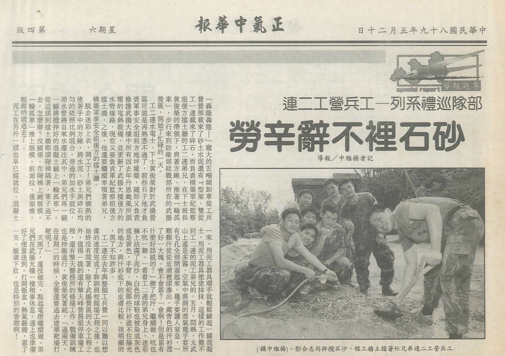
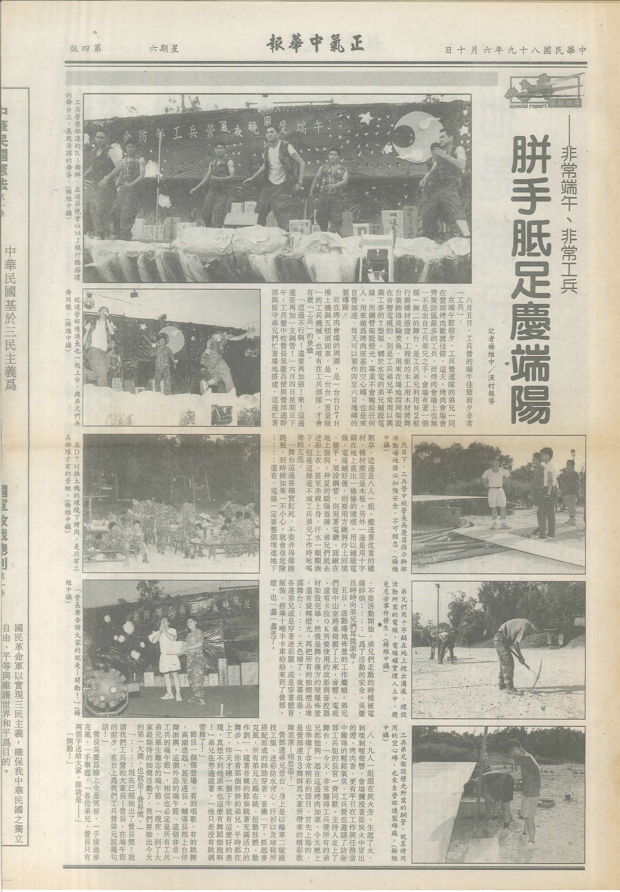
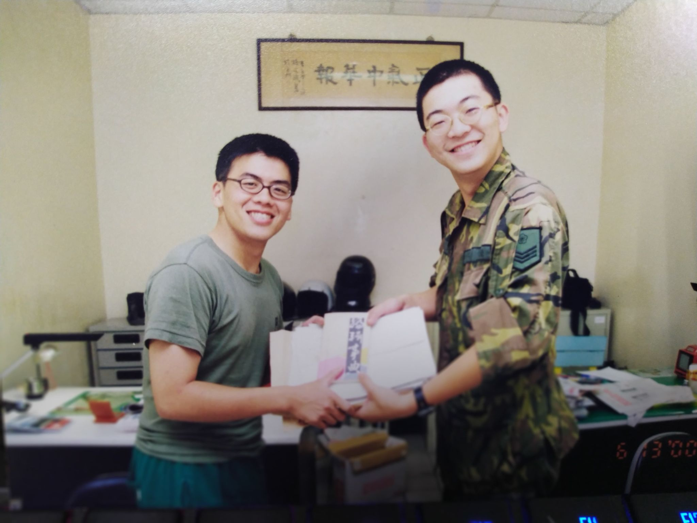
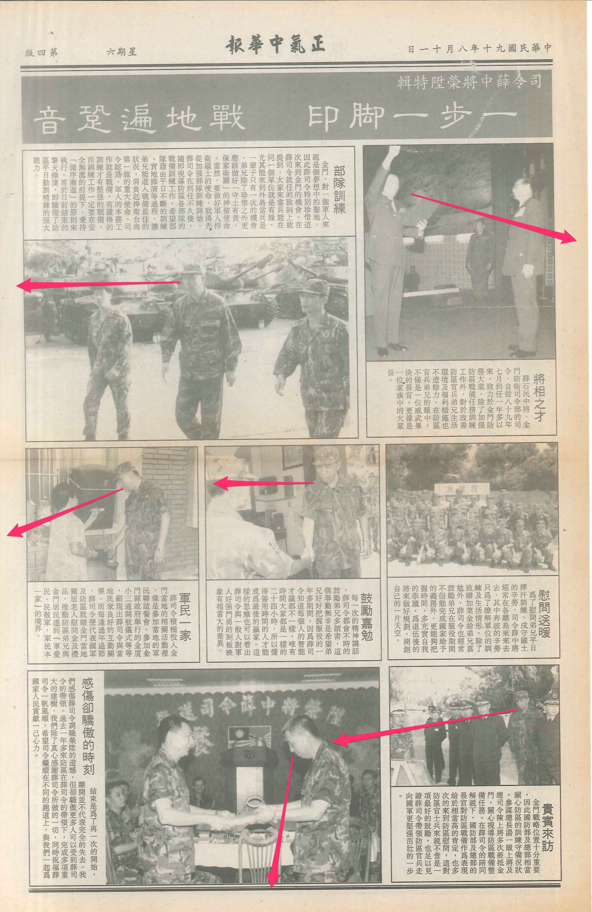
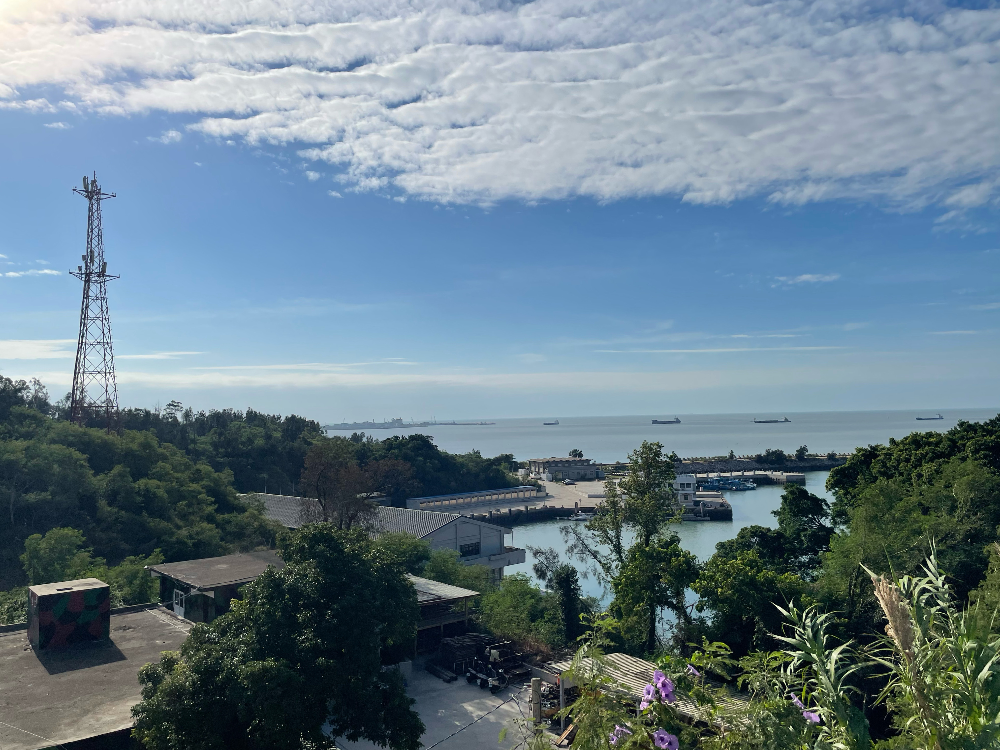

keywords: 精實案, 義務役, 兵役, 金門

# 00 驗證

「精實案之後，防區已經不是個快樂的工作場所了。」防衛部司令對長官們說。「官兵在這個環境中工作，實在很痛苦。」

那是我這個外島工兵退伍幾個月之後的事情了。因應九十年一月二日開始兩岸小三通—退伍前聽說，小三通的碼頭工程，也是我所在的工兵營做的—八十九年十二月時，防衛部有著滿滿的行程，因為每個星期都有長官來訪。小三通的前一週，來的是國防部伍部長；前兩週，來的是總長湯一級上將，陪同總長來的，還有本軍總司令陳上將、總政戰部主任鄧上將、海軍副總司令常中將、空軍副總司令黃中將、聯督室主任朱中將—我服役期間，我叫他司令—以及參謀本部的許多長官。

在更前一、兩週前，副總長霍上將，在本軍副總司令、總政戰部副主管，以及又一群國防部官員的陪同下，也來到防區，這行人倒不是來關注小三通的狀況，而是來視導在這之前的兩三年間，防區執行精實案的成果，來到太武山上聽取簡報。是的，精實案，打造量小、質精、戰力強的新一代國軍的那個精實案。

防衛部司令薛中將說，精實案期間，防區裁撤了不少單位，也減少了不少員額，但是業務卻不減反增，官兵承受了以往所沒有的壓力。副總長聽取防區報告之後表示，防區的精實案執行成果非常好，在執行期限前順利完成任務，深感欣慰；此外，每個單位都在反映員額不足，但接下來，在精進案當中，國軍仍然可以縮減或裁撤一些單位—所以，如果有個單位說員額不足，工作壓力大，我們可以縮編另外一個單位，另一個單位在縮編後多出來的人（我們稱為編餘人員），就可以被改分配到那個說員額不足的單位，解決員額不足的問題了。

至於這個被縮編的單位是不是又遇到員額不足…總之，副總長對於國軍組織的這番睿智的洞見，總讓我想到一句成語，叫做挖東邊的什麼補西邊的什麼。

這段指示，紀錄在八十九年十二月九日的軍中報刊「正氣中華報」中。

同一時間，我開始在網路上發表我的故事—我的軍旅故事，我的防區故事，我的精實案故事。


keywords: 精實案, 義務役, 兵役, 金門, 金湖, 金門漁村, 新湖漁港, 金防部, 金防部工兵營

# 01 防區

我不要當兵。

我不要當兵。你可以說我畏苦怕難，也可以說當兵是從一個男孩變成男人的必經過程，更可以說什麼合理的要求是訓練不合理的要求是磨練，沒關係，隨便你怎麼說，有任何辦法可以讓我不用當兵我都不要當兵。我不要當兵。

可是我非得當兵，而且我就是當了兵，我爸爸一不是副總統二不是省長，也沒有人認為我有朝一日可以得個諾貝爾化學獎於是將我送出國深造，我就是得當兵，有個後來去當總統的市長給了我一張入伍令，我就是去當了兵。而如果我可以選擇，我希望能夠兩年—或是一年十個月—都在新訓中心裡[^duration]，我寧可兩年都頂著亂削一氣的光頭、成天操課、成天刺槍、成天陸軍五項戰技、成天被下士教育班長鬼吼，為了正常就寢、為了正常休假，為了回家，為了不會被前送到外島、放逐到邊陲、刺配到防區，我希望時間能夠永遠停留在新訓中心的那段日子，我不要換下草綠服穿起迷彩服[^cloth]，我不要在胸前掛上名條，我不要在左邊肩膀上繡上二兵臂章，我更不要在右邊肩膀上繡上黃色的三角形裡再加一豎[^id]，我不要離開新訓中心，我不要下部隊。

可是我沒有選擇，我非得下部隊，我就是下了部隊。而在寒風凜洌的一月十八日（我不會忘記這個日子的），我在高雄壽山前送站獃了兩天，就被押上五兩五艦前送 [^ap525]，在比宿醉還要厲害十倍的暈船中，我被前送到外島、放逐到邊陲、刺配到防區。我在料羅碼頭又抽了一次籤，接著被右臂別著「工兵營兵員作業員」黃色臂章的小江，帶到南側一個漁港旁的直屬工兵營部暨營部連，而在營部連連級參一老劉叫我過去填連級個人基本資料、建假卡的時候，我確定留在營部連。

你知道嗎？先不管日後我也成了一個亂七八糟的兵，我完全不敢相信我服役的單位會是這樣的地方，這邊的兵舍不知道是不是因為自己連隊就有能力興築工事的關係，建物想蓋哪就蓋哪，兵舍蓋得亂七八糟，亂七八糟的兵舍裡是更亂七八糟的學長，這裡根本不像是部隊，反倒像是施了迷彩的工寮啊。

我不會忘記新訓中心抽籤的那天，抽中外島籤時我茫然不知所措，腦中一片空白。原本我選兵的時候選中總部的美工兵，是選中後二抽一的那種，穿著軍便服的選兵官在集合場一堆一起畫圖受測新兵中，選了我和另外一個其實畫得不怎樣得美術系畢業生，只要我和他其中一個抽中籤，從此就是在龍潭畫兩年的圖，顯然沒抽中。沒抽中的那個人被打入通用類，抽籤選擇外島還是本島，「一號！」抽起籤就有著強烈不安。「一號！防衛部！」「防衛部！防衛部！」抽中外島還要我大聲唸出來，好殘忍啊！雖然日後我全身心都變成了工兵的樣子，也完全認同自己就是個工兵，我仍然對總部美工籤念念不忘 ⋯ 不只是因為總部可能比較爽，而是，我真的很想去總部看看，看看龍潭那些人到底在做些什麼 ⋯

選兵。天堂與地獄只有一線之隔。

顯然我跌進了地獄。

我不要抽中防區，我不要抽中防衛部，防衛部與總部都是部，可是相距卻是三百公里，我更不要在防區當工兵 ⋯ 美工兵與工兵，差一個字，不但就一點都不美了，而當中的差距，相差比三百公里更多啊！

美工兵與工兵的差別到底在哪裡？舉個例子說吧！有次去伙房幫廚，伙房的學長就問了，「我聽別人說喔！你很會畫圖是不是？」「報告學長！是！」「你有空幫我設計一個圖形怎麼樣？」「報告學長 ⋯ 是 ⋯ 是怎樣的圖形？」「來！」學長褪去上衣，「你看學長背後這兩個鬼頭怎麼樣？學長是希望喔！你能夠幫學長胸前再設計一個更猛的圖形啦！」我啞口無言。

我認了，在這裡你叫我做什麼都可以。你可以叫我去上哨、叫我跑待命班、叫我出公差、叫我上工、領料、製磚、架橋、保養裝備、叫我以所有可以想到的方式廉價剝削我的勞力、我也可以讓下士惡整、蹲著聽三年級上兵學長講述什麼是「制度」。學長們可以在每天晚上就寢之後在整個寢室地面上丟滿煙頭，可以叫我五點不到自動起床只是為了讓滿地煙頭消失，然後就是幫學長折棉被、折蚊帳，也可以叫我蹲、叫我跳、對我不當管教，什麼都可以 ⋯ 但是，不要叫我接業務。我不要在當了工兵之後，還要接業務。

在我入伍以前，甚至在我剛下部隊的時候，很多人告訴我當業務士接業務可以洽公怎樣怎樣，尤其是當文書怎樣怎樣，當參一文書更是怎樣怎樣，每天去洽公怎樣怎樣，可是我現在可以清楚告訴你，我不要幹參一，我不要當文書，我不要接業務。

而其實，站哨的壓力、上工的壓力、甚至在「制度」下的所有作為的壓力，都及不上業務才會給人壓力。而且，接了業務，還是要站哨、還是要跑待命班、還是要出公差、還是要上工、領料、製磚、架橋、保養裝備、被下士惡整、還是要蹲、還是要跳 ⋯

不要叫我接業務。

可是我還是接了業務。在下部隊後的兩個星期，在我第一次去那個什麼都沒有憲兵最多的山外休假後，我確定了我的業務，是人事官的文書、營部參一文書，通常別人稱呼我的職稱的方式包括收發、差假士、營參一，最後的終極全銜是「防區直屬工兵營營部暨營部連參一文書、差假士、總收發、人事官通信官業務指定代理人、專職衛勤待命班、製磚廠製磚公差不二人選之綜合業務參謀兵」。之後的軍旅生涯除站哨、跑待命班、出公差、上工、領料、製磚、保養裝備、被下士惡整、蹲、跳之外，還有業務，沈重的業務，混亂的業務，在基層部隊中做著國軍龐大幕僚參謀文書金字塔最基層的那種業務。

我真的認了。部隊中總要有人接業務，是吧！

那天，星期六，八點部隊集合分配工作之後，連長分配我去製磚，與製磚廠的學長一起用輪孤車推了五車水洗砂、開了八包五十公斤裝水泥，用方鍬將砂與水泥一鏟一鏟混拌均勻，潑水、混拌、再潑水、再混拌，一鏟一鏟送上製磚機、一塊一塊，用人力「開磚」。

製磚是營部連還沒有衛勤的菜鳥最常出的公差，開磚之後，一路菜鳥一個接著一個把製磚機下那塊板模上的空心磚，連著板模一起拿到一旁排列、曝曬，到了下午再來收磚，把空心磚與板模分離，空心磚堆好供日後使用，板模也收好供隔天製磚。在曝曬空心磚的這段空檔，有些學長會去打小蜜蜂，但如果有菜鳥呢，則會一起圍上來，教導正確、有效率使用方鍬鏟砂的方式，這是在營部連生存的第一堂必修課。

菜鳥會傻呼呼地用上臂肌肉把方鍬插進砂堆裡，再把方鍬抬起來，你這麼做了，學長就會叫你蹲下，做個十來下交互蹲跳。正確的方式是拿著方鍬的雙手完全不動，只透過扭腰的動作帶動方鍬，每一鏟就只需要一次扭腰；學長們會圍在你身邊直到教會你為止，而既然你會了，那你就繼續鏟完…

這時候算是我半個師父的矮個子小江過來找全身是灰的我。他帶著我推開營辦室的門，營辦室裡擠滿營部參三與各連參三文書，討論著新編裝作業，另一頭雜亂堆放著參四的裝檢看板，政戰文書在政辦室、營辦室其中的一間小房間裡攤開一張張壁報紙、用廣告顏料畫著過年要用的海報[^work]。小江開口說，「你真正的師父退伍了，以後有什麼不會就問我，或是問人事官。以後，這張就是你的辦公桌。喂！菜鳥！風很大耶！先把營辦室的門關上好不好！」

小江說話，總是大吼大叫。

「現在，你先去裡頭電腦室，把這份東西打出來。」[^computer]

喀啦喀啦，鍵盤敲響，在這串鍵盤聲中開始我的業務生涯。「這份文件是什麼？」我問小江，這份各師改分配工兵營人員名冊是什麼？「你先打就是了，再過一陣子，你自然會懂。下午要開工作檢討會報，順便把人事官的工檢會提報資料打打，東西在這裡。」小江回答。「你以後最主要的業務是管假還有公文收發。我以後會繼續教你怎麼收發文、怎麼開怎麼送返台假單，至於我本身負責的業務，你還沒必要學。」

「你以後每天下午要去一處，一處就是防衛部的人事單位[^office1]，你要去一處文卷室那邊收文，每天晚上登文，晚點名左右把登文簿呈給營長，營長看完把文發給營部幕僚，如果你不能出去收文就是我去，因為我也必須常去防衛部一處交資料。

星期一要向各連收齊返台假單—或是說，防衛部正式的用語是：假面，同時你也要開齊營部軍官的假單，還有假卡，星期一或星期二必須彙整、檢查完這些假單交給人事官，人事官看過之後你再呈給營長，然後寫機位申請單。

星期五上午固定去洽公，去一處差假室報假，差假官會檢查所有的假，報假還要跟差假士瞧返台人員機位，隔幾天去拿差假室雇員開出來的返台三聯單，確定有假單之後，要下電話記錄給各連，告訴他們哪些人的返台已經確定了 ⋯。

每天晚上要打軍線去空運室問隔天返台人員機位，然後把寫上登機號碼的返台三聯假單放在戰情室，隔天返台人員在戰情室拿了三聯單做完離營教育才可以返台 ⋯」

「電話記錄是什麼？」

「你不知道電話記錄是什麼？電話記錄就是用電話發給下級單位的命令啦！你要先把要發的內容呈給營長，營長批可之後再打電話給各連傳給他們，懂了嗎？」

「好像懂了。」

「你不能好像懂，你一定要懂，差假官很兇，你做不好工兵營就會被他批死，而且最可怕的是，差假官是個真的照規定來的人。你還要負責收發文字號流水號的管制，你也是關防保管人，其他文書都需要問過你，才可以動用大關防與小關防。還有，這是稿還有簽呈，人事官簽完的文你要負責歸檔，稿呢，則負責再去打一個文頭發出去。發文給上級呈文、發給防衛部要拿去文卷室，給其他單位的用四聯單掛到通信中心，如果文要掛到台灣，則要用六聯單[^comm] ⋯ 發令給下級的話，各連收發會到營辦收文，你要寫發文簿 ⋯ 這以後都是你的業務 ⋯ 這兩天我會帶你去洽公，洽公要去防衛部，防衛部在太武山公墓旁邊 ⋯ 你要學得快一點，我也有業務要做，我沒有多少時間可以教你 ⋯ 喂！你聽進去沒有啊！」小江霹哩啪啦講個沒完。

「說真的 ⋯ 不是很懂。」

「你一定要懂，當初我也是什麼都不懂啊！你不懂也得懂！不然怎麼接業務？」「學長實在是太厲害了。」「你少來。以後人事官會經常找你，各連的連級參一也會常找你，三連最近換一個預士參一，是個痞子。對了，你身上的黃色臂章還有名條，最近都要換掉，換成一種黑色的新臂章與名條。右手還有左胸前的黃色三角形，也要換掉，換成黑色的。下次洽公的時候，我順便帶你出去繡。」

「為什麼要換？」

「防衛部說要換的啦！反正精實案以後，什麼都要換！」[^color]

後來，我搞懂小江叫我打這份「各師改分配工兵營人員名冊」的用途，我也因此認識了約翰。我也發現，在我兩年歲月中，還有一件和站哨、跑待命班、出公差、上工、領料、製磚、保養裝備、被下士惡整、蹲、跳、制度、作業、不能回家、生活不正常、休假不正常還有業務所有總和相較，讓人更不想要遇到的東西，我遇上國軍空前的變動與混亂，我遇上了精實案。

我遇上了防區精實案，我遇上了陸軍精實案，我遇上了國軍精實案。我還遇上了狀況三，而那一次的狀況三，也是因為精實案，因為防區狀況三生效的原因，便是要驗證精實案。[^level]

我不要遇上狀況三。

可是我遇上了狀況三。

我不要遇上精實案。

可是我遇上了精實案。

防區狀況三生效了，我遇上了精實案。

我在我最寶貴的青春歲月，遇上狀況三，遇上了精實案，驗證精實案。

總司令說，「驗證」乃推動建軍備戰工作必經的過程與必要的手續，也是各級幹部與全軍弟兄的責任。在部隊推動實務工作當中，驗證是不可或缺的一環，各項演習、戰備、訓練、採購與工程等，都要經過檢查、檢驗、評鑑必要的程序，不能寬疏、不能馬虎也不能打折扣，這就是驗證。

我在我最寶貴的青春歲月，用防區狀況三生效，驗證精實案。

[^duration]: 我入伍的時候，役期為兩年。在 2000 年一月時，役期縮短成一年十個月，也就是在我退伍以及開始寫作的時候，役期為一年十個月。
[^id]: 防區的每個部隊，都有一個三角識別符號。三角形當中一豎代表的是防衛部的直屬部隊，直屬部隊除了工兵營之外，還包括兩棲營、通信營、化兵連、本部連、憲兵連等部隊。
[^cloth]: 脫下草綠服換上迷彩服，是大約 1998 到 1999 年期間的特殊景象。國軍從 1995 年開始從草綠服換發叢林迷彩服，防區在 1996 年換裝，在 1998 年之後，除了新訓單位之外，其他部隊都完成了換裝。
[^ap525]: 也就是武岡軍艦，編號 AP-525，從 1984 起，便是金門、烏坵、馬祖、東引與本島接送人員、物資的主要船隻之一。該艦已於 2010 年因船艙與裝備老舊除役。艦長 102 公尺，舷寬 18 公尺，高 28.32 公尺，吃水 5 公尺，排水量在滿載時 5718 噸、輕載時 2804 噸。最大速率為 20 節，續航力在 16 節時為 5595 浬。最大載貨量 1000 噸、最大載客量 1700 人。
[^work]: 每個部隊大概都有參一二三四以及政戰文書。參一管人事，參二作戰，參三訓練，參四後勤。
[^computer]: 當時雖然是 1999 年，但是部隊中大概使用的是 486 左右等級的電腦加上 CRT 螢幕，使用的大多是 DOS 軟體，所以在這邊講的打字其實是在 DOS 下的莎士比亞排版軟體中製作公文。大約 1999 年七月營辦因為國軍新公文格式，換了一台執行 Windows 98 系統的新電腦。
[^office1]: 一處後來的正式名稱是「人事行政處」，又稱「人行處」。但大家還是習慣用一處稱呼。
[^comm]: 這個步驟稱作「掛單收發」。
[^color]: 將黃色的臂章與部隊識別標誌換成黑色的，其實與精實案沒有直接關係，而是降低視度，增加戰場上的生存能力，但這也同時是那一年所發生的第一個變化。
[^level]:
    國軍的戰備處置區分成狀況一到狀況五，數字愈小，代表情況愈危急。本島平時為狀況五，外島平時為狀況四，狀況三就是進一步提升戰備等級。1996 年台海危機期間，則曾經一度達到了狀況二。
    keywords: 精實案, 義務役, 兵役, 金門, 金湖, 金門漁村, 新湖漁港, 蟑螂米, 糧秣庫房, 金防部, 金防部工兵營

# 02 骯髒

那是我剛到防區直屬工兵營營部連大概一個多月的春天，一個徹底屬於「菜」味的春天，是我剛開始接業務的春天，也是一個屬於變動前夕的忙碌春天。就在這個春天，就在二月底，就在可以稍稍驅逐寒意的陽光遍灑插滿反登陸軌條呰的孤島海濱時，就在防區直屬工兵營營部連，就在我所身處的工兵連隊，我認識到國軍最骯髒的一面，我認識到骯髒。

骯髒。難以言喻的骯髒、不可思議的骯髒。學長都說防區很髒，我後來也發現真的很髒，坐在草地上會不小心得恙蟲病，水龍頭流出的水中也經常看見白色沈澱物，不小心就會得個蜂窩性組織炎，我退伍前也真的得了蜂窩性組織炎。我也曾經無數次在薰天臭氣中清理在垃圾場食餘中蠕動的肥大的蛆、也無數次清理過油水分離槽中溼答答的餿水，但是這和我那年春天所見，都稱不上骯髒。那是直到現在只要我稍稍想起，都會忍不住開始做噁的骯髒。

這要從營區伙房後面、位在籃球場旁的糧秣庫房開始說起。

這天，早上九點，連長在連集合場召集了十員公差，而像我這樣的菜鳥公差勤務是絕對少不了的。

我在連上掛最菜的時間很久，和我差一梯的新兵比我晚將近兩個月才到部，更慘的是我在連上沒有同梯，而與我差不多時間到部的新兵連長先後送訓，時間從三週到三個月不等，甚至後來的新兵也全都送訓，留我一個到部一週就接參一業務的二兵白天上工晚上站哨站完哨做業務，要出公差，怎麼可能會沒有我的份呢？十員公差就排成一路，跟著連長往糧秣庫房前進了。喔，在連長身邊的，還有連上新任的二級兼一級、也就是營級兼連級糧秣士。他的臉色非常難看。

糧秣士一路上的臉色都非常難看，走得心不甘情不願的樣子。他從迷彩褲袋裡掏出鑰匙、吃力轉開糧秣庫房大門上那把生銹鎖頭的時候，臉色愈變愈難看。到了他緩緩「伊呀－」一聲推開大門，他的臉色更是難看。這時候，連長的臉色也變了，我們的臉色也變了。所有人的臉色都變了，變得非常的難看。

糧秣士、連長、還有我們十員公差，同樣看到大門後的景物。

我們看到了骯髒。

大門的周圍結滿蛛網，陽光從大門射入，可以清楚看到光線中漂浮的粉塵，從粉塵中，傳來了陣陣潮溼、腐壞、酸敗、噁心的奇怪味道。從大門到庫房內部，還有大約二至三公尺的走道，只能容納一個肩膀寬，灑滿了破包散落的米粒，還有碎裂的空心磚。隱隱約約看到黑暗的庫房中，二十公斤一包的國軍大米亂七八糟疊到三公尺那麼高，一副搖搖欲墜的樣子，依稀可以聽到「悉悉索索」，不知道是什麼東西發出來的聲音。牆上掛著一面各式糧秣數量管制的看板，塑膠膠膜上佈滿灰塵，在看板後面，有好幾個像拇指一般大小的黑影。

糧秣士躲在十員公差的後頭，以為這樣連長就會看不到他。我想，假如說我當初接的業務是糧秣，知道「師父」留下來的是這般光景，或許我也會為防區自我傷害案件的數量添上一筆貢獻，可是我就算接了參一業務，在之後的日子裡也好幾次也好想自我傷害 ⋯。

連長這時候真的沒有理會他，連長獃獃地看著庫房深處的黑暗，喃喃說著：「公差過來。我們要把米搬出來曬太陽。」連長順手抓起了掃把，往管制看板上一拍，「啪！」看板掉了下來，我這時候才看清楚，看板後面至少有二十隻蟑螂在爬。

公差排成一路，我站在列子中間的位置，米一包一包的傳出來，傳到籃球場中央的時候要抓著米袋的兩端，用力抖兩下，每包米至少會掉出來五六隻蟑螂。不一會，籃球場上就堆著一包包米袋、旁邊散落著無數的米粒、還有蟑螂殼。「不會吧！」身後的鄰兵撇了一下手中的米袋驚呼。「安怎？」我跟著其他人一起回頭看。「這包米製造日期是 ⋯ 民國七十七年！」民國七十七年？我去年大學畢業，民國七十七年的時候我還在念國一 ⋯ 就是說 ⋯ 糧秣庫房裡頭居然還有十一年前的米？

身體感到愈來愈熱，我脫下迷彩服放在一旁，上身只穿著件新買的冬季白色長袖汗衫。不到二十分鐘，我就知道這件白色汗衫報銷了，白汗衫上的黃色是被汗水染出來的，黑色的則是不知道是什麼東西的東西。而米一包一包搬出來，就覺得手臂上、耳根後面、脖子胸前與衣領的接縫處是一次又一次的搔癢，過了一個小時，則是整塊都紅腫起來，長出了一粒又一粒的疹子。難以忍受，我伸手抓了抓。「不要抓！」已經從驚愕轉為震怒、臉色從慘白轉為通紅，已經把糧秣士重重砍劈一頓的連長開口說，「你那是蟑螂爬過的皮膚過敏，愈抓只會愈癢！」

話沒說完，前頭傳出一陣驚呼。排我前頭的幾個鄰兵突然散開，「閃！閃！閃！緊閃！」，負責在最前頭把米袋扛起來往後傳的一員下士抓著米袋兩角從庫房中「狂奔」到籃球場上，把米袋狠狠丟在籃球場上。

他手中的米袋，遠遠看只看到像是一面日本國旗，白色的米袋中間被染紅一大圈。定神仔細一看，哇，原來米袋裡頭死了一隻老鼠，原來是老鼠的血染紅了米袋 ⋯ 死老鼠周圍還有好幾隻蟑螂在屍身上爬來爬去。一丟到籃球場上，立刻有好幾隻蒼蠅在老鼠上頭轉啊轉。連長的臉色已經從通紅轉為鐵青了。

這些只是真正惡鬥前的序曲。清開了走道之後，十員蓬頭垢面的公差逐漸深入庫房不可測的黑暗。舉頭一看，庫房四面牆壁上爬滿了黑壓壓的蟑螂，而連長叫我們每個人抓緊掃把，就好定位，連長呢，連長正準備要翻開原先墊在米袋下的板模，那幾塊破爛、朽壞、泡水，被米袋壓斷成好幾截的板模。

「哇啊！」連長把板模翻開。

「哇啊！」板模下原來藏著千萬蟑螂大軍，在陽光打破了板模下的黑暗的瞬間，千萬大軍以難以想像的速度與方式瘋狂地向所有角落飛竄，庫房的地面就像是一股又一股洶湧的黑色浪潮，還可以清楚聽到蟑螂大軍發出的「唧唧唧」叫聲，掃把？掃把哪管用啊？所有人根本不假思索就開始「原地踏步」起來，而每一步都感覺踏不到地面，只感覺踏到了易碎的甲殼，還有甲殼碎開後，從甲殼中流出的滿地黏扎扎微溫肉汁。「哇啊啊啊啊啊啊！」所有人都踏到失去理智了。而牆上的那些似乎也感應到地面上的波動，一隻隻從牆壁的這頭，展開薄翅飛到牆壁的那一頭，我一邊踏，一邊揮舞著雙手，忙著把黏在我六分頭上的蟲子撥下來。

粗計這五分鐘的原地踏步可能就踏死了約有五千隻蟑螂。其他的呢，鑽到庫房更深處的那頭去了。連長下達的命令像是 Iggy Pop 的歌名：「 Search and Destroy 」—找出來全部殺光光，可是現在已經是十一點半，所有人都是又累、又餓、又臭、又髒、又癢、又想睡、又想吃、又想吐。我已經忘記我中午是怎麼囫圇吞下那幾口飯的，我當時只覺得，要處理這個庫房已經完全超過工兵部隊的能耐，我們需要向化學兵部隊調用煙幕縱火部隊、借挺火焰槍或是什麼有效的裝備，用雪歌妮薇芙在異形第二集當中的方式，才能處理這些怪物。

大概一點多就開始糧秣庫房的第二階段鏖戰，清空庫房裡的所有米袋。中午當打飯班洗完餐筒後沒怎麼休息，不過也不會有人想要讓這樣的自己弄髒乾淨的床。不知道是哪個混蛋發明用空心磚這種東西蓋兵舍的，這傢伙實在應該判軍法槍斃，蟑螂全部鑽進空心磚的縫隙中，必須拿土工器具往牆上打洞灌水，灌了足足三個小時才讓所有的蟑螂飄在黃濁的髒水上飄出來—可以很清楚看到水面上浮著一層動物油—再另外開一個大洞，讓飄著甲殼的髒水統統沖進水溝裡。沖不走的，掃起來，足足裝滿了兩個麻布袋，加上早上掃出來已經丟到垃圾場的，總共是五個麻布袋。

在海灣的夜色中終於大概把破包的、什麼民國七十年代製造的米袋挑出來，其餘的重新入庫，隔天，連上的工兵機械作業士會駛著「咖辣」（或稱：三兩洞Ｂ挖吊機），在垃圾場後面的空地挖好幾個大洞，把眼前這些沒有人會想看到的米統統埋起來。天色暗了，籃球場上被夕陽的最後一道餘暉染成紫色，我癱在籃球架旁，點了一支煙，看著伙房養的幾隻雞跳到球場上啄食米粒 ⋯ 周圍其他人也倒成一片，我 ⋯ 我沒力了 ⋯

我整個人都沒力了，但是，部隊用餐時間在中山室前的集合還是得參加。工兵嘛，集合時看到大夥滿身髒污也是見怪不怪，不過連上其他人還是很少人能夠忍受我們身上帶來的那股「糧秣庫房的氣味」。累了，吃飯吧！我正接過飯瓢，要在碗公裡添飯—我們這個部隊不用餐盤，一到部就得自備碗公吃飯—我走近飯鍋，我滿懷喜悅感激國軍在我最疲倦的時刻賜給我寶貴一餐，我看到一粒粒結實飽滿的飯粒時，我更是滿懷感激，平時，菜鳥打飯的時候，三年級的上兵學長早就吃飽飯正在洗澡，鍋裡只賸鍋巴，可是現在飯鍋裡卻有著一粒粒結實飽滿的飯粒，我還看到飯鍋上裊裊的白色霧氣蒸騰 ⋯

我還嗅到蒸騰霧氣中傳來陣陣今天已經熟悉無比的、糧秣庫房的味道。

那股潮溼、腐壞、酸敗、噁心的奇怪味道。

噁 ⋯

中山室裡所有人都在追問這是怎麼一回事。「⋯ 上面本來說精實案後我們部隊要被裁編打散到各師之後的各旅去，可是後來上面又改了，說我們直屬營不裁，各師的工兵連改編成工兵排，精簡各師的工兵 ⋯ 可是糧秣那邊又說我們部隊可能會被裁掉，所以不撥給我們新米，⋯ 我們只能吃庫存的 ⋯」在一百多雙兇惡的眼神下，糧秣士斷斷續續吐出這些話。一旁的連長馬上開始砍劈：「那庫存的米怎麼會這樣？你說啊？你說啊？」不知道是不是因為剛接業務的關係，糧秣士支支吾吾答不出話來，連長也沒有讓他支吾多久，叫他著甲種服裝不帶槍去連長室前面那道牆報到去了，可是誰都知道，該為蟑螂米負責的，當然是連長。

「各位弟兄，我們現在要共體時艱，我們現在必須 ⋯」連長開始了他一向慷慨激昂，又一向無濟於事的部隊集合講話。「⋯ 這個米雖然聞起來味道怪怪的，但是連長保證，這個米都是連長在庫房裡特別挑過，絕對是可以吃的！」說完，連長便抓起了碗筷，在全連弟兄們面前，三口併作一口嚥下了那碗飯。雖然連長這樣保證，但連上弟兄還是比較相信自己的五官，以及連長吞下那碗飯之後的扭曲表情。

後來，在總部頒給我們新的編裝表，確定我們單位不會被裁掉以前，在六月底新米獲撥以前，連上連續三個月飯鍋裡都是那種味道。連長曾經想辦法讓米「去味」，每天要派遣兩員洗米公差，晚餐用的米早上八點開始泡水曝曬，一鍋飯要灑個兩瓶紅標米酒，每個小時叫待命班到伙房將米粒搓動洗滌一次，沒用，去不掉那種味道。如果早餐的菜單開出來是滷肉飯，也就是除了三鍋飯以外，四道配菜分別是軍罐豬肉、肉燥、青菜以及黃蘿蔔的話，那更是糟糕，除了因為配菜如果不淋在飯上的話根本無法單獨食用，另一方面是熱騰騰的肉燥還有軍罐豬肉肉汁淋在飯上，那股糧秣庫房的氣味會更劇烈地瀰漫在中山室裡頭。

每天用餐都是一鍋又一鍋飯、一筒又一筒的粥全部倒掉，連續三個月大多數弟兄都不想動連上的飯菜，連續三個月沒看到在中山室搶飯吃的景象，許多學長都在集合後決定直接走人，「不用餐自動出列」也成為一句常在用餐集合場合出現的奇怪口令。連上後來手機猖獗到人手一機，可能也跟這有關係，畢竟那幾支公共電話是不敷當時連上官兵打電話到營區外面訂便當需求的。更久之後，可能是因為業務忙、連上又有大工程，也沒注意伙房那幾隻雞為什麼一隻隻不見了，可是印象中伙房也沒有殺雞加菜 ⋯ 而垃圾場的那塊空地，草過去一直只到膝蓋高，那年夏天，卻長得比人還長，糧秣士說，光是隔天，就有三千公斤的米埋在地下。

飯不能吃就算了，連上伙房那些學長還經常發明一些別出心裁的食物，比方說有一次把海帶芽加上一大堆勾芡一起下去炒，結果炒出一大鍋泛著螢光綠的半透明膏狀物質，裡頭還有一絲絲的海帶芽飄呀飄，活似史丹溫斯頓特效公司過期的特調怪獸腦漿，又像是一鍋摻著鼻涕的精液，簡直比綜藝節目最喜歡叫特別來賓吞下去的鴨仔蛋還噁心。營長的臉色比那道菜還糟糕，當然是直接把伙房叫去營部軍官吃飯的戰情室狂飆，營長飆完之後是連長飆 ⋯ 而在中山室的我們也只能忍著噁心把這道空前絕後的菜式吞下肚子。

另外一次則是早餐的饅頭。國軍部隊是會自己做饅頭的，營部連也是這樣的部隊；而要做出紫色的芋香饅頭，則要添加適量的染色劑，對我們的伙房學長來說，適量就是加了半罐下去—在來到防區之前，我從來沒有看過泛著螢光紫，看起來像是塗了一層乳膠漆，紫到會發亮的饅頭。伙房學長對我都還不錯，但是當他們全副武裝去營長室對面的司令台罰站的時候，我還真不知道我心疼的是他們，還是我自己。

我那時候還搞不清楚之後的變動與混亂，也不知道這樣的變動與混亂怎樣打造量小質精戰力強的新一代國軍，那個時候，精實案對我來還是一個空洞而遙遠的名詞，我不知道這不過只是個開端，也還搞不清楚防區直屬工兵營在防區精實案中所要負責的那個工程任務，以及精實案部隊重新編成期間我所擔任的參一業務會遇上什麼。當時我只知道，原來我所身處的工兵部隊就是可以說不裁就不裁，防區各師的工兵連可以說裁就裁，我認識到國軍可以在包括糧秣補給、阿兵哥的吃食配套措施都還來不及因應的時候，就來個搞死人的政策大轉彎。

在清理糧秣庫房之後的一年多的那個五月二十號之前與之後，有著更為重大的政策大轉彎。原來某個空軍的國防部長，信誓旦旦的說，為了「有效嚇阻、防衛固守」的新一代國軍建軍目標，九十年度一定要開始推展名為「精進案」的下一階段精實案，可是過了三月十八號以後，那個空軍的國防部長去當行政院長去了，換了某個海軍的國防部長，這個海軍的國防部長就說，國軍應該先完成國防兩法的推動，而不是精進案，精進案要在國防兩法完成之後才推動，因此精進案暫緩實施（他甚至說，現階段精實案已經停止了），而國防兩法預計九十一年度全面實施，瞧！當場就把那個去當行政院長的前任國防部長所說的非實施不可的精進案，延到遙遙無期，至於為什麼國防部長與行政院長對下階段精實案有著相距這麼大的相左？天知道，不過根據那個行政院長的講法，閣員如果有怎麼樣的話，是總統的問題。而這樣的轉變又搞死了多少人？天知道！

當然，在那個春天，我不會知道這些。可是我現在可以確知的是，那個春天，我認識到國軍最骯髒的那一面，我認識到骯髒。我也可以確知的是，那時我也的確開始朦朧了解什麼是精實案，精實案對我而言的第一個定義，就是他讓我吃了三個月的油蟲米、三個月的蟑螂飯。
keywords: 精實案, 義務役, 兵役, 金門, 參一, 國軍人事, 國軍人事作業, 差假業務, 餉冊, 波次靶位表, 金防部, 金防部工兵營

# 03 協調

協調。當兵的確可以讓人或多或少成長，因為當兵可以讓人學會協調。我在入伍之前，原本以為所謂的成功就只是意志的充分貫徹與實踐，但是在入伍之後，我才發現，軍隊是一個業務的世界，做業務不可能只靠自己的力量做好，而是必須不斷協調。比方說，年底那次防區射擊競賽，就協調得很糟糕。

連上新任連級參三的預財士（我們連上居然讓後校校訓預財士接參三，這簡直是太神奇了！[^school]）正要按照防區規定，依照當月份餉冊上的名字排定射擊波次靶位表[^table]。一天，他氣急敗壞帶著餉冊的跑來找當時同時兼任營部及營部連參一的我，問說：「學長！為什麼營部連的餉冊上面會多出二十五個人？」

「我看一下。」我把餉冊接過來，繼續說：「喔，這些是上個月第三航次（就是一個月中的第三艘船載來的）、在二十六日到部的幾個新兵還有一堆校訓預士。因為二十五日其他各連都已經結餉了，只有營部連行政最喜歡『撐』，所以行政把所有新兵全部先手動上營部連的線，還趕著找我發人令（我之後會解釋上線與人令），這樣新兵才有辦法領到這個月份的餉—總不能讓新兵領不到餉吧！」我自己都覺得我這番答覆相當有一個已經當了八個月參一的專業風範，「你把新兵再加到波次靶位表上有問題嗎？」

「當然有問題！問題可大了！」「怎麼說？」

「因為我兩三天前就把彈藥的需求量呈出去了！」「就是說？」「就是說多了這麼多人，子彈根本就不夠打！」「啊！你波次靶位表給我看一下 ⋯ 咦！你怎麼把這些人也排上去了，不是說伙房兵不用打靶嗎？」

「這些人是誰啊？餉冊拿到我就排上去了，我根本就沒在連上看過這些人。」「這些是支援其他工連的伙房兵啦。」—不過，全連可能只有我知道連上有這些人。七月精實案重新編成後，總部核定我們一套莫名其妙的編裝[^toe]，龍潭那些豬頭在設計編裝時根本沒考慮過防區各連、排駐地都是分散的，甚至分散各據點，工兵營四個連隊分散在四個駐地，只有營部連和營部在一起，不像本島許多部隊能夠整個營、旅都在同一個營區，但是我們的人事編制還是似乎比照本島，只有營部連有伙房兵的編制，我們怎麼可能像本島整個營同在大餐廳打伙啊？工一連到營部連搭車就要半小時耶！所以各連伙房兵都是編制在營部連佔線，再透過任務編組支援出去到各連 ⋯

我跟學弟說明前後原委，「你把他們排去打靶，另外三個工連誰煮飯？」

「可是防衛部有規定，打靶人數一定要在編制的一定比例。不把他們排上去，人數會不夠。」他說：「不過，連上的伙房兵我沒有排上去 ⋯」

「不行啊！那各工連打靶那天會沒飯吃啊！」

「管他們去死！管那麼多我業務都不用做了！」

其實，只有面對到業務做不下去的情境與心態，才是在軍中實踐總司令一再強調的「終身學習」的開始，因為，一個人在軍中最應該學的，就是協調。

把時間拉回防區射擊競賽的八、九個月前，我跟約翰，可以說就是在一個屬於協調的、徹底忙碌的混亂的春天當中認識的。

三月，呃 ⋯ 三月，那是個讓人頭皮發麻的三月。防衛部司令在三月中，輕描淡寫地說了一句︰「幹訓班舊校閱場不敷使用，需要一個新的校閱場。」防衛部有份叫做正氣中華報的報紙也清楚記載了這句話，這句話還好，糟糕的是正氣中華報沒寫這個工程是由工兵營負責，還有「操場必須在精實案新編成部隊校閱前完成」，幹訓班校閱場這幾個字下一次出現在正氣中華報上，就是六月底標題是「司令進行精實案新編成部隊預校」的那則新聞，還有七月初的「總司令進行精實案新編成聯兵旅校閱」了 ⋯ 也就是說，從書面資料來看，一個操場的工程，在短短兩三個月不到的時間就完成到可以用來校閱部隊 ⋯ 而事實上，大概在五月防區狀況三生效以前就大致完工了 ⋯

所以，司令在三月的時候說了一句正氣中華報沒記錄的話︰「工程必須『儘速』完成！」哇哇！營長於是把全營所有可用人力統統投入工程，管你什麼營連文書什麼一二級裝備補保管制業務，管你是什麼東西，統統上工去。衛哨呢？照站。業務呢？大概沒什麼人在做了，問題是，我到部時居然相信很多人灌輸給我的連篇鬼話，說什麼文書很爽，勤務少，狗屁！我居然那時候頭殼壞去，我，我居然接了每天都必須作業，必須收發公文與處理差假的營參一！

防區其他部隊已經陸續重新編成，一些各部隊編餘人員改編到防區直屬部隊，於是三月人事異動特別頻繁，換句話說，管人事的參一業務也頂多。三月一日，連上來了一位從某之前為野戰師、因精實案於四月一日編成裝甲機動打擊聯兵旅工兵連來的排長，以及一位原本擔任某防區東邊一線守備部隊工兵連排長、掛「工兵」兵科的「人事官」。嘖！原來簽三年半的人事官即將退伍，營長覺得平常參一就只有送送假單而已（好個送送假單而已），所以找來一位工兵排長接人事官，這樣，以後人事官除了「單純」的人事業務之外，還可以下工地監工—營長這個決定、還有國軍的照專長用人、簡直是太神奇了！所以我們這位新人事官，在三月的時候，根本什麼參一業務都不懂。

算是我師父的小江帶著我忙完這些人員改編相關事務後，快到月底，新排長要報假，咦？新排長的假卡沒帶過來，新人事官完全不進入狀況，好吧，自己去原單位找，自己去協調。小江叫我敲軍線過去，假卡應該在師部、他們總機稱之為「差假中心」的那個單位吧，啊！沒有？那 ⋯ 打去連上︰「喂！工兵連嗎？請找貴連參一文書。」「安官室報告！安官室報告！」可以聽見軍線那頭吵雜的廣播聲。

等了半晌，安全士官把人找到了。聲音很清秀。

「長官好，我工兵連參一。」

「您好，我是工兵營參一。月初有位從你們連上調職過來的排長，對，對，請問他的假卡還在你們連上嗎？還是在你們的差假中心？排長最近要報假。」

「有啊。」話筒那端聲音傳來。「我下個禮拜就會把假卡帶過去。」

「不用那麼麻煩吧！」我說，「你用掛單收發過來就可以了。」

「不會麻煩啊！反正我下個禮拜本來就要過去工兵營。」

你沒事過來工兵營營區做什麼？我那時候也沒有細想。「記得要帶過來喔！排長要報假了。」

過了一個禮拜，他果然把假卡送來了。而且，他不是一個人來。

四月一日，多霧，天氣晴，連上熱鬧得莫名其妙。人事官首先從碼頭接回三員新兵，兩棲營的一點七五噸車接著突然開來連上，丟下兩員兩棲集訓隊測驗不合格的新兵和一張改分配令，車子就跑掉了[^arb]，呵呵，人事異動，我眼前看到的不只是五張陌生的臉孔，還看到五筆業務。原本要去出公差搬石頭，人事官硬是把我從隊伍裡拖出來，要我去帶新兵還有海龍退訓的人去寫個人資料，咦，怎麼遠遠的又看到一路人，背著黃埔背包往連上過來，數一數，快二三十人。我衝到大門去，「你們是？」

「我們跟人事官協調過今天要過來的。」帶頭的個子小小的，聲音很 ⋯ 清秀。人事官好像有跟我說過這回事？我看了一下他們肩膀上的部隊識別符號，三角形裡頭兩豎，嗯，防區某機動打擊部隊，胸口名條上的名字，則好像在小江叫我打的各師改分配工兵營人員名冊中看過[^distance]。「你們人事官在哪邊？」小個子問，「人事官在戰情，我是人事官的文書。那 ⋯ 你們有帶兵資跟假卡過來嗎？」

「兵資要從師部，喔，從旅部統一移轉過來。這邊是你們上次說過的假卡，還有 ⋯」我接過假卡就直奔營辦室，也忘記清點，坐上我的辦公桌開始作業，先處理排長的假卡。那時我才想到，原來，他就是他們連上參一？—咳！參一居然把自己改編到別的單位、改編到我們工兵營？

很快就發現假卡的數目與過來的人數不符。我衝回中山室，連上一次多了這麼多人還真是熱鬧，中山室根本坐不下，一堆人擠在連集合場，還有旁邊曬衣場後面，一座廢棄的、我們當作涼亭的反空降機槍堡周圍。我穿過人群，找到了他，他穿上了毛領外套，外套蓋住了名條，「你 ⋯ 對了，你怎麼稱呼？」

「叫我約翰就好了。」約翰眨了眨眼。

「呃，約翰。怎麼假卡有少？」

「喔。我們之前有兩個人返台，所以假卡不在這邊。」約翰說，「所以必須要等師部、不、旅部銷假之後，假卡才會過來。」「什麼意思？」完全聽不懂。

「就是說，我們之前有兩個人返台，所以假卡已經送到師 ⋯ 旅部了，假卡沒有在我們這邊，他們現在人回來，可是旅部還沒有銷假，要等銷完假之後假卡才會過來。」約翰非常仔細、非常有耐心地解釋，可是，我就是聽不懂。

我花了很久時間，才知道，同樣在防區，防衛部直屬部隊與各指揮部、各師，喔，各聯兵旅的差假作業方式，有相當大的差異。

以我身處的這個直屬營來說，每位官兵要建兩張假卡、正卡放在防衛部差假室，由防衛部差假室人員管制，副卡放在各連，營部軍士官假卡則是我—營參一—保管，各連呈到營部的返台假單（全名叫︰赴台請休假申請單，還有一個專有名詞︰假面）在營長核准後，由我將休假記錄於副卡上，作為營內部的作業依據。之後，再統一於每週五彙整至差假室「報假」，「報假」時須在差假室裡把正卡抽出，與假面一同併呈。完成報假手續，才能開出真正可以到尚義機場搭飛機的返台二聯單，在開假單的時候，差假室一位僱員陳姐會將這次休假記錄於正卡上，這個記錄的動作就叫「銷假」。

如果說，人員因故取消休假，或是被緊急召回等等實際休假狀況與假單上的天數不符時，必須再攜帶相關佐證資料，請差假室僱員修改正卡。比方說，取消休假者，就必須繳回原封不動的二聯單（如果已經休假的人員，一定會在機場撕下其中一聯交到機場櫃台），提早回來的，就必須提出機票證明，搭乘「軍包機」（防衛部與民間航空公司合作，每天往返台灣與防區一次，運送防區官兵）回來的，則提出空運室的返防班機乘客名錄，或是台辦處的報到名單等[^taiwan]。這個更改假卡上休假記錄的動作，也叫做銷假。

而如果說，防衛部暨防衛部直屬部隊人員改編、調職至防區其他部隊，新任單位對這個人之前的休假記錄，以防衛部的正卡為準。營裡的那張假卡是沒有效力的。所以我才會一直覺得，假卡應該會在各師，呃，各聯兵旅的差假中心。因為，如果是我們單位將人員改編出去，一定是轉移一直放在防衛部差假室的那張正卡，正卡不可能會在工兵營。

為什麼是週五統一彙整？因為防衛部暨工兵營這類直屬部隊的假面還需要參謀長簽核，參謀長沒時間一份一份慢慢批假單，差假室必須在週末前統一彙整所有假面，訂成厚厚一疊、打份名冊，上一份簽呈給參謀長，參謀長呢，如果對這些假單少部份有意見，就寫個幾行字，結尾批一個「其餘准」，三個字就准了百來份省親假慰勞假婚喪事公假特別榮譽假。除非是特別的公喪事假，才可以在大彙整之外上呈。如果臨時要呈報假單到參謀長那，也有個術語，叫做跑假單。

各師 ⋯ 聯兵旅則不是這個樣子。以約翰原單位為例，約翰告訴我，正卡、副卡都在連上，報假時，把兩張假卡與假面一起帶到差假中心，正副卡的登記、「銷假」工作都是等到人員確實休完假之後進行，再發還下級；而且，約翰原單位的差假作業中似乎沒有「大彙整」，差假士每天都可以出去送假面，因此差假士可以每天帶著假卡去洽公。在人員休假期間，假卡會好一陣子「消失」在差假中心茫茫不可掌握的文書收發作業流程之洋。而他轉移假卡，只要從連上帶過來就可以了。

這些差異，如果約翰沒告訴我，我怎麼會知道？

我一個菜鳥二兵怎麼會知道防區不同單位的差假作業流程是不同的？

「所以要協調啊。」約翰說，「這本來就要經過好幾次協調的。」

「那，對了。好像還有一位三月過來我們工兵營工三連的排長，他的假卡還有人事資料也沒過來；不是你們連上，他原本是步兵，在分科教育之後轉換成工兵，他原來是你們師 ○○ 營的。」我問，「你知道他的資料會在哪裡？」

「那個營已經不見了耶！」

啊？「不見了？」

「不見了。」

「不見了？」

「對啊！二、三月的時候整個營都回台灣去了。」

「那他的人事資料我要問誰？」

「不知道。」

不知道？那麼 ⋯ 協調。

沒錯，一定要協調，丟給人事官協調的結果是，以迅雷不及掩耳的速度讓這個排長再改編到其他單位，這樣我們就不用處理，若是誰再問起人事資料的事情，一律宣稱不知道，讓他們協調去。

同樣是差假作業，防區所有單位在流程差異外，假面的格式也不一樣，轉移過來的差假資料中，一大堆看不懂。比方說，軍官慰勞假每一個半月可以放八天，所以在假面的擬辦欄上我們會寫︰「○ 員擬請休四月一日至七日之慰勞假，呈請於 ○ 月 ○ 日至 ○ 日實施，計八日，含路假 ⋯」某位三連的排長在之前單位的假面的寫法則是︰「○ 員擬請休第六次慰勞假 ⋯」誰知道你第六次到假是什麼時候啊？[^vacation]而且遇到軍官晉升、或返台受訓，都會改變可以實施放假的到假時間，假卡也登得亂七八糟，怎麼看都看不懂，怎麼辦？協調。

要處理這些阿里不達的問題，需要學會一堆冷門的各式外島休假作業，冷門到像磚頭般大小的紅皮書—國軍人事作業彙編裡都沒列出來，冷門到退伍出社會絕對不能應用的國軍人事作業知識；可是，絕對可以學到—協調。

「對了，還有幾件事情要協調。工兵營是你負責士官晉升嗎？」

「不是，是另外一位學長。」士官晉升是小江負責的，我帶約翰到營辦室，小江正在作業。

「請問是小江學長嗎？」「你是 ⋯ 我好像有次在防衛部的精實案協調會裡頭看過你？什麼事？」「學長，我是 ○○ 師工兵連之前的參一，我們連上今天有二三十人今天改編過來，裡頭有人剛好今天晉升下士，所以要麻煩學長發一下士官晉升人令。」「啊？可是工兵營不可以發士官晉升耶！工兵營的士官晉升人令都必須由防衛部發啊！」「啊？」

約翰的原單位與工兵營的士官晉升作業方式也不同。約翰原單位的做法是，下級呈報的晉升士官人員經核定後，師 ⋯ 旅部發給下級士官晉升人員名冊，各下級單位再依據名冊自行發佈晉升人令，可是防區直屬營—像是工兵營的做法是，防衛部核定工兵營呈報的人員名冊後，由防衛部發佈晉升人令，防衛部不承認工兵營發佈的士官晉升人令。「那怎麼辦？」約翰問，「他們今天就應該晉升，難道他們過來不能升，還要重新呈給防衛部一次嗎，要再過兩個月才能升嗎？這是在開什麼玩笑？」

「你接參一也半年了吧！你也知道，晉升當天同時調職本來就很麻煩，而且你現在還沒有人令，這樣更麻煩啊！」「那怎麼辦？」「我去幫你協調看看。」協調的結果是，小江硬是用工兵營的字號發了一份怪怪的士官晉升人令，至於防衛部為什麼對這份人令沒說話，行政也可以用這份人令發餉，讓工兵營不可以發士官晉升人令這回事就地合法，我只能說，小江和我們行政的協調功力都相當高。

「對了，我們之前不是過來一個排長嗎？他也剛好在三月一日調職的同一天晉升中尉，他的晉升與晉支人令工兵營有收到嗎？」

「沒有。」小江回答，「我這邊沒有，行政那邊好像也沒有。」

「那現在四月了，排長領的還是少尉的餉？」

「好像是。」又要協調了。

協調，所有人都在協調。連上值星官在協調床位，小江忙著協調人員調進來的相關業務，我忙著協調假卡的下落，約翰忙著和他原單位調來工兵營的排長瞭解狀況，也為了兩邊的人事資料協調。

約翰是個相當懂得協調的人，從他怎麼來到連上，為什麼來到連上，最後到了連上、到防區直屬工兵營營部連，一連串曲折的過程，都是協調。

約翰的原單位比我們提早一步開始變動，比工兵營早一步、在四月一日重新編成，成為聯兵旅。在約翰接任參一之後，高層（基層永遠不知道高層會高到哪個層級，總之，只要是從基層往上看，所的高層，都很高。）原本指示，工兵連在精實案之後，會重新編成為結合裝甲防護力與工兵編制任務的「裝甲工兵連」（開著甲車去上工？），工兵連須先行研擬編裝設計，研究目前連上的人員專長，安排送訓計畫，製作假編成名冊（也就是預想精實案部隊重新編成之後的名冊，後面還會提到）與各種文件等等。

天昏地暗日月無光的加班與協調開始了，連上參一要和參三協調、連部要和師部協調、師部要和防衛部協調，不斷地協調，裝甲工兵連的雛形逐漸成形，約翰呢，他已經完成了所有準備工作，甚至快要做好第三本裝甲工兵連的年籍冊了。然後 ⋯

然後，高層說，工兵連的未來不是裝甲工兵連，是縮編，縮成工兵排。編餘人員，有些呢，分到編成後裝甲旅的其他單位、或防區直屬工兵營。哪些人該留在工兵連？呃 ⋯ 工兵排，哪些人該改編走？為什麼是這些人？這樣分配公平嗎？怎麼做？協調。

協調的結果是按照梯數來，每一梯固定留下一定比例的人員，一個個輪流抽籤，約翰當然是抽中了改編到工兵營的籤—負責部隊編成的人員，把自己給改編走。拿到最後確定的編裝，一切大致抵定之後，約翰丟掉了一整箱裝甲工兵連的資料，重新製作工兵排的編成名冊、年籍冊、精實案線上傳輸、發人令、登兵資、寫迴文單做兵資移轉，焚膏繼晷完成所有編成人事作業，還要找人交接。「奉（○○）○○ 字第 ○○○ 號令、人令職第 ○○ 號調職，生效日，四月一日。」約翰在他的兵資上登了這麼一筆，蓋上他的兵資登記員章—「工兵連文書約翰」。

約翰當然是他原單位部隊重新編成的第一號功臣，約翰之前的連長，也在約翰來到工兵營之前，用連上的Ｃ點為約翰記了一支小功，事由是：「擔任部隊重新編成任務承辦人員，順利完成部隊精實案重新編成，認真負責，表現良好。」可是師 ⋯ 旅部馬上下了一道命令：工兵連從四月一日變成工兵排後，獎勵Ｃ點的使用也應當隨即調整，人員編制縮編，獎勵Ｃ點也應當縮減。

這邊必須解說一下國軍獎勵積點的使用方式。獎勵積點就是一個單位每個年度所能夠發放記功、嘉獎的總數，包括Ａ點、Ｖ點、Ｃ點、Ｂ點等。Ａ點Ｖ點我們這種基層連隊絕對用不到，在這邊不用管他。

Ｃ點是單位每年度固定可以使用的積點，以單位編制數計算，士兵一點、士官三點、軍官也是三點，軍官、士官、士兵的積點必須分開使用，不能混用。舉例來說，一個連隊有一百個兵，就是這個年度有一百個可以用在士兵的Ｃ點，也就是這個年度在這個連上可以記士兵一百支嘉獎，一個連隊有三十個士官，也就是這個年度有九十個可以用於士官的獎勵Ｃ點。Ｂ點，則是在年度中發給基層，總數不一定，軍官、士官、士兵都可以使用，Ｃ點用完之後，才可以用Ｂ點。關於積點使用可參閱國軍勳賞獎懲作業規定第三節的部份。一般來說，各部隊通常在年度第三季就把Ｃ點用完，在第四季使用Ｂ點進行獎勵。[^year]

但由於部隊縮編，人數變少，年度Ｃ點也變少，然而，約翰的前單位還是按照縮編前的人數發放獎勵，導致其實在四月一日編成前，就把Ｃ點用完了；旅部說，這樣不行，一定要繳回之前發放的Ｃ點，最後面的幾次獎勵案，都是無效的。

約翰抱著一疊獎勵人勤令去師部協調，協調的結果是：約翰在調職前，在四月一日部隊重新編成的前一天，一定得做的最後一項用以完成部隊重新編成的工作就是，把他的小功，把他那支因為「擔任部隊重新編成任務承辦人員，順利完成部隊精實案重新編成，認真負責，表現良好」得到的小功，註銷。這是他最後一次用上「工兵連文書約翰」的級職章。

約翰在原單位完成了部隊精實案重新編成，在一個外島基層部隊完成了國軍近年來最重大、最具意義的精實案工作，約翰讓他的原單位成為量小、質精、戰力強的精實案後新一代國軍，成為新編成聯兵旅。但就是因為約翰完成了編成，導致他必須註銷他的小功，約翰與累積九支嘉獎報特別榮譽假的距離，繼續原地踏步。

約翰來到工兵營，聽到工兵營還沒有完成重新編成—而是在七月一日編成—的消息後，差點昏倒。

「天啊！不要開這種玩笑！」—約翰也知道，就像他和我相處這麼久的過程中常說的︰「要訓練一個參一是多麼花社會成本的事情啊！」，他已經意識到小江打量他的眼光，以及工兵營接下來會交付他怎樣的任務。他已經意識到他會在工兵營，繼續在他的兵資上蓋著一顆新的登記員章—「工兵營文書約翰」。是的，約翰在經歷一次暗無天日的精實案重新編成後，經歷無數次的協調後，來到新單位，還要經歷一次暗無天日的精實案重新編成。

我和約翰一起做了很久的參一搭檔。過幾個月退伍的小江打算交接了，在我、小江與約翰三個人，第一次同時出現在營辦室的時候，他就看中有著半年參一—尤其是部隊重新編成—經驗的約翰。

小江打算下業務了，他跟連長還有人事官都報告他打算找徒弟交接，他也在營辦室，在我的辦公桌對面清出了另一張桌子給約翰使用，同時丟給他十幾個兵籍資料袋叫他做兵資移轉，約翰即將成為工兵營新任的營參一。

[^school]: 校訓預士就是新兵在新訓結業之後，又被選到各種士官學校，再接受一次士官專長訓的人員。以工兵營來說，最主要的校訓預士就是工兵學校（簡稱工校，後來改名叫陸軍工兵訓練中心），這邊提到的後校則是後勤學校陸軍後勤訓練中心，後來改名。士官專長訓結訓後並不會馬上晉升士官，只是先取得晉升資格，校訓預士需要經過連隊考核以及佔到專長職缺之後才會晉升。
[^table]: 餉冊就是發放薪餉的名冊，當時薪餉作業均按照「國軍人員薪餉發放規定」執行。射擊波次靶位表則是在部隊安排人員打靶時，寫定第幾個波次有哪些人、在哪個靶位打靶的表單。
[^toe]: 編制與裝備的縮略語。每個部隊會有一份編裝表（可以對應到美軍的 Table of Organization and Equipment），規定一個單位的人員組成，以及配有那些裝備。
[^arb]: 兩棲營都是志願加入，加入兩棲營之後，也要先經歷一段兩棲蛙兵的新兵訓練，但不見得每個人都會通過。如果沒有通過訓練，也只能分發到防區的其他部隊，通常會分發到像工兵營這樣的防衛部直屬部隊。
[^distance]: 從南雄徒步行軍到漁村營區，大概約一個小時的路程。
[^taiwan]: 台辦處全名是台灣辦事處，在本島處理防衛部的相關聯絡事宜，在台北與高雄各有一處，分別稱為北辦室與南辦室。返台人員搭乘軍包機時，會先向台辦處人員報到，然後領取機票。
[^vacation]: 相較於本島部隊到了週末就放假，外島部隊的休假規定複雜許多。外島休假至少分成三種—平常週日與國定假日在防區的休假、親人來到防區可以請的三天眷探假，以及返台休假。返台休假又有兩種名詞—省親假與慰勞假，所有的義務役軍人，無論是軍官、士官或是士兵，適用的是省親假，在我剛下部隊的時候，抵防後第三、五、四、四的月，可以放十天的省親假，後來變成三、四、四、四、三五次，每次八天，但是在提前退伍實施後又發生變化；志願役軍士官（我服役期間還沒有志願役士兵）則是放慰勞假，每一個半月八天，但是志願役少尉的返台假仍然叫做省親假。此外返台假還包括公假、喪假、事假、婚假以及特別榮譽假，在這本書當中還會一直提到各種差假規定以及相關的故事。
[^year]:
    台灣是在 2001 年才開始使用歷年制。在此之前，年度是從每年的七月一日開始，到隔年的六月三十日結束。也就是，這邊講到的四月一日，在當時是年度的第四季的開始。
    keywords: 精實案, 義務役, 兵役, 金門, 金門幹訓班, 盜採砂石, 塊石, 金防部, 金防部工兵營

# 04 塊石


八十九年一月，有一天華視午間新聞報導說，有兩個阿兵哥因為盜採砂石被取締判刑，這兩員阿兵哥大喊冤枉，說砂石的用途是用以興建他們連上的中山室，是他們副連長指示他們這麼做的。後來我只有在民視新聞網站上找到這則新聞，隔天我去翻各大報，想找找看報紙有沒有刊登這一則新聞，結果是都沒有，也罷—或許是因為我所能夠看到的各大報，不是青年就是中央吧？

我捧著碗公看到這則新聞的時候，我馬上聯想到我還很菜、很菜的那個三、四月，由工兵營負責的防區幹訓班校閱場工程。

是的。我們那時候，就是在盜採砂石。我們防區直屬工兵營盜採砂石這件事情，後來也被當地居民拍照取締，還好是沒有人被判刑—總不可能把全營三四百人統統關起來吧！雖然說後來在八月二日任職的這一任的營長，成天想的就是把全營官兵統統關起來。

三月中，星期天，本來是個休假日的，早上八點集合的時候，連長的手中，沒有假單。—不會吧！上個星期才為了響應什麼植樹節，全連帶著圓鍬方鍬，出了三兩洞Ｂ怪手，去核心區種了一百多棵樹，這個星期又要做什麼？連長叫衛勤待命班出列，其餘的人呢，牽著輪孤車、帶著糧秣庫房裡頭有很多的空米袋（原本裝在米袋裡的東西已經成為很好的雜草有機肥料了），聽從士官口令，兩路前進，走大概十分鐘路程，帶到營區旁一側某第一線戰鬥據點前。抵達時，連長和一台五噸傾卸車已經在等著我們。

從據點到海岸線大概還有三分鐘路程，這一段路五噸車沒有辦法走，據點比海岸線高了大約二三十公尺，一路上全是石級，每一階大約一公尺寬。一路前進，走過這一段周圍全是鐵絲網、芎麻與佈雷區的小路，展開在眼前的，是佈滿軌條呰灘岸阻絕設施的寬闊海灣。我們的位置剛好是在海灣的中線，左邊看過去，漁港、料羅碼頭，清晰可見，還有一條已經廢棄、從我們營區直接開通海中，以前用以停泊兩棲營海龍快艇的坑道口，大家稱之為海龍坑道，多年之後，我們的營區變成了縣政府的清潔隊之後，縣政府把他叫做小艇坑道。右邊呢，看到海岸往西方延伸，寬闊的弧形。

路的盡頭，我們站在一塊高約三公尺的岩石上，現在正是退潮的時候，我們腳下是一片大大小小、五顏六色各種塊石構成的礫灘，整個海灣應該全都是細軟的白沙，可是這一段海灣就是鋪滿了塊石，可能是不知道多久以前打那條海龍坑道留下來的吧。在陽光的照射下，每一粒塊石上結晶的鹽粒，閃爍發光。連長說，「大家過來，麻布袋上手，我們要撿塊石、搬上來。」變天。說變天就變天。每個人從岩石上滑下礫灘時，都突然感覺到一股寒意，空中佈滿烏雲，三月是該冷的，防區的天氣也是比較冷的，不過，還是不應該這麼冷。

脫下迷彩服，「弟兄們，開工囉。」連長在上頭看，誰敢不做？現在正是退潮的時候，從連長的位置到水平面大概有三十五到五十公尺距離，寬將近一公里，我們就在這幾十公尺的距離間撿拾塊石，連長說，塊石的用途是鋪設校閱場地水泥地坪下的地基，塊石的大小要適中，太大的，搬不動，太小的，在工地施工時根本無法發揮用途，每個人手中拿著的麻布袋，大概只能裝個三分之一袋，如果麻布袋裝到半滿，大概就沒有人搬得動了—即使連上那位可以一次搬兩包水泥共一百公斤的學長，要他拿半滿的麻布袋，也只能拿個兩三次。

「都已經是黑軍了，居然還叫我出這種公差？」一邊搬，一邊聽著前頭快退伍的二級工材補給士學長嘀咕念著。不到兩個小時，塊石就割破了所有人手中的麻布袋，每個袋子底下都是一個大洞，很快就失去了用處，而且，要每個人都在礫灘上來回跑、一顆一顆一袋一袋的搬，實在是太沒有效率了，（也太累了，但是累沒有什麼好拿出來說嘴的，因為每天都很累。）因此，完全沒有異議，在午休過後，把麻布袋丟了吧！拿出工兵部隊用來搬東西的看家本領出來—所有人排成一路，傳！

後來因為大地震的關係，部隊傳東西的畫面經常在電子媒體一再出現，最常看見的就是在災區一堆人戴鋼盔從海鷗部隊直升機把什麼礦泉水等民生物資一路「遞」下來，然後拿這個畫面說什麼國軍積極投入救災，愛民助民值得感佩啦，對，就是在後來軍校招生廣告「不凡人生從這裡開始」中[^ad]，那個與「他不只是一個愛民的年輕人」很像的畫面。我覺得那個畫面好好笑，每個人都站那麼近、慢慢用「遞」的，人那麼多，但是能夠傳的距離只有那麼近，這樣有什麼效率啊？站那麼近唯一的好處只有攝影機可以拍到的人比較多，比較好看，慢慢傳也比較好拍。真正的工兵部隊怎麼會用「遞」的呢？當然是用「拋」的！從一個人的手中拋到另外一個人的手中，而如果只是像電視畫面裡頭搬搬軟趴趴的紙箱、寶特瓶就值得感佩，那本部官兵就應該死後全部蓋國旗進忠烈祠了。我們拋在手中的是硬梆梆、有稜有角有重量的塊石吶！

或許是因為東西用拋的很容易打到人，所以電子媒體才叫他們的模特兒用「遞」的吧！打壞了攝影機可是阿兵哥賠不起的。我就被石頭砸到好幾次。被砸到倒是小事，但是你一個人被砸到，就代表說，所有人都必須等你一個人，每個人手中一塊沈甸甸的石頭，用兇惡的眼光看著你，高速的塊石傳運作業因為你一個人而被延誤，你浪費所有人的時間，沒有人能夠忍受被那麼多兇惡的眼光包圍的。

尤其是，你愈是菜，圍繞著你的兇惡眼光就會愈兇惡。菜，那種一聽到「公差十員」就要馬上舉手出列的那種菜。菜還分成很多種，可以分成青菜、白菜，三月的我根本就是「酸菜」，這個菜的味道實在是太重了一點，所以，圍繞在我身邊的兇惡眼光，也實在是太兇惡了一點。

更糟糕的是，前頭要把塊石傳給你的那個人，因為已經習慣規律的接過來、丟過去的動作，當你被第一塊石頭砸到的時候，你伸出手按住傷口的時候，前頭那個人又已經把另外一塊塊石丟過來，又砸到你的血肉之軀上。痛 ⋯

站在上頭看的連長，眼神中又是焦慮又是感慨，不過，我總覺得他感慨的是他自己怎麼會到這個鬼地方帶這個鬼連隊，焦慮的也不是弟兄的傷勢，而是工地施工的效率。「弟兄們，忍著點。」連長開口說，「國家會記得、會感謝我們工兵營營部連弟兄的貢獻的。我們這麼做，這麼辛苦，都是在幫國家省錢。」

沒多久，吃蘿蔔乾、指甲折斷的、負傷掛彩的大有人在。我端詳著我的雙掌，又是紅的又是黃的又是黑的，紅的是因為被無數經過手掌的塊石壓成紅腫、被塊石稜角劃過留下的斑斑血痕，黃的是沙土，還有各種黑色的髒污，感覺是酸、是麻、還有沙土石屑滲進傷口裡的刺痛。這是第一天搬，也不知道工地究竟需要多少塊石，所有人從早上九點到下午七點，總共裝滿兩車五噸車。又是海灣的夜色，回到連上已經七點了，飯菜都已經涼了。涼了也沒關係，反正，連上的蟑螂飯，本來就—根本不能吃。

為了兩台五噸車的塊石，一天就搞成了這樣。而當五噸車開到幹訓班工地，當傾卸車把塊石卸到工地裡頭的時候，我對於一句成語有了全新的體悟，這句成語是：「滄海一粟」。幹訓班校閱場到底有多大？我手中沒有實際丈量的數據，我只能說，幹訓班校閱場工地實在，實在，非常，非常大，我想，容納兩個聯兵旅所有的兵力以上絕對不是問題。工程的第一步，就是要用塊石鋪滿整個工地，整個實在，實在，非常，非常大的工地。

工地不只是大而已，往常什麼停車場工程灌地坪，用來鋪在底下的塊石厚約十幾二十公分就可以交差了，但是高層指示，以後會有裝甲車輛在幹訓班校閱場上行駛，塊石必須鋪得更厚，必須鋪個四、五十公分高。所以，可想而知，工地需要使用的塊石，實在，實在，非常，非常，非常多。

連上的生活作息很快改變了。我們停止了早點名，早點名太浪費時間了，六點不到，當東方的天空、當料羅碼頭方向的海面才剛開始亮，連上所有人便都帶到據點、帶到海岸線，開始搬。搬到七點半把部隊帶回連上，吃個十幾分鐘的早餐。

八點鐘，分配連隊任務的集合時間，衛勤待命班留下來站哨[^guard]，製磚場人員留在連上製磚，輪車二級廠人員去二級廠，在這個大工程的當口，磚塊需求量很多，而為了運送工程料件、為了送便當、為了接送人員上工，出車頻繁地亂七八糟，所有的駕駛都必須出車，所有的駕駛都必須保養車輛，至於其他人呢？兵工化學通信經理糧秣油料各材一級裝備保管人、二級裝備補給管制士、連級參一二三四政戰文書、營級參一二三四政戰文書，還有其他沒有業務的人，統統去搬塊石去。要緊時刻，所有可用人力都必須投入工程任務，工一工二連的人都在工地，工三連正忙著因精實案遷移駐地，正在蓋自己的中山室，而現在營部連所有的文書業務與裝備補保業務都做得再好，都不能夠讓工程有更好的表現，如果不是這些人搬塊石，要誰來搬塊石？

無論陰晴，集合完畢之後，帶到據點，開始搬，每工作兩個小時可以休息十五分鐘。十二點回到連上吃午餐，嘖！連上的飯菜。連長這時候在中山室宣佈了一句比蟑螂米更讓人倒胃口的話，連長宣佈下一次的集合時間，集合時間是，十二點三十分。

我不知道你能不能夠體會在軍中五六點起床，勞動一個上午後，中午還不能夠午休的感覺。而連長在十二點半集合部隊的原因很簡單，連長又把全連帶到據點去了，而且這次呢，衛勤、技工、駕駛也必須一起跟去，中午是不會有人督導衛勤、敲待命班的，營部也不會叫你在中午出車、修車，所有人統統帶走，壓榨所有人的空檔，先搬到兩點再說。

衛勤、技工、駕駛在兩點的時候準時離開，其他人呢？繼續搬。下午也是一樣，兩個小時可以休息十五分鐘，五點以後還會有人來支援，是的，五點之後待命班送槍，也不會有人這時候督導衛勤待命班的。每天不到天黑不回連上，不到七點以後不回連上。這樣下來，可以裝滿五輛五噸車，已經是了不起的成就了。

天黑之後不能搬石頭，因為海邊沒有燈，什麼都看不到，可是沒關係，製磚廠有燈，校閱場工地的司令台也需要磚塊，等你吃完晚飯，再全部帶到製磚廠，做磚塊做到晚點名。晚點名之後，還是可以舉行一些有趣的活動，比方說士官集合新進官兵啦，未破冬、破金冬入列啦，士官集合完上兵集合啦，製磚廠繼續拉公差啦，想要怎樣都可以啦 ⋯。

我從來都沒有想過原來我會有喜歡站哨的一天。所有人都說，站哨是福利，在每班兩個小時的衛勤當中，你只要站著就可以了，就只是站著，接聽軍線、吹集合哨、背誦口令、別的什麼都不用做，所以我一個星期五天有哨，算是福利優渥的吧？而應該沒有人會在星期天假日督導衛勤，所以，假日留守的時候，待命班全部帶到據點去，輪到衛哨的時候再換人過來。三月，我連續假日留守五個禮拜，過年是我最後一次休假，下一次休假，已經是清明節了。四月，約翰來到工兵營的四月，情況也沒有絲毫改善，和約翰一起來到工兵營的，還有一堆龐大混亂的人事異動作業啊！

工地持續趕工中，每天對於塊石的需求量愈來愈大，負責整個工地工程的營部少校工兵參謀官指示我們連長，說，從今天開始每天最少需要十輛車的塊石，天啊！十輛車！甫遷移駐地、整修自己兵舍、才剛蓋完自己中山室的工三連派員支援，三連每個人都在喊苦，可是在你們搬塊石喊苦之前，我們就已經在據點搬了三個星期的塊石。營部還不斷指責連長說，為什麼最近送來的塊石都愈來愈小塊？那是因為整個東西一公里寬的海岸線都已經沒有大小適中的塊石了啊！不能夠撿拾小粒的，我們就只能夠向那些搬不動的挑戰。

逐漸進入防區的霧季，白色昏濛籠罩整個海濱，礫灘溼滑，寸步難行。新訓中心配發給我三條迷彩褲，每一條都被包圍在佈雷區外的鐵絲網勾破了，褲子在大腿上的部分更是裂開十幾公分，但是沒有時間可以拿給外頭的商家縫補，甚至連自己縫補的時間都沒有。我請學長出去的時候幫我買一雙新的大頭皮鞋，中心發給我的那雙皮鞋，從我來到這個工兵部隊之後皮就再也沒有亮過，現在更整個翻成開口笑，每天，我雙腳的大拇指都在泡水吹風。

在這樣的日子裡還是可以不去搬塊石，還有別的選擇，你可以去搬水泥。一包水泥五十公斤，在庫房裡上肩之後飛快跑出庫房，丟上十噸半卡車，搬水泥不能用走的，要用跑的，要狂奔，因為學長每一個都是跑的，你敢用走的？工程做到一半，庫房中已經沒有鬆軟的水泥袋了，全部都是被壓在最底層不知道多久的硬梆梆水泥塊。如果遇到破包的，一上肩，嘩啦啦水泥灑下來，哪裡還看得到迷彩服，當場就只看到一尊白色的泥人兒。水泥和身上的汗水髒污和在一起，還會「吃皮膚」，搔癢難耐。

搬水泥最讓人受不了的不是重、不是累，而是水泥庫房中渾濁充滿粉塵的空氣，連長曾經要求所有搬水泥的人戴上從醫務所拿來的、用紙糊成的口罩，沒用的，這種口罩用不了半個小時，馬上就被汗水浸蝕，白色的口罩這邊一塊黃的那邊一塊黑的，成了軟趴趴的紙糊，最後中間破了好一個大洞。我搬過比較多的一次是六個人搬四百包，兩個人幫忙上肩，一個人在十噸半卡車上排，三個人在跑，比較慶幸的是有次八個人搬一千包還好沒去 ⋯ 但即管如此，搬塊石與搬水泥兩者之間，所有人都寧可去搬水泥，因為「水泥也有涯、塊石也無涯」，搬水泥還搬得完，搬塊石是搬不完的啊！

或許，翻過那一層鐵絲網，走進佈雷區，轟一聲，或許，就可以不用繼續搬了吧 ⋯

工程中還是有一兩天不用搬水泥、不用搬塊石。新的幹訓班校閱場是由舊幹訓班操場與明德班操場兩塊操場所組成，中間由一條大水溝隔開，在此之前，工程僅侷限在右半側、明德班操場那塊，現在要開始進行左半側的施工。水溝是到了後來才填起來，現在，先放下手中的水泥、手中的塊石，營部連所有弟兄現在首要傾全力解決的，是各式傾卸車與工兵機械無法跨過那條水溝的問題。

有所謂，工兵部隊，逢山開路，遇水 ⋯ 架橋。

架橋，我恨架橋。全防區最重的裝備不會是戰車、不會是火炮，是工兵營平時放在工兵基地旁邊空地的Ｍ２框桁橋。「抬起預備！—抬起！」「呃啊————！」六人一組，彎著雙手，用肱臂夾著橫木頂起一段構樑橋材、頂起構桁，雙膝伸直、打直腰稈，撐起。「撐住！撐住！不要放手！⋯ 旁邊！『打椿手』上！『雞腿』上！」另一組人馬聽到口令迅速拿著長得像雞腿的卡楯固定橋材，快！快一點！撐不住了！想放手，但是不能放，腦中只有「重」一個字。沒一會，小臂上，全是紅腫。

「一、二、三。推！」那天空中還瓢著細雨，一絲絲的雨水弄溼了頭髮，從額頭、眉心、鼻樑滑落而下，全身迷彩服整個溼透，風又一直將寒意往身上吹，手臂又是汗又是雨，害怕扛著的橋材滑下，破鞋踩著稜角尖銳的塊石，害怕不小心還走個蹌踉，褲管以下，全浸在泥濘中。架完橋隔天又要拆橋，我想，在我收到入伍令的時候，我以為的軍旅生涯將是兩年的不自由。後來，在中心，我抽中了那支籤，我以為我的軍旅生涯是兩年的流放。而這個時候，我才發現，原來我的軍旅生涯，根本就是兩年的—勞改。

其他各連狀況都好不到哪裡去，尤其是最主要負責幹訓班工地灌漿任務的工一連，這幾個月來的新兵，從營部再分發到各工連的時候，都不是將新兵送到連上，而是直接送到幹訓班工地去。壓力很大，但也沒有聽說什麼因為壓力大而肇生的事件，你所有醒著的時候都是在上工，你還能做什麼別的嗎？

連上這時候只有一位閒人，有位學長在集合之後，連長就叫他穿長袖衣服，在中山室發獃。因為他在幹訓班工地用獨輪車運送瀝青的時候，瀝青爆開，他皮膚嚴重灼傷，正在辦因病停役。除了他之外，連上所有人的日子都在搬塊石、搬水泥、製磚、架橋中度過了，喔，不，還有業務。幾乎所有的業務士都沒法子作業了，但是連上還是有一種人，在搬完石頭後，必須作業，因為有一種業務不能不做，有一種業務，每天都必須做，這個人必須天天白天上工晚上站哨站完哨做業務。這個業務就是—

參一。

工兵營參一是小江、約翰還有—

我。

每天都有人要返台，每天都有人要搭乘軍包機，因此參一必須每天晚上和防衛部運輸組空運室聯繫，確定次日返台休假人員的機位。每天都必須收發公文，下午收到公文，吃個飯，晚上七點開始登記公文，將來文登記在收文登記簿上，晚點名以前必須完成，營長要看收發文登記簿，營長要知道今天有哪些來文。每天都有可能哪個人臨時出了什麼狀況，臨時要請個喪假事假。

搬塊石，七點回連上，七點鐘了嗎？趕快衝到營辦室裡，今天小江去洽公，有沒有收文？今天有多少文？不會吧！有五十幾份文要在不到兩個小時的時間裡登記完？趕快 ⋯ 再不趕快的話，今天做不完了！

收發文登記簿剛打開，營辦室的大門被推開，連上一員比我資深二十五梯的下士衝了進來，把我和約翰叫去伙房。到了伙房之後，他站在一堆飯鍋餐筒當中，狠狠瞪著我和約翰。「蹲下！」聲音大到嚇死人，我和約翰蹲在滿是油污的伙房外面那塊用來洗餐筒的地面上，聽著他講話。

「你們知不知道今天輪到誰當打飯班？今天該誰洗餐鍋？」「是 ⋯ 我們兩個。」「那你們剛才在營辦室幹嘛？看到所有人吃完飯了也不知道把餐鍋收一收洗一洗？」「我 ⋯ 我們回來就直接去營辦了，我 ⋯ 我們也沒有吃飯，有 ⋯ 業務要做，不知道 ⋯ 連上已經吃完飯了。」「藉口勒！你們兩個藉口很多是不是？」「不是啊 ⋯ 真的有業務要做 ⋯」「你有業務要做很累很了不起是不是？我不累是不是？我不用搬塊石是不是？說話啊！很老了是不是？你們兩個參一在搞什麼東西？你們藉口這麼多我要怎麼管你們這些兵？」

我和約翰不能夠起來，只能蹲在地上洗餐鍋。七點半，從伙房後方的一小塊峭壁上可以俯瞰漁港，黑色的灣面漁火零星，船，早就一一靠港，更遠處是料羅碼頭，料羅碼頭上空三十度角是獵戶座，從獵戶座的腰帶，三顆成一直線的明星向下看，是天狼星，是星空中最耀眼的天狼星。天狼星昇起，在遙遠的海平面彼端，天狼星孤懸。

伙房靠近戰情，所有營部軍官都在戰情室看電視，八點了，晚間新聞播完了，新聞播完，總會有協尋走失兒童老人的電視廣告，電視畫面上出現了走失兒童的照片、姓名、特徵描述、走失時間，電視畫面上還有廣告的標題，五個大大的字，我想要回家。

一天公文沒登完，那倒算了，可怕的是後來變成了惡性循環，本來當天該登完的文拖到第二天，第二天又有公文，工作量愈積愈多，最後做也做不完，本來防衛部很多文就發得很慢，收發又拖延，拖延了整個工兵營營部的幕僚運作，做不完就是被所有的幕僚輪流幹，被幹之後還是做不完。有一次白天登昨天收到的文，登到一半被叫上去出公差，回來赫然發現營辦室被政四督導，營輔導長叫我下個星期六去政戰部做保密再教育 ⋯ 然後又是被作訓官幹，左一句「○ 你媽的 ○」右一句「○ 你媽的 ○」（這是一句髒話，這句髒話實在非常髒，特此消音，這句髒話用比較文雅的方式就是：我要和令堂發生強制性行為。）罵完之後叫我么八洞洞時去他房間罰站，作訓官幹完又是人事官幹。

被人事官幹完，他塞給我新台幣一百五十塊。

「你幫我去訂一個便當，你們連上伙房煮那什麼飯 ⋯ 還要買一塊雞排，我知道最近養了一隻狗，你雞排買回來記得不可以加辣、不可以加醬、不可以加胡椒，記得要切，不然我的狗不吃。」你的狗要吃雞排，你的文書兵也想吃雞排啊！

隔天同樣是七點回連上，很多人還沒吃飯，排長就集合了部隊。連長要排長找二十員公差，晚上去領料，去拖鋼筋，每條至少十五公尺的鋼筋要拖個一百條到工地，排長說，他點到的人就出列，吃完飯後、十五分鐘以後自動上十噸半車。我這個酸菜當然被點到了，我去找排長說，我不能去，今天有很重要的業務要做，「你很煩耶！想拿業務逃避公差？不准！」，可是我今天真的有很重要的業務要做，「被我點到的人就是要去，怎麼你們每個人都一直來吐？又是吐衛勤又是吐公差的！你們都說你們的業務很重要，你們的業務到底有多重要？」可是，這個業務真的很重要，而且什麼時候不好選，偏偏要晚上去拖鋼筋？不過，我還是去出公差、拖鋼筋，拖得手掌裡頭都是鐵鏽，拖得筋疲力盡，拖到凌晨兩點才回到連上。上工到兩點隔天也不能補休，因為明天有日哨衛勤，待命班必須在六點三十分以前在安官室取槍完畢。

這個業務真的很重要，早上，副連長跟我說，他過幾天要押著一批工兵機械船運後送[^back]，他後送的公文已經都辦好了，要我幫他辦後送公假，不然，就算東西可以回去，沒有假單，人還是不能回去。那天兩點回來之後我已經沒有力氣作業了，隔天難得可以補休，起來，昨天發給工兵營的公文還沒登記給營長看，免不了又被批，先把公文弄完，再弄副連長的假單 ⋯ 今天又有衛勤，不能洽公 ⋯ 副連長的公假假單，我大概拖延了兩三天才呈報防衛部。

船到達碼頭的前天，「假單勒？」副連長問我。假單還沒下來，而我根本每天搬石頭搬到不知道今天是幾號，也沒有意識到原來今天就是副連長後送裝備的前一天。「還沒下來？」副連長氣急敗壞，「那我的假單到底在哪裡？」「防衛部應該 ⋯ 應該批出來了 ⋯ 吧！」「我只問你，我的假單到底在哪裡？去把假單生出來！否則你就完蛋了你！」

搖起軍線，假面現在到底會在哪裡？差假室？「差假官嗎？⋯」「你的假單還沒出來啦！參謀長批了沒都還不知道！喂！什麼時候的假該什麼時候送你是不會照規定來是不是？⋯」沒有在差假室。在參謀長辦公室收發那邊嗎？「參辦室嗎？我這裡是工兵營 ⋯」收發晚上才會回來。會不會在參謀長傳令那邊？也沒有。「你跟我說你要怎麼辦？我又該怎麼辦？人事官又返台，你說我這個返台公假我應該找誰？你說啊！」副連長快氣炸了，「你如果把我的事情給搞砸了，你就準備給我進禁閉室去，你這個參一在當什麼？你先幫自己把禁閉單開好吧！醫務兵！過來！明天你帶他去花崗石醫院體檢！」

我問小江，我該怎麼辦？「那是你的業務啊？怎麼問我？」小江回答，「你看我搞這麼一大堆人令還不夠啊？調過來又調過去的，我還要開始做考績作業 ⋯ 假的東西當然是你來弄啊！怎麼問我？—對了！各師過來的人缺的假卡你全部移轉過來了沒有？」

管他還有多少張假卡沒有移轉，副連長批了我的洽公假單我拔腿就衝出營門，「去防衛部！」「去哪裡？」「去防衛部！去太武山公墓！」，用電話叫了輛計程車直奔防衛部差假室，營區外的空氣並沒有比較自由—要關我給你關啊！進禁閉室就不用作業、不用搬塊石了，最好是關一關還可以下業務，禁閉室坎坷嗎？連上更坎坷！工兵營更坎坷！禁閉室不能休假、在連上也不能休假，禁閉室體能操、在連上上工更操，禁閉室至少作息正常啊！我也沒有什麼損失，被關過禁閉頂多不能報大功假，就算你不關我我看我搞支大功假也頂難，關進去了但是沒有發人令登記在兵資上，以後也不會有人知道 ⋯ 關禁閉就關禁閉嘛只要不要拿糧秣庫房當禁閉室就可以了 ⋯，只要寫個禁閉執行單兩張、禁閉領回單一張、士官評議委員會記錄、體檢證明還有些無關緊要的文件我就可以進去了 ⋯

叫我明天去花崗石醫院體檢？去就去嘛！上次感冒去看內科，印象中花崗石醫院一樓還有一個國軍人才招募處的桌子，桌子上鋪著一張黃布、擺著兩本夾滿志願留營、招生簡章的夾子，原本我還搞不清楚為什麼不設在別的地方，要設在花崗石醫院裡頭，難道要從傷兵病患中尋找優秀的國軍人才？現在我懂了，如果要從傷兵中發掘人才，他會把桌子放在二樓，候診看診都在二樓，一樓除了掛號拿藥外就是體檢室，在把我送去關以前，在我明天體檢的時候，我說不定就會情不自禁的想要簽下去當個軍官 ⋯ 軍官不可以處禁閉處分，而且，簽下去要先回學校受訓，簽下去就可以回台灣了吧 ⋯

業務士、大專兵好像還特別容易被關，當文書的一不小心弄丟一份公文，關。業務做得昏天暗地，只能在哨上小睡一下，衛哨失職，也是關（而根據陸海空軍刑法第四十九條，在敵前衛哨失職，是可以判處死刑的）。心情鬱卒喝點小酒，還是關，工一連參一不就是喝了酒就被送進去了 ⋯ 返台假單弄不出來，也是關 ⋯

計程車在公墓前停了下來，從公墓的左邊可以走到禁閉室，從右邊走個五六分鐘可以到防衛部所在的坑道。春天，公墓前種植的兩排櫻花樹怒放，是一片粉紅色的花海，現在是春天啊 ⋯ 這個時候，陽明山上也一定開滿了櫻花，往竹子湖的路上開滿了白色的海芋 ⋯ 台北一定開滿了杜鵑 ⋯ 防區路上看不到多少杜鵑，應該有，但是我就是沒看到 ⋯ 現在我一株杜鵑都看不到，一株都沒有 ⋯

陽明山。在去往防衛部的路上，有一個地方叫做陽明園，而在約翰的前單位附近，在防區從山外去往八二三砲戰紀念碑的路上，左手邊有一個公車站牌叫做陽明山，有一個人工蓄水池叫做陽明湖，呈報副連長後送假單那天，順便和約翰一起回他原單位拿排長晉升中尉人令的時候，車子不小心坐過頭，經過那兒過。春天的時候，路旁是一排闊葉行道樹、樹梢上吐著新芽，掩映著後方層層叢叢的松樹，深色的樹叢中是陽明湖，湖上霧氣朦朧，遠處的太武山在山嵐的烘托下，是一抹詩意的淡紫，山林氤氳、遠遠近近、重重疊疊，倒也煞是好看 ⋯ 但那又如何？這個陽明山怎麼比得過台北的陽明山？即使防區的陽明山來往人車不多，多了一股靜謐，但，我還是喜歡塞車的陽明山！

最後一次去陽明山，是在新訓中心結訓抽籤分發前的三天結訓假，我一個人騎著機車衝上陽明山，背包裡放著一本書。呵，唸書，在高雄前運站上船的前夕，前運站的排長還說什麼到了外島服役有空的時候多讀點書，多充實自己，誰有讀書的時間啊？我也絕對不會忘記我在結訓假唸的那本書是什麼，那本書叫做昨日之島，講的是什麼永不登岸的方法，我下部隊之後所離開的台灣島真的變成昨日之島了，而防區，我的今日之島，所能告訴我的恐怕是什麼叫做永不超生 ⋯

往陽明山賞櫻的路上會經過故宮，故宮裡頭有蘇東坡的寒食帖 ⋯ 寒食帖，眼前櫻花樹的每一根枝椏都變成了縱橫波嵥墨氣淋漓的線條，我腦中全是寒食帖 ⋯ 入伍前最後一次去故宮是去看畢卡索與張大千展，晃一晃晃到二樓的書畫精華展，有萬壑松風圖、有秋林群鹿圖、有鵲華秋色圖、還有寒食帖，我也看過好多書畫，但是我現在眼中只有寒食帖。怎知是寒食？自我來黃州，已過三寒食 ⋯ 自我來浯州，天天蟑螂食 ⋯ 自我來浯州 ⋯ 天天搬塊石 ⋯ 入伍前走馬看花，也沒有仔細端詳寒食帖，而原來，而或許，只有被流放過的人才能夠瞭解蘇東坡寫寒食的心境 ⋯ 我的眼前是寒食帖「⋯ 破灶燒濕葦 ⋯」五個字，每一筆都是從原先的蒼勁轉為扭曲，每一筆都是辛酸、都是悲憤，我 ⋯ 現在是春天啊 ⋯ 櫻花 ⋯ 寒食 ⋯ 年年欲惜春 ⋯ 春去不足惜 ⋯

我的眼眶不知道怎麼的開始溼潤了起來。

我能跟誰說這些呢？跟誰說我為什麼一個星期內五天有哨，搬塊石搬到天天事情做不完，過年後的下一次休假居然就是清明節，清明節早上還搬板模搬到十一點 ⋯ 打電話回家？哪有時間？而且本來就很想死了，家裡只會說什麼當兵就是要磨練、要讓男孩子變成男人這種火上澆油雪上加霜，聽了讓人更想死的話。連長？學長？別傻了。同梯嗎？我在連上沒有同梯。甚至，前幾梯、晚幾梯的，現在，全都在受訓，留我一個人在連上白天上工晚上站哨站完哨做業務。他們說，參一每天要做業務，所以要留在連上不能受訓，可是在連上也沒時間做業務，反而在搬塊石 ⋯。

申訴嗎？我能申訴誰？

申訴營長嗎？營長在高層眼前是那麼地紅，人家說他是全防區前三名以內的紅人，而營長紅的原因就是因為營長會做工程。營長到底有多紅？一個可以一口擔下兩個多月蓋出一個新操場的營長，怎麼會不紅？什麼督導到了大門就被營長擋下來，什麼民國七十七年的米都沒被督導過，怎麼會不紅？讓一個本來要裁撤的單位留下來，反而去縮編另外四個師的工兵，只是為了要顧全我們營長的顏面，只是因為他紅。我們不可能停止工程、停止趕工，為什麼？因為營長要拼紅，紅還要更紅 ⋯。上次有人六個星期沒放假去申訴，可是防衛部政三也沒幫我們解決不能休假的問題 ⋯

到底是誰指示我們必須在斷糧之際日以繼夜趕工的？是高層，是全防區最高的軍階，是防區最高部隊指揮官，是防衛部司令。我去申訴他嗎？司令為什麼說工程要儘速完成？後來還說一定要在五月完成？一個操場為什麼要這樣趕工？讓所有人天天痛不欲生 ⋯ 究竟要做什麼？究竟為什麼？為什麼幹訓班校閱場必須在五月以前竣工，為什麼這個可以容納兩個聯兵旅所有兵力以上的操場必須在五月以前竣工？

⋯ 因為，為了驗證精實案新編成聯兵旅成效，五月我們必須停止所有任務投入那場全防區實兵演練，因為五月擎天操演 ⋯ 也因為工兵營要在七月一日重新編成，我們必須儘速完成這個工程，才可以讓我們這群剛從幹訓班工程地獄中爬出來的人再進去另外一個地獄—精實案新編成部隊鑑測訓練，以應付精實案新編成部隊專長鑑測 ⋯ 還有，更重要的原因是 ⋯ 五月，司令要在這邊，在幹訓班校閱場，司令要開始預校精實案後重新編成的各個聯兵旅 ⋯ 然後，總司令，總司令也要在這裡，在幹訓班校閱場，進行防區新編成聯兵旅校閱 ⋯

原來，這一切都是，都是因為，因為 ⋯

因為 ⋯

精—實—案！

參謀長晚上批准了假面，人事官出車把假單送到碼頭，那時候，我人還在製磚廠。

大霧，防區機場關閉三四天（弟兄們有個專有術語叫做「搭機示範」，就是你就算去了機場，也只是去示範搭機前的那些流程而已），終於撐到四月底，終於撐到第一次返台休假。我回到久違的家，果不其然，家裡只會說什麼當兵就是要磨練、要讓男孩子變成男人這種火上澆油雪上加霜，聽了讓人更想死的話。安全回報時間，敲了一個電話給海峽另一端的連上：「安全士官嗎？班長好！安全回報 ⋯ 連上最近有沒有怎麼樣？還在搬塊石嗎？」

「沒有了。從你返台的那一天開始就沒在搬了。」

「真的假的？」難以置信。

「你返台回去的那一天，漁村里里長就去我們搬塊石的地方拍照，一狀告到警察局那邊，縣政府就說，我們不可以盜採砂石。」電話那一端繼續講，「現在沒在搬了。」

不可能。工地不可能停止對塊石的無限量需求，縣政府的警告不可能阻礙防區精實案，就像我的淚水不可能阻礙防區精實案，政三申訴管道不可能阻礙防區精實案，防區精實案勢在必行。果然，就算被居民舉發了，也只不過讓盜採砂石的工作暫停，在我返台的那幾天，「咖辣」還有五噸車在防區各個廢棄營區繼續打塊石，繼續送到幹訓班校閱場工地。

工地對塊石的需求無限大。我還記得有一次，女青年工作大隊到我們營部表演勞軍，營部下電話記錄到各連，說，所有人除衛勤留守之外，統統到營部，看表演，紓解平日官兵的壓力。「這一定有問題，」約翰跟我說，「工兵營不可能有這麼爽的事情。」果然，全營集中在營部之後，看完一個鐘頭的表演，再全部帶到海邊據點去，搬了三個小時的塊石。營部這個伎倆實在是太邪惡了。有道是︰

「走不完浯島坎坷路 補休難 補假猶難

道不盡海峽繾綣情 當兵苦 工兵更苦」

二級工材補給士退伍了，聽說他在退伍當天，換上便服的同時，把他庫房抽屜裡的一整疊帳卡拋進海裡，印象中，那個月，營部後勤官看起來好憔悴，到後來甚至幾乎都要抓狂了，現在正是各聯兵旅逐一完成重新編成，各單位有各式各樣的裝備要移交給工兵營，但兩個月來，所有的一二級裝備業務都沒有人做，當然，他最憤怒的對象還是糧秣士，有次就看到後勤官在戰情室雙手抓著糧秣士的領子，問一個字搖一下：「我．們．到．底．還．要．吃．多．久．的．蟑．螂．飯？」

就在另外一頭的營長室裡，營長與工一連連長說話的聲音也好大聲。「你怎麼可以拿水洗砂、拿工程用料跟空軍單位換煤油？」營長說，工一連連長答腔：「我不去換煤油，我們連上伙房要拿什麼生火煮飯？營部已經多久沒有撥油料到我們連上了？」

記不得那麼多了，意識早就已經模糊，已經不知道我是是怎麼活下來，怎麼活到五月的。只知道五月的時候工程就這樣不可思議的大致完工，在防區狀況三生效的兩個星期過後，在各聯兵旅預演精實案編成校閱的同時，連上派公差再把整個幹訓班校閱場粉刷過後，便終告完成，工一連連長曾經估算，工程中使用的塊石，價值新台幣兩千多萬 ⋯ 而五月，外面那家縫補衣褲的店向我索收的費用，似乎超過那三條迷彩褲原本的價值，新鞋也很快破了，而有一次陰雨天我抱著石頭在石階上滑倒，我弄破了嘴唇，順道失去了半顆門牙。我失去了這些，換到了我在軍旅生涯中的第一支嘉獎，連長使用連上的獎勵Ｃ點，為我記了一支嘉獎。

人勤令上面的獎勵原因是，「擔任塊石搬運人員，認真負責，表現良好。」我想，雖然幹訓班校閱場完工後，我只是無數記功嘉獎人員的其中之一，營裡還有好多人是記了兩支嘉獎或大功以上，更有人直接得到了一航次所有人夢寐以求的特別榮譽假，我在當中顯得微不足道，但是我相信，就像營長在幹訓班校閱場獎勵人評會上說的，國家會記得所有人的貢獻，國家會記得我的，國家會記得防區新編成聯兵旅校閱，國家會記得我們以兩個月的時間就完成了一個非常．非常．非常．非常大的操場的工程，國家會記得幹訓班校閱場寬敞平滑的水泥地面，曾經有多少人在這邊構工，在這邊灌漿、灌地坪、蓋司令台，還有在地面下，有著多少塊石。

雖然我在防區不曾挖過可以掩蔽敵人砲火攻擊的坑道，不曾蓋過用以發揚火力的據點碉堡，我所貢獻的不過是一個操場、一個校閱場的地基，用來校閱精實案新編成聯兵旅的校閱場的地基。之後，幹訓班裡還會有無數比我資淺的弟兄，在這兒受著我所夢寐以求卻始終不曾受過的士官訓。雖然在戰事真正發生時，這校閱場不能夠掩蔽任何武器、保護任何人，會在瞬間被幾枚砲彈炸得面目全非，當年有位叫做洛夫的詩人因為坑道擋住了砲火，而寫下了「石室之死亡」，而他絕對沒有辦法寫出「校閱場之面目全非」，因為在戰事真正發生時他如果在幹訓班校閱場上，他也會被炸得面目全非。但是，國家還是會記得我的，國家會記得精實案期間的幹訓班校閱場工程，國家會記得我們工兵營弟兄為國家省下新台幣兩千萬元，國家會記得塊石，國家一定會記得我奮不顧身盜採砂石的汗馬功勞。

所以，那兩員被他們副連長命令去盜採砂石蓋中山室的阿兵哥，非但不能像我一樣獲得嘉獎獎勵，還即將面臨判刑處分，我真的是不禁想要為他們叫屈啊！

[^ad]: https://www.youtube.com/watch?v=ij4mwo1xWcY
[^guard]: 營部連同時會有四人站哨，安官室內有安全士官與內衛兵，大門衛哨有正哨與副哨兩人。日哨總共有四班，所以會有十二人維持待命。
[^back]: 從本島將人員或物資送到外島叫做前送，反之，將人員或物資從外島送回本島叫做後送。

# 「塊石」補遺—雙打街

寫於 2022 年

防區大部分的海岸都是沙灘，而我們盜採砂石的這一公里長的海岸，則有著大量裸露的花崗岩，在防區，這是很少見的景觀。我在服役期間，一直搞不清楚怎麼稱呼這段海濱—我在防區服役的前幾個月，我連整個防區有哪些重要地點都搞不清楚，由於離開營區都是被十噸半卡車載去出公差，也往往搞不清楚自己到底被載到了哪裡。

我也不知道這種景觀的成因，我起先還以為，是因為開挖海龍/小艇坑道，裡頭挖出來的石頭被堆到那個地方，但仔細想想不合理，那段海岸的石頭，比坑道的規模多上太多了。

多年之後我才知道這裡叫做雙打街，也叫做相打街、海墘街，如果使用 Google 地圖，搜尋不到雙打街，但 Bing 的地圖卻可以找得到，或許是因為 Bing 用了更早一些的圖資。就我所看到的資料，民國四十八年之前，這段海岸其實是防區南方海灣最大的漁獲集散地，大約有十戶人家的平房，還有一個廣場，但後來，原本的雙打街整個沉入海中，成為一個消失的村落。

民國四十八年，由於颱風帶來大浪，海水倒灌、房屋倒塌，造成居民無法居住，於是往北搬移到目前漁村里的位置，並且在民國四十九年十一月改名漁村。民國六十八年，旁邊的新湖漁港開始動工，到民國七十四年完工，建成了新的防波堤，並且改變了海流，加速了雙打街海岸的侵蝕，導致海沙流失，大片的花崗石裸露在外，也有人將這裡稱為漁村的阿朗壹，而從這裡開始，在退潮的時候，可以一路往西走到歐厝海岸—我服役期間還不能這麼做，當時沙灘上都還是滿滿的反登陸軌條砦、鐵絲網與佈雷區。

而到了民國八十八年，在漁村的工兵部隊，來這邊用人力搬石頭。那時候我只知道自己與弟兄們的日子難過，不知道這個島嶼的歷史，根本不知道我們其實根本就等於來挖鄰近的漁村里里民的老家。

在《金門季刊》、《金門日報》等刊物，以及臉書上的金門部落社群，可以找到更多與雙打街相關的資訊。

另外，根據 Google 地圖的測量工具，可以知道幹訓班校閱場寬約四百公尺，長約一百公尺，面積大約四公頃。

2024 年後記：在 2024 年時，金防部幹訓班整修，我們所興建的校閱場也被拆除。而從 Google 地圖的空照圖上，看到的是整修當中的幹訓班。
keywords: 精實案, 義務役, 兵役, 金門, 業務, 金防部, 金防部工兵營, 國軍業務

# 05 業務

五月初，工程雖未完成，但也告一段落，連上暫時鬆了一口氣。根據軍教片的傳統，通常兵員經歷過剛入伍那一段歲月，能夠適應部隊生活的時候，一定要拍一段他寫信回家、寫信給女朋友的畫面，一邊告訴家裡他在部隊裡過得很好，一邊告訴家中部隊生活的種種、在連隊與其他人的相處狀況，順便把部隊中的其他人物介紹給觀眾。我不來這一套，因為實在太菜了，寫信只會被學長釘，而且，我沒時間寫信。

我不會寫信回家告訴我爸媽，說我在部隊裡過得很好，因為我過得一點都不好。我也不會像軍教片一樣，告訴我爸媽連上有什麼面惡心善的班長、鄰兵是個迷糊的天兵、還有一群要在部隊中經過焠鍊洗禮要從男孩變成男人的人，因為部隊中根本沒有這些人。

真正構成部隊的是軍教片中絕對不曾露臉的人。他們是決定片中主角入營日期的人，他們是發衣服鋼盔棉被給主角們的人，他們是主角們第一次尷尬嘗試在大澡堂一起淋浴時躲在暗處燒鍋爐的人，他們是主角們埋怨為什麼用餐規定那麼多的時候在伙房煮菜開菜單的人，他們是決定主角們操課演練項目與時間排定的人，他們是開假單讓主角們有辦法走出營門第一次休假然後碰上仇家打起來的人，他們是真正讓部隊運作的人，他們是讓國軍龐大的參謀幕僚文書作業金字塔運作的人，他們是真正構成部隊的大多數人，他們卻是被所有軍教片忽略的人。

部隊不是刺槍打靶基本教練折棉被的家家酒，部隊是用關防蓋出來的、是用公文疊出來的，是被你難以想像的龐大幕僚參謀文書金字塔支撐起來的，而這些軍教片中從來不會出現的人，這些基層部隊的中堅，正位於龐大幕僚參謀文書系統的最底層，他們不會面惡心善、也不會是迷糊天兵，他們沒有個性，或是說，他們的個性會被完全抹煞，他們的存在被化約成一顆顆渺小的齒輪，在他們肩頭的不是捍衛兩千一百萬人民的重責，不是光我民族復興中華的使命，他們甚至不需要知道為誰而戰為何而戰，在他們肩頭的，是業務；他們的生活、與外在世界、與所有人之間的參照，都是業務。

部隊中，無處不是業務。

部隊，是一個業務的世界。

所有的科處組，所有所謂的師部連、旅部連、庫部連、勤務連、勤務隊、本部連以至營部連，更絕絕對對是一個業務的世界。在我身處的這個工兵營營部連，就是如此，所有人員都不按照年籍冊上的建制，所有人只習慣於業務執掌的分類。從來就沒有聽說什麼第一排第一班集合，只會聽說什麼「製磚廠人員集合」、「伙房人員集合」、「工程組人員集合」、「二級廠技工駕駛集合」、「一級裝備保管人集合」、「連辦室人員集合」、「二級裝備業務士集合」、「營辦室人員集合」，在這些集合名目之外的，就是「全連集合」。連上還是少部分人是沒有業務的，這些人可以普遍泛稱為「連上弟兄」，當然，這是少數中的少數。

製磚廠與水泥庫房在一起，任務主要是製作空心磚，實心磚、路緣石，一些奇怪的工程用磚也有，比較少。由最資深、最老的上兵擔任廠長，負責欺壓剝削菜鳥的勞動力。伙房負責煮菜，除了掌廚的弟兄外，還有決定菜單的伙委以及買菜的採買，而菜單必須前一天便交給連長批准，而買菜也還要找連級行政一起去，動用大米、軍罐來做菜也還要經過糧秣士。而平時負責伙房衛生的，是營部連的輔仔。

工程組人員包括工程士，負責工程設計、畫工程圖、工地監工，材料士，負責工程材料的申請與分配使用，此外還包括一組技術比較高明的泥工、木工與水電人員，可以隨時出動修補牆壁、做木櫃做箱子、修電燈，沒事幫自己釘一個鞋櫃放在內務櫃旁邊的就是這種人。他們的老闆是營部的工兵參謀官，簡稱工參官，工參官在七月一日重新編成後變成參謀主任，地位僅次營部的三長。而在極度重視工地、工程的營長副營長帶領下，工程組極受重視。

二級廠全名應該是輪車二級廠，通信化學兵工都有二級廠，但最大的是輪車二級廠，所以只講二級廠三個字，就一定是輪車二級廠。二級廠帶頭的是輪保士，人員包括各種車輛的駕駛與維修技工，負責開車與車輛維修，在星期六裝備保養日的時候也要負責一級的裝備預防保養，他們也是一級輪車裝備保管人。他們的老闆是營部連副連長。

解釋一下什麼是一級與二級。簡單來說，一級就是連級，二級就是營級，所以全營只有營部連會有二級廠，因為營部連負責的是營部的支援任務。三級四級則是聯兵旅級、指揮部級甚至軍團級、防衛部級了。

一級裝備保管人還包括負責兵器的軍械士彈藥士、化學裝備保管人、工材保管人、通信保管人、經理裝備保管人以及糧秣士，還有很多像咖辣啦、二十五噸傾卸車等無數工兵機械的一級工兵機械裝備保管人，其實很多「連上弟兄」以為自己沒有業務，錯了，星期六早上拿抹布掃把在那些大東西擦來擦去，這不是公差，這是業務，這就是在做一級裝備保管人該做的裝備保管業務。無處不是業務，部隊中無處不是業務。

二級裝備保管人有負責車輛進入二級廠做二級保養的二級輪車管制士，負責車輛零件申請的二級輪車補給士，調度車輛、寫派車單的輪車調度士，負責車輛維修機工具保管與申請的工具士，負責電瓶的電瓶士，負責汽油、機油申請撥發的油料士，以上人員也可以說是廣義的二級廠人員。此外就是負責武器的二級兵工管制、補給士，二級化學管制、補給士，二級通信管制、補給士，二級工材管制、補給士，二級工兵機械管制、補給士，二級糧秣士，二級經理士，二級彈藥士，負責各式各樣裝備的帳料與補保，老闆是營部後勤官。他們各自有各自的裝備執掌，但有時候權責劃分很混亂，比方說有一次他們就在爭執有一種在車輛上使用的通信器材到底是輪車裝備還是通信裝備，最神奇的是，放在伙房的ＲＯ逆滲透淨水機居然不屬於經理裝備，帳卡居然在工兵機械管制士那邊，我從來不知道淨水機與挖土機是屬於同一類的東西。

連辦人員就是在連辦室辦公的人，多半是連級文書，包括了連級的參一文書、參二三文書、參四文書與政戰文書，參一負責人事、寫假單、做線傳，參二三負責情報與作戰訓練，參四負責後勤整備的文書作業，政戰負責畫海報、剪貼忠誠報、幫輔導長準備莒光日還有榮團會需要用的東西。除了政戰的老闆是輔導長外，其他人的老闆都是連長。

營辦室裡頭是營級文書，兩員參一（約翰來了之後目前是三員）、一員參兩、兩員參三（一員被防衛部三處拉去當文書，後來在軍史館命案那一陣子歸建幾個月，風頭過了以後，又被三處拉去了。）、兩員參四、兩員政戰。參一負責全營的人事異動、公文收發、差假作業，老闆是營部人事官。參兩負責情報，負責兵要卡、地圖閱讀測驗啦什麼的，老闆是營部情報官。參三負責作戰訓練，核定全營課表、送訓事宜、新兵銜接教育還有一些莫名其妙的各級會議主席指裁示事項的東西，老闆原本是作訓官，七月一日以後變成參謀主任。參四負責裝備後勤整備的全盤文書作業，老闆是後勤官。營政戰的老闆是營輔導長或政戰官，通常來說，各單位會找具有美工專長的人擔任營政戰，但他其實並不怎麼需要會畫圖，他只要下電話記錄叫各連政戰來畫就可以了。

各種業務士人員各據山頭，工程組人員在工程組辦公室，營級文書在營辦室，連級文書與調度士、油料士、糧秣士在連辦室，二級廠技工駕駛在二級廠，輪車管制補給士在輪車管制室，工兵機械管制補給士、彈藥士在工兵機械管制室，通信管制補給士在通信二級廠，兵工管制補給士與化學管制補給士在武化二級廠，一二級工材都在工材庫房，一二級經理在經理庫房，一級化學在化學庫房，至於糧秣庫房，不會有人在那邊辦公的。

營部與營部連行政各有一間自己的房間，因為行政負責經費的緣故，錢的事情又很麻煩，平時大家也不方便去那邊走動。連級行政的老闆是連長，負責連上的行政費用、吃飯用的副食費、各式連上所需物資的購買、還有就是辦餉，而營部連行政除了連上弟兄的薪餉外，也要負責營部軍官的薪餉，因為營部與營部連屬於同一個支薪代號（後面也會解釋），營級行政不管薪餉的，營級行政只要負責營部的行政經費使用，老闆是營長。

至於有些人因為業務，永遠不用出來集合場集合，比方說永遠在傳令室裡頭的傳令、永遠在總機房裡頭的總機。

部隊裡的人際關係，也絕對不是軍教片中告訴你的什麼袍澤情深，一起全副武裝完成什麼任務一起揮灑青春的汗水，或是兩個兵同時為了營站櫃台那個叫做阿珠還是阿花的醜女人打起來那種鬼玩意。所有的人際關係都是業務串起來的，軍教片中不會告訴你同樣是兵，營級參四對連級參四、對車兵化工通所有的二級裝備業務士就具有上下關係，而營級參四也是營部連的兵，所以連參四也可以把營參四排去保養所有人都不想去保養的那種裝備。材料士也是營部連的兵，可是他可以自己下電話記錄給營部連，跟營部連要公差領料，叫自己的同梯搬水泥自己在旁邊看。連長可以不讓營參一休假，營參一也可以因為管制全營在營人數等諸多理由讓連長休不了假。排長可以叫調度士天天包哨，調度士也可以叫排長天天押車，中午休息的時候押車，晚上就寢以後也去押車。排長可以叫營參三天天揹待命班，營參三也可以天天讓排長半夜三點爬起來查哨，管你是不是揹值星，反正營部連現在只有一個排長，一定是你天天揹值星。

人際關係就是一張各式業務橫織的網，所有人用執掌權責將自己的利益最大化，在營部連，橫在領導統御前的，就是業務所堆疊而成的巨大的牆。領導幹部總覺得帶不動營部連的兵，成天說壓力大，那是因為他如果看不清基層這張網所撐起的全國軍龐大的文書業務體系，而不小心牽動了其中一根絲、一條線，那麼網偏了一邊，壓力自然就會往他身上壓。

連級參一做得好，營級參一才做得好，防衛部一處、人事行政處的業務才能順利運作。連級參二三做得好，才有營級參兩、參三，二處情報處、三處作訓處訓練科作戰科化學兵組防區射擊訓練核生化輪訓專精管道訓練甚至基地訓練才搞得起來。在政戰上頭的，有政一二三四五。在工程組上頭的，是防衛部工兵組。在一二級裝備業務士與參四上頭的，是四處是後計組是保修組補給組乃至後勤指揮部的其他三四級補保單位。文書業務士什麼做不好，尤其是二級業務，第一個不高興的往往是營部的老闆甚至是防衛部的對口上級校級幕僚軍官，壓力下來了，沒有人會去表揚一個積極於部隊管教的幹部，但是所有人都會指責妨礙業務、妨礙部隊真正運作方式的元兇。

軍教片不會告訴你，工兵營營部連就是這樣一個君不君臣不臣的部隊。軍教片也不會告訴你，基層文書業務士是部隊中多麼悲慘的一群！他們被壓在國軍金字塔的最底層，是萬劫不復的普羅米休斯。公差勤務一樣不少，白天上工晚上站哨站完哨做業務，而且一切業務看起來又是多麼的愚不可及，你看！我被放逐到外島回不了家，平常做的事情，居然是管假，管制別人有沒有辦法回家，多蠢啊。

愚蠢。弄一份公文、跑一份假單、申請一個料件，就要帶著一份破紙到處在防區四處的單位蓋章，明明傳真可以做到的事情，偏偏要人一關關親手送到，二十一世紀的今天還保留著史前時代的做法，又不是每個人像我都狠得下心，在八月的時候終於決定花半個月的餉買台腳踏車，防區公車不發達，要跑份例行性的業務想要單位出車接送？別傻了，營長要開會、副營長看示範、工地要送人送便當，你以為誰會出車接送你？掏出自己的餉坐計程車吧！回來計程車錢還是不能報公帳的，我已經無從計算我到底花了多少餉在計程車上。所以防區千萬不能撤軍，也千萬不能精簡業務，這樣會斷了防區所有計程車業者的生路啊！

業務不能不做，但是又能夠有多少時間作業？我們來一起算算看每天光是部隊集合上就花了多少時間：上午五點半、早點名，七點、集合用餐，八點、集合分配任務，十一點、集合用午餐，下午兩點、集合分配任務，下午五點、集合打掃營區環境，五點半、集合用餐，七點、集合分配任務，八點四十五、晚點名，一天集合九次，每次集合點名至少十五分鐘，也就是每天有兩小時十五分鐘花在點名上，因為上頭說，這樣才可以確實掌握部隊狀況，兵員絕對不可以脫離部隊掌握，這叫做「四清二點五查三找」，連上突然要公差又要集合 ⋯。更不要說你還要把時間花在吃飯、出公差、洗餐筒、服衛勤、洗衣服上面 ⋯

所以，就算所有的業務士分散在各個辦公處所，分散在各個部隊，他們甚至不認識彼此，但是當你看到一員基層文書業務士，你就會知道他是文書業務士，倒不是因為他胸前口袋插著的原子筆、倒不是因為他隨身攜帶的迷彩洽公包，而是因為他們都是與國軍業務金字塔奮戰的邦迪亞，他們的眼神同樣流露著孤寂的神色，整個單位、整個連隊只有你一個人了解你自己業務負擔的那種孤寂，只有你一個人知道自己的業務有多重要的那種孤寂，所有的業務士眼神中，都流露著屬於業務士的百年孤寂。

所有業務士在接任時，每每碰到對國軍早就心灰意冷的「師父」草率的交接、甚至沒有交接，在對防區一切陌生中業務還要四處碰壁一路在責難裡學，然後繼續意冷心灰，時候到了繼續草率交接，無止盡循環。每一次交接就是每一次讓國軍無法進步的無意義重新摸索，國軍要進步就必須改變做事的方法，改變業務的本質。而這個時候，所有人都說，國軍正在進步，國軍正在改變，國軍積極投入二代兵力整建，國軍正在搞精實案。

精實案。防區四個師經過精實案成為新編成聯兵旅，更已經在工兵營拼死命完成的幹訓班校閱場完成新編成聯兵旅預校，等待總司令七月初的校閱。精實案到底是什麼？精實案不是軍教片中少了幾個演員，精實案是軍教片永遠拍不出的題材，精實案不只是提前退伍兩個月，精實案是在這世紀交接之時迫害基層文書業務士最嚴重的驚人龐大業務量，精實案是讓人永遠不想回憶的混亂。

狀況三，戰備任務狀況三，精實案還帶來了狀況三。根據國軍戰備狀況區分，防區平時戰備任務為狀況四，如發現敵人部隊異常集結（比方說福建軍區的三十一集團軍等），觀察得知敵人隨時有進犯我之企圖時，便會提升戰備任務等級，提升至狀況三，換句話說，就是對面快要打過來的時候，才會進入狀況三。

可是，這次，精實案帶來了狀況三。

各守備區完成精實案的流程首先是部隊重新編成，然後是各單位編成後專長戰力鑑測，然後是全面戰備演訓、來一次狀況三驗證精實案成效，演訓完之後則是保養裝備、所以要有裝備檢查—不過九月份那次總部高裝檢查應該是例行性檢查。工兵營預計在七月一日編成，但是四個師已經編成成為聯兵旅，並完成專長鑑測，因此，五月，舉辦擎天操演，防區狀況三生效。還沒有重新編成、還沒有經歷精實案後專長鑑測的工兵營，要和整個防區一起迎接狀況三。

我沒有時間寫信，我要作業。記得有次有個大學學妹要找我，打自動電話在安官室，當然我人在營辦室。「他不在這邊，他沒有在安官室這邊。」接電話的安全士官回答說。「他不在啊？請問他是下班了嗎？」「下班？小姐！我們這裡是部隊耶！」「啊？你們部隊是不用工作，不用上班的啊？」安全士官聽到這話當場笑倒在地。同學，我從來就沒有上下班，我作業不分上下班，我二十四小時都在上班。

我要作業。業務就是生活，生活就是業務，所有的爽與操、喜與悲、愛與憎、信任與猜疑，都是因為業務。不過，後來有一次我去一處幫人事官問一份命令有沒有下來的時候，從防衛部一位中校參謀口中聽到一句震撼人心的話：「你們人事官怎麼會叫個兵來問呢？你們人事官在哪裡呢？業務怎麼會是兵來做呢？業務當然是由軍官來做啊！」我那時候才知道，原來業務是應該是軍官在做的。文書兵掛著卑微的軍階，扛著幕僚軍官的責任，領導幹部自然無法管理文書兵，因為這樣會癱瘓幕僚軍官自己該辦的業務。

不過，後來我才知道，那位中校參謀的業務，也是他的文書兵在做。

我沒有時間寫信，二兵沒有寫信給任何人，也沒有人寫信給二兵，我要作業。雖然說在這個工程剛結束的空檔，連上寫信的人是很多，甚至拿什麼「愛情青紅燈」這種十六開本讀物寫信交筆友，但是我沒有時間寫信，每天都有例行作業，而且，營級文書比連上其他所有人都早一步感受到最近業務量如千軍萬馬浪濤湧來，甚至在工程還未告一段落就開始了，每天收文都收到各式戰備演練計畫，各式應變緊急措施。營辦室的參一二三四政戰的桌上都多了好多東西，其中參三那邊最多，以因應即將到來的全面戰備。而人事官也交代我，要開始管制軍官休假了，是的，狀況三，軍官全面管制休假。

進入五月，悶熱的五月天，全面戰備。

我討厭悶熱的五月天，五月要戰備，五月戰備任務提升，五月天要狀況三。

戰備任務提升。

防區狀況三即將生效。
keywords: 精實案, 義務役, 兵役, 金門, 狀況三, 擎天操演, 戰備, 參三, 金防部, 金防部工兵營

# 06 狀況三（上）

「防區各師已經陸續完成重新編成，經歷精實案後脫胎換骨成為新的各個聯合兵種旅，成為量小質精戰力強的新一代國軍，五月份防區即將迎接為期兩個星期的擎天操演，這是一場全防區的戰備演練，最重要的目的，就是要驗證精實案成效 ⋯」

擎天廳裡每個角落，都是司令的聲音在迴盪。

五月，悶熱。

防區狀況三即將生效。

有人說，平時不接參一，戰時不接參二三，打死不要接參四，幾乎也快成為一句銘言。不過，這句話在連上，在防區直屬工兵營營部連，是不成立的。因為連上根本沒有參三，原來的連級參三在三月退伍之後，連上就沒有人接參三。

可是好像沒幾個人緊張的樣子。

就算有沒有狀況三都沒有幾個人緊張。

返台回來兩三天，輔導長把最菜的菜鳥帶去聽五月份擴大月會，當司令在慰勉官兵以最大忍耐迎接狀況三的時候，整個擎天廳裡頭似乎沒有一個人緊張的樣子[^hall]，五月份擴大月會就像四月份或是六月份的擴大月會一樣，在台下的人睡的睡、倒的倒，昏暗的擎天廳司令的聲音透過麥克風傳出，每一聲傳來都像是催眠，慢慢可以不用搬石頭了，但昨天在大太陽底下挖了一整天的散兵坑 ⋯ 好睏 ⋯ 握在手中的迷彩小帽逐漸從手中滑落 ⋯ 月會結束要返回連上的時候，差點找不到小帽掉在哪裡。

約翰對狀況三更是一點都不緊張的樣子。

「什麼，你明天要返台？」又過了幾天，狀況三生效前夕，一個沒有衛勤，拿來全天作業的上午十點，約翰告訴我他要放返台假的消息。

我的反應相當歇斯底里，「你是說，戰備的時候你要返台休假？太爽了吧？」「對啊！你前陣子返台的時候，我就把假排下去了，還幫你去防衛部送了我自己的假單。而且，我這次返台回來之後，馬上又還有公假 ⋯」「啊？」「對啊！我有公假要去總部校對總部那邊那一份校級軍官的兵資，本來應該是小江學長要去的，可是小江學長說，他這個月當伙委，還要把軍官考績弄完，所以就讓我去 ⋯」

「我也會校對兵資啊！你還沒有來工兵營以前學長也教過我一些。怎麼不是我去？」「你那時候返台啊，而且，學長就是叫我去嘛！」「而且這樣不就是說，狀況三生效的兩個星期，你都在台灣？」「對啊！學長跟你前一陣子還不是陸續返台？」「那業務怎麼辦？我返台的時候可沒有要戰備啊！」「還有學長在嘛！」

我回頭看了看小江，小江還是一副一點都不緊張的樣子，穿著藏青色的汗衫，左手拿著飯糰、右手拿著冰豆漿。小江這個月當伙委，飯糰跟豆漿是早上出去買菜的時候，在山外菜市場順道買的。小江吃完後抹了抹嘴巴。

「我要過去伙房看看，然後我等下要去補假。我希望我補假回來，能夠看到戰備資料袋還有看板全部做完。」「補假？」「對啊！現在不補假難道戰備的時候補假？明天就要戰備了，難道要戰備的時候補假？我這個月當伙委本來早上買完菜就可以去補假，還拖到這個時候 ⋯ 快點啊！明天就要戰備了！」「學長的意思是？」「學弟，我們參一就全靠你了！」不會吧？

「學弟，總有一天你也會變老，總有一天你也會跟學長我現在一樣，不要覺得學長我現在怎樣，你總有一天也會想把假全部補完。可是你現在就是菜，你有沒有聽人家說過—菜就是該死，喔！不是！菜是罪該萬死！所以，學弟，戰備的時候，我們參一就全靠你了！」說完，小江穿上衣服，出去了。

看看難得做事的參兩，慢慢地做著兵要卡，也不怎麼緊張的樣子，罷了。要做看板是不是？「約翰，你以前有做過戰備看板嗎？」「沒有，我以前也沒碰過戰備。」他說，「而且小江學長說，我今天下午洽公，明天返台，所以看板應該是由你來做，總共有兩個，一個是狀況三生效期間每天的兵力報表看板，另外一個是工兵營喪葬人員編組看板。格式在這裡。」

凹我凹很大，晚上以前要把看板做出來？午飯，算了，沒時間吃也不能吃。誰規定這個什麼看板的一定要用電腦打，用分割列印貼到死，用奇異筆畫一畫不就好了嗎？走進電腦室看看，電腦室三台電腦只有一台有視窗系統，那台電腦有人在用嗎？咦，空著的。我坐到電腦前，什麼人用完電腦也不曉得存檔，而且沒事連開二十幾個視窗 ⋯[^ppt]

屁股還沒有坐穩，「起來！」背後響起一個好大的聲音。原來是營參三。

「欸欸欸！沒看到我們電腦正用到一半啊！看板正做到一半耶！」營參三開口，「你要做看板那我也要做看板啊！」我說。

旁邊又突然多一個聲音，「你那個戰備兵力報表的看板那麼好做，等一下不行嗎？你沒看到我們要做多少東西？光看板就有七八個，作訓官等下就要過來看了啊！做完還要花時間把東西統統遷到作戰中心去啊！」在營參三旁邊的，是過幾個月退伍的工一連參三—上兵伍長小鼎，最近都進駐營部，他點我也點很大。終於找到了難得為狀況三緊張的人。

參三的東西還真的很多，桌子堆滿長尺口紅膠美工刀噴膠保麗龍切割器一堆文具與紙屑垃圾，還有什麼應急戰備計畫、道路搶修計畫、機場搶修計畫、道路阻絕計畫、灘岸阻絕計畫、狀況處置計畫、戰備人員編組名冊、散兵坑配置圖、大大小小的軍用地圖、兵要卡。

「學長都這麼老了，不是都有徒弟了嗎？怎麼現在還在這邊跟學弟我搶電腦啊？」我問小鼎。

「沒辦法，坎坷啊！徒弟做幹訓班工程做到月初就說身體不好，我們連長就讓他去住院了，怎麼辦？老還是要做啊！還有，你有空去跟你們連長講講好不好？跟他講他不要太過分！你們連上參三兩個月前就退伍了也不找人接，要戰備了你們連長一點都不緊張是不是？防衛部又拉走一個營參三去當文書，作訓官叫我過來支援營參三就算了，每天沒地方睡，在營辦室睡睡袋就算了，你們營部連參三業務沒人管也要我收拾殘局？你們連長居然要我幫你們連上做！我工一連參三兼營參三，還要兼你們營部連參三是不是？真的，去跟你們連長講，叫他不要太過分！」

一時不知道該怎麼回答。「學長你不是在我們連上搭伙嗎？吃過飯沒有？」隨便找個話題。

「我叫便當了。—誰要吃你們營部連的蟑螂飯？」

電腦被搶了，看板現在做不成，好吧！先來做戰備資料袋。

首先要放進參一戰備資料袋裡頭的，是全新的四本緊急召回名冊，四個連隊每連一本，然後小江要我另外製作一份營部軍官還有四個連隊重要幹部的緊急召回名冊。緊急召回名冊本來就有了，可是不知道為什麼人事官就是要各連所有參一再全部謄一份新的名冊，好像舊的緊急召回名冊到了狀況三就不能用了一樣，我花了半個小時把營部的緊急召回名冊騰在一本新的空白緊急召回名冊上。

轟一聲，營辦室的門被撞開，走進來的是作訓官。「○ 你媽的 ○！小鼎！你們好了沒有啊？下午防衛部就要過來看了！○ 你媽的 ○！快一點好不好！」「報告作訓官！已經在趕了！」「○ 你媽的 ○！快快快快快！是不是兄弟就全看這一把了！」作訓官轉回頭看了看我，「○ 你媽的 ○！你們參一的東西弄好沒有？」

「報告！那個 ⋯ 看板還沒弄出來 ⋯」

「○ 你媽的 ○！」又是一句髒話，作訓官惡狠狠地瞪了我一眼，「○ 的。又是你這個小子啊？上次那份文的事情搞我搞得還不夠？這次戰備又要搞我是不是？○ 你媽的 ○！○ 的！還不會快點是不是？我吃完飯睡完覺下午我再來看！還有，你們連上參三的東西到底是誰要做？你們連長都不會緊張是不是？」說完走出營辦室，嘴裡還念著一首不知道誰作的歪詩︰「當兵其實不會累，要怪就怪手氣背 ⋯ 手賤抽中外島籤，害得女友淚兒垂 ⋯」

搞得很緊張的樣子，可是看他唸詩的模樣，也不怎麼緊張嘛！

繼續做戰備資料袋。戰備資料袋裡頭還要有全營重要職務人員清冊以及官士兵五級派代名冊，這份名冊的用途是建立戰場上有人陣亡的時候的代理人制度，比方說連長掛了，就是副連長代理，副連長掛了輔仔代理，輔仔掛了排長代理 ⋯ 總共要有五級代理人，格式用的是幾年前對岸飛彈演習戰備時製作的名冊，把名字換掉了而已 ⋯ 我在想，假如需要用到第五級代理人的話，好像全營都已經死得差不多了。

人事官走進營辦室，「參一！參一過來！你等下先打電話召回工二連連長，叫他馬上回來，從明天開始管制所有軍官休假，還有，弄一個空的檔案夾來，我這邊還有十份文你下午以前轉發給各連，都是戰備的東西，用最速件發下去 ⋯ 直接發就好，沒時間給營長簽了 ⋯ 小江呢？小江人呢？」「補假。」「什麼時候了還補假？算了。你們兩個 ⋯ 看板做了沒？還沒？快點好不好？有什麼問題再找來我！」「人官你等下會在哪裡？」「我先去睡一下，沒事不要吵我！」又遇上一個不緊張的人。

繼續整理戰備資料袋，大概只要把從前從前戰備用的那些空白表格，加上備用的空白發文簿、電話記錄簿就可以了。中午在辦公桌上趴一下，起來的時候，將近下午兩點，約翰已經不見人影，應該是出去防衛部洽公吧，我今天沒有假單要送到防衛部，約翰應該會幫我收發公文，下午來做看板好了。

可是如果部隊裡頭是你想作業的時候就有辦法作業，那麼部隊也不會是部隊了。下午兩點，全連集合，說是要宣佈狀況三生效的時候連上所有人的散兵坑戰鬥位置，還有每個人的戰鬥編組。值星官是剛下連隊才一個多星期的少尉通信排長，簽三年半的，我很受不了他，下部隊第一天就跑到營辦室，找參一，說他對連上的弟兄不熟，叫參一弄一份全連名冊還有基本資料給他，有沒有搞錯？這種事情當然是找營部連連級參一啊！怎麼會跑到營辦來找營級參一？「你是不是營部連的人？」當然是啊！問題是就算我是營部連的人，但我櫃子裡頭全都是營級的東西，是你一個連級排長能看的嗎？他說他就是要，因為他是軍官，我呢，當然還是不理他。

他好像就是一副找麻煩的樣子，上次才不知道排個什麼鬼哨，叫我站內衛兵夜哨第三班、然後站日哨第一班，晚上三點半下哨，五點半又起來上哨，參一又不可能不加班，整個晚上都不用睡了。我最適合的是第二班夜哨，因為晚點名完營長會把退還登文簿，而且把文簽出來，我在十一點之前可以把要轉發給個連的文打一打，第一班夜哨的時候我在作業，但可以在還有精神的狀況下去站第二班夜哨，即使日哨第一班，都還可以睡上四個小時。

現在又是鬼吼鬼叫，「你們營辦的人怎麼回事？全連集合這麼晚到？當文書就應該爽是不是？集合就可以晚到是不是？你們平常在營辦都不知道在幹什麼，反正你是營部連的人你就給我快一點！」聽他碎碎唸不停，「⋯ 搞什麼，我同學同樣當兵，在本島的觀測所裡頭爽，每週正常休假，我怎麼會到外島工兵營當排長，還要揹值星、還要排哨、還有你們這些兵 ⋯ 你們給我搞清楚啊！你們就是兵！我就是軍官！」

煩死了。集合點名，分配散兵坑位置就花了快一個多鐘頭時間，可是我早就知道營辦室文書戰備的時候的戰鬥編組是在營部組裡頭，戰鬥位置是在副營長室的作戰中心裡，我又在這邊集合點名一個鐘頭，再次確定我在戰備的時候的戰鬥編組是在營部組裡頭，戰鬥位置是在副營長室旁邊的作戰中心裡。

回到營辦室，人事官跟作訓官都在裡頭。「看板呢？」「報告，還沒做。」「還沒做？○ 你媽的 ○！我已經給你多少時間啦？」「沒有電腦可以用啊！」「○ 你媽的 ○！藉口勒，沒有電腦你不會去生啊？（我去哪裡生？）兄弟，我們要共同成長嘛！是不是兄弟就全看這一把了好不好？兄弟？你說我們是不是兄弟？還有，你去跟你們連長問一下，你們連上到底是怎麼回事？到現在營部連戰備的東西都沒在弄！搞什麼？你們連上參三到底是誰？什麼？沒有人？」

正打算開始做看板，作訓官用他慣用的「○ 你媽的 ○」做發語詞指示，營辦室所有文書先一起去佈置作戰中心。

作戰中心是戰備時營部的指揮中心，所以營辦室還有營部戰情室的所有重要東西都要遷過去作戰中心，遷過去那個平常堆放雜物，只有戰備時才會有人進去的黑漆漆的房間，要遷過去的東西包括：營辦室的三台電腦搬過去一台、所有戰備用看板、兩張中山室的鐵皮桌、板凳數條、戰情室的桌椅、參三製作的那一大堆看板、軍圖、還有就是總機那台機器。

聽連上通信士說，總機遷到作戰中心後，距離營區裡頭所有的電話都太遠，電壓不夠，所以你在電話這頭怎麼按總機都不會響，也不會接起來，只有總機接到其他分機才會響，通話的聲音也是超級小聲，換句話說，在防區狀況三生效的時候，就是這個工兵連隊營區裡頭軍線通信品質最差的時候。

最後是佈置作戰中心最隆重的時刻，平時絕對不能夠離開營辦室的鎮辦之寶要離開了，身為參一、營辦室的不二關防保管人，我小心翼翼地把大小關防還有一堆公文用的印信裝在木頭盒子裡，捧著盒子拿到作戰中心。關防在哪、作業的中心就在哪，這象徵著：平時荒廢的作戰中心，現在已經是工兵營的作戰指揮中心了。

一個下午就在作戰中心跟營辦室兩頭跑，對錶，已經下午四點半了，看板還沒弄 ⋯ 小江收假回來直奔伙房，約翰也洽公回來了。「你不是去洽公嗎？」我問約翰，「是啊！」「洽公到兩手都是貢糖？」「要返台了，洽公回來的時候順便就去買了嘛！」「過太爽！」「哪有！」「有沒有收文回來？」「有啦！這種事情怎麼可能忘記。」約翰從迷彩洽公包裡頭拿出厚厚一包公文，呃！厚厚一包公文？晚上又要忙了。

勉強吞了兩口連上噁心的晚飯，在登記公文前趕快把看板做了出來。

「你看板做成這個樣，作訓官一定會罵人的。」小鼎走了過來，「邊緣的地方都沒貼好，也沒有貼平，你貼上木板的時候就要注意貼啊！然後再用熨斗燙過，這樣才會平，你上膠膜的時候還有縫隙，根本就是隨便弄弄就用釘槍釘上去了 ⋯」作訓官走了進來，「○ 你媽的 ○！你們參一的看板做得怎麼樣？○！這就是你們做的看板啊！算了算了 ⋯ 反正防衛部本來說要來看我們作戰中心，後來也沒來，你們就把這個看板拿去作戰中心 ⋯」過關了？作訓官走出營辦室，嘴裡還是唸著歪詩︰「當兵其實不會累，要怪就怪手氣背 ⋯ 工兵已經夠狼狽，偏偏又要搞戰備 ⋯」

登完公文，確定了明天返台人員的機位，到了晚點名時間，營辦室除了小鼎外都上去集合場點名。「各位弟兄！」連長清了清喉嚨，開始他一貫激昂的精神講話：「明天，大家便要一起迎接狀況三生效，我知道大家最近的日子都過得相當緊張。我們都知道，從事戰備整備工作，是當一個軍人最重要的本務，未來這段時間，希望大家能夠一起努力，共同奮鬥，拿出我們防區直屬工兵營營部連最高昂的鬥志，以最大的忍耐克服最大的困難。戰備期間，所有營級與連級文書，不准加班！ ⋯ 明天！早上五點五十分！所有人司令台前集合完畢！」晚點名完畢，少尉通信菜排宣佈衛勤，明天內衛日哨第二班，早上七點半到九點半，還有今天內衛夜哨第二班，晚上十一點半到凌晨一點半。

雖然連長說不准加班，但營長這時候應該會把文簽完，這個時間學長們又可能會在大寢室集合新兵，躲躲風頭，先回營辦室好了。約翰正在座位上整理著細軟與貢糖，小鼎明明不用晚點名，卻不知道為什麼出了營辦室一趟，回來看到我就抓著我，「你今天晚上幫我打這份資料好不好？這些東西都很急，明天就要，你打字比較快，就幫忙一下。」「可是我今天晚上有哨耶！」「沒關係，我幫你站。」「這樣 ⋯ 會不會很扯？」「沒關係啦！」

小鼎十一點半拿著我的鋼盔Ｓ腰帶上哨的時候，安全士官驚叫，「有沒有搞錯啊？你這麼菜，還叫人幫你代哨就算了，人家比你老個二十幾梯，你還找人家幫你代哨就算了，可是也太扯了！怎麼會找一個別連的人幫你代哨？」

小鼎都代我上哨了，就幫他打資料吧！打到一半，人事官就走了進來，明知道戰備期間文書不應該加班，他看我出現在營辦室，也不覺得哪裡不自然。「你有沒有看到同心 ○○ 號動員演習的資料？防衛部昨天拿給我的那一份？」「同心 ○○ 號演習？那是什麼東西？」「動員的名冊啦！」「我沒看過啊！」「我不是昨天就交給小江了嗎？小江呢？怎麼他沒有加班？快！我現在就要那份資料！」「那要問小江啊！小江可能就寢了吧 ⋯ 我去寢室找找 ⋯」

一到了寢室，摸黑到小江床位前，哇！小江怎麼睡成這副德行？小江跟連上的連級參一文書老劉睡同一床下鋪，他們倆把一床棉被放在床上當墊被，再一起蓋另一張棉被，兩個人都只穿著藏青汗衫還有白色的三角褲，睡的時候肢體交錯，只差沒有抱成一團 ⋯。他們倆還在講話，看來還沒睡熟。

「今天你老闆又不知道要幹嘛？」是小江的聲音，「我十點多去送菜單給他批的時候，看到我就開始講一些奇怪的話，好像是想要叫我去幹嘛，我不理他，他就開始講一些屁話，說什麼連上弟兄都不想吃連上的飯，我做伙委的怎麼都不想想辦法。奇怪！飯就是那樣我能有什麼辦法？」

「不要理那個狗官了。小江！你怎麼可以把約翰拉去當徒弟？那你叫我怎麼辦？你根本害我沒辦法找人交接 ⋯」「我做不下去了，再不交接我到退伍都沒有辦法補假。⋯ 你看，我原來不用做差假，結果那時候原來做差假的退伍了，我也兼做快一個月的差假收發，後來才找到菜鳥接差假，我又要做我的業務又要教他，然後他業務又亂做，還被政四督到倒。當然最累的還是精實案，從去年十月開始搞，前前後後改了好幾次，說要裁又不裁，然後一次改編那麼多人，本來還說要搞一個工四連，後來又不搞，東西整箱整箱做出來整箱整箱丟掉，幾個月下來我都快發瘋了 ⋯ 我這個業務要交接少說也要三個月 ⋯ 你交接又不用這麼久 ⋯」「可是我比你還早退伍啊！」「可是我積假比你多！交接也要比較久啊！反正約翰已經是我徒弟了 ⋯ 你不是也找了個最近到部的新兵了嗎？」「看他那個樣子，要他學什麼做什麼都當我在放屁一樣，算了，都快沒有制度了 ⋯」

「我看他還好啊！看他出公差什麼的都頂肯做的。」「他出公差可以，做參一就是不行，我看他以後一定會每天都被連長修理 ⋯」「找別人接啊！」「連上現在哪還有人啊？你當營參一你會不知道？有個約翰也被你拉走，現在補兵愈補愈少，比較可以當文書的不是被營部拉走，防衛部現在又一直跟工兵營要人支援文書對不對？那連級怎麼辦？現在參三都沒人接，我找這個跟沒找一樣。」

「管那麼多幹嘛？退伍就是了，有人交接就可以了。反正到時候把精實案部隊重新編成做完，我們就算是對這個部隊仁至義盡了！重新編成之後，就什麼都不要管了啦！」「我是不會痛，不過到時候一定會有人死得很慘。只是不知道是誰。」「管他是誰。反正喔—啥咪攏是假欸，退伍才是真欸啦。對了，還有最後一次返台，要不要一起七月回去？」

我鼓起勇氣插嘴，「學長！人事官找！」「吵什麼啊！明天還要早起買菜耶！幾點了還要找我！」「可是 ⋯ 人事官在問一份什麼動員的資料 ⋯」「不要吵啦！好啦！我上去就是了啦！吵死人了！」

我先回到營辦室，沒一會兒小江就走進營辦室，打開參一保密櫃，「不就在這裡嗎？」「嗯 ⋯ 學長 ⋯」「還有什麼事情啦！」「學長，你 ⋯ 你上來營辦室的時候，是不是忘記要，要 ⋯ 穿條褲子？」小江沒有回答我的問題，打個呵欠，伸個懶腰，順道把營辦室裡的電風扇帶回寢室，睡了。

凌晨一點半，約翰還有各參文書紛紛就寢，小鼎這時候也回到營辦室，下哨了。「你們連長剛剛打對講機到安官室找你。」「找我？做什麼？」「沒講，只跟我說叫你下哨以後去連長室找他—他以為我就是你，因為我剛才幫你站內衛兵的時候，接軍線接對講機全部都是報你名字。」「那 ⋯ 連長都沒有發現我找一個別連的人代哨？」「沒有。他就問我說為什麼聲音怪怪的，我就說，我最近感冒了，喉嚨不太舒服，聲音變得比較不一樣，他就沒有問什麼了，應該是沒有發現吧！」真的還是假的？捏了把冷汗。「我請你打的東西怎麼樣？啊！才打這麼一點？」

「對了，小鼎學長。」我說，「你叫我打這份資料後面這二十幾張圖我看不太懂，這些都是防區地圖嘛，然後畫了一堆看不懂的符號還有箭頭，然後在防區南邊這邊還有三個黑點，還有一個黑點畫在我們營區上頭 ⋯ 這幾張圖到底是什麼意思？」「這是防衛部發給我們工兵營的全防區狀況處置圖啊！叫你打的就是防衛部的狀況處置計畫，然後改一改就變成了工兵營的狀況處置計畫，這些箭頭就是當敵人開始攻擊防區的時候，全防區的部隊要怎麼移動、怎麼守備，至於黑點 ⋯ 地圖上面有圖說，不會自己看啊？」我看了一下圖說，上面說，黑色的範圍是 ⋯ 炸毀？不會吧？我翻了翻整份狀況處置計畫，的確，所有的圖上面，工兵營營部暨營部連的營區都在黑色範圍裡，也就是說，在防衛部的狀況處置計畫中，我所身處的營區．已．經．被．炸．毀．了？

小鼎開口，「在防衛部計畫中的構想是，如果敵人打過來，第一步就是封鎖，所以一定會炸掉三個地方，就是料羅碼頭、水頭碼頭還有漁港，然後工兵營就在漁港旁邊，所以工兵營營部在敵人的第一波攻擊當中，就已經被全部炸毀了。」

「怎麼會有這種事？」

「對啊，就是有這種事。如果說按照防衛部的狀況處置計畫來看，工兵營在狀況三生效的時候，只要營長下令全營幕僚還有你們營部連所有人全部躺平就可以了。」

「這不就是說，我們工兵營打起來的時候死定了嗎？」

「可以這麼說，也不盡然，應該說，防衛部覺得打起來的時候，工兵營已經死了。」「那還不是一樣？」「而且應該說，死的不是工兵營，是工兵營營部還有你們營部連的人，至於其他三個工連 ⋯ 營部都掛了，我也不知道真的打起來時其他各連要做什麼。」

「那我們戰備的時候到底要戰備什麼？」既然工兵營都被炸毀了，我這些日子弄那麼多跟狀況三有關的公文是在幹嘛？我今天做那麼多像是流水帳一樣的事情在幹嘛？我做看板幹嘛？我做戰備資料袋幹嘛？我到底在幹嘛？我究竟在幹嘛？誰能告訴我戰備在幹嘛？

「那 ⋯ 工兵營營部怎麼會擺在一個應該擺第一線據點的地方？」「有啊！我們旁邊就有一個一線據點啊！呵！位置剛好就在炸毀區域的外面。」看了一下，那個據點剛好就是做幹訓班校閱場工程盜採砂石的地方，這個據點，也就是我們搬塊石快要瘋掉，他們卻在旁邊袖手旁觀，逗狗看電視的那個據點。

小鼎繼續說，「更奇怪的是，工兵營明明就被炸毀了，防衛部還要我們派人去機場搶修及道路阻絕，也沒有叫工兵營戰備的時候遷移駐地，人都死了，裝備全沒了，還要去執行任務，真是奇怪。—難道要死人從地上爬起來打仗嗎？我也不知道我現在在弄的這個戰備計畫是什麼 ⋯ 可是能夠不做嗎？上面長官要你做這個計畫你敢不做嗎？他們究竟在想什麼？還是工兵營在兵棋推演的時候根本就不在兵棋台上，然後他們覺得工兵營該做什麼就去做什麼？對了，這是你們連上的散兵坑分布圖，如果你把所有的散兵坑連起來，會出現一個字，頂有趣的。」

我瞧瞧，營部連散兵坑首先是從製磚廠到大門再到陳列工兵機械那邊有一排，從大門下來的主要道路周圍都有散兵坑，主要道路在安官室分成兩條，一條往垃圾場，一條往戰情 ⋯ 油庫後面還有一些散兵坑，把這些點連起來，的確出現了一個字，這個字！這個字是—

「很有趣吧？」小鼎說。

這個字是—

「死」。

「死了就算了，被打死就算了，反正光是做業務就做得要死掉了，光是做業務，仗就不用打了 ⋯。對了！你連長找你欸！你怎麼還不過去找你們連長？」

「半夜兩點鐘找我會有什麼事？」

「你去是不去？」怎麼敢不去？

「報告連長，請示進入連長室！」「進來！」「謝謝連長！」連長室裡放著音樂，連長滿臉通紅、眼睛微閉，穿著陸軍藏青汗衫、黑色短褲還有拖鞋，坐在他的位子上搓腳丫，桌上煙灰缸上有支點著的煙，桌上還有兩只空的玻璃杯，以及一瓶工兵營弟兄經常飲用的維士比，顯然，連長也不會是會為了狀況三生效緊張的人，他幾個小時前晚點名的時候，還說連上最近一定會過的相當緊張呢 ⋯ 連長吐了一口煙，「稍息就好 ⋯ 聽說你感冒了是不是？」

「報告連長 ⋯ 咳咳！報告連長 ⋯ 是！咳咳！」我站在連長的桌前，咳了幾聲，「報告連長，因為前一陣子上工，最近因為戰備，業務又忙，所以，咳咳！報告連長，找我，咳咳！找我什麼事？」

「連長有些事情要跟你聊聊，可以嗎？」連長一邊講，一邊翹著二郎腿，咕嚕咕嚕，在兩個玻璃杯裡頭注滿了深紅色的維士比，把其中一杯推到我面前，又拉開抽屜，從巴掌大的紙盒子裡倒出兩粒菁仔，把其中一粒塞進嘴裡，「要不要來一粒？」連長問，「報告連長，不用了。」不知道連長從哪邊找出一個空紙杯，啐一聲，白色紙杯裡全是紅色的渣滓。

「報告連長，請問是什麼事情？」「等一下。」連長丟了一根煙給我。「抽啊！連長知道你抽煙。」我接過煙「呃 ⋯ 謝謝連長。」「抽啊！連長叫你抽啊！不給連長面子是不是？」連長把打火機也丟了過來。「最近很累吧？來，連長請你聽音樂！」連長轉身換了一張唱片，「來！這是連長最喜歡的八零年代抒情音樂，這個 ⋯ 你應該聽過法爾哥這個人唱歌吧！接下來這首，是連長國中的時候最喜歡的一首歌，這首歌叫做『真孽』⋯」

Jeanny 啦！什麼真孽。連長隨著音樂聲興高采烈的打著拍子唱了起來，「真孽！啦哩啦哩啦嚕！真孽！啦哩啦哩啦嚕！啦—哩啦哩嚕啦！啦哩啦哩啦嚕！⋯」—搞什麼？在防區即將全面戰備，狀況三即將生效的時候，連長半夜兩點把我找到連長室，只是找我抽煙喝酒聽音樂吃檳榔打屁？

「好不好聽？」「報告連長 ⋯ 好聽。」如果你不要跟著唱，可能還頂好聽的。

「連長來找你聽音樂，就是希望你最近這麼累，可以聽音樂放鬆心情。最近真的很累，對不對？」

「報告連長，是有點累。」隨便想些話跟連長胡謅，「可是，有連長這麼照顧連上弟兄，就算累，可是不怕累！」新訓中心的班長教過，如果長官問你累不累，就這麼回答。「呵呵，聽你在放屁。」連長喝了一口維士比，「連長最近也很累啊！搞完工程就馬上要搞戰備，累都累死了，外島當連長一當就是三年，還要在這個位子上累好一陣子，你說是不是？工程就算了，搞戰備累得半死，搞完卻一定連個一支嘉獎都沒有，你說，我當這個連長，搞戰備做什麼？戰備搞得好也不可以早一點輪調回本島，連長我這麼辛苦做什麼？」

「連長辛苦了。」

「呵呵，少跟我講那種屁話。連上現在兵愈補愈少，連找個人接參三都沒辦法，上個月連參三退伍，結果呢？連上比較能夠接業務的人，像你這樣，都被營長拉去營部了。每次營部的長官都說營部連的人最多，什麼公差都找營部連，但是真的要做事的時候，營部連其實根本就沒人—你說連長該怎麼辦啊？這連上的戰備要怎麼搞啊？我這個連長又能夠怎麼辦啊？你說是不是？」

「報告連長，是！」所以呢？

「之前連長都是麻煩一位工一連的弟兄幫連上弄戰備的東西，那位弟兄這陣子平常都在營辦室，你也應該認識 ⋯」就是小鼎嘛！「可是，晚點名完的時候，那位弟兄來找連長，說他最近要弄營部戰備的東西，還要弄工一連他們自己連上的，而且還要交接，所以沒有時間可以弄營部連的東西，所以現在營部連沒有人弄參三戰備的東西了 ⋯ 如果，營部連戰備的東西弄不出來，到時候營長來看防衛部來看還是誰來看營部連的戰備，營部連就會很丟臉，對不對？連上上次搬塊石搬到民眾來檢舉，連長還去派出所做筆錄就夠丟臉了，然後每次新兵到工兵營都是先在營部連，營長分發之後才到各工連，前一陣子新兵都跟我們一起吃蟑螂飯，每個連隊文書又常到營部洽公，現在三個工連都已經知道營部連吃蟑螂飯了，丟不丟臉？每次打靶營部連也都是四個連隊最後一名，也很丟臉，營部連總不能連這次戰備都丟臉，對不對？」

「報告連長，是！連長說得對！」我這時候想起來，小鼎在晚點名完後有幾十分鐘不在營辦室，原本我還以為他是去小蜜蜂那邊買東西，原來他是來找連長。

「你也是營部連的人，我想，你也不希望營部連丟臉，對不對？雖然你當營參一，雖然你平常業務都是在幫營部做事，都是在幫人事官當文書，業務很重，連長都知道，但再怎麼說，你也始終是營部連的人。」連長又喝了一口維士比，「喝啊！不要客氣，不要跟連長客氣什麼。連長的意思是，大家都是營部連的人，你一定也跟連長一樣，不會想看到營部連丟臉，對不對？」

「報告連長，⋯ 對！」感覺不太對勁。

「來！連長問你。—連長平時對你好不好？」「報 ⋯ 報告連長 ⋯ 連長平時對連上弟兄都是視如己出，營部連就像一個大家庭一樣不分彼此，連長將我們照料得無微不至 ⋯」「不要跟連長講那種狗屁，你只要回答連長，連長平時對你，到底是好還是不好？」「報 ⋯ 報告連長 ⋯ 好 ⋯ 當然 ⋯ 當然好 ⋯」「大聲一點講。」「報告連長 ⋯ 好！」「連長看你平常做業務很認真，你能夠唸到那麼個不錯的學校，也看你頂聰明的，連長既然對你這麼好，所以，你也一定不會讓連長失望，對不對？嗯？」

「報告連長，⋯ 對！」不對勁，真的不對勁。

「很好。」連長的嘴角微微抽動了一下，拉開抽屜，拿出一疊Ａ３大小的紙張，「這是我們營部連以前一次戰備的狀況處置計畫，總共有十份，大部分沒有什麼問題，只是有些名稱、地點要把他改過，然後改成這一次狀況三戰備的營部連狀況處置計畫，這些本來要麻煩那位工一連弟兄弄的，我想你這麼聰明，聽說你在營辦室打字又是最快的，這點小事，應該難不倒你吧？你看連辦那些人，平時作業都不需要打電腦，打字都不快，營辦呢？打字比較快的就是你跟小江，小江弟兄現在又在辦伙 ⋯」

「可是 ⋯ 報 ⋯ 報告連長，我現在自己還有營部參一戰備的東西要弄，最近戰備，事情本來就已經很多了，我自己的業務 ⋯」「嗯？—」連長微閉的眼睛突然睜開，盯著我看。「不 ⋯ 不過，就算我自己的業務再忙，我想，我應該可以完成連長所交付的任務，或許，或許這一兩天我可以弄這些計畫 ⋯」我亂掉了，我怎麼就這樣糊裡糊塗的，接下了這十份計畫，這十份叫工兵營營部連一整連被炸死的死人爬起來作戰的狀況處置計畫。

「嗯？—」連長又瞪了我一眼。

「報 ⋯ 報告連長！就算再忙，我 ⋯ 我明天就會去弄。」

「才剛說你聰明呢！」連長捉著椅子扶手往後躺，「怎麼會不清楚連長的意思呢？」

「現在弄？」現在弄？連長的嘴角又抽動了一下，把煙深深地吸了一口，吐出一大片白色的煙。「連長就知道，連上那麼多弟兄，看來看去還是你聰明。記住喔！千萬別讓我們營部連丟臉喔！你也說過，連長可以相信你，你一定不會讓連長失望的，對不對？」

我不知道該怎麼回答。

連長繼續講，「咦？連長請你喝維士比你怎麼都不喝？是不是不給連長面子？連長請你抽煙，你也不抽？抽嘛！跟連長客氣什麼？」大半夜又喝下一杯維士比，整個腦袋昏昏沈沈、頭暈目眩，然後我又點燃了煙，吸了一口。「咦？你不是感冒、喉嚨痛嗎？怎麼抽煙抽這麼快？不怕傷到喉嚨啊？」

連長話沒說完，抽進去的煙就嗆了出來。「報 ⋯ 報告連長，是，是感冒了。咳咳！謝謝連長 ⋯ 咳咳！謝謝連長 ⋯ 的關心 ⋯ 咳咳！」連長突然坐正，用一種嚴肅的口吻唸著我的名字，我立刻從稍息變成立正。「記得喔！你已經答應過連長，你一定不會讓連長失望的，記得喔！」

「報告連長 ⋯ 是！」酒精在血管裡發作，頭愈來愈痛。

「謝謝你。」連長說，「連長從來就不會看錯人。謝謝你。連長現在在這邊代表整個營部連，代表我們防區直屬工兵營營部連，感謝你對營部連所做出的無比貢獻。」連長又拉開抽屜，「這是連長的機票影印本，什麼意思，連長應該不用明講吧？」「連長不是都是搭每星期五一班的軍包機南機嗎？」「對！可是狀況三戰備是在下下個星期天結束，你連長我下·下·下·個·星·期·一·就·要·返·台，懂嗎？」「報告連長 ⋯ 幾天？」「廢話！八天！順便幫我去查一下，有沒有別的連長也要返台？你可不要像那個小江一樣，沒事說什麼其他工連的連長要返台，就把連長我的假給拉掉了，知道嗎？」根據防區休假規定，各單位連長是每個月六天返台假，可是連長為了搭南機，每次都拆假併假，幫他算假算得亂七八糟。「好了，已經沒你的事了。下去吧。」終於。

連長從椅子上爬了起來，「好了，連長也要休息了 ⋯」「那 ⋯ 報告連長 ⋯ 我也先下去營辦室了 ⋯」「嗯？—你要下去之前是不是忘記了什麼？」連長把桌上那十份計畫拿了起來，在我面前晃呀晃。「報告連長，⋯ 是！」「記得啊！事情趕快做完，早點休息，你也就不用 ⋯，喔，你的感冒會比較早好。」連長的嘴角又抽動了一下。「報告連長，咳咳！謝謝連長！咳咳 ⋯ 咳咳！謝謝連長的 ⋯ 咳咳 ⋯ 關心！」

走回到營辦室的時候，頭痛欲裂，除了正在電腦室鋪睡袋的小鼎之外，營辦室裡什麼人都沒有。我把辦公室的大燈熄了，只留下電腦室的日光燈，一路搖搖晃晃跌跌撞撞地走，叮叮噹噹乒乒乓乓聲響不斷，是我撞到約翰的桌子、還有約翰桌上的鋼杯摔落地面的聲音 ⋯ 爬到電腦桌前的時候，四周已經沒有別的聲音，無比寂靜，只能夠聽到身邊地板上小鼎低沈的鼾聲，還有我的手指在鍵盤上胡亂地敲打，頭好重，眼皮也好重 ⋯ 第一份計畫打完，勉強張大眼睛看看窗外，漁港那邊的天空似乎已經開始逐漸泛白。

五點五十分要集合完畢取槍 ⋯ 七點半要去站哨 ⋯ 。

在防區狀況三生效的前夕，似乎所有人都不曾為狀況三緊張，而在我的心中有的也不是緊張，在我的心中只有一個字，就是把我所身處的工兵基層連隊，我所身處的防區直屬工兵營營部連所有散兵坑連起來所出現的那個字。我感覺好想死。

就在我的額頭再也無法抗拒地心引力撞向電腦桌的同時。

防區狀況三生效。

[^hall]: 擎天廳是防區最大的坑道，可以想像成把太武山內部的花崗岩中，挖出了一個電影院出來。防衛部會在擎天廳舉辦諸多重要活動，包括新就任司令、副司令、政戰主任的交接佈達，當時也會每個月在擎天廳舉辦例行月會。
[^ppt]:
    由於在軍中並沒有大圖輸出設備，當時軟體中也還缺乏分割大圖列印功能，在軍中製作看板的方式是：首先在 PowerPoint 軟體中，製作一張設置成 134cm x 100cm 大小的投影片，然後全選複製，建立一個新的 PowerPoint 檔案，大小設置成 A4 尺寸，將剛才複製的內容貼上，新的投影片就只會有大圖的局部，我們要在這個檔案中，調整成想要列印的局部。如此一來，就是將一張很大的投影片，手動變成大概快二十個 A4 大小的投影片檔案，然後用噴墨印表機列印出來後，貼到看板上。
    keywords: 精實案, 義務役, 兵役, 金門, 狀況三, 擎天操演, 戰備, 參三, 金防部, 金防部工兵營

# 07 狀況三（下）

在防區狀況三生效的時候，部隊所有人早上六點到下午六點，袖子放下、風紀釦釦上、鋼盔、Ｓ腰帶、彈袋、彈夾、水壺、刺刀、刺刀鞘、刺刀扣、攜行袋、防毒面具、全副武裝，在天亮著的十二個小時裡，全身上下，都是好幾公斤重。

在防區狀況三生效的時候，要佩戴戰備時服裝識別帶。服裝識別帶有三條顏色分別是紅、黃、白的帶子，還有一塊符字，在狀況三生效期間，每天的服裝識別代碼統統不同，今天符字掛在胸前，黃色帶子綁在左手上，明天符字別在右手，紅色帶子綁在脖子上，一條帶子勒在脖子上，讓人喘不過氣。

在防區狀況三生效的時候，清晨五點半起床的第一件事情就是全連集合，帶至和安官室連成一體的軍械室內取槍，取出屬於你的那一挺六五Ｋ２步槍，在下午六點送槍以前，一整天的生活作息除了全都是全副武裝，也全都離不開槍。躲散兵坑、就作戰位置的時候，要帶著槍，作業，要帶著槍，早餐午餐用餐時間，去伙房抬餐筒，帶著槍，打飯菜，帶著槍，吃飯，帶著槍，吃完飯洗餐筒，帶著槍，伙房煮飯煮菜也是帶著槍。當然也不是每個人成天都帶著六五Ｋ２步槍，有些下士還有伍長呢，帶著Ｍ２４７機槍。

在防區狀況三生效的時候，是五月，防區的霧季尚未結束，大氣溼度不知道是多少，每天的氣溫逐漸攀升，悶熱，走到哪兒都覺得皮膚上黏著黏黏的一層。穿著全副武裝，全身可以排汗的地方都被不分四季的陸軍野戰迷彩服蓋著，如果穿著陸軍第二代迷彩服，料子比較薄，到還舒服些，第三代的料子厚重許多，穿在身上實在是難過。在起霧的時候，空氣又彷彿是靜止的，平時風很大的營辦室，一點風都沒有，由空心磚構成的室內空間裡，全是散不去的熱，散不去的悶熱。

在防區狀況三生效的時候，要躲散兵坑。那幾天早上四五點往往還下一陣十分鐘不到的雨，一進到散兵坑，大頭皮靴、迷彩褲上總是沾著紅色的稀泥，然後，太陽逐漸升高，散兵坑底下的積水還有土裡的水氣一同蒸發，散兵坑就是一場全副武裝的蒸汽浴，直教人的呼吸道整個都要閉塞了起來。

在防區狀況三生效的時候，就是那種氣溫高於攝氏三十二度，溼度高於百分之八十，為了預防中暑不應該進行操課演練的時候。往往一到中午，身上的迷彩服就出現一道道白色的印子，那是鹽粒，汗水蒸發結晶而成的鹽粒。

防區狀況三生效兩個星期，不好過的兩個星期。

不好過的兩個星期的開始，就是一個不好過的開始。

不好過的兩個星期以砲聲開始。

「什麼聲音？」我揉著眼睛從鍵盤上爬起來的時候，第一個念頭是把我震醒的究竟是什麼聲音。馬上，第二聲砲聲響起，好像來自營區西方的海邊，後來才知道那是什麼幾號的實彈演練，砲聲震得電腦室的玻璃窗子咯啦咯啦搖個不停。身邊的小鼎還是睡得正熟，窗外，金光萬丈已經從東方的灣面冉冉升起，天亮了？現在幾點？對錶，天啊！六點零幾分了！今天五點五十分就要全連集合完畢取槍啊！天啊！從窗戶看過去，遠遠就看到司令台前面部隊已經全副武裝成講話隊形站好了 ⋯。

完蛋了。第三聲砲響的時候，我忙著穿上衣放下袖子扣上風紀釦，匆忙紮上Ｓ腰帶，Ｓ腰帶上的水壺蓋子似乎沒有旋好，扣上腰帶釦環的時候，水壺裡的水灑了出來，我的褲子上溼了一大塊，不管了，鋼盔？鋼盔放在那裡？怎麼找不到鋼盔在哪裡？昨天裝備借給小鼎代我上哨，後來鋼盔擺到那邊去了 ⋯ 找到了，我衝出營辦室，狂奔到司令台前的時候，兩隻腳上的綁腿，一邊高一邊低。

在司令台前，我當然又是被兇惡的眼神包圍。

「報 ⋯ 告排長，請 ⋯ 示入 ⋯ 入列 ⋯」

揹紅色值星帶的是那個三年半的通信排長，「搞什麼鬼啊？怎麼你這麼晚才出來集合？昨天不是已經講過，今天五點五十就要全連集合取槍？你是聾子還是白癡啊？人家講話你是聽不懂是不是？你說，你剛才在幹什麼？怎麼這麼晚才出來？」

「報 ⋯ 告 ⋯ 排長，我 ⋯ 我 ⋯ 剛才 ⋯ 還在 ⋯ 連長的東西 ⋯ 弄 ⋯ 我 ⋯」

「你在講什麼東西啊？」

「報 ⋯ 告 ⋯ 排長，我 ⋯ 報 ⋯ 告 ⋯ 排長，連長的東西 ⋯ 連長的東西 ⋯」

「你說連長弄你的什麼東西？」聽到部隊裡有人在竊笑。

意志渙散，我連「我剛剛還在弄連長的東西」這十一個字都說不出來。在一旁的連長似乎是有點看不下去，示意叫排長趕快整理好部隊。「入列啦！你尚好是慢慢來啦！」「謝謝 ⋯ 排長。」

唱完「風雲起，山河動」還有國歌，連長逐一唱名完成早點名以後，再一次開始他一貫慷慨激昂的精神講話：「各位弟兄！軍官幹部請稍息。從今天開始，是一連兩個星期的全防區戰備演練，是一連兩個星期的防區狀況三生效，連長相信，營部連弟兄在之前幾天的充分準備之下，必定能夠全力以赴，積極投入這一次的戰備，確實完成防衛部以及各級長官所交付給我們營部連弟兄的各項任務。」

「⋯ 然而今天早上，就有弟兄因為睡過頭而遲到，連長對此感到相當地痛心與遺憾。連長之前就已經跟連上弟兄說過很多次，如果沒有事，沒有夜衛勤，十點鐘就一定要準時就寢，同時避免不必要的加班。最近弟兄們應該全心全力都放在戰備任務上，連長也相信，以最近的狀況而言，加班就算到了再晚都不可以補休，弟兄們也絕對沒有什麼好加班的。所以，晚上不要讓連長看到你沒事還在各辦公處所閒晃。」

我咧開了嘴巴，在行伍中獃獃地看著連長。

昨天晚上兩點的時候還分明 ⋯

「連長不希望看到在這兩個星期當中，還會有集合遲到發生，無論是早點名，或是連上的其他各種集合，今天念在是戰備的第一天，連長姑且原諒弟兄。爾後只要連上弟兄要是再有渠等情事發生，連長必定嚴懲。聽清楚了沒有？」

「有！」全連一起答話。

不過這時候連上還是有人沒有答有，那個人是小江，他從起床以後就去買菜，不見人影。那個人也是約翰，約翰戴著小帽，揹著背包，手上拎著貢糖，踏著輕鬆愉快的步伐繞過部隊後方，往戰情室走去，準備做返台離營教育。七點的時候，連上會派車將約翰送往機場，七點二十分機場櫃台領取機票，八點二十飛機起飛，會帶著引擎的噪音從我們頭上飛掠過，每次我們都會忍不住看一眼天上的民航機，九點多的時候，約翰就會抵達台北，可以從飛機的窗口看到底下高速公路上奔馳的車流，而我那個時候還在哨上 ⋯

碰！

又是一聲砲響。

這一聲砲響遠比之前每一聲都來得大聲，音波在海灣四周不停迴盪。

感覺這一枚砲彈必定很精準的命中了什麼。

六點半取完槍，七點早餐，今天的早餐是，呃！滷肉飯，飯鍋裡頭又是熱氣蒸騰，又是糧秣庫房的氣味 ⋯ 吃完飯之後部隊集合準備就散兵坑戰鬥位置，營部文書的戰鬥位置是作戰中心。—我沒去集合，我只吃了一片黃蘿蔔就去安官室服內衛兵衛勤去了。今天我日哨第二班，早上七點半到九點半，下午三點半到五點半，當然，有衛勤，自然也就要揹待命班。上哨不用換裝，反正本來就是全副武裝。

一上哨軍線就響個不停，「安官室是不是？」「報告，是！」「抄收電話記錄！」「報告 ⋯ 請傳！」「模訓演練！狀況第四號！○○○○ 時，在復國墩外海發現機漁船五十艘，正往 ○○○○ 方向移動，目的不明，現繼續觀察中。發話人營部作訓官，抄收人級職姓名？」「報告 ⋯ 能不能稍微講大聲一點，電話這麼小聲根本沒辦法抄。」「○ 你媽的 ○！你快點好不好？我還要發電話記錄給其他連，哪有那麼多時間陪你一個人慢慢耗啊？從早上六點開始到現在防衛部就已經下達了十三個模訓演練，我才轉發五個給各連而已，你快點好不好？○ 你媽的 ○！好了沒？」「報告，好了！」「繼續啊！聽好了啊！模訓演練！狀況第五號！○○○○ 時，某某營區大門遭暴民襲擾，目前事端尚未擴大，據觀察暴民中藏有殺傷力武器，正持續觀察中 ⋯ 喂！○ 你媽的 ○！你抄完了沒有？○ 你媽的 ○！我們要共同成長嘛！是不是兄弟就全看這一把了！」

電話記錄抄收完，要先拿給值星官，再拿給連長批示。實在是讓人相當納悶，都已經進入網路時代了，怎麼還會有人使用電話記錄這種東西下達命令，要一邊逐字唸一邊逐字抄，防衛部下電話記錄給工兵營，工兵營下電話記錄給各連，中間還要主官簽核，如果說是在漁港外發現敵人搶灘，等電話記錄抄完了，工兵營營部暨營部連官兵也全都死光了。國軍各單位加裝一台傳真機有這麼困難嗎？還是說裝了傳真機之後，會比用目前的軍用線有著更多的保密問題？工兵營要下電話記錄給各連要將同樣的內容唸四次，防衛部要將電話記錄下給防區所有的單位至少要將同樣的內容講個二三十次，如果敵人在防衛部裡頭安排一個諜報人員，同樣的機密內容，他可以連續聽個二三十次 ⋯。

走出安官室找值星官。「報告排長，電話記錄。」「電話記錄 ⋯ 模訓演練是什麼東西？什麼？已經有暴民襲擾營區了？」天，當個部隊幹部居然不知道模訓演練是什麼東西。「模訓演練就是防衛部下達的狀況演練啦！」「那這裡頭是真的還是假的？我該怎麼辦？你們什麼都沒有告訴我，那我這個排長要怎麼做？」「你就在擬辦那邊寫個一呈閱二存查，簽個名就可以了啦！」「這樣嗎？」「對啦！」

去連長室。「報告連長，電話記錄！」「進來！」連長翻開電話記錄簿，看了一下發話時間，「有沒有搞錯啊！這什麼時候發的電話記錄你現在才拿給我？電話記錄抄完不會馬上拿過來是不是？」「報 ⋯ 報告連長，因為剛才在排長那邊 ⋯」「反正電話記錄一抄完，馬上就拿給連長我！聽清楚沒有？」

走出連長室，馬上聽到安全士官廣播叫我馬上回到安官室。「你怎麼去那麼久？」「剛剛我去拿電話記錄給連長 ⋯」「快點啦！還有好多模訓演練要抄收！」軍線又響了起來，「您好，請傳！」「傳什麼傳啦？你講什麼？大聲一點啦！我是人事官啦，安官室是不是？幫我叫 ⋯ 咦？是你在站哨是不是？」電話這麼小聲還聽的出來是我的聲音，「報告！是！」「你什麼時候下哨啊？」「報告！九點半！」「你下哨馬上就過來找我！」「報告人事官，你現在在哪裡？」「作戰中心啦！對了，總機要找你。來 ⋯ 總機！」

總機？總機找我？「喂！電話記錄請抄收！模訓演練！狀況第十一號！⋯」「能不能大聲一點！」作訓官下電話記錄已經下到受不了，叫總機幫忙下電話記錄。

在抄收到模訓演練狀況第十七號的時候下哨，軍線又響了。「喂！我人事官！你下哨了沒有？」「報告！聽不見！」「我說！你！下哨了！沒有？」「報告！下哨了！」「你還不趕快下來作戰中心！有事情要你做啦！」「什麼事？」「下來再跟你講啦！電話這麼小聲怎麼講？」

我全副武裝擠進作戰中心狹小的門。「報告人事官，有事嗎？」「廢話！當然有事才會找你！作訓官說，除了他們參三的狀況處置計畫以外，現在政戰、參四、還有參一都還要另外弄一份計畫，簿冊封面去找參三拿，但是封面打字要我們參一自己弄，格式電腦裡頭都有，還有，從今天開始，你每天下午都會有一份固定的戰備的東西要轉發給各連。你現在下哨了，沒有事情對不對？」

「報告！」我說，「現在應該 ⋯」

突然聽到作戰中心外傳出一陣騷動與喧譁，引起這陣騷動與喧譁的原因，很顯然來自於安官室前：「噹噹噹噹噹噹噹噹噹噹噹噹噹噹噹噹噹噹噹噹噹噹噹噹！」

「你現在到底有沒有事情？」人事官問到一半，我就衝出作戰中心了。

現在應該沒有事情—

—才有鬼。

「噹噹噹噹噹噹噹噹噹噹噹噹噹噹噹噹噹噹噹噹噹噹噹噹！」我揹著槍，從作戰中心衝往安官室，安全士官在安官室門口看到我，「你是不會快一點是不是？連長敲待命班已經敲好久了！」「呼 ⋯ 怎麼 ⋯ 怎麼會只有我一個待命班過來？其 ⋯ 其他人呢？現在是什麼 ⋯ 呼 ⋯ 什麼 ⋯ 狀況？」「連長在演練暴民襲擾，其他待命班都已經在大門演練鎮暴隊形了啦！就只差你一個人！還不趕快上去？」

狀況演練完畢，走到安官室，揹值星的通信排長已經在那兒了。「又是你。怎麼又是你？」他瞪了我一眼，「你還記得連長今天早點名怎麼說的吧？從今天早點名開始，只要是遲到，連長就是嚴懲，我就不相信我一個排長治不了你一個兵，嗯？」連模訓演練是什麼都不懂，點人倒是頂會的，他話還沒說完，安官室的軍線再次響起，找我的。「喂！我人事官啦！剛剛話還沒講完你跑到哪邊去了？還不趕快下來作戰中心？我有話要跟你說！」

作戰中心裡，總機繼續忙著下電話記錄，人事官看到我起了身。「事情這麼多你還亂跑，我跟你說，這個計畫就是—」

「噹噹噹噹噹噹噹噹噹噹噹噹噹噹噹噹噹噹噹噹噹噹噹噹！」

「靠 ○ 哇！」我咒罵了一句。

「噹噹噹噹噹噹噹噹噹噹噹噹噹噹噹噹噹噹噹噹噹噹噹噹！」同樣的場景又發生了一次，我揹著槍，從作戰中心衝往安官室，安全士官在安官室門口看到我，「你是不會快一點是不是？連長敲待命班已經敲好久了！」「呼 ⋯ 怎麼 ⋯ 怎麼會只有我一個待命班過來？其 ⋯ 其他人呢？現在是什麼 ⋯ 呼 ⋯ 什麼 ⋯ 狀況？」「連長在演練油庫失火，其他待命班都已經在油庫就定位了啦！就只差你一個人！這邊還有一具滅火器！」定神一看，連長正帶著一瓶寶特瓶的煤油，一邊走一邊點火，連長走到哪，待命班就拿著滅火器噴到哪。

狀況演練完畢，走到安官室，揹值星的通信排長還是在那兒。「又是你。怎麼又是你？」他瞪了我一眼，「我看你今天真的是死定了。你到底在搞什麼鬼？揹待命班還一天到晚亂跑？還這麼菜就這麼屌，那你破冬以後還得了？敲待命班都不出來，那你以後每天都不用集合點名了是不是？還是你欺侮我剛來？罵你你是不會怕，點你你是不會痛是不是？不要以為我不會跟連長講，我等下就跟連長說，要你禁足一個月，讓你一個月不能休假，怕不怕？」軍線又響了起來，作戰中心，又是人事官找。

「你又跑到哪裡去了？你是在幹嘛？為什麼要脫離我的掌握？」「報告人事官！跑待命班！」「你跑什麼待命班啊？戰備耶！擎天操演耶！你只管跑待命班參一的事情就不用做了是不是？我問你，我跟你們連長，誰比較大？（你們兩個都是中尉，我怎麼知道誰比較大？）我告訴你，你今天接的是營參一，你做的就是營部的事情，我要你做的都是營部的事情，營部的事情就是比你營部連的事情重要，懂不懂？反正，我叫你做什麼你就做什麼！聽懂了沒有？」

人事官轉身。「算了，我跟你們連長講。總機，幫我接你們連長 ⋯ 喂！喂！⋯」人事官掛上電話轉了過來，「好了，我跟你們連長說過了，你等下就只管獃在作戰中心 ⋯」

「噹噹噹噹噹噹噹噹噹噹噹噹噹噹噹噹噹噹噹噹噹噹噹噹！」

我往作戰中心的門移動了幾步。「不用去！」人事官說。

「我已經跟你們連長說過了，不．用．去！」人事官的口氣非常篤定。

作戰中心的門推開。「○ 你媽的 ○！」聽到這句話，不消說，是作訓官。「○ 你媽的 ○！兄弟，你在搞什麼鬼？」作訓官看到我在作戰中心裡，砍劈馬上如排山倒海而來。「兄弟，你在搞什麼鬼？作訓官我敲待命班敲了那麼久，所有人都到齊了，就只有你一個人沒到，你是怎麼啦？皮在癢是不是？還是作訓官太久沒有讓你嚐嚐軍紀再教育的滋味了？搞清楚一點好不好？兄弟！平常就算了，現在是戰備耶！現在是擎天操演耶！兄弟！我們要共同成長嘛！是不是兄弟就全看這一把了！」

「學長 ⋯ 不是這樣的啦！」人事官原本那種非常篤定的口氣馬上消失了。「是我叫他不用上去的，因為我有事情要找他做 ⋯」

「○ 你媽的 ○！你是聽人事官還是聽我的啊？你是要聽一個中尉的，還是要聽我少校的啊？全工兵營 ○ 你媽的就是你們人事官最大是不是？光做參一的事情，戰備就不用管了是不是？○ 你媽的 ○！你是在當兵耶！現在 ○ 你媽的是戰備耶！你全副武裝揹支槍是假的是不是？○ 你媽的 ○！」

「學長 ⋯ 不是這樣的啦 ⋯」作訓官不等人事官把話說完，就把手中一張粉紅色的單子晃了晃。「反正我去督導你們連上待命班，督導記錄就在這，你們連長也已經簽名了，下次放假的時候，全副武裝到戰情室前面集合罰站，不要說作訓官我軍你軍得不明不白。○ 你媽的 ○！」作訓官走了出去，終於。

「好了 ⋯ 反正今天早上你一定要先把計畫弄出來，電腦 ⋯ 作戰中心這一台電腦情報官還在弄兵要卡，你就拿去營辦室作業好了。」「不是說戰備的時候，營辦室所有的文書都要獃在作戰中心作業嗎？」「我叫你去你就去！」

一走進營辦室又聽到了一聲「○ 你媽的 ○」。「○ 你媽的 ○，打字快點快點快點！你！」作訓官看到了我，「○ 你媽的 ○！剛剛軍你還不夠？待命班還跑到營辦室來啊？你以為你可以一分鐘跑到安官室啊？沒關係！你再繼續亂跑，我就繼續軍你！」

電腦室裡頭作訓官正押著小鼎還有營參三兩個人打字，分別佔用兩台電腦，就當我正在想如何生一台電腦出來的時候，營辦室的軍線響了。是總機，除了小聲以外，還有雜訊。「喂！⋯ 你 ⋯ 你 ⋯」「喂！找哪位？能不能大聲點？」「滋—喂！找你啦！你！滋—你，怎麼還在營辦室？」「人事官叫我下來的啊！」「滋—滋—滋—滋—」「什麼？你講什麼？」「我跟你說！滋—滋—」「什麼？」「敲待命班了啦！」

掛上電話，走近窗子，遠處依稀傳來熟悉的聲音。

「噹噹噹噹噹噹噹噹噹噹噹噹噹噹噹噹噹噹噹噹噹噹噹噹！」

拔腿就跑。第四次，同樣的場景已經發生三次，我揹著槍，從營辦室衝往安官室，安全士官還有揹值星的通信排長都在安官室門口，「你是不會快一點是不是？」「你真的是 ⋯ 今天敲待命班你不是遲到就是根本不來！連長敲待命班你也遲到！作訓官敲待命班你沒來！現在人事官敲待命班，你也遲到！」

誰？

「待 ⋯ 待命班 ⋯ 誰 ⋯ 呼呼 ⋯ 誰敲的？」

「人事官。」

「人事官？」

「就是你老闆人事官啊！怎樣？懷疑啊？我看你到退伍都不用休假了！」我不知道該怎樣形容當時通信排長的那副嘴臉，「對了！連長也叫你去他房間，我看你這次是真的完蛋了！哼哼！」

「報告連長！請示進入連長室！」「進來！坐！我問你，我昨天要你弄的十份計畫弄的怎樣？」「報告 ⋯」「你站著幹嘛？坐啊！」「報告 ⋯ 是 ⋯」「計畫現在怎麼樣？」「報告！完成了 ⋯ 完成了 ⋯ 兩份 ⋯」「喂！你才弄好兩份計畫？喂！⋯」在連長一巴掌把我摑醒的時候，我才發現，我在答話的時候昏死在連長室，「看你這麼累。你好像感冒還是沒有好的樣子，是不是？」連長話沒說完，我的頭又倒了下去。

不好過，真的不好過。下午在我站哨的時候，連長又在演練毒氣，全連每個散兵坑的人馬上在大太陽底下在九秒之內戴上防毒面具，然後是下一個狀況演練 ⋯ 而在下午六點可以摘下全副武裝以前，防衛部總共發了快六十個模訓演練的電話記錄。這只是第一天而已，這樣下去，怎麼受得了？

「天啊！這樣下去，怎麼受得了？」戰備的第二天早上十點，小江一邊在營辦室座位上翻著同心 ○○ 號演習的資料，一邊喃喃自語。「天啊！怎麼這麼熱！這樣我要怎麼做事？這樣下去，怎麼受得了？」

防區狀況三的第二天，連長也對很多事情受不了了，首先，連長叫老劉另外準備一本空白的電話記錄簿，專門用來抄收模訓演練，凡是服安官或內衛兵衛勤者，其中一個站哨的時候，就獃在作戰中心裡頭，直接對著營部的那本電話記錄簿抄。連長也受不了那十份計畫繼續拖下去，找了連級參四文書到營辦室把那十份計畫打完，還有，連長也懶得一個個狀況一一演練了。

所有的營部幕僚也對營辦室文書都擠在作戰中心裡頭感到受不了，最受不了的是所有常用卷宗簿冊還有兩台電腦都還在營辦室，不去營辦室，怎麼作業？當場所有營辦室文書就把戰備時必須全天就作戰中心戰鬥位置這件事情拋到雲霄之外，回到營辦室作業。

踏進營辦室，就看到剛買菜回來的小江，身上只穿著藏青色汗衫，抱著電風扇，風速調到最大。「天啊！怎麼這麼熱！每天還要戴鋼盔去買菜 ⋯」話沒說完，小江從旁邊拿出一鍋仙草冰，還有打飯菜用的那種大湯瓢，一口一口送進嘴裡。

「學長，你哪來的仙草冰？」我問小江。

「昨天中午飯菜做好我就在伙房冰了一鍋。」小江低著頭說，「怎樣？會熱是不是？會熱就脫衣服啊！拜託！進營辦室鋼盔脫掉好不好？看了就會熱耶！」

「戰備的時候不是全天都要全副武裝嘛？」

「拜託！進了營辦室就把全副武裝脫掉好不好？」環顧四周，營政戰躲進政辦室裡頭補休，營參三還有小鼎在電腦室拿電腦放ＶＣＤ，營參四把槍擺在一旁，就從保密櫃裡頭拿出後指部營站買來的小魚花生還有海苔，一邊吃一邊翻著電腦雜誌，小江繼續翻著桌上的那份計畫，說著：「聽說你昨天晚上被連長凹了？」

「是啊。」我回答。

「○ 的這些狗官，只懂得凹你們這些菜鳥，以後連長再凹你你就跟學長我講，你也沒事不要那麼笨好不好？你是第一天當兵是不是？就算你只是二兵也稍微搞清楚一下狀況嘛 ⋯ 哈哈！」小江說到一半，突然笑了起來。

「哈哈！動員演習的時候，各單位要派員至軍用機場擔任登記員是不是？哈哈！就是說，只要每天飛機來的時候把動員來的人登記一下，然後就是整天都在軍用機場裡頭，也就是說 ⋯ 哈哈！哈哈！」小江愈笑愈高興。

「學長，你在笑什麼？」

「⋯ 哈哈！也就是說，我做完了伙委，然後就去弄這個同心 ○○ 號動員演習，每天只要在軍用機場，事情做完以後就什麼都不用管 ⋯ 哈哈！所以現在當伙委不用站哨，動員演習也不用站哨 ⋯ 哈哈！」

「學長 ⋯」我說，「學長實在是太爽了。」

小江臉沈了一下。

「學弟，不是學長我要說，能爽的時候本來就要盡量爽，不然不能爽的時候又要怎麼爽？當兵本來就是這樣，能爽的時候為什麼不爽？該做的事情我也做了，這個月的晉升人令、線上傳輸、兵資移轉、退伍人員名冊、退伍令還有軍官考績我都弄完了，事情我都有做，能爽的時候為什麼不爽？像你那麼傻呼呼地被凹才是活該，懂嗎？」然後，在兩個星期難過的狀況三中，小江就是這樣能躲則躲、能閃則閃、能爽則爽，我也在經歷小江的一番教誨後決定應該能爽則爽，只是除了小江以外的其他人就是躲也躲不過閃也閃不了，繼續難過，從我開始，連長繼續迫害連上所有會用電腦的人。我對小江要怎麼爽始終不敢有什麼意見，只是我相當好奇，為什麼小江可以在戰備的時候可以這麼爽，小江在戰備的時候、在狀況三生效的時候過得居然比平常還爽。奇怪。

戰備時的那個星期天居然可以休假也是非常奇怪，在平時狀況四的時候，因為幹訓班校閱場工程，一次就是五個星期天沒辦法休假，在戰備任務提升到狀況三的時候，我反而可以休假。那天防衛部一處下電話記錄到營部戰情，宣佈隔天照常在防區休假的時候，所有人也都傻眼了。「明天休假是什麼服裝？」沒有人知道，打電話去問一處，一處也沒有人知道。休假當天連長決定休假服裝是穿長袖佩戴服裝識別帶，到了山外街上，滿滿的阿兵哥，各式各樣的休假服裝都有，有的全副武裝佩戴服裝識別帶，有的全副武裝不佩戴服裝識別帶，有的是夏季短袖乙種服裝 ⋯ 亂七八糟，蔚為奇觀。

那個星期天，跟我梯次差不多菜的弟兄，全部留下來當衛勤揹待命班，可是我可以休假—原因是，我那天得接受軍紀再教育。早上八點，我全副武裝不帶槍去戰情室報到，罰站兩個小時之後，連長看我在連上也沒任務，就放我休假去了。我那些在戰備期間表現良好、梯次接近的弟兄，在他們的軍旅回憶中，沒有整個山外街頭最亂七八糟的那天，可是我有。

放了一天的假，又是連續一個星期躲散兵坑、躲作戰中心、躲營辦，躲到防區狀況三解除，當狀況三解除的電話記錄到達的時候，全連弟兄很高興地把服裝識別帶拔掉，把裝備從身上卸下，很高興的在中山室一邊看電視一邊擦槍。狀況三解除之後，就是繼續把幹訓班校閱場最後沒做完的部分做完，製磚廠人員把整個連集合場佔了下來，用模型灌漿製作幹訓班校閱場旁邊停車場要用的路緣石，一做就是三天。

防區狀況三解除之後，我晉升一兵，從此不再是沒有人寫信給二兵，而是沒有人寫信給一兵。晉升一兵之後似乎業務也愈做愈上手，愈做愈上手也就愈來愈瞭解我的業務，瞭解到什麼是參一，還有參一究竟可以做出怎麼樣的事情。我就先從那個討厭的通信排長下手，我「處理」了他的返台假，返台搭軍包機南機是不是？返台？可以啊！機位？自己去機場補位去。

約翰返台回來之後，小江早上買完菜後，就去爽他的同心 ○○ 號演習。小鼎在防區狀況三解除後快快樂樂地歸建回工一連，跟營部與營部連的參三業務說再見，隔天又來到營辦室打當週課表，而且氣呼呼地將課表上的工一連教官的名字全部改成營部連軍官的名字，氣呼呼地改出一份營部連的課表。在小鼎退伍以前，營部連（當然還有工一連）的課表都還是小鼎做的，而且在五月以後，印象中就沒看到小鼎的徒弟，小鼎每次來營辦室用電腦，看到小江和約翰交接似乎就心癢癢的，嘴巴一邊說著營部連怎麼這麼爽，一直在想，他究竟是什麼時候下業務。

端午節緊接著到來，連上忙著端午節家屬懇親會的佈置，也忙著在終於可以好好放假的時候放假，我也一起順道放了三天的眷探假，放假前一堆與擎天操演有關的公文也懶得去歸卷，全防區似乎所有人都遺忘了這次的全防區戰備，這次的擎天操演。難得聽到一次有人提起擎天操演，是五月底在擎天廳的六月份擴大月會，司令繼續以昏沈迴盪的麥克風說著︰

「前幾天，防區官兵順利完成了擎天操演期間的各項戰備演訓任務，將防區官兵平時優異精實的訓練成果，展現在所有的國人眼前。而擎天操演最重要的意義，莫過於驗證精實案成效，而透過這次的擎天操演，也確實驗證防區各部隊已經在精實案的洗禮之下，確實成為了量小、質精、戰力強的現代化國軍。防區雖然在量的方面精簡，卻獲得了質的提升，獲得了實質的戰力提升 ⋯。」

防區的戰力到底提升了多少？不知道，可是根據中央日報有個叫做王炯華的記者在八十七年時曾經訪問過總部一位龐將軍，他說，陸軍在裝步旅、摩步旅、空降旅逐一編成後，可以提升百分之十三戰力—但是防區沒有裝步旅、摩步旅、空降旅，就是三個步兵旅以及一個裝甲旅，戰力同樣也是提昇了不少，令人費解，而令人費解的程度簡直不下隔年三月忠誠報那則關於替代役的報導。

那則報導說，替代役方案即將於五月一日開跑，但是役代役役期較常備兵義務役來得長，因此計畫（希望這個計畫永遠不要成真），替代役役男如果自殺死亡，將比照因公死亡撫卹，在不失役政公平的原則下，鼓勵役男選擇替代役。—這哪是鼓勵役男選擇替代役啊？這個計畫是在鼓勵替代役官兵自殺啊！

因公死亡。如果你在服役期間因公死亡，那麼你單位的業務士肯定會忙死，首先，在政五組那邊可以拿到一筆撫卹金，所以單位的政戰要跑，然後在一處的留守業務組那邊負責你的軍人保險，軍人保險的金額計算相當複雜，要用你的階級以及服役年資以及因公死亡是戰死還是怎麼死的死亡事由加減乘除，再利用一張非常複雜的對照表換算，最後才能得到一個數字，這是要你的單位參一去弄。在新訓中心裡教育班長會要求你填一張保險單，要寫家長姓名還要蓋章的那種，那是在軍人保險之外的另一筆軍人意外保險，意外死亡兩百萬，因公意外死亡三百萬，可是我在防區狀況三生效的四、五個月後所遇到的第一個死亡案例，卻是因公慢性病死亡，這樣可不可以領那三百萬？防衛部告訴我說，不知道。單位參一以及政戰要搞出來的錢記得至少有五六個名目，但是這五六個名目加起來，還是遠不及縣市政府兵役科的那一筆。

因公死亡。在這次狀況三中，不管其他人驗證到什麼，我所驗證到的，不是別的，就是當我在服役期間再次碰到狀況三，而且不是驗證精實案的狀況三，是那種因為敵人在沿海異常集結的狀況三，我一定會因公死亡。在狀況三生效期間，能躲則躲能閃則閃能爽則爽一定會讓我因公死亡，我一定會戰死，但是我還是會繼續能躲則躲能閃則閃能爽則爽，因為我就算是不躲不閃不去爽，我還是會因公死亡，因為我所身處的工兵連隊，是在敵人的第一波封鎖的砲火中就被炸毀的地方，戰事一旦發生，我會死，我和我的長官、我的袍澤、我周遭的所有弟兄都會死，防衛部的作戰計劃中都相信工兵營營部及營部連駐地裡的所有人都會死，我怎麼敢不死？然後，在我死了之後，我要爬起來，我要接回我在砲火中被炸得四分五裂血肉模糊的軀幹，我還要和全連所有死去的弟兄一起去搶修道路，搶修機場 ⋯ 在防區狀況四的時候，我盜採砂石，在防區狀況三生效的時候，我因公死亡。

我要死甚至不用等到下次狀況三。老劉和小江說的一點都不錯，在重新編成之前這樣補兵，連級沒有適當人選接參三還有參一，一定會有人死得很慘，真是不錯。在擎天操演的時候連級沒有參三就把我搞得夠慘了，後來，連級的參一，你知道嗎？搞得我，更慘。

而就在中央日報那一則報導的後面，龐將軍說，精實案的精神是「精簡高層、充實基層」，在我曾經翻過的一份「國軍精實案執行現況」中也這麼說，於是防衛部的人事要精簡，基層連隊呢？也精了。而在修訂各部隊編制時似乎總是忘記人事制度的一個死角，就是支援調用，當高層單位沒有業務承辦人，但是業務又確實存在的時候，怎麼辦？找人支援，從基層找文書調用支援做業務，文書兵甚至要扛軍官的責任。防衛部從直屬營連裡頭拉人，營部從各連隊拉人，拉到基層連隊沒有人，而我就在連上沒有參三的狀況下，經歷狀況三，驗證精實案。

驗證精實案。我始終不瞭解擎天操演這兩個難過的星期為什麼可以驗證精實案？我始終不瞭解躲散兵坑，跑待命班，還有每天無數轉發不完轉發之後各連又絕對懶得去演練的狀況、處置計畫怎麼驗證了精實案？而且，在擎天操演的時候，工兵營，防衛部各個直屬部隊，還有防衛部本身，都還沒有完成精實案重新編成，怎麼驗證精實案？擎天操演在五月，工兵營在七月一日才完成重新編成。

但是擎天操演確實驗證了精實案，驗證了精實案成效。五月二十七日凌晨，俄而大雨傾盆，工兵營西邊海岸又是砲聲不斷，隔天看報紙才得知，原來昨天就在大雨中，防區舉行實兵火力驗證—就是那種會找一堆媒體來看的那種火砲射擊操演，火炮射擊過程中，每一發炮彈均準確命中海上的目標，司令便說，這確實證明精實案後防區兵力雖少，但是火力卻確實增強—雖然說這邊火炮冒個火，另外一頭的標的物用遙控引爆也可以達到同樣的效果。但是，所有媒體都報導防區狀況三生效驗證了精實案，那麼，擎天操演怎麼會沒有驗證精實案？

驗證精實案。國軍近來的作為無一不在驗證精實案。就在防區狀況三解除後的四個月發生了一場大地震，國軍積極投入救災，成效斐然，這也驗證了精實案，為什麼？他們說，那是因為救災視同作戰，國軍在近年來師對抗逐漸減少下，難得有像這次地震這般可以充分表現國軍快速動員整備的實力，不管是因為國軍的新一代武器特別適合救災，還是會救災就一定會打仗，國軍展現了這麼優異的救災成果，當然也是展現了精實案後國軍量小、質精、戰力強的新面貌，驗證了精實案。後來發生了餘震，又驗證了精實案。地震把中部震得亂七八糟，下雨，土石流，繼續驗證精實案。繼續又有土石流，還是驗證精實案。沒完沒了的土石流，沒完沒了的驗證精實案，然後，國軍宣佈，爾後遇到土石流災情，國軍不待命令自動投入救災行列，以服從為天職的國軍可以不待命令自動投入救災行列，自動驗證精實案。國軍近來的作為無一不在驗證精實案，防區狀況三生效怎麼會沒有驗證精實案？有沒有完成精實案重新編成的部隊，無論是救災，無論是擎天操演，當然都是在驗證精實案。

巧的是，在擎天操演後的隔年七月二十五日，精實案後量小質精戰力強的新一代國軍，卻又說因為命令權責的問題，要出動海鷗直昇機救援必須經過一定的程序，於是有四個被困在溪中央的工人就在等不到救援直昇機的情況下被湍急的溪水沖走。呵，不待命令自動投入救災行列。

而說到部隊重新編成。

在防區狀況三解除後，在端午佳節過後。

緊接著就是工兵營的部隊重新編成。

七月一日的部隊重新編成。

如果時間可以重來的話，在我端午節眷探的那幾天，我絕對不會和我家裡抱怨天天吃蟑螂飯有多苦，每天搬塊石有多苦，每個星期留守有多苦，當兵有多苦，我還接了這個業務有多苦，防區狀況三生效有多苦，一方面是因為家裡的人還是只會把當兵就是要吃苦，當兵就是要磨練，當兵就是要讓一個男孩子經過吃蟑螂飯搬塊石站不完的哨做不完的業務這樣重要的階段才能夠成為一個男人的話再和我說一次。另外一個原因是，我是參一。

在精實案期間。

在國軍組織再造的時候。

在部隊重新編成的時候。

掌理人事業務的參一。

是絕對不可能沒有事情的。
keywords: 精實案, 義務役, 兵役, 金門, 參一, 梯數, 趴數, 制度, 學長學弟制, 金防部, 金防部工兵營

# 08 參一

## ▲ 參一

沒當過兵的人不會知道什麼是參一，但是在你入伍的第一天就得知道什麼是參一。

從你入伍的第一天到你退伍的最後一天，你最重要的朋友，是參一。

參一，就是如果你要休假，你一定要去找的人。

很多人說當參一、當文書很爽，據我的經驗是，當參一絕對不會爽，高司單位或許當文書很爽，基層連隊，算了吧！衛勤照站公差照出塊石照搬戰備照跑業務照做。如果你在基層連隊想要爽、想要涼，參一會讓你失望，因為真正爽的是政戰啦、參兩啦、通信啦。軍隊中所有業務都是假的，都是做出來的，只有領錢、放假、退伍令是真的，這三者統統與參一有關，而管裝備與管人事最大的差別在於：裝備沒有嘴巴，你想要怎麼惡搞都沒關係，但是，人會講話，當參一不會爽。但是，當參一會很屌，小江跟我說過，當參一就是要屌，屌是參一的義務，是擔任參一的第一要件。後來我交接營部連連級參一業務的時候，我也把這句話也交接給我那個肥肥的徒弟。

當參一為什麼會屌？因為參一管假，可以把別人的假亂搞，大家都怕參一？不是的，如果一個真正懂得參一業務精髓的人會知道，搞別人的假這種手段實在是太粗糙、太明顯、太低層次、而且也太容易被申訴了。搞假是參一的非常手段，不到必要關頭不要亂玩，假該是參一用來籠絡人心的手段，而不是用來威脅恫嚇的伎倆，如果說，你已經成功把某位弟兄、某位軍官的返台省親慰勞假辦好了，但是你跑到這位弟兄面前故意擺出愁眉苦臉的樣子，說什麼防衛部哪個地方不准，說什麼上級作業時間已經過了，或是那天排不到機位，讓他心生恐懼，然後再表現出積極為他爭取休假、肝腦塗地兩肋插刀的模樣，再適時把他的假單從你的抽屜底層抽出來給他看，他啊，不給你磕頭叩禮才怪。這招多玩個幾次，就算是像我這種酸菜，在連上沒有「趴數」，也難。

「趴數」是在「梯數」的基礎上，絕對有必要發展的「制度」一環，而有人說，所謂的「趴數」是對於連隊的貢獻，這樣的解釋也並不恰當。所謂的「老」代表的不是「梯數」在別人前面就可以怎樣欺侮別人、命令別人，而是一個人是否能夠在下部隊的這段時間內，累積人際關係，與你的同梯、比你資深的官兵結合形成一股多數暴力，一股可以欺侮對一切尚不熟悉、相對少數新近官兵的多數暴力，「制度」不是老兵欺侮新兵、更不是壞兵欺侮好兵，而是多數欺侮少數，是勤務、福利與權力分配下的政治必然，不要指望壞人會消失，不要指望有誰能夠為你剷除壞人，不要以為壞人會遭報應，在部隊中、在壞人當中想要活得好、活得舒適痛快，你唯一能做的，就是比那些壞人，更壞。如果上頭的星星泡泡以為他們能夠像他們口口聲聲所說的，靠什麼申訴管道徹底消弭改變基層部隊裡的「制度」，那麼尹清楓也不會被殺害了。是啊！那些搞政戰的、什麼管申訴管道的自己內鬥都忙不完了，誰有空理你？

或許「制度」在行為的暴力上愈來愈少，什麼罰跪打人學長要學弟打手槍吹喇叭也好久沒有聽說，但是「制度」會始終存在，多數暴力會始終存在，幾百次精實案以後，「制度」還是會繼續存在，政治與暴力會永遠存在。

雖然多數暴力無時不刻無所不在，但多數暴力的形成也需要時間，或是因為之前官兵的退伍造成原有多數暴力的消失、與另一股多數暴力的興起，而使得「梯數」成為多數暴力現象的明顯特徵，普遍以「破冬」、「破金冬」作為多數與少數的分野。但是在「梯數」制度一定會有例外，具有政治高度敏感的新近官兵經常可以很容易的與現有的多數暴力建立關係，躋身成為多數暴力的一員，換句話說，就是「有學長罩」，因此產生「梯數」與實際權力分配不符的現象，因此產生「趴數」。「梯數」可以量化，「趴數」想要量化，則很難。

權力除來自多數暴力外，對文書業務士而言，有更多權力來自於與主官、業務主管的關係，以及本身業務執掌而在基層部隊達到的資源壟斷。部隊，不僅是一個封閉的世界，不僅是一個階級嚴明的世界，部隊，更是一個屬於業務的世界。

參一的「趴數」可以建立在刁難，但我覺得要普遍收買人心，參一的「趴數」更要建立在「你可以倚賴我」的偽君子形象上。但是要維持這個形象，當個偽君子當到退伍，也頂難。好幾次都必須處理很緊急的假，什麼家裡有人病危、上級臨時要我們派員返台開會受訓，就必須突破重重的文書作業關卡，在飛機起飛前讓假單生出來，俗稱「跑假單」。有一次，一員剛從碼頭下船的新兵，一下船就拿給我一份訃文，「我祖母後天早上八點在台北市立殯儀館出殯，我要請喪假。」哇！現在才跟我講！奇怪，壽山前送站那些人在幹嘛？明知道阿兵哥要請喪假還把他這時候送到防區來！怎麼辦？打軍線給差假士，僱員接的。「喂！差假室嗎？陳姐嗎？是，我是工兵營 ⋯ 後天軍包機還有沒有機位？」當場放下所有其他新兵到部的業務，填資料什麼的，跑假單去。

參一要搞人，不用搞人家的假，方法也很多—參一管的不只是假，而是整個人事作業啊！在基層連隊，阿兵哥沒什麼好搞的，如果你是士官接參一，你領子上的飛鏢就可以叫他們立正蹲下、玩死那些兵，如果你和我一樣也只是一個兵，那也無所謂，「梯數」比不過人家可以比「趴數」，要搞就先搞士官。士官是不是？晚點名完集合我是不是？嘿嘿！參一要和行政保持密切的關係，（雖然說大部分部隊的參一與行政保持的是一種對立的狀態。為什麼？以後再告訴你。）這樣才能夠搞士官的餉，假如說，你對一個佔領導職的士官不爽，你可以發份人令，把他調到一個非領導的士官職缺上，生效日期，嘿嘿，三個月前生效，行政拿到這份人令，就會從他下個月薪餉裡扣掉三個月的領導加給，這麼一來，他下個月能領到的錢可能連三千塊都不到。參一根本不用出面，統統讓行政出面借刀殺人。

你或許會問，怎麼可以發一份過去生效的人令？補發人令本來就是常有的事，而且哪個部隊沒有保留發文字號的習慣？工兵營發文逢零不發，每用九個公文流水號保留一個，這樣算客氣的，聽說防區某個直屬連發文只發單數、雙數文號全部保留 ⋯ 這麼一來，發文日期是四個月前，甚至是五十年前都不是問題，違反文卷作業紀律？誰理你。頂多在他問起他怎麼莫名其妙被調職時，跟他說他早就調職了，只是點名簿上的位置忘了改，行政也忘記去辦餉。這種連上義務役士兵調職缺的小事，連長信得過你的話，通常是不會管的。

所有的士官都希望能被調到領導職缺，拿領導加給，拿更多的薪餉。領導職士官要背值星、帶部隊，比非領導職士官累，是該多領點錢吧！可是連上現在才幾個下士，誰不知道非領導職士官還不是一樣背值星、帶部隊。調整士官職缺要依據的原則是先看受訓班隊專長，有些班隊出來的就只能佔某些缺，不然員額管制督導的時候頂麻煩的，而如果說兩個人具備同樣的專長代碼，但是職缺一個是領導職、一個是非領導職，怎麼安排呢？很簡單，隨你高興。我不知道你能不能想像那些士官成天看到你的巴結嘴臉。

但其實士官領導加給是一件非常荒謬的事情。一個有十幾個領導士官職缺的連隊裡，如果在滿編的狀況下，一個下士需要揹多久的值星？但是一個文書士在一年三百六十五天裡頭哪一天不用作業？揹值星有加給，作業加班到死比揹值星不知道累多少還要寫加班條，好像文書加班是國軍內部最大的罪惡一般，但事實上，怎麼可能不加班？

說到點名簿，呵呵，點名簿。點名簿也是頂好玩的。你看誰不順眼，就每過幾天，讓他在集合的時候換個位置站，讓他每天都不知道自己該站哪裡，只要你不嫌煩，他保證被你煩死—雖然說這麼做實在很無聊。在點名簿上調職缺很簡單，就是拿出修正液改一改，吹乾以後把名字寫上去，不用發人令、不用做線傳，套句約翰的說法：人事異動作業只有在影響薪餉的時候才有意義。

職缺任職與調整和參三訓練作業結合，還會有意想不到的結果，如果說連上有一位像我們那位預財士參三，篤信職缺一定要和專長結合佔了什麼缺就要受什麼訓，那麼，如果說你看誰不順眼，你就把他調整到什麼「有線電架設兵」這種職位，過沒多久，他就會經歷防區所謂「一海龍、二架設」的「精實」訓練，早五千晚五千爬電線桿。我還記得在我兼任營部連連級參一的時候，有一次不小心讓一位還不錯的學弟受架設訓，我永遠記得他在等著營部派一點七五噸小貨車把他送到通信兵基地前，他看著我的那副又是驚懼又是怨恨的眼神。

軍官呢。如果你擔任營級參一兼任收發，你會經手整個營部的公文，這就是你搞那些營部幕僚業務的開始，愈是擺爛的軍官你就掌握他的業務愈徹底，尤其是那些簽三年半的，總以為自己簽三年半就該爽，別人當兵就該死，一個比一個擺爛。要怎麼搞他們，個中精要必須自己好好體會，體會的過程需要點時間，不過沒關係，在你學會徹底操控那些擺爛的幕僚前，你的手中還有他們的假、獎勵處分人勤令（人勤令需要主官簽核，不過，實際作業的還是參一文書）、軍眷保險，還有考績作業，直接影響他們的考績獎金。

有些剛下部隊的少尉排長，非常搞不清楚狀況，以為自己在學校受了個訓，以為學到不少什麼軍職專長什麼領導統御的東西，第一次揹個紅色值星月經帶就跩個二五八萬[^belt]，連整個部隊作息以及單位人員的作業量都搞不清楚，沒事說個什麼「明天裝備保養不能補休，你們這些文書加班個屁」這種鬼話，業務士、文書能不加班嗎？在這個部隊即將重新編成的要緊時刻，不加班做得完嗎？尤其是三年半的，不做事擺爛以為沒事鬼吼鬼叫就可以帶部隊，這種軍官真是教人想不玩他都不行。你可以就照他的要求去生活作息，業務做不出來，就打蛇隨棍上，把什麼問題都推到菜排身上，他就會沒事就被你的業務主官管抓去砍劈。參一更可以佯稱沒有拿到拿到任官、調職人令，拿著銜補單嗷嗷待哺的菜排就這樣被你斷了餉（單位行政也可以依此要領實施），然後，很快地，兩個月過去了，可以放第一次返台假了，或是要去受分科教育，嘿嘿，返台是嗎？

如果可愛的菜排要飛往高雄，那麼你就是給他一個飛台北的機位，當他責怪你為什麼報錯機位的時候，你就回答他，每天報機位裡頭弄錯，就跟寫一篇十幾萬的文字裡頭難免會有錯字一樣，有什麼大不了的？

同樣是休假，軍官休假的申請過程就比阿兵哥複雜，那是因為軍官的什麼都比較複雜，過程複雜，中間可以搞鬼的地方也就愈多，這叫做「知識就是力量」。國軍基層部隊基本上是一個沒有什麼知識的地方，但是新進官兵還是要學很多東西，學衛哨準則、學背誦什麼待命班五大任務、要去學這個封閉腐敗體制一代一代胡思亂想疊床架屋所發明的準據，要去學怎麼做業務，業務愈複雜剛開始接業務就愈慘，剛開始接業務又菜連上又有大工程那更是慘，但是業務愈熟，你在基層部隊就是愈屌。你還要去學以平常心浪費生命、以寬容對待那些不合理對待我們的人（這方面我學的不是很好）、還要學會如何以超越自我的意志力承擔業務。

就像你必須教育新兵：部隊是一個有「制度」的地方，新兵最必須學的就是「制度」，要學什麼是「梯數」什麼是「趴數」，你也必須教育單位新進的軍官，這裡是一個由業務所構成的世界。你到了一個新單位，要了解的不僅是集合作息、主官個性、任務特性，所有主官、幕僚、文書、裝備業務士的業務金字塔，還有經由業務執掌所串起的上下縱橫錯綜複雜超越梯次超越軍階的人際關係與權力網絡，那一雙雙看不見的手，更是認識這個單位的開始。而業務又是壓力又是武器，這就是參一。

## ▲ 作業

以下是約翰爽完返台、小江爽完同心 ○○ 號演習後，一次參一例行性營部統一作業的實景。所謂統一作業，就是把大家一起找來作業，營部統一作業就是由人事官或營參一帶頭，叫所有連級參一一起來作業。

「你們早上從你們連上過來營部不會順便買早餐喔！營區門口才剛開一家便利商店耶。」「沒錢啊！」三連那個痞子參一說。「今天五號你跟我說沒錢！」「昨天去領沒看到，對了，小江，我要空白退伍令還有ＡＢ卡（退伍後要拿去團管區報到用的一張小卡片，卡片一面叫Ａ面、一面叫Ｂ面，故稱ＡＢ卡）。」

「軍證勒？要退伍令拿軍人身分證來換，一張換一張。」[^id]「都這麼熟了，我明天再帶過來不就可以了。」「沒得談。跟你講過幾次啦！你以為我們去防衛部退伍令可以隨便拿的啊？沒有軍證沒有退伍令。奇怪，一連怎麼還沒過來，坐公車也不用這麼久。」「跑去山外鬼混了吧。」「你以為誰都跟你一樣爽啊？對了，退伍人員名冊寫了沒？」「寫了啦，該交的時候我就會交。」

我開口，「死痞子，這禮拜返台假單呢？」「諾！這裡。」「二連勒？」「我昨天拿給我們連長批，連長先睡了，到現在還沒批出來 ⋯」「每次都遲交，跟你說，都星期二了，今天么八 ○○ 以後才送來我就不收，我就讓你們連上下禮拜所有人統統不能返台，你看我敢不敢。痞子，你也是，返台休假預排表還有眷探人員名冊你已經兩個月都遲交了！連級不要一直讓營級催好不好！」

「營—部—連！」小江突然大吼一聲。「營部連參一在上面連辦室啦！」我答腔。「叫他給我過來，他這個線傳表寫這個什麼東西啊，晉升線傳的現階要寫晉升之後的階級啦！每次都寫成現在的現階。要我跟他講幾次！一連過來啦。早餐勒？」

「你昨天沒有跟我說統一作業要帶早餐啊。」「你不會自動帶啊！」我說，「一連，假單？」「啊，在這裡。」「一連 ⋯ 你假單又寫錯，八天返台假是從十一號到十八號，怎麼會是十一號到十九號？」我繼續說，「還有這邊，少尉軍官放的應該是省親假還是慰勞假啊？」「志願役軍官放的不都是慰勞假嗎？」「搞清楚，這是少尉耶。志願役少尉從抵防開始，每隔兩個月放八天省親假，升中尉以後一個半月放八天慰勞假。義務役少尉的話，只要是義務役都是省親假，所以所有的少尉都是省親假，你不懂嗎？還有，這個人搭民航機回去，假單要附上民航機機票影本，你也沒附！」

「工—三—連！」小江又開始大吼，「你過來看！你線傳表也在亂寫！」痞子湊過去小江的桌子，一向安靜的約翰從櫃子裡拿出新兵的兵資，拿給各連參一。「喂！兵資記得要登啊！」小江又在大吼，「退伍人員名冊記得要弄啊！還有退伍令！各連這個月人勤令下個禮拜以前拿過來！營部連參一下來沒！還有，這個月人差修正完了沒啊！」

「小江學長，下個月人差調節表還有修正線傳還是交給你嗎？」工二連問。

「給約翰！我下個月以後不管事了！」

「對了，防衛部核定的下個月退伍人員名冊呢？」「不要問我。你看誰管收發就問誰。」哇！矛頭指到我身上。「還有，上一批到部的新兵任職人令還沒發。我們連上行政已經在跟我催了。」「找約翰！找約翰！找約翰！」約翰難得開口。「我快打好了，這兩天就會發給你們。」約翰說話的聲音實在很清秀。

「以後都是約翰要人差（插）！」我笑著說。

「不要開這種無聊玩笑好不好！」約翰有點生氣。

工二連又問，「對了，還有，我們連上上次呈出去的那個停役辦出來沒有？」

「拜託！因病停役要過到總部，公文還要搭飛機，哪有那麼快啊，現在又沒有專案，個案至少要一個半月啦！跟他說，被共匪抓起來俘虜了也可以辦停役啦！」

「可是他得了憂鬱症，每天都跟我問什麼時候停役會下來 ⋯」

「憂鬱症勒！他憂鬱我就不憂鬱是不是？我從到防區當兵到現在我沒有一天不憂鬱！我每天被防衛部搞還要被你們每天搞我就不憂鬱？我都沒停役了他停什麼役？這個鬼地方除了窮山惡水奸商刁民狗軍官爛學弟貴死人的黑心霸王計程車外加口蹄疫還有什麼？我不憂鬱他就憂鬱？還有上次那個什麼全身倦怠辦停役的，他全身倦怠我就不倦怠？」小江大吼，「連級不要沒事就亂催好不好，自己東西都不記得準時弄！有時間催我先把自己事情做好！」

軍線響起，找我的？「喂，您好，對，我是。陳姐啊？」差假室僱員打來的，準沒好事。「什麼，那個 ○○○ 的假有問題？不行耶！我下午不能出去，我今天揹待命班，那 ⋯ 好 ⋯ 好 ⋯ 什麼？下星期差假業務督導？」煩死了，掛電話，我轉頭大聲說，「各連參一，聽到沒？下星期防衛部差假業務督導！我最近轉發的文你們簽給連長沒？」

「還說勒！你上次發那個什麼東西啊？什麼國軍人員出國規定，莫名其妙嘛！說什麼出國前一個月要將出國人員最新的身分證字號以單機網際網路線上傳輸到國防部，什麼叫做單機網際網路啊？還有，傳輸最新身分證字號還有出生日期幹嘛？身分證字號還有出生日期會天天改是不是？沒事發這什麼垃圾？」痞子在碎碎念。

「你以為我想啊？我做營參一已經幫你過濾掉夠多垃圾了好嗎？上次那個防衛部發給通信營的懲處人令居然用什麼字發行發給全防區外加中央駐防單位，收到這種文又要登又要人事官簽，防衛部製造的垃圾到我這邊要處理的比你們連級不知道多多少你知不知道？」

「這種垃圾你可以直接丟進碎紙機啊！」

「你都把我發給你的文丟進碎紙機是不是？」

「你不覺得收發應該要有登文前把文丟進碎紙機的權責？國軍想要進步的第一步，就是要把這些垃圾處理掉，看到垃圾就應該要處理掉，沒事要人去登、去簽這些垃圾幹嘛？根本就是浪費人力嘛。」

「這樣我會被抓去關好不好！你這樣亂搞嘛！」

「你講話可不可以不用要吼的啊！很吵耶！」死痞子你這樣說我？「怎麼樣，我就是營級你就是連級，我就是吼你。你講這什麼話啊，你有比我老很多是不是？」「我不用梯數壓你也沒關係，你看—飛鏢耶！襪哈俗啊（下士仔）耶！」「哈俗啊安怎？我就是你上級！去工兵學校受個三個月戰鬥工兵訓很屌是不是？誰去受個訓不能升啊？告訴你，你就是連級！我就是營級！我就是你上級！」

「可是你就是沒受過士官訓，怎麼樣？」

「可是你就是連級我就是營級，怎麼樣？」

「我階級就是比你高，領的錢就是比你多，怎麼樣？」

「我營參一管四個連，你只要管一個連，事情沒有我多錢領的比我多？憑什麼？」

「就憑我是下士你是個兵，怎樣？」

「下士也是做參一，兵也是做參一，揹職星又有多累是不是？我看你天天跑來營部也沒在揹職星，同樣幹參一，我事情比你多錢還比你拿的少？這什麼啊？事情做再多還是這麼多錢，這算什麼？共產黨啊？還什麼國軍反共立場不變勒？軍隊根本就是共產黨！」

「反正你就是領一兵薪餉，我就是下士，怎麼樣？」

「可是你就是連級我就是營級，怎麼樣？你下個月要返台是不是？多久沒回去台灣看看啦？台灣的風景，可是很好的。」

「不管你了。我事情做完，我先走了。」「你以為你事情做完啦？」「對啊，就是做完了啊！我就是能力強啊！事情就是做完了啊！怎樣？」「你少來！」我把營部的年籍冊與緊急召回名冊丟到各連參一面前。「年籍冊更新了沒？新兵寫進緊急召回名冊了沒？你以為你事情真的做完啦？給我做！」我看看手錶。「我不管你們了，我要先上去。」

「你上去幹嘛？」「你看我大熱天沒事在這邊背著防毒面具作業，現在還把袖子放下來幹嘛？」「站哨喔。站哪裡？」「大門。」[^door]「今天都有電話記錄說要統一作業你還有哨？」「我哪天沒有哨？我接收發又要我每天收文又要我每天站哨！」「你菜啊！」「挖勒！你知道嗎？根據陸海空軍刑法第七十六條，對衛哨兵公然侮辱可以判一年以下有期徒刑的！」（我也只記得這條陸海空軍刑法）「誰理你啊！誰不知道國軍規定那麼多，但是根本沒人鳥那些規定呵。」「不理你了，我要去站哨。」

「去吧！好好站。」痞子說。

「好好站。」工二連參一說。

「好好站。」工一連參一說。

「好好站。」約翰和小江一起說。

打開營辦室的門，一陣風吹進來，桌上文件飛得亂七八糟，所有人紛紛撿拾。這種景象常出現，風一向很大，而營辦室桌上在沒有遇到保密安全或內部管理督導時，一向把各式文件堆得亂七八糟。每天都有人要休假、每天都有人會出事，每天的業務都跟桌面一樣亂七八糟。而這種混亂是不可避免，也不可破壞的。因為要參一把桌面清空，無異揠苗助長，桌面清空只不過就是把桌上所有文件一股腦塞進櫃子裡，徹底破壞原本在混亂中所存在的些許秩序和邏輯。原本在混亂的桌面上，只是東西不好找，硬是要把營辦弄整齊，只會讓東西從此以後徹底滅絕、消失。

我又推開營辦室的門。「你不是要去站哨嗎？」痞子問。

「你們在裡頭沒有聽到廣播嗎？全連集合，出公差。排長要營辦裡頭營部連的各參文書統統上去。」

「事情都做不完了還出什麼公差？」小江說。「算了，我要去伙房躲起來。約翰，全連集合，上去吧！」

## ▲ 入行

根據經驗，本部連級參一通常須耗時一個半月交接。營級參一有兩位，一位是差假兼收發兼打字兵—就是我，負責營部返台、眷探、防區籍官兵隔夜例假的審核與彙整上呈，申請軍包機機位，公文的登記、收送，學起來不會很難，一個多月即可交接，但是工作輪迴區間是每日到每週，頂累的。另一位是人事士，負責差假士業務以外其他的執掌，工作內容很雜，交接至少三個月，「非常耗費社會成本」，但工作輪迴區間通常是一個月或一季。後來兩個人因為常相互代理業務，做得很雜，後來很多執掌的劃分是，緊急的，交給差假士，不急的，交給人事士。

接參一最好有師父帶才能順利入門，沒有誰在入伍前會知道國軍封閉的內部人事作業規定，其實誰都可以接參一，因為參一業務跟之前所有在學校與社會上所學統統扯不上關係，不用考慮民間專長與軍事專長銜接的問題，因為絕對銜接不起來。

打開參一公文保密櫃，就可以知道參一大概在做什麼。常用卷宗夾包括：考績考核規定、勳獎作業規定、軍士兵人勤令、軍官調任職、改分配令、新兵分發名冊、兵籍資料暨軍人身分證管理、留守業務（結婚、保險、軍眷相關權益就是留守業務）、優良違紀、禁閉單逃兵離營通報暨明德班處分、停役回役、員額管制規定、支援令、內部管理、請休假作業規定、眷探名冊（本島部隊大概不會有這麼個卷宗，這卷宗是每個月辦理眷探假人員資料存檔用的）、軍士官晉升、志願留營、退伍人員名冊、退伍作業規定、士兵選訓送訓、軍官送訓（訓練業務總是有時候屬於參三、有時候屬於參一）、線上傳輸等，還有一堆不常用的什麼駐連輔導、士官精進制度、部隊總值星官等奇怪卷宗。我的櫃子裡有四十個卷宗，營參三有三十個，營參四有六十個卷宗，政戰也有二十個。參兩的卷宗，十個，咳，少的可以。太爽。

常用的簿冊則包括年籍冊、緊急召回名冊、收發文登記簿、送文登記簿等等。如果說，師父交接有方，你入行之後能夠搞清楚這些卷宗簿冊的用途，那便差不多上軌道了。

獨自摸索會相當辛苦，不過只要記得以下口訣：橘、紅、綠，由簡而繁，打開你櫃子裡的六本參考書：橘皮書、四本紅皮書還有綠皮書，這是總部配發的，你櫃子裡一定會有這六本書，如果沒有的話，就代表說 ⋯ 算了，管他代表什麼。如果你有師父帶的話，可以不看這幾本書，你師父會直接帶領你進入實際的參一生活，但你在想在「怎麼做」之後知道「為什麼」，這六本書幾乎可以全部告訴你為什麼。橘皮書是「國軍文書作業手冊」，清楚明白規定公文格式、關防用印以及收發的作業流程。

收發算是最簡單、最例行、最固定的業務，很快便可以上手。公文格式包括呈、函、令、稿、簽呈、小簽、簽稿並呈、以稿代簽、開會通知單一大堆，還有什麼機密等級註記等。都得學，因為擔任營部收發，也代表你必須是全營最瞭解公文的人。

紅皮書分別是「國軍人事法規彙編上下冊」以及「國軍人員分類手冊上下冊」。「國軍人事法規彙編」囊括獎勵的運用方式（記得叫做國軍勳獎作業規定）、處分（陸海空軍懲罰法與陸海空軍懲罰法施行細則）、差假（國軍人員暨聘雇人員請休假規定）種種規定，可以建立剛入門者對種種規定的初步認知，至少可以當成字典，有什麼作業上的困難，馬上翻書。

當然，在差假業務方面，關於防區的特殊休假規定並沒有詳盡寫在「國軍人員暨聘雇人員請休假規定」當中，防區還有一份準則叫做「防區人員暨聘雇人員請休假規定」，每年七月修正一次，你可以影印一份放在紅皮書裡，或是夾在「請休假規定」卷宗中，隨時參考。

國軍人員分類手冊則律定區分各種軍、士、兵的人員專長，什麼是工兵部隊指揮官啦、什麼是工兵部隊幕僚，什麼是戰鬥工兵與戰鬥工兵士、工兵機械修護士與作業士有什麼差別，第一類（一般）、第九類（零附件）的補給士有什麼差別，哪些專長可以互通？哪些專長可以佔哪個缺？人員分類手冊是你在進行人員任職調職時的最重要依據，不過聽說這本手冊中的許多內容，正在因應精實案之後新的新兵訓練作法、人專令格式以及動員召集規定而有所調整，未來會有新的手冊。

綠皮書是「國軍人事資訊系統作業手冊」，你可以在綠皮書中找到所有關於發布人事命令與進行線上傳輸的解答。你可以找到所有的人事命令與線上傳輸格式、作業程序，線上傳輸簡稱線傳，是人事異動作業的靈魂，是人事業務推動薪餉業務的根本，是擔任基層人事士最精妙的本領。關於線上傳輸的細節，容後再談。總之，當你連綠皮書都可以融會貫通的時候，在你的軍旅生涯中，大概沒有可以難倒你的參一業務了。

一邊從書中學，也要一邊從實務工作中累積實戰經驗。各種休假格式啦、線傳表、禁閉單、人令還有無數種公文格式還是要自己碰過一次才知道，像退伍令如果不多寫個幾次，還是很容易寫錯，死痞子在快要退伍的時候還是寫錯過退伍令 ⋯ 退伍令上每一格都要小心填寫，因為空白退伍令就是一人一張，寫錯了要不是要小心的把上面的字用刀片刮掉，就是用修正液加蓋校對章，但是大家都不喜歡拿到一張塗塗改改的退伍令。你要注意編制專長那邊「戰鬥工兵四Ｈ一一一」不可以寫成「４Ｈ１１１」，而退伍日期要分成服役期滿日期與退伍生效日期，分別是「捌拾玖年玖月壹日貳肆時」與「捌拾玖年玖月貳日零時」，基本上是同一個時間，可是偏偏要寫成兩個時間，格子又特別小，退伍令格式絕對不是為了作業方便而設計的。

參一常洽公。連級參一洽公的對象不過就是營參一還有人事官，營級參一洽公的對象就多了，包括差假官、差假士、差假室僱員、士兵人事官、士官人事官、軍官人事官、線傳官、還有一處各科的文書。而做參一業務有兩個重點，一是不要被申訴，二是督導不要倒，不然會痛的絕對不只你一個人。申訴通常由不識抬舉的新兵為之，老兵多半不搞這套的，避免申訴的要訣就是對新兵軟硬兼施，又要給他點甜頭讓他涕泣叩零、又要給他看看「制度」，讓他嚇得屁滾尿流。

督導受檢就比較麻煩，一定要經歷大大小小督導，才知道怎樣才不會倒，比方說兵籍資料袋督導，總部的重點通常在於志願役士官的兵資是否登記確實，而總部督導的時候是按照年籍冊了解單位有哪些志願役士官，因此，督導前記得把志願役士官在年籍冊上的插條抽走幾張。

而且防衛部通常不會讓像直屬工兵營這樣的直屬部隊的兵資被督導到，因為直屬部隊的兵資作業督考直接由防衛部負責，所以當總部督導官向防衛部問起：「防衛部有哪些單位啊？」防衛部會回答說：「喔！有砲一營砲二營，有甲廠甲補庫 ⋯」當這些單位兵資督導倒了的時候，防衛部可以把督考權責一古腦把砲一營砲二營的責任推給砲一營砲二營所屬的砲指部，把甲廠甲補庫的責任推給甲廠甲補庫所屬的後指部，統統推給防衛部底下的指揮部，推得一乾二淨。

防衛部兵籍資料督導的重點則在人令與兵資是否對得起來，所以有某張人令忘記登記的時候，乾脆就讓這張人令消失，而兵資登記的時候，要特別注意第三頁的入伍日期與保險證字號是否使用黑筆填寫，其他如電話住址退伍日期要用鉛筆填寫等。考核表督導則是檢查單位平時有沒有在填寫官兵考核表，平常當然是沒在寫，考核表只要在督導前以及該員退伍前弄出來就可以了。

員額管制督導有兩大重點，一是按照專長與編制用人，二是管制支援人員，防止非法支援，以避免軍史館裡阿兵哥強暴小妹妹的事件發生。平常如果按照編缺按時送訓任職，只要上頭不隨便亂撥補校訓預士，確實按照單位所提出的需求撥補，按專長用人沒什麼問題，也較少督導。而管制支援人員方面，平時要將當季支援令放在你隨時可以拿到的地方，因為員額管制督導一來就會跟你要支援令，但如果上頭單位還是沒事不發支援令就把單位裡的人拉走，你也管不了。照規定連上應該要把支援令夾在點名簿裡頭，但是我看也沒人照做。

防衛部每個月會發一次線上傳輸考核成效表，評比兩三個月前那個月份的線傳成效，並按照成效評比出較優與較差單位，績優與較差單位依規定獎勵懲處，評比標準以「人薪合一」為首要，「人薪合一」是什麼？我說過，線上傳輸，容後再談，我一定會講到線上傳輸的，因為工兵營在精實案期間做線上傳輸的回憶，實在是相當慘痛。

我最討厭的是差假業務督導。差假官會測驗差假業務人員對規則的了解，抽問什麼婚假幾天喪假幾天進入狀況三、狀況二官兵緊急召回要去哪裡集合的這種問題，作一陣子參一自然記得起來。然後是差假規定有沒有確實轉發至連級，營級有沒有每個月對連級做差假業務督導（誰有那個空），一堆什麼休假預排表積假統計表離營宣教卡家屬聯繫卡有沒有弄，煩都煩死了。

內部管理也是參一業務，要應付內部管理督導就是把自己棉被蚊帳折好、床下內務排放整齊，不過，防衛部內部管理督導缺失通常是「輔導長室棉被未折」、「副連長室床下內務不潔」、「連長室內務不整」以及「營部幕僚內務雜亂」等等。

最後，也是相當重要的一點就是幹參一要調整自己的心態，當參一可以對部隊裡很多人屌，但是，當參一在主官面前不會紅。參三搞一個示範、搞一堆戰備的東西三不五時就獲得什麼主官的嘉許，參四可以把裝檢成績弄得很出色，他們要把業務做好，就是交出亮麗的成績單。但是參一不然，做得好的參一業務是讓人感受不到的，就像是人不能離開空氣，但是卻感受不到空氣的存在，所有人都以為他的放假、他的晉升他的退伍令是天經地義，該休假的時候，假單就該自動生出來，參一會屌，但是參一不會爽，參一更不會紅，更有可能的是，參一會很黑。

參一就像是防區幹訓班校閱場地底下的塊石，就像是幹訓班司令台裡頭的空心磚，完工的時候，大家會讚美平滑如鏡的地坪，會讚美潔白的新漆，但是沒有人看到裡頭的塊石與空心磚，主官總感受不到參一，感受不到啟動一切的人事業務。

但是既然我相信，國家一定會記得塊石。

所以我也相信，國家一定會記得參一。

## ▲ 精妙

我接參一的過程中何其有幸，在六本書的基本上還學會了三項精妙的參一業務絕學，在我認識的防區其他基層參一中，也沒有幾個會的。這三項絕學是：結婚、出國、有人死掉。逃兵或許你也可能沒碰過，不過逃兵的作業很簡單，呈一離營通報給軍法組即可。像這樣：

```
○○ 防衛司令部戰鬥工兵營 呈

（省略）

主旨：呈本部工 ○ 連二兵 ○○○ 離營通報。請鑒核！

（省略）

營長陸軍工兵中校 ○○○
```

蓋上大關防小關防呈報出去即可。非常簡單。

結婚就頂麻煩的。辦理結婚要呈報健康檢查結果及「軍人結婚報告表」—簡稱婚報表，一般賣國軍表格的文具店裡頭不太好找，建議去國軍文具供應站（簡稱文供站）買。上次報給防衛部一式五份，說太少，至少一式十份，後來報給他一式十份，又說太多，只要五份就好，所以我也搞不清楚防衛部究竟要幾份，建議作業前先打個電話。婚報表上要有男女雙方的照片，照片上要蓋小關防，還要有男方簽名、蓋章，女方簽名、蓋章，男方家屬簽名、蓋章，女方家屬簽名、蓋章，男方介紹人簽名、蓋章，女方介紹人 ⋯

呈報單位由連級開始，在呈報單位上蓋上小關防與連長條章，呈轉單位是營部，蓋上小關防和營長條章。如果是士官兵申請結婚，防衛部就可以核准，軍官申請結婚的話，防衛部不過是呈轉單位，繼續蓋上小關防、司令條章，呈到總部去，總部再繼續蓋章 ⋯ 一份婚報表辦出來，上面可能不下百來個章。結個婚這麼麻煩，乾脆月下私許終生算了嘛！不可以！不可以這麼做！因為只有辦出婚報表，才可以申請十六天的返台婚假以及多一航次返台假，總共二十六天！全防區有什麼可以比得上返台假？

出國旅遊僅軍官可以為之，須呈報出國報告、家庭報告表、假卡、旅遊計畫、旅行社契約、還有一堆什麼品德操守考核表的，連公文「文頭」總共要呈報十三份文件。官兵死亡的話呢，必須弄一份「不世出」的公函格式：國軍官兵傷亡通報，在死亡時間二十四小時之內傳真到聯勤總部留守業務署，然後，政戰忙著寫報告，參一忙著保險給付方面的事情，還有，如果單位出了必須呈報「傷亡通報」這種公文的事情，不用想也知道，準備迎接大大小小的督導吧！[^law]

這三項絕學不容易碰到，但還是有脈絡可循，畢竟國軍這麼多年來，有那麼多人結婚、出國、死掉，對啊，哪個地方不死人？仔細在這六本書中，還是可以找得到相關準據與做法。再不然，還有第七本黃色秘笈，就是「國軍留守業務講習手冊」，裡頭有關於留守業務的種種做法，比方說「傷亡通報」這種格式就是記載在留守業務講習手冊中，不過這本秘笈不用急著翻，那些業務很久才會碰到一次。[^handbook]

而在任何一個單位中，還有一份最重要的文件，主宰了單位的所有人事作業，喔，不，這份文件還主宰了單位所有作戰訓練與裝備補保。那六本書是人事作業的參考書與作業依據，但是那份文件是整個部隊的最根本，就像中華民國的憲政體制來自於中華民國憲法，中華民國憲法是一切的最根本。喔，我又說錯了，我們還有辦法修憲、增刪，但是，單位絕對不能修正那份文件，那是神諭，那是摩西律法所依據的十誡。

營部參三的保密櫃就是法櫃，神諭被重重鎖在櫃子的最底層，沒有人膽敢伸手觸碰神諭，沒有人膽敢褻瀆禁地，沒有人膽敢試探神。但是，一天，如同晴天霹靂般，禁忌被打破了，我們打開了參三櫃，那份文件十六開大小，金黃色的封面，以同樣是金黃色的高貴緞帶裝訂，封面上寫著這份神諭的名字，不可逼視。

神諭的名字叫做，叫做 ⋯

編裝表。

那天，我們必須揚棄這份編裝表，我們毀棄了神諭，我們失去了神。新的國度即將降臨，在光明來臨之前，我們必須在黑暗中摸索，我在我的六本書、甚至在第七本秘笈中來回翻尋，翻尋任何可能的答案，沒用，書裡頭沒寫，書裡頭根本沒告訴我們在一份編裝表失效的時候我們該怎麼做，沒有告訴我們在失去神之後要信仰甚麼。我們毀棄了編裝表，因為我們有新的編裝，工兵營要重新編成。際遇把我帶到了一個超越所有精妙參一業務所能夠到達的地方。

我遇到了精實案。

[^belt]: 在 2010 年 11 月時，由於國防部研究值星官配戴值星帶，不利操課，值星帶被全面廢除，改成改戴鮮黃色值星臂章。
[^id]: 軍人在入伍之後就沒有身分證，改用軍人身分證。但是在外島防區，軍人身分證平常都是由連級參一保管，平時在防區另外使用一張防區專用的軍人身分證明卡，卡片上有單位、級職、姓名等資訊，在分發到連隊上時由連級參一製作，平常官兵需隨身攜帶，不可遺失、抵押，但是在返台期間則可以暫時取回軍人身分證，然後在銷假時繳回。在退伍前，連級參一需要再繳回軍人身分證，才可以取得空白退伍令，退伍令的內容也是由連級參一填寫，營部在彙整之後，再統一去防衛部用鋼印。之後會按照人員是搭船還是搭機退伍，以不同方式發放退伍令。
[^door]: 工兵營營部連的規定是，二兵只可以站安官室內衛兵，一兵開始才可以站大門。士官以及一些上兵被安排在安全士官衛哨上。
[^law]: 在這邊講的是「留守業務規程」當中的規定。這段文字描寫的是 1999 至 2000 年時的狀況，但留守業務規程在 2000 年 11 月 29 日就已經廢止。在這之前，留守業務的負責單位是聯勤總部的留守業務署，但之後都移轉到後備指揮部。
[^handbook]:
    隨著留守業務從聯勤總部移到後備指揮部，種種業務的流程不斷發生變化，這邊的許多描述，也都在 2000 年之後走進了歷史。
    keywords: 精實案, 義務役, 兵役, 金門, 參一, 重新編成, 人令, 線傳, 線上傳輸, 國軍人事, 國軍人事作業, 國軍人事資訊系統, 金防部, 金防部工兵

# 09 編成

六月，防區充滿盎然綠意，知了聲不絕而耳。

就連新米都獲撥了。

但是營辦室裡所有人都以等待審判日的心情迎接七月一日。

## ▲ 七月一日

七月一日，一個新年度的開始，為了因應九十年度國軍改採歷年制的施行，我們所迎接的是一個為期一年又六個月的詭異年度。七月一日，所有事情都集中在這一天，也不知道為什麼，就是非這天不可。首先，國軍公文格式變了，變成一個大家都搞不清楚怎麼使用的新公文格式，而且這個新公文格式非用電腦打不可，搞得十月大停電的時候全防區將近半個月沒辦法發文。新公文格式的宣導資料上面說，沒有電腦的單位，可以用一張特製墊板為底，光線透過紙可以看到墊板上的格線，依據格線上的格式製作，各大文具供應站都有提供。我把位在山外的文供站整個翻過來還是沒找到。

新的年度開始，防區與航空公司重新簽訂軍包機合約，從七月一日開始有連續好幾天沒有軍包機，所有返台人員必須到尚義軍用機場搭乘Ｃ１３０運輸機，全營所有人知道這個消息全部罵得要死，從軍官到二兵天天都追著我打，說什麼我作業不力害得他們必須坐老母雞休假（這是我的錯嗎？）。這幾天沒有軍包機實在令人抓狂，返防收假的人員也必須搭乘Ｃ１３０，從台北飛往防區的Ｃ１３０是早上六點半起飛，就是說，假如我七月二日收假，本來我只要下午兩點到機場報到就可以了，我在收假這天還有半天在台灣，可是現在必須早上七八點就回到防區。我又被另一批收假回來的人追著打。

甚至，Ｃ１３０也不能解決沒有軍包機的問題，有一次防衛部下電話記錄，要各單位所有滯留的休假人員，立即往高雄壽山前運站報到。哈！搭五兩四號艦返防。[^ap524]

防區從七月一日開始休假制度也有所改變。義務役官士兵原本的返台省親假從總共四次每次十天，改成總共五次每次八天，實施休假的到假時間，也從每隔三、五、四、四個月改成每隔三、四、四、四、三個月實施一次，那麼已經休了兩次假的人，可以繼續休兩次十天的假呢？還是要拆成每次八、八、四日的三次假？防衛部差假室半個月以後才發文告訴我們這樣狀況的作業方式，我則和全營解釋休假規定就講得嘴巴快要爛掉。

因應歷年制，國軍還改變了假卡的格式，本來防區所使用的那種格子比較多、一張可以用三年的假卡變成一種只能用一年半的假卡，全防區必須在七月一日前全面換成新假卡。對，就是那種軍官用黃色的、士官用藍色、士兵用白色的新假卡。我大概可以了解這種假卡的好處，這種卡片的設計是一年增加一張，可以方便將志願役軍士官每年度多餘的慰勞假併入下個年度計算，問題是，這邊所謂的慰勞假不是防區的慰勞假。這邊所說的慰勞假是在本島部隊服役，服役滿三年的軍士官一年有七天、服役滿多少年一年有幾天的那種慰勞假，不是防區每一個半月八天的那種慰勞假—全防區只有防區籍的志願役官士採用和本島部隊相同的計假方式，防區籍的官士又有多少人啊？這種假卡拿來算大部分人的返台省親、慰勞假時，根本就難用的要死。反正，拼死命地統一作業，最後還是拼死命的換好了全營三四百張新假卡。

有時候我懷疑，國軍種種人事表格的改變，根本就是為了圖利文供站還有山外各販售國軍表格的文具行的奸商刁民—一張假卡就要兩塊錢，全防區、全國軍換用新假卡就多少錢啊！士兵晉升士官，就要從白色假卡換成藍色假卡，又是錢 ⋯ 而原本每個月呈報的獎勵積點使用月報表也改了格式，將獎勵與處分數目的呈報合併在一張叫做「立功違紀犯法月報表」的表格，種種不知所謂的作業方式變更，不勝枚舉，再加上那一陣子有個沒有支援令的兵在軍史館殺了人，搞得全軍差點沒被翻過來，防衛部要求所有沒有支援令的人員歸建，又是參一的事情 ⋯ 七月一日，可以說是參一文書的末日啊。

還有，七月一日，本部、防衛部直屬工兵營，我們，要，重新—

編成。

總部終於將新的編裝表核發下來了，一共兩冊，分別是營部暨營部連的編制與各工兵連的編制，三個工兵連的編制都是相同的。編裝表被小心翼翼地捧進營辦室裡，所有人撇了一眼，都立刻圍在編裝表周圍。所有內行的文書、業務士都該知道編裝表這東西的用途是什麼，所以全營辦的人都圍過來，代表，嗯，不錯，都很識貨，都是巷子裡的人。

「啐！」營參三吐了一口口水，「改成這個樣子。」他又吐了一口口水，「根本把我們當初呈報的需求與編裝構想改得不成人型。」然後，所有在場的文書互相使了個眼色，沒錯，拿去影印。編裝表照規定是不能影印的，但是在這個要緊關頭，如果不是人手一本，那要怎麼作業啊？

下個電話記錄叫各連參一進駐營部作業吧，發話人用的是人事官的名字—雖然他現在返台，返台？部隊重新編成的時候人事官返台？人事官這個時候居然返台就算了，還留了一大疊的公文，「以前簽呈都還用寫字的，現在簽呈都用打字了，所以我不在的這段時間，幫我簽一簽打一打，再幫我蓋上我的章。」咳！新公文格式一出來，立刻成為基層幕僚軍官迫害基層文書的一大幫兇。

參三、參四也開始統一作業，但是不管他們，參一的東西就忙不完了。我一邊弄著桌上的新公文、新假卡格式，也一起幫小江與約翰做著重新編成作業。—重頭戲開始了。

「編裝表裡頭有錯。」工三連參一那個死痞子劈頭第一句就澆了所有人一頭冷水。「編裝表人事部分裡頭說，工兵營的三個工兵連每連平時有二十七個士官職缺，戰時編制有二十九個戰備職缺，但是從編裝表後面幾頁、所有職缺列表的地方，我算了一下，各工兵連平時就有三十一個士官職缺，編裝表首頁的總人數是官士兵的加總，所以，編裝表上的全連編制總人數是錯的，全營編制總人數，也是錯的，最後，算編現比（現員數除以編制數乘以百分之百）的時候也會有問題。」

「不可能吧！總部怎麼可能給我們一份錯誤的編裝表？」我反駁說。

「真的有錯啊！我怎麼加出來都是有錯。」

「編裝表怎麼會錯呢？」我說，「如果編裝表第一頁就是錯的，不就等於說，中華民國有套新憲法，新憲法的第一條是一加一等於三？」「對啦，中華民國憲法說人民有選舉罷免創制複決四權，但實際上也不是這樣啊！中華民國憲法第一條就是一加一等於三啦。不信你自己照著編裝表上，用國小就學會的加法算算看。」

我照著編裝表仔細算算看，哇！還真的是錯的。

畢竟數學是全宇宙通行的語言，在數學的領域中，對就是對，錯就是錯。

「那我們以後兵力現況報表（一份固定呈報給防衛部，用以統計單位官士兵總數的表格）上面的編員數（編制的總人數，相對詞是現員數，指的是單位目前的總人數）要照我們算出來的寫，還是照編裝表上面這個錯誤的數字寫？」

「照編裝表寫。」小江插進我們的對話，「一切還是要按編裝表來做。」

「編裝表是錯的啊！」

「編裝表就算錯了還是要按照編裝表。你是學長還是我是學長？」

「那各工連的行政支援組組長這個士官專長也好奇怪，按照這個專長代碼，行政支援組組長的專長是運輸士，兵科應該是運輸，可是編裝表上的兵科卻是工兵。怎麼會有工兵兵科的運輸士？這個工兵兵科的運輸士是什麼東西？後校出來的運輸士領子上面掛城堡？以後員額管制督導不會有問題嗎？」

「要我說多少次？」小江火大了。「按照編裝表來寫。兵科不對又怎麼樣？到時候線傳兵科不對也不會人差，人事異動作業只要跟薪餉搭得起來就可以了，兵科還有什麼專長代號不符還是可以領到餉啊！管那麼多幹嘛？按照編裝表來寫！—新的營部連參一怎麼還沒看到人？」

「還在上頭連辦室吧？」

「叫他馬上給我滾下來！」

結果下來的是老劉。

## ▲ 預想

正式進入精實案重新編成人事異動作業。第一步，預想如何把現有的人員塞進新的編制裡。雖然說本單位沒有發生什麼工兵營變成工兵連或工兵群的狀況，沒有大擴編或大裁編，不過單位內職缺的大調整也是頂麻煩的，比方說，原來的編制裡有一個橋樑排的戰鬥工兵，任務是架橋（架橋！我恨架橋！），在新的編裝當中，營部連根本一個戰鬥工兵也沒有，戰鬥工兵全在各工連，那麼，這些戰鬥工兵應該要安排到哪些職缺上面？工兵機械修護兵？輪車油電修護兵？八寶紅豆兵？反正國軍各部隊沒有按照編制用人早就司空見慣，新職缺對於單位裡頭的官兵意義在哪裡呢？有喔！有很大的意義呢！重新編成完成之後，還有精實案專長鑑測等著大家呢！

「政戰士的缺怎麼被裁掉了？」營政戰士問起，「我編成之後要佔什麼缺？」

「我幫你調到人事士。」小江說。

「專長鑑測的時候要考我人事的東西，我哪會啊？」

小江這話很詭異，「我當初開始接參一的時候也是什麼都不會啊！」「可是你接參一都已經這麼久了，都快退伍了。人事士鑑測到底要測什麼？」「不知道。問參三。」基本上營部連的人事應該怎麼安排，應該是營部連參一、而不是小江這個營部參一的事，但既然小江也是營部連的人，顯然小江也把手伸進去了。約翰從橋樑排第三班戰鬥工兵變成軍械兵，而我呢，我從橋樑排第一班戰鬥工兵變成了補給兵，可是我這輩子從來就沒碰過任何關於補保的事情。

約翰之所以變成軍械兵的理由很詭異，依照約翰做了十個月的參一，照理來說應該要讓他佔文書兵的缺，可是文書兵的缺被小江佔了，而軍械兵與文書兵在專長鑑測時的鑑測項目是一樣的，為了因應專長鑑測，所以約翰佔軍械兵職缺。好奇怪！文書兵的專長鑑測項目為什麼會跟軍械兵一樣？而我佔補給兵職缺的理由，則是根本想不出來。

說回正題。進行人事異動預想的動作，平常就是把年籍冊插條拔下來，插到另外一個職缺上面去，不過，因為精實案整個編制都變了，所以要先做出新的年籍冊，各連最少要做兩本年籍冊，一本放在連上，一本放在營辦室，而編制還分成平時編制還有戰時的戰鬥編制，所以還要做一本戰時編制的年籍冊。約翰則要製作三本全營軍官的年籍冊，一本在營部，一本放在防衛部，還有一本要放在總部。

除了年籍冊外，還要呈給防衛部一本編成人員名冊，就是把年籍冊的內容再打成一份名冊就是了，營部、各連各一本，共五本。在這次的正式編成人員名冊以前，還有好幾次「假編成名冊」，因為怎麼把人員塞進編制的預想工作之前也做了好幾次，上一次的假編成名冊是小江在擎天操演前幾天弄的，名冊中我和約翰佔通信兵的缺，因為通信官本來要將我和約翰送話務訓，可是約翰返台，人事官把我拉下來做狀況三業務，於是作罷。

## ▲ 人令

第二步，發佈全營調職人事命令。人事命令或稱人令，是人事作業用的一種特殊公文格式，包括表示人事異動的人職令、獎勵處分的人勤令、以及發佈人員專長的人專令。調職用的是人職令，用表格方式表示人員原本的單位級職，與調職、晉升之後的新單位級職，人令發佈後，人事異動才算生效。因為全營的職缺都不一樣了，所以必須發佈人令，讓全營大調職生效。我還記得營部連十七員士官、九十一員阿兵哥調職，各工連的忘記了。反正全營統統都調職就對了。約翰做得相當熟練的樣子，他苦笑著說：「部隊精實案重新編成這種事情，多做幾次就熟了嘛！」我敢說，國軍敢說出這句話的參一文書一定少之又少。

營部只能發佈營內的士官與阿兵哥的調職人令，軍官呢，就算是營內部的調動也需要呈防衛部核定，呈文格式叫做「軍官任免遷調建議表」，防衛部依據「軍官任免遷調建議表」發給工兵營正式的調職人令。精實案以後營部的軍官有著相當大的調整，比方說作訓官與助勤官（助理後勤官）的編制就不見了，作訓官業務由一個新的參謀主任擔任，參謀主任是原本的工兵參謀官，負責工程，我不太能夠理解將工程與參三兩門相當重的業務同時交給一個人做，除了累死他以外沒有別的意義，而編制中有情報官的文書情報兵，但是沒有作戰士或訓練士的編制，好像工兵營就不需要參三文書，工兵營沒有作戰訓練業務一樣。編裝裡頭的問題很多，比方像我之前提過的，精實案新編裝裡頭只有營部連有食勤兵編制，似乎以為工兵營的一二三連每天吃飯的時候都會全連花十幾分鐘車程到營部打伙。

作訓官與助勤官當場變成編餘人員，調職到其他單位，就像約翰一樣，負責工兵營編裝需求呈報、承辦編裝業務的作訓官在新編裝出來後調職到工兵組，從此在連上再也沒聽到他的「○ 你媽的 ○」，耳根清靜不少。負責重新編成業務人員把自己改編走，似乎在精實案的這一陣子儼然成為一股流行。

後勤官這時候也調職至工兵組，由通信官調任後勤官。營部連的通信排長職缺也被裁掉了，原本以為我們的通信菜排要去工一連當工兵排長帶工地，那時候好想送一張兩支旗子插在城堡上的圖送給他，城堡上面還畫個骷顱頭 ⋯ 後來他是調任營部通信官，從連隊幹部調任營部幕僚職。我拿營部公文給他簽，看他那副不知所措的模樣，真是好笑。

工兵營重新編成前後花了一個半月時間才確定這票軍官怎麼調職，任免遷調建議表前後不下十個版本。而負責統籌整個編成人事文書作業的小江跟我們講錯一句話，讓我們以為士官與兵大調職也要打任免遷調建議表，後來約翰把士官士兵的任免遷調建議表送到防衛部一處二科的時候，那邊的參謀還張大眼睛問：「這是什麼東西？」。所有參一圍在營部電腦室，打字打得天昏地暗日月無光，印表機狂印，印到那台噴墨印表機天天送修，印出來的東西卻其中有一半是沒有用的廢紙。整個精實案作業過程中，還有許多因為不清楚怎麼做，而做了一堆白費力氣的事情。

「已經進駐兩天了，我們到底要進駐營部到什麼時候？」一連參一問。

「做完為止。」小江說。「明天星期天，做不完就不要休假。」

「你們新假卡建得怎麼樣？」我順便問。

痞子突然問了個問題，「對了，七月一日升一兵、升上兵的人，晉升之後的職位是什麼？而且，我們在開始做精實案之前，已經發佈了晉升人令耶！而且規定不是說，晉升人令上不可以前後職缺不一樣嗎？」

小江說，「這很簡單啊。你再發一份調職人令，讓他們在七月一日晉升當天同時調職。」

這幾句對話裡有一個相當重要的思考點，就是：阿兵哥可以這麼做，那麼士官怎麼辦？假如說七月一日晉升的士官，在晉升當天他可以佔的缺可能不見了、被裁掉了，連上再也沒有可以佔的缺，怎麼辦？士官辦理晉升一定要防衛部核定，防衛部會審核職缺與受訓專長是否符合，不能夠像營部內部士官職缺隨便調，士官晉升必須在生效日一個半月以前呈報，那時候新的編裝表根本還沒下來。雖然也可以像小江所說，在晉升當天馬上調職，但是在職缺根本不確定的情況下，防衛部可能根本不讓他晉升，那麼，在五月底所呈報的七月一日士官晉升建議名冊到底怎麼作業的？

七月一日晉升士官所按照的職缺還是精實案前的職缺，沒有人想到他晉升那天職缺就消失的問題。但問題也不大，我到後來才發現到，全營有晉升資格的人真的不多，但到後來—尤其是剛開始實施提前退伍案的時候—卻成了相當大的問題 ⋯ 反正，打字打完了，關防蓋上了，人令生效了，電腦還是沒有歇著，進入作業的第三步—精實案線上傳輸。

## ▲ 線傳

線上傳輸是小江與約翰人事業務的最精華部分，而像小江這種做到快要退伍這麼有經驗的參一，或是像約翰這樣已經做過一次重新編成的參一，精實案線上傳輸作業，對他們來說還是具有相當難度。進入精實案線上傳輸之前，我們必須先瞭解什麼是線上傳輸。

線上傳輸，簡稱線傳，正式的稱呼是國軍人事資訊系統作業。線上傳輸是全國軍所有部隊所有單位進行人事異動所需要用到的魔法，每一個傳輸代號都是咒文。用約翰的話來說，一個單位就像是一座電影院，電影院裡頭有很多座位，參一的工作就是幫觀眾安排座位。有些人必須坐在比較大的椅子上，有些人只能坐在某些椅子上。椅子，就是職缺，什麼人坐在什麼椅子上，叫做佔缺。在總部某台神祕的電腦主機當中，就以某種特別的方式、格式儲存職缺與人員的資料，每一筆職缺資料、每一筆人事資料，都叫做一筆「線」，總部電腦裡頭儲存的檔案，慣稱「總部人事主檔」、或「人事主檔」。

在完美理想的狀態下，總部人事主檔裡所儲存的資料，應該與單位實際的人事狀況是相同的，這種狀況稱之為「人職相符」，人職相符的理想完美狀態幾乎是不可能的。因為，每個月都有新兵任職，都有人晉升、調職、退伍、停役，無時不刻都會產生人事異動。人事異動發生時，基層文書必須透過某種特殊的電腦輸入方式，用一筆又一筆的英文字母與阿拉伯數字，將新的級職傳輸至總部人事主檔，這個傳輸的過程，就叫線上傳輸。關於新兵任職（傳輸代號ＫＢＷ）與人員晉升（代號ＫＢＱ）的傳輸往往稱為「上線」，有人問你「你升一兵啦？上線了沒？」指的就是參一是否已經將你的晉升傳輸出去，而人員退伍、停役，將人員資料自主檔中刪除，便稱為「下線」（退伍傳輸代號ＫＡＳ、因病停役代號ＫＡＲ）。

常用的線傳格式是ＰＡ１表與ＰＡ２表，ＰＡ１表用來傳遞任職、調職（代號ＫＢ３）與晉升，ＰＡ２表用來下線，連級參一按照表格把異動內容填進小格子裡，交給營部參一，營部參一再打進電腦裡。線傳表格式與把線傳再打進電腦裡這個過程，感覺很像我在大學裡學古早版本ＳＰＳＳ時，輸入各筆資料的方式。

工兵營不能夠直接異動人事主檔，需要透過防衛部一處五科（精實案之後名稱叫做人事行政處人勤科，不過大家還是慣以之前的名稱稱呼）線傳官幫我們把線傳資料「過」到總部去。我們能做的傳輸的層級是，把線傳資料輸入到磁片裡，檢附手寫的線傳表與人令，一處五科線傳官審核無誤之後，再傳輸給總部。

而線上傳輸「人職相符」作業的重要在於，總部人事主檔會直接影響行政薪餉發放作業，「你升一兵啦？上線了沒？」也意味著問你當月份領的是不是一兵薪餉。餉冊上絕大多數的資料來自人事主檔，為什麼說「絕大多數」？因為一定會有部份不是來自主檔。「人職相符」的狀況太理想、太完美了，以一個營級單位來說是根本不可能的事，在每個月的二十日之後，人事主檔會「關檔」，拒絕所有傳輸，如果二十日以後有帶著銜補單等著來單位報到領錢的新兵怎麼辦？銜補單一開，他就在原單位斷餉了，只有新單位才能發餉給他，可是人事主檔裡絕對不可能有新兵的名字，怎麼辦？

所以，每個月月底結餉前都是行政的惡夢。人職不相符的狀況下，行政可以「手動上線」，以防衛部直屬部隊的做法來說，各連行政、代表每一個支薪代號的行政將「熱騰騰」剛出爐的新兵人令等可以證明新兵是由這個單位發餉、證明這一員新兵屬於這個支薪代號的佐證證明，交給防衛部行政官核定，手動造冊增加餉冊上該領餉的人員。如果行政發現單位內人員已經晉升，但是人事主檔卻沒有被參一成功異動，一樣，「手動上線」。當然，行政發現線傳裡頭有錯誤，也可以不去修正，直接用錯誤的人事資訊發餉，不過，這樣做一定會被申訴就是了。

喔！我好像忘記解釋什麼是支薪代號了。每個單位在總部人事主檔都有一個五位數字構成的代碼、就像身分證字號代表一個人一樣。我們要向主檔傳輸時，每一筆資料都必須打上支薪代號，人事主檔才會知道—嗯，這是防區直屬工兵營營部連傳來的。

在行政薪餉作業的修正下，餉冊比人事主檔更逼近實際的人事狀況，所以在年底防區射擊競賽時，防衛部便要求下級依據餉冊排定打靶人員名冊與波次靶位表，不過，餉冊上有這些人，也不代表這些人都在連上，因為單位中還有許許多多支援在外人員。到了七月因為某本島部隊支援軍史館的阿兵哥姦殺了景美女中小妹妹之後，總部要求沒有支援令的黑兵歸建回各部隊，支援在外的人員才稍微少了點。餉冊與人事主檔不符，叫做「人薪差異」，也就是—「人差」。

行政根據他在薪餉作業期間發現的人薪不符狀況、依據人事線上詳印表等表格繕造「人薪差異調節表」，簡稱「人差表」。行政為了薪餉作業，幾乎可以說是半個參一，有時候，行政那邊的人令比參一還齊全，就我的認識，行政如果做久了會得一種職業病，就是當行政遠遠看到一份Ｂ４大小的紙張，上面印著大大小小格子，格子裡面填著人員的名字、身分證字號等等的資料，他就會眼睛「錚」一聲，閃耀著奇異的光彩，大喊「啊！人令！」如果當他發現那不過是嘉獎處分的人勤令，他又會咒罵「人勤令？垃圾！」如果防區義務役官兵湊到足夠的人勤令、湊到九支嘉獎，可以換一航次特別榮譽假—八天的返台假耶！校級軍官晉升也要靠足夠的人勤令，但是行政，就是那種會把人勤令視如敝屣的人。對他來說，跟人事異動無關、跟薪餉作業無關的任何文件，都是垃圾。

視人勤令如敝屣行政可能忽視了一點，就是人勤令也有可能影響薪資，比方說罰薪（傳輸代號Ｄ）以及降級（代號Ｋ）等處分方式都會讓薪餉變少，拔階撤職也是發人勤令（代號Ａ）。當然，這些狀況都是少之又少，我們行政連新兵「隨波降梯」（某次因為奇怪的原因，造成發餉時不看新兵梯次，只看抵防日）都遇到過，還是沒有碰到過上述狀況，但就算再少，總不會比遇到重新編成的機會少吧！我想。代號Ｋ的降級處分照規定來看應該是很容易執行的，只要是上尉以上主官就可以對士官與兵員發降級人勤令，我們連長、營長可以讓單位內任何官士降級，而降級最少三個月、最長一年，就是說—只要我看哪個新兵不爽，而連長信得過我，我可以自己發個人勤令，讓他掛個一年半的二兵？

不過，我擔任參一的時候從來沒發過處分代號Ｋ，因為全防區從來沒有聽說有人發過，我也不敢貿然成為第一人，而且防區最高掌管人勤的防衛部一處五科好像也搞不清楚Ｋ，如果我冒冒失失的發了個Ｋ，極可能馬上被一處五科打回來。有一次我試探性的問五科文書「你知道什麼是代號Ｋ嗎？」「不知道。」他說，「不過我倒是知道在山外電動玩具店裡，格鬥天王九九裡頭那個Ｋ蠻強的。」什麼跟什麼。

而有好幾次我打好印出來、自己都還沒留副本存查的人令，都莫名其妙被行政摸走。參一和行政應該要保持密切關係的，或是說，所有文書業務都必須和參一保持密切關係，人員的掌握影響訓練的成效，什麼人有什麼民間專長？什麼科系畢業？連上編制還有哪些空缺？哪些專長的士官即將退伍，要派人受士官訓？參一比參三清楚。而對裝備後勤業務來說，可以保養這批裝備的有哪些人？二級廠該怎麼安排人員？參一比參四清楚，其他那些無足輕重的業務沒什麼好說的。參一是啟動所有任務、工作的動力，參一是部隊一切的開始，參一是文書之首，屌不屌？當參一就是要屌，因為當參一不能不屌，事情那麼多還要處處忍氣吞聲，那業務都不用做了。而參一和行政是該保持密切關係的，但各部隊經常是參一與行政交惡，我就曾經咒罵︰「行政根本就是偷人令的賊嘛！」

線傳如果做得好，人職相符的比例高，可以減輕行政製作人差表的負擔，而行政最常咒罵參一的話就是︰「參一怎麼線傳做這麼爛！」人差表在每月月底完成後，行政會把人差表在下月月初交給連級參一（我兼任連級參一的時候，往往是自己去跟行政要），連級參一再依據人差表修正人薪差異。修人差就是參一再利用線上傳輸，將總部電腦人事主檔修正成與餉冊上相同的人事狀況。或這麼說，修人差就是「補線傳」，把沒有傳給總部人事主檔的異動資料傳出去，以達到「人職相符」目標。比較起來，參一月底比月初事情多，修正人差是月初最重要的工作之一，而以我的習慣，在我後來兼任連級參一那段日子裡，因為月初事情比較少，所以也會把比較沒有時效性的事情—例如人勤—提早到月初做，分攤每天的業務量。

拉拉雜雜講了一大堆，講得很複雜。是很複雜，不過讓線傳這麼複雜的人，不是我。

「你不覺得這樣很愚蠢嗎？」三連那個痞子發難，「又要看人令又要看線傳，每次可能人令裡頭有錯、或是線傳裡頭有錯，或兩邊都有錯，裡頭有錯的時候也不知道他們會拿那個來作標準。防衛部拿到磁片也可能根本就沒有看就傳出去，每次傳得要死，下個月人差還是一大堆。」「那你寫線傳表的時候不會小心點啊。」「還說勒！搞不好你打線傳的時候也打錯了。」「那你來打啊！誰不知道你連上也有電腦。」「欸！規定是營部才有電腦耶！營參一不打線傳也不會是我來打線傳。」

「愚蠢！愚蠢！愚蠢！」痞子接著說︰「一處五科只有在你第一次傳輸異動的時候才會看人令，修人差的時候只檢查人差表，不看人令，那不就是說，我們其實乾脆就在異動的時候不要傳，等到人差出來的時候再修正，這樣我們就可以不用打人令了。反正就算傳了—也不知道防衛部在傳什麼，每次到了下個月人差還是一大堆。」

「你這樣亂搞嘛！」小江說，「行政那邊辦餉也要看人令啊，就算一處五科修人差的時候只看人差表，人差表上面也一定要有人令字號，財務官那邊看人差表的時候也要看人令的啊。」約翰也說，「而且人差太多，防衛部做各單位線傳成效評比的時候，會處分主官耶。假如營長怎麼樣的話，我們也不會有什麼好事。」

「可是你看，行政那邊也有好幾次根本就沒有新兵任職人令，新兵銜補單拿過去就照樣發餉．（說真的，我覺得本營行政真的很有辦法。）防衛部督導我們線傳？防衛部自己線傳做那麼爛，每次人差表出來，最多的就是防衛部自己，我們沒去督導防衛部就不錯了！懲處主官？我早就想挖洞給他跳了！」

軍線響起，約翰接起來，什麼，找我的？「安全士官打的，說你家裡打電話到安官室找你，要你上去安官室接電話。」「叫他跟我家裡講我沒空啦！」

「你這樣亂搞嘛！」約翰掛了電話，我轉頭和痞子說，「那你為什麼不問，反正傳出去行政月底還會再手動上線修正一次，餉冊也是電腦跑出來的，乾脆在做餉冊的時候就直接修正人事主檔，讓財務官當線傳官算了！」痞子答腔，「沒錯啊！我本來就覺得應該財務官當線傳官，讓行政做線傳！人差表與人差修正線傳其實根本就是同樣的東西，我甚至覺得行政根本就不應該寫人差表，他應該直接寫人差線傳交給財務官！」「你這什麼話啊！線傳本來就是參一的事情啊！」「你說線傳是參一的事情，那每次我們基層參一都沒辦法確知線到底傳成什麼樣子，一定要行政發餉、寫人差表的時候才知道，那參一做線傳到底算什麼？這是什麼時代了，怎麼會有一套資料庫系統不能做到即時回應？愚蠢！線傳表還要先用手寫再打成檔案，這是哪門子的資訊化？」

痞子繼續罵：「那至少應該有人寫個程式，可以讓線傳直接轉換成人令、人令直接轉換成線傳，每次人令要用漢書打一次，線傳又要打一次，同樣是人事異動的事情，而且裡頭的內容都是一樣的，只是格式不一樣而已，同樣的事情為什麼要做兩次？浪費時間、浪費人力，愚蠢！還有，晉升一兵、晉升上兵的時間根本就是固定的，總部電腦裡頭寫個程式，時間到了固定晉升就好了嘛！下級只要傳輸晉升下士的異動就好了，再寫個過濾程式，讓士官不會跳回兵，這樣可以節省多少人力？國軍是沒事就會有人降級是不是？時間到了人就退伍了，就自動下線嘛！他是以為全國軍所有人都會簽下去是不是？一定要基層這樣用人力修正，這是那門子的人事資訊系統？」

「最好是發明一個物件導向的數位年籍冊，只要你用滑鼠把人拉過來拉過去就可以任職調職，按一下鍵盤就可以晉升，再按一下直接就可以跑出來線傳跟人令，對不對？」我插嘴。

「為什麼不可以？以現在的技術，用網路直接連到總部用滑鼠拉一拉就可以修正人事資料，都是可行的啊！都快要到二十一世紀了，你不覺得這種史前時代的作業方式非變不可了嗎？你看綠皮書裡頭關於下線的那個範例：某上等兵自民國六十七年元月六日入營服第一特種兵現役，於七十年元月五日年限期滿奉准退伍，要用ＫＡＳ下線 ⋯ 民國七十年用ＫＡＳ下線，現在還是ＫＡＳ，從小教授二代的時代用ＫＡＳ，到視窗九八出來了還是ＫＡＳ，國軍人事資訊系統二十年來有過什麼進步？我這本綠皮書還是八十七年的修訂本呢！從上頭說要搞精實案到現在，改了一堆莫名其妙的東西，怎麼都沒想到過要把人事資訊作業方式改一改？把線上傳輸改一改？國軍資訊化到底在做什麼？買那麼多電腦，只不過拿來當打人令打公文打提報資料的高級打字機，這樣就叫做資訊化？」

痞子開罵之就罵個沒完，「愚蠢！到底是誰發明這個鬼線傳的啊？哪個學校畢業的啊！一點 Schema 都沒有！我以後開公司，假如誰給我寫一套這樣的人事資訊系統，我會馬上把他 Fire 掉！」「那你這麼這麼優秀的碩士畢業生，這麼優秀的士官去給他規劃一個 Schema 啊！」「我？我能做什麼？」「簽下去啊！櫃子裡志願留營那個卷宗裡有表格。」「不要。簽下去也不可能改變什麼，而且 ⋯」他說︰「而且，憑我這樣的人才，幹嘛留在這種鬼地方讓人家糟蹋？什麼都是假的，退伍才是真的。」「知道就好，做事！你以為只有你知道線傳作業很愚蠢是不是？誰不知道啊？我會不知道嗎？你做線傳有我久嗎？愚蠢就可以不用做嗎？」小江叫大家閉嘴。

這套愚蠢的線傳系統發展得愈來愈莫名其妙，什麼資料都要基層異動的方式始終沒改過，倒是可以傳許多不知所謂的資料，甚至連著作都可以傳，如果你寫了一本書，你可以把那本書的國際索書號傳到你的個人資料裡，搞得大家都愈來愈不瞭解線傳，然後什麼畢業學校受訓單位的代號三不五時就改一次。但是小江與約翰是第一流的線傳長才，線傳很少讓他們煩惱過（至少在七月一日以前），而他們在線上傳輸作業方面有一個過人之處，那是我始終不及的，那就是他們會用萬用修正代碼ＫＢＢ。晉升傳輸是修正階級，調職是修正單位與職位，ＫＢＢ幾乎什麼都可以修正，從入伍日期、退伍日期、身分證字號、姓名、學歷 ⋯ 想改什麼就改什麼，電影院裡頭你想怎樣就怎樣，小江與約翰改得得心應手，ＫＢＢ什麼都可以改，可是，ＫＢＢ不能改朝換代。

改朝換代的時候到了。

我們要打造一座新的電影院。

來，讓我們先把舊的電影院—

炸了。

## ▲ 精實案線傳

「用這個傳輸代碼開頭，把單位支薪代號接在後面可以了。」約翰說。「像這樣嗎？」「對，第一筆傳輸就是這麼簡單。」說得很簡單，也的確很簡單，發射核子彈也只要一個按鈕就可以了，非常簡單。這個傳輸代碼我不能說，因為這個傳輸代碼是參一魔法世界當中的最大毀滅咒文，應該永遠封印，永遠在參一世界中消失。「這筆傳輸是做什麼用的？」我問。

「撤銷支薪代號。」

約翰淡淡地說。

支薪代號被撤銷了，所有與這個支薪代號有關的編制、電影院裡頭的所有椅子，統統消失了，統統被抹去了，電影院被炸毀了，一切都是歷史了，人事主檔裡頭什麼都沒有了。如果說行政現在把餉冊印出來，他會獃掉，餉冊會是一片空白。營辦室裡頭難得安靜，只能聽到原子筆劃過紙面的聲音。

「再來是第二筆傳輸。」

「第二筆要傳輸什麼？」

「新增支薪代號啊。」

立即的破壞馬上得到立即的建設，我們恢復了支薪代號，喔，不能這麼說，我們蓋了一座新電影院，不過新電影院與舊電影院用的是同一個名字。約翰前一個單位被裁編，電影院的名字也變了，而在精實案當中，還有無數的支薪代號被撤銷，無數的電影院被炸毀，再也沒有人會去重建。畢竟，我們還有自己的電影院，不過，電影院還是空的。本營有四個連隊，營部與營部連用同一個支薪代號，我們相繼引爆了四顆炸彈，馬上又重建了四座空空如也的電影院。

「這兩個傳輸代碼我怎麼從來沒看過，綠皮書裡頭有寫嗎？」痞子問。

「沒有。」約翰的答覆清楚明快。

「這世界上怎麼會有一套人事資訊系統，在調整編制的時候要把全部東西統統殺掉？」

「痞子你只管做事好不好？」小江咆哮。

「再來就比較麻煩了。」約翰開口。「怎麼說？」「從第三筆開始，要開始建立人事主檔裡頭的職缺。這是新增職缺用的傳輸代號 ⋯ 這個要比較小心，編階、編制職缺流水號，數字很多，頂麻煩的。」約翰說，「我那時候也只建了一個排的編制，但是這一次要弄一個營，規模差了十倍。」約翰又低聲嘟囔了一句，「不過，我那時候還要做籤牌辦抽籤 ⋯」

「還好工一二三連的編制都是一樣的，所以只要弄好一個連，複製成三個檔案，把後面的支薪代號換掉就可以了。」約翰說，「但是即使這樣，還是要自己手動去建大概兩百筆職缺的資料。」約翰把所有關於編制的傳輸打進磁片裡，所以真正傳輸到人事主檔的時候，一瞬間，舊編制就變成新編制了。

再來，就是全營調職線上傳輸，按照全營大調職人令打成線傳。全營ＫＢ３，打人令就打到眼睛快要掉出來了，到了熬夜打線傳的時候，眼睛早就掉出來了。

隔天第一次把全營大調職線傳打完的時候，我們以為已經完成了精實案線傳工作，錯了，匆匆忙忙打出三四百筆調職線傳，裡頭沒打錯才有鬼，檢查？連續三四百行密密麻麻的英文代碼與數字你會想檢查？加上建立新職缺的線傳總共八百多筆，所有人想的都是趕快打出來，而且再慢慢檢查不傳出去，可能人事主檔就要關檔，就要作業逾時了。今天還是星期天耶！雖然說在防區休假是沒有什麼有趣的，但是有假不休的人是神經病。誰不想早點做完，至少在下午五點之前還是休假日，打完以後看都沒看，管他的，傳出去。

## ▲ 人差

傳出去的結果當然是很慘，八月初，手中拿著人差表的營部連行政臉色比大便還難看。「你自己來看」，大便臉講話，「算算看總共有幾張人差表。」顯然就是線傳做得很糟的樣子。人差表裡頭最多的錯誤是「無故退損」，就是說，單位上個月的餉冊裡頭有這個人，這個月也沒有調職、退伍、停役，但是這個人就莫名其妙在單位的人事主檔裡頭消失了、不見了、沒有了。根據本部參一的研究結果，終於找到了癥結原因，就是，全營大調職線傳中，太多身分證字號打錯了。

如果說，有一個阿兵哥的身分證字號是Ａ１２３４５６７８９、結果你在輸入精實案調職線傳的時候，打成了Ｂ１２３４５６７８９，就會造成無故退損，因為你實際上是把Ｂ１２３４５６７８９這個人調職到你們連上、把線拉到你們連上，而數十萬國軍中根本就沒有Ｂ１２３４５６７８９這個人，你也沒有成功將Ａ１２３４５６７８９順利上線。但假如說，你傳輸出去Ｂ１２３４５６７８９的結果是，人事主檔中出現了一個你從來沒看過的名字，恭喜你，中了大獎了！這代表Ｂ１２３４５６７８９正在軍中服役，人可能在防區、可能在台北、可能在高雄，可是他的線被你拉過來了，你不但造成自己連上的無故退損，還造成「無故上線」（行政那邊的術語叫做「未到驗」），造成全國軍某軍種無數部隊當中的其他某個單位、某個支薪代號的無故退損，一次讓兩個不同單位的行政咒罵參一的線傳作業。

三個工兵連各五張人差表、營部連快要用到九張人差表，換句話說，在總部人事主檔中，工兵營大約六到七成的人事資料是錯誤的，一處五科將線傳剔退報表交給約翰的時候，約翰差點以為那是全營的線傳報表 ⋯ 當中有多少人的身分證字號打錯了呢？誰知道！要我們從三四百行密密麻麻的英文代碼與數字中找出哪些身分證字號是錯的？把我殺了我也不會這麼做。

約翰最後解決了這個問題，約翰透過一處五科取得一份重新編成前的部份人事主檔舊檔案—只要部份就好，約翰把精實案前、我們撤銷支薪代號前人事主檔中的所有身分證字號拷貝到磁片裡，磁片裡這個檔案中的身分證字號總是正確的吧！約翰真不愧是約翰。舊檔案中的身分證字號按照舊編制排列，約翰再依照年籍冊與全營大調職人令，從我們亂打的那一份精實案線傳中關於新職位、新編階、新的編制流水號等項目，一筆一筆複製到正確的身分證字號上。換句話說，約翰的七月份人差修正等於就是重新做一次精實案線傳。這是約翰在工兵營做的第二次精實案線傳，也可以說是約翰第三次做精實案線傳。

九月初，行政的臉還是像大便一樣。就算身分證字號的錯誤解決了，但是職位代號、階級代號、編制流水號裡頭還是會有錯誤，這時候常見的錯誤是「編階不符」，往往是參一在做線傳時，忘記註明軍士官所佔的是領導職缺還是非領導職缺，忘記在線傳最後面加註什麼「士官加給七」之類的註解，造成在人事主檔中顯示出可以領領導加給的人員佔的是非領導職這種人薪不符現象。

此外，請注意，約翰重做工兵營精實案線傳時有一個疏失，就是他直接將除身分證字號外的代碼複製到正確的身分證字號上時，檔案中人員的現階是七月一日的階級，而傳輸的時間是八月中，這段時間中難道沒有人晉升嗎？於是，產生了實際支薪階級與人事主檔當中的階級「人薪不符」的狀況。

而就像小江說過的，在晉升的同時調職非常的麻煩，其他方面不說，就線上傳輸來看，依據防衛部所指導我們的線上傳輸規則，像「楊 ○○ 目前是陸軍工兵二兵戰鬥工兵七月一日時晉升，調職成陸軍經理一兵補給兵」是不被允許的，因為線傳必須吻合人職令，晉升與調職不可能在同一份人職令上，一定要使用兩筆傳輸才行，不是先晉升後調職，就是先調職後晉升：「楊 ○○ 目前是陸軍工兵二兵戰鬥工兵七月一日晉升陸軍工兵一兵戰鬥工兵」、「楊 ○○ 目前是陸軍工兵一兵戰鬥工兵七月一日調職陸軍經理一兵補給兵」，或是：「楊 ○○ 目前是陸軍工兵二兵戰鬥工兵七月一日調職陸軍經理二兵補給兵」、「楊 ○○ 目前是陸軍經理二兵補給兵七月一日晉升陸軍經理一兵補給兵」。

可是工兵營必須透過防衛部一處五科傳輸給總部，防衛部一處五科可能會把兩筆傳輸前後顛倒，「楊 ○○ 目前是陸軍工兵二兵戰鬥工兵七月一日晉升陸軍工兵一兵戰鬥工兵」、「楊 ○○ 目前是陸軍工兵一兵戰鬥工兵七月一日調職陸軍經理一兵補給兵」可能傳成了「楊 ○○ 目前是陸軍工兵一兵戰鬥工兵七月一日調職陸軍經理一兵補給兵」、「楊 ○○ 目前是陸軍工兵二兵戰鬥工兵七月一日晉升陸軍工兵一兵戰鬥工兵」，這樣就會產生線傳剔退現象，因為現在在總部人事主檔裡頭，楊 ○○ 是二兵，而第一筆傳輸「楊 ○○ 目前是陸軍工兵一兵戰鬥工兵七月一日調職陸軍經理一兵補給兵」中楊 ○○ 已經是一兵了，對總部人事主檔來說，楊 ○○ 還沒晉升一兵，所以這筆一兵調職的傳輸是沒有意義的，於是乎，剔退。第二筆「楊 ○○ 目前是陸軍工兵二兵戰鬥工兵七月一日晉升陸軍工兵一兵戰鬥工兵」總該可以順利傳輸給總部人事主檔吧！問題是，楊 ○○ 的戰鬥工兵缺在重新編成的時候，就已經被我們用最大毀滅咒文撤銷掉了啊！會怎樣呢？會造成楊 ○○ 無故退損啊。

反之，「楊 ○○ 目前是陸軍工兵二兵戰鬥工兵七月一日調職陸軍經理二兵補給兵」、「楊 ○○ 目前是陸軍經理二兵補給兵七月一日晉升陸軍經理一兵補給兵」傳成了「楊 ○○ 目前是陸軍經理二兵補給兵七月一日晉升陸軍經理一兵補給兵」、「楊 ○○ 目前是陸軍工兵二兵戰鬥工兵七月一日調職陸軍經理二兵補給兵」也不行，第一筆傳輸中，楊 ○○ 已經是補給兵了，可是在總部人事主檔中楊 ○○ 還是戰鬥工兵，那麼這筆晉升線傳就會被剔退，只有第二筆調職線傳順利傳入人事主檔，也就是說，你只有幫楊 ○○ 調職，但並沒有幫他順利晉升，可是行政七月份已經發給他一兵的薪餉，會怎麼樣呢？會人薪不符，楊 ○○ 的名字會出現在人差表上。出現這樣的錯誤影響的是工兵營的線上傳輸成效，責任算誰的？當然是工兵營線上傳輸承辦人員負責，而不是一處五科。

防衛部說不可以將晉升與調職以同一筆傳輸作業，但是根據八十七年修訂的綠皮書第八頁中說，如果調職前後還是在同一單位、單位支薪代號相同的話，那麼可以用一筆ＫＢ３同時做晉升與調職異動，防衛部這邊這麼說，綠皮書又這麼寫，搞得都不知道該聽誰的。而在七月一日前後工兵營就算支薪代號沒變，但是裡頭的所有職缺編制全都變了，那麼，綠皮書的那條有關晉升同時調職的傳輸作業規定又是否適用？還有不知道多少單位是單位本身沒有改變，但是在重新編成時支薪代號變了，又該怎麼辦？

一處五科其實也了解晉升同時調職的問題，所以提供了一個解決方案，這個解決方案實在是餿到了家。一處五科線傳官說，下次碰到這種情形（還有下次？），可以先發佈人員七月一日調職，七月二日晉升，就不會產生同一時間前後兩筆傳輸錯誤的困擾。這種說法完全考慮一處五科線傳方便而已，如果大便臉拿著這兩份人令去財勤處辦餉，說工兵營有二十幾個人七月份有三十天領的是一兵薪餉、有一天領的是二兵薪餉，不被財務官追殺才怪，工兵營參一不被大便臉追殺也才是奇怪，一處五科根本沒有考慮財勤處還有基層參一的狀況，可行性根本就是零。

瞭解問題所在之後，約翰九月份拼死命也要把人差修好，所有時間都是作業，無時不刻都在營辦室—除了站哨洽公出公差以外。對了，還有一種狀況，我們不會獃在營辦室。

這個狀況就是行政辦理外島加給入戶的郵局存匯統一作業，到營辦打電腦，打那一套叫做什麼ＰＲＳＢ的郵局存匯系統。只要行政在營辦，我和約翰就會奪門而出，我們不想見到行政。小江呢？六月弄完精實案重新編成繼續躲在伙房，伙委當完當採買，一大早就出去買菜後，整天不見人影，業務完全交接給約翰，撒手不管了。

九月份應該就已經將所有因精實案引起的人差修正完畢，但是，好死不死，防衛部自己作業逾期，一處五科那個三年半的線傳官根本沒有把防衛部還有防衛部直屬部隊的人事異動傳輸出去，九月初看到的人差在十月初原封不動的跑出來。十月的人差很容易修正，除了幾筆新兵人差以外，反正跟上個月的人差根本一樣嘛，把上個月的異動傳輸直接拿過去就可以了，但是，好死不死，十月中旬防區經歷防區有史以來罕見的大颱風，防衛部停電半個月，沒有電，與總部連線的電腦不能動，所以照樣傳不出去，所有的錯誤在十一月份又統統跑出來，啊 ⋯ 一轉眼已經到了十一月了啊！同樣的人差，重複了四五個月啊！

一連與二連的參一都是在八月一日晉升下士，連續三個月，他們都在人差表上看到自己的名字。「這個月我又要幫我自己修人差了。」工一連參一說這話的時候，很認命。而每個月都出現同樣的人差又出現另一項線上傳輸缺失：重複傳輸，重複傳輸主檔會剔退，防衛部九月份作業逾時，後來在十月颱風以前傳出去，但是約翰以為沒傳，又交了一份內容一模一樣的磁片，同樣的東西傳兩次，結果又是線傳剔退，又是剔退剔退剔退！

而重新編成前後，在人事作業上有一項很大的差別是：防衛部很久一段時間沒有—好像也不敢—督導下級的線上傳輸作業成效了。

「怎麼這個月的人差還是這麼多？」大便臉行政問約翰。我搶著幫約翰答話。

「你自己看也知道，這個月人差跟上個月一模一樣，還會是怎樣？該傳的都傳了，就是沒跳出來，你叫我們參一怎麼辦？事情又那麼多，那像行政天一亮就跟採買一起跑出去買菜，整天都不見人影，那麼爽，當兵當得比肛交還爽。」

「爽？參一線傳作成這樣我會爽？我在財務官那邊作業到十二點，半夜回來經過人家後指部大門，人家還問我口令，差點沒拉槍機對我開槍！留在連上，營長也刁難我 ⋯ 我要怎麼爽？」「營長找你營部連行政做什麼？營部連的錢又不歸營長管，要找也是找營行政啊！」「營長每次都找我問營部連還有多少副食費，你知道嗎？最近都快要被政三盯上了，他居然還要 ⋯」他突然打住。

「還要怎樣？」

「沒幹嘛。算了，沒什麼好講的。」行政撞開營辦室的門，走了出去。

行文至此又想到一件更把可怕的事情，那就是我曾經在上一章曾經說過的，聽說，本軍正在修訂紅皮書之一的國軍人員分類手冊，新手冊編訂完成之後，可能所有人員的編制專長代號都會改變，總部又要發給全軍所有單位新的編裝表，而在修改編制的線方面，似乎又沒有類似ＫＢＢ的萬用修正傳輸單修正專長代碼就好了，大概又要重新做一次從撤銷支薪代號開始的線上傳輸。多年之後，我也退伍了多年，不知道人員分類手冊修訂成什麼樣子，也不知道對全軍的衝擊範圍如何，我只知道，當年我一旦想到修改人員分類手冊所帶來的線傳作業，就讓我頭皮發麻。

而且修訂人員分類手冊也是根本沒有意義的，聽說修訂人員分類手冊的意義在於，以往人員分類過於粗糙，因此在動員的時候無法正確動員到真正需要的人，比方說，一台戰車的車長、駕駛與砲手是同一個專長代號，用現有的人員分類手冊動員，可能原本想要動員一個車長，但是卻動員到一個砲手，因此必須對此將專長代碼繼續細分。但是，就算你怎麼重新設計人員專長，甚至將新兵訓練分為兩階段實施，在新訓的時候就對兵員施以專長訓練，賦予專長代碼，可是基層不按照編制用人，到時候還是會動員到一個不懂軍械只會參一的軍械兵，還有不懂補給只懂參一的補給兵。

而且只要支援調用這種奇怪的制度還存在的一天，就代表單位不可能按照編制用人。為什麼這麼說？支援調用代表的是單位實際上需要這樣的人，可是就是沒有這樣的人事編制，於是必須去其他單位調用人員以符合實際需求。一個砲指部的砲兵可能因為是建築科系出身而兩年都在防衛部工兵組支援當文書、當三四級監工。總部在軍史館命案發生後對支援人員要求特別多，比方說一次最多只能支援兩季的規定之前都沒有落實，軍史館命案之後加強要求，那麼支援到期之後，那個砲兵總要歸建回去砲指部吧！錯了！上有政策下有對策，在他支援令到期前，工兵組已經想辦法把他改編到工兵營了，這樣一來，他變成工兵營人員，可以繼續在工兵組支援兩季，而不會有同一單位人員只能支援兩季的問題，工兵營參一除了他要返台和退伍的時候之外，從來就不會看到這個兵、這個工兵組文書，隨便調個職缺給他，我們的工兵組文書在他退伍之後，都搞不清楚自己的編制專長代碼是什麼。

工兵營是一個支援調用情形非常誇張的地方，防衛部各處組哪裡缺人，往往第一個想到就是從直屬營連裡頭找，工兵組除了文書外，還長期要工兵營以任務編組方式支援「工點排」。工點排靠近料羅碼頭，是屯放全防區所有建築料件的地方，有堆積如山的瓷磚鋼筋、好幾個水泥庫房、還有好幾個庫房的浴缸馬桶，防區任何單位要興建工程，向工兵組申請核可之後就去工點排搬，工兵營支援工點排一個排的兵力，甚至還有一個排長，這樣的支援調用怎麼會不產生人事問題？但是營長似乎也從來不曾試圖解決工點排的問題，似乎因為全防區的建築料件由工兵營人員管，工兵營可以得到不少方便。比方說，我們什麼時間不好選，選在晚上去搬鋼筋、搬水泥，工點排的人也不能說什麼。

訓練專長又代表什麼呢？當編制與現狀不符，所有依據編制設計的訓練也根本毫無意義。新兵受了個四大戰工的工兵訓，可是他在下部隊兩年都不會用到任何關於戰鬥工兵的專長，在工兵營上工製磚全都是建築工兵勤務工兵與公用工程兵專長的事情，可是我進入工兵營，從來就沒有看到多少人去受勤務工兵與公用工程兵訓，翻翻假卡，工校建築工兵訓最近一次開訓也是一年以前的事情。部隊是業務構成的，編制雖然改變了，但是業務並沒有改變，業務依然存在，工兵營編制沒有作戰士，但是工兵營還是要打靶、還是有訓練圖表教案，工兵營能沒有參三文書嗎？參三文書佔的是通信兵的缺，他做的事情與他的編制專長又怎麼能夠符合？

在一個人軍旅生涯當中的大部分是業務，但是沒有一個訓練是教你怎麼做業務的—因為業務根本就應該是軍官、而不是士官或兵該做的事！—所有的業務還是只能仰賴師父徒弟交接傳承，每天做的事情、他在軍中真正學到的專長與他的專長代碼就是合不起來，基層就是不可能按照編制用人。學了四大戰工，學了什麼連結、爆破、工事、地雷有什麼用？或許哪天玩ＳＭ的時候，你那個喜歡捆綁與鞭笞的性伴侶會喜歡你從連結中學到的各式繩結技巧。

總司令之前還擔任過防衛部司令呢！總部設計防區單位編裝的時候連外島與本島的差異、駐地是集中或分散都沒考慮，基層部隊有可能按照編制用人嗎？可是對於龍潭那些連編裝表中士官總數這種國小加法都會算錯的人，你又能夠期待他們什麼？在軍史館命案後，國軍重新檢討支援調用現象的同時，我可以預見的卻是，精實案後的這個編制，只會讓今後支援調用的情形更加嚴重。

連續好幾個月的人差，好幾個月人事資訊與薪餉發放作業大亂，精實案部隊重新編成搞得防區直屬工兵營好幾個月不知道該怎麼發餉，搞得行政與參一反目成仇，可是在六月的時候，就在六月二十七日，我們就以為把那份亂七八糟的線傳打完，工作就告一段落了。

精實案人事作業還有第四步，登錄兵資。「兵籍資料我們帶回連上慢慢做就好了吧！這又不急。」痞子說，這句話倒是真的沒說錯，兵籍資料的作業不會有太多影響，人事異動作業只有在牽涉到薪餉的時候才有意義。痞子真的很囉唆，「兵資這種東西也真是夠愚蠢。愚蠢！愚蠢！行政那邊每個月都可以拿到『人事異動詳印』報表，就是說，線傳出去的人事異動統統都可以用電腦列印出來，那麼怎麼沒有人想到可以把兵籍資料做得跟存摺一樣，有錢進出，刷一下，印的清清楚楚，有人事異動，刷一下，就可以印在兵資上，又快又不會出錯。都什麼時代了，所有的作業都還要統統用人工做，還規定什麼不能用藍筆要用黑筆。愚蠢！我不管了，我要去休假。」

「去吧！」小江也想休假，晚上他還要開菜單，所以就放各連參一走，讓他們回到連上慢慢做兵資，後來，他們當然是，統統都沒登，用延腦想就知道他們不可能會去登的，沒關係，三個月後總部督導防區兵資業務，各連參一統統吃到了苦頭，但是那時候我居然又去兼任營部連參一，結果我也吃到了苦頭。

「去吧！」我說，「明天記得把下禮拜返台假單帶過來。老規矩，過了明天么八洞洞以後就不收。」我整個人癱掉了，誰說參一就是送送假單的？給我滾出來！

我和約翰去一家同時兼營繡名條、洗衣服、賣雜貨、飲料、炒泡麵、火雞翅，夏天還賣冰的小店去坐，一邊吃炒泡麵，一邊看著第四台播出的大爛片：

「同花打不打得過 Full House？」「哈哈哈！同花打不打得過 Full House？除非你老爸變成了兔子！」「那麼同花加上順子，打不打得過 Full House？我老爸不但會變成兔子，還會跟你媽結婚生子，才會生下你這個獨眼龍的兒子！」「你 ⋯ 你們這兩個混蛋王八蛋！」「哈哈哈！沒收功就說髒話，現在看看是誰沒特異功能了吧！」「哈哈哈！黑嘴狗。」

大爛片。轉台。在防區官兵洞八么拐的休假時間，第四台電影頻道播的永遠是爛片。新聞台，講的是軍史館命案，再轉台，又是一部爛片，天心、龐嘉綾等人主演的爛國片，叫做「女兵報到」：

「你們給我聽清楚了！班長的外號不是恐龍！班長的外號是 ⋯ 鱷魚！」

這片子實在是爛爆了。不過，放假也沒有別的事情可做，繼續看爛片。

劇情演到女兵的訓練結束了，一票女兵換回便服，搭著遊覽車回家去。龐嘉綾最後上車，司機對站在車子門前的龐嘉綾問到：「小姐，戰鬥營好不好玩啊？」「你是司機是不是？」「是啊？」龐嘉綾瞥了一眼司機，戴上墨鏡，「開車！」龐嘉綾的表情似乎在對司機說：你懂個屁！

龐嘉綾你才懂個屁啊！你真的以為集集合、出出操、打打靶、跑跑步、折折棉被、玩玩基本教練就是當兵啊？你懂個屁啊！沒有碰過業務怎麼叫做當兵？沒有被公文與業務壓迫過怎麼叫做當兵？你去的那個地方本來就是戰鬥營，你又知道你進入中心的第一天中心的參一要用ＰＡ３表及傳輸代號ＫＢ７（大專集訓）幫你上線？你離開那天要用傳輸代號ＫＡ７幫你下線？你又怎知道ＫＢ７與ＫＡ７已經是國軍最簡單的線傳？我總覺得所謂的軍教片就是扭曲國軍形象的第一功臣，雖然說國軍很爛，但是軍教片所呈現的不是國軍的爛，而是在無視於國軍究竟是怎樣個爛法的基礎上發展出另一套自成格局的爛。

炒泡麵吃得狼吞虎嚥，約翰罵我，「吃相好看點，還有，你不能每次都只在休假的時候在外面隨便吃點東西，在連上都不吃飯。」「沒辦法啊，營部那麼多軍官都只有吃飯的時候回戰情，每次都在別人吃飯的時候找過去做事，那有時間吃飯？你自己吃飯的時候還不是常被安官廣播出去？」「不能這樣啊！再說，連上現在終於有新米了。」「只要是連上的米我都不太敢吃。」「你這樣 ⋯ 你知道你比我第一次看到你的時候瘦了多少嗎？」「我知道。」

那一天結束後，我們完成了精實案編成所有的人事作業，我們完成了全世界有史以來最艱鉅的文書作業，七月一日，我們編成了。當天晚點名時，依據新的點名簿，我們都站在新的位置上，我們在新的集合位置上接受精實案後的新職缺，雖然佔人事士缺的人還是做政戰的事情，雖然佔軍械兵、補給兵缺的人幹的還是參一。

上面說，我們經歷了精實案的蛻變、完成了組織再造、浴火重生，成為一支量小質精戰力強的鋼鐵勁旅，我們應該要對這個新的時代、全新的國軍有所體悟、有所感覺。的確，我們對一連串文書作業重新編成之後都充滿了感覺，所有行政拿著人差表找約翰興師問罪的時候，空氣充滿了那種大便的感覺。

而同屬直屬營的通信營，重新編成之後，從營部隊、無線電多波道連、有線電文電中心連與架設連四個連隊中裁撤了架設連，有中連同時負擔有線電架設，把原先的文電中心做的亂七八糟，連續三天不給我們文，一次給一大堆，登也登不完我每天收發文的時候，都有營長說什麼幕僚簽文怎麼那麼慢，把幕僚幹得哇哇叫，我又被被營部幕僚幹得哇哇叫的感覺。

好死不死，防衛部一處五科七月這時又發了一份四月份線上傳輸成效成績，工兵營是防衛部所有直屬部隊中最差的，真是雪上加霜，原因是人薪差異的狀況太多。可是看看和工兵營的同級單位，福利中心、幹訓班、明德班都不到十個人，工兵營有三百八十人，怎麼比？防衛部督導傳輸成效又只看筆數，不看比例，福利中心八個人八筆人差和工兵營三百八十人八筆人差的分數是相同的。而化兵營在精實案裁成化兵連、通信營裁掉一個連、憲兵連與兩棲營人員沒有什麼大變動，只不過聽說兩棲營的專業加給被砍得亂七八糟，沒有一個單位像工兵營一樣，在三、四月的時候一次從各聯兵旅湧進一大堆改分配人員，而且裡頭又很多調職同時晉升的狀況，人差不多才奇怪。可是防衛部哪管你，工兵營請自行發佈營長與人事官各申誡一次，人勤令三天內繳至一處五科。

小江看不過去，跑去一處五科去爭，防衛部說放過營長沒關係，線上傳輸承辦人員一定要處分，小江於是卯起來打了一張他自己記過處分的人勤令。「反正我都快退伍了，我一個兵記過我又不會怎麼樣，而且，我瘋了才會把這張人令登在我的兵資上面。我又不會痛。」小江嘴巴上是這麼說，可是掌管工兵營線上傳輸一年八個月，拿了好幾次傳輸成效第一名，常常自詡自己是防區線傳第一人的小江，居然在即將退伍前因為線上傳輸記過，小江渾身上下全都是不爽與肚爛的感覺。

精實案重新編成後，工兵營除了主官管以外的所有職位編制都變了，幕僚變了、士官變了、兵變了，都變少了，但是營長還是營長，連長還是連長，輔仔還是輔仔，我們底下人最強烈的感覺，就是我們的主官管對於精實案一點都沒有感覺，「為什麼以前的兵做的到，現在你們這些兵就做不到？現在的兵真是愈來愈爛！」變成一句天天可以聽到的話。編制裝備什麼都變了，主官管的心態沒有變，承辦業務的人事編制變了，但是業務的本質沒有變，收發還是收發，線傳還是線傳，而在這個基層部隊，傳令總機做的事情沒什麼變，站哨做業務的文書業務士的肩頭卻更是沈重，爽者恆爽，操者更操，總司令似乎為這種現象找了個相當合理的理由，他說，這叫做「一專多能」，而疲倦，是我精實案前到精實案後不變的感覺。

營長考上了陸院，八月一日要離防回去唸書了，從此對這個因為他這個紅人該裁不裁的直屬工兵營撒手不管，營辦室人員點了把火，把上上年度公文全部燒了以資慶祝（對了，燒公文有一個祕訣，就是在燒之前，找公差去山外買地瓜。），回頭看看，只見營區裡夜夜笙歌，全營軍官舉杯向營長敬酒，每天一定會有兩條大鱸魚，如果沒有鱸魚就一定會有龍蝦，再不然就是鱸魚龍蝦一起上，戰情室的冰箱裡滿滿的都是啤酒，每天都吃不完，讓我們這些文書每天都還可以有半條龍蝦可以吃，充滿朱門酒肉臭的感覺，也不知道他們幾個校尉軍官領那份死薪水，怎麼會有這麼多錢吃喝。我們充滿了好多感覺，有兵愈補愈少的感覺，不過沒有事情比較少的感覺。在防區直屬工兵營，什麼感覺都有，就是沒有量小質精戰力強的感覺。

大家擔心害怕得要死的精實案編成專長鑑測，後來也無緣無故莫名其妙地沒有實施。防衛部似乎以為在五月擎天操演驗證過之前編成的單位就夠了，只要對各聯兵旅、指揮部鑑測就夠了，好像只有一線戰鬥、機動打擊部隊是部隊、只有裝甲砲兵部隊是部隊，我們直屬工兵營就沒有專長、沒有種能、沒有戰力？搞清楚，工兵部隊可是全國軍最有戰力的軍種！後來事實證明，國軍—特別是陸軍，在中華民國最大的用途與功效是救災，在所有急難場合裡被剝削啊！那個兵科比工兵更會救災？君不見「不凡人生從這裡開始」那一支國軍人才招募廣告，空軍是專業飛行教官：「他不只是孩子的好父親，他的管教，是從來不把別人的兒子當人看」，海軍是專業電腦高手：「他不只是一個電腦高手，他的專業，讓他自己在每個加班場合都無所遁形」，至於陸軍，「他不只是個愛民的好青年」，什麼都不是，就是救災！

不過想想，防衛部好像真的覺得我們就是沒有戰力，沒有必要鑑測的部隊，在五月，擎天操演的時候，在防衛部下達的二十幾種演練狀況中，工兵營營區都是在敵人第一波攻擊就被炸毀了，那個時候，我就應該知道，防衛部是怎麼看待工兵營這支部隊。

精實案編成專長鑑測沒有來，也使得幹訓班校閱場工程的拼命趕工顯得更為諷刺。幹訓班工程拼命趕工的原因有三，要趕在擎天操演前完工，要趕在精實案編成專長鑑測前完工，還有在七月初總司令校閱防區精實案新編成部隊前完工。可是在擎天操演的時候，工程還沒有全部完成，工一連還全副武裝在烈日底下灌漿，司令那時候來到幹訓班，看了看，也沒有說什麼。現在精實案編成專長鑑測沒有來，於是前兩個理由都不能成立，拼命趕工的理由，就只賸下為了總司令七月初校閱防區精實案新編成部隊的那幾十分鐘。

而照理來說，完成精實案重新編成後，人員調到新的職缺專長上，如果沒有專長鑑測，至少也要發佈一次人專令，由各連主官發佈人員專長。可是那時候人專令的格式又改了，說以後人專令上的主專長不再是現在的編制專長，而是人員最近一次擔任領導職的專長代號，次專長則是最近一次擔任非領導職的專長代號，以符合精實案後的新一代建軍需求。這套新的人專令作業方式用在軍官方面沒有問題，但是，士兵呢？你有聽過領導職的兵嗎？新的人專令的格式下來的時候，人事官、小江、約翰、所有參一甚至防衛部都不清楚新的人專令到底怎麼作業，結論就是，乾脆不要發。

完成重新編成的人事業務後，連上對我們幾個參一文書什麼獎勵都沒有，一沒榮譽假二沒嘉獎，也罷。總覺得做完重新編成這樣艱鉅的任務連上總該加個菜慶祝一下，不過，就是沒有加菜，營部天天加菜，營部連就是沒有加菜。聽其他當兵的人說，他們連上每個月大概都會加菜一次，怎麼我在防區直屬工兵營營部連看到的不是這個樣子，上次加菜還是因為端午節，也不知道伙委小江是怎麼搞的，八道菜裡頭居然有六道是湯，還沒吃飽大家就開始搶廁所。

反正，工兵營編成了。我們防區直屬工兵營成為精實案後的新編成部隊。

審判日過去了。

我終於弄完我的全營新假卡格式，我也終於讓整個工兵營開始使用新公文格式，而且—

我們編成了。

我們量小、質精、戰力強。

上頭說，透過精實案，我們完成了新一代國軍組織再造，在行政院各部門績效簡介中，也可以看到，國防部在七月完成了精實案第二階段各項編裝修訂作業，我們量小、質精、戰力強。在我周遭的一連串變動與混亂當中，在精實案無數後遺症即將出現以前，在疲倦中還沒有辦法意識之後會有著多得跟什麼一樣的人事資訊錯誤、提前退伍案衝擊還有基層士官員額問題的時候，我們得知，原來現在，完成這些文書程序後，我們依據一份錯誤的編裝表以及二十年從來沒有進步過的國軍人事資訊系統完成了偉大的重新編成，在營部軍官的龍蝦與鱸魚殘渣中，在觥触交錯杯盤狼藉當中，我們已經量小、質精、戰力強。

咕嚕咕嚕，肚子在叫。可是更想睡覺。

吃沒吃飽，睡沒睡飽。

量小、質精、戰力強。

[^ap524]:
    也就是雲峰軍艦，編號 AP-524，從 1982 起，便是金門、烏坵、馬祖、東引與本島接送人員、物資的主要船隻之一。該艦已於 2012 年因船艙與裝備老舊除役。這艘船的船錨後來放在淡水金色水岸公園展示。
    keywords: 精實案, 義務役, 兵役, 金門, 國軍人事業務, 人勤令, 降級, 勳獎處分, 勳獎, 處分, 國軍人事資訊系統

# 「編成」補遺—傳輸代號Ｋ

如果有一天，國軍那個連隊順利的傳出了一份傳輸代號Ｋ，或是國軍讓傳輸代號Ｋ從綠皮書—國軍人事資訊系統線上傳輸作業手冊消失，那麼那一天，相信也是國軍開始改頭換面的那一天。

當然，我們並不瞭解什麼是傳輸代號Ｋ，甚至相信許多長久以來都在從事國軍人事資訊者或許也都不瞭解傳輸代號Ｋ，就算傳輸代號Ｋ長久以來存在於綠皮書中，出現在紅皮書—國軍人事作業彙編當中，但是在人事作業的實務上，我們都不曾看過、遇過傳輸代號Ｋ，我們甚至未曾想像過傳輸代號Ｋ。

傳輸代號Ｋ屬於國軍的人勤業務—勳獎處分—的範疇，代表降級處分。在陸海空軍懲罰法中，士官有管訓、降級、記過、罰薪、悔過、罰勤與申誡七種，士兵除了與士官相同的前七條外，另有禁閉、罰站和禁足，也就是，降級是一套針對士官兵的處分方式，以三個月以上，一年以下為限。

而降級處分得以由上尉以上主官行之，上尉主官通常是連長、隊長，加上處分對象是士官與士兵，我們可以這麼認為：降級是一項特別針對基層連隊管教設計的處分方式，而士官與士兵受降級處分時，須以傳輸代號Ｋ對總部人事主檔進行人勤線上傳輸。

但是我們馬上便遇到了問題，那就是—降級並不等於降階，二兵一兵上兵、下士中士上士所指的是階級，在陸海空軍懲罰法的相關規定中有提到，降級要降的級並不是指階級，而是俸級，是我們說這位連長是上尉一級、這位營長是中校四級的俸級，是某位軍士官擔任某一軍階的年資（上尉一級就是當上尉當了一年，中校四級就是當中校當了四年），並以一級為限。降級的對象是士官與士兵，士兵只有階級，沒有俸級，士官在中士以上也才有俸級的差別。姑且不論士兵並沒有俸級，那要怎麼對士兵實施降級處分的問題，義務役士官與士兵最高的階級只有到下士，那麼我們可以推論，降級，是一套連級主官對志願役士官的處分方式。

就這一點來看，如果有一天，某個連隊順利傳出了傳輸代號Ｋ，某位連長順利的做出了降級處分，那麼必定是國軍改頭換面的那一天。因為這代表著，在國軍基層連隊中—特別是陸軍—必定有著一定數量的—相信以志願役為主的—中士以上士官，多到連長想要去處分他們其中之一，而不是像現在，志願役士官在基層連隊中寥寥可數。

如果有著一定數量的志願役士官，那麼基層連隊中的各項文書、裝備補保業務，也便是由志願役士官擔任，而不會因為義務役的役期交接問題，讓新任的文書業務士接下一屁股爛帳，在心灰意冷退伍時又留下一屁股爛帳。國軍要量小、要質精，在各種基層業務實際上多半由義務役擔任的情形下，同時又縮短義務役役期，試問，這樣如何質精？

國軍現行的各項文書裝備業務所採用的作業方式，仰仗的不是透過資訊科技或是其他有效的工具，仰仗的完全是人力。完全這種採用人力的作業方式的原因或許是那句口號—「勤儉建軍」，但如果非要採用這種完全仰仗人力的作業方式，那麼也便應該維持一筆對業務嫻熟的人力，也就是充實基層的志願役士官。

比方說，國軍參一作業中的兵籍資料管理，需要填寫姓名轉換成的四角號碼姓名檢索碼，這個四角號碼檢索碼的用途是，當許多兵籍資料袋按照這個檢索碼排列時，可以方便熟悉四角號碼的兵籍資料管理人員只要知道姓名，就可以找到特定的兵籍資料袋或小兵卡，我在防衛部資料室就看到雇員熟練的以這個方式檢索兵資。但是這種作業方式同時也在基層營連使用，不就代表說，應該要由一批特別受過四角號碼訓練的人員，擔任參一文書？在我國教育多半沒有四角號碼訓練這一環的情形下，那麼參一文書是不是應該由軍中長期訓練、有經驗的志願役士官擔任？

而以現在的情況，在基層營連士官兵的兵籍資料袋多半以梯數排列，因為對基層參一來說，梯數比其他都來得重要。只要記住梯數，就等於記住了要幫該員辦理晉升、退伍的時間，同時梯數也是基層部隊中「制度」的根本。這麼一來，四角號碼姓名檢索碼也就變得毫無意義。部隊中甚至為了大部分參一文書不懂四角號碼，還有一支可以將姓名轉換成四角號碼的程式，記得國防管理學院某個人事教官的網頁上即可下載，方便參一文書填註這個失去意義的檢索碼。—但其實這是可以改變的啊！為什麼非要用大多數人不熟悉的四角號碼作為檢索方式呢？可以改用筆畫檢索啊！也可以改成用注音符號檢索啊！

離題了。而在缺乏熟悉軍中基層業務的志願役士官，讓一梯又一梯、一群又一群的義務役官兵在沒有接受過良好業務訓練的情況下，在往往粗糙的交接過程中，除了衛哨、公差勤務外為了業務奔走，這究竟是勤儉建軍呢、還是剝削建軍？如果有了足夠的基層志願役士官，義務役官兵也或許能夠投入在操課訓練當中，就現在的情況來說，我不知道有除了新訓單位外那個部隊能夠照表操課，甚至新訓中的新兵往往也必須在裝檢時擔任公差而不是在訓練，而照表操課，其實是士兵的最大幸福。

我們另外又會遇上的問題是，降級不但是人勤業務的一部份，不但要發出一份人勤令，辦理一筆人勤線上傳輸，還株連到其他的業務運作，也就是人事業務的人職異動部分。人職異動指的是一個人的單位、職缺、階級、俸級的變動，最常遇到的是任職、調職、晉升、退伍等狀況，而人職業務往往比人勤業務繁重，是因為人職業務還會牽連到了薪餉的發放。

光是發出一份降級人勤令，傳出一份傳輸代號Ｋ，只代表處分對象的勳獎處分紀錄上面多了一筆資料，不代表被處分對象就已經被降了一級，必須還要另外發出一份人職令，使用人職傳輸代號ＫＢＶ透過線上傳輸異動他的俸級，之後再交由單位行政，拿著這一份人職令辦餉，才算是真的完成了降級處分。

我們可以想像某位連長要做出降級處分時所會遇到的實際狀況。人勤令、人職令可以由連級參一文書搞定，沒有問題，但是如果要進行線上傳輸，便必定要透過營級參一以及人事官，而在人事官這一關就可能會把這筆降級處分退了回去，為什麼？因為這是在增加人事官的麻煩，因為下級的連隊沒事做出這樣的處分，於是增加了一筆辦起來沒有任何好處的業務量。人事官與連長可能是同樣階級的尉級軍官，可是人事官掌理下級各連的內部管理督導，若是覺得煩了，可能便因此帶著督導三聯單，衝進連長房間，在督導單上寫上一筆「某某連長某月某日沒有折棉被」，然後提報到營長那邊…。

就算通過了人事官這關，這份處分還必須繼續往上送，送到旅級、軍團級或防衛部級的線傳官以及慣稱為小人官的士官兵業務人事官（大人官則是指軍官人事官），行政辦餉的時候，這份處分也必須通過財勤處的財務官這關，不用說，這都是在增加各處組參謀的麻煩。而我相信在這幾關這份處分一定都會被退回來，不但是因為麻煩，更重要的是，因為降級處分長久以來在部隊實務中從來不曾見有人做過，既然沒有人做過，便不會有誰有勇氣去開先例。當然，沒有人做過的事情不見得就一定不會去做，可是這又不是上級交辦的，是下級呈上來的。

可以想見的，是今天那個連對做出降級處分，使用了傳輸代號Ｋ，隨之而來的必定是整個參謀、幕僚、文書以及業務構成的龐大科層中一關又一關、一層又一層、一次又一次的砍劈，下級絕對無法承受的那種砍劈。連、營、聯兵旅、軍團防衛部的分層業務執掌，在先天上，就已經否決了陸海空軍懲罰法中，賦予基層主官的處分權力。

所以，如果有一天，某個連隊順利傳出了傳輸代號Ｋ，某位連長順利的做出了降級處分，那麼必定是國軍改頭換面的那一天。因為這代表著，整個公文機器的運作改變了，或是這樣龐大的科層消失了，或是國軍的作業方式改變了，國軍終於可以在某位連長要使用陸海空軍懲罰法所賦予他的處分權力時，搬開了橫在他面前的業務障礙。可能是國軍終於研發出一套功能完善的數位年籍冊，以及架設了可以連貫各基層營連的網路設施，基層在螢幕前便可以順利完成原本繁瑣的人事異動，或是其他種種可能…總之，國軍便真的改變了。

再不然，便是國軍當中，真的出現了一位會堅持、捍衛陸海空軍懲罰法賦予基層處分權力的主官幹部，在面對這一重又一重的關卡時，願意披荊斬棘逐一衝破，成為足以稱道的英雄，而這樣的英雄又能夠繼續存活在國軍當中。而若是有這樣的幹部，那麼相信國軍也便改變了，真的改變了。

如果國軍始終無法發出一份傳輸代號Ｋ，那麼我也期待傳輸代號Ｋ會有徹底消失的一天。我期待國軍能夠修正陸海空軍懲罰法暨相關規定，修正人勤作業規定以及綠皮書，檢討、承認降級處分在現行的國軍體制中是多麼的不可行，簡化國軍諸多龐雜規定中，其實根本不必要的部份。

那麼，國軍也是改變了。國軍也到了真正改頭換面的一天。

我不知道我是不是能夠看到那一天。
keywords: 精實案, 義務役, 兵役, 金門, 裝備, 高裝檢, 金防部, 金防部工兵營

# 10 裝備

會把所有人力投入工程的營長離職後，八月二日，不會把所有人力投入工程的新營長走馬上任，全營文書熬夜加班，製作八本主官交接清冊以資歡迎。

新營長在總部擔任了近六年的參謀，業務是作戰訓練，他來到工兵營後，似乎認為工兵營的兵不該去上工，而是要積極投入戰備訓練，他來工兵營的第二天就指示各連，待命班不可以拿去充當拿去製磚公差、不可以去清垃圾、不可以去油庫滾油桶，待命班就是要待命，不是在中山室全副武裝發獃，就是在連集合場刺槍。而他在工兵營搞訓練不搞四大戰工，只搞刺槍打靶，有時候大家都在懷疑這邊到底是步兵部隊還是工兵部隊。

還有，防衛部司令看防區戰備從來就不會看到工兵營來，參謀長也只看工兵營會不會做工程而已，搞戰備訓練幹嘛？我想他之所以這麼喜歡搞戰備訓練，一定是還不知道工兵營是在敵人第一波攻擊時就會被殲滅的部隊，但是，似乎也沒人打算把這件事告訴他。

而新營長在重新回到主官職務的第一個任務，是要迎接九月份即將到來的高級裝備檢查。從某方面來說，新營長相當用心，在準備高裝檢的依始主動在營部連中山室召開了一二級補保座談，召集所有一二級裝備業務士，從二級廠作業到各項料件逐一討論，啊？什麼？工一連反映最近營部沒有撥發煤油？怎麼會這樣呢？

「糧秣士！營部現在還有多少煤油？」營長問。

「報告營長！煤油作業存量十四桶、安全存量八桶！其中，安全存量是不能動的！」

營長聽了大吃一驚：「什麼！營部現在只有六桶煤油！」乒乓乒乓，中山室傳出無數人從長板凳摔到地板的聲音。「報告營長！我說的是作業存量十四桶、安全存量八桶。然後安全存量不能動！不是說營部只有六桶煤油！」「不能動就不能動，就是六桶嘛！怎麼營部現在只有六桶煤油勒？來一點會的好不好？」嘖！龍潭來的就是這個樣子。

「來一點會的好不好？」這是新營長的口頭禪，聽說曾經獃過六軍團的人都會把這句話帶在嘴上，「你們這些小朋友，來一點會的好不好？以前我在總部的時候，所有的裝備全都保養得好好的，所有的帳料全部都帳籍清清楚楚，清冊也都用打得好好的。你看看你們，會不會搞啊？胡攪瞎搞嘛！來一點會的好不好？你們哪個裝備亂搞，哪個料件沒弄，跟你客氣什麼！統統關起來！」

不知道總部的文書還有裝備保管人要不要上工。而且，總部參謀處組應該不會有以下裝備：一又四分之一噸小車、一點七五噸小貨車、十噸半大卡車、二十五噸傾傾卸車、五噸傾卸車、五ＫＷ發電機、十ＫＷ發電機、可以拿來打坑道的那種空壓機、迎賓車、悍馬救護車、悍馬車、咖辣（三兩洞Ｂ挖吊機）、壓土機、嚇靶（好像叫多功能工兵車還是某種裝土機）、小山貓、Ｄ７Ｈ牽引機還有平路機。營長後來也沒有把這麼多的裝備搞起來（雖然說這些裝備原本能動的也不多），可是他那時候，倒是說得信誓旦旦。

總部應該也不會有大家俗稱「喇嘛控掐」的水泥預拌車。

所以總部應該也不會發生工兵營在八月份發生的一起重大危安事件暨交響演奏。

人稱：「水泥預拌車撞倒安官室事件。」

在七月底的時候，奉防區某高層（不知道是哪個高層，反正嘛，高層都很高，高到你根本看不清楚）指示，工兵營因為工程任務需要，原本的兩台水泥預拌車又被幹訓班校閱場工程操得差不多了，因此必須想辦法生出兩台水泥預拌車。在我們的編裝表上並沒有水泥預拌車的編制，總部也不可能撥發水泥預拌車下來，於是，本營二級廠弟兄從全防區廢棄的水泥預拌車上，一台一台搜刮可用的零件，二級廠兩員技術比較優的技工因此放了三四天公假，回台灣明察暗訪，花了幾十萬新台幣買了兩個水泥預拌車的車頭（看來防區堪用的車頭不太好找），每天看那些技工七拼八湊，終於把水泥預拌車給拼了出來。

空壓機連著噴頭，噴出一陣帶著濃烈臭味的薄霧，水泥預拌車就在這陣薄霧中，外觀變成了屬於光榮的綠色。新漆讓水泥預拌車在忙碌、混亂的二級廠中顯得格外耀眼。技工拴緊螺絲，為本營裝備陣容嶄新的成員裝上大牌，這塊大牌，也不知道他們是從什麼地方弄來的，更神奇的是，預拌車的車號原本和營長以及戰情的自動線電話號碼一樣，有一天車號又突然變了，變得和安官室還有連長式的自動電話一樣。⋯ 反正，就算有大牌，車子還是，沒有帳。

所有的駕駛似乎都不願意開這兩台水泥預拌車，總是以自己技術還不夠啦，或是自己平常是開小車的，這樣的任務應該由平時駕駛大卡車的人來擔任。其實啊，這兩台水泥預拌車開在路上可真是威風呢！一路疾駛，只見黃土飛揚、空氣中還飄著水泥屑，加上怒吼的引擎聲，猶如千軍萬馬殺來，這股澎湃的氣勢，真教人不敢逼視，雄壯威武，真是國軍之光。

開著這輛車子，就像是洗三溫暖按摩一樣舒暢，每踩一次油門，整台車子就會開始美妙無比的痛快震動，震得讓你通體舒暢，全身每一個毛孔就像是被熨斗燙過一樣，服服貼貼。最奇妙的是，經過這一段三溫暖，也不會讓你在八月大熱天裡全身冒汗，因為全自動的空調系統讓涼爽的自然風吹在你身上，暑意全消，比到山外鬧區泡沫紅茶店裡頭喝飲料吹冷氣還要舒服，沒有擋風玻璃的車子就是有這種好處。

水泥預拌車平常停在安官室旁邊，在水泥預拌車前，還鋪設了兩塊精美的路緣石，妥善安置這兩台工兵營最有戰力的祕密武器。我們必須妥善停放，因為舉凡灌漿、灌地坪，任何需要用到水泥的場合，就是水泥預拌車發揚其強大戰力的地方，工兵部隊是絕對需要水泥預拌車的，工兵營絕對不能少了這兩台水泥預拌車，就連後來十一月號的奮鬥月刊，都是以工兵弟兄與水泥預拌車一起灌漿的畫面作封面。

水泥預拌車要出發了，前往工地，執行他神聖而偉大的任務。插入鑰匙、轉開引擎，轟一聲，草木為之動容，風雲為之變色，打進倒車檔，嗶！嗶！嗶！嗶！嗶！水泥預拌車即將倒離出停車位，穿著技工服、帶著黃色安全帽的二級廠技工，不斷引導著這個龐然大物往後推進︰「對，對，好，好，退，退，再退，再退，就這樣八苦，八苦，退，退，好，煞車！停，停 ⋯ 停！停！停下來！停！啊！停了啦！停下來！停！啊啊啊啊啊啊啊啊啊啊啊！」

驚惶失措的二級廠技工比手畫腳，像是在指揮一場交響樂。

指揮一曲海頓的名曲。

「驚愕交響曲」。

在經過四十小節的停啊、八苦啊、退啊、好啊，經過四十小節平時在連上聽慣的，平凡無奇的車輛倒退指揮聲之後，我們聽到了那一聲經典的巨響。

「轟！！！」

驚愕。在技工比出動作最大的那個手勢之後，水泥預拌車撞上安官室。

然後是一連串各式各樣不同的樂器輪流出場，首先是聽到「撥喫」一聲，是安官室油漆剝落的聲音，然後是「唰—」一聲，構成安官室牆壁的空心磚碎裂成一片一片，從牆上紛紛滑落到地面，「薩—薩—」空心磚的碎屑還有地面的塵埃，都被水泥預拌車撞到安官室引起的強勁氣流所帶動，往四面八方飛散。「匡噹！」安官室緊連著軍械室，不消說，這一聲「匡噹」，一定是軍械室又厚又沈的鐵門砸在地上的聲音，砸到地面之後，還可以看到大門金屬表面因撞擊而產生的震動，發出「嗡嗡嗡」的蜂鳴聲。軍械室大門被破壞，隨即引發的，是幾百萬分貝的警鈴大造。

工兵營版本的驚愕交響曲更超越了海頓的原作，工兵營弟兄天才的音樂細胞讓這首曠世名作青出於藍更勝於藍，我們用了更優異的方式詮釋這首樂曲。

我們加入了人聲演出。

「啊—？」安全士官與內衛兵站在安官室門口外，回頭看到此情此景，都忍不住加入演奏的行列：「啊—————」營政戰士正在安官裡頭的安官桌旁邊講軍線，忙著告訴各連如何繕造軍紀安全重點人員名冊，他很顯然也被動人的音符所感染，他放下了話筒，他放下了手邊的工作，他看到一塊塊飛石碎瓦滾落他的腳邊，他眼睛睜得好大，看著牆上出現的巨洞，還有巨洞中出現的巨大車屁股，「啊—？」他全神投入他的表演。然後，「咳！咳！咳！」，咳嗽聲是所有人一起加入的大合唱。

演奏接近尾聲，飛揚的塵埃底定，休止符，所有人啞口無言，警鈴還是響個不停。

這個故事告訴大家，平時一定具體落實裝備一二級預防保養，不過，像水泥預拌車這種沒有隨裝資料袋，沒有帳卡沒有工令沒有補保記錄沒有帳的軍車，應該如何依照正確規定進入二級廠保養？或是在更嚴重損壞的時候，要如何進入三、四級補保程序？我不知道。

精實案之後針對裝備保養有許多新措施，比方說主官裝備檢查及主官裝備妥善率鑑定，全部由營級統一事責，並且三不五時就來個裝檢，忠誠報上三令五申說要強化預防保養，說什麼精實案之後各級要如何強化裝備妥善率。沒用的，精實案後，所有人的做事態度並不會因為一連串繁複混亂重新編成文書作業而有所改變，基層所有的裝備還是一樣爛，裝備妥善率高也不可能讓我多領一些錢、多放一點假、縮短我幾天役期，裝備妥善也不可能增加工兵營多少戰力，因為工兵營是在戰事發生的時候馬上就會被殲滅的部隊。裝備財產責任制度更是一個大笑話，都沒有人把兵當成是人了，怎麼可能有兵會把你的裝備當成是裝備？

更可怕的是，基層還有無數真正常用、需要用的、但是裝檢時絕對不會檢查的裝備，裝檢只會檢查編裝中所配賦的那些，龍潭那些豬頭永遠不知道基層究竟需要怎樣的人事編制，龍潭那些豬頭也永遠不知道基層究竟需要哪些裝備。裝備就是爛，就算把什麼落實裝備保養的口號再說個一萬遍、說到嘴巴舌頭爛掉，都不可能改變編裝設計先天錯誤所衍生的無窮後遺。

比方說，沒有一個單位不會常用個人電腦，但是就是不會有人想到我們可以用每個星期六裝備保養這段時間，拆開電腦機殼清一清ＣＰＵ風扇上面的灰塵、做一做硬碟重組或是用防毒軟體掃描病毒。喔！對了！機殼是不能拆開的，因為機殼上的拆裝處貼著通信保密的標籤，就是那種黃黃的、告訴你什麼「因職務上知悉或持有之軍機，洩漏、交付或工示於他人者，處死刑或無期徒刑」的標籤，就是這種保密防諜的大帽子，我們的個人電腦損壞得亂七八糟，至於病毒嘛，最左邊那台電腦掃描的結果是，至少同時中了兩種開機形病毒，視窗系統與應用程式總共有七百多個檔案中毒。

上頭裝檢的時候不會檢查硬碟壞軌或是系統中毒，上頭只會檢查電腦室簿冊有沒有確實填寫，是否有單位人員保密切結書（當然是都沒有），上頭只會檢查有沒有安裝「國軍螢幕保護程式」，這個「國軍螢幕保護程式」還陸續出了好幾個版本，其中最糟糕的是一個同時具備印象派繪畫之美與國軍保密宣導功能的，你就看到電腦螢幕中有兩個雷諾瓦風格的芭蕾舞女郎面對面跳著舞，底下用標楷體打著「確保國家安全、切勿洩漏軍機」兩行字，實在是沒有品味到極點—雷諾瓦的芭蕾舞女郎原來原來是在一邊跳舞一邊洩漏軍機啊！

所幸是我們的營長對資訊科技有著超越常人、以及超越所有國軍幹部的瞭解與認知。營長要求營辦人員在三天內解決病毒問題，將磁碟機格式化、系統重灌，所有的檔案統統殺掉，統統不准使用磁碟片將檔案複製出來保留，因為營長說所有的檔案都中毒了，而營辦人員所使用的磁片都有病毒，那怎麼辦？參一的假單人令格式、參兩的兵要卡、參三的各式圖表教案夜巡軍官輪值表、參四的主裝表（主要裝備報告表）與種種表格、政戰的一堆報告與美工檔案以及行政的外島加給入庫轉存系統全都在電腦裡，殺掉之後怎麼辦？營長說，資料要保留，可以，用印表機印出來，電腦如果再中毒，沒關係，你們這些文書就統統關起來 ⋯。

迎接高裝檢的那段日子感覺過得很快，安官室的洞很快地就找泥工補起來，這難不倒工兵部隊的。第二次返台回來，連上先是為了讓某聯兵旅的一台破戰車過一條大水溝，又架了一次橋（架橋！我恨架橋！），之後營部不斷指責裝備保管人與二級補保業務平時都不做，業務做得實在有夠爛（也不知道是誰讓這些人平時有出不完的公差上不完的工），為了讓裝備保管人還有二級裝備補給管制業務士能夠有充裕的時間作業，連上沒有負責裝備的人（比方說，參一）統統去包衛勤，以為沒有負責裝備的人就沒事幹一樣。工程結束了，停止了白天上工晚上站哨站完哨做業務，取而代之的是白天包哨晚上包哨站不完的哨還要做業務。

負責裝備業務的人免了衛勤，難得輕鬆，因此分外專注在他們的業務上，當然就是早上檳榔下午維士比晚上炒泡麵啦！一點都沒有辜負營部的美意。比較值得一提的是管制士的業務，他們的業務內容有相當份量的比重是想辦法讓營裡頭的裝備紛紛進入三、四級廠，這麼一來，裝檢的時候，就有一堆裝備在三、四級廠中，而不在營裡頭，不用受檢；比方說，通信裝備管制士有一台保密器，這台保密器自始至終從來沒有在營裡頭出現過，而每個營裡頭的無線電電台都必須有保密器才能夠開始運作，所以在精實案後規定，所有營級單位都必須設立電台，我們也在副營長室旁邊設立了電台，但是我從來就不知道電台到底在做什麼。

就連十月份防區遭遇到防區所面臨過最大的一次風災，所有有線電線路全毀，軍線也是、自動線也是，也沒有人想到要使用高層所配賦給我們的無線電裝備，反正已經是人手一機了，手機拿出來就打，就連小江搭艦退伍的時候，船因為螺旋槳纏住魚網，人員退伍都已經生效了船還困在海上，也是有人拿起手機申訴，防衛部不得不派兩棲營飛龍艇把人載回防區買民航機退伍才得以解決。上頭總是喜歡督導、檢查，總是要求我們保養那些我們根本不用的裝備。上頭還三令五申說，裝備保養一定要排入課表當中，確實實施裝備使用課後保養，但是我們根本就沒有照表操課。

其實，我們也是可以照表操課的。

只要防衛部作戰訓練處訓練科能夠接受除了星期四與星期天，其餘每天課程只有「上工到死」、「站哨到死」或是「作業到死」的這種課表。

三、四級廠在高裝檢即將到來的時候，也紛紛拒絕下級的進廠要求。因為如果下級的裝備進廠，那麼，這些裝備就會成為他們必須受檢的項目。二級與三、四級之間的鉤心鬥角、爾虞我詐、鬥智鬥力，如果好好經營，一定可以寫成比八二三砲戰更為可歌可泣的故事。

一個星期過去，包哨人員紛紛報假返台，文書受不了這樣的衛勤負荷，吐哨聲不絕於耳。是啊！叫我天天包哨是不是？那我就不去報假，怎樣？大家都不要休假了是不是？都不要返台了是不是？營長想出的解決之道是減少負責裝備業務的人數，叫二級裝備業務士兼任一級裝備保管人，站哨的人好像有多，不過這樣裝備業務有沒有辦法做好，我也不知道。有一次連上的二級兵工管制士說，他現在還必須兼任營部連軍械士，這樣兼任他能夠想到的唯一好處是以前不方便做的現在他全都可以做了，他可以在一級報部分槍枝某些零件損壞，然後自己在二級調整帳籍，然後神不知鬼不覺，用這些零件在營區外拼出一支槍 ⋯

我們的二級兵工管制士還碰到一件超離奇的事件，人稱「一把刺刀後送案」。補給組發了一份公文說，工兵營營部連因一柄六五Ｋ２步槍刺刀毀損，准予「後送」，要工兵營在九月三十日以前將刺刀自行送至總部武基處，啊？如果按照後送的作法，那麼，工兵營必須派遣一員帶隊軍官、一員帶隊士官、一員兵以及二級兵工管制士四個人手牽著手坐飛機從防區跑一趟台灣，只是要繳回一把價值新台幣三十元的刺刀？最後好像是把刺刀丟到甲廠後送排，交給他們後送，不了了之。

高裝檢前一天更扯。防區的後勤補保體系設計真的很奇怪，兩棲營化學裝備還有兵器的帳籍居然在工兵營，換句話說，兩棲營下各偵查連的一級軍械士的二級不是兩棲營營部隊，而是工兵營的兵工化學二級辦公室，兩棲營的海龍蛙兵成天拿著工兵營的槍上山下海打滾泡水，也不知道槍枝有沒有保養。在迎接高裝檢時，兩棲營將損壞的槍械後送，可是根本沒有知會我們工兵營，我們的二級兵工管制士在高裝檢前一天才知道這件事，於是他去跟連長這樣報告︰

「報告連長！我今天作業的時候發現，我們連上 ⋯ 少了五把槍！」

當時，連長室裡瀰漫著酒香，連長將嘴裡的維士比噴了一地。

然後，他張大了嘴，神情恍惚，久久不能自己。

一 ○ 一兩棲偵蒐營真的是個很奇怪的單位。國軍兩棲部隊有了海軍陸戰隊之後，陸軍又有海龍蛙兵分佈在各個離島、外島，如果說海軍陸戰隊在本島，外島則是由陸軍兩棲營負責防務的話，似乎又不是這樣，因為烏坵又是海軍陸戰隊戍守 ⋯ 神奇的是，在不同外島、離島的陸軍兩棲部隊，居然編制在同一個營，營部、營部隊、新兵集訓隊、還有兩個偵查連在防區，另外有三個偵查連在不同防區，營部有辦法管理在其他防區的偵查連嗎？我始終覺得這樣的編制一定會問題。

隔年五月就出了問題。兩棲營集訓隊有一個叫做余國輝的二兵，在料羅碼頭附近的海灣泳訓測驗補測的時候失蹤，過了七天屍體在防區西岸打撈起來。我想我怎麼都不會忘記在防區一個叫夏興的地方的公祭現場，當我們營長率領防區直屬部隊官兵代表向余國輝靈前致敬的時候，家屬是怎麼歇斯底里的哭號：「阿母是一個沒路用的人啊 ⋯ 阿母沒路用去救你的一條性命啊 ⋯」家屬後來對國軍的處理不滿意，八月份還上了全國性的報紙。

兩棲營因訓練疏失的意外，誰該負責？國軍哪個層級應該負責？兩棲營營部？防衛部？試想，兩棲營新兵集訓隊位在防區，可是了解他們訓練方式的，也只有兩棲營自身而已，防衛部作戰訓練處能管到的也只有射擊、以及陸軍五項體能戰技而已，防衛部根本無從督導兩棲營的專業訓練啊！我們可以說，殺死二兵余國輝的，不是別的，正是與基層部隊實務脫節的國軍編裝！

時間真的過得很快，如輕煙被微風吹散了一般、如薄霧被初陽蒸融一般，吃飯的時候，日子他就從飯碗裡溜過去了，包哨的時候，日子就從默默中過去了，站夜哨的時候還可以欣賞二級廠弟兄如何把集用場上其他各工兵連車輛上的零件拆下來裝到營部連的車輛上。而我呢？我根本沒有可以汗涔涔而淚潸潸的時間，都沒時間做業務了，營長居然還要我去幫參四打提報資料。有沒有搞錯？營長讓參四不用站哨，參四還要讓得站哨的參一幫忙？九月，高裝檢前一天，幾乎包了夜哨，高裝檢當天又要去跑一份很緊急的假單，趕回來站哨的時候，在大門就看著一群人像是熱鍋上的螞蟻跑來跑去，跑完了，高裝檢也過去了。而其實，高裝檢全部的過程內容，任誰都知道，全是假的。

高裝檢那天，水泥預拌車當然被藏了起來。

然後，水泥預拌車還是經常出車。

然後，水泥預拌車還是經常停在安官室旁。
keywords: 精實案, 義務役, 兵役, 金門, 參一, 九二一, 丹恩颱風, 差假作業, 返台假, 提前退伍, 國軍人事, 國軍人事作業, 金防部, 金防部工兵營

# 11 休假

## ▲ 真實

什麼都是假的，當兵什麼都是假的。

所有的戰備訓練都是假的，所有的衛哨勤務都是假的，所有的補保記錄都是假的，所有的憑單工令都是假的，所有的軍紀要求都是假的，所有的準則教案都是假的，所有的課表都是假的，所有的情資蒐集都是假的，所有的督導都是假的，所有的檢討報告也全都是假的，裝檢是假的，什麼都是假的，當兵什麼都是假的。

什麼都是假的，只有領錢、放假、退伍令是真的。唯有這三者，才是所有義務役官兵軍旅生涯當中唯一的真實。甚至，似乎志願役官兵，也是。

而其中，放假，是最貼近真實的真實。

領錢，每個月五日入庫，外島加給十八日發放，富不過兩三天，窮不過三禮拜。至於其他行政經手的所有經費使用，核銷，也是假的。退伍令，時候到了就有，或許有些人比較早，或許有些人比較晚，該是什麼時候就是什麼時候，總是會拿到的。而休假，什麼人、什麼時候、什麼狀況、什麼際遇，都會需要休假。可能你要將一份重要的施工計畫送到總部核定，可能你姊姊結婚你要回去吃喜宴，可能你爺爺重病你必須趕回去看他最後一面，可能你爸爸掛了你要回去守喪，可能你要去參加可以改變你一生的一次考試，可能你們這一對姦夫淫婦在上次眷探的時候不知道做了什麼好事你必須回去幫她墮胎，或是她的爸媽一定要你回去娶一個你過兩個月就不愛的女人，你可能會遇到花花塵世中無數的狀況，你需要休假。

你無時不刻需要休假，但是你的假就是這麼少。義務役官兵在防區服役超過二十個月總共有四十天返台省親假，不足二十個月以每個月兩天計算，已婚官兵可以多十天、爸爸死了喪假二十二天、爺爺死了喪假七天、結婚婚假十六天、結了婚再把她殺死喪假也可以多個幾天，你的假就是這麼少，你能夠回家就是這麼幾天，你可以從虛幻的行伍當中通往真實的時間就是這麼幾天。平時在防區休假洞八放人（通常休假前整理內務環境還可以耗掉不少時間，八九點放人是常有的事）么拐收假，返台假還要扣掉搭飛機搭車回家的時間，怎麼算，休假的時間就是這麼少，遠比任何一支本島部隊少。[^vacation]

想要多搞幾天假還是有辦法的。累積九支嘉獎可以換八天的特別榮譽假，不過，我在連上陷身無底的、惡夢般的塊石地獄賠了褲子賠了門牙才換到第一支，而如果你碰到一個居然有十八個月份的年度，上頭只給你十二個月份的獎勵積點的時候，希望貴單位的積點還是能夠讓你一個人記到九支嘉獎之多。

而防區還有一個奇怪的規定，說文書、伙房以及駕駛不可以報特別榮譽假，這是什麼規定啊？文書、伙房及駕駛就不是人，對國軍、對防區沒有貢獻是不是？搞清楚，在大地震的時候，全國軍唯一上台被總統表揚的不是別的，就是伙房兵啊！是一個在一堆殘磚敗瓦中義勇救人的伙房兵啊！

這個規矩後來稍被修正，防衛部說，文書、伙房及駕駛也可以報特別榮譽假，不過不可以用累積九支嘉獎的方式，必須用「積分」一百分的方式，防衛部並列出積分標準。如果，你抓到走私、或是抓到共匪，一百分，可以直接報特別榮譽假，你叫工兵去抓走私？你叫文書、伙房還有駕駛去抓共匪？後來防區抓走私的任務更是交給了岸巡總隊，駐軍不能抓走私、只能去抓共匪了 ⋯ 說到岸巡總隊，同樣在防區，海巡單位的休假方式與陸軍的休假方式也不同，海巡每個月休假六至七天，可以選擇在防區休或是返台，換句話說，服役二十個月，海巡可以返台的天數超過一百二十天，陸軍則是四十天或四十天不到，足足差了三倍。平平是服役，安怎差這多？還是我這麼問好了︰為什麼我在中心選兵的時候，海巡沒有來？

好，不抓走私不抓共匪，再不然，高裝檢零缺失可以計五十分—零缺失？除非你的菊花廟被督導官用過了才有可能零缺失，而如果你是文書，不是裝備保管人，有什麼裝備可以受檢？好，再不然，如果受訓成績前三名，都還可以記個幾十分，可是被基層部隊操翻的凹死的文書哪有可能放著業務不做去受訓啊？

文書真正有辦法去爭取的積分大概是防區射擊競賽成績優異，積分二十分，可是防區射擊競賽大概一年才一次，然後是製作看板有功，三分，內務整潔，一分。—這算什麼啊？這個特別榮譽假積分方式對文書而言根本就是懲罰性的設計嘛！所以不管怎樣，如果你要爭取特別榮譽假，還是得用九支嘉獎的方式，然後人勤令的獎勵事由中絕對不能讓人看出你是文書、伙房或是駕駛，就算連長是因為你業務認真要記你嘉獎，可是獎勵事由一定要說你是什麼擔任某某工程泥工，就算是「擔任部隊重新編成任務承辦人員，順利完成部隊精實案重新編成，認真負責，表現良好。」這種影響防區戰備甚至全軍甚巨的艱鉅文書功勳，也絕對不可以記—這沒什麼大不了的，反正當兵什麼都是假的，而且在工兵營不會叫泥工去做參一業務，可是會叫參一沒事去上工啊！

除了嘉獎九支，積分一百分之外，同時有六支嘉獎與五十分也可以報特別榮譽假。你認為，這會有比較容易嗎？積分制度是我剛到部左右的時候頒訂的，小江那時候曾經仔細地研究過，他的結論非常扼要，就是—「算了」。

而每季由政戰部承辦的優秀義務役官兵表揚活動中，每位優秀官兵可以多放五天榮譽假，希望你能夠早日成為輔導長的親信。但是，優秀義務役官兵名冊會在表揚活動舉行之後移轉到各團管區，各團管區都會知道你得過優秀義務役官兵這個獎，移轉到各團管區的用意是：你在服役期間這麼優秀，未來戰時這些人便是適當的幹部人選。這是不是代表優秀義務役得獎官兵特別容易被什麼同心幾號演習動員到？不知道。對於放五天假還有這一層風險，你最好是想清楚。

本來能休的假就少了，而防區無數單位官兵還經常沒辦法休。可以在防區休的假，在我破冬以前，就已經積了二十四天。連上積假三四十天的還大有人在。

而根據防區規定，為了不影響防區戰備任務，全防區只能有百分之八的人員同時離防（受訓住院不拘於此規定），因此，當真實向你綻露曙光的時候，你還必須擔心會不會有個人臨時要請喪假公假一定得回去，單位休假人數立刻超過百分之八，使得你準備好大包小包回家時，只能眼巴巴看著他代替你的位置。而休假假單與軍包機機位又是分開來作業的，有的時候你有假單沒機位，有的時候有機位沒假單，有的時候起大霧機場關閉，什麼人都不能休假。

戰備，軍以戰為主，戰以勝為先，一切都是為了戰備，因此，當青年日報人事服務專欄寫著，官兵參加國家公職考試單位可依權責核予公假時，防區所有人回去考試還是只能請事假，必須要從四十天省親假中扣除天數的事假。為什麼？因為規定是說︰「⋯ 在不影響戰備任務的前提下，單位可核予公假 ⋯」，進入本島部隊平時不過就是狀況五，到了外島你的戰備任務就是狀況四，任何一個人離開防區都會影響戰備任務，而防衛部的權責就是，不給。

返台假必須在退伍前一個月休畢，所以你是大學畢業，希望在快退伍的時候考個研究所來唸唸的人，絕對不可以像約翰一樣，趕著在一畢業七月份就入伍，那麼你抽籤抽到外島服役，到了後年四月退伍的時候，你會一家研究所都沒辦法報考。雖然總司令一再強調終身學習、什麼生涯規劃，但是你就是不能休假考試。你需要休假，才能決定你的生涯規劃，你需要休假，你需要這最貼近真實的真實，才能確切擁有你未來的真實人生。

你需要真實，而真實卻如此罕有，於是這樣的真實成為了救贖。假單是天國的入場券，登機門則是天國之門，儘管看得見、摸得著，但其實對防區官兵來說是何等遙遠？辦理這最真實的業務的人軍階通常不會太高，防衛部由一少校軍官擔任（後來編階調整至中校），各聯兵旅、指揮部通常是少尉軍官，更基層則是由文書士或文書兵擔任，他們的階級並不高，但是他們的手中握有真實，他們的手中握有救贖之鑰。軍官，稱之為差假官，士官或是士兵，我們則統稱他們是差假士—即使他們有些並不是士官。

在我十月開始兼任營部連連級參一之後，我的全銜是「防區直屬工兵營營部暨營部連參一文書、差假士、總收發、人事官通信官業務指定代理人、專職衛勤待命班、製磚廠製磚公差不二人選之綜合業務參謀兵」，但是，通常我向所有人介紹我的職務時，我最常用的是「工兵營營部人事官的文書」、「營部參一」，或是「差假士」。

有的時候我在想，如果我接的業務不是差假，我會永遠不了解和我的權益最為攸關的差假作業是怎麼進行的，我會和連隊上所有其他人一樣被蒙蔽在無知的悲哀。可是，有時又想想，我接了差假，似乎更悲哀。而接什麼業務也不是我所能夠選擇的，我的業務就是差假士。

我是差假士。

我掌理全營三四百人的所有返台省親慰勞婚喪事公假特別榮譽假審核呈報、返台專業訓練裝備後送差假呈報、軍士官輪調手續、機位排定、累功換特別榮譽假呈報、眷探作業、各連積假狀況掌握、營部幕僚休假預排、各連主官管休假協調。我掌理所有的假。

我的手中是全營三四百人的救贖。

我，一個兵，一個凡人的手中，握著全營三四百人的真實，握著三四百人的救贖。

## ▲ 假單

九月，不知道誰七月講了什麼「特殊國與國關係」的鬼話，然後對岸就透過一些外國媒體放話，說什麼將要拿下中華民國主權所轄的某個小島，搞得所有媒體都以為防區局勢相當緊張，說什麼防區已經進入二級戰備（基本上，中華民國國軍根本沒有二級戰備這種字眼，九月也沒有進入狀況三），說什麼所有官兵晚上都要抱著步槍上床睡覺，但是就算五月防區狀況三生效的時候全天全副武裝也沒有誰抱著槍睡覺。

九月根本沒有人抱著槍上床，而我呢？我九月的時候根本沒有上過床，連上很多人九月的時候也沒有上過床。對大部分人來說，九月屬於高裝檢查，九月屬於裝備，而對我來說，九月呢，屬於休假，九月是一個完全屬於休假的月份。

九月的一開始，防區高裝檢的那一天，就是跑假單。

兩點下哨（被下班衛勤拖哨半個多小時），五點半到七點半又是一班，下哨之後被瘋狂的廣播聲叫到戰情。是人事官。「你今天有工作要做，」人事官說，「你今天要去跑假單。有兩份假單非常重要，你今天一定要跑出來。」

我瞥了一下稱為「假面」的休假申請單，都是事假，要參謀長批准才能生效的事假。一份是三連呈報上來的，假單附呈住院證明及戶口名簿，是三連一位弟兄的兄長出了車禍，必須馬上回家。另外一份則是一連呈報上來的，是因為一連參三小鼎的徒弟昨天傍晚的時候工作受了傷，牙齦出血不止，在營部醫務所急診無效之後轉診花崗石醫院，已經七八點了，仍然無法止血，花崗石馬上讓他住院，而家屬打電話到營部要求馬上請事假後送，轉到三軍總醫院。休假日期，啊？都是今天？難不成今天早上假單跑出來，下午就要搭飛機回去？

「這太扯了吧！怎麼這麼急！而且這個病假為什麼要幫他請事假？請事假要扣假的啊！他在花崗石醫院住院，就讓花崗石後送室辦後送就好了啊！這樣也不用扣假。」

「他們家裡頭就是要他馬上回去，扣假也沒關係。你今天早上就要跑出來。」「這麼急的假單我怎麼跑？就算跑完前面，參謀長那邊那一關也只有軍官可以跑，還是要你來跑啊！」「我今天要陪檢經理裝備，我不能出去，我一定要獃在營部。」「那 ⋯」「不管了，你先出去再說。」「我怎麼出去啊！我今天中午十一點半還有一班哨！我還要揹待命班啊！」「找人幫你代揹啊。」「連上都去受檢了，哪裡還有人啊。」「不管了，我去跟你們連長說，今天不管怎麼樣你就是要出去，高裝檢不會敲待命班的啦！有問題打我手機。」這樣啊！如果敵人要拿下我某一個外島、要攻打防區，實在應該選裝檢的這一天，因為所有單位都不會有待命部隊，而且所有的裝備都陳列在集用場，一點掩蔽都沒有，一點防險警覺都沒有，隨你砲擊、隨你轟炸，而如果是遇到什麼暴民襲擾還是敵人小部隊攻擊的狀況時，全連所有人的鋼盔和裝備，都還擺在床上等著清點呢！

找到連長批了假單就牽著單車出去了，從營區騎了二十分鐘車程到達防衛部坑道，開始「跑假單」、「過三關」。第一關，到差假室，找防區最高差假業務承辦人—差假官，差假官必須在承辦人處蓋下他的級職章，過了這一關才能往下一關邁進。我推開差假室的大門，「差假官—啊？」差假室裡空蕩蕩的，只賸一個僱員在裡頭叩叩叩敲鍵盤，「陳姐，差假官呢？」

「差假官沒來？」不會吧！現在已經九點多了耶！怎麼還沒來上班？

「沒來。」

「差假官怎麼可能這個時候還沒來？去哪裡了？機場嗎？」

「今天只有防衛部差假士一個人去機場。」

「那差假官呢？」

「不知道。你打軍線到他寢室裡頭看看。」沒人接。

不會吧！這麼重要的假單連第一關就過不了。人事官說，如果有任何狀況就打他的手機，立刻回報，「⋯ 對方手機目前關機或收不到訊號，嗶聲後，將自動轉接語音信箱，在轉接前將不收費 ⋯」我管你要不要收費！怎麼辦！差假官不知人在何處，而人事官的手機也收不到訊號，怎麼辦！怎麼辦！

「我現在有一個很重要的假單要跑耶！陳姐你看！怎麼辦？」

「你這個假單—啊！怎麼會這麼急？」僱員看到假面，也嚇了一跳。

「怎麼辦？」

「你等等看差假官等下會不會進辦公室。只能等啊！怎麼辦？」

等了一個小時，這個小時真是心急如焚。差假官還是沒進辦公室，不過打了一個電話進來，僱員接的，「差假室長官好。啊！是差假官嗎？那個工兵營有急事要找你耶！他們有人有急事要回去，差假官你在哪裡？喔 ⋯ 好 ⋯」僱員回頭︰「工兵營！差假官現在在本部連陪檢！他要你馬上過去！」陪檢 ⋯ 為什麼今天全世界的人都在陪檢？

「本部連在哪裡？」「本部連在哪裡你不知道嗎？」我不知道，我怎麼會知道？根據僱員的口述地圖，我動身前往不知所蹤的本部連。在走出坑道前，順道去第二關—人事行政處處長的辦公室看看，處長也不在。「處長去了哪邊呢？」我問處長傳令，「不知道」，他說。全世界的軍官都不見了。

我花了四十分鐘後在坑道外三百公尺處某條小路某堆草叢中的某條小徑穿過某堆樹林找到本部連的曬衣場與後門，真不曉得為什麼全防區都是在莫名其妙的一條小路裡藏著一個單位。穿過曬衣場，穿過安官室，穿過二十幾輛引擎蓋大開的一點二五噸小車還有保養車輛的技工，再穿過兩路蹲在地上做槍枝保養的人員，看到差假官坐在椅子上跟人事行政處處長聊天，很好，都找到了，我拿出假面給兩位長官簽名－印章都放在辦公室。

「來來來！你來得剛好。」差假官說，「你現在過來剛好，參謀長也在本部連，你等下就拿過去給參謀長批准。」這麼順利？一到本部連一次跑完三關？「我一個兵怎麼可以拿文給參謀長批？」「你不拿過去難道是要我拿過去嗎？」「呃 ⋯ 那參謀長在哪裡？」「參謀長在前面小車那邊看車子啊！你剛才過來沒看到嗎？」

參謀長在看一點二五噸小車？我剛剛就是從那邊過來，參謀長不在那兒啊！

「參謀長剛才就是在那邊看小車啊！你再過去看看。」再過去看看，還是不在。

「參謀長有在這邊嗎？」我問本部連輪車技工，「有啊，參謀長剛剛跟總部的督導官一起過來檢查。」「那參謀長還在這邊嗎？」「走了。」「走去哪？」「參謀長車子走掉了，去哪裡喔？不知道。」「不知道？」「不知道。」問什麼都是不知道。

再回報給人事官吧。本部連的公共電話就在安官室旁邊，「⋯ 對方手機目前關機或收不到訊號，嗶聲後，將自動轉接語音信箱，在轉接前將不收費 ⋯」挖哩勒。

打軍線去參謀長傳令室問問看。「參謀長回到辦公室了嗎？」「還沒。他現在應該在本部連。」「參謀長現在不在本部連，那麼他現在可能會在哪裡？」「等一下，我看一下參謀長的行程表 ⋯ 現在 ⋯ 參謀長現在還是在陪檢 ⋯ 喔！參謀長的下個行程是工兵營。」

工兵營！

我從工兵營過來找參謀長，參謀長現在居然在工兵營？

如果我現在帶著假面趕回去工兵營，到時候參謀長也可能離開了，不知道會在哪裡，「參謀長等下會回去嗎？參謀長等下會去吃午飯嗎？」「不知道。」又是不知道，而且參謀長好像吃飯還有午休的時候不批文，至少我知道當參謀長在看八點檔的時候，一定要廣告時間才可以把假單拿給他批。對錶，現在時刻，已經十一點了耶！再拖延下去人就走不了了，而且，再跑不出來，就要拖哨了啦！

打回連上，「安全士官嗎？有沒有看到人事官？參謀長跟總部督導官在看裝檢，人事官在陪檢，不能接電話？啊—那麼連上現在有沒有其他沒有受檢，沒有事情的軍官？」想必是沒有，沒有軍官可以押車把我和我手中的寶貴假面載回去找參謀長，而且可以想見的，連上現在根本就沒有車，所有車輛都在受檢啊。

「怎麼辦？」我問差假官。

「這樣也不是辦法。這樣好了，你先回去差假室，找僱員直接開休假二聯單，下午就讓他們先走。」「這樣合乎規定嗎？」「都什麼時候了你還管這些。對了，人走了，你下午還是要把假面給參謀長批。你如果後來沒拿去給參謀長，你就死定了。聽清楚沒？」程序碰到狀況，就算差假官是多按照規定來的人，還是沒用的。回到差假室，拿了假單，狂奔回營區。高裝檢那天太陽超大，秋老虎肆虐，我又快要癱了，飛機飛了，人送走了。

回到連上還沒來得及吃飯就上哨，我的腰圍又縮小了。

## ▲ 混亂

「不行不行不行！一處二科說這些退伍令都不行！所有的退伍令都要重做！」那份文下來的時候，就算是清秀的約翰也快要瘋掉了。「原本退伍令上面的退伍原因欄上，一般兵寫服役期滿，大專兵寫折服役期多少天，現在全部都要改掉。提前退伍的，士兵寫提前退伍，士官寫依額退伍，統統拿回去改，明天中午以前拿過來。」約翰向各連參一公佈說。

「那提前退伍兩個月的還有成功嶺折服的呢？」

「就寫提前退伍暨折服役期幾天啊。」

「士官呢？」

「就寫依額退伍暨折服役期幾天啦。明天中午以前拿過來！還有 ⋯」約翰頓了一下，「你們這些兵力現況報表也不行，防衛部說要重做，我們現在寫兵力現況報表的士官部分，是填寫已經晉升下士的士官總數，現在要改成，新兵一下部隊，只要佔到了士官缺，就把他當成士官計算，而不是當成兵來計算，這樣懂意思嗎？」

「就是說，只要是校訓預士，受過訓，有晉升下士資格的人，統統當作士官計算？」「不對，是只要佔缺就可以，比方說這個人還沒有受訓，或是正在受訓中，你已經先把他調到士官職缺的，就當成士官計算。」「那麼，士官素質分析表也是照這種方式計算嗎？」「不對，士官素質分析表是調查實際的士官退損需求的，所以還是照現在的做法，只算已經晉升的士官。」「那不就是說，兵力現況報表與士官素質分析表上面的士官數不就不一樣了？同一個時間，同一個單位，有好幾個版本的士官數字？」「對。」

「為什麼這麼做？」「防衛部說，那是因為這樣做可以讓很多兵當成士官計算，這樣兵員的數量就會在報表上減少，而總部是依據兵力現況報表撥補新兵，所以，這樣的報表呈上去，總部會撥比較多新兵到防區，在提前退伍實施後比較能夠維持一定的兵力數量 ⋯」知道為什麼有好一陣子外島籤這麼多了吧？不過外島籤多也不見得是件壞事，至少同梯多，有個照應，總比沒幾支外島籤還抽中來得好。

但是，提前退伍案實施後一次退那麼多，就算補了一堆二兵，還是要等他們到部一個月以後才能站哨，做到死站哨站到死的還不是現在在當兵的這些人。「⋯ 一樣，明天中午以前拿過來！啊！還有人差 ⋯」

「怎麼每次都那麼急啊！」死痞子的話真多，「還不是因為你們送上來的時候那麼晚！」我幫約翰答腔。「營部通知我們做的時候也很急啊！我還不是盡量快！」「防衛部通知營部也很急啊！你看，十月份退伍人員名冊防衛部也沒有核定給我們，現在就急著要退伍令，但是根本就沒告訴我們退伍令字號。過兩天差假官又要督導差假業務，督導營部還有營部連 ⋯ 算了，你們不必知道。還有 ⋯」我頓了一下。我知道，我所要宣佈的，是可以讓很多人震驚的消息。

「你們送上來的這些假單，全部都被退回來了。就是這些，這些最後一次休假的人。你們現在把提前退伍之後每個人應該還有多少假算一下，改完之後交給我。」

「你是說—扣假？」「不會吧！」唉聲此起彼落。

「不是扣假。他們本來就是那麼多的假，他們本來有四十天的假，但是在提前退伍之後，他們在防區服役的天數就不到二十個月，所以他們的假就是那麼多，沒有多也沒有少，不是扣假。」「可是假的天數就是變少啦！」「規定就是這樣啊！除非叫他們不要提前退伍。」「那你看，這個人本來要請最後的五天假，扣掉四天之後，變成只有一天的假，你叫他怎麼放？早上七點二十尚義機場報到，下午兩點二十松山機場報到？」「那上個禮拜都沒扣假，這個禮拜要放的就扣假？」「差假官說今天開始的啊。」「怎麼都不早講？」「我也是今天才知道的啊，而且 ⋯」

「而且，你們各連還不是一天到晚要我跑那種今天跑明天就要回去，高裝檢那天，還有上午跑下午就要回去的假單，你們才在搞什麼鬼啊？你給我的時間，其實叫我連先給營長簽的時間都來不及，每次都是先蓋營長章，人走了，營長才批假單。」

「那個真的很緊急啊，他那時候血就一直流，流不停，家裡又一直打電話來，說他做完幹訓班工程之後身體就不好，現在像這個樣子，一定要他回台灣住院。」工一連參一說。

「你說他到底是怎麼一回事？」

「我不知道之前怎麼樣，我四月來防區的時候每天都看他壓力很大，那時候他剛要跟小鼎交接，但是小鼎根本就每天都在營部，其實根本就沒有交接到，但是我們連長有什麼參三的事情還是找他，—你知道嗎？小鼎連怎麼弄課表都沒教他我們連長就一直在找他，那時候又要戰備，壓力怎麼會不大？而且那時候還有幹訓班工程，最長一次我和他大概都是在工地四十八個小時沒有睡覺 ⋯ 怎麼受得了？而且他有什麼問題都只是往自己肚子裡吞，有時候上工回來他還會幫我按摩一下，但是他自己都是默默承擔壓力。」「是喔。」

「啊，對了，我這邊有一份假單要給你。」工一連參一從洽公袋拿出一張假面。

「這又是什麼？公假？看護？」

「對啊！我們連長說，三總那邊打電話要我們派看護，對了 ⋯ 還有禁閉單要給你辦 ⋯」

煩死了。看護什麼時候要回台灣，看一下。

明天。

「明天軍包機還有機位嗎？」

「你—」

我說不出話來了。

## ▲ 忙碌

一連串的忙碌。例行性的作業外，先是幫三連那位弟兄續辦了好幾天的喪假。

扣假的消息傳到各連後，我被所有返台假天數變少的學長追著打，我還打開電腦找舊檔案，找到一種叫做「返台假改防區休假志願切結書」的不世出表格，要求那種只賸一天兩天假的人簽了以後不許反悔，解決被扣假的問題，不過還是真的有人寧可放「早上七點二十尚義機場報到，下午兩點二十松山機場報到」的那種假。

然後是差假業務督導。差假官督導各項文件鉅細靡遺，每季休假預排表、每月休假預排表、假卡、假單存根、禁足佐證資料、休假規定卷宗、離營宣教卡、家屬聯繫卡 ⋯「成功演習緊急召回規定呢？」「在這裡。」「八月份營部對各連的督導記錄呢？」「有啊！就在這邊！（○○）○○ 字第 ○○○ 號令發給各連啦！」「那麼各連有沒有收到這份文？」「有啊！連級的休假規定裡頭有這份文，連級有收到，而且簽給連長了。」「可是連級沒有再發文將改進缺失回覆給營部，你看！在哪裡？」「啊？」不是說要精簡營連業務，連級都不需要有公文文書作業的嗎？差假官馬上在督導記錄上記了一條。

「九月三日的假單存根拿出來給我看！」「呃 ⋯ 存根，沒留下來。」「那部隊工作日誌拿出來看！你看，說三日是放假日，但是哪些人休假根本沒有登在部隊工作日誌上，積假統計表呢？又沒有積假統計表，又沒有假單存根，我怎麼知道你們三日到底有沒有正常休假，你們早就有人申訴說工兵營為了高裝檢管制休假！要管制休假你要先呈文給我啊！你們有呈文嗎？」「⋯ 沒有。」又是一條。

洋洋灑灑寫了十四條缺失，改吧，慢慢改吧。連上怎麼又有人逃兵啊！煩死了，事情做不完還要先發離營通報給軍法組，抓到送進去關之後還是大大小小事情不斷。中秋節前又要舉辦擴大眷探，怎麼各連呈報休假人員的時間這麼慢，而許多實際要辦理眷探的人不在名冊上，沒跟營部報假，家屬就跑來了，中秋節前一個星期的眷探，所有人都可以休假，都可以擁有那份並不完美的真實與救贖，什麼人都行，只有我不行，因為我的救贖與所有人的救贖相牴觸。在中秋節左右，想要回家過節放假的人數激增，事情多，沒有管制好，超過百分之八上限，被差假官瘋狂砍劈 ⋯ 這個時候又值九月份第二航次，碼頭又來了一批新兵 ⋯。

新兵來了也就罷了，偏偏裡頭還有一個新兵星期四到部，星期六早上八點祖母就要出殯，要請喪假，又要跑假單。營部連連級參一又擺爛，要他做什麼都絕對不會準時交，我成天都要過去催，有一次受不了，把他所有的應辦未辦事項寫出來交給連長，總共三十條。三連有個兵又要結婚，情報官又說，他過兩個月，想要出國。

工一連又總是在最忙碌的時候送上一張看護的公假假單，而且都是那種今天送明天就要走的假單。「搞什麼鬼啊！怎麼連看護都要送得這麼急？這種長期看護你們連上不能夠排個看護預排表，按照時間送嗎？」「沒辦法，我們輔仔已經找不出人來看護了。連上所有沒有重要業務的人，都已經去看護過了，看護預排表根本排不出來。」七月份發生軍史館命案之後，總司令要求外島部隊不得派遣長期看護，每七天就必須換一個人，不得重複，而如果病患在北部住院，則一定要派遣居住南部者擔任看護，反之亦然。上頭都這麼規定了，怎麼辦？跑吧！

每天晚上都是登完文、站完哨、搞著桌上這些有的沒有的假單糊裡糊塗睡著的。有時候，還是會被人踹起來。是那個全防區官威最大的少尉通信官。「怎麼你睡在這邊？有床不去睡？營長每次都覺得你們這些文書的生活作息太差，叫我好好管管你們這些兵！你管假很了不起是不是？我想營長一定很想知道你平常都睡在辦公室，知道你平常生活作息內部管理有多差吧！」

睡眼惺忪。「我想 ⋯」，我實在是不想說話，「我想，營長也一定很想知道我平常幫你代簽了多少文吧！」我說話的時候頭抬都不抬，「營長也一定很想知道你有多少次在我把文登記完要發給你前，你都要我把文先簽好，你只不過就是蓋了個章吧！」

我想你這時候也該知道，我最後的全銜「防區直屬工兵營營部暨營部連參一文書、差假士、總收發、人事官通信官業務指定代理人、專職衛勤待命班、製磚廠製磚公差不二人選之綜合業務參謀兵」裡頭的「通信官業務指定代理人」是怎麼來的吧？

有人說，一句話可以改變一個人，真是不錯，尤其是那些欺善怕惡的擺爛志願役三年半。「你—我 ⋯ 我是說，你做得這麼累了，也應該上床去休息嘛，這麼累還在辦公室睡會著涼的啊！」當參一的第一個要件—屌，我很屌的指了指我的桌上，「如果說這些東西有辦法做完的話，那麼，我才有可能上床。」

我那個時候其實根本就沒有床可以睡，好長一段日子我根本沒有辦法回床上睡，每天作業到沒有力氣再做的時候，也已經沒有力氣走回寢室了，有次我還睡在營辦室的屋頂上。甚至當連上的人以為那是空床，把我的床下內務丟掉讓新兵睡，我也是好久以後才察覺到。

過幾天就是中秋節了，中秋節應該可以放假吧，可以好好睡一覺。約翰剛剛是不是跟我說，中秋節還要去山外店裡頭幫小江挑個退伍禮物 ⋯

「搞什麼東西 ⋯ 小小少尉點我？⋯ 不想休假了是不是？⋯」

好累。握著黑色原子筆的手逐漸鬆軟。

好忙。忙得沒有注意到工一連參三小鼎的徒弟住進了三總加護病房。

## ▲ 噩耗

凌晨三點，又被人踹醒。「有你的電話記錄。防衛部下到營部戰情的電話記錄。」誰會在凌晨三點發電話記錄給我？

我倒是很驚訝約翰還是醒著的，「這是一個跟返台假有關的電話記錄，應該是你的。」「你看我睡著了你可以代理我啊！」「不要開這種無聊玩笑，你看一下電話記錄。」

「奉副司令指示，防區所有地震受災官兵於洞拐洞洞前至尚義機場集合，請各單位人員先行辦理差假手續。發話人—防衛部戰情中心戰情官」

「什麼地震？」「剛才有地震你沒有感覺到嗎？」「沒有。我睡死了。」我是真的睡死了，就在昏睡當中，隔著海峽的我錯過了和大多數中華民國居民一起經歷這場空前浩劫的義務。「這太離譜了吧！我現在怎麼知道全工兵營有多少人是震災受災官兵，就算是參一也不可能現在就知道啊！而且，到底要請多少天假？不知道。請的是什麼假？不知道。要不要從返台假裡頭扣？不知道。如果要扣假，受災官兵他們知道之後要不要這個時候回去？不知道。什麼都不知道，叫我怎麼去幫他們辦假啊？還有，哪有人凌晨三點跑假單的？」

「人事官現在正在上面打電話叫各連回報受災官兵，叫你先幫他們把假面打出來。」「怎麼打？人也還沒確定，天數也不知道。」「你先去把檔案叫出來，人等下就會回報了啦！」「天數呢？」「問問看差假室知不知道。」「差假室這個時候哪會有人啊！」「出了這種事，說不定有人吧。」「這樣嗎？」

沒有人接。誰沒事會像工兵營營辦室一樣，凌晨三點還在作業。

「你看是誰發這個電話記錄，問問看。」

「總機，請幫我接戰情中心。戰情官嗎？我這邊是工兵營。您剛才下了一個電話記錄說，對，可是電話記錄裡頭沒有天數，啊—不知道？要問差假室？差假室沒人啊！」

電話那頭的口氣很不好，「我們這邊是戰情中心，你要問這種休假的人事問題就是要問一處、要問人事行政處，戰情中心是不管這些的。」奇怪，你不管這些，那電話記錄又是從那邊下的？發話人都不知道我還能問誰？

「那 ⋯ 電話記錄裡頭說，要事先辦好差假手續，這種假單一定要參謀長批過才可以，我們也不可能現在去跑假單啊！那 ⋯ 我們要怎麼辦？」電話那頭沈默了半分鐘，然後，說了一句奇怪的話，他說︰

「你沒有去試試看，你又怎麼會知道呢？」

「啊—？」錯愕。瞠目結舌之際，對方電話掛斷了。

要我去試試看把參謀長在凌晨三點挖起床批假單？我一個一兵，參謀長是少將耶！

如果按照正確的程序來說，首先，要把熟睡中的營長踹起來，請他批准防衛部發的電話記錄，然後要他另外批准另外一份電話記錄，要四個連隊回報地震受災官兵名冊。電話記錄到了各連之後，先把各連值星官踹起來寫擬辦欄，再踹醒連長批准，然後全連緊急集合—那種所有人熟睡中突然要在三分鐘著裝完畢連集合場成講話隊形的那種，點名、清查人數，調查誰是震災官兵後由各連參一開出一式兩份的返台假面，呈給連長，連長跟其他連上弟兄回床上睡覺的時候（大概也睡不著了），各連參一在陣地關閉時間將假面送至我營部參一處，我統一彙整後交給人事官蓋承辦人章，再把營長踹醒批准。然後我跟人事官在陣地關閉時間出車到防衛部，跟防區其他直屬部隊最高軍階一樣是中尉的人事承辦人員一起把少校差假官踹醒，再把上校一處處長踹醒，排隊蓋完章之後，再去找少將參謀長，參謀長批准後，回去找營長批電話記錄要各連震災人員先到營部做離營教育，再趕去機場 ⋯ 一切動作，必須在凌晨三點到七點二十分幾個小時當中完成 ⋯。

量小質精戰力強的新一代國軍的外島休假程序，真是一點都不麻煩。

聽說好萊塢正在開拍不可能的任務續集。

我有個現成的好劇本。

人事官撞開營辦室的門，「趕快先開出三張假面！」「有三個人是不是？」不知道人事官怎麼調查出來的，真厲害。「對，先開三天事假！趕快！我等下就要出去了！」「你要去哪裡？」「去各連載人啦！對了，營部連有一個新兵家在台中，他要回去，你趕快把他找下來，他的兩張假卡都還沒有建！」人事官踹醒了小車駕駛，從營區狂奔縣政府所在的金城，把一員正在防區西邊某聯兵旅支援開「咖辣」的駕駛，繞回太武山，去載一員正在工兵組支援的文書。我去踹醒新兵，建假卡，打假面，「你填假卡的時候，這個編號的地方不要填，空下來，最上面的這個編號欄是填你的身分證字號 ⋯ 對 ⋯ 然後註明你的抵防日與退伍日 ⋯」啊！太陽升起，現在已經六點了！假單還沒有批准啊！

小車回來，震災人員與原本要休假的人員在營部做完離營教育之後奔往機場。七點，副司令已經在尚義機場等著了，全防區總共來了七八十員受災官兵，所有受災官兵排成十幾列聽精神講話，人事官在列子旁邊看著行伍中的人員，我呢，管他在講什麼，假單！機位！什麼返台注意事項、什麼回家注意安全統統不重要！假單！機位！

「差假官————！」我衝進機場，差假官在憲兵櫃台。「差假官，我這邊有受災人員的假面，現在要找誰批准？假單要找誰拿？他們等下是不是要坐八點二十分起飛的軍包機？差假官 ⋯」「只要是震災人員就全部過來櫃台這邊開休假二聯單，拿了假單就走，假面你今天等下再送到防衛部去。」「這樣合乎程序嗎？」「都已經什麼時候了你還管什麼程序？」量小質精戰力強的國軍，在遇到狀況時，所有程序都是沒用的。「那機位呢？」「補位。補不上就自己買機票搭民航機。記得他們回來要帶證明銷假，證明要鄉鎮公所——你跑去哪裡啊？」

人員聽完講話，紛紛走進機場大廳。七點五十分，宣佈補位開始，這個時候的機場櫃台是全防區最適合用來練習近身搏擊的場所，那是一場驚人的卡位戰。「震災！震災！」我帶著工兵營三員震災人員，又像是置身沙丁魚群中，又像是所謂可以「揮汗成雨」的齊國首都臨滋，什麼？軍官優先補位？管你的。「我們這邊是震災官兵耶！」我用雙臂格開人群殺出一條路，「你是震災官兵，所有人都是震災官兵啊！」旁邊人也在大喊，「震災！」，「震災！」我叫我身後的三個人跟我一起喊著「震災！」，我抓過他們三個人的假單還有軍人身分證，飛撲到櫃台前︰「我們有三個人要補位。」我伸出手把假單和軍人身分證塞到櫃台人員的胸口，「震災！震災！」我幫他們補到一百四十二到一百四十四號的位置，一架軍包機不過就一百五十個機位。

人潮散開。我激動的緊緊抓過機票—我又一次成功維繫了我從菜的時候開始經營的「你可以倚賴我」的偽君子形象。周圍還有好多沒有補上機位的人，有的垂頭喪氣坐在大廳座位上，有的忙著在民航機服務櫃台問有沒有機票賣。工兵營的人都搭上飛機，回去了，其他單位沒補上機位的人繼續留在大廳，整個機場現實得非常真實。真實，休假是最貼近真實的真實。

離開機場後，回連上牽了單車爬上太武山，去差假室送假面，也拿到了一份差假室發下來的「震災休假處置辦法」︰家屬死亡比照喪假辦理、家人失蹤三天、房屋半毀五天、房屋全毀七天，不用扣假。「我們現在讓他們先回去三天，要怎麼變成五天的假？另外開一張假面續假嗎？」僱員說︰「不用。身上有沒有帶校對章？」「蓋個校對章就可以？」「對。」「這樣塗改不會有偽造文書的問題？」「蓋了校對章就可以了啦！」做業務可以什麼章都沒有，但是絕對不可以沒有校對章。差假官也回到差假室，看到我就大喊：「記得，他們回來之後一定要有鄉鎮公所兵役科開立的受災證明，不然就把這次事假從原本的省親假裡頭扣，如果他們有人已經沒有假了，放這次假還沒有證明，我就扣你的假！」啊？

全營的人知道地震事假不用扣假之後，又有一堆人要報假。我從機場回到連上電話不斷︰現在是返台休假中，家住南投草屯的劉一兵，劉一兵請講，「什麼？你家垮了？你現在在哪？你在家裡？對，你可以續假，我可以幫你延五天的假。好，記得去兵役科開證明。」好，現在是彰化田中的陳下士，陳下士請講，「什麼？你不是回家吃你姊姊的喜宴嗎？不吃了？啊！你姐未婚夫的家垮掉了，你家少了半面牆？好，可以，對，五天，可以延五天假。記得去兵役科開證明。」現在又有叩應，這位是從台中梅子打來的，啊—！副連長好！報告副連長，副連長休假怎麼樣？副連長你在哪裡？什麼？副連長你在住帳篷？啊—對，會快，只要不要把我送去關就好，對，對 ⋯ 續假續假續假！

「對了，你打電話回家了沒有？」約翰突然問我。

「打電話回家做什麼？」我問，「我家裡有打電話來嗎？」

「發生了大地震你難道不該打電話回家嗎？」

「對喔！」我是真的已經忘記該打個電話回家這件事了。

過兩天又有電話記錄，說什麼受災官兵可以回到戶籍地附近的部隊服役，回去幫忙家鄉的震災重建，要在電話記錄下達後的半小時呈上名冊，人事官要我把所有請過震災事假的人報上去，又說，因為地震的相關業務是從我報返台假開始的，所以以後有關地震的東西都是我負責 ⋯ 真是 ⋯。過沒一天，政策急轉彎，說回到戶籍地服役不辦了，震災官兵可以辦理停役或提前退伍，生效前可以休假到退伍。有人快退伍了，也不想花時間辦停役，只想休個五天假回家，再回連上等退伍；有人正在受訓，想等到結訓之後再辦停役，還有人 ⋯ 可是總部將全防區的調職人令都發下來了啊！人令都發了你居然不回去？你把總部的人令當成什麼？怎麼辦？呈文註銷！

停役的專案開始實施後，又要向各連宣導地震停役的辦理程序，受災官兵必須至鄉鎮公所拿一份專用的表格，地方政府依據這張表格勘查受災狀況，核定後會文總部停役。「學長，聽說家裡房子倒塌可以辦停役是不是？」剛到部的新兵問我，「是啊！不過，你要辦的不是停役，是提前退伍，你要去鄉公所拿這份表格。」「可是我不知道我這樣可不可以辦耶？」「怎麼說？」

「我父親和我母親離婚，然後我父親名義下的房子在集集，倒了，然後我戶籍和我母親在一起，我母親這邊的房子沒事，我父親那棟倒掉的房子平常也沒在住人。學長，我這樣可不可以辦停役？」「你—你自己去試試看吧！」我怎麼知道能不能辦？結果是他居然還真的停役了，回家了。反觀三連有位弟兄是家中獨子，父親罹患癌症、母親也罹患慢性病，成天在外島擔心受怕家裡出什麼事，但是父親今年六十九歲，因此不符合超過七十歲的停役標準，想要改分配本島部隊，總部又規定說只有甲級貧戶才可以改編，可是地震震災受災官兵中，也不見得有多少弟兄家裡房子半倒後就變成甲級貧戶 ⋯ 不知道上頭對停役改分配的標準究竟是什麼 ⋯ 我應該叫我家裡把廚房炸了，就可以提前退伍，好累，實在是做不下去 ⋯

總部還規定，凡是辦理停役的官兵憑證明可以先休假到停役令下來為止。震災官兵休假可不是直接開一張休假天數無限大的假面啊！而是每個星期都必須幫他續一次假。於是，我必須每個星期要為那些已經不在工兵營的人，續假續假續假 ⋯ 另外，還要向那些人一一收齊鄉鎮公所兵役科開立的受災證明 ⋯

天啊！我不是只有震災的事情要做啊！我還要站哨啊！我還要收發公文啊！我還有例行的假單啊！除了震災之外還是有人要受訓、要休假啊！我每天還是要收發公文啊！營部連連級那個菜鳥參一又擺爛，成天都要我去催，新來的營長又要我做一些莫名其妙的文書工作。約翰呢？約翰應該可以幫我吧！小江退伍了，不過小江退伍前好久就完全交接給約翰，小江在七月一日完成重新編成後，跟老劉一起休最後一次返台，返防後又跟老劉一起辦假眷探租車去玩，租車還被憲兵抓到，但是小江跟一處都熟，一通電話打到一處憲兵科違紀就消掉了 ⋯ 約翰這時候早就已經被人差表還有要移轉到各本島部隊的兵籍資料袋淹沒了，一處還不斷要約翰製作各式各樣的士官素質分析表，調查缺損還有士官需求。約翰也要忙著弄地震的退伍令與停役令，兵是提前退伍，拿的是退伍令，士官則是停役，拿的是停役令，退伍原因、停役原因也不知道該怎麼寫，約翰跟我說，「我該用什麼傳輸代號線傳幫他們下線？難道是ＫＡ９２１嗎？」

有無數個晚上看到約翰才剛在桌上趴個半小時又爬起來，在營辦室外面的水龍頭抹了把臉，就走進電腦室繼續打線傳，約翰揉了揉眼，開始展現他的一指神功，「Ｋ ⋯ Ｂ ⋯ ＱＱＱＱＱＱＱＱＱＱＱＱＱＱＱＱＱＱＱＱＱＱＱＱＱＱＱＱＱＱＱＱＱＱＱＱＱＱ ⋯」約翰又禁不住睡意倒下了，而他的手指還停在鍵盤上。

討厭的大便臉行政又一天到晚在營辦室出現，「這個月線傳怎麼樣？不要又是一堆人差好不好？」你以為約翰願意嗎？「最近的調職人令還有停役令都給我一份，我要拿去辦餉，還有就是假單的影本，我要確定那些人到底是什麼時候離開防區，這樣我才能夠確定他們這個月到底可以領多少領導加給 ⋯」天啊！

到了十月中我開始兼任營部連參一的時候，情況更是嚴重，三不五時就出現一張停役令，停役令簡直就像是如同雪片般飛來。每天光是算連上的現員數就不知道該怎麼算，震災加上提前退伍大退大補，連上沒有一天的現員數是相同的。

最糟糕的是，約翰說，他馬上要放他的第三次返台假。工一連參一也總是在我快要瘋掉、快崩潰的時候，惡劣的給我一張看護假面。

終於讓所有的人都休了假，終於把所有要回本島服役的人送走，終於把所有人事官交代的雜七雜八的文書作業搞完。十月初，星期五，一樣的，去差假室報假，收文，到各處組看看最近還要做些什麼？啊？最近要辦專案因病停役？不能讓苦命的基層連營文書稍微休息一下嗎？帶著一身疲倦牽著腳踏車回到連上，走在海灣的暮色下，難得的寧靜？想得美，走進大門就聽到安官室瘋狂廣播找我，怎麼了？戰情室，人事官找。

「過來。現在又有任務要給你。一連那個看護假面 ⋯」

「一連那個看護假面我剛剛報假就一起送出去啦！不會要換人吧？」

「你今天送出去的一連看護假面把他追回來，順便打個電話到三總叫現在那個看護明天就回防區。還有，等下幫忙去送一下一連輔仔的一個事假，併兩次返台假，十二天。」

「沒事把看護叫回來幹嘛？人都住進看護病房了啊！病這麼快就好了嗎？一連輔仔事假的事由又要寫什麼？」

人事官沒有回答我。

「啊！」我突然驚覺。

「不會吧！」

人事官點了點頭。

## ▲ 兵資

我就是在那個時候摸索怎麼發傷亡通報的。我最常用的六本書裡頭沒寫，我從黃色的留守業務巡迴宣教手冊中找到傷亡通報的格式，舉凡單位在得知官兵死亡之後，必須在二十四小時之內將傷亡通報傳真到聯勤總部留守業務署，傳真號碼也寫在留守業務巡迴宣教手冊裡頭。工兵營必須檢附死亡證明正本，透過一處五科發出[^law]。而黃皮書裡頭關於軍人保險的部份有限，如果要查軍人保險的相關資料，還有一本叫做「軍人保險講習資料」的粉紅色小冊子可以查。[^insurance]

傷亡通報上有兩項資料不在參一經常在手上的資料中，一是傷亡原因，人事官叫我這麼打︰「該員於工作時不慎受傷，造成下顎與牙齦處流血不止，本部醫務所及花崗石醫院無法診治轉往三軍總醫院住院治療，因急性骨髓性壞死暨併發白血病，經急救不致死亡。」我不知道急性骨髓性壞死暨併發白血病是什麼病，人事官說好像是一種隱疾，傳真過來的三總死亡證明上這麼寫，我就照著打。

第二項資料是保險證字號，平常不會有參一會去記保險證字號的，必須調出兵籍資料袋，工一連參一已經拿過來了。保險證字號會寫在兵籍資料袋裡的小兵卡上，還有兵籍資料卡第三頁的左下角。兵籍資料卡第三頁大部分都是用鉛筆填寫，因為例如職業、戶籍地址、電話等等都是會變動的，只有入伍日期與保險證字號是用黑筆填寫，最正確的方式是一定要用黑筆，連藍筆都不行。我翻開他的兵籍資料卡，抄了保險證字號，第三頁後的第四頁上登記的是晉任調記錄，從任職之後就沒有登過，真混。雖然防衛部告訴我們兵資是營級保管，但平常士兵晉任調記錄通常是交給各連在填，就算連級沒填，我的業務執掌通常是不用登資兵資的，那是約翰的業務，不過，約翰正在返台，現在我打算代理約翰的職務，幫他填上完整的晉任調記錄。

聽一處五科說，他的兵資最後的一筆記錄，就是登上他的傷亡通報發文字號，一處五科說，這筆兵資拿給他們登記，他們也會用一種我之前從來沒看過的線上傳輸代碼下線，代號或許是ＫＡＧ，代表傷病死亡，也或許是ＫＡＥ，代表的是非作戰因公死亡。

我順便看了一下附在兵籍資料卡上的，在入伍前做的體檢體位判定資料。

乙等體位。心臟、正常，血液、正常，什麼都是正常。除了Ｂ型肝炎以及很久沒有發作的氣喘外，統統正常。

體檢資料上，根本看不出來這個人會在服役期間因為白血病過世。

新訓中心製作的另外一份體檢資料同樣如此。

當然，當兵什麼都是假的，這份體檢資料也有可能是假的。可能在填這份體檢資料的時候根本就沒有體檢，真的好好做個體檢的結果可能不會是這樣，誰知道兵役體檢是怎麼作業的？也或許這個人在入伍前根本沒有白血病，也或許這個人的白血病是在入伍前怎麼體檢都查不出的隱疾，—怎麼樣的部隊可以把一個沒有重大病史的兵搞到因為白血病過世？

工一連參一那時候怎麼說的？工一連參一說，他在做完幹訓班工程之後，身體就很不好。幹訓班工程？那個要在精實案重新編成聯兵旅檢閱前趕工完成的幹訓班校閱場工程？他在做完幹訓班工程之後，身體就很不好？我闔上了兵籍卡。

幹訓班校閱場工程。

為了精實案拼命趕工的幹訓班校閱場工程？

我深深倒抽了一口氣。

曾經，我也在幹訓班校閱場工程裡斷了半顆牙，我抱著塊石向前撲倒，斷了半顆牙。我不知道該說些什麼，我該感謝我的父母把我生得比較健康，還是慶幸我沒有什麼體檢看不出的隱疾。如果我撞斷牙之後也是繼續牙齦出血不止，我的兵資是不是也是會被這樣檢閱？會是誰檢閱我的那份也是什麼都看不出來的兵資？從來就相信當兵就是要磨練的父母，又要怎麼相信自己的兒子在部隊裡喪命，然後變成一筆業務，變成一筆沈重而冰冷的業務，就像是我面前的這一份兵資，但我面前雖然是兵資，但是卻又看到搬塊石、看到幹訓班校閱場工地施工時的一幕一幕飛過 ⋯

為什麼？

精實案？

我拿出人令，找出發文字號，在兵資上補登上了一筆調職紀錄，（○○）○○ 字第 ○○○ 號，（○○）人職令第 ○○ 號，生效日期是，七月一日。幾乎所有人都不知道這筆調職的意義，可是我知道，這筆調職是工兵營部隊重新編成時的全營大調職，這筆調職，證明他曾經經歷了—精實案。

如果約翰現在不是返台，他會繼續檢查兵籍資料袋中的其他東西，包括考核表等等。一份新兵的兵籍資料袋中還會附上服裝補給卡、射擊手簿，不過再移轉出去的時候不會包括這些，如果正常退伍的話，裡頭會附上退伍令存根。平常約翰還會再寫上兵資移轉迴文單與索引卡，不過，這次，這些一處五科都會幫我們做好。

根據陸海空軍兵籍資料管理手冊第三十七條，經建立兵籍者，於死亡情況時，移轉團管區後，加蓋橫寬兩公分、縱長六公分的紅色「註銷」戳記後，保存五年之後銷毀。五年後，團管區將會銷毀自兵役科、新訓中心、所經歷所有單位的參一所記錄的一切，無論裡頭哪些是真的、是假的，全部銷毀，一路下來你所有走過的痕跡，全部銷毀，什麼紀錄都不會留下。不過，就像在做完幹訓班工程，前任營長在幹訓班校閱場工程人評會上說的，國家會記得工兵營所有上工、灌漿、灌地坪、蓋司令台、還有所有搬運過塊石的人。

國家會記得你的。

國家會記得我們。

國家會記得所有精實案的推手。

國家會記得防區直屬工兵營所有人的功績。

國家會記得你的。

縱然你只是國軍每年折損數字當中的不知道幾分之幾，你只是精實案後三十八萬國軍當中的渺小一員，你的面孔必定在新訓中心快要結訓時的那種全連大合照裡頭模糊不清，隔年軍人節有個軍中人權團體說，軍中無戰事每年卻死了四百人強，也就是每年每兩個陸軍營的兵力裡就至少會死一個人，而每張穿著制服薙著短髮的少年人面孔似乎就如同你一般模糊不清，而我在此刻還有以後的忙碌也讓我無從好好記憶你的面孔，就連我對你的了解同樣模糊不清。縱然有太多的人不知道你是誰，不知道防區是怎樣的一個地方，不知道防區直屬工兵營是怎樣的一個部隊，縱然有太多人不知道你在這樣一個地方經歷過怎樣的遭遇，你也不像隔年死去的兩棲營二兵余國輝，你和你的家人用的是幾乎最大化的沈默來面對一切。但是，國家會記得你的。

中華民國陸軍防區直屬工兵營工一連陸軍工兵一八一三梯一兵許柏崙。

國家會記得你的。

我把兵籍資料袋收回櫃子中。

## ▲ 真實

不知道是不是上天也感應了什麼，過沒幾天，在約翰返防的那天，狂風暴雨隨著夜色而來。那是全防區不知道多少年來經歷的最嚴重的一場風災。那天晚上，我站了一班夜哨，我看到海面上猙獰狂暴的浪，我看到營區裡一株株的樹木被連根拔起，手中的步槍整個因為風雨鏽蝕，槍管整個鏽成了橘紅色。

上哨前，我的辦公桌上全是假卡，我抽出工一連輔導長的假卡，搖起軍線。「喂！總機嗎？請接空運室。空運室嗎？您好，我這邊是工兵營，請問明天還有機位嗎？啊—？補位也沒有？那我們明天已經有多少人排上機位了？嗯，一位中尉、一位下士、一位二兵，嗯，那 ⋯ 我們要拉人下來，對，把那個二兵拉下來，換成一位中尉輔導長，名字是 ⋯、還有身分證字號是 ⋯ 對，好，謝謝，以後要換人我們會早，好，謝謝！」上哨前，我幫一連輔仔排上了機位，代價是拉掉一員阿兵哥的機位，剝奪了他的真實。我總覺得這麼做很不道德，不過這種事情我還是常做。而後來那位阿兵哥的機位有沒有被拉掉倒變成無所謂了，颱風後機場關閉四天，無論是輔仔還是那個兵，誰都走不了。

上哨前，我的辦公桌上全是假卡。假卡是一個人軍旅生涯中最真實的紀錄，其他的記錄都是假的，而假卡真實記錄了所有的離合悲歡，從他報部三個月的第一次休假是否準時正常休，可以看出他是否有幸去受個訓、或是他被單位凹得有多慘。每一次的婚喪事公假，都是每一次的際遇。假卡最真實地記錄了所有人手中的真實。

上哨前，我的辦公桌上全是假卡，一些再也沒有用的假卡，白色的、藍色的、退伍的、停役的、改編的、所有離開防區、離開工兵營的。在上哨以前，我要把我的辦公桌淨空，我把所有無用的假卡銷毀，我把全部的假卡送進碎紙機。所有沒有用的假卡都是這種下場，所有的參一都會這麼做，沒有例外。

我的手停了一下，看著我在他們的假卡上，最後登記的一次事假。

然後，繼續送紙。

不知道誰開始說的，什麼都是假的，退伍才是真的，我只知道所有人都這麼說。或許，當所有人再也不需要這張假卡，再也不需要我這個凡人手中的救贖，再也不需要這稀薄的真實的時候，再也不需要如此渴望著休假的時候，世界才會從這個虛妄場域中想像的真實，成為真正的真實。離開這裡才是真的，不管是什麼方式。

在此之前，休假是最貼近真實的真實。

我的手中是全營三四百人的真實，所有人都必須相信我。

我這個凡人手中是全營三四百人的真實，全營三四百人的救贖。

但是我現在什麼都不相信，我連我自己都不相信。

不管怎樣，九月是一個屬於休假的月份。

九月是屬於休假的。

九月是真實的。

突然斷電，碎紙機的聲響戛然而止。整個營區陷入一片漆黑。

風撞開了營辦室的門。所有的文件、碎紙機裡的紙屑，四處飛揚。

[^vacation]: 這邊講的是 1999 到 2000 年的狀況。後來隨著週休二日的實施，國軍以至於外島的休假方式，也發生變化。根據 2000 年 11 月公布的國軍人員週休二日實施規定，金門、馬祖、東引地區部隊：比照行政院每年發布公務人員休假日數施休，志願役返台 8 次 ，每次 9 日，計 72 日，義務役返台 4 次，每次 15 日，計 60 日，其餘休假於防區實施。這個規定實施的時候，我已經退伍了。
[^law]: 這邊講的是 1999 年的狀況。隨著留守業務從聯勤總部移轉到後備指揮部，現在留守業務的辦理方式也已經有所不同。
[^insurance]:
    精實案時期的軍人保險與後來也有所不同。在 1999 年時，軍人保險還是由中央信託局承辦，在 2007 年時，中央信託局與台灣銀行合併，中央信託局人壽保險處更名為台灣銀行人壽保險部，之後又分割成台銀人壽保險股份有限公司，承辦軍人保險業務。在最近二十年內，軍人保險條例也經過多次的修法。
    keywords: 精實案, 義務役, 兵役, 金門, 參一, 士官, 工兵學校, 國軍人事, 國軍人事作業, 丹恩颱風, 金防部, 金防部工兵營

# 12 士官

風雨飄搖，約翰在颱風登島的五個小時前，在機場連續關閉四天的前一天，手裡拎著要帶回營辦室讓各參文書瓜分的一桶已經冷掉的速食店炸雞，坐著搖搖晃晃的軍包機回到防區，回到這一塊即將被颱風大肆蹂躪的小小土地。在這邊等著約翰的，是即將來臨的天災，還有人禍，還有摧殘防區官兵遠較風災危害千百倍的國軍業務。

料羅碼頭那邊還是有一艘在颱風夜裡擱淺的輪船，到現在走在路上還是可以看到，全防區大概沒有一棵樹是直的，吹倒的、折斷的任憑它在馬路旁邊枯死，在颱風過後的那一天，所有道路都被樹枝疊滿、截斷，防區斷電兩個星期工兵營是算是最早接通電力的營區之一，但也斷電四五天。我和其他人一起穿著汗衫繫著Ｓ腰帶頂著鋼盔上十噸半卡車四處收拾殘局，包括讓主要道路上的樹枝消失，以及用咖辣與鋼索將司辦室後面一整片傾倒的松樹拉直。工三連參三說，做幹訓班工程的時候，他在夢中都夢到自己在搬塊石，而颱風過後，他在夢裡頭都是在鋸樹。

而約翰回到防區所要處理的業務，除了七月一日開始的全營人薪差異修正，停電無法作業的窘境之外，還有士官員額業務。基層士官業務其實相當單純，每個月固定呈報士官素質分析表提出單位的士官需求，每月固定在一個半月以前呈報士官晉升名冊辦理晉升，以及連級要調整符合專長的職缺，士官業務從來就不曾像是在颱風過後這段日子裡那麼棘手。而照理來說，士官業務是不關我這個營級差假兼收發的事情的，但是颱風過後我去兼任營部連參一，所以營部連的士官業務，也變成我的事情。

救災第一天的晚點名，除了晚點名時間從因為停電，所以從九點提前到七點讓人吃驚，八點鐘就規定就寢也讓人吃驚，那天看到的防區災容讓人吃驚，排長公佈的衛哨勤務更讓人吃驚。「排長怎麼會把你排去站安官？連上的規定不是說，除了士官以外，要站安全士官的不是上兵，就是上兵伍長？怎麼會叫一兵去站安官？你還要四五個月才升上兵耶！」隔天我問約翰，「連上士官有這麼不夠嗎？」

連上士官真的不夠，每天排衛勤站哨都苦不堪言。拿出士官素質分析表看，就是這麼少，營部連編制二十九員，現員十二員，當中還包括志願役的中士士官長，士官長再過兩個月升上士，總不可能叫士官長去站安官吧！各營部連外的工兵連狀況更糟糕，編裝表上的編制是二十七員（我們算出來是三十一員），但是各只有八、九個士官而已，編現比不到三分之一。

士官編現比不到三分之一，而士兵編現比也只在七成上下。而就在三個月前，防衛部司令還告訴聯合報一個叫做盧德允的記者說，防區在精實案減少四成八的兵力後，各個部隊都在滿編的狀態，戰力昂揚。

「真的這麼少？」「就是這麼少。而且本來除了下士以外，上兵也可以站安官，但是在提前退伍之後，上兵根本就可以說是退光了。」約翰說，「本來每年的七八月就是會有很多人退伍，然後，上頭又在防區大退潮的時候，剛好搞提前退伍，當然又是退了一大堆 ⋯」過沒幾天，上頭又頒佈了地震受災官兵停役以及提前退伍的辦法，士官又少了好幾個，「⋯ 但是最奇怪的是，就算退伍那麼多人，可是現在可以晉升下士的預士，營部連居然只有兩個人而已？這個問題應該在我四月一號過來工兵營以前就可以預見了，我四月一號剛過來對狀況也不熟悉，也不好多說，小江那時候快退伍大概也不想管，校訓預士的撥補不足，是防衛部一處、甚至是更高層的決策，可是，難道其他人都沒有注意到嗎？我們還可以自行送訓啊！最後一個防區自訓的士官是去年十二月送訓的，難道連續二十梯新兵到部當中都沒有人可以受士官訓？」約翰這句話很明顯就是在點掌管部隊訓練的參三。

「對啊？怎麼都沒有人想到我也可以受個士官訓？我也是大專兵啊！」我插嘴。對啊！怎麼沒有人想到我可以受個士官訓呢？如果說我菜的時候去受訓的話，我可以不用去搬塊石、不用忍受連上的蟑螂飯，甚至可以躲過狀況三，怎麼沒有人想到我可以去受訓呢？怎麼會搞到現在我賸下役期不滿一年了，才發現全營士官不足啊！

在一旁的參三受不了開口了，「怪我勒？那是因為當初精實案修編裝的時候，我們根本就不知道編成以後到底有哪些士官編制專長，假如說你送了一個人去受士官訓，但是最後卻因為佔不到缺不能夠晉升下士，結果是都沒有送訓，上頭也是大概因為不知道以後會有什麼缺所以不撥給我們校訓預士吧，但你能怎麼辦？你是我的話你能怎麼辦？」

「可是你可以先送幹訓啊！就算不知道以後會有什麼專長，可以先把他送去幹訓班受個一個半月的文書訓，讓他先具備晉升士官的資格，就算不知道專長，一個半月的文書訓加上三個星期的戰鬥工兵士兵專長班，跟三個月的戰鬥工兵士官班一樣可以升戰鬥工兵士，而且不管他原來的專長如何，在確定職缺以後，都還可以再受訓進行專長轉換啊！而且那時候工兵營根本就沒有精實案後的專長鑑測，佔缺時可以不用把專長鑑測成績列入考量啊！」約翰說。

「有沒有搞錯！那時候誰知道編成以後工兵營不用專長鑑測，你這種後見之明倒是說得很輕鬆。而且那個時候營長根本就不會讓你一個人受個兩三個訓，又是文書訓又是戰鬥工兵士兵訓的，那時候營長管你什麼校訓專長，他只管你一個兵會不會做工程，他甚至覺得工兵營裡頭根本就不需要大專兵，他覺得大專兵根本不會做工程，大專兵來了也不會叫他去受訓，受訓能幹嘛？受訓就是少一個人做工，所以他更不會叫一個每天都必須作業弄假單收發公文的營參一去受訓，瞭了嗎？」挖哩勒。

「那我接營參一、我接差假收發就是我該死是不是？」

「你本來就該死。就算你說先送文書訓再送專長士兵訓，也不能夠解決問題，幹訓班有個奇怪的規定，就是每期工兵營只能送一個人受訓，半年下來全工兵營也只能增加四個文書士，通信兵基地可以送有線電通信士，但是工兵營只有一個缺，而且已經有人佔了。而什麼專長士兵訓，也只有你說的戰鬥工兵訓可以送，而營部連只有一個戰鬥工兵士的缺，現在是中士士官長佔缺，其他的士官缺，好，比方說工兵機械修護士，你有聽說過工兵機械修護專長士兵班嗎？那些都是中高級專長，那些士官都必須仰賴校訓，受完工兵機械修護士就可以直接升士官，你覺得營長會讓一個人受過文書訓再去受一個士官訓？而且，工兵學校許多專長班隊在我們編成之前那一陣子根本就沒開班！你也要想，幹訓班在七月一日的時候也要重新編成，那時候幹訓班也很亂 ⋯ 反正在我們那時候開始弄新編裝以後到部的大專兵都該死，可以送訓的時候不知道以後有哪些缺，確定以後役期已經賸不到一年也不能送訓，反正都該死。」

「你要一直強調該死這件事情嗎？」

「又不是你一個人該死。現在營辦室裡頭的各參文書，哪一個不是大學畢業，參四還是碩士畢業勒，新竹某國立大學資科所的到了工兵營還是不能當士官幹部，還不是一起上工一起製磚？又不是你一個人該死，你現在在營辦室裡頭看到的所有文書都該死。」

沒有人可以升下士就是現在這些下士站哨站到死，十二員士官扣掉士官長，十一員，扣掉值星下士，再扣掉返台休假人員、然後每天需要四班日哨四班夜哨，站哨之外還有業務，颱風之後還要出去救災，一天下來每個士官一不能作業二不能洽公，但是能不作業不洽公嗎？業務才是部隊真正運作的方式啊！所以，士官之間達成協議，將十六個小時的日哨分成兩班，第一班從上午六點到下午兩點，第二班從下午兩點到晚上十點，八個小時都在安官室裡頭不能走動，這樣才能讓有些士官當天不用站哨可以去作業。哨是這麼站，但是衛勤簿冊上還是寫有四個人負責安官日哨，因為怕督導，所以每次該是換哨的時候，那本械彈攜出繳回登記簿填寫得都相當混亂，然後連長又說，械彈攜出繳回登記簿不可以寫錯，因為寫錯要在塗改處加蓋連長章，連長覺得這樣很煩。

安全士官連續八個小時的作息都在安官室裡頭，吃喝全在安官室裡，午餐晚餐全部有勞連上其他弟兄打便當，看著一個士官全副武裝帶著槍在安官室吃便當吃到一半開始抄收電話記錄的畫面真是奇怪。一次我中午十二點下哨，從大門到安官室卸裝簽簿冊，安全士官開口，「你等下過去中山室吃飯的時候，能不能順便幫我打一碗湯？」他說話的樣子，喔，他哀求的樣子，真是楚楚可憐。菜鳥總是希望自己趕快變老，或是去受個訓暫時遠離連上，但我這時候還真慶幸我不是士官，也沒這麼老，不用像約翰那樣一兵就去站安官。

颱風救災很累，是天災。

在颱風救災的時候部隊士官人力虛空，是人禍。

約翰其實在八月的時候就曾經試圖解決問題，解決工兵營士官不足問題最立即有效的方法，就是把其他單位的工兵士官改分配到工兵營，約翰呈文給防衛部申請改分配，大概在中秋節左右，四員約翰前單位的下士就揹著黃埔背包來到工兵營了。但是四員下士也解決不了多少問題，而且工兵營士官不夠，反倒要從各聯兵旅的工兵排拉人，太扯了些，士官不足似乎不只是工兵營的問題，聽各單位講，似乎全防區沒有一個單位不是士官不足，我們還能從哪裡找那麼多工兵下士？

我們的營長很快就知道全營士官不足的問題，不知道是因為各連有人向他反映，還是因為他成天看到營部連安官室裡頭都是一兵站安全士官衛勤，在營區電力快要接通，我要去兼任營部連參一的那幾天，他把約翰找了去，要約翰帶著士官素質分析表去營長室找他。這種事情怎麼說都應該是先找人事官，而不是先找人事官的文書吧？不過他每次有什麼事都是先找文書開刀，很奇怪，猜想可能是一方面因為在龍潭幹參謀幹久了，只習慣找文書、而忘記了他還有幕僚，二方面他不像前一任營長，前一任營長深知只有全力投入工程才是防區直屬工兵營軍官拼紅的唯一方式，而他卻相信要什麼正常操課落實裝備保養才是部隊的正常運作方式，但是自副營長以降的所有營部軍官沒有人吃他那一套，所有幕僚每天晚上統統去副營長室開小伙，幕僚不陪他玩，他只好找文書玩。

「你們這個單位怎麼會搞成這個樣子呢？胡攪瞎搞！」營長看完士官素質分析表問約翰，他這個問句問得好像他不是工兵營這個單位的人一樣，「你們之前這個營長根本就是在亂搞嘛！搞得現在全營都沒有士官站哨了！你們之前這個營長根本就不懂人事問題嘛！來一點會的好不好？沒關係，你們營長我之前在總部獃了這麼久，他不會搞，我來搞！叫參三過來！」他叫參三把最近收到的工兵學校、後勤學校受訓班隊資料拿到營長室，又叫約翰把最近幾個月到部的新兵名冊拿來，拿出紅筆就開始圈圈點點，只要是大專兵，就全部送回台灣、送回工兵學校受訓，看得幾個打死都不可能受訓的營辦室文書眼紅的要死。

約翰似乎有點看不下去，「報告營長！士官還是應該寧缺毋濫比較好吧！而且這樣同一梯全部都是士官，到時候也一定會出現連隊管教的問題，現在其實已經都在撥補校訓預士了，再來，像這樣很多新兵才剛到部隊，連隊都還沒有考核過，升了士官會不會有問題都不知道，這樣全部送訓好嗎？」「你懂什麼啊？現在都沒有人站哨了！不解決行嗎？你們這些兵懂什麼啊？營長在總部獃過，該怎麼做營長會不知道嗎？而且你們這些兵，也沒受過學校訓練或幹訓，素質就差，真正優秀的兵早就在選兵的時候就選到總部或別的單位去了，你們這些在外島當兵的都是人家選賸不要的，素質這麼差，懂什麼啊？來點會的好不好？」師大英語系畢業的約翰，即使他這個人再清秀，聽到這裡，也漲紅了臉。「反正我就是要有人站哨就對了！如果誰去受訓沒過，受了士官訓不能夠升下士，就統統關起來！如果我叫誰去受訓，你們沒有讓他受訓，一樣！統統關起來！」

約翰撞開營辦室的門。

約翰很少這個樣子的。「你怎麼了？」我問約翰。

「看也知道。」約翰說，「一個營辦室文書會這個樣子，百分之九十九點九是因為剛從營長室出來。對了，營長說你也要上去找他。」

「啊？」不會吧？

「他要問營部連士官的佔缺情形。誰叫你現在也是營部連參一。」

「咳咳。」我說，「我感冒成這個樣子還要跟他這樣玩呵！」

真不懂營長到底在想什麼，就算現在送去受訓，也要兩三個月以後人才會回到工兵營，回來以後，也要三個月的考核時間才能辦理晉升，也就是說，現在受訓，至少要半年左右時間才能開始站安全士官衛勤。反正官大學問大，營長說要送訓就送訓吧！營長說要誰去受哪個訓都已經用紅筆圈好了，各連連長也不容置喙，營部參三就不斷地把送訓名冊報給工兵組，我就拼命的開假面送假單，各連新兵一個個送工兵學校戰鬥工兵士官班，營部連就送了個高個子去野戰測繪士官班，再送了兩隻菜鳥去工兵機械作業士官班。

但是那時候防區也正開始被撥補校訓預士，七月畢業的大專兵經過新訓以及學校的士官訓練後，十月正是下部隊的時間。大概二十日左右，來了戰工士官班、預財士官班、公用工程士官班、牽引機作業士官班、化學保修士官班甚至運輸管理士官班的校訓預士，戰工士容易解決，反正營部連只有一個缺，而且是士官長佔缺，戰工士統統到其他三個工連去，其他的，則全部留在營部連了。

兼任營部連參一的我負責這些預士辦理在營部連的任職事宜，運輸管理士就任運輸管理士的缺，負責輪車調度業務，反正之前的調度士剛好也因為地震停役了，剛好同時填上了職缺與業務的空檔。預算財務士任職也沒有問題，營部班與連部班剛好預財士缺都是空著的，但是不見得他們就可以直接在工兵營擔任行政業務，現在的營行政佔文書兵職缺、連行政佔勤務工兵職缺，都還有半年才退伍，工兵營怎麼可能讓一個嫻熟營部軍官所喜好的餐館、精通如何叫那家什麼新天地海鮮城到營部加菜的營行政，還有不用人令就可以幫新兵銜餉的連行政這麼輕易的下業務呢？是啊！就算換了營長，工兵營營部還是沒有因此中斷優良的加菜傳統啊！

預財士之一是一個矮個子，面貌清秀得幾乎和約翰差不多，不過年紀比約翰小，營長看他年幼可欺，於是決定留下來當自己的傳令用。至於另外一個預財士，碩士畢業，臉看起來蒼老蒼老的，會不會打電腦？會是不是？會打電腦你在工兵營你就完蛋了，就算不讓你當行政，也不可能放著讓你不接業務，不被禍國殃民的國軍業務荼毒，正好營部連參三也懸缺很久了，是的，看到了嗎？營部發給營部連那些亂七八糟堆了半年沒簽的文，櫃子裡那一整櫃蒙塵發霉的教案準則，堆在上頭的那些捲成一堆還結滿蜘蛛網的軍圖，以後都是你的東西了，還有，年底的防區射擊競賽，正在向你招手啊！

說到防區射擊競賽，約翰也是差點沒被氣死。約翰在打二十五公尺歸零靶的時候一次就歸到零，工一連副連長、也是工兵營的六五Ｋ２步槍種子教官還誇獎約翰是一員人槍合一、彈無虛發的射手，沒想到約翰在打一七五公尺實彈射擊的時候，他那個靶位的靶台助教是個工三連到部不到一個月的新兵，聽說是因為工三連都是新兵歸到零、比較資深的反而還在二十五公尺那邊打歸零靶，所以只有二兵可以擔任靶台助教，而約翰碰到的這個二兵跟他講錯靶位，結果約翰打脫靶，而旁邊那個靶位打六發中了十一發 ⋯ 人槍合一、彈無虛發的射手約翰，當場變成人槍合一、彈無虛發的脫靶約翰。而讓約翰更氣的是，他本來要找機會把那個跟他講錯靶位的菜鳥痛罵一頓，但是打完靶沒多久，營長就讓那個菜鳥去工兵學校受戰鬥工兵士官訓，約翰連發洩的機會都沒有，營長只要有人站安官就好了，才不會管工兵營的士官裡頭有沒有會跟人講錯靶位的天兵。

我倒是覺得工一連副連長一開始誇獎約翰是人槍合一、彈無虛發的射手這件事情就有問題，因為我們的六五Ｋ２步槍種子教官工一連副連長自己也打脫靶，射擊競賽成績公佈後，發現拖累工兵營成績的全是軍官，尤其是，嗯，想知道我們營長的成績嗎？

有件事情更是不說不痛快。工一連十一月那一陣子出了一件自我傷害事件，防衛部政三組要去工一連督導，但是不知道工一連怎麼走，所以決定到營部問路，既然來問路了，就「順便」督導一下營部連，敲了敲待命班，當天待命班在製磚，集合著裝完畢之後已經不知道過了幾分鐘，營部就說，所有待命班星期天全部在營部軍紀再教育，而星期天那天營長也叫所有打脫靶的人在營部做射擊預習，那星期天營部連的留守待命班，當然就是那些打靶打滿靶、待命班沒被督導到、像我這樣的兵囉。軍紀再教育與射擊預習半天就結束了，下午跑出去休假，留守待命班裡頭也有很多像我一樣上個星期就留守過的，就眼睜睜看著那些打脫靶、待命班集合遲到的人出去休假，然後，連長說，這個星期天待命班的任務是上午製磚下午清垃圾場。

我脫去上衣，在露天的垃圾場裡一包包又淋過雨水又曬過太陽破破爛爛的垃圾堆裡，在滿天飛舞的蒼蠅裡，我驗證了兩個道理，一是待命班五大任務絕對不是「反登陸、反滲透、反破壞、擔任營區警戒、應變緊急措施」，而是「搬塊石、製磚廠、垃圾場、出公差、到死還是出公差」。二是︰在部隊裡，打脫靶的人去休假，而像我這種奉公守紀打滿靶的人，絕對不會有好下場。

兩員預財士後來還是接了行政，不過，已經是四、五個月後的事情了。

化學士的缺是空著的，佔缺也沒有問題。牽引機作業士官班？工兵營哪有牽引機作業士的缺啊？我讓他佔重傾卸車駕駛士的缺，牽引機跟重傾卸車應該是差不多的東西吧？管你會不會開重傾卸車。兩個公用工程士就比較麻煩，工兵營同樣沒有公用工程士的缺，現在還空著的職缺可以讓他們兩個佔的是營部班的建築士以及補保排的副班長工材修造士，一個領有領導加給，一個沒有，同樣班隊出來的我要怎麼絕定該讓誰領兩千三的領導加給呢？該給那個有著陽光般笑容的小政，他臉上居然還有酒渦呢！（放心吧！他笑不久的，沒有人是能夠在防區直屬工兵營笑得出來的。）、還是有著憂鬱氣質的小群呢？雖然說讓連上哪個士官有領導，應該讓連長還有士官長決定，實務上呢，隨我高興，抽籤嗎？也不好。我拿不定主意，找約翰商量。

約翰正好在安官室站安全士官衛勤，我把年籍冊以及剛做好的兩張白色年籍冊插條給他。「這樣啊！我比較喜歡小群那種憂鬱的、酷酷的氣質耶！這種學弟看起來就好乖！嗯，既然我比較喜歡他，給他領導加給好了 ⋯ 不行，不要這樣，既然我比較喜歡他，那應該讓他佔營部班建築士的缺，雖然這樣就沒有領導加給，可是，他集合的時候就會站在我旁邊 ⋯」「你是站哨站瘋了還是做業務做到瘋了？」真沒想到清秀的約翰也會說出這麼三八的話，原來這就是約翰的派職原則。按照編制用人？工兵營就沒有公用工程士的缺，你偏偏給我公用工程士，你要我怎麼用人？

十月、十一月校訓預士一直撥補，什麼輕兵器保修班可以佔軍械士缺的預士也都來了。營部連二十九個士官缺，現在的士官加上具有晉升資格的預士，也大概有二十來人，編現比逐漸拉到百分之六七十。兵員也撥補很多，九月那份硬是做出來的兵力現況報表還真是有用，想必各新訓中心抽籤的時候都一定遭遇到可怖的外島簽浩劫，營部連的兵員已經滿編、甚至超編了，雖然說可以站哨的士官還是不夠，但是預士再過一兩個月就可以晉升了，那時候，我們送去工兵學校還有幹訓班受訓的人也會回來工兵營 ⋯

我們送去工校受訓的人員回來了。

糟糕的是，他們在工兵學校一起受訓的同學也來了。

收文回來，因為我兼任連參一，還要做營部連參一的東西，約翰幫我登文。約翰在營辦室拆開牛皮紙公文封，映入眼中的是防衛部一處二科的發給工兵營的預士分配名冊，約翰面色凝重。「真的下來了。」約翰喃喃的說，「營長如果看到這份文，會在十五分鐘裡頭把我叫上去。」我放下手中的假面，「那是什麼文？」

「其實我上次在防衛部一處二科的時候，就看到防衛部士官人事官正要發這份文。」約翰說，「我看到他在電腦上面直接在附件的分發名冊上面的分發單位欄上，連續複製了好幾個工兵營三個字，我就覺得不妙。這份文說，在未來某個航次裡，工兵營會一次來二十七個校訓預士 ⋯」

「二 ⋯ 二十七個？」我聽到傻眼。「二十七個預士！那跟我們一個連全部的缺差不多啊！」

人事官這時候走進營辦，看到約翰桌上這份文，也傻眼了。「不會吧！二十七個？防衛部怎麼從來就沒有跟我說過？我們工兵營怎麼吃得下這麼多人？」「名冊裡頭那十來個戰鬥工兵士就算了，三個工連應該可以塞得下 ⋯ 吧。可是其他的怎麼辦？來了四個野戰測繪士，野戰測繪士只有營部連一個缺，而且我們也派人去受了野戰測繪士的訓。更扯的是，來了十個工兵機械作業士，只有營部連的三四個缺，而且都有人佔缺，要去哪裡找缺給這十個人？佔不到缺以後又要怎麼晉升？」約翰說著，人事官則看著名冊沈思。

「工兵機械作業士以前不是一梯頂多只會來兩三個嗎？」我問約翰。

「一處二科那時候跟我說過，好像是因為一方面震災停役開始之後，就決定增加校訓預士的數量，可是這個數字－他們是以為地震裡頭所有的士官都停役了是不是？另一方面是因為精實案後，以後工兵學校再也不會開設工兵機械作業士的班隊，這次是工兵機械作業士官班的最後一梯，所以就一次招收了四倍的學生，以前班隊一次收二三十人，結果他收了一百二十人—這算什麼啊？慶祝班隊最後一次開訓嗎？還是百貨公司季末酬賓大拍賣啊？這就算了，工兵學校好像有個奇怪的不成文的內規，就是結訓分發一定會有四分之一的外島籤，然後如果抽中防區，那麼一定會到防區直屬工兵營，因為如果工兵營吃不下，那麼其他聯兵旅的工兵排也一定吃不下。一路下來的結果就是，一次來了十個工兵機械作業士。」約翰愈說愈沒力。

「怎麼會搞成這樣？他們到底在想什麼？」

「誰知道他們在想什麼？反正我們可以知道的是，他們的腦子裡頭就算什麼都想過，也絕對沒有想過我們防區直屬工兵營的死活。全防區工兵加起來也不過五百多人，怎麼有可能一次容納十個工兵機械修護士？我不知道我當初做那麼多大大小小格式不一的士官素質分析表到底在幹嘛？上頭根本無視我們呈報的士官需求，我做的士官素質分析表根本就是廢紙嘛！」

「這麼說，這全都是工兵學校的問題囉？」我說。

「那可不，籤又不是工校配的。」約翰頓了一下，繼續說。

「籤是總部配的。」

又是龍潭那一票豬頭。

「講這個幹嘛？」人事官說，「現在人過不久都要來了，我的兩個文書只會在這邊抬槓，也不想想要怎麼解決問題，花點腦筋想想怎麼辦好不好？等下營長看到一定會叫我上去的。對了，等下再幫我弄一份營長的主官會報要用的提報資料，有些內容你還要去問參三 ⋯ 弄出來以後影印六十份，要用黃色再生紙印，紙在營行政那邊。」

「什麼提報資料？」

「四大要務評比較差單位檢討報告啦。」

「我們工兵營怎麼會被評比成四大要務評比較差單位？這個營長來工兵營以前從來沒有過啊！我們最近有這麼差嗎？我們有這麼黑嗎？要被評比成全防區最差的一個營級單位也不容易耶！」

「不要抬槓了啦！報告內容等下再想，先想想怎麼解決這二十七的人的問題好不好？」

「能怎麼辦？」我說，「我覺得我們可以在他們到部的時候，統統帶到伙房後面亂刀殺死，伙房後面剛好有一小段斜坡，殺死以後就從那邊踹下去，他們滾下去的時候，臉會被阻絕用的芎麻還有蛇腹型鐵絲網畫得亂七八糟，最好還滾到佈雷區，炸得他稀巴爛，這樣工兵營就不會有這些人，我們也不用擔心他們的佔缺與晉升的問題了！」

人事官與約翰沒有半點想要理我的意思。

「這樣不好是不是？不然他們到部的時候，就安排一個什麼排雷系統示範，要他們這些沒有學過排雷的人去示範排除地雷，然後讓他們一個個被戰防雷炸死，如何？」[^mine]「麻煩請你不要開這種無聊玩笑好不好？」「你老闆我可不可以麻煩你正經一點？」

「那不然怎麼辦？」我說，「要嘛就全部重複佔缺，要嘛佔不到缺就不要升嘛！想那麼多幹嘛？不然能夠怎麼辦？」

「那就這樣嘛！不要升就不要升。」人事官說，「我過去拿督導記錄給你。你們要走到哪裡去？」「晚點名。」「晚點名完如果『小蜜蜂』有來，記得上去幫我買一塊雞排，記得，不加辣、不加醬、不加胡椒。」夠了。

八點四十五分晚點名，九點晚點名結束，收文簿呈給營長，九點十五分，營辦室軍線響起。「約翰！營長找！」「你看，我就說營長會找我嘛！沒錯吧？」「你好神喔！」

十點鐘，我打完督導記錄，約翰又漲紅了臉撞進營辦室。「你怎麼了？」「沒事。我還能夠怎樣呢？」「營長怎麼說？」「我跟他說這麼多人來，可能晉升會有問題，可是他說，只要是校訓的就要讓他升，說校訓的如果不能升可以申訴，怎麼可以不升？而且本來不是說要考核三個月才可以升嗎？他不知道為什麼，說最近來的校訓預士統統都要提早升，防區自訓的再說，好像只有校訓的預士是人，自訓的就不是人一樣。有沒有搞錯？十二月到部，二月就要升，那我不是馬上就要幫他們辦晉升？士官晉升要一個半月以前就要呈報給防衛部一處二科啊！他說他只要有人站安官就好了，新到部連衛哨守則都不熟就站安官？以後不會出問題才怪！」

全部提早晉升的結果是，二月初過年的時候，你就看到一堆破金冬的兵在中山室愉快的吃加菜，然後一堆到部不滿四五個月的下士在端餐盤洗餐筒，蔚為奇觀。可是這樣又沒什麼不對，下士又怎樣？菜就是菜，而且菜還分青菜白菜，連上的下士根本就是菜味實在有夠重的酸菜，菜的亂七八糟，菜的莫名其妙，菜的讓人驚慌失措，菜的讓人啞口無言。兵又怎麼樣？我就是你學長，你看到我就是要叫我學長，你真的以為你在幹訓班還是工兵學校受個訓，到了部隊就是什麼領導幹部，責任重大，所以要學什麼領導統御，少做夢了。責任重大？你要接了業務才知道什麼叫做責任重大。學領導統御？對不起，工兵營營部連一看梯數二看趴數，管你什麼預士什麼下士，要學，先學怎麼不被制度玩死，再學怎麼不被業務士玩死，接了業務，還要學怎麼不被自己的業務玩死。（不過那時候我們的排長又發明了一個新名詞，他說，他在連上不看梯數也不看趴數，他只看一個人在他心中的「磅數」。至於什麼是他心中的「磅數」，沒有人知道。）

過年的時候非常熱鬧，過年總是熱鬧的，尤其是當二十七個校訓預士在除夕前一天到達我們防區直屬工兵營，過年想要不熱鬧也難，營長大筆一批，所有的野戰測繪士統統留在營部連，再加上一堆工兵機械作業士，總共留了十個預士，營部連總共二十九個士官缺，現在的士官加上具有晉升士官資格的人呢，不多，四十個，一點都不多，士官多到不但站安官衛哨絕對夠，多到必須調到大門衛哨去，統統用重複站缺方式硬塞亂塞塞進編制裡，野戰測繪士去佔重傾卸車駕駛士的缺，能不能晉升？應該能吧！防衛部一處二科明知道我們沒有這麼多缺還給我們這麼多人，如果不能升的話也實在太說不過去了吧！我那時候已經找到一個受完防區幹訓班幹訓的姓安的胖子交接營部連參一業務，佔缺的問題就交給他煩惱去。按照編制用人？哈哈哈！

營長一月的時候又叫五個二級廠技工去甲廠受了幾個星期的輪車保修訓，約翰有一次看到這五個人帶回來的五張證書又嚇一跳，證書上面的專長代號，全部都是士官專長，也就是說，這五個人也可以升下士。在約翰退伍之前，除了我以外，約翰沒有跟別人提過這件事情，約翰根本就不敢講。

約翰二月升上兵，四月中退伍，他在十二月底、我第三次返台回來的時候找了一個預士當徒弟交接業務（菜的都是預士，想不找預士都不行）。照理來說，約翰這時候開始交接三個月，最後一個多月待退，相當合理，可是小江九月底退伍，約翰十二月就找徒弟交接，所以約翰其實自己獨立作業也不過三個月，而訓練一個參一文書是多麼消耗社會成本的事情啊！可是那又怎樣呢？國軍的作業方式已經不知道浪費多少人力，浪費多少社會成本了，精實案也根本沒有改變國軍浪費社會成本的作業方式，我們何必在乎約翰的交接過程中浪費的社會成本？

約翰的徒弟在二月一日晉升下士，佔的缺是營部班班長，與士官長重複佔缺，領有領導加給。那一票酸菜下士搞出一個工兵營營部連之前從來不曾出現過的規矩，就是沒有領導加給的不用揹值星，以前士官不夠，管你有沒有領導加給，現在畢竟情況已經不一樣了。接約翰業務的人揹值星，那要怎麼作業啊？約翰想盡辦法不要讓他的徒弟領領導加給，可是約翰的徒弟是戰工班出來的，如果說不佔整個營部連唯一的戰工缺營部班班長也說不過去，反正不佔那個領導職缺、領領導加給是不行的。我們的預財士參三過完年終於有機會接營部連行政業務，他說，領領導加給不揹值星不是問題，他可以說服其他的酸菜下士說，約翰的徒弟之所以可以領領導加給，是因為做約翰的業務，責任與工作量其實比揹值星都還要大。

可是這種說法成立的話，那麼做同樣的業務，約翰自始至終領的都只有兵的薪餉，約翰是不是也應該領下士的薪餉還有領導加給呢？不過，約翰他說，他無所謂了，什麼同工不同酬公平不公平有道理沒道理都不想管，無所謂了。約翰的心中只賸下一個想法，就是：

「什麼都是假的，退伍才是真的。」

約翰的徒弟這時候接約翰的業務，其實比約翰去年輕鬆不少，他不像約翰遇到過兩次精實案重新編成，亂七八糟的人差，地震期間如雪片般飛來的停役與改分配，但是我可以預見他會遇到什麼：他會遇到長達一年半詭異年度的最後半年，他也還會遇到所有人都不曾遇到過的歷年制，他可能會遇到專長代號手冊修訂，沒有什麼好比較的，都無所謂了，約翰遇到了精實案，他可能會遇到下一階段的精進案。

三月一日、四月一日都是一大票人晉升下士，四月初，該是營部連呈報那一票工兵機械作業士晉升的時候，預計六月一日晉升，安胖子把一堆工兵機械修護士、野戰測繪士、還有受過幹訓的他自己報給約翰，全營晉升申請名冊總共打了三十個人，名冊忘記是約翰還是約翰的徒弟打的。營長看到了名冊，馬上把我們營部連連長還有安胖子叫到他房間，我那時候剛好在連辦室，過了半個小時，就看到安胖子喘呼呼地回來︰「師父 ⋯ 呼 ⋯ 你知道嗎？營長不讓我升，居然還說要把我調到大膽去！」

「這太離譜了吧！」我說，「怎麼會有這種事情？」

「營長不知道在想什麼。他說 ⋯ 呼 ⋯ 他說，我們現在不都是用重複佔缺的方式塞校訓預士嗎？他說不可以，營部連再怎麼樣都不可以重複佔缺，他說一次留十個預士不是他的錯，可是一定要按編制用人，說這是總部規定的，所以不可以重複佔缺，一個缺只可以一個人佔，然後校訓預士一定要準時升，不然人家可以申訴，就把像我這樣防區幹訓班自訓的拉下來，說 ⋯ 說不可以升，要讓校訓預士先升 ⋯ 他也拉了一些預士，說，說如果工兵營沒缺的話，就改編到其他單位，大膽缺人就調到大膽，二膽缺人就調到二膽 ⋯」

「你不是佔人事士的缺，那是行政兵科的啊！怎麼會不能升？其他工兵學校出來的預士，再怎麼樣，也不應該佔人事士的缺，沒有人搶你的缺啊！」

「對啊！可是營長說他不管，校訓預士就是要先升，說什麼到時候那些學校單位來防區督導，如果發現校訓預士沒有準時晉升就是缺失，他又說誰如果讓他記缺失他就要把誰關起來。但是一個月又不能夠晉升太多人，所以我的人事士的缺要空出來讓他們佔 ⋯」

「工兵學校出來的怎麼可以佔行政兵科的缺？」

「反正他就是把我拉下來就對了 ⋯」

「如果要把工兵學校的校訓士預士改編走，又能去哪裡？全防區就只有我們工兵營的工兵兵科士官缺最多，工兵營都塞不下了，其他聯兵旅的工兵排又怎麼可能塞得下？他們都只有一個工兵排耶！他們到了防區，也不可能改編回本島部隊啊！」

「營長就叫我們去協調啊！」

「這哪裡有協調的空間啊？」

「營長就叫我們去協調，我看協調的結果一定是像我這種受防區幹訓，升了以後領子上面掛步科最容易改編走 ⋯ 去大膽就去大膽，去二膽就去二膽，呼 ⋯ 誰不想離開工兵營？」

「徒弟，你還這麼菜，不要說這種喪氣話。」我說，「你時間還那麼長。」

「那我能怎麼辦？」

我不知道，我不知道安胖子你該怎麼辦。我和工兵營無數弟兄趕在五月前完成的幹訓班司令台還有校閱場，在提供司令還有總司令校閱精實案新編成部隊的階段性任務後，終於可以用在訓練上，可以用在訓練像安胖子你這樣的士官幹部上，可是你卻不能晉升成為士官幹部，我不知道你該怎麼辦，我也不知道我曾經為幹訓班校閱場工程賠掉的精力與那顆牙應該怎麼辦，工兵營為了幹訓班校閱場工程折損的許柏崙應該怎麼辦，這些，我都不知道該怎麼辦 ⋯

不知道人事官、約翰或是約翰的徒弟他們知不知道營長剛剛說的這件事情，去營辦室看看吧。營辦室裡，約翰正在收拾東西—再過一陣子，約翰要退伍了，可是我那時錯過了約翰的退伍，我那時不在連上—軍線響起，是找約翰的。

「約翰！軍線！防衛部一處二科士官人事官找！」

「真是的，都什麼時候了還找我？不會找我徒弟嗎？」約翰放下手裡的東西，嘟囔著。

「長官好！報告，是，我是約翰，是，長官怎麼樣？⋯ 是喔！我們營裡頭沒有缺，對！真的沒有缺了！好！謝謝長官！」

「一處二科這麼晚打電話做什麼？」我問約翰。

約翰拿著電話聽筒回答我，「一處二科問說，現在工兵營有沒有工兵機械修護士的缺，我就說，上次撥了那麼多工兵機械作業士，怎麼現在還有？他告訴我不是工兵機械作業士，是工兵機械修護士，我當然告訴他沒缺可佔了。可是誰知道他這次會不會又再撥一堆工兵機械修護士給工兵營？我從來就沒有呈報過工兵營需要十個工兵機械作業士，也從來沒有呈報過工兵營需要四個野戰測繪士，他還不是給了我們？」

[^mine]:
    地雷大概分成戰防雷與人員殺傷雷。戰防雷是用來防禦戰車，而非殺傷人員，但是在防區過去也常有人員因為誤觸戰防雷而傷亡的事件。
    keywords: 精實案, 義務役, 兵役, 金門, 參一, 收發, 精簡營連業務, 禁閉, 後送, 花崗石醫院, 金防部, 金防部工兵營

# 13 正義

我從十月份開始接任營部連連級參一的第一天，就是我的全銜終於完成為「防區直屬工兵營營部暨營部連參一文書、差假士、總收發、人事官通信官業務指定代理人、專職衛勤待命班、製磚廠製磚公差不二人選之綜合業務參謀兵」的那一天，是我將所有的參一業務融會貫通的那一天，也就是我決定我當參一不該只是一個「你可以倚賴我」的偽君子的那一天，也就是我要伸張正義的那一天。

這要從我怎麼會從營部參一兼任連級參一說起。

全都是那個從龍潭來的營長害的。

## ▲ 收發

小江跟我說過，當參一的第一要務就是屌，而我甚至還在「真孽！啦哩啦哩啦嚕！」的難聽音樂聲中深獲連長的信任，不過，再怎麼樣，碰到那個什麼人都要關起來的營長就沒有人屌得起來，他是一個可以讓人徹底陽痿的人。從八月二日到達防區的第一天，他帶給防區直屬工兵營的，帶給這個基層部隊的，不僅是他對於裝備補保的態度，還有士官選訓晉升的做法，他—他還帶來了總部的文書作業。

八月二日他到防區的第一個晚上他就找上了我，惡夢的開始。「叫收發到我房間來！還有，叫他順便帶一把尺。」總機打軍線給在營辦室的我的時候，實在不太能理解尺跟收發有什麼關係。「報告營長，請示進入營長室！」「進來！」「謝謝營長！」他究竟要做什麼？

「你是收發是不是？」「報告營長，是！」「你過來看看那些幕僚打給我的這些簽呈，搞什麼東西啊？你們到底懂不懂新公文格式要怎麼用？沒關係，營長在總部獃過，你們不懂，營長教你。你看這邊，這是什麼章？對，這叫做核判章，後勤官這些簽呈的核判區分直接用電腦打上去，這是不對的，核判區分應該要蓋核判章，人事官的這一堆核判章蓋得歪七扭八，看清楚，核判章的位置是上緣切齊從這邊這個冒號下面的一條看不見的線，上面要留一點空間蓋標示機密等級的章，中間則要對齊底下的頁碼。還有，底下這邊簽呈人員的官章也是蓋得亂七八糟，官章的位置是簽呈上擬辦意見的最後一行這邊，往左量二點五公分的地方，正確地蓋下去，對，你看清楚了嗎？這個文的簽法也不對，沒關係，我慢慢教你 ⋯」他一邊講，一邊用三十公分尺東量量西量量，我呢，我看到傻眼。

「⋯ 你等下下去辦公室的時候，記得告訴所有的幕僚以及文書，以後簽呈一律依照營長我說的正確做法來做。以後所有營辦的公文如果不是照營長的說法做，營長就唯你是問！還有 ⋯」還有？「還有，你以後將公文登記完之後，另外再打一張當天來文的清冊給我，我要看每天有哪些文。每個月的月底，再將防衛部轉發的各級指裁示事項，打成一本冊子彙整起來給我。」啊？公文登完再打一份清冊？還有，指裁示事項、或是指裁示事項分辦表根本就是參三的業務，要看的話跟參三拿卷宗夾就好了，關我什麼事？關我一個參一什麼事？還要我每個月彙整打好給他？

回到營辦室。所有的幕僚以及文書對於他所說的那套新公文格式簽呈做法的結論都是︰他有病。沒有人想理他，核判章、官章照樣用原來的方法蓋，公文還是照原來的方法簽。「營長怎麼會叫你一個兵去管幕僚怎麼簽文？兵要怎麼管軍官？」約翰問我，「我怎麼知道？」我說。人事官拿著卷宗夾走進營辦，問我：「清稿？營長在這份以稿代簽上面塗塗抹抹，又批個清稿是什麼意思？」「應該是說不能發，要你先重簽一次給他吧。參三那邊還有十來份要清稿勒！」我這樣告訴人事官，「那，你等下就照這樣幫我打一份令稿吧！」。第二天重呈了一次，還是清稿，我真的不懂手上這份上級發下來，只要直接轉發給連級的文有什麼好清稿的。第三天又是清稿，費了九牛二虎之力，終於把提前退伍案十月一日實施的公文轉發下去。

假如說國軍各個層級都是用這種方式進行文書作業的話，那麼，提前退伍案的公文轉發到防區某聯兵旅的基層連隊，首先是國防部發給總部，總部幕僚簽給主官，清稿三次，再取得發文字號後轉發給防衛部，防衛部幕僚簽給主官，清稿三次，轉發給聯兵旅，旅部幕僚簽給主官，清稿三次，轉發給各營，營部幕僚簽給主官，清稿三次，轉發給各連，各連文書再簽給主官，清稿三次，然後公佈給連上弟兄知道 ⋯ 每一次轉發過程中，又是國軍遲緩的掛單、收發流程，從國防部發文到在基層連隊公佈，至少耗時兩個月 ⋯ 再假如說中間哪一層主官沒時間簽文，或是影印機故障，或是停電的話 ⋯。

所以，當那份「中秋節期間各級不請客、不赴宴、不送禮」的規定防衛部頒到工兵營的時候，中秋節早就過了，該請客的都請客了，該赴宴的都赴宴了、該送禮的也都送禮了，營長請了哪些客、赴了哪些宴族繁難以一一詳列，因為全都是一堆不知道哪裡找來，也不知道跟我們防區直屬工兵營這個部隊有什麼關係的人，只看到營長左一句學長右一句學長。至於送禮，我是比較確定至少防區某聯兵旅旅長送了我們營長兩盒蛋黃酥，因為那兩盒蛋黃酥送到工兵營營部連大門時，大門衛哨剛好是營參三，他下哨之後就把這兩盒蛋黃酥帶到營辦室，然後呢，營辦室文書立刻蜂擁而上分而食之，吃完才發現，盒子裡頭有張防區某聯兵旅旅長的名片。

工兵營參一的公文每天至少都有十份（當中大部分是垃圾文），每一份公文都要跟營長這樣玩。雖然參一的公文在營辦室中還次於參四，不過把返台假面、假卡一起加進去的話，倒也不相上下。有時候真的讓人相當費解，眷探、防區籍官兵隔夜休假以及本島部隊所使用的那種三聯式請休假暨物品攜出單上，還有防區使用的兩聯式假單上為什麼要有公文字號這一欄，誰出個營門都要先去弄個發文流水號，難道說，有人在休假的時候會跟大門衛哨這麼說︰「您好，我奉營部 ○○（○○）號第 ○○○ 號令准予實施休假。」？

那一陣子又因為總部高裝檢查，沒有裝檢業務的我天天站衛勤，精實案重新編成的後遺症逐一浮現加上天災人禍亂七八糟的婚喪事假又特別多，被營長所指示的公文作業方式實在搞得徹底陽痿。

你知道嗎？營長後來還規定說，那種防衛部已經核准的特別榮譽假，以往官兵要放假只要寫假單附呈防衛部公文影本給營長準就可以了，現在他居然在官兵要放特榮假的時候，要連級呈一份「呈本連上兵 ○○○ 擬請實施特榮假，請鑒核！」的文給人事官，人事官簽給營長之後才能寫假單，什麼雞毛蒜皮的事情都要呈文，我不知道這樣的文書作業能不能讓工兵營的兵比較會打仗，我只知道我曾經在櫃子裡看過的那份「精簡營連業務巡迴講習手冊」根本就是垃圾。他說的來文清冊倒還有辦法天天打，代價是原來那本公文登記簿就根本沒登了，至於指裁示事項彙整，誰有那個美國時間？

## ▲ 精簡營連業務

「精簡營連業務巡迴講習手冊根本就是放屁。」約翰曾經這麼說，「那本手冊說，連級不辦文。你看軍人結婚報告表的格式，如果他的建制在連級，那麼承辦就是連級，而且一定要呈給營部，營部是呈轉單位，如果連級不辦文的話，那是不是建制在連級的人都統統不可以結婚啊？」

「對啊！連級怎麼可能不辦文？連級不辦文那誰發官兵人勤令？大家都不用放特別榮譽假是不是？那我每天轉發連級的文都是假的啊？發給他們然後都不用辦？把作業程序設計成這個樣子還說連級不辦文？放屁啊！假單上都要發文字號，連級不辦文，那是大家都不用放假了是不是？」

放假。而因為半年前的幹訓班校閱場工程，全營許多軍官的返台假都沒有放，龍潭來的新營長八月二日一就任，就說，他一定要致力工兵營休假正常（問題是他自己還不是在總部高裝檢查的時候管制全營休假），很多軍官就紛紛休假返台，休到後來沒有足夠軍官可以押車，他又發飆。

他說，以後軍官休假由營部統一管制，要我一個一兵文書兵排定全營三十個軍官的休假預排表，從十月排到隔年四月，一排排半年？怎麼排？排假要考慮多少事情啊！要考慮到假日、考慮積假、考慮是不是要搭乘每個星期五飛高雄的南機軍包機、考慮重要節慶假日的主官留守、還要考慮軍官在未來半年會不會調任職（營長自己又經常叫這個連的排長調到那個連，甚至叫人事官到工一連當排長），怎麼排？叫佛陀媽祖濟公阿拉耶穌玉皇大帝十八王公聖母瑪利亞一起排恐怕都排不出來，我又怎麼排得出來？

我如果不排，得罪的是營長，如果我排了，我可是會得罪營長以下所有的軍官啊！

所以，營長對我很不爽。

營長從來就不曾瞭解過，要訓練一員懂得收發、公文、差假、人職異動、人勤、線上傳輸、兵資、熟悉無數種假單格式，甚至三項最難辦的參一業務：結婚、出國、有人死掉，還做過精實案重新編成的參一文書所需要耗費的社會成本以及價值所在。他也從來不曾體會工兵營裡最懂業務的、到讓這個營動起來的不是各連主官幹部、不是他的幕僚，而是文書作業金字塔底層的小齒輪，而是營辦室裡頭的幾個下士、幾個一兵，他也不知道在他上任三把火的時候，正是工兵營參一業務正幾乎完全癱瘓在精實案重新編成的後遺症與各項天災人禍裡的時候，他，就是對我很不爽。

晚上十點，該是就寢時間，營長室裡傳出鬼叫聲。

「指裁示事項彙整勒？」「報告營長 ⋯ 還沒弄。」「你搞什麼東西啊？來一點會的好不好！叫你弄個東西你弄多久弄不出來？你每天除了弄你那些假單假單你還有在幹嘛？送假單我隨便找一個國中生來做都可以，我要你來弄幹嘛？（你自己來做做看）你什麼爛學校畢業的啊？什麼鬼學校會出你這種爛兵？你那些鬼假單有比營長要你做的事情更重要是不是？（本來就是）叫你們連長給我過來！」

「營部連中尉連長報告！」「進來！你看看你連上這個兵，你這個連長是怎麼當的，帶出來的這個什麼兵！」「報告營長，是！」連長看了看我，根本就不清楚發生了什麼事情。「算了！跟你們這些人講根本就沒有用。來一點會的好不好？反正做不好就給我去關，關完再給我做，做不好再去關！我就不相信我一個營長會治不了你們這些人！收發！你 ○○ ＸＸ給我過來！」做什麼？

營長從抽屜中抽出紙筆。「我唸什麼，你就一字不差的寫上去。○ 的！發什麼獃啊！叫你寫你不會快一點是不是？來，第一個字 ⋯」我將手中的東西夾在跨下，伏在桌上，營長說的每一個字寫在紙上。

「切結書

茲保證本人—工兵營營部連一兵收發 ○○○，於中華民國 ○○ 年 ○○ 月 ○○ 日 ○○ 時以前，完成營長所交派之上級指裁示事項彙整及打字任務，如未能完成任務，而對營長有任何欺蒙詐騙之行為，願受最嚴厲之處分。

切結人 一兵 ○○○

中華民國 ○○ 年 ○○ 月 ○○ 日」

寫完，營長又把紅色印泥推到我面前來，不用說也知道是什麼意思。「你怎麼可以用左手勒，蓋指印，當然是要用右手的大拇指囉！」營長翻臉就跟翻書一樣，剛剛還暴跳如雷，我寫完切結書、蓋上拇指印，眼前只看到一副猙獰的笑容。「嘿嘿嘿！你看清楚囉！我會把你的切結書好好保管的，你的切結書上面寫，你還有二十四小時的時間，這樣很合理吧！明天這個時候你交不出來，你看我會對你怎麼樣！跟你客氣什麼！不把營長的事情當事情是不是？」

合理？你沒看到我現在穿的是什麼服裝？全副武裝，手上還拿著六五Ｋ２步槍，站哨站到一半把我叫到你房間，走出營長室還要繼續服勤，假單還沒有弄完，明天要去報假，星期五以前沒有把所有返台假報出去你看會怎麼樣。午夜十二點下哨，撞開營辦室大門，約翰還在做士官素質分析表，「你怎麼了？」約翰問我。

「沒事。」我說，「營長第兩百三十八次說要關我。關啊！給我關啊！去關我就不用做業務了！多爽啊！」

「拜託！重新找一個人做參一，那要花多少社會成本啊！」約翰說。

「關我？要關就給你關嘛！營長又怎樣？營長就不用返台是不是？你關我我就讓你下次返台去機場補位！我就把你機位拉掉！看我敢不敢！」人事官走了進來。

「呵呵。你真的敢把營長機位拉掉嗎？」人事官說。「我有什麼好不敢的？」「你真的敢拉嗎？」「我！我 ⋯ 我當然是—」

不敢。

我頭低了下來。

從參三櫃中找到指裁示事項卷宗，走進電腦室，我一邊敲鍵盤一邊在想︰切結書裡說的最嚴厲之處分會是什麼？⋯ 我在外島服役兩年，還是這樣的工兵部隊，接這樣的鬼業務，這早就是最嚴厲之處分了。十惡不赦的陳進興被抓到一槍斃了他實在是太便宜了，流放外島在精實案前後當工兵做參一才是真正萬劫不復的地獄啊！

隔天東西交了出來，那天晚上當然徹夜沒睡。

## ▲ 禁閉

說到關禁閉，就是關禁閉這件事情，害我上次丟臉丟到砲指部去。還記得九月份連上有人逃兵嗎？就是那個對我不錯，要我幫他設計刺青圖案的伙房學長。因為他在三天內就回到了營區，所以不能以逃兵處分，只能以不假離營處分，營長決定的處分方式是關禁閉，工兵營沒有自己的禁閉室，依據防衛部頒的禁閉處分區分，防衛部直屬部隊要送到砲指部禁閉室去，營長並將這件事情交給營部連輔仔辦理。基層政戰幹部怎麼會懂人事，輔仔怎麼會懂送禁閉單的流程呢？所以輔仔找我幫忙。而我也曾經花了相當精力鑽研砲指部的禁閉單格式哪邊要自己寫、哪邊要空下來給砲指部人事官寫，不管平常交情如何，我要他三天進去，就絕不留他五天。薙了頭、叫他穿迷彩服著球鞋、帶著換洗衣服盥洗水桶，進去了。

我這位學長進禁閉室時，距離退伍還有一個半月，禁閉單上開的是禁閉三十天，我們營長對此非常不滿意，我也不知道他為什麼有這麼濃烈的恨，他說，他要把他關到退伍，如果可以的話，不但要關禁閉，還要能讓他進明德班。營長叫輔仔去辦，輔仔當然還是找我。

我們一起去緊鄰防衛部坑道的砲指部參一科，問負責兼理禁閉室業務的砲指部差假官，可不可以將禁閉人員提早提領出來？「可以啊！當然可以。不過，你們要提早提領做什麼？」「關明德。」看到整個砲指部參一科人員摔倒在地。

「你們工兵營有沒有搞錯？規定是一定要關過禁閉的人才可以關明德啊！」「他現在在這邊關了一個星期不就等於關過禁閉了嗎？」「你提早提領就等於註銷先前的禁閉啦！」

「那，我們有沒有辦法讓他關到退伍？比方說，這次禁閉是三十天，可不可以改禁閉單的天數，改成四十五天，或是我再開一張兩個星期的禁閉單 ⋯」「這樣更不可以！陸海空軍懲罰法上規定禁閉最多就是三十天，你是沒有讀過陸海空軍懲罰法是不是？另外開一張禁閉單也不可以！人家弟兄犯了一個錯，就是一張三十天的禁閉單，你怎麼可以重複處分人家？難道人家犯了錯你就可以這樣亂搞嗎？人家犯了一次錯你就可以因此無限制地處分嗎？你們工兵營在搞什麼東西啊？⋯」

陸海空軍懲罰法我在紅皮書「國軍人事作業規定彙編」裡讀過，但是我們從龍潭來的營長有沒有讀過我就不曉得了，看樣子顯然是不可能讓人關到退伍，顯然丟人也丟大了。回到營區，輔仔拉著我（天，幹嘛拉著我）跟營長回報。

「小朋友，來一點會的好不好？營長叫你辦這一點小事你都辦不好是不是？不把營長的事情當作事情，小心我把你也送去關！」而根據陸海空軍懲罰法，軍官是不能關禁閉的，要關也不是關輔仔，要關也是關我一個文書兵。給你關嘛！反正關禁閉怎麼算，也算不上是「最嚴厲之處分」。

不過那天我犯了一個錯誤，我以為營長叫我簽切結書那時的遭遇就是最嚴厲的處分，不是的，在防區幾十年來最大的颱風過境後幾天，營長想出了比最嚴厲之處分更嚴厲的最嚴厲之處分，他叫我在營部參一的業務之外，再接一個連級參一業務。

## ▲ 後送

風災過後的晚上營區一片漆黑，我又被叫進營長室。因為颱風天淋雨上哨，後來幾天工兵營被安排救災，全營出動，天天鋸樹、清樹枝受了點風寒，身體狀況不是很好，不過，我還是被叫進了營長室。

營長室裡燭光昏暗，隱約可以看到營長室裡有這些人︰我、約翰、營長、連長、人事官、一位最近得皮膚病的弟兄、還有就是自六七月開始接任，返台假面從來就不會準時交，統一作業的時候從來就不會出現，那時候就被小江詬病，還不時被連長砍劈的營部連連級參一。

「來一點會的好不好？你們這些參一在搞什麼東西？啊？你看看你們連上弟兄得皮膚病，病得這麼嚴重，也不幫人家辦住院，啊？人家現在一狀告到營長我這邊來，說十幾天前就跟參一講了，你們到底在搞什麼？平常你們都說業務多，你們到底業務在做什麼？」

連參一答話︰「報告營長，那時候他就有拿一張單子給我，他說，花崗石醫院說，如果要辦後送，要找參一發一份公函，可是我不會發，我有問過營參一，營參一跟我說不用辦 ⋯ 所以我也沒有辦 ⋯」

「○ 的。」營長瞪了我、約翰還有人事官一眼，約翰和人事官又看著我，「營參一怎麼會說不用辦？怎麼會不用辦？那為什麼人家到現在還住不了院？生這麼大的皮膚病，到現在還在連上？」

「這個平常不是我在辦的。」約翰說，「我沒交接到這個業務。」

「是我跟他說的。」我說，「連參一是有跟我講過，他問我『後送』怎麼辦，我就說，後送本來就不用營裡頭辦，是花崗石醫院後送室在辦的。今天下午那位弟兄才來找我，我才搞清楚花崗石醫院要營裡頭發的是住院公函，要先住院才能後送，所以，要辦的是住院，不是後送 ⋯」

「那你怎麼沒辦？」

「報告營長，颱風天到現在都一直停電，沒有電沒辦法發公函啊。而且我今天白天去救災，下午才知道要發公函，本來想說晚上電會不會來 ⋯」

「反正你就是沒辦就是了，對不對？」營長的眼睛睜得好大，在燭光映照下看起來好像厲鬼。「你們事情都不會做，藉口就是一大堆，不會做是不是？我盯著你做！連長你等下叫你們連上發動５ＫＷ發電機，電通到我房間來！你！收發！你就在我房間裡用我的電腦打，看我怎麼好好盯住你！」

連珠砲放個沒完，「不會辦是不是？我看你以後也不要辦了，以後你不准再碰參一業務，聽到了沒有？⋯」真的？我可以下業務？

「⋯ 以後營長我絕對不要在連辦室再看到你在幹參一！」顯然下業務的不是我，是連參一。

「收發！你以後去接營部連參一！」

「啊？—那我原來的業務怎麼辦？」

「繼續做！收發！過來！其他人現在給我統統下去！再做不好就統統關起來！」

第兩百三十九次。

我好怕。

約翰馬上奪門而出，真是 ⋯ 電燈突然亮了，周圍是吵雜的發電機馬達聲。電腦開機進入視窗系統的時候，我一邊敲電腦，營長一邊在房間裡脫去衣褲準備盥洗。開啟文書編輯軟體，找出函的格式︰

「陸軍 ○○ 防衛司令部戰鬥工兵營 函

受文者︰國軍 ○○ 醫院

（省略）

主旨︰函送本部營部連一兵 ○○○（身分證字號︰Ａ１２３４５６７８９）因疑似罹患皮膚病，函請貴院惠予協助辦理住院事宜。請查照！ （省略）」

填上發文字號，蓋上「營長陸軍工兵中校 ○○○」的藍色條章就可以了。

我一邊打字，心裡也是一邊咒罵︰一、花崗石醫院在搞什麼鬼？為什麼住院一定要營部公函？我哪天走在街上被車撞了快要死掉，也要先回營辦打個公函才能住院？二、住院公函怎麼會是我的業務？這應該是醫官的業務才對啊！就算現在醫官懸缺，下一期預官補充不及，也該找醫務兵，總不能因為平常參一常接觸公文，就把什麼住院公函統統往參一身上推啊！三、如果說參一業務有不會辦的地方就可以下業務，我剛接的時候也是很多不會啊，為什麼我就不能下業務？四、你沒事生什麼皮膚病？五、沒事刮什麼颱風？六、沒事停什麼電？七、誰發明這個非用電腦打不可的新公文格式？有沒有想過軍隊也可能大停電？八、你在作業的時候，旁邊有一個討厭的校級軍官穿條公發內褲跑來跑去，這實在非常倒胃口耶！我晚餐難得吃了一罐糧秣庫房拿出來的八寶粥軍罐，就快要吐出來了吶！

第九、天啊！同時接兩個業務！

## ▲ 連級參一

下業務的連參一成了全連最閒的人，過沒兩天有個受訓的機會，我跟連長報告說，連上只有一個閒人可以受訓，他就被送去工校受牽引機作業兵訓，眼不見心不煩。公函打出來了，人去住院了，過了三個月他在三總辦理了因病停役，回家了。打完公函的隔天，有哨，不用出去救災，待命班取完槍，就在他搭上計程車去往花崗石醫院的同時，我去跟約翰重新仔細問了一下連級的線傳作業方式，連級最近有什麼東西要交給他，我去接收我在連辦室的第二張辦公桌。

從安官室到連辦室這一小段路裡頭，我一邊走一邊想：營級兼連級？那我不是要自己發文給自己簽？電通了以後，一拿到防衛部發給營部的文，我要先幫人事官打字，照人事官的意思打一份以稿代簽，呈給營長，營長批准後我再打個文頭影印四份發給四個連隊，我還要到連辦室，把文再簽一次給連長 ⋯。連長 ⋯ 昨天打完公函，連長還沒事把我叫去連長室，半夜沒電還又遞我煙又灌我酒，說什麼營部連每次有大專兵都被營部拉走，現在營部終於讓優秀的人才來做營部連參一業務，連長等這一天已經等很久了，又把什麼營部連感謝我所付出的貢獻那一套搬出來，說什麼以後營部連參一業務就看我的，天啊！日子難過了！⋯ 不會吧！

「不會吧！」我打開連辦室參一櫃子的同時，我只能想到這三個字。

亂七八糟，實在是不想形容，連參一桌子亂我是知道的，但沒想到櫃子裡更亂。各式表格簿冊堆放得東倒西歪，連上弟兄的兵籍資料袋上居然還有蜘蛛網，用過的電話記錄簿還有衛勤簿堆得跟半個人一樣高，我從這堆簿冊中找到上級長官督導記錄簿，藍色紙板封面上還有十來隻白蟻爬來爬去。空白假面與狀況三所要使用的表格隨便夾在同一個卷宗裡。櫃子下層，沒用過的空白簿冊和沾滿泥巴的大頭皮靴堆在一起，拉開抽屜，赫然發現我發給連級的文，連參一居然兩個多月沒簽給連長！還有，編裝表影印本怎麼會壓在碗公底下？參一的爽跟其他所有人的爽是牴觸的，當參一又想擺爛，業務亂做，就是這個樣子吧！

想一想，我在營辦室的櫃子也是頂亂的，重新編成前後事情一大堆，好多簽呈根本沒有時間歸檔，戰備資料袋也是櫃子裡隨便找個地方就塞在那裡。該是整頓業務的時候了吧！我想。連參一的東西比較少，我先是把舊鞋子清出來丟去垃圾場，簿冊分門別類放好，站完兩班哨、吃過午飯，整理兵籍資料與書籍，把文簽一簽，再把常用簿冊找出來。咦，奇怪，怎麼沒有積假統計表？對喔！九月份差假官到連上督導的時候，好像就沒有看到營部連的積假統計表了喔！

颱風過後的那個星期天全連沒有人在防區休假，機場也關閉了好幾天，統統在營區、或是派往核心區救災、清樹枝，積假統計表上如果沒有登記，以後怎麼證明積假？怎麼證明補假？積假統計表找不到，那麼我的十八天積假怎麼辦？以後怎麼補假？晚上七點，停電的、一片漆黑的連上便開始晚點名，八點準時就寢，一向熬夜加班的參一從來就不可能準時就寢的。雖然約翰告訴我因為停電，今天防衛部一樣沒辦法發文給工兵營，我不用登文，但是我的連參一桌上又出現一大堆明天要在防區洽公、轉診、補假的兩聯式假單，要我彙整給連長簽核。洽公？今天約翰代我去洽公就告訴我，防衛部坑道裡的一處伸手不見五指，洽什麼公啊！補假？災情還這麼嚴重補什麼假？本島部隊可以周休二日，我一個月可以休兩天我就偷笑了，下部隊九個月積假十八天都沒補過假，其他人補什麼假？積假統計表都已經不見了，你還要補什麼假？

這麼說好像也不怎麼應該，一個颱風搞得全連積假，這些假還是該補回來。八點，我摸黑把所有假單夾在一個白色卷宗，拿給值星官蓋章，再交給連長傳令，送進連長室。然後，回到連辦室，點起一根紅色蠟燭，窗戶外面看到幾個弟兄絲毫無視就寢時間，星夜濤聲中秉燭高談，甚至無聊到拿起待命班人員插條，開始玩起「梯數牌」，每人手中五條待命班插條，規則比照「步步高陞」或「大老二」：

「來！我這邊么八三五梯一隻！」「么八兩九梯一隻！比你大！」「么八么四梯 pair 總可以壓過你了吧！」「么八洞六 pair！」「么八洞六那麼菜！我這邊紅軍三條！王牌都出來了喔！」這個「梯數牌」可真是「梯數制度」的一大幫兇。

他們玩得很高興，可是我沒什麼雅興參加，我要重做一份積假統計表。

積假統計表並沒有一定的格式，我所認識的參一的積假統計表的格式均不統一。每個參一往往為了作業方便，而發明符合自己習慣的表格工具，除了積假統計以外，獎勵績點的使用數、結存的統計也是。我自己曾經發明過的表格工具比較值得一提的是「萬用梯次表」，將營部連所有人的身分證字號、梯次、入伍日期、新訓結訓日期、抵防日期、退伍日期、預計晉升日期、晉升字號、人勤令要用的姓名四角號碼，按照梯次排列，輸入進微軟的試算表軟體當中。

之所以叫做「萬用梯次表」，因為的確妙用無窮。退伍日期、預計晉升日期升冪降冪排序，什麼時候上線下線，清清楚楚，一目瞭然。舉凡新兵到部，還沒拿到兵資，就可以利用梯次表速查新訓結訓日期（就是新兵任職生效日），可加速任職人令作業時程。而利用試算表內建的函數，比方說，退伍日期減今天日期（函數是：退伍日期欄位—ＴＯＤＡＹ（）），就可以自動產生還有多久退伍的天數，入伍日加三六五減今天日期，可以得到還有多久破冬，抵防日加三六五減今天日期可以得到還有多久「破金冬」，至於（退伍日—抵防日—３６５）÷ ３０＋２４則可以粗算出返台假總天數 ⋯ 這梯次表是多麼難能可貴啊！難得國軍基層部隊的電腦可以不只是高級打字機啊！

梯次表原本的用途是安官室中的姓名與廣播代號對照表，比方說，連上有個一八一五梯的人，在同梯中到部排行第一，他的代號就是么五么，安官室廣播他的時候，就要廣播：「安全士官報告！么五么！么五么！聽到廣播速至安官室接聽軍用電話 ⋯」九月初的時候約翰要求各連每個月打一份註明大專兵抑或一般兵的梯次表，使用軟體、格式不一，用以讓營參一確定每月各連晉升、退伍人員，既然約翰要做這個電腦檔案，一些電腦可以發揮的功能便自然而然的加進去了。我這份梯次表發明之後，連上一堆人叫我每天用Ａ３紙印出一張，看著梯次表上距離退伍的天數愈來愈少，他們似乎都有說不出來的快慰。「你看！我把梯次表對折再對折，我還是在上半部耶！你在哪裡？你在梯次表好下面喔！」看來我的萬用梯次表又成為了「梯數制度」的幫兇。

工三連參一那個死痞子的梯次表也是密密麻麻一大張，不過他的檔案欄位中是出生日期、團管區、電話、地址、家長、受訓班隊等。九月以後痞子就沒有動筆更新過緊急召回名冊，他把他的梯次表格式改了改，印成八開大小。「緊急召回名冊是不是？把這幾張直接貼在簿冊後面就可以了，你要幾份我就印給你幾份。我做完了，可以走了嗎？」「去吧！」痞子會一邊這麼說，一邊把緊急召回名冊丟到我桌上：「事情趕快做完趕快走，當兵趕快當完趕快走 ⋯ 什麼都是假的 ⋯ 退伍才是真的 ⋯」。

不過我的積假統計表懶得再去發明新格式了。記得以前營部連的積假統計表是用一本點名簿，凡是積假就在早點名處打一個勾，補假就在晚點名處打勾，這個格式的問題是當積假不能超過三十一天，而且格子太小，不能註明積假與補假的日期，我要用的是差假官在我剛到部時舉辦「休假預排表作業講習」所宣導的做法，用休假預排表統計積假。

休假預排表在文供站以及各大販售軍用表格的文具店中都可以找得到，一張兩塊錢，我從櫃子裡的一堆混亂中翻了出來。連級參一每個月要把全連名字抄兩次，一是點名簿、以及休假預排表。格式是在級職、姓名下有三十一個小格子，規定的做法是預排時，使用鉛筆劃上該員本月預計在防、或是返台休假的日期，如果確定實施休假，便以藍黑筆註明，每日登記，一個月過去後，統計當月積假，填入下個月份的休假預排表中。九月份以前的積假無從計算，這個月前幾次休假因為颱風沒休，最近補假的人也不過那幾個，伏案兩個小時，十月份積假統計大功告成，腦袋昏昏沈沈，又在辦公室裡睡著了，不過，不像之前都睡在營辦室，今天睡在連辦室—我有兩張可以睡覺的辦公桌了呵。

隔天，是積假統計表驗證成效的時候。驗證，總司令說，什麼都要驗證。

「幫我送假單，我明天要轉診。」「有沒有搞錯啊！颱風救災重點期間，你這個星期就已經轉診三天了耶！你的腳真的有這麼嚴重嗎？就不要讓人在山外看到你。」「幫我等下送一下假單，明天要洽公。」「好好好！」「學弟，我明天要補假！」「補假勒？學長你積假七八天又不是很多，積假更多的人也沒有在補假啊！」「這個月有積假就要補啊！」「你前天就已經補過假了！不要以為我當參一我會不知道，以前連級怎麼做我不管，現在我接連級，積假補假我記得清清楚楚的喔！搞清楚，我當參一就是要伸張正義，伸張正義的第一步，就是不能讓這個連上有人太爽！」

正義。正義這兩個字莫名其妙脫口而出。

整個連辦室突然陷入一片靜默。

靜默得讓我覺得自己實在很愚蠢。

## ▲ 正義

哈！小兵參一伸張個什麼鳥正義啊？

可是想想，事實上好像又的確如此，在一個連隊、或是像防區直屬工兵營這樣的基層部隊，能夠伸張正義的，似乎就是參一。為什麼參一可以以一種「你可以信賴我」的偽君子形象建立「趴數」，那是因為的確所有人都必須信賴參一啊！新兵從碼頭下船的時候，第一個接觸的就是參一，第一個告訴新兵部隊生活、休假規定、申訴管道種種的，是參一。在調查新兵資料時，新兵可以吐露家庭蒙受災變、需要獲得怎樣幫忙的第一個對象，也是參一。最了解你的人是參一，是必須搞清楚連上所有人入伍抵防退伍休了多少天假的參一。

官兵平常會申訴什麼呢？官兵申訴的內容百分之九十九點九九都是人事問題，在單位遇到了「制度」，你能期待短時間內政三可以幫你改善嗎？你能仰賴的是參一把你改編到其他單位去，拯救你脫離苦海。女友兵變，感情出問題，政戰只會告訴你什麼如何放鬆肌肉、紓解壓力，如何調適自己適應部隊生活的鬼話，根本無濟於事，感情出問題的解決之道是飛奔回她的身邊，讓她看到你，和她談情說愛，唯一的解決之道就是放假，假在哪裡？假在參一的手上。政戰？政三政四只會暗地裡搞人，政兩什麼筆的隊伍愛國教育巡迴宣教除了耍猴戲以外還是耍猴戲啊！

早上一位弟兄不知道又是身體哪裡出問題，跑去找輔仔說想要辦停役，輔仔一口就說沒問題，還說他不像有些輔導長一樣，對弟兄百般刁難，要停役找他絕對沒問題。絕對沒問題？笑死人。哪一個政戰幹部會知道辦因病停役要準備哪些東西，有了軍醫院的體檢證明，然後呢？要兩張黑白一吋大頭照做停役令呈上去核准，還有一式五份的自行醫療志願切結書，切結書上要有自己的私章還有家長的私章，空白停役令政戰那邊有嗎？自行醫療志願切結書政戰那邊有嗎？

在你所有情緒低落的時候，你需要的不是政戰、不是心理輔導，把心裡的問題說出來又能怎麼樣？說出來問題還是不能解決，那些搞心理輔導的根本不懂人事，不能解決你的人事問題。你真正需要的是一股強大的、足以解決問題的力量，一隻在黑暗中拉住你的有力大手，一股可以在攸關你個人權益的繁瑣文書作業叢林中披荊斬棘的力量，你真正需要的是參一。你真正需要的是在這個不合理對待你的封閉世界中唯一能夠為你謀取權益，唯一能夠為你伸張正義的參一。

而這個部隊、這個連、這個防區直屬工兵營的參一，是我。

我是正義的化身。我接參一業務，便是上天賦予我伸張正義的使命。

「沒錯，我這麼做，就是在伸張正義。」我向連辦室裡頭所有人又說了一次。

我想到這裡，正義這兩個字便始終在我腦中揮之不去，就連一天事情告一段落，覺得颱風天以後將近一兩個星期沒洗澡，打算趁著凌晨兩點所有人都該睡的時候偷偷摸黑去浴室沖個澡，我想的還是︰正義。我的內心似乎突然被充滿，我似乎不再空虛，對於所有做不完的公文作業、假單、卷宗表格，對於那些沒事砍劈我、說要關我禁閉的那些人，我也似乎沒有那麼地怨懟了。因為這些，我才學會收發、差假、人職異動、人勤、線上傳輸、熟悉無數種假單格式，甚至三項最難辦的參一業務：結婚、出國、有人死掉，還做過精實案重新編成，我才能夠成為「防區直屬工兵營營部暨營部連參一文書、差假士、總收發、人事官通信官業務指定代理人、專職衛勤待命班、製磚廠製磚公差不二人選之綜合業務參謀兵」，我才能夠成為參一，我，我才能成為伸張正義的參一！

在經歷幹訓班校閱場工程、防區狀況三生效以至精實案的所有種種的我，終於在這個時候，找到我在這個部隊的位置與意義，我要伸張正義！

我對著伸手不見五指、迴音空蕩的浴室喊著︰

「對！我是參一！我是營參一！我是連參一！我是伸張正義的參一！哇呼呼呼 ⋯」

浴室裡傳出一陣怪叫。聽起來顯然像是有人在轉涼的十月天半夜身上淋到冰水的聲音。

## ▲ 開張

隔天電力公司派人來砍了樹，清掉電線上的敗幹殘枝，爬上電線杆接通了電力，早知道今天晚上可以燒鍋爐，就多撐個一天，不要洗冰水澡了，一早就咳嗽 ⋯。我寫了滿滿一張申購單找連長，刻了耗資一千元新台幣的印章、買了二十多個塑膠檔案夾、還有五六組藍色的簿冊封面，在經費拮据的營部連，這樣的採購案連長居然一口答應了，嗯，連級參一業務要好好開張了，雖然營級的業務也要做，電通了之後還要去營辦弄各種東西，但是，這不能阻止我伸張正義的決心。

首先要伸張正義的對象是副連長、營部連中尉副連長。

副連長也還真是坎坷。本來十月一日輪調，所以在九月底一次把工兵營積欠他的返台假一次休完，不錯吧！但是好死不死回到台中的家，就碰到地震，整個假期都在帳篷裡渡過。十月初回來，防衛部不知道為什麼拖延了輪調人令的作業，沒有人令，下一任副連長也不能過來，副連長也不能走，然後，連長返台，副連長擔任主官，馬上又遇到大颱風，帶領全連救災、鋸樹、清樹枝。而防衛部連續兩個星期停電，自然又不能發人令，二十幾號了，輪調遙遙無期 ⋯

副連長受到這樣的遭遇，我一定得伸張正義才行。

電接通了，人事官把人令拿了回來，對講機裡，人事官聲音傳來，「開一張你們副連長輪調的假單。人令放在你桌上。」「營辦室還是連辦室桌上？」「營辦室啦！」「喔！我下哨就過去。」下哨，作業吧！咦？不是說人令在我桌上嗎？怎麼沒看到？從營辦打對講機到戰情室，找人事官。

「我本來就放在你桌上，還用東西壓著，是不是你弄丟了？」「我才剛下來耶！怎麼會是我弄丟了？」「反正就是在你桌上啊！才幾十分鐘以前的事情耶！」奇怪，幾十分鐘前放的，應該沒事也不會有人動，怎麼會不見？

對了！像這種這麼熱騰騰、火辣辣、剛出爐的人令會不見，只能有一種解釋。

行政。

會做出這種事的，只有行政，那個令人咬牙切齒、專門偷人令的賊。

我衝到行政室，果然，人令就在行政桌上。「放在我桌上的人令你就這樣拿走喔！」「我要拿去開銜補單啊！」「你不會去影印啊？」「影印機颱風以前就壞了好不好？」「那是你的事啊！我辦輪調、呈假單就不需要人令是不是？約翰寫調職單也要用人令啊！」「軍官輪調又不是你一個人的事，你參一不配合我要怎麼做？而且人令這個時候才下來，輪調單位也絕對不會這時候把線拉走，月底又人差，那，你這個月的營部軍官返台的假單存根也沒給我，我要辦軍官止伙。」「營部軍官返台那些東西等下再說啦！你要我配合也不是這個樣子，你拿走要跟我講啊！還有，人令晚下來是防衛部的問題，不是我跟約翰的問題！」

「你剛才又不在營辦室。」「你明知道我在哨上！」「那到時候銜補單開不出來你要負責是不是？」「那人走不了你要負責是不是？」我必須據理力爭，我必須討回人令，因為，正義。

假單拿到了，下個星期一走，副連長開始收拾行李。副連長走進營辦室，「參一，應該還有一份發給我的人令吧！」「喔！有啊！在這邊。」「我看看，啊，輪調單位是，啊—？」「報告副連長，怎麼了？」「怎麼會是這個單位？」

定神一看。副連長的輪調單位是—十軍團五兩工兵群。

「天—天—天—天山部隊？我在這裡颱風救災完就叫我馬上去建組合屋？不會吧！」沒有錯。「我可不可以不要過去？」由不得你。「報告副連長，人令都已經下來了，註銷輪調或留防至少要一個月以前就要呈報啊！副連長下個星期就一定得過去不可！」沒有錯，怎麼可以說不去就不去，如果你這麼一來，我又怎能讓我伸張正義的意志充分貫徹實踐呢？

緊接著，我在營輔仔房間裡頭，接下第二件伸張正義的案件。

營輔仔除了要返台休假以外，平常是不會找我的，而且營輔仔要休假通常是找人事官居多，而營輔仔才剛返台回來，找我做什麼？奇怪。「報告！一兵請示進入營輔導長室！」「進來！」「謝謝輔導長！」營輔仔的視線從桌上的公文移到我身上，清了清喉嚨：「你 ⋯。」

「你等一下去幫我調查一下，調查整個工兵營有多少雲林籍的官兵，裡頭在十一月第一個星期六到假，可以實施休假的又有多少人，造一份名冊給我，我要呈報上去。然後，幫他們請假，他們休假的時間一定要卡到十一月的第一個星期六。」

我聽著愣了一下，怎麼可以這樣呢？營輔仔怎麼可以要我幫他做文書的事情，那這樣營政戰不就太爽？而且，人家想要什麼時候休假是人家的自由，怎麼可以強迫人家一定得在這個時候休假，十一月第一個星期六雲林有什麼大事情？這是什麼大日子，因為停電好一陣子沒看新聞了，搞不清楚 ⋯ 反正這太過分了！這不是正義！「報告輔導長，調查絕對沒有問題，我等下就會通知各連參一回報，營部連的我十分鐘就可以調查出來，可是 ⋯ 可是弟兄們不見得會想要在十一月的第一個星期就返台休假啊！」

「他們就是要在十一月的第一個星期六回台灣，這是上頭的意思，我也沒有權力決定。」營輔仔說，「可是，他們會想回去的。只要是雲林籍官兵，在十一月的第一個星期六在台灣，上頭說，他們可以多一天公假。」

多一天返台假？

我有沒有聽錯？多一天返台假？

我的心中於是重新燃起一股對於正義的信心。

正義。的確，強迫別人什麼時候休假，剝奪別人選擇休假時間的自由，這不是正義。但是，多一天返台假，多一天離開防區，多一天在台灣，多一天的真實與救贖，這就是正義。無論是在什麼時候、無論搭乘的是怎樣的交通工具、無論是為了何種正大光明或是猥瑣可鄙的理由，只要是誰能夠讓我們多放一天假，誰就是正義。因為，這就是正義。「沒問題。」我說，「報告輔導長，這件事情就包在我身上。」

一個小時就將人員調查出來了，效率不錯，不過，這個「公假」的返台假面還真是難寫。擬辦欄上我這樣寫著：「○ 員為本部雲林籍官兵，擬請休第 ○ 次省親假八日，併休公假乙日，共九日，證明文件身份證影印本附呈。擬請准予實施！」公假事由也沒有寫，公假佐證證明就一個身分證影本，這種假面送到差假官那邊，一定會被打槍的。

差假官看到假面一句話都不吭聲，看來，嗯，要被打槍了。「你這個假面這樣不行。公假？什麼公假？」看吧！被打槍了！整個坑道裡頭都是迴音。「你把校對章拿出來，把公假改掉，改成事假。」啊？事假？「事假不是要扣假嗎？而且，我們營輔導長說有公假 ⋯」「事假！事假！這個事假不用扣假啦！以後人家翻出假面，看到我們莫名其妙准了這個公假，那還得了？」「報告差假官！改成事假就可以了嗎？」「叫你改你就改啦！你是差假官是不是？好嘛！那你來做差假官嘛！還是我防衛部差假官是你下級單位啊？你是總部工兵營還是國防部工兵營？」改就改嘛！這麼兇幹嘛？

被差假官飆起來，又是砍劈又是威脅又是挖苦又是拿官階壓人，沒有什麼人吃得消。「報告差假官！這樣就可以了嗎？」「你們國防部工兵營送的假單，我們小小一個防衛部差假室怎麼敢不收？你就放在那邊就可以了 ⋯」可以了嗎？閃人。

被飆成這個樣子當然是能閃就閃，走之前還聽到差假官碎碎念：「這些搞政戰的每次都這樣 ⋯ 每次自己亂搞都把別人扯進去 ⋯ 我是活該應該幫他們擦屁股是不是 ⋯ 對啦！工兵營！先別走！過一陣子要做差假業務督導！」

走出坑道，就算剛才被狂劈猛幹一頓，但感覺起來還是志得意滿，走路有風。

因為我在伸張正義。

但我伸張正義的使命即將面對危機，而且是大危機，人事官和約翰居然要在十一月初同時返台，而人事官和約翰的不二代理人選只有一個人，就是我，我要在他們兩返台的期間，同時要做我自己的、連參一的、約翰的以及人事官四個人的人事業務！

「你不要擔心嘛，」約翰說，「我跟人事官也只有重疊四天而已啊！」對啊！四天而已！殺死一頭牛也只需要一顆子彈而已，「你不是十月初就回去過了嗎？」「我這次回去要考教育部公費留學啊！還是請事假回去、要扣假耶！人家本島部隊考公費考試都可以請公假，我卻只能請四天事假，已經夠吃虧了，總不能還叫我不要回去吧！」「那你這樣跟人事官就一起回去啦！」「人事官跟其他幕僚協調過，他也只能這個時候休假啊！」「你這不是叫我去死嗎？」「你一專多能嘛！」

## ▲ 星期四

一個要回去考試，一個只能那個時候休，怎麼辦？當然是星期四都搭飛機回去了，留下兩張Ａ３大小的影印紙，寫著密密麻麻的代理待辦事項。莒光日教學節目告一段落，作業吧！

來看看有什麼要做的。

一、記得去報假，營部連輔仔星期五、就是明天也要回雲林，今天一定要把假面送到政戰部去（軍事幹部假面送防衛部差假室、政戰幹部假面送政戰部）要你廢話，我怎麼可能會忘記去報假？

二、星期五原本有船要來接退伍人員，但是聽一處二科說船不來了，但退伍人員星期五就退伍生效，記得去一處二科把退伍令拿回來，這有什麼問題！—喔！在這邊要解釋一下，防區退伍人員如果在退伍前五天有運兵艦到碼頭的話，就可以搭艦提早退伍，這種情形下官兵退伍令一處二科會隨船送到防衛部的台灣辦事處，住在北部的去北辦處拿、南部的去南辦處拿退伍令，但如果沒有船，在退伍當天就由單位發給退伍官兵退伍令。現在的狀況就是我們必須把原本打算隨船送到台辦處的退伍令拿回營裡頭發。

三、一堆雜事，記得打三個月後的退伍人員名冊、跟各連收人差調節表與人差修正線傳、記得寫營部連的人差調節表與人差修正線傳、去留守業務組把營輔仔小孩的眷險辦出來、一張黑色的磁片交到一處五科 ⋯ 瑣碎事情洋洋灑灑快三十條。

看到最後一條，啊？下星期一，約翰休假回來的隔天，不會吧！兵籍資料袋管理督導？跟差假業務督導同一天？我打了電話通知各連參一把兵籍資料袋沒登的地方補齊，再撥開蜘蛛網，隨手抽一份營部連兵資起來，營部連的兵籍資料袋有多久沒登呢？看起來應該有 ⋯ 一 ⋯ 年 ⋯ 吧 ⋯，死老劉 ⋯ 而我還必須把七月份沒登的，全連精實案重新編成大調職登完 ⋯

我噴出的血可以當場染紅整片料羅灣。

不行，我不能倒下。我是伸張正義的參一。

吃過午飯也沒有睡，整理一下文件，下午一點半，牽了腳踏車就往太武山衝，先把輔仔的假面送到政戰部，政戰差假室蓋了承辦人章之後，這份假面要再送到一處防衛部差假室登記會文，如果等政戰部收發拿過去就太慢了，我騎著腳踏車繞過太武山圓環往防衛部坑道口過去，把假面送到差假室僱員陳姐那邊。經過一處二科，找到承辦士官兵人事業務的幕僚軍官，「報告！工兵營要拿退伍令！」「諾！就在那邊桌上！你拿回去吧！」把整疊退伍令收進背包裡，去留守組交一份保險申請表格，去文卷室收公文，再去五科交磁片。「你是工兵營是不是？」五科科長突然叫住我。「聯勤總部留守業務署打電話來，叫你們再交一份許柏崙白血病死亡的調查報告。」都一個月了還要繼續辦他的東西啊！「報告科長，什麼時候要交？」「今天下午下班以前，可以嗎？」對錶，現在時刻，下午三點。

「恐怕有點難耶！」「總部催得很急，你今天一定要交出來。」「報告 ⋯ 是！」

出坑道，花了十分鐘時間騎到政戰部，把輔仔的假面送回政戰差假室等著讓大主任批准，要准也是晚上的事，先回營區打調查報告吧。三點半，一回營區就被戰情室瘋狂的廣播，「什麼事情？」戰情官是情報官。「一處二科打電話找你。」「喔？」

「總機請轉一處二科，長官好，是，我是工兵營，啊？我把其他單位的退伍令也一起拿走了？等一下。我看一下。」我翻開袋子，果然，一疊退伍令中有好多我不認識的名字，啊！我把通信營、化兵連、本部連、憲兵連的退伍令都拿回工兵營了，這太糟糕了！而且如果別單位因為我拿不到退伍令，也太不符合正義的原則了。「報告，是，在我這邊，什麼？四點以前拿回一處二科？」哪有可能。

不管了。先衝到營辦室，找了台電腦就開始打傷亡調查報告，一處五科也沒有跟我說格式是怎樣，管他的，隨便亂打。對錶，四點十分，騎車到防衛部也還要半個小時山路，連長開給我的洽公假單只到五點，「報告戰情官，營裡面現在有沒有車可以送我到防衛部？」「沒有！」四點十五，帶著退伍令與傷亡調查報告，牽著腳踏車又衝出營門。一處二科已經圍了一群各單位參一文書，被一陣狗幹以及追殺是免不了的。

好死不死，牽單車出營門的時候，在紅燈前還剛好遇到營長的小車，營長從車窗探出頭：「指裁示事項彙整呢？軍官休假預排表呢？我明天要返台了你還沒給營長交出來！」「報告營長，我會弄啦！」「○ 的，你這樣跟我講話！來一點會的好不好？你再不交給我我真的會把你抓去關！」紅燈轉成綠燈，小車呼嘯而去。

第兩百四十次。

快六點才回到營區，快癱倒了，差點沒在大門前摔下單車。但是我還是得強打起精神，我還要登文 ⋯ 我還要整理下星期的返台假面，我要寫下星期的機位申請單 ⋯ 我明天要去報假 ⋯ 隔天不能補休 ⋯ 要在早點名以前去戰情幫退伍人員做退伍離營教育啊 ⋯ 做離營教育的時候，天，在戰情還會遇到正要返台的營長 ⋯

第一天過去了。還有三天。天啊，約翰！快回來！

## ▲ 星期五

例行性的報假，在差假室把下週返台假呈報出去又花個一個上午。一處五科說，昨天交的那份傷亡調查報告不行，重打一份，一處二科則通知，船雖然今天沒來，但是明天上午八點準時靠港，請各單位人事承辦人員及搭艦退伍人員準時到達碼頭並準備早餐，工兵營明天有十七員新兵到部 ⋯ 下午，在營辦打完傷亡調查報告之後，再送去一處五科，順便收文回來。還好營長早上已經搭上飛機消失八天，拼拼看能不能做完，還有—啊呀！滿坑滿谷的兵籍資料袋，我還沒有開始動呢！

拿出公文登記簿，先登記公文吧！今天有什麼文？嗯，第一份就是工兵學校本季中高級專長受訓流路表，這份公文對參三與參一都很重要，參三用這份文分配各連受訓員額與安排受訓人選，參一要拿這份文幫受訓人員報返台受訓公假，看一看最近有沒有要送訓吧！咦！戰鬥工兵士官班，開訓時間 ⋯ 啊！⋯ 啊！⋯ 開訓時間是星期一，也就是說，人員到工兵學校報到的時間是 ⋯ 後天 ⋯

不只是料羅灣，我噴出的血連洋山灣，甚至台灣海峽都可以染紅。

明天必須跑假單啊！後天要報到，就必須明天跑假單！現在全工兵營只有我一個人會跑假單！可是明天白天我要去碼頭接新兵，星期六下午以後防衛部也幾乎不會有人辦公！怎麼辦？而且明天要跑假單，現在連哪些人要送訓都不知道啊！

我把文丟在一邊，找營參三，他正在我斜對面的辦公桌前玩他的掌上型電動。「你們知不知道後天戰工士要回去受訓？」「不知道。不是下下個星期工校才有班隊嗎？」「可是今天有一份專長流路表說後天就要送訓耶！」「我看一下。」我把文丟了過去。他看了看，沈默半晌：「上頭好像有說，因為精實案以及提前退伍，所有受訓班隊的開訓時間都往前提。」「那我要開哪些人的假面？」「我等下叫各連回報過半個小時告訴你。」說完，他還是繼續陶醉在他手上草薙京與八神庵的大戰。「你不是要去叫各工連回報嗎？」「破關就去了啦！哇，用大絕招打我？你以為只有你會大絕招？看我的—八稚女女女 ⋯」無言以對。

半個小時過去。「名單在這邊，十二個人。對了，各連參一說時間來不及，叫你能不能先幫他們把假面開好，還有，要去送訓的新兵都還沒有建假卡。」「哇哩勒！」凹我凹很大，好！寫假面就寫假面，建假卡就建假卡，可是同樣是要負責送訓業務，參一趴在桌上作業，參三在另外一頭打電動，實在也很不是滋味。

等等，今天星期五，明天星期六 ⋯「你們不用弄工作檢討會報資料嗎？」「明天不開工檢會！」「喔！」還好，營長返台，我要做的事情也少一樣。等下晚點名不去了，叫鄰兵報作業，從七點弄這十二個人的假面假卡機位申請單弄到十一點，今天還有什麼事情沒做？喔，對了，去一趟安官室，通知明天日哨第一班安官記得通知值星下士多打十七份早餐，還有什麼事情沒弄？啊！公文還沒登！差假業務督導沒準備！還有兵籍資料袋！⋯

「參三過來！你們等下不要去晚點名！」參謀主任和情報官突然衝進營辦室，「防衛部下星期一清查工兵營軍事書刊還有準則，趕快趕快！快去清查全營軍事書籍，還有快去整理教育管制室！」「教育管制室？幾百年沒弄了 ⋯ 全營軍事書刊？在星期一以前清查完畢？啊 ⋯」哼哼，參三遭報應了吧，就看他把電動玩具收起來，部隊裡頭還是有正義的。

## ▲ 星期六

凌晨一點鐘，受不了在桌上趴了一下，四點鐘因為凌晨氣溫驟降而習慣性的自然驚醒，不會吧！怎麼桌上的假面被口水糊成了這樣 ⋯ 不管了！船八點鐘到碼頭，昨天去找其他營部幕僚，看看有沒有人可以代理人事官跟我一起去接新兵，答案是沒有，車輛也全部要去最近三連在做的一個叫做什麼九女山營區整建工程的工地，今天車子會把我丟在碼頭，新兵在碼頭抽完籤、聽完在碼頭的精神講話後，再打電話回營區通知出車。好吧，我把「防區直屬工兵營兵員作業員」的黃色臂章別在右臂上，今天新兵在碼頭，會看到一個衣衫破爛睡眼惺忪神情癡獃咳嗽流鼻水的學長等著他們，他們會看到被防區直屬工兵營這個基層部隊摧殘折磨的最佳典範 ⋯

不行！打起精神來！伸張正義的參一不該是這個樣子的！

後勤官押車把我和十七份三明治丟在碼頭。船靠港、退伍人員精神講話、新兵下船、退伍人員上船、新兵在候船室精神講話、抽中防衛部的新兵再繼續抽籤，看看是分發到防衛部所屬的指揮部還是直屬營連，例行公事 ⋯ 我就在新兵行伍後面找個角落睡著了，一覺起來，快要中午了，抽籤作業還是沒有結束，而在我身邊的十七份三明治也莫名其妙地消失了 ⋯

抽籤抽完了吧？「工兵營出列！現在面對我成兩個班，中央伍對準我，中央伍為準，向中看齊！向前看！報數 ⋯ 十七個人是不是？行李上手！什麼？和別人背包放在一起找不到？你最好是慢慢來啦！慢慢來！你不用擔心，小心走不要摔到啊！慢慢來勒！」把部隊整理了一下，呵，好像只有在領新兵的時候我這個一兵才有下口令的機會，好，打個電話回去通知出車吧！什麼？駕駛跟押車軍官都在睡覺？對錶，中午一點鐘。

「現在我先做個調查，有問題就立刻反映，不要等問題變大才說，聽清楚沒有？在中心就有在辦因病停役的舉手！家裡住在震災災區可以辦停役的舉手！有沒有校訓預士上個月在學校沒有領到餉的舉手！最近要請婚喪事假的舉手！家裡父母七十歲以上，獨子又是甲級貧戶可以辦戶籍地服役的舉手！有哥哥弟弟打算選海龍可以回戶籍地服役的舉手！怎樣？喔，工兵營怎麼樣喔？工兵營有四個連隊 ⋯ 還要問什麼？休假規定是不是？你有四十天返台假 ⋯ 還有什麼？喔！你問別單位都有便當，我們怎麼沒有便當？」

還沒吃飯，怎麼辦？等吧！在碼頭吹海風，等吧。一邊等一邊咳，等到快三點，十噸半來了，「便當有沒有一起送過來？」沒有，便當在連上，等我和新兵回到連上去吃，不會吧！押車軍官是三連輔仔，「新兵過來！先過去把那邊那堆箱子搬過來！」搬什麼箱子？不會吧！三連輔仔不但要過來領新兵，還要順便在碼頭領冷凍副食品？不要鬧了！新兵還沒有吃飯呢，而且，我還沒有吃飯呢！

搞到快四點。「便當呢？」我和新兵一起從十噸半卡車跳到連集合場上想到的第一件事情就是找便當，啊？剛才軍醫組督導伙房，不能讓他們看到擺了快四五個小時的便當，所以，便當就全丟到垃圾桶去了 ⋯ 嗚 ⋯。沒關係，五點半晚餐開飯，沒想到不到五點，我才剛整理好新兵的名冊，那個三年半的少尉通信官就來找我，「走！我們去跑假單！人官打電話回來叫我帶你去防衛部！」沒錯，明天有人要去工校受訓，「啊，可是—」「可是什麼？現在剛好有車，不然你什麼時候要出去？」「可是—」「可是什麼？」出去了。

到了防衛部坑道，差假室大門深鎖，不僅如此，整個一處空空如也。「怎麼會這樣？」「防衛部的幕僚軍官也要吃飯啊！」「你怎麼不早講？」雖然三年半的都很蠢，可是我怎麼知道你這麼蠢？「我本來要講你不讓我講啊？」「怎麼辦？」「等下再過來嘛！」白癡。回到工兵營，天！飯鍋餐鍋全收走了，也沒留飯菜下來，又沒飯吃了 ⋯ 嗚嗚 ⋯

七點半，再來防衛部坑道一趟，差假室的門縫亮出燈光，不過差假官不在，只有差假士，凹了半個小時，硬凹凹到他蓋下差假官的章。第二關，一處處長蓋章，處長不在，「處長去哪裡了？」我問處長傳令，「眷探！」「啊？」有誰可以代理處長？副處長，剛來接任，不肯代簽。還有誰在？一科科長、三科科長，也都不肯代簽？呃—呃—半個小時又過去了，看到差假官匆匆忙忙和差假士兩個人，拿著兩個紅色卷宗衝進處長房間，看到我和通信官。「處長不在。」我說，「這樣啊！」差假官走進處長房間，拿起處長章就蓋，「這樣就可以了。你們這個送訓的假單怎麼會這麼急啊！你們怎麼每次都不按規定來！」「昨天收到文，才知道明天就要回去啊！機位呢？」「補位，廢話啊！你這個時候送來還想要機位？以後不要這個樣子好不好？」你要保佑不要再碰上一次精實案。

車子到了參謀長辦公室，九點，通信官在參謀長看吳宗憲主持的綜藝節目廣告空檔中面呈假單，然後送回差假室，九點半回到連上，眼睛已經睜不開了 ⋯ 喔！假單終於也跑出來了！可是，昨天的文、今天的文都還沒登 ⋯ 兵籍資料袋 ⋯ 差假業務督導 ⋯ 新兵到部還沒有找他們填個人基本資料 ⋯ 十一月初還要修正十月份的人差線傳 ⋯ 過幾天要交三個月後退伍人員名冊 ⋯ 統統都沒弄 ⋯ 統統都沒弄 ⋯ 明天約翰就要回來了 ⋯ 明天是星期天吧！上個星期留守，這個星期應該可以休假 ⋯ 星期天！明天星期天！連級參一要幫所有人開在防區休假假單的星期天！

天啊！約翰！趕快回來吧！

真的支持不住了。休假假單，睡到三點起來弄吧 ⋯

我已經徹底習慣在辦公桌上趴著睡，在清晨氣溫最低的時候因為低溫自然驚醒了 ⋯

對了。還沒吃飯 ⋯

明天不休假了，做不完休什麼假？我看我這輩子都不用休假了 ⋯ 明天先做什麼好呢？還是先弄新兵的東西吧！你看那些新兵在晚點名入列唱歌答數的樣子，被學長盯被士官玩，你看那一張張稚嫩無辜驚惶失措的臉龐，你看那個姓安的胖子，他現在是這個身材，沒多久一定會瘦的，呵，我菜的時候好像也是這樣，雖然說現在也沒有多老，但是至少也快破冬了 ⋯ 至少我也在這個部隊獃上這麼一段時日啊 ⋯ 我菜的時候也曾經是像他們一樣無助，多麼希望有誰能夠來幫我，我要的不是政戰的鬼話，我要的是有人來幫我 ⋯ 而我，我是最能夠幫助新兵的人 ⋯ 我是最能夠幫助他們的人 ⋯ 因為 ⋯ 我是參一 ⋯ 我是防區直屬工兵營營部暨營部連參一文書、差假士、總收發、人事官通信官業務指定代理人、專職衛勤待命班、製磚廠製磚公差不二人選之綜合業務參謀兵，我是連參一、我是營參一，我是現在營部和營部連唯一懂參一業務的人，我是參一。

我是伸張正義的參一。

不過，不要以為你可以擺爛，你可以菜的時候不做事，老的做事在旁邊站著看，我看不順眼我還是會搞你的餉、搞你的假，你要爽我也要爽，你爽沒關係，但是你不能因為你要爽害我不能爽，要爽就大家一起爽，這才是正義。可是我的爽又和所有人的爽牴觸，我所負責的業務就是要讓別人爽，因為我是參一，總之該是你爽的時候我一定會想辦法讓你爽，因為我篤信正義，我要伸張正義，我是伸張正義的參一。

營長下個星期返台回來，會繼續跟我要什麼每個月的指裁示事項彙整，跟我要全營軍官半年休假預排表，要我交一些無益國計民生的無聊東西，我還是交不出來，我還是會被他幹，我做到死營長也不會給我一支特別榮譽假，我做到死還是會有人說要把我捉去關，我都無所謂了。我知道我走在正確的道路上，我在燃燒自己伸張正義，我是伸張正義的參一。

營級兼任連級，就是在我幫人事官上一份以稿代簽批准之後將文頭印四份發給各連，然後要把四份中營部連的那一份抽起來拿去簽給連長，而我弄完營部連連級的返台假面後要拿去營辦自己在將四個連的資料彙整一次。七點到九點登記完營級公文後，九點多要弄連級隔天在防休假的假單，十一點多再回到營辦弄營級的資料，接兩個業務之後衛勤公差還是免不了，還要在連參一與營參一之間不斷變身，還不斷有人想要把我送進禁閉室。但是我都無所謂了，因為我知道，我是伸張正義的參一。

在我闔上睡眼的最後一秒鐘，我笑了。三點鐘還是因為清晨的寒意自然驚醒，不過，沒有夜哨，十點到早上三點這五個小時就算是趴在辦公桌上，帶著笑意睡也是睡得特別香甜。我笑了，因為我知道，我是伸張正義的參一。

## ▲ 又是一個星期

不過，伸張正義的工作很快地被迫暫停。因為就在下個星期四，在許柏崙血友病過世後又有人必須要我幫他發傷亡通報。一員工一連第一次返台的新兵在收假前一天，在台南學甲的敦煌汽車旅館服用農藥自傷（政戰那邊說，我們不能用自殺這個字眼，要說自傷），服務生發現他的時候，氣絕多時，沒有遺書。我又拖著我的病軀，把我為許柏崙做過的業務重做一次，再發一次傷亡通報，打斷了我伸張正義的大業。就像是沒幾個參一文書像約翰一樣做過兩次精實案重新編成，我想，也沒有多少參一文書像我一樣曾經這麼密集的發傷亡通報。過了一個星期，工一連又有個和上星期自殺的新兵的同梯在第一次返台收假時自殺未遂 ⋯

那時候有件事情更扯，八月的時候三處跟工兵營營部連要了一個新兵去當文書，九月一日，那員新兵改分配至防衛部本部連，不知道他是被三處怎麼操的，十月中返台時自殺未遂，在北投醫院住院，防衛部莫名其妙在十一初將他改分配回工兵營，生效日期是 ⋯ 十月一日！十月一日他剛好晉升一兵，本部連也沒幫他辦晉升，又把他十月在北投醫院搭伙費的一堆爛帳推回工兵營，還有兵資移轉種種問題要解決，因為防衛部本來要把他丟去砲指部，他的兵資與相關人事資料已經轉移到砲指部，但是砲指部不收，人才丟回工兵營，好像工兵營是垃圾場一樣（多年之後，這個營區還真的成了垃圾場），我們還要去砲指部找他的東西。拜託！事情這麼多，防衛部根本對工兵營雪上加霜嘛！

這個因為自殺而改分配的事件總共要牽涉到的人包括國軍北投醫院那邊的人、本部連參一、本部連行政、本部連政戰文書、本部連輔導長、防衛部人事官、砲指部人事官、工兵營人事官、工兵營輔導長、工兵營營部連輔導長、工兵營政戰文書、工兵營營部連政戰文書、工兵營營部連行政、還有工兵營營部連參一兼工兵營參一的我。各位！當兵就算再苦你也要撐下去，不要想不開輕生，不要以為你的命不值錢，你知道嗎？在我退伍之前始終還是這個營長，死了多少人還是搞不到主官，而且他後來還當上中將了！但是，你一個人死了，會有多少人、多少國軍基層人事承辦人員，會被你帶來的業務玩死啊！

但是最重要的原因是，星期一，當差假業務督導倒了，兵籍資料袋督導倒了的時候，我也倒了。晚上我打電話通知各連因為這幾天應付督導，下週返台假面雖然今天不用交，星期二也要交到營部的時候，我把胃裡頭僅存的少數稀泥狀食物與黃色的胃液，和著喉頭的腥味與酸味吐了一地。

約翰把我拖去醫務室找醫務兵，體溫三十九度，醫務兵叫我躺在病塌上打點滴，打了好幾針找不到靜脈，昏迷到隔天早上九點，起來一看，右手腫得跟豬一樣，我就用這隻腫脹的右手還有隨時想要嘔吐的衝動中，在兵資督導複檢前，用不時嘔吐的三天登完櫃子裡的一百多份兵資。隔天中午連上輔仔看不下去，硬是把我拖上難得留在營區的一台一點七五噸小貨車，把我押去花崗石醫院掛急診打了一針，回程時，小貨車在環島南路上拋錨。

連續病了將近兩個星期，但是不管病得怎樣還是得作業，你的業務就像你的長官一樣不會考慮你到底吃不吃得消。還好是不用病到住院，因為在這醫官長時間懸缺的當口，全工兵營除了我以外沒有人會開什麼住院公函，如果我不作業，全工兵營所有人都沒有辦法去花崗石醫院住院，我自己也沒辦法住院。

唉。
keywords: 精實案, 義務役, 兵役, 金門, 參一, 莒光日, 莒光園地, 莒光夜, 金防部, 金防部工兵營, 粟奕倩

# 14 精實

莒光日。每個星期四都是莒光日。

星期四早上八點十分之前，所有人都要在中山室電視機前排排坐好，選擇座位的時候要儘量選擇靠牆壁的位置，這樣等下要不待命令自動進入補休的時候，才會有支撐、有依托，睡起來才會安穩。不過，在莒光日電視教學剛開始的時候是不會有人想睡覺的，倒不是因為輔仔會在前面後面每個座位之間巡來巡去，而是因為八點十分，華視頻道出現莒光園地的時候，你會聽到全連一百多個人同時發出的五音不全的慘叫。

「挖勒 ∼ 在蠢縫裡贊晃 ∼∼」噪音。如果說這種慘叫不是噪音的話，全世界沒有別的聲音可以稱得上是噪音了。也不知道為什麼，在莒光園地播出的時候，連上一定要所有人一起跟著唱，唱就算了，還一定得唱成這個樣子。

「挖勒 ∼ 在蠢縫裡贊晃 ∼ 嘈墓 ∼ 在嘩淤棕滋髒 ∼ 心血灌溉則自慰 ∼∼∼ 旱髓灌溉則洗妄 ∼∼ 從文喪五 ∼ 握斃濡腔 ∼ 筒粥共覬 ∼ 叟徂情場 ∼∼ 我們求真求散求霉 ∼∼ 我們自尊自性自戕 ∼∼」

再來是最淒厲的哭嚎。不知道這首鳥歌是誰寫的，把音寫得那麼高，還要所有沒歌喉的人一起唱，結果一定是發出那種高音唱不上去的可怖殺豬聲。

「讓親蠢 ∼ 發 ∼ 肋 ∼ 發 ∼ 胱 ∼∼∼

讓明天 ∼∼ 慘慘慘 ∼ 爛爛爛 ∼ 毀毀毀 ∼∼∼」

魔音穿腦，聞之五臟六腑俱碎。每個星期四來這麼個一下子，兩年下來，想要不得神經病也難。七月一日以後莒光日課程的作法與以前也有所不同，比方說，星期一的莒光夜就沒有了，星期四上完課就馬上寫作文，但是淒厲恐怖的歌聲還是沒變，精實案前是如此，精實案以後還是如此。

噪音告一段落，這個時候才有辦法讓大家一起不待命令自動進入補休狀態，不過，如果你有興趣的話，看看粟奕倩和朱國榮一搭一唱，比比看誰的臉比較大，也實在相當有趣。粟奕倩每期一定要穿著不知所謂的莫名其妙難看剪裁，坐在畫面的左邊，右邊呢則不一定是朱國榮，也可能是後來主持華視午間新聞的朱國珍，或是其他不知名又其貌不揚的女主持人，穿著更難看的藏青軍便服。右邊穿軍便服的主持人經常換人，聽說是三軍輪流指派的關係，但是左邊在八十九年八月二十五日享年三十八歲的粟奕倩因腦溢血溘然長逝前，一定是粟奕倩是絕對不會變的，精實案以前如此，精實案以後仍然如此。

隔年八月三十一日星期四的莒光日教學節目播出了粟奕倩的死訊，節目還播出了一段由軍聞社拍攝的、在昏暗燈光下顯然曝光不足的片段，是總政戰部主任帶著忘記幾萬塊還有一幅加金框的總統簽名玉照至粟宅慰問粟奕倩家屬。電視上說，粟奕倩長久以來就非常仰慕那位給我一張入伍令的總統，一直想向他索取簽名照，然而在總統八月二十八日接見並讚譽莒光日製播小組前便不幸香消玉殞，可歎可惜。總政戰部讓長期仰慕當年反對黨籍異議黨外人士的粟奕倩主持了十七、八年的莒光園地，這肚量真不簡單，不過怎麼看帶著一張總統照片跑到人家辦喪事的地方總覺得怪怪的。

說真的我還頂懷念粟奕倩的，不知道是因為入伍後每個星期都要看他，還是說我懷念的其實是那段每個星期都要看他的難忘日子（真的很難忘）。而我最懷念粟奕倩的地方，也是粟奕倩和朱國榮的一搭一唱最精華的地方，就是他們兩一定要用兩字詞作為強烈的連接語助詞。

比方說像是這樣—

首先要兩位主持人一起雙手握拳置於腰際頷首點頭：

粟：「各位朋友大家好，我是粟奕倩。」

朱：「我是朱國榮。」

合：「歡迎收看這一期的—莒—光—園—地。」

停頓半秒鐘。鏡頭 zoom in，對準粟奕倩。整個畫面都是粟奕倩的大頭。

粟：「行政院日前將國防部所提案的國防法、國防組織法以及兵役法修正案送交立法院審議，日前已經通過二讀，這象徵了我們國家的國防體制正逐步朝向法制化邁進，未來通過三讀之後，更能夠具體落實國防法制化，我們三軍官兵將士，應對於國防法等各項法案以及國防體制法制化的意義，要有深切的體悟、認知與共識。」

朱：「『是的』，在即將進入千禧年的同時，國軍已經完成了現階段精實案，以及精實案相關配套措施，各師級單位均已經重新編成成為不同的聯兵旅，成為一支量小、質精、戰力強的現代化鋼鐵勁旅，前一陣子震災期間，國軍英勇投入各項救災工作，更是精實案成效的絕佳驗證。現在正在二讀當中的國防法及相關法案，可說是打造現代化國軍的精神的進一步延伸與延續，九十年以後更有更進一步的精進案，相信國軍在下一個世紀，一定能夠繳出一張耀眼的亮麗成績單。」

粟：「『的確』，在國防法與國防組織法當中最重要的，就是這樣的現代化與法制化精神，在未來這些法案通過之後，將由法律清楚明定國防體制當中各層級的執掌與相互關係，而我國的國防事務的運作以及推展，也有了明確的法源依據與規範，因此，國防法以及國防法相關法案，實在是讓國軍不同於以往的重要措施。」

朱：「『誠然』，雖然中共近年來不斷對我文攻武嚇，在國際間處處對我施以打壓，並且希望藉由一國兩制之統戰伎倆試圖打擊我民心士氣，但是只要我打造一支堅實的國防力量，加上全體軍民共同抱持著李總統登輝先生所提倡的新台灣人理念，我們必定能夠突破重重的打壓，開創美麗的新境。」

鏡頭再次切換，對準粟奕倩。整個畫面又都是粟奕倩的大頭。

粟：「『好的』，在節目一開始，同樣的，讓我們一同來關心這個星期國內外所發生的大事，請收看這個禮拜的—」

合：「—新—聞—翦—影—！」

通常很少人會在聽完這段「是的」、「的確」、「誠然」、「好的」的相聲之後會不想沈沈倒頭就睡的，之後，陳月卿播報新聞翦影的聲音更是絕佳的催眠曲，精實案以前如此，精實案以後還是如此。醒來之後，還是粟奕倩與朱國榮的一搭一唱。

朱：「『的確』，在聽完教授精闢的分析之後，相信全軍官兵一定對於國防法以及國防組織法等相關法案的深刻意義，有了更為深入的認識。『因此』，我們更需要凝聚共識，上下一心，一同為落實全民國防、建設堅實的國防力量而努力。」

這個時候粟奕倩的身體要向右偏移四十五度，另一組鏡頭再重新對準粟奕倩，很明顯的，這個鏡頭角度可以讓粟奕倩的大頭看起來更大。

粟：「『好的』，又到了虎帳笙歌的單元了，『現在』，就讓我們一起放鬆心情，一起來聽好聽的歌曲。」

全連官兵紛紛起身打呵欠、上廁所、或到中山室外抽煙。電視螢幕上面馬上出現你從來沒聽過的「好聽的歌曲」，或許是因為莒光園地節目只會放所有人都沒聽過的歌，也或許是可能是因為天天上工、天天和國軍龐大無意義的文書運作機器搏鬥，都已經不知道現在究竟流行什麼歌曲了。

而虎帳笙歌單元也有其要領，要領在於，一邊放歌，螢幕右邊還會出現什麼心情留言版的白色字幕，什麼「給東引的阿寶：我愛你永世不渝。愛你的老婆留。」或是「給空特的小歪、阿良、肉圓：快退伍了，你們從今天起也要繼續加油喔！已經退伍很久的老老老老學長留」。這個留言也是有要領的，每期莒光園地有幾十則留言，絕對看不出來到底是誰留言給誰。而且當中絕對沒有一則留言是給你、或是任何你認識的人，有時讓人不禁懷疑這些留言不過都是國防部總政戰部自己捏造的。此外，這「好聽的歌曲」絕對不會完整播出，一定要在正要進副歌的時候把音樂切斷，然後放個什麼「○○ 年度第 ○ 期志願役指職選士官徵選現在開始報名，歡迎有志於軍旅的青年朋友 ⋯」這一種的八股廣告，出現這個廣告的意思就是說，最後半個小時的節目也要即將開始了，弟兄們，可以把煙捻熄了。

抽煙的、上廁所的人回到中山室就位，乒乒乓乓，揹著值星帶的菜下士走到電視機前點名，在一片吵雜中大吼：「鄰兵有未到舉手！」如果你覺得自己夠老的話，你可以舉手：「我的鄰兵有味道 ⋯ 好重的菜味！」如果他問的是「鄰兵應到有未到的舉手」的話，中山室會笑成一團，我自己是不知道「陰道有味道」好笑在哪裡，可是很多人就是覺得好笑，或許是一百來個苦悶的二十幾歲男孩子總要找點事情讓自己笑吧，直到值星排長或是連長出來制止為止。

然後，繼續沈睡，精實案以前如此，精實案以後還是如此。

課後總結報告結束，關電視，半個小時的沈睡時間又過去了。這個時候該是寫作文簿的時間，以前寫作文都是星期一晚上莒光夜寫，現在改成星期四看完電視就要寫，改成這樣之後，每個星期一晚上七點到晚點名這段時間就不能在中山室睡了 ⋯ 一邊寫作文，政戰士邊按照梯次發一個什麼感謝國軍地震救災的爛銅板，輔仔還第十八度放映行車安全教學錄影帶—「喚不回的愛」，講的是有個叫做阿宏的人在本島休假的時候喝酒開車結果出車禍死掉，現在正演到阿宏在連上做休假前準備：

「你在寫什麼？休假計畫？休假計畫隨便寫寫就好了，休假計畫，只是計畫嘛！」「誰跟你一樣啊！我喔！說不定還可以放個提早假呢！」「提早假？我看是提早收假吧！」

「提早假是什麼？」我問身邊的約翰。

「提早放假吧！」

「可是平常在防區休假，洞八么拐，提早到什麼時候？早上六點陣地開放時間就去休假嗎？六點出去幹嘛？還是返台假六點就出去？，可是第一班飛機八點二十分起飛，提早放假幹嘛？」很顯然，總政戰部所製作的「喚不回的愛」，是外島防區官兵看不懂的東西，至少我看不懂。

錄影帶播到這個時候，要去財勤處辦餉的行政早就溜了。而工程組的人很自動地離開中山室，去畫工程圖的畫工程圖，材料士去申請工程料件，輪車調度士也自動離開中山室去寫派車單，駕駛也自動離開中山室出車，統統去搞那個工三連正在蓋的、在防區北邊海邊的什麼九女山兵舍工地。該閃的人全都閃了，寫作文簿？有空的時候再說吧！

聽說那個九女山兵舍後來還被評定成國軍模範營區呢！又是一堆人放了特別榮譽假，不過，聽說工程組的工程士說，「那個營區絕對撐不了五年。」「怎麼說？」「你如果仔細去看看就知道，後面那道擋土牆根本就蓋歪了，現在是模範營區，過五年以後就知道了，一定是裂的裂、塌的塌 ⋯ 反正那個時候，我早就已經退伍了。什麼都是假的，退伍才是真的。」有人說，軍中是社會的縮影，服役可以在進入社會以前，學會負責、盡職的工作態度，所以，林肯大郡施工人員、還是在中部蓋出在地震中震跨的那些用沙拉油桶蓋牆的房子的人一定都當過兵，我想。

中山室裡都閃了，參三參四也都離開了。至於戰鬥工兵營裡與業務戰鬥的戰鬥參一文書士，也絕對沒有留在中山室寫作文的理由。

換不回的愛繼續播放著：「阿宏！阿宏出歹誌了啦！老仔啊！阿宏出車禍了啦！⋯」「爸！媽！我錯了！我實在是太不孝了！你們把我養這麼大！我非但沒有好好報答你們！還讓你們白髮人送黑髮人，我 ⋯ 我不該喝酒！更不該飆車！可是！現在說這些！都已經沒有用了！這真是 ⋯ 這真是喚不回的愛啊！」每次連上看到這一段，尤其是把車禍念成「掐黑」的時候，一定是笑個不停，吵死了。總政戰部到底在想什麼？這種「演技派巨星」演出的錄影帶看完沒讓人神經衰竭就不錯了，拿來宣教？咳！事情都做不完了誰有時間看這種東西？

今天難得沒有衛勤，看看今天下午有沒有辦法把所有的假報出去，總不要每次都拖到星期五，而且明天有沒有哨、會不會被拉去做射擊預習、有沒有高賓任務、能不能出去都不知道。先到戰情室去，看看昨天呈給營長批的假面批出來沒，哇！營部幕僚怎麼在戰情室這樣看莒光日的啊？整個桌子上面全是零食、杯盤狼藉、亂七八糟，現在沒有大工程，幕僚不用全部去押車也不用這樣吧！看完莒光日還直接拿出錄影帶就放：

「同花打不打得過 Full House？」「哈哈哈！同花打不打得過 FullHouse？除非你老爸變成了兔子！」「那麼同花加上順子，打不打得過 Full House？我老爸不但會變成兔子，還會跟你媽結婚生子，才會生下你這個獨眼龍的兒子！」「你 ⋯ 你們這兩個混蛋王八蛋！」「哈哈哈！沒收功就說髒話，現在看看是誰沒特異功能了吧！」「哈哈哈！黑嘴狗。」

全防區是沒有別的錄影帶可以放了是不是？

假面拿到手，還有十來份昨天一起送進去的簽呈。走下營辦室，脫下毛領夾克，作業。簽呈丟進櫃子裡，已經堆得跟一座小山一樣高了，算了，有空再歸檔，先把返台假搞定。登記假卡、把假卡丟進送文櫃發還給各連、開始寫機位申請單，把每個星期都要做的事情趕快做完，做這個業務都已經做到快要破冬了，登假卡這些事情就算做得再熟，還是要花上兩個小時以上的時間。怎麼又到吃飯時間啦？趕快做完，不吃了。

「你下午有要去洽公嗎？」我問約翰。

「有啊！我這邊這些退伍令要去蓋鋼印，還要交下一個航次退伍人員的船冊，順便瞧瞧會有多少新兵要來 ⋯」唉，退伍令。一天到晚看到約翰的桌上是退伍令，接了連級業務之後也要一天到晚寫退伍令，寫來寫去，沒一張是自己的。

「你返台假的東西弄好沒？」約翰問。

「還沒。你能不能再等我一下，等下我還有一些營部連連級的東西要弄。連兩個星期的星期四都有人自殺，誰知道這個星期又會怎樣，搞不好我今天報完假回來又是 ⋯ 天啊！業務怎麼做都做不完！」

「你不是要找那個胖子菜鳥交接連級參一業務？」

「營長到底讓不讓我下業務我都不知道，聽說連長還要叫他去幹訓班受訓，而且就算交接，也不是一天兩天的事 ⋯。」

「你就是一直這樣硬撐所以感冒才不會好。」

「我能怎麼辦？」

「那，我先上去吃飯了。」

「你確定現在中山室還有飯菜？」

約翰和其他各參文書一起走出營辦室，從門吹入的風又把桌上的文件吹得一團亂。

我一個人在營辦室裡。

冬天了，每天吹進營辦室的海風，愈來愈強。

學長一個個比較少了，打飯菜洗餐桶這種事情似乎有更菜的人搶著去作，但是事情也似乎沒有比較少，在連上菜的時候總覺得打飯班這種工作應該不分老菜，但是現在，卻愈來愈能夠體會小江、小鼎一梯一梯走過來的心情。下午洽公回來，希望不要有別的事情，每次人事官總要選報完假的時候告訴我誰又死掉了，或是誰又怎麼樣的東西。文拿回來趕快登一登，今天晚上應該會有夜哨，明天日哨也是絕對跑不了，明天晚上要例行加班弄星期六的工作檢討會提報資料，加班作業，在滿天星斗下的外島部隊加班作業，在天狼星升起的時刻作業，晚上加班時空中天狼星也必定閃爍耀眼，星期六一大早又是晨間裝備保養，不能補休，每個星期四、星期五的晚上都不可能好睡，上個禮拜如此，這個禮拜如此，下個禮拜如此，每個禮拜如此，精實案前如此，精實案以後仍然如此。

還好這個星期沒有發生什麼事情，還好在這個十一月底的星期四沒有發生什麼事情，沒有人在軍史館姦殺小妹妹、沒有人重申什麼一個中國原則、沒有人強迫我們莒光日必須睜開眼睛，忍受粟奕倩一波又一波的催眠，還好這個星期四上午在專家學者暢談國防法制化的同時可以卑微地補休一個半小時，喔！不對，從八點十分到九點半是一小時又二十分鐘，難得這個星期可以卑微地補休一個小時又二十分鐘。

卑微地乞求一點點的睡眠。

卑微地乞求一點點的睡眠。家，已經沒空去想了。休假正不正常，也無所謂了。吃飯，經常這樣有一頓沒有一頓，倒也習慣了，而如果有時間可以吃飯，倒不如把時間拿來睡覺。我只需要睡眠，但是現在，不是適合吃飯的時候，也不是適合闔眼的時候，只適合作業，只適合在辦公桌前精實地作業，作為一員基層文書就這樣精實地活著。

風吹得營辦室的門搖晃作響，我起身從櫃子裡取出關防。

一下部隊就開始學做業務，馬上碰到吃蟑螂飯，碰到各師編成聯兵旅的人員改編，然後是幹訓班校閱場工程，然後是防區狀況三生效，然後是部隊重新編成，然後是主官交接，然後是高級裝備檢查，然後是提前退伍案的衝擊，然後是一堆震災休假改編停役，然後是颱風，颱風之後開始接兩個業務，遇到天災、遇到人禍、遇到精實案，全程參與、經歷、投身、完成、驗證防區直屬工兵營精實案，我用我穿破的鞋、灑過的汗、流過的血、斷過的牙驗證精實案，工兵營所有在營的、到部的、退伍的、折損的弟兄，都是在驗證精實案。而我現在，精實地做著業務，在外島這個工兵單位精實地活著。

精實地做著業務，不是因為這樣精實做著會有比較多的假、或是有比較多的錢，因為在這個地方就算再怎樣精實的做著，也不可能有更多的假，也不可能有更多的錢。什麼在前線捍衛台海和平的職責，為誰而戰為何而戰實在太遙遠，依據憲法效忠誰也太遙遠，只有領錢、放假還有退伍令是真的，可是就是不會有更多的假、更多的錢，連受訓離開這個連隊、離開這個業務的機會都沒有，菜的時候沒機會受訓，所剩役期不到一年之後更是想都別想，也休想升個下士領士官薪餉，但是我的業務幾乎扛了人事官的責任，而我全程參與防區直屬工兵營精實案，但是，什麼都沒有。無論是任何實質的犒賞，或只是一張薄薄的人勤令還是假單，都沒有，什麼都沒有—或許進去禁閉室還算得上是在這個部隊裡難得的幸福。我和約翰到現在各有三支嘉獎，但又代表什麼？

第一支嘉獎是「擔任塊石搬運人員，認真負責，表現良好」，告訴你一個二兵戰鬥工兵曾經搬過塊石，第二第三支嘉獎告訴你，有個一兵補給兵參與過風災救災，以及這個月他擔任過新兵輔導工作，而這三支嘉獎在兵資上，還是登記成什麼都看不出來的「一般功績」，從資料上不會有人知道我對工兵營營部連真正的貢獻是什麼，不會有人知道我對國家的貢獻是什麼，不會有人知道我其實是「防區直屬工兵營營部暨營部連參一文書、差假士、總收發、人事官通信官業務指定代理人、專職衛勤待命班、製磚廠製磚公差不二人選之綜合業務參謀兵」，從所有的紀錄都不能看出我究竟經歷了什麼，看出我怎麼經歷狀況三，驗證精實案。而我的三支嘉獎，也永遠沒有辦法給我一航次特別榮譽假。

特別榮譽假。隔年七月一日，我退伍前兩個月，防區的特別榮譽假規定又改變了，七月一日防區新任司令一來就廢除了原本的記點積分累功特別榮譽假制度，說，從此只要在防區服役前一年沒有違反什麼防區十幾項禁令者，就可以放特別榮譽假一航次。新規定什麼時候開始實施？不知道，防衛部參謀接獲司令指示之後便不斷「研擬」相關規定，但是舊規定就是廢除了。於是工兵營好幾位弟兄終於累積到一航次特榮假，呈文報給防衛部時，防衛部就以規定已廢除原封不動將文退回來。雖然在營長手下我怎麼樣都不可能有足以呈報特榮假的積點，但是工兵營各連好幾位和我梯次相近的弟兄，從幹訓班校閱場工程一路累計的嘉獎，到了退伍前，卻因為再一次的變動，什麼都沒有。

來到防區以來，我究竟得到了什麼？學會怎麼製磚？學會怎麼盜採砂石？學會參一業務？學會怎麼成為防區直屬工兵營營部暨營部連參一文書、差假士、總收發、人事官通信官業務指定代理人、專職衛勤待命班、製磚廠製磚公差不二人選之綜合業務參謀兵」？學會瞭解什麼是精實案？我現在，只感覺得到了悲哀，得到「基層部隊」這四個字所蘊含的悲哀，得到你真正活在一個勢在必行的政策當中，你卻無從置喙的悲哀。

而自從從來到防區以來，我從來就沒有過我是在防區捍衛什麼或是守護什麼的感受，當戰事發生，當防區狀況三生效，我只知道我所身在的工兵營駐地會馬上被炸毀。而或許，真遇到戰事，增加工兵營戰場存活率最重要的方法，就是先衝到營長室，把營長的人頭割下來掛在旗桿上投降，不然，工兵營弟兄還不用上戰場，我想就先被營長用他手中的主官配槍莫名其妙地斃掉了一半。

我的不凡人生不可能從這裡開始，我的不凡人生要從離開這裡開始，我總認為這裡應該要變，要改變，可是所有人都說，國軍正在變，我也可以感受到每天我所身處的這個部隊的強烈改變。雖然編制改變，業務沒變，員額改變，心態沒變，作業方式改變，程序繁瑣沒變，編裝與現狀的脫節沒變，疲倦沒變，每天穿著迷彩服都有著的那股不真切不踏實與不確定感也始終沒變，可是，國軍有精實案，國軍正在改變，國軍怎麼會沒有改變呢？國軍已經變得量小、質精、戰力強，我也已經無心細想國軍應該怎麼改變，我也不知道我又能夠讓國軍做出怎樣的改變。現在，我只是精實地做著業務，只能精實地做著業務，不知所謂地精實著，或許只是為了某種自以為是的正義精實著，或許是為了國家必定會記得我的貢獻的那股信念精實著，精實，日復一日困頓與虛無的精實著，精實的日復一日的困頓與虛無。

繼續在假單、人令、線傳、兵資、公文、簽呈、呈、函、令、稿、關防、條章、騎縫章、校對章、小官章、卷宗、表格、看板、文頭、附件、洽公、站哨、上工、製磚、幹人、被幹、搞人、被搞、玩人、被玩之間，在國軍參謀幕僚文書業務金字塔的底層，強忍著睡意維持一個基層營級單位的運作，精實地做著業務，用我的青春歲月驗證精實案成效，在外島這個工兵部隊精實地活著，在國軍這個虛妄的場域精實地活著，在退伍以前，日復一日困頓與虛無的精實著，精實的日復一日困頓與虛無，精實等待著在退伍時，有人能接替我的精實。

精實案前如此，精實案以後也是如此。

精實案。隔年八月三十一日，莒光日教學節目播出粟奕倩死訊的同一天，也是我退伍離開防區的前一天，那個海軍的國防部長說，社會上普遍關注尹清楓命案的發展以及國軍未能適時有效的處理八掌溪的突發狀況，社會對國軍多加指責，但是國軍在前一年業已完成精實案，希望社會能對國軍多加肯定，以免打擊官兵士氣。但對我而言，在這一年深深打擊我的士氣的，不是尹清楓命案，不是八掌溪事件，不是別的，正是我親身經歷的這一連串變動與混亂，正是我在防區一年七個月又十六天中親身經歷的精實案。

精實案。精實案前後，什麼都變了，部隊裡什麼都變了。

卻也什麼都沒變。

退伍。還有兩百多天退伍。

距離退伍的日子一天天變少，似乎才是唯一真切的改變。

曾經有人跟我說過，如果自己當兵的時候成天只是想著退伍，想著早一天退伍，那麼退伍後，別人在服役時抱持和你相同的想法，你又要怎麼對這樣的國防安心？可是，在退伍以後要面對的社會，畢竟還只是一個人吃人的社會，部隊裡頭則根本是個豬吃人、狗吃人的世界。下個月又終於到假，可以回台灣休息個八天，可是返台也只是返台，返台八天感覺也只是假的，不管怎麼說，我想要退伍。—什麼都是假的，退伍才是真的。

這句流傳久遠的老話，我想是從過去到以後，軍中始終最為顛撲不破、最經得起驗證的真理。

什麼都是假的。

退伍才是真的。

精實案前如此。

精實案以後也是如此。

# 在那雲彩飛盡、華燈初上的時候

寫於 2022 年八月


我在八月中用了三天年假回了一趟防區，是退伍之後，二十幾年來第一次回去，把想去的地方走了一輪。那三天其實過得開開心心的，反倒回來之後，卻因為這趟防區之旅，連續兩週都在一種很糟糕，而且會不斷疊加，像是要把人吸進無底深淵的那種情緒中。

我在荷蘭還有美國加州有過大麻體驗，那種體驗是覺得好想笑，接著就是在想笑之上不斷往上疊加，用文學院學到的說法，有種「後設」的想笑。

大概像這樣：咦，奇怪，我好想笑耶？我怎麼了？呵呵！我怎麼會注意到我自己一直想笑呢？這種事情有什麼好注意的？誰會注意這種事情？去注意這種事情是不是很好笑？呵呵！那我為什麼會注意到我想笑呢？我幹嘛要去想為什麼自己想笑？去想為什麼想笑這件事情，是不是也很好笑？呵呵！那麼到底是我想笑這件事情好笑？還是注意到自己想笑這件事情好笑？還是幹嘛要想為什麼想笑這件事情好笑？為什麼要做這種比較呢？做這種比較是不是很好笑？呵呵呵呵呵呵呵…。

而我這兩週活在一種很糟糕的情緒中，我很感謝這兩週願意聽我講話的朋友，我很需要有人願意聽我說話。

這兩週我的身體裡一直發送著一種糟糕的訊息，我不會說這個訊息是來自腦海裡或是心底，這個訊息不像是來自掌管思考的地方，而像是來自全身每一條神經，甚至來自血管，我的反應是全身都在顫抖。我也不會說像是自己對自己一直說著什麼，這個訊息並沒有聲音。曾經聽說人體掌管幸福感的其實不是大腦而是腸胃，我所感受到的訊息似乎一開始也是來自那個地方，最後從腰間一直蔓延到肩膀。在這邊只能用文字形容，而訊息內容大概是：

我很沒用。

我什麼都做不對，也什麼都做不好，甚至，我什麼都做不到。

我所做的一切都是徒勞無功，一切都會煙消雲散。

我很沒用，非常沒用，真的很沒用。

▲

我這趟旅程是趟慢遊，大部分觀光景點，其實我都沒去，莒光樓啦、古寧頭啦，二十年前就去過了，我想做的是重新體驗當年的自己最開心的片段。簡單講，我就只是騎了民宿提供的單車，在金東晃來晃去而已。

我在升一兵的不久之後，花了三個月的餉弄了一台腳踏車，我不確定是不是跟山外現在還在的那家美利達買的，以前山外應該有兩家車行，所有在金門騎單車的記憶，都很開心。

有了單車代表：你可以比連上絕大部分弟兄更早衝到山外，領到在金假單之後，其他人都還在慢慢走，你已經到了，爽！騎單車去防衛部送假單送公文，從太武山上直接衝下坡，爽！中間會經過山外，順便買兩個口福麵包帶回連上，然後，由於營區蓋在海邊的斜坡上，從大門進去之後，一路都是下坡，所以我會把單車小心牽過大門的雞爪釘、重新跨上單車之後，風風火火，一路粗暴地滑行到安官室前。這兩天還在跟以前弟兄的 LINE 群聊到這件事，他說，他站安官哨時，看到有人騎單車這樣滑到安官室，都恨為什麼不能直接拿起手上的 65K2 對自己的弟兄開槍。

口福麵包是家在山外的麵包店，口味嘛，普普。服役的時候很多東西又不是吃味道的，只要不是自己連上伙食的食物，我們尋找的是自由世界到底是什麼味道。口福麵包一方面是種戰利品，帶著口福麵包回到連上，代表你去了山外；一方面是種安慰劑，帶個麵包給其他弟兄，代表的是就算我出去了我也想到了你，雖然一定程度比較像是炫耀就是了。這趟在山外，看到口福麵包的鐵門深鎖，聽說搬到了金城；我沒去找，口福麵包不在山外就沒意思了，但人家必定是為了自己的營生搬到金城。

如果伙委這種一早就去山外市場買菜，或是其他工連來營部連洽公，早上就會經過山外，就可能會買一家叫做阿英豆漿的早餐，大概就是飯糰與豆漿之類的。我自己大概都是下午洽公，上午整理其他工連帶來的東西，下午再去防衛部，本來就很少早上離開營區，在金休假大概也都是先吃完連上伙食再出門。本想問問這個在山外市場的阿英豆漿還在不在，問一下民宿老闆，老闆說他聽都沒聽過。

我選在山外住宿，因為對我來說，在防區休假與山外應該是要畫上等號的。不過，怎麼口福麵包與阿英豆漿都沒有了，這些可都裝滿了我對於所謂自由最豐滿的想像。

▲

下午，我在山外的民宿放好行李，拿到一台登山車，就先往以前的漁村營區方向，車況不是很好，大盤已經變形了，每轉動一次大盤，都可以聽到鏈條發出喀啦、喀啦的聲響。

刻意不走大路市港路，從湖前的小路繞過去，那才是我以前為了躲避憲兵的單車路線。另外一邊塔后也有條泥巴小路，那條小路以前充滿牛糞夾雜的青草香，夏天開滿了牽牛花，路邊也有牛隻晃來晃去，不過會經過後指部，沒事經過其他部隊大門，不舒服，所以大概不太會選擇那條路。

只是現在，無論是湖前還是塔后，都蓋上了一大堆的新建築物，塔后原本空空蕩蕩的，就是一大片空地，沒想到現在蓋的房子反而特別多，這一帶居然還有全聯超商，完全不是我記得的金門防區。反觀，山外那三條街原本塞滿了阿兵哥，以及專門為了服務阿兵哥的店家，像是網咖、退伍紀念品店（搞不懂到底是誰開始退伍要送人家一套指揮刀的風氣）、三溫暖，全沒了，店面都是鐵門深鎖。可能過沒多久，我們會改稱塔后是金東第一鬧區吧？

在已經變成金湖鎮清潔隊資源回收中心的前漁村營區、還有靠海的幾條小路遊蕩一陣，在新湖漁港看看料羅灣。變成垃圾場至少還是個有人味的地方，你看看花崗石醫院，都已經變成 YouTuber 去半夜探險的鬼屋了。大約下午四點，天還亮著，思忖著有什麼可以兩三個小時內來回，天黑可以回到山外吃飯的地方。眼前就看到料羅碼頭，那個二十年前把我送到金門的地方，我跟這個鬼地方一切愛恨交織的孽緣的開始。

料羅港應該是不能進去的，現在應該是海巡看守吧？至少靠近去看看也好。以前料羅還有戶民家，專門賣來自對岸的走私品，其中最有名的是滴水觀音像，有些弟兄會特地買來寄回家裡；這戶民家就跟周圍其他房舍一樣，平時關上大門，外觀無異，去之前還要先打電話預約，這個地方要怎麼去、有什麼可以買，在弟兄之間都是口耳相傳，不會留下公開資料，但奇怪的是似乎又無人不知。二十年後，我想因為小三通，這門生意應該早就沒了。

金東的公路是自行車愛好者的天堂，路又平、車又少，沿路都是茂密的樹蔭。下次我想帶我自己的公路車來。

雖然這樣去料羅比較遠，但反正我是來休假的－我先折回山外，看一下市港路以前那家賣蜜豆冰還可以刺名條的店還在不在，果然沒了。轉彎太湖路，經過那個巨大、溶不進背景，跟旁邊山外的三條街看起來是兩個世界，完全就是在破壞市容的免稅店。遠遠看，縣立醫院什麼時候變得那麼大了，話說好像也已經不是縣立的了，變成了衛福部的醫院。

經過讓人舒服的人工湖（雖然我也知道人工湖的另一邊是讓人抓狂的幹訓班），去畜產實驗所拍個兩張照片（這地方我以前也沒進來過），拍一拍巨大的「青草地」牌牛奶盒雕塑，還有那個讓人不知道從哪裡開始吐槽的吉祥物 ─ 有隻乳牛穿著顯然是美國隊長仿冒品的制服，盾牌上居然寫著毋忘在莒。仔細一想，我服役期間，好像也從來沒有喝過金門本地的牛奶，這個地方對我來說又熟悉又陌生。

回頭走三多路、金港路到達料羅海濱公園，沿路那些閩式建築，倒是跟記憶裡頭一點不差，來領新兵，來領台灣送來的冷凍副食品，就是這條路。我在料羅海濱公園脫下了鞋，踏在沙灘上，讓海沙穿過我的趾縫－這是我在金門從來沒有做過的事情。以前不斷被告誡，沙灘是反登陸的戰場，掛滿了軌條砦，沙灘上有地雷，所有的沙灘都不能去；在金休假又要穿制服，穿著制服不穿鞋襪，那一定是被登記服儀不整等著軍紀再教育。還沒去過一次沙灘就退伍了，而現在呢，原來這就是防區的沙灘啊。我來這裡休假，就是為了這個吧。

▲

回程我就開始不對勁了。

我回程選擇走環島南路，一路上都沒有車輛，要入夜的金東公路就是這麼安靜，甚至有點嚇人的安靜。我從東往西走，西沈的太陽在我前方，金光在路樹的枝枒之間閃動，樹影全是黑色的，天色也開始從橘色變成紫色，路燈一盞盞亮起，穿過樹影是夏天微微的海風。我的身上是汗水的臭味，衣服上、我的棒球帽上再經過海風這麼一吹，應該會冒出一層白色不規則形狀的鹽粒。啊！這個氣溫，這個太陽，這個路面，這個風，這個氣味，這個位在湖前的路口，我累了、餓了，我可以回到連上吃飯了…

不對！我退伍二十年了！甚至，我的部隊都不在了！

雖然漁村就在前面，我為什麼會想回連上吃飯？我明知我是要回去山外的。

該死啊，這條是下工的路，現在是下工的時間，從料羅碼頭、幹訓班還是什麼其他地方，回到漁村營區的時間，在這個路口，我好像跟二十年前那個穿著迷彩服，坐在十噸半卡車上，那個沒用的二兵的身影重疊了。同樣的環境，同樣的飢餓，但是我不該有同樣的本能或制約反應啊，我已經退伍二十年了。

但我完全忍不住另一個想法：現在其實已經錯過吃飯時間了，連上如果知道有公差，工差又可能錯過吃飯時間，那麼會幫公差留飯；中山室最後面的那張桌子現在應該已經擺滿了便當，我拿了便當之後，可以先去營辦室，吃一吃之後開始登記學長從防衛部拿回來的公文。營辦這個時間雖然吵，但總比在中山室吃飯好…這什麼鬼啊…

這些事情我都應該忘了才對，我已經二十年沒想過這些事。可是，身體都記得，我的身上，還有著那個二十年前的二兵。

▲

我用手機隨手拍了兩張照片，繼續獃了一兩天，騎車遊玩，倒也沒什麼。回來過幾天，反倒是身體又想起來什麼事情，下班回家後覺得胸悶，身體無故地顫抖，像是氣到發抖的那種，很像是曾經的那個二兵慢慢地回來了。那個二兵沒有面貌，他更像是一些粗暴、原始的生理反應，或是情緒吧。以前那些軍官還有學長的臉與名字，我都想不起來了，但是身上卻慢慢冒出那個二兵曾經面對那些人的反應。在那個路口我應該打開了什麼開關，有什麼腺體開始產生讓我覺得自己很沒用的分泌物。

我這二十年應該過得也不差吧，好歹我也拿到一張國立大學的碩士文憑，雖然現在來看當然覺得很爛，但也算是那時我可以交出最好的論文了。我在軟體產業也應該做得不差吧，前幾個月我才剛幫公司挺過一個原本無法交付的專案，所以我可以來休假，雖然失敗收場的專案不少，也做出幾個可以用來溫飽的產品。我在這個社會上也不算差吧，雖然還在付貸款，但我也已經有了房產，我可以負擔我自己還有父母的帳單與稅單，我好歹也是一個組織下有個位數工程師的資訊業小主管。我也騎過西進武嶺，雖然這輩子大概也就只騎這麼一次了。我應該已經過上自己的人生了吧？

可是我在十噸半卡車上的期待，是不是一次一次落空了？可是連上真的有幫公差留便當嗎？有哪些幹部還留在連上，這些幹部都搞清楚公差派往哪裡了呢？幹部記得公差還沒吃飯嗎？連上真的有留便當嗎？

還是，我剛回到連上，還沒吃飯就得要上哨？就算出公差，我依然是營部文書，回到連上之後，會有軍官找我嗎？七點差不多是收發業務的登文時間，我是不是要馬上去營辦室登記學長下午剛從防衛部拿回來的公文？人事官會不會找我？營長還有其他營級幕僚會不會找我？處理完營部長官的任務，回到連上晚點名，晚點名完又是一些破冬的學長把新兵集合起來，我的便當是不是早就被當成沒人要的，直接丟進了垃圾桶？

打開便當盒，裡頭裝的是什麼？是熱騰騰香噴噴的白米飯、吸飽水分的精緻美好碳水化合物，還是我們從那個長年管理不善、陰暗悶熱潮濕、又爬滿蟑螂的糧秣庫房當中，硬是拖出來、充滿腐敗氣味的蟑螂米？

就算有便當，我吃得下去嗎？這東西能吃嗎？我聞到這個氣味，有能力把他塞入口中嗎？

連上甚至可能覺得就算公差回來，也不會想吃蟑螂飯，就整桶整桶的倒掉吧。軍官大概會去叫海鮮餐廳的外賣吧？弟兄呢，反正晚點名過後，小蜜蜂就會出現在營區外頭，弟兄們就會自己去弄組炒泡麵加上阿薩姆奶茶，或是來塊蚵嗲。可是我還是二兵，我還是那麼菜，我連去小蜜蜂的趴數都還沒有。

我還沒吃飯，營部長官不在乎，連級的長官不在乎，那些已經破冬的學長也不在乎，可是我還沒吃飯。營辦公室的學長可能帶了幾個山外的口福麵包，可能會有人施捨一個給我，通常是沒有。

我還沒吃飯。這頓就不吃了，下頓呢？明天的早餐應該是吃稀飯吧？用的是什麼米？學長們買回來的那個阿英豆漿是什麼？

我的身體實在不應該記得肚子餓了要回到連上吃飯；因為，身體馬上又回想起，回到連上沒飯吃。二十年了，腦袋裡頭的很多都忘了，但是身體都記得。

回到連上沒飯吃。

回到連上沒飯吃。

回到連上沒飯吃。

我什麼都做不好，我在工地做不好、出公差做不好、衛勤也做不好、文書也做不好，你們什麼事情都要我做，但是我什麼都做不到，都做不好。我出了一天的公差，但是回到連上沒飯吃；我只是一個肚子餓了想吃飯的二兵，我就是這麼沒用。

你們不讓我休息，可是我還沒吃飯。你們不讓我出去，可是我在這裡沒飯吃。你們什麼事情都要我做，可是我在連上沒飯吃。我已經沒吃飯了，你們還要處分我。

做不好被處分是應該的。衛勤做不好，全副武裝罰站是應該的；公差做不好，被學長在大寢室集合也是應該的，我就是這麼的沒用。可是你們也在工兵營上、也在營部連上，你們都應該知道的呀！連上是沒飯吃的呀！我連讓你們注意到這件事情都做不到嗎？我這麼沒用嗎？

新米不是早就獲撥了嗎？我們只吃了三個月的庫存米不是嗎？我不是早就已經退伍了嗎？甚至，在精實案之後的更多裁軍計畫之後，那個部隊早就已經消失了，那個你肚子餓了想回去，但是又不讓你吃飯的營部連，早就煙消雲散了，在身上，為什麼還有著一個飢腸轆轆的菜鳥二兵？你那時候不早就二十幾歲了，怎麼卻沒用得像是個口腔期的嬰孩？

那天騎著單車回到山外，我看了看山外籃球場的金湖盃比賽之後，不就去吃了一份魚排與豬排的雙拼嗎？我這幾天也吃得很好啊！我現在早就是中年肥胖的身形，為什麼沒辦法關掉身體傳來的這個訊號？停止這一份混雜著沮喪的飢餓？我為什麼沒辦法停止這個念頭？我這麼沒用嗎？

或著其實根本是你刻意把這個二兵留在身上？你退伍之後就大膽地把在軍中這段時間能寫下的都寫下了，覺得我用自己一枝筆幹死防區所有人，搞到人家說我震驚了國防部，有人說寫了這種東西要注意自己安危，你寫了一大堆軍中作業的荒謬之處，但這個二兵提醒了你，你只是因為肚子餓了。你也沒辦法真的為多少人發聲，你覺得自己連上的人搞不清楚你的業務，你對其他人的了解也沒多少，更不要說其他連了，你只是自己受不了了，餓到受不了。

可是你這麼做，又讓一個二兵在文字中重新入伍了，然後他在故事中從來沒有領到退伍令，你讓他一直停留在 1999 年。然後就不理他了，該處理的你都沒有處理，都沒有想過這個二兵又悄悄地爬回你的體內，然後在想不到的時候，他回來找你了。他還是餓著的，口福麵包與阿英豆漿都不在了，你要拿什麼餵飽他？你真是沒用。

我就不能跟別人一樣好好退伍嗎？我連這個都做不到嗎？我這麼沒用嗎？

我這麼一直想著自己是不是很沒用，那不就真的很沒用對吧？我真的這麼沒用嗎？

有個二十幾歲的菜鳥二兵這時候餓到哭了，有個四十幾歲的中年人聽到他哭，也不知道是不是也哭了。說起來，都只是因為被一個環島南路上的路口弄哭了。真的很沒用。

▲

那個二兵還是在那裡。

先放空吧，先不要去看他，隨便看往哪裡都好。在服役期間，從集合場上抬頭一看，就是獵戶座的明亮腰帶，然後，會看到最耀眼的天狼星。天狼星不會幫你解決任何問題，也不會給你什麼希望與勇氣，你去看他，只是因為他剛好在那裡而已。我不覺得天狼星是因為什麼特別的理由或目的，所以在那裡，我被分配到一個料羅灣新湖漁港旁的工兵營，或是我之後又去了哪些地方，宇宙萬物所出現的位置，可能都沒有什麼特別的理由與目的。

在台北的光害中看不到星空，甚至這次去金門，明明是晴朗的八月夏日，在金湖鎮上居然半顆星都沒看到，金門已經變成這樣的地方。你也不用去找什麼天狼星，問題不在天狼星在哪裡，你唯一介意的，是那個二兵還在那裡。無饜止的飢餓感與「我好沒用」的訊息一直放送著。

我找了幾個朋友聊聊，我覺得我需要找人說說話。其實我一開始只知道，在湖前的路口想到我可以回到連上吃飯，就開始覺得哪裡不舒服，可能是繼續在金門遊蕩曬太陽壓抑了那份感受。我隔天甚至去了（南雄旅弟兄）號稱全金門防區最好吃的南雄炒泡麵綠園餐廳，麵裡頭湯汁濕潤，塞滿了炒蛋以及肉絲，口味其實有點太鹹了，我不覺得這個口味可以讓觀光客覺得好吃，但是這個價位還有飽足，就是阿兵哥要的味道，到了金門的冬天你就會知道這種鹹度有多重要。那時候，那種不舒服的感覺就先被放著。

我很感激我有朋友可以跟我聊聊。我那個十來人的辦公室裡頭，同事要不是替代役就是免役，算了算，有當過兵的居然也只有我一個人。我認為這應該是對的方向，義務役士官兵愈少，代表軍隊應該變得以志願役為主，更加專業化…吧？大量高學歷義務役士兵進入軍隊，我二十年前看到的就是以士代官、以兵代官這種莫名其妙的現象是軍隊的常態，幕僚軍官的工作丟給阿兵哥做，一來阿兵哥也沒受過專業幕僚訓練，業務都是口耳相傳，志願役幕僚軍官的素質更是整組爛光光。當兵不是多有趣的話題，但是少了這個話題可以聊，人居然也會偶而犯賤地覺得寂寞。

但跟人聊聊總是會有收穫的。比方說，當我開始尋找這種不舒服的情緒到底從何而來時，只需要有一個人繼續隨意追問：「想到要回連上吃飯，你有什麼好覺得不舒服的？你們連上都吃什麼？」啊，吃什麼啊？我－我回連上沒飯吃啊！

還是寫下來吧。我這個人，最後還是得要透過寫作，才能夠把一切破碎的感受組織起來。我沒有預期這一趟隨性的慢遊，居然直接讓我必須直面金門、還有金防部工兵營這個地方，到底留給了我什麼肉體中最深刻的恐懼。台灣的 GDP 與軍事力量評比都是全世界第二十幾名左右，我在這種地方服義務兵役，居然需要擔心自己可能會被餓死，過了二十幾年，我還居然留著這個創傷。看看中華民國對我做了什麼。

我也很感謝願意聽我說話到現在的你。

▲

那個二兵還是在那裡。他好像要慢慢離開了，但我覺得他隨時會回來。

我應該是趕不走、殺不死、埋葬不了那個二兵，我也不能不管他。在我的軀殼崩毀之前，我們要一起共用同一組四肢五官內臟所建築起來的營區，那我們應該來梳理一下我們的關係。從梯次來看，我們應該是同梯吧，可是，你還是那個剛到部隊的新兵，我早就領到退伍令，已經退伍二十年，就連除役都已經十年了，我比你早退伍，從這個角度來看，我是你學長，我跟別的學長不一樣，我要罩你。

一八一五梯次的陸軍金門防衛司令部工兵營營部連二兵戰鬥工兵楊 ○○ 你聽到了嗎？學長要罩你。

你下次回來遇到什麼問題，誰欺侮你了，你可以找學長。我又是你同梯又是你學長。學長罩你。

我不知道你什麼時候會回來，可能是另一個雲彩飛盡、華燈初上的時候。不管你什麼時候回來，學長罩你。
keywords: 精實案, 義務役, 兵役, 金門, 金防部政戰部, 政戰綜合組, 正氣中華報

# 15 壯遊

寫於 2022 年九月


二十年前，我就想過《防區狀況三生效—驗證精實案》，應該會有第十五章，但當時的我寫不出來。

## ▲ 前言

二十年前，我從尚義機場與防衛部一處長官握手告別，搭上Ｃ１３０運輸機降落松山機場之後，我做了一顆炸彈，帶著滿滿的怒氣擲往身後那個黑暗、冰冷，又讓我憤怒的世界。我相信這顆炸彈應該會爆炸，它會在某個我所不知道也看不到的地方、以我不知道也看不到的形式開始爆炸。

我想要炸掉的，是那個基層營連的義務役官兵被層層幕僚文書作業壓到喘不過氣的國軍；是幕僚軍官將自己的業務拋到義務役官兵身上，挪用官兵的戰備與訓練時間，把義務役官兵被埋進簿冊、公文、卷宗、看板、資料袋…的那個國軍；讓義務役官兵承擔軍官責任，又需要承擔士兵懲處的那個國軍；讓某些義務役官兵嘗上業務甜頭，導致基層營連領導統御完全失靈的那個國軍；那個上級單位自己業務做不完，還不斷透過支援調用榨取下級單位人力資源的那個國軍。那個除了無盡業務、無盡空虛與無盡絕望之外，什麼都不是的國軍。

不過，既然我看不到，所以我也不知道它到底炸成什麼樣子，我就念點書弄到一個學位、求職、在職場上生存，中間還經歷一次很大的改行，過我的日子去了。二十年後我重新踏上防區，看到原本應該擠滿阿兵哥的山外街道變成疏疏落落冷冷清清，變得我又熟悉、又陌生，阿兵哥都不見了，給阿兵哥去的網咖、電玩店、紀念品店、三溫暖，都不見了，連司令部都變成只是指揮部了。那個世界真的不見了嗎？是我的炸彈造成的嗎？還是，即使我什麼都沒做，從精實案開始，最後還是會抵達現在這個終點？

在全面募兵制推動之後，役男只需要受四個月的軍事訓練，似乎直接消滅了可以讓幕僚軍官寄生在義務役官兵身上吸血的源頭。訓練一個搞懂各種人事規定與作業流程的參一文書，少說也要三個月，役男在軍中如果只有四個月的時間，勢必難以讓義務役從事幕僚軍官應該擔任的業務。軍隊變成以志願役組成，專業的軍官、專業的士官，還有專業的士兵。

我丟出去的炸彈，是在網路上發表十七萬字的《防區狀況三生效—驗證精實案》。我憤怒地寫著：精實案前後什麼都變了，但是什麼都沒變。可是，過了二十年的時間跨度，又突然發現當中有太多無法忽視的變化。那個時候大家都還只有撥接網路，手機與 ADSL 的發展才剛起步，別說智慧型手機了。但二十年後，科技推陳出新，也夠一個役男變成除役十年的有著啤酒肚的大叔，曾經那想要扣緊現實的十七萬字，也變成了充滿時代感的十七萬字。
早先幾年還有人願意討論，還有人願意記得，那就夠了。

剛發表的時候還有不少朋友討論這部作品。開頭大概就是自我介紹，說我是哪個部隊的文書，《防區狀況三生效》真的描述了基層營連的文書生活，聽說有些部隊把 PDF 檔案列印之後在營連辦公室之間瘋傳，封面還寫上「文書必看列入移交」這種很誇張的標題。

也有人說我放大了我的服役經歷，還有人過得比我還苦，我相信的確如此，但以我的能力，也只能夠寫出我自己的故事而已，我感受到了委屈，但與其說苦，我更覺得我的服役經歷是莫名其妙。人事規定與流程莫名其妙，戰備搞得莫名其妙，各種政策來得莫名其妙，有辦法開始動筆《防區狀況三生效》，也很莫名其妙。

寫出《防區狀況三生效》最初幾個章節，找了個朋友看過，問問意見，他只嘆了口氣。「這種題材喔，唉，你想寫、你有時間寫、又有能力寫，你就去寫吧」。想寫嘛，傷得夠重，就會想寫吧。時間嘛，大多數人在退伍之後該是投入職場，根本沒時間立刻回顧服役的種種，我居然很幸運地在防區服役期間考上碩士班，從退伍到開學之間只有一週，無縫接軌，而求學期間還的確有些時間可以寫點東西。

至於能寫嘛，服役期間，大概是我一生當中智力最低落的時候，長官們也希望你智力低落，可是我居然在破冬的時候，意外找回了稍稍能夠駕馭長篇文字的能力。意外地莫名其妙。

我去支援了政戰部的政戰綜合組，成為防衛部的新聞兵。

## ▲ 電話

防區，十一月，一個平凡的星期四，記得那天沒有衛勤，早上看完莒光日，下午收收文、弄弄假單，晚上穿上制式寶藍色體育服，這天居然還洗澡了。快要晚點名前，安官室廣播，叫我去接軍線電話。

「防衛部長官，找你的。」「誰？一處？差假室？」「對方沒說。」接過電話。我應該沒搞砸業務吧？

「長官好！」「你就是楊 ○○？」「報告是！」奇怪的開頭，我需要向上呈報的一處長官，不會不知道我是誰。

說到這個「報告是」。幾個月後，我去報考碩士班面試這關時，一群考生聚在一間教室裡等著助教輪流叫號，助教一樣問到「你是不是楊 ○○ 同學？」我不假思索，大聲喊出了「報告是！」，當時教室裡的考生，包括我未來的同學，都用一種奇異的眼光看著我。看看部隊對我做了什麼。

「你是不是 ○ 大新聞系畢業的？還有多久退伍？距離退伍有沒有超過半年？你有沒有接業務？」我一一回答之後，聽到軍線另外一頭電話放下，還有人回頭說話：「喂！工兵營有個 ○ 大新聞系畢業的，居然都已經要破冬了我們都不知道，這個專長調查是怎麼做的？」後面是一連串常見的軍中髒話。轉頭回來「喂！楊 ○○，你有沒有單眼相機？沒有？你下次返台什麼時候？喔。叫你們連長接電話。」

半個小時之後，被叫進連長室。開頭就是想都沒有想過的話。

「你下個月下業務，現在開始交接，營長會從最近的新兵裡頭挑兩個出來，分別接你營級還有連級業務。防衛部要你下個月返台假回來之後，就去支援政戰綜合組。我等下會去找營長。」

我要下業務了？

## ▲ 下業務

營部連參一的業務確定交給安胖子，再來，就是我的營參一業務。

我平常都是牽著腳踏車就衝上太武山上去，今天得先去山外市區然後改搭藍一路公車，因為我身邊多了一名新兵。帶他進了坑道，告訴他收發要去文卷室，去一處各辦公室處理一下當天該做的業務，順便讓新兵認識該認識的人。

回程必定經過山外，新兵以新奇的眼光看著山外的這三條街，我說，以後你放假就會來這個地方，但現在我們有個購物行程。你還沒有口哨對不對？我幫你弄一個，雖然你現在還不用站哨，但是站哨還有揹待命班，都需要口哨，所以我們胸前都一定會別一個口哨，另外隨時插一支筆。文供站在那邊，防衛部會定時發一些假卡，但如果不夠的話，還是要去文供站。你有幾條綁腿？你有擦皮鞋用的化妝棉嗎？好，學長都先買給你，鞋油也順便來一盒，毛巾肥皂洗衣粉也帶一點好了。

你看，學長對你好不好？

大聲講出來啊！學長對你好不好？

現在學長要給你身上最重要的寶物，這個寶物學長隨時帶在身上，跟錢包、口哨、軍人身分證一樣重要，但是現在要給你了，這個寶物叫做校對章。我們再過去刻一個可以連續出水的級職章吧，對，學長對你好，我們就挑最貴的那種來刻，你在這邊寫上「工兵營參一」，下面寫你的名字，店家就會刻給你。集滿了這兩個印章之後，就可以產生神奇的法力，打開一扇你從沒想過的大門，直通地獄的深淵…。

其實那段時間我還是可以站哨的，可是排長停止排我的哨，我就分別在連部與營部兩個辦公室交接業務，看得約翰心裡癢癢的，也開始從他手上的校訓預士名冊中物色人選，一時之間兩個辦公室的人都變多了，變得熱鬧許多。

沒有衛勤加上返台假的日子過得特別快，我返台休假一趟，十二月一個星期六晚點名之後，其他弟兄穿著體育服在寢室擦皮鞋準備休假、然後就寢，我穿著整套丙種服裝加上毛領夾克，蹲坐在空蕩蕩的連集合場，我一邊是到部以來就沒有拿出來過的黃埔大背包，裡頭是我另外兩套衣服、膠靴、體育服、內衣褲，還有，嗯，一些東西；另一邊是我的水桶，是我的毛巾肥皂還有半包洗衣粉，還有吃飯用的、其實沒有很乾淨的塑膠碗公。

水桶旁邊，則是在這個部隊不太應該出現的黑色相機包，返台的時候帶來的，裡頭是我叔父以前使用的 Nikon F90 相機、閃光燈，一個廣角定焦鏡頭，還有一個變焦鏡頭。

吹著海風，看看這個連集合場，防衛部的小車直接開了進來，熄燈後的一片漆黑中，就只有小車的遠光燈的光亮，行李上手，去往一個距離工兵營十分鐘車程，其實我也很常來的地方，幫輔導長送返台假假單的地方。

隔天我就回了工兵營。

我的腳踏車還在連上嘛！我還用得上我的腳踏車，我得牽走啊！

而且，要我去支援的軍官，昨天晚上看了我一眼，就叫我回連上找經理士，看看有沒有比較像樣的褲子。我的兩條褲子都有補釘，都是搬塊石的時候割破的，整個工兵營誰的褲子不是這樣？破爛的皮靴與衣裳是我們工兵營榮耀的標誌啊！去防衛部一處的時候，也沒有人講話。

新聞官說，去找兩條好一點的褲子。在司令面前，你不可以穿成這樣。

其實我還頂想讓司令看到我穿破褲子，然後問我為什麼。

## ▲ 政戰綜合組

剛來的時候，我不是很習慣這個地方，這個地方的人，可能也不習慣我。

我不習慣這個地方怎麼會這麼爽。對，我是來這裡爽的。我二十年來一直都不太敢講這段經歷，我跟連上一些弟兄都還有聯絡，他們那時候就知道我很爽，去防衛部哪有不爽的，但他們不知道我有多爽。

我的新工作可以叫做新聞兵、新聞士，但是通常都被長官叫做照相兵，總之是新聞官的文書。我不可能看到防衛部的編裝表，但感覺起來，新聞官底下應該沒有文書編制，但加上我，他有四名文書。就跟參謀分參一二三四，政戰一樣區分政一二三四五，我的工作屬於政二，而防衛部將政一二五合併成政戰綜合組，簡稱政綜組。

政戰部有一棟自己的獨立辦公室，政綜組在一個開放辦公室裡頭，政三四在各自獨立的小房間。軍官睡在旁邊一間，嗯，忘記有幾層樓，總之就是長得像水泥集合公寓的軍官大樓裡頭，軍官都睡在二樓以上，一樓有兩個房間，政戰部的其他阿兵哥像傳令、駕駛、處理政戰人事的文書，在另外一頭，另一個房間睡了四個新聞兵，外頭寫了面招牌，說，這個寢室也是報社。

政綜組組長養了一條又大又遲鈍的狗，政三四則養了好幾條又小又兇的狗兒，就算是政綜組的人接近都會狂吠不止，平常看到的也都是一群小狗在欺負一隻大狗。政三政四養的狗，真的特別會咬人。

新聞兵的房間又有一道牆格成兩區，內側是寢室、外側則是我們的辦公區。寢室有兩張雙層的行軍床，一張床睡了兩個大我四五梯的下士，雖然梯次這麼近，畢竟新來乍到，還是叫了學長；另外一個比我菜的下士讓我睡下鋪，四個人都來自不同的部隊。比我老的那兩個下士已經自己拿美工刀拆了臂章裡頭的圖案，變成了在防區代表尊榮身分的空三角，我也可以這麼做，但沒有，我不確定是不敢還是不想。

辦公區擺了四張有玻璃桌面的辦公桌，一人一張，另外就是電腦、印表機、衣櫃與一些文書櫃，還有用來放置相機與底片的防潮箱，攝影器材當然都是照相兵自備的。我的桌上通常堆著文具，用來畫版用的蠟筆、長尺，計算版面字數用的計算機，還有一台方塊形的、長著伸縮天線、大概只有五六吋的黑白迷你小電視，是開始來支援的時候，從留給我的櫃子裡翻出來的，不知道是什麼前人留在這裡，可以拿來看些三台的新聞，但是訊號很爛。

喔，對了，雖然現在是冬天，還是可以提一下，這個房間有冷氣。我們睡覺有冷氣。

整個一樓不到十個阿兵哥共用一台洗衣機，洗衣服不用跟人搶，房間裡頭有自己的浴室，用的是電熱器，不需要等到有人燒鍋爐，什麼時候都可以洗澡，平常軍官也不太會來看照相兵的內務，我後來很多時候根本沒有折棉被。剛踏進這個房間，我還真恨防區怎麼專長調查這麼不確實，不然我剛下部隊就可以直接來這邊爽。

照相兵還有其他支援政戰部的兵，每天早上先穿運動服，跟著軍官一起升旗與早點名，然後在太武山的山路上，跑個精實的…一千公尺。通往政戰部上的路植滿楓樹，入秋之後，沿途就是一片通紅，跑步的時候會看到其他部隊—也不確定是本部連還是通信營—的弟兄在掃落葉，都覺得不好意思。

我帶來的膠靴鎖在櫃子的底層派不上用場，而在連上吃飯要自備碗公，到了政戰部也用不上，自從離開新訓中心與壽山前運站，還有一次在花崗石醫院之外，我終於又用上了餐盤吃飯，而且不用自己洗；碗公就一直只留在房間裡，只有趕不上吃飯時間，自己弄點東西吃才用得到。由於在連上是自備碗公，大家的碗公也洗得不怎麼乾淨，連上還有個規矩—在別的地方。人們舀湯的時候，大概會盡量避免把湯灑出大湯鍋外，但在工兵營營部連，則是寧可把湯灑出去，灑到連集合場的水泥地上，也不要讓經過某個人的髒碗的湯汁流回湯鍋中，污染整鍋湯。

換好衣服之後，就開始一天的工作，週四不用看莒光日，晚上九點晚點名，但週六晚上通常沒有晚點名。

照相兵的工作以日與週為周期。每晚政戰部會收到司令與副司令辦公室的通知，知道隔天的行程，然後派人去拍照，長官去哪裡，你就去哪裡，由於主要活動都在上午，下午就去山外沖洗照片，由於沖印行靠近山外心輔室，等照片沖洗的時候，還可以去心輔室喝喝茶、聊聊天，嗑幾顆心輔室固定會準備的貢糖，培養對於這種用花生做成的零食的真正品味—好的貢糖要帶來香氣的滿足，所以，除了蒜味竹葉貢糖之外，其餘都是邪魔歪道。

有時高賓來訪，還需要製作相本，這點容後再提。

以週為單位的工作，則是編輯一份叫做正氣中華報的軍中刊物，有四個版面，每周六發行，所以每周六各部隊的政戰文書要跑來政戰部一趟領取我們編的報紙還有其他政戰宣傳物，你看這國軍是怎麼使用人力的。

防衛部自己當然沒有能力印刷報紙，是與當地的地方報社合作，報社屬於縣政府，位在成功，那個地方以鍋貼以及一棟美麗的白色洋樓著稱；每天的拍照任務也是採訪任務，把各位長官慰勉官兵的話抄回來，不過我們通常也會先拿到講稿。

所謂的「採訪」工作很多集中在週一，像是司令講話、主官佈達、戰備演練，都在週一，之後回來寫稿，週二就就要拿舊報紙畫版，以及把一些各部隊用稿紙寫成的稿件打成電子檔，存在軟碟片中，晚上十點，其實已經是陣地關閉時間，我們帶著騎機車把版面與文字檔交給報社的一位許先生，請他用北大方正排版軟體製作大樣，大約工作到十二點回政戰部休息，拿到大樣之後，週三我們會開始校對是否有編輯錯誤之處，新聞官也要上簽，向大主任請示修改意見，在核可之後，一樣要在陣地關閉時間前往地方報，請對方調整，最後送印。

這時候阿兵哥外出其實是違反規定的，可是報社都是在半夜工作，我要是大膽一點，也可以半夜在營區外逗留，但陣地關閉的防區其實也只是一片死寂。半夜在地方報社工作後，隔天早點名可以報補休。

新聞兵有兩台軍綠色的打檔車，是在防區各地執行拍照任務，以及前往報社的主要交通工具。我們統一在環島南路上的加油站加油，軍用車輛去加油有一些特別的規定，可是我忘了。我在支援政戰部期間，沒有看過這兩台車進廠保養過，據我所知，這兩台車也沒有帳。

這份刊物也有上下級單位之分，下級是四個聯兵旅與兩個指揮部的新聞兵，會提供跟他們部隊長相關的報導—我們會刊在報紙的二版上—還有各單位投稿副刊的稿件。同屬政戰部的心輔室也會提供一些文章。我們刊載在頭條的稿件，還會再供稿給龍潭的總部，他們有另外一份宣傳刊物，叫做忠誠報。忠誠報的編排特色是什麼可以用在版面上的東西統統用上去，像是會用上古印體或隸書體編排報導內文，然後所有可以用色塊襯底的地方，都要有顏色。

來說頭版。別的地方怎麼編輯頭版可是大學問，我求學時所知道的新聞學的核心，就是決定什麼新聞可以變成頭版頭條，不過，在更後來的網路時代裡，這種新聞學、還有怎麼做報紙的技藝，看起來也是很具有時代感的知識。軍中刊物簡單一萬倍，反正就按照軍階排下來就對了：頭條司令、二條副司令、三條是大主任，還有空間的話可以塞一下參謀長。不過，如果有長官的長官，頭條還是得讓位。

寫作的時候，反倒有其他的重點—不可以直接稱呼每個部隊，而是要用另外一個代稱，像是五五六六部隊、七七八八部隊之類的，後來又改成可以寫虎軍部隊、誠實部隊之類的，明明所有人都知道那是哪個部隊還要故作神祕，其實有種微妙的喜感。我那時候就想，如果我要寫點什麼軍事喜劇或搞笑的題材，就應該用上這種風格。

另外就是些行政雜務，像是跟沖印行結算沖洗與膠卷費用，造冊呈文把副刊的稿費請下來…等等。如果稿件成功登上副刊，可以獲得新台幣一百元的稿費，但是要去申請這筆費用，必須先造一份稿費清冊，上面要蓋上阿兵哥的印章，我們總不可能跟各部隊蒐集了印章再去請款，所以就先幫作者先刻了印章，一顆印章四十元，所以作者最後實際可以得到六十元，還有一顆印章。稿費要親自來防衛部領取，不過防區離島部隊的官兵，按規定不能來本島，我也沒看到本島部隊有誰來領稿費。

總而言之，這個單位就是—太爽了啊啊啊啊啊啊！在連上的業務世界亂得讓我覺得不真實，這個單位爽得讓我覺得不真實，爽到我自己都覺得這個單位應該要裁撤掉。

新來乍到，這個單位看起來又不太會管理我生活作息，在這份刊物上，我也應該可以榨取出些什麼。總之，我現在得先訂出我的個人計畫。

## ▲ 計畫

我必須先在這個地方立足。然後，我已經破冬，接下來要破金冬了，我該為退伍以後打算。

一月一日，新的命令下來，役期直接統一縮減到一年十個月，我再扣掉大專集訓，就變成一年九個月，算了一下，退伍時間就是九月二日，這樣就有機會趕上開學。約翰去考公費留考實在也讓我心癢癢的，上次休假的時候跟約翰在山外會合，他已經在看要申請哪些國外學校了，讓我也還想再去唸個碩士；報名簡章叫學校寄來部隊沒什麼問題，我也可以在政戰部準備自傳等材料，可是，考試一定得返台，碩士班分筆試與口試，我只賸下一次八天的返台假。

因應役期縮減，防區也取消了最後一航次的返台假，原本總共四十天的返台假，變成總共三十二天。

只夠報考一間學校，而且得拆假。八天的返台假可以拆成兩次事假，剛好排在筆試與口試時間，作業會比較麻煩，不過現在參一是我徒弟，去年又一整年跟差假室往來，想唸書這件事情還算正當，總有辦法的吧。

我在軍中不可能做任何考前準備，只能硬著頭皮考。我想唸的學校在台南，筆試這部份，學校安排了台北考場，沒什麼問題。但如果幸運進入口試，就頂辛苦的—返台還是得先看一下父母，所以當軍包機九點多落地，先回家吃個飯，準備一下文具，下午稍微補眠，坐晚上十一點多最後一班火車南下，到台南大約是第二天早上五點，可以在勝利路或是育樂街休息一下，然後應試，考完之後再馬上搭個六小時左右的火車回台北，應該還是得補眠，如果能看看其他親戚朋友最好，因為第四天下午就要返防了。

聽起來是個極限行程，必須要有備案，考不上的機率太高了。

以我的所學來看，我很有可能會去新聞界找工作，那我得盡早恢復編輯以及寫作能力，我的打字速度沒受到什麼影響，天天打呈函令稿，不是問題，有問題的是文字的組織能力。最好還可以累積一些作品為面試加分。我後來去念碩士班，才發現英文根本忘光了，用了碩一一整年才把英文補回來，那是更之後的事了。

不過我得先在這個單位裡頭站好腳跟，搞定新聞官，還有同一個寢室的另外三個人。

剛開始支援的前幾天我就搞砸了。我的黃埔大背包帶了半罐沒吃完的肉鬆，還有沒喝完的防區特產。同一個寢室的人對肉鬆沒什麼意見，去口福麵包買了條吐司，三口兩口把肉鬆吃掉。

去年十一月知道要支援政戰部之後，有次下午跟徒弟經過山外，一時興起買了罐肉鬆，晚餐時間在中山室，弟兄們看著電視、用碗公扒飯的時候，我就很招搖地在全連面前拿出肉鬆，往我的碗公灑，自己幫自己加菜，這個舉止讓我變成中山室的焦點。連長從軍官桌上起身，走到我身邊，看了我兩眼，拿起我的肉鬆—我不知道他要做什麼—回頭回到軍官桌上，自己碗裡也灑了一點，然後把肉鬆還給我，匡的一聲，把鐵罐放在鐵桌上。

我覺得在連上幹這種事，已經很節制了。我平常頂多買些麵包，連上有人晚點名之後開小伙，其實我不太去的。我那個時間得登文啊！

防區特產就比較麻煩了，被報告到新聞官那邊。防區的冬天那麼冷，然後以工兵營的標準，我已經是最不能喝，最節制的兵了啊，而且我也不是沒看過防區軍官自己喝成什麼樣子。總歸是新來乍到，可惜了，倒掉吧！可惜了，我那微薄的薪餉啊！

更麻煩的是其實我並不擅長攝影，技能點數沒有點到那邊，入伍前就沒有碰過幾次單眼相機。我在學校所修的學分大多是文字採訪編輯相關，另外就是一些因為學電腦桌上排版軟體而接觸的電腦知識，像是當年出現了瀏覽器軟體，所以學了一點最早的 HTML，做了所謂的個人 Home Page，還有一點 C 語言。反而是到了政戰部，我才非得使用單眼相機拍照不可。

在進入二十一世紀的前幾天，我就很快搞砸了。一月第二週，司令一場演講之後，返台休假，可是我那天拍的照片全部失焦，雖然我學到教訓，以後只要是長官的照片，統統用廣角鏡頭，拍攝過程全都不變焦。但問題是，當週就變得沒有照片可用。

我在課堂上學到，如果我在照片的周圍加上一圈比較重的黑框，其實可以掩飾照片的瑕疵，我這麼做了，但看來沒辦法說服同一個寢室中的另外兩位下士。他們的技能點數倒是整個點在攝影上，平日在房間裡頭，聊的就是各種攝影器材，在防區哪裡可以弄到一些特殊感光度的膠卷，休假的時候可以去拍些什麼，有些用自己的膠卷，大部分用公家的膠卷，然後把部隊跟自己的照片一起拿去沖洗。

他們跟新聞官報告，「拍出來的照片都失焦了！什麼 ○ 大新聞系！真的不行就丟回工兵營吧！」

這個批評聽起來事關母校聲譽，而攝影記者抱怨文字記者不擅長攝影，這種事大概只會在軍中發生吧？我沒多注重母校聲譽，但我已經決定要報考碩士了，如果我不能在這裡立足，這時候回到連上，會導致計畫生變。

我需要一個立足點。兩位下士只想拍照，就樂個輕鬆，另外一個菜鳥還有行政工作，我就自告奮勇，以後畫版我來，危機感讓我得拿出一些真本領，各種平面出版品的版面知識這方面，我好歹在學校修過十二個學分。我先看準三版副刊，我要先讓副刊變成我的遊樂場，拿出耳目一新的副刊。

## ▲ 副刊

以一個修過編輯課程的新聞系畢業生來看，就算這只是一份少量的軍中刊物，也實在太不用心了。這份刊物的副刊完全沒有用到吸引讀者的編輯手法，就只是把內文跟標題統統丟到版面上，滿滿的都是字，平面排版需要注意的閱讀視覺動線、標題的濃淡搭配、吸睛的插圖…統統都沒用上。

更不要說版面上最困難的元素，會不會、敢不改、有沒有想到使用這個元素，完全可以展現版面的高下之分，那就是留白。我現在想要在版面上搞事，要搞就搞大的，我要搞個這份刊物上從來沒出現過的大面積留白。

來稿紙堆中看看有什麼可以用的稿件。弟兄們，你們的稿件會不會登上我的副刊，重點不是你文章寫得好不好，全防區寄來的稿件，我都覺得差不多，而是這個星期我想搞什麼事。嗯，這幾篇看起來還可以，先留著，但這不是我要的。我想要的文章是，在文字中就帶有視覺性，讓我可以用具備衝擊性的視覺元素還有留白搭配這篇文章，我要嚇死你們。

這個稿件有點意思，〈生命中的驚嘆號〉，好，那我就用個版面中的驚嘆號來回應你。

整個版面我要用扇形編排，其他文章置於左右兩側，標題使用仿宋字，這樣才可以凸顯正中央的頭條。我給這個頭條將近一半的版面，但其實內文的部分只佔這塊空間四分之一左右，但一篇文章在版面大小，本來就不是按照字數決定的，是按照重要性決定的，是由編輯希望讀者第一眼看到什麼，然後讓讀者願意繼續閱讀內文決定的，是由編輯的意圖決定的。在留白的正中央，我要做一個十公尺以外都能看到的驚嘆號！

地方報電腦室的那位大哥拿著我畫的版走出房間，氣急敗壞地找我，「那個軍隊裡頭新來的！你畫的這是什麼版？」

當我們把稿件與版面帶去地方報之後，會先在電腦室門外等候，等到上機排版做得差不多，列印一份大樣出來，我們再校對一下標題有沒有打錯字，確認無誤後才會拿回部隊讓新聞官上簽。但是他現在才做到一半，就出來找我。「我看不懂你這個鬼畫符的版！你給我這個東西，是不是要讓我不能下班？你中間這一大塊是什麼意思？」「我想要留白。」「報紙版面這麼珍貴，你要拿來留白？」「對。」

「然後這一大塊黑黑的又是什麼？」「我希望拉出一塊黑色有圓角的區塊，上面標題反白，用圓體字，雖然顯眼，但卻是比較柔和的造型…」「你別說了，你進來電腦室，你告訴我你要怎麼做，我做這行十幾年，就是沒看過你這種版。」

我們比平常多花了一個小時排版，平時十點鐘來，十二點鐘走，這天搞到一點。我還記得大哥臉上表情的變化，首先是氣嘟嘟的，氣的是身邊這個新來就在亂搞的小子，氣的是讓他晚下班，隨著電腦螢幕上成品慢慢成形，他的表情變得困惑，他好像慢慢搞懂我想要他做出的是什麼東西，還有我為什麼得畫出那個他看不懂的版，他好像想跟我說些什麼，但他對我的氣頭還沒完全消。大樣列印出來，我確認無誤，他又拿回那個大樣，左看看，右看看。

就是這個版面，生命中的驚嘆號。


與前一期副刊比較一下。


我不知道全防區有多少人注意到我做了這個版面，但是新聞兵寢室裡頭的人都看到了，新聞官看到了，各旅也看到了。隔天週六，我去山外拿照片的時候，被南雄旅的新聞兵叫住，是個。「你就是那個防衛部新來的新聞兵對嗎？」應該是我停在沖印行的機車，還有防衛部直屬營連的臂章讓他交叉比對出我的身分，「今天那個副刊是你做的對不對？我就知道一定是不同的人做出來的，防區終於來了一個會玩版面的人了！」

我都已經快要破金冬了。

這個菜鳥後來在電視台從事體育播報工作，好像二十年都在同一家電視台，應該也發展得很不錯。

這個版面還是太刺激，後來我還是回來使用比較保守一點的版面，也比較符合地方報那些大哥習慣的工作方式。我後來畫版的方向，對於每個區塊的字數控制與大小要求不那麼嚴格，讓我畫的版與他們實際上機做出來的東西，就算有些誤差，看起來也不會太奇怪。太刺激的東西還是偶一為之，不然會產生美感疲勞。

不過一些基本要求還是要有的，版面的重點、還有文章間的主次關係必須做出來。我需要圖片豐富版面，而圖片又必須能夠搭配文章主題，我在軍中也沒有圖庫可以使用，那就自己畫插圖吧，這也是寢室裡頭幾位沒有點過的技能吧！過了一週，接近農曆新年，主題是「每逢佳節必思親」，我繪製的插圖第一次在正氣中華報登場。


為了保持副刊的水準，我必須花更多時間，副刊又沒有時效性，所以我就索性將編輯副刊的時間改成週日晚上。週日白天休假，其他人可能騎機車四處拍照，我騎著我的單車去山外，可能跟約翰會合，也可能就直接溜回連上，連上總有留守的衛哨與待命班可以聊天打屁。晚上就回去做副刊，後來我連續兩個月返台，有幾周就把編副刊的時間拉到更早，一個週日就連做之後兩週份的副刊。

而我在這期報紙，做出副刊加上插圖更大的變化，就是直接把四版變成了專題報導。

## ▲ 專題報導

時間跳到 2022 年。2019 年開始，縣政府開放大膽島觀光，我認真研究了大膽烈嶼跳島遊網站，發現大膽島的觀光路線很有意思—這哪是什麼觀光路線，這就是防衛部司令的巡視路線！因為 2020 年之後的肺炎疫情，縣政府長時間關閉了大膽觀光，實在很可惜。2022 年九月重新開島之後，我趕緊搶了個名額，十月終於又登島一次。

我很想找個還有聯絡的連上弟兄，一起走一趟大膽，玩一場巡視大膽的家家酒，真可惜這趟其他弟兄時間沒辦法配合。你當司令走最前頭，我當旅長隨侍在後，我們可以想像後面還有防衛部的大主任，後頭又跟著一大批軍官，包括大膽部隊的主官、旅部與防衛部的參謀。我們先在碼頭上岸，走過那面寫著「鳥抓人不抓」的心戰牆，接著，你走到哪裡，兩側的阿兵哥不管在做什麼，可能正在清掃環境，都會跳起來立正敬禮：「司令好！」

在這片浩浩蕩蕩的隊伍中，有個照相兵跟著跑跑跳跳，平常他跟在隊伍後頭，但是當司令停下來，開始對幕僚講話，他就得跳出來，拍攝司令的鏡頭。

大膽分成北山與南山，之間用沙洲連接，然後整個構成一個海灣，裡頭停滿了…對岸的船。其實你搭飛機前往防區的時候，就會先經過二膽、大膽，你可以從天上看到整個大膽的全貌，也可以看到這些船。我們搭乘悍馬車駛過沙洲，從南山前往北山巡視一圈之後回來，最後抵達還在軍事管制區中、無法進入的大膽觀測所，有個房間有著無敵海景，擺著幾張師爺椅，司令、大主任、旅長對著這面海景坐著，軍官在長官們身後排成一圈。而我們的家家酒現在需要一個道具。

那是我第二次去大膽的事情，當長官們坐下，就看到阿兵哥端上有蓋子的茶杯，還有一盤點心。新聞官拉了拉我的衣服，小聲說：「你知不知道他們吃的是什麼？你一定不知道大膽的特產是什麼對吧？」當然不知道，而且，我需要特別知道我吃不到的東西嗎？「那是大膽伙房自己製作的綠豆糕啊！」

幾位長官其實根本沒有動那一盤點心就離開了。但我想去試試看那個綠豆糕的味道，其實我覺得所有地方的綠豆糕味道都應該差不多，但就是很想知道弟兄們端給司令、端給長官的是什麼味道。離開觀測所之前，我還回頭看了桌上的綠豆糕兩眼。在精實案、精進案、精粹案之後，大膽即使還有少量駐軍，但伙房或許再也做不出綠豆糕了。

第一次去大膽還有防區各個離島，倒沒有這麼從容。要過年了，司令這趟的目的是要慰勉離島官兵，要去的地方還不少，包括大膽、二膽、東碇、草嶼、后嶼，所以搭著海龍的小艇一上島，就直奔中山室，離島弟兄早就在中山室等著了。新聞兵裡頭，就只有我這個新來的還沒去過離島，那就是我了。這趟行程的內容我就在此略過，請參見一月二十九日我在正氣中華報四版的專題報導，我重寫一次，應該還是差不多。

我回到政戰部，直接跟所有人講，我們的四版也是一整個不行，我要改掉。

我想要喚醒我在系上選修的另外十來個採訪寫作學分。

正氣中華報的四版原來叫做「防區剪影」，就是很隨便的把幾張照片擺在版面上，這哪是新聞版面的水準，根本就是犯罪筆錄最後面的證物照，我們到底是在做報紙，還是在做筆錄？九月我就要退伍了，我想現在做點可以讓我之後方便找工作的作品，這種東西哪有辦法讓我找到新聞界工作？我要改成專題報導。

這是我在防區第一次出海，從水頭碼頭出發，乘風破浪，讓我激盪不已。這整個行程充滿動感，我也該用一種充滿動感的形式，重現這一段旅程。我們是報紙，不是影片，我們沒有連續的影像可以表現動感，但如果我用連續的照片，應該可以一定程度再現出某個動感的場景，但最主要還是在學校學過的—用文字「寫現場」。

大四做過最後一次專題報導的作業之後，就沒有寫過要「寫現場」的報導，但現在就是個該「寫現場」的時候。所謂「寫現場」大概是：雖然我跟司令就在同一艘船上，但現在，我不是他的阿兵哥，也不是一個需要吃飯睡覺的人，我就是一雙不帶情感的眼睛與一支不帶思想的筆，寫景色、寫對話、寫行動、重現當時，讓讀者自己判斷當時的氣氛與情感是什麼。

要「寫現場」其實很吃對於當時畫面的記憶力，當時發生了什麼，如果你沒記住，你之後就寫不出來。能夠鍛鍊「寫現場」的方式只有一個，就是寫，一直寫、一直寫。新聞系能教的，也就只有這些。

我要寫一月隆冬裡海上的風浪，寫司令搭著怎樣的船，寫船上的那些口令，寫中山室裡頭擠滿了人多熱鬧，寫因為中山室就是這麼小，所以司令與阿兵哥的距離有多近，寫司令與阿兵哥的對話，喔喔！司令與阿兵哥還有肢體互動呢！好煽情的素材啊！

「喂！你怎麼會連續用三張差不多的照片？我們沒做過這種東西！」


我連續拍了三張照片，司令先是近距離跟一個阿兵哥講話，下一步居然是幫阿兵哥扶正小帽，接著對後面的阿兵哥講話。如果版面不夠，我會只挑扶正小帽的那張，因為這是這三張照片中的高潮，可是三張照片起擺出來，就會產生一種延續的感受，司令會不會幫第二名弟兄也扶正小帽呢？還是有其他的肢體互動？有了第二名弟兄，還有沒有第三名呢？對，懸念，沒講出來的故事比講出來的還多。我要這三張照片，放上去。

「喂！最後這張根本就沒有拍到司令的臉，這種照片你也敢用喔？」


「這是岸上弟兄告別司令的照片，我已經在船上，就只能夠拍到司令對著弟兄揮手的背影。我要能拍到臉，就只能夠從岸上拍，你是希望我留在島上不要回來是不是？而且這樣拍，要不就是只有一堆弟兄的背影遮住司令，要不就是司令背後是一片大海，這是什麼鬼照片？」

「我們從來沒用過沒臉的照片啊！」

「這整個專題都在講司令，版面中有八張照片，中間又有連貫的關係，七張有司令的臉，你覺得誰會看不出來第八張照片裡頭的背影是司令？你是不是太低估國軍弟兄的智商了？」

有一點我還真的很佩服司令，風浪那麼大，所有軍官還有我一個兵都只能坐在船上，他在船上卻簡直像得了膝蓋不能彎曲的病，總是直挺挺站著，看著前方的海。

標題是「司令離島送溫情」，你只用幾張像證物照的照片，怎麼有辦法表現溫情？溫情是口號表達不出來的，是言語和行動中洋溢出來的。新聞官跟我說，這是他在軍中所看過，最肉麻、最濫情的一篇報導，但我卻寫得很開心，我感覺有股力量重新回到體內—我的寫作速度恢復了！我的寫作訓練回來了！我的「寫現場」回來了！


比較一下原本的新聞剪影。


四版現在也是我的了。服役期間，我去過防區超過半數的離島，但每個島上的停留時間都很短，大概最多獃一個小時，就搭船前往下一站，每次出發的港口也不一樣，去大二膽等西邊的離島，是從水頭碼頭出發，像是去北碇等東邊的離島，則會從我熟悉的新湖漁港出發。除了大膽之外，我印象最深刻的，就是北碇那個壯觀的白色燈塔了，一登島，就可以立刻感受到那座燈塔的巨大感，我不知道我今生還有沒有機會，在北碇島上，仰望那座燈塔。

接下來就過年了，政戰部除夕晚上也有簡單的加菜，回到寢室之後，原本嫌棄我攝影能力的下士，喝了點防區特產（其實你們也有在喝嘛！），醉茫茫的找我，跟我說，他之前看錯我了，現在他才搞清楚，我的專長到底在哪裡，你的報導寫得不錯，你的版面也很不錯。

謝謝你，我很開心。在防區很少人誇獎我。

我拍照實在不太行，但我學過怎樣在版面上使用照片。我覺得我們關係還可以更好一點，我們應該可以一起搞點事，培養一下革命感情。

初一初二中午回連上開心吃加菜。過年雖然是假日，但大過年，整個山外也沒什麼開門的店家，部隊在中午也辦加菜，但政戰部居然中午沒有供餐，軍官都去外頭吃飯，其他新聞兵也各自想辦法，但我就騎上單車回連上大吃一頓。因為精實案編成之前很少撥補士官，之後卻來了大批校訓預士，工兵營大量送訓，於是士官都是菜鳥，一堆老兵在中山室吃吃喝喝，一堆下士班長在打飯洗餐桶，我也可以加入他們，但應該會有人阻止我。那頓喝得亂七八糟，算了，這裡是工兵營。

加菜就是要回連上吃，要跟迷彩服上都是補釘、藏青汗衫總被水泥弄得灰濛濛的大夥吃，和一起製磚、出公差的弟兄吃。跟軍官吃加菜多沒意思。

## ▲ 基層部隊巡禮

「學長，你想不想多去幾個不同的部隊看看？」我問隔壁的下士。

「什麼意思？」

「學長也快退伍了，接下來應該也會去找攝影相關的工作，也需要累積攝影作品。我們現在大概都是拍些司令、副司令他們講話的照片，然後學長休假會去拍些風景啦，用長時間曝光表現閩南老建築質感這類的作品，但我覺得我們可以一起弄些不同的東西。況且就算防區就這麼一丁點大，我們很多地方也沒去過。」

「你繼續說。」

「總部在忠誠報上面，有一系列部隊巡禮文章，我覺得他們應該是叫各部隊供稿的，但沒差。四版現在被我改成專題報導版，其實很缺稿件，前幾週我都在硬掰出一些跟裝備保養有關的文章，有點掰不太下去了。我覺得我們也可以搞一個自己的部隊巡禮，學長攝影，我負責採訪寫作與版面，這樣報社有稿件，防區弟兄們也可以難得登上我們的版面，各部隊輔導長有成績，新聞官也有成績，學長跟我也都可以累積作品，豈不一個美哉？特別是…」

我停了一下。

「有些照片不在防區還拍不到，學長想不想拍一些海龍蛙兵的擺拍？」

我打動了他，但我們就只是個下士與一兵，要跑進人家的部隊裡頭，還是需要新聞官的力量。

新聞官核可了我們的計畫，通知防區各部隊的輔導長，調查哪些部隊有意願準備應付這系列專題報導的工作。我們要過去採訪，對方也需要準備，你不通知就直接跑過去，人家也搞不好出任務去了；你想要在報紙上展示那些國軍裝備，對方就需要陳列裝備，你想要報導部隊操練，對方就要集結全副武裝的部隊。

調查下來，可以去的部隊沒那麼多，但如果我們把遇到重要假日的那幾週，都變成專刊，像是母親節專刊、端午節專刊之類的，我們可以採訪的部隊，大概可以支撐三、四個月的稿量，但後來有次我真的完全擠不出東西出來，拿著相機，把我的衣服丟進水桶，拿到軍官大樓一樓的洗衣機旁隨便亂拍幾張照片，掰了一篇「怎樣寶貝你的迷彩服」。我自己洗衣服根本都是隨便亂洗，有時候草綠汗衫放在水桶泡水，還可能幾天都忘了拿，而且我心知肚明，想要寶貝你的迷彩服，第一步就是不要分發到工兵營。

我當時在想，如果真的再想不出寫什麼題材，就自暴自棄回去做新聞剪影算了…可是，就像前面說過，我想拿這個作品找工作。還好，後面幾週我從自己的工兵營挖出了點東西，司令又去了一趟離島，讓我有題材可寫。

我們來訂個計畫。週一到週四，我們大概都有司令等部隊三長的任務，大多在上午，同時三四已經在編版了，最適合去採訪的時間是週六—週六上午本來就是裝備保養時間，三長也沒活動，所以對方部隊本來就會陳列裝備，然後我們請對方輔導長協助我們做些示範，一個上午，就可以完成採訪。

拿著剛拍好的照片去山外沖洗，回政戰部吃飯，下午去拿沖好的照片，就可以開始用照片構思該怎麼寫報導。跟副刊不一樣，副刊是我需要生出圖片搭配弟兄們的文章，而這種有極大比例在「寫現場」的文字，先看到照片會比較容易發揮：照片拍到的，就是文字裡頭提到的，就算還不知道整篇文章要怎麼組成，都先把「這是什麼照片」寫下來，接著想辦法生點文字連接這些破碎的片段，通篇重讀一次，遇到不通順的地方，改，兩千字的稿件我大概可以在二到三個小時內完成。然後畫版，這樣在週一下午或是晚上，我就可以做完整個四版。

第一站我們要去哪裡？兩棲營啊！就因為有人想拍照，才開始這個系列的嘛！

實際去兩棲營採訪的時候有點失望。現在才三月，天氣還是冷得要死，海灣上空烏雲密佈，兩棲營弟兄還是穿著迷彩服在海邊訓練，而不是打著赤膊穿著紅色小短褲，我們完全拍不到原本期待的陽光、沙灘、肌肉、汗水這種充滿男性費洛蒙與睪丸酮的照片。我們原本還想在拍攝搶背運動的時候，故意說我們沒拍到，角度不好，故意叫人家多摔幾次…。天氣真爛，但來都來了，我們就繼續完成既定的採訪任務。

文字方面，我先「寫現場」，描述照片中出現的是怎樣的場景，接著讓部隊長登場，先解釋現在正在做什麼，再來就可以繼續深挖，之所以要做現在這項訓練，背後的原因自然是兩棲營負擔的任務…從一個小的點、小的場景出發，慢慢寫出部隊的故事，最後隨便寫個意義不明但是看起來很有力的結尾。後來我發現很多商業報導也是這麼寫的。總之—搞定，出刊，收工！

五月的時候，兩棲營有一個叫做余國輝的二兵，在泳訓測驗補測時失蹤，過了七天才被打撈出來。我不知道我去採訪的時候，余國輝是否也在行伍當中，也不知道我是否留下了他的身影。公祭那天我跟著政戰部的長官去了，好幾個單位的長官輪流致意，我看到我們營長代表防衛部直屬營連。


第二站去哪裡呢？輪到我挑選了。

在部隊中做了三個月的報紙，還我自己搞出專題報導來訓練自己，我想試試看我現在文字的火候到底如何，可以寫出多顛三倒四、似是而非、胡言亂語的違心之論，我想寫寫看那種無恥到讓人既錯愕又啞然的文字。上次我用版面驚嚇了大家，這此我要用文字帶來更大的驚嚇。當年有個名詞還沒被發明出來，現在我們知道，這叫做「幹話」。

走，去憲兵連！

我這樣寫：「你對憲兵的印象是什麼呢？是抓違紀、把你送去軍紀再教育嗎？…但其實憲兵是一種服務三軍、所有友軍的軍種喔！防區有好多的單位，都是憲兵負責衛勤工作，而且憲兵並不是在找大家麻煩，而是在協助大家改進缺點而已。你現在對憲兵的印象，又是什麼呢？」

標題：「憲兵是防區官兵的好朋友」。

印象就是你在胡說八道啦！


報紙一出，我感覺防區每個地方，都有些小小的騷動。工兵營的政戰士來政戰部拿報紙的時候，直接跑來找我說你寫這什麼東西，去山外一趟，心輔室還有其他連兵旅的新聞兵，看到我的第一個話題就是這篇報導。至少，我知道我做了一份有人在看的刊物，即使只是軍中的內部報紙，還是有人在看的。

第三站去幹訓班，去年這個時候，工兵營就在做幹訓班校閱場工程，我也去海邊搬了一堆塊石，我想去看看那片巨大的水泥地上都在做些什麼…最後，部隊巡禮系列總共做了六期，我們後來還去了裝騎連、甲補庫、醫護連，以防區部隊的數量來說，這個系列還可以繼續做下去，如果再多寫幾個部隊，說不定可以幫防衛部做出個宣傳出版品出來。但是，跟我這個文字記者搭配的攝影記者退伍了，我一個人無法繼續這一系列報導，而新聞官挑來的新兵，也還沒辦法撐起這個系列。


什麼都是假的，退伍才是真的。祝你鵬程萬里。希望這篇對你的部隊甲補庫的採訪，是值得紀念的退伍禮物。

說到退伍，約翰也退伍了，沒在連上送別約翰，有些可惜。之前返台考筆試的前一天，還先回連上睡一晚，是我最後一次看到穿著迷彩服的約翰。連上有弟兄遇到我，問我，約翰退伍那個晚上為什麼不回連上？那晚，我得在地方報社編版與校對。

我也去了雜貨店換了臂章，祝賀自己升上上兵，還有考上碩士班。我不知道到底怎麼考上的，在僥倖通過第一關筆試之後，可能從防區特地飛回來考試這件事，打動了教授。知道考上的消息，我迫不及待打電話給已經退伍的約翰。

在基層部隊巡禮系列中，我寫了不少部隊的報導，但整個防區所有部隊中，有一個才我最想寫的。

不用說你也知道是哪個。

## ▲ 醞釀

我要開始寫工兵營了。

這幾天，其實政戰部正忙著一件還不能夠公開的大事，而且對我們阿兵哥也保密，那就是新任總統、而且是第一任原本的反對黨籍的候選人選上的總統，在完成交接的隔天，就要前往防區巡視，其中還包括大、二膽，而政戰部這邊才剛換新聞官，是由另外一個部隊的營輔導長調任，一上任就遇到這種大事，整個政戰部都忙得不可開交。但再忙也不可能不注意到，大樓外開來了五噸傾卸車，要來政戰部施工—呵，全防區哪個單位會有這種車輛？

帶著相機從房間跑出去，五噸車一定來自我們營部連，一看，駕駛就是我那位受了兩次返台駕訓的弟兄，我當時一定不會知道，二十年後，他會和我一起回到變成金湖垃圾場的漁村營區喝酒，但他卸下工材之後就把車開走了。至於來構工的弟兄呢，一問之下，來自工二連。工二連就在太武山上，而且我現在所在的這棟大樓，就是幾年前由工二連蓋的—我的連長八十五年任官，分發到防區的第一個職缺，就是去工二連當排長，聽說在灌漿的時候，還把一堆喝完的瓶瓶罐罐一起丟了進來。

既然鄰近，由工二連來構工，也沒什麼好奇怪的，但畢竟駐地分散，二連的長官與弟兄我都不熟，但同屬工兵營，而且我好歹前幾個月也還在幫大家送返台假單，我就去拍個照，問問這次做的是什麼工程啊，之前在附近還做了什麼工程啊，也就寫了篇報導填充版面。其實弟兄受訪前，應該要先知會一下營輔導長，不過說起來我做的是防衛部的工作，新聞官、大主任批可，我就讓我的部隊登上我編輯的版面上了。

不過這個工程畢竟不大，就是用水泥弄個擋土牆，就算我再怎麼寫現場，描寫場景與行動的細節，還是只夠我寫半版，版面的下半部塞點政令宣導。不夠，我想寫的不只半版。



轉眼就是端午節了。司令在端午節前，用了三個下午，去所有離島慰問。我們出動兩名新聞兵，我這次被分配到去距離防區最遠的東碇，我對東碇的印象不像大膽或北碇那麼強烈，只記得東碇島的入口好窄，坐船要坐好久。而到了端午節呢，政戰部一樣沒東西吃，我要回連上吃加菜。

先不管我這個營長天天要把我關起來，他弄起端午節前一天晚上的這個烤肉晚會，的確很有特色，不只是因為人家都是中秋節烤肉、我們選在端午節烤肉，或是讓其他幾個工連的人也一起過來營部同歡—就我印象中，就只有女青年工作大隊來工兵營時有過那麼一次—而是整個氣氛都很有工兵特色。

話說女青年工作大隊，也在精實案、精進案裡頭，一路被裁掉了。

這個晚會啊！首先，我們去工兵基地把 M2 框桁橋運來連上，拿橋材搭一個舞台出來—我在旁邊拍照，自然沒有下去搬橋材，但感覺搭舞台還是比真的架橋輕鬆一點，橋材只是立起來，沒有要真的抬起來，我每次只要聽到「抬起預備」這個口令都想罵髒話。牽了電線、掛上燈光還有政戰兵弄出來的舞台佈置，弄上音響設備，堆上獎品之後，居然也是有模有樣。

我沒想到，比我菜個幾梯的一級兵工還有一級輪車管制士他們，還搞出了一個舞團出來，用平常穿著的迷彩服，搞出一套舞台裝，平常工兵營一堆任務，他們只排練了一天就上陣，為這個晚會開場，居然還跳得有模有樣。更有意思的是，居然連長也上去一起跳，不過，我們也不用期待再沒有排練的狀況下，連長在舞台上有什麼好表現了。

烤肉架用的是我們連上自己做的空心磚，晚上照明的燈光則來自傾卸車的車燈，全營就在傾卸車的包圍中烤肉。要拿營部連中山室的那幾張桌子板凳容納全營，還是頂困難的，每一桌都擠到不行，然後因為有營部長官參加，尤其是營長，烤肉的時候大家也不敢太放肆。但是隔天呢，營部連有自己的加菜，那個就恐怖了，全連一起喝到吐…我怎麼知道的？只要有加菜，我就會出現在連上啊！

那天還有抽獎活動，有營長獎、副營長獎、輔導長獎、連長獎…不記得獎品是哪些東西了，因為我沒有參加抽獎。支援人員還參加連上的抽獎，那也太過分了。但我給了我自己一個很棒的獎品，我給了我部隊一個整版報導，我也希望連上，不管是誰，也留了一份這期的報紙收藏。



我寫了不少部隊的報導，如果我一到防區，馬上開始在政戰部支援，成為新聞官的文書，我應該就會滿足於這些。可是我太清楚我擺在版面上的東西都只是擺拍，都只是政戰宣傳可以刊載的東西，就算我在這份報紙上寫我的部隊，也是一樣。而真的當你進入到這些部隊，你看到的就不會是這樣，你會看到國軍這台機器到底怎麼運轉，看到各種荒謬造假的文書業務，千絲萬縷所織成的蛛網。

我還想寫別的東西。

## ▲ 相本

照相兵還有一個任務，就是在長官的長官，像是總司令、總長、部長…來到防區巡視的時候，製作贈送長官的相本。

相本是一種只有少數人可以獲得的防區伴手禮。當貴賓來到防區巡視的時候，從上午抵達開始，照相兵會在一旁一路拍攝長官講話，拍攝到的照片除了會用在刊物上之外，還要馬上送到山外沖印出來，並且將這些熱騰騰的照片貼在長寬都大約三十公分、有十幾頁內頁的相本上。政戰部要趕在貴賓在下午登上班機離開防區之前，把相本送到機場，讓司令拿出這份伴手禮，貴賓這時候可能會打開翻上幾頁：哎呀！這不就是上午的照片嗎！你們這麼快就已經做成這麼精美的禮物，幫我記錄這趟旅程啦！沒什麼啦，這就防衛部的一點小小的心意，不算什麼啦！

相本必須要在時效內完成，自然不可能在沖印完成後，拿去防衛部處理，作業地點會在山外的心輔中心，除了新聞兵之外，也會叫心輔中心的士官兵下來一起作業，甚至會叫上幾個聯兵旅的新聞兵，新聞官也可能下來一起貼。

相本需要一定的美工編排，呈現出一定的質感。買來的相本通常封面有些跟我們的主題不太相符的圖像，像是有個巨大的寶寶在地上爬行，或是有個西方小男生親吻一個西方小女生，角落還用花體字寫上 LOVE 字樣—絕大多數都是假設你是為了存放結婚或是孩子成長紀錄照用的。我們首先要用雲彩紙或粉彩紙把整個相本包起來，表面要像戰備用的看板一樣平整，然後用雷射印表機與美術紙，印個幾個大字，建議使用仿宋字體，內容可能是什麼「總司令戰地足跡」、「戰地跫音」等等，割下來，貼到封面上。這道工序，會在貴賓來臨的前一天完成。

內頁也不是只把照片貼上就好，每張內頁也需要黏貼一些文字。像是，當總司令走出機場，我們拍個他與司令握手的照片，就可能寫上個「恭迎總司令蒞臨防區」，總司令可能會走過一排部隊，就寫個「總司令慰勉官兵辛勞」。接著，貴賓與司令坐上司令辦公室的廂型迎賓車，後面則跟著一台政戰部的車，一起去一個我從來搞不清楚到底在哪裡的戰情室，總司令會在這邊發表談話—在這裡拍攝的照片，我們會放在報紙的頭版上：防區這份刊物，以及所有軍中報刊的報導，都是按照階級排下來的，這週頭條報導就要請司令讓個位子，要留給長官的長官。這時候，可能已經拍了一卷膠卷。

這種場合需要出動兩位照相兵，幾個照相兵之間會決定誰的攝影能力比較強，就待在政戰部的廂型車上，留下來繼續拍攝，做相本用的照片可沒有失敗的空間；另外一人在政戰部待命，一卷膠卷拍完，就透過軍線通知目前所在地點，請前往取走膠卷，去山外沖洗照片。其他人已經在心輔室待命了，洗出多少照片，就貼多少。快到中午的時候，第二批照片送到，裡頭全都是長官們跟火炮的合照，大的砲，小的砲，全都是差不多的照片，到底怎樣才有辦法寫出不一樣的標題？好難想啊！不行！時間不夠了！

像總司令這樣的貴賓，我們會一次做兩本相本，如果相本在運送過程中出了什麼意外，像是掉到地上沾滿泥巴，那還有另外一本可以備用，如果兩本運送過程都沒問題，那就兩本一起送出去，這是防區兩倍的心意。

但有些貴賓來訪時，像是婦聯會勞軍，我們就要做出十本相本來。

現在其他新聞兵都比我菜，這次由我負責主要拍照任務。

星期日，一排珠光寶氣的夫人們走出機場。「哎呀！凱生！」「哎！是大嫂啊！好久不見啦！上次見面已經是…對！大嫂跟學長過得好不好啊？」「我們都很好啊，就是悶了點，所以才跟姊妹們一起來你們島上散散心啊。」「好…好…唉呦！大姐，原來你也來啦？喂！照相兵！過來拍照！」

廂型車開往山上，我也裝上閃光燈，一行人魚貫走進坑道，參訪擎天廳—之前除了在還是二兵的時候，被輔導長來帶來這裡聽司令講話，就是去年颱風的時候，跟連上一起搬台 5KW 發電機幫防衛部供電，這次則是讓我在拍了好幾次擎天廳的月會後，再次知道我多麼不會在漆黑的坑道裡拍照。坑道外頭已經擺好了一排座位，等夫人們出來，逐一就座，首先是由一群全副武裝的阿兵哥示範基本教練，從臂章看來，來自防衛部附近的裝甲旅，好的，拍部隊，拍夫人，一卷膠卷拍完了，送出去。

再來輪到比較有娛樂性的防區猛男秀兩棲蛙兵上場。夏天了，兩棲蛙兵的服裝，成了你印象中的那個樣子，打赤膊、紅短褲與白色珊瑚鞋，先是跪臥挺腹，蛙兵從背後抓住雙腳，挺直腰桿，在官夫人面前展示鍛鍊過的腹肌，又像是不斷把紅短褲裡頭的東西頂向天空；再來就是搶背運動了，蛙兵一個個確實地向前翻滾，乾淨俐落，不愧是防衛部的門面。夫人們交頭接耳、說說笑笑。

操演結束，掌聲爆出，夫人們都笑了，司令也笑了。照相兵在旁邊都沒閒著，全程拍攝完，又被叫過去，幫司令、夫人還有蛙兵弟兄拍張大合照。

繼續前往下一站，幾台廂型車開到防區有名的牛肉餐廳，我跟著防區軍官一起走進餐廳大門。二樓已經擺好了宴席，大概有五桌，已經擺好了飯菜，每桌都還有幾瓶防區特產，防衛部軍官均已就座，有一桌留給了駕駛兵、傳令兵、照相兵這些阿兵哥，等著司令與夫人們一起坐上主桌。我走在最後方，當我上到二樓，司令已經拿著杯子，跟大家講話了。

「不要拍了！」新聞官看到我還把相機拿在手上，沒收進相機包裡，起身把我拉下來，「進了餐廳以後，都不要拍！吃完飯，趕快把底片送回去！我們還有兩三個小時，可以把相本做出來！」

我先借了電話打到心輔室，找人騎機車把我接回山外。從山外過來也要花時間，我就在掌聲、人聲與碗盤的碰撞聲中，先回到士兵桌，夾點毛肚、牛筋還有餃子，囫圇吞下，身邊的阿兵哥也是吃了點東西，趁機坐在位子上補眠；至於其他幾桌，既然新聞官都叫我不要拍了，那我就不講了，只覺得跟疲憊的士兵桌比起來，軍官桌完全就是不同的氣氛。也好，今天星期日，司令就要交接了，他應該也想輕鬆一下，也應該輕鬆一下，軍官們也想在主官交接的這段時間，輕鬆一下。

只是，主桌的各位長官、各位夫人，你們都已經到了防區最有名的牛肉餐廳了，可以不要只顧著講話、顧著敬酒、顧著客套，你們可以動一下筷子嗎？你們知道在一個一下部隊，連上就沒有新米，只有可怕的庫存米可以吃，搞到成天挨餓的阿兵哥眼中，你們這樣把飯菜放涼—就算這個餐廳的價位也就只是熱炒店水準—多麼該遭天譴？

在你們桌上，是別的地方難得一見的生牛肉片，這道菜平常不在菜單上，本來只應該在冬天才會提供，但不知道是不是因為訂席的是司令，於是夏天也可以有這種口福。生牛肉需要當天現殺，端上來的時候，看的是那粉紅色的色澤，沒有什麼多餘的調味，吃的是他的鮮嫩，那個東西很好吃的啊！你們怎麼捨得就這樣讓餐廳收走、倒掉？

罷了。心輔室的桌上已經堆滿了照片，還有美工刀、膠水等種種器具，快點啊，我們已經貼好了幾本？新聞官也過來聲聲催促，咦？這本怎麼貼歪了？咦？黏上去的照片，怎麼又脫落了？咦？這本怎麼貼得跟其他本不太一樣？咦？時間怎麼不夠了？

夫人和官兵的照片在我眼前一張張掠過。我不斷想著，他們在翻閱我手中這本相本的時候，看到的是什麼？想到的是什麼？是精彩的表演？防區名產辛辣又充滿香氣的口感？防衛部熱情的招待？姊妹們一起出遊的興致？我拍了一個上午的照片，讓他們看到什麼？

部隊外面的人看到了什麼？休假在雜貨店看電視，那些一直不斷重播的軍教片，又在演些什麼？

軍方的官方宣傳裡頭寫了些什麼？我做了半年的軍中報刊，我每週寫了些什麼？

我還在連上的時候，我每天又都在做些什麼？

沒過多久司令交接了，新任的司令聽說還是前任司令的學長，幾次去拍攝新司令的場合，尤其是兩位司令一起上離島的那次，都聽到不少對前任司令作為的嘮叨，不外乎是哪個命令、哪個措施是在浪費時間，傳令下去，這個、那個，以後都不用做了，他後來甚至把在防區的休假直接延長到晚上八點，還改了榮譽假規定。我還賸下兩個多月，聽到新司令一直這麼說什麼什麼以後不用做，讓我也都不想做了。

我去向新聞官報告。

「報告！」我說，「我想歸建。七月一日，做完司令交接這一期之後，我想回連上。」

## ▲ 歸建

「根據規定，支援本來不可以超過兩季。」我好歹也幹過參一，這時候雖然荒廢已久，有些事情還是記得的。「我在這邊已經滿半年了，再不歸建，我就會變成黑兵。我也只賸下兩個月了，要把我改編到別的部隊，只是為了繼續支援兩個月，也沒有意義。」

「我們這裡是防衛部，防區的最高單位，不是底下那些單位，防衛部不會督導自己的支援調用。你真的想的話，反正只賸下兩個月，還是可以在政戰部退伍。」

這段時間，新聞官應該很需要來自文書的協助。他剛接業務就處理新總統來訪，聽說訪問過程中，還有民間人士闖入軍方的管制區，他被長官—大主任啦、組長啦—釘得亂七八糟，我卻這時候報告說，我想歸建。

「你想回連上真正的理由是什麼？」

是什麼呀？

說起來，那個部隊把我虐成這樣，那邊還有一個天天說要把我關起來的營長，我回去工兵營的理由是什麼啊？回去讓他關？

可是我錯過約翰退伍了，還有好多弟兄的退伍。接下來我要退伍了，我不要錯過我自己在連上的退伍。

剛來的時候，如果有學長退伍，晚點名結束，連長會公布退伍人員出列，就是發退伍煙的時間，退伍人員走進成講話隊形的連隊裡為弟兄遞煙、下一梯次要退伍的弟兄則跟在後面幫忙點煙，但有些人已經偷偷離開集合場。冷不防，一桶水就惡狠狠潑到退伍弟兄身上，接著就是互相潑來潑去，連長也允許連集合場上舉辦十五分鐘的潑水節，學長脫掉濕衣服之後，換上的就是便裝。

有些學長會希望學弟去山外的贈品店，訂一組寫著榮退紀念，一套三把的裝飾用指揮刀，隔天十噸半卡車會載著穿著便服的退伍人員，手上拎著榮退指揮刀。那個太誇張了，不需要這樣。

但我想要親眼看我的參一徒弟銷毀我的假卡，寫我的退伍令。我想要盯著他，一筆一劃好好地做好我的退伍令，我不要退伍令上有任何修正液的痕跡。我想看他什麼時候去防衛部用鋼印，然後比別人提早幾天看到自己的退伍令，提早知道退伍令正躺在參一的保密櫃裡。說實在，這些事情他們本來就會去做，但一個參一文書兵看到另一個文書兵透過業務服務自己，總有種莫名的安慰；我為別人做這麼多次這種事情，現在也輪到有人為我做這些。

當參一最有意思的地方在於，你要去宣教那些自己都沒體驗過的事。你還是二兵的時候接了參一，自己都沒有返台過，也從來沒有去過機場，卻要跟返台人員宣教去機場哪裡領機票；你自己都還在軍中，卻要去跟退伍人員宣教要去哪裡做歸鄉報到。現在換成別人為我做這些，真有意思。

「退伍的時候，有些事情，還是只有連上才能做。我想回連上。」在政戰部寫了一堆胡說八道，這個倒是真心話。

還有，我開始想一個故事。

要把這個故事想清楚，應該得回連上。

小車又開進連集合場，把我、黃埔背包、相機包與水桶丟在連上。一樣，我隔天還是回了政戰部，把我的腳踏車牽回連上；防衛部到工兵營之間這段路我不知道走過多少次，但是小車接送仍然是必要的，代表新聞官確實把我接走，現在又歸還給連長。不過，政戰部似乎沒有通知連上我要歸建，小車一離開，連長走出他的房間，來到連集合場。

「連長好！」我敬了一個軍禮。

「你這次回來幹嘛？」

「報告連長！上兵楊 ○○ 歸建工兵營營部連！」

「那你幹嘛回來？」

「報告連長！想念弟兄！想念連長！」其實就是支援令到期了，不過，連「憲兵是防區官兵的好朋友」我都能寫出來，還有什麼肉麻話我不敢講的？

「還真的勒！」連長揮揮手打發我下去，去忙別的事。

我去找排長幫我找個床位，找經理士領了床棉被與蚊帳，重新睡回大寢室，但是連鋼盔 S 腰帶都懶得發給我了。連上變化不少，但刻意回來吃加菜，加上週日會溜回連上，兩次返台考試、還有外公的喪假（唉）的前一天晚上，我也都先得回連上睡一晚—因為一定還會有其他人正在返台，就暫時找張空床睡一晚—隔天在營部拿了假單之後，被人事官跟著全營休假人員一起送去機場，還算是能跟上連上的變化。就在這個寢室裡頭，一些菜鳥大概會嫌棄我這個去防衛部爽了半年的學長，他們也應該都有自己的眼光、自己的故事，但我不可能了解每個人在想什麼。

仔細一想，這個連上也有百來個弟兄，來來去去的人更多，很多弟兄不了解我的業務，而光是這個連上，也有太多事情我不知道了，但即使如此，這個部隊，也還是值得一個故事。

排長也不排我的哨，這段時間，我是連上的閒人。我把腳踏車交給了兩個徒弟，你們誰需要外出，都可以用這台車，營參一應該比較需要，畢竟要跑防衛部一處，可是我用得到的時候，你們不能跟我搶，反正再過一陣子都是你們的，然後總有一天在這個連上被騎到損壞、最後不知去向。我不是很需要外出了，除了有一週我得了蜂窩性組織炎，得去一趟縣立醫院，我也開始沒什麼興致去山外，反而比較想待在連上  -  這應該也是個違反常識的行為。

連長看我一個閒人晃來晃去，又沒有什麼任務可以交給我，干擾他管理連隊，還是打發我出營門休假，眼不見心不煩—出門吧！沒有人可以阻止我進連辦公室，使用參一櫃，我也知道怎麼開自己的假單。大多時間，就耗在營區外面的雜貨店，叫一盒阿薩姆奶茶，看著電視裡頭重播無數次的「同花打不打得過 Full House」這類的電影，然後拿本筆記本亂畫亂寫，居然還寫了一首歌出來。

既然我白天也不在連上，晚上就按時回寢室就寢，營長或許也不知道我回來了。

中午通常還是先回連上吃飯再出來吧，整天都在外面，太花錢了。這個連的老兵其實有種奇怪的資格，可以在飯菜還沒端上中山室之前，就拿碗公先去伙房打飯菜來吃，我倒是覺得在中山室吃一吃就好。

我已經考上碩士班，不用在這個時候煩惱退伍以後的事。一般考上碩士班的學生，會在這個時候找指導教授，然後準備開學之後的學習與研究計畫，思考應該選修哪些學分。幾個月前我就只是憑感覺挑了一所學校，有哪些老師、哪些必修選修，我人還在防區，也沒辦法去學校搞清楚，一切等開學之後再說了。

我正在想一個故事，一個防衛部新聞兵寫不出來的故事，一個推翻我在政戰部那些違心之論的故事，一個當下的故事，一個你在外頭看不到的故事，一個你從來沒有看過的故事，一個忠於我自己內心的故事，一個我想寫，而且可能只有我能寫的故事。我想寫一個讓人充滿驚嚇的故事，就像我在「生命中的驚嘆號」或「憲兵是防區官兵的好朋友」那樣，嚇死你的故事。這個故事就在這裡，是這裡的故事，但也可能是每個部隊都會遇到的故事。

在我的軍旅生涯中，應該分成三個階段吧，而我甚至有三個徒弟。

首先是被丟到防區，在連上徬徨無助的二兵，然後來到營級，被精實案與大退潮、被巨大文書作業壓得喘不過氣的營參一，同時接了連參一，在營辦理頭被戲稱是「防區直屬工兵營營部暨營部連參一文書、差假士、總收發、人事官通信官業務指定代理人、專職衛勤待命班、製磚廠製磚公差不二人選之綜合業務參謀兵」；居然又到了防衛部，在許多場合，跟在司令的身邊，看到司令部的種種，而我去斗門西洪南雄瓊林料羅拜訪了好多部隊，整個機場以東踏遍我的足跡，離島也去過，我所去過的地方，應該比許多軍官能去的，都多上許多。我有一段奇妙的軍旅生涯，我應該比許多人看到了更多事情。而且，我重拾了我的寫作能力。

我在一種近乎極限的狀況下考上碩士班，我接下來會比許多人更有時間。而這可能都是為了安排我去寫一個故事，因為我想寫，而且我能寫。

我有一段奇妙的軍旅生涯，但我也慢慢了解，我的軍旅生涯全是錯的。我在進入工兵營的時候，我佔的職缺是橋樑排的戰鬥工兵，我應該讓部隊授予我戰鬥工兵的訓練，獲得架橋的專長，而不是去做實際上該是人事官來做的業務；我也根本不應該前往政戰部支援，政戰部的編裝中如果沒有新聞兵的職缺，那根本就不該辦這份刊物、幫貴賓做什麼相本。這一切都是錯的，我好想寫出來，說，我經歷的這一切都是錯的。

有時候我也覺得我自己是個怪人，很多事情我可以選擇不用去做，但如果有什麼事看起來只有我能做的時候，我就會忍不住不去做。我應該是個強迫症患者。

我想要寫的題材會不會有什麼風險？如果有人想對我不利怎麼辦？他們一定可以知道我在哪個學校，讀哪個科系，可能會派出穿著制服，帶著白色膠盔、繫著白色腰帶的憲兵，衝進植滿鳳凰木的校園中把我帶走，如果在陳水扁執政的時代，真的發生這種事情的話…我好期待啊！校長會不會帶領師生在門口擋住軍隊？我會不會在某個平行時空當中，變成一個反對黨領袖，並且改寫台灣政治版圖…

為了寫這個故事，現在，讓我能夠多記得一些此刻的事情吧！

讓我記得從連集合場旁的曬衣場，往下看到營辦與漁港，是怎樣的風景。讓我記得海風吹拂時芒草如何翻動，又怎樣吹開了營辦室的木門。讓我記得我們連上居然有會抓老鼠的狗，讓我記得豆花與黑妞，讓我記得他們趴在陽光燦爛的集合場上的樣子，他們抓到老鼠還會丟在連集合場向我們炫耀，可是我沒篇幅寫你們的故事。甚至是籃球場旁邊那個廁所也好，那幾個蹲式馬桶總是堵塞，也總是有人把廁所門弄壞。入夜之後，讓我記得海面遠方的漁火與天上的星。

我正在想一個故事，想著想著就退伍了。平平淡淡又平平安安地退伍了。

退伍前唯一一件好笑的事情，就是我也得了蜂窩性組織炎，我的屁股上長了一個膿包。我跟連長報備之後就一個人晃去山外的縣立醫院，我這麼一個阿兵哥就脫了迷彩褲趴在床上翹高屁股，大夫戴上橡膠手套，用消毒過的手術刀，在我的屁股上畫了個十字，然後擠啊挖啊把膿弄出來，用來擦拭的衛生紙上有白色、黃色的膿還有紅色的血跡，發出著惡臭。抹上抗生素還是什麼的、貼上紗布，回到連上大概兩三天沒洗澡。不過，還是平安退伍了。

一直想著退伍，總覺得退伍會是多轟轟烈烈的事情，但平平淡淡的也不錯。

退伍這天雖然平凡，但我之前得到了一項專屬於參一的尊榮待遇：我的連參一徒弟，讓我親手寫了自己的退伍令。

我這一梯也就只有我一個人，晚點名的時候，連長叫我出列，大家拍拍手，謝謝，我要離開了。

九月一日，我又受到了另外一項尊榮待遇，因為我曾經是新聞兵而有的待遇。我這個梯次退伍的人非常少，全防區加起來大概才十個人左右，在我們退伍令生效的前一天，剛好有一班 C130 運輸機班次，就讓我們搭軍機退伍。而政戰部其實每天早上有一項任務，要到機場領取當天的青年日報、忠誠報等報紙，還在政戰部的另一位新聞兵，也跟著一起跑來機場，當我在退伍人員行伍之間，而防衛部一處處長與大家一一握手送別時，我還留下了退伍那一刻的照片。

C130 運輸機的引擎聲真的很吵，走出軍用機場，台北人多得讓我好不習慣。

## ▲ 構思

這個故事好難寫。真的寫起來，篇幅應該會超過我以前寫過的任何東西。

來麥當勞吹冷氣整理一下思緒。聽說這間麥當勞，也是個青春校園愛情小說發生的場景。

我想寫精實案。在連上一開始我也只知道執行命令—去庫房搬米，出列；去搬塊石，出列；去戰備、去跑待命班，去處理因為大退潮造成的人事與差假作業，但如果把這些事情擺在一起，嘗試找出一個關聯，我得到了三個字：精實案。

但到底該從哪裡開始寫呢？這樣的故事好像沒有人寫過？基層營連一開始根本不知道怎麼執行精實案，我也不知道該從哪裡開始寫精實案。講精實案不可能不講業務，在部隊裡頭大家都有業務，但好像沒有以業務為中心發展出的軍旅故事？這怎麼寫？

我現在最熟練的寫作技術，就是「寫現場」，那，先做點寫作實驗。

說起精實案，大家都可以寫出「我是某某部隊的參一/三/四，精實案的時候，真的是做到沒日沒夜，滿滿地都是血淚…」，我想要更有力的文字，我應該可以改成—先直接用「寫現場」，描寫部隊實際發生的景象，然後慢慢地、一點一點地，揭露後面的原因是精實案。我現在擅長寫兩千字左右的稿件，先寫個一篇短篇練練手吧，先選糧秣庫房的故事，嗯，效果還可以，這樣寫起來，大概會變成「精實案血淚短篇故事集」之類的作品。

接下來寫塊石與莒光日，莒光日的內容，剛好可以跟部隊裡頭亂成一團做個對比，應該可以產生情境喜劇的效果；然後那次水泥預拌車撞上安官室實在很好笑，還不知道跟精實案有什麼直接關係，但先寫個短篇。精實案重新編成過程中，有一大堆的人事文書作業，先寫個當時在營辦作業的現場好了。這幾個短篇寫出來之後，好像可以再用時間軸連在一起，之間再寫一些「欲知後事如何」的連接段落，效果就變成有點像是職場單元劇—一開始沒想到會變成這樣，但這就是我目前能寫出的東西，現在，可能寫了大概三到四成吧？

繼續把幾個印象深刻的章節寫出來，寫一寫就會發現有些前後矛盾，同時發現有些後面發生的事情，原因在更早之前就出現了，當時在連上反而都沒注意到。我應該回頭埋一些伏筆，順道把情緒不連貫的地方改了，沒必要講的就刪了，我想在敘事上保持一種快節奏。

人物太多了，可能得合併一些現實生活中的人；個性也可能得比平常更誇張一點，要有點卡通化，這個故事中每個人都是配角，主角是精實案。我應該不用太去照顧每個人的個性，這不是一個由角色驅動的故事，這是政策與時代驅動的故事，而說實在，在這個環境中，每個角色最後也都只有一種感受吧，唉！

我只能夠盡量確保「寫現場」的那些文字中的視覺逼近原始的印象。文字圖片影片等重現手段，最後都會有或多或少的失真，我的失真程度到哪呢？我自己都還是有些遲疑。

我該把自己的感受寫進去嗎？想了想，放吧，不過還是盡量使用「寫現場」，把感受寫進動作裡，但最後還是寫成直接開罵了…。

整理下來，我可以寫十四個單元。我應該有機會可以寫第十五個單元，後來這段經歷真的很有意思，但寫下去，可能會讓這個故事在剛發表時候，性質變得很奇怪，我不打算一開始就搞什麼自我指涉的後設文學。以後再說吧！

我還記得那時候，有天晚上我做了個惡夢。我夢到我正在作一本全新的年籍冊，已經寫好了插條，而且將插條一一插好，夢裡的場景大概是連辦公室吧，我突然把年籍冊掉到地上，碰一聲，所有插好的插條撒落滿地。我就突然驚醒，努力確定自己是在光復宿舍裡，我已經不在那個地方。

最後我只賸下兩個問題：擎天操演那段我還不知道怎麼寫，但是不可能避開不講。還有，這個故事應該叫什麼名字？我不可能用「軍旅憶昔」或「我在工兵營的日子」—跳到二十年後，我可能會覺得「從零開始的異世界生活」很不錯，這裡根本就是個異世界。或許，我可以叫它「國軍精實案災情現場」，但跟我已經寫出來的部分，情緒上搭不太起來。再想想。

還記得擎天操演那時候，我一直被處分，處分並不嚴重，就只是跟連長室前面那道牆的感情培養得很好而已，但處分的理由實在讓我在意。連長說戰備的時候文書不能加班，結果他自己也有一堆業務叫文書做，結果做他的文書業務還因此被他處分；人事官要我做他的業務，說就算我揹待命班也不用去，結果他自己反而又跑去敲了待命班。我服從長官的命令，最後卻因為長官的命令被處分，我也不可能抗命。

如果這些文書作業這麼重要，連上這麼多人，總是可以把我排開的吧？真的需要一邊揹待命班一邊作業嗎？這樣不管怎樣都會一直被處分啊？我怎麼會當兵當成這樣？那時候我其實可以…呃…那時候我…還是，嗯，二兵。好，不用說了，我懂了。菜不該死，菜是罪該萬死。擎天操演的目的是驗證精實案成效，我驗證出了我罪該萬死。

擎天操演這段，就寫這兩個故事吧，寫出來的成品看來也頗有肢體喜劇的效果，現實中的小故事，變成文字之後，我們也總是可以擠出點寓意，像這兩個小故事，就是小兵夾在戰備訓練與幕僚業務之間必然的結果。不過，人事官與連長，都是跟我最密切的長官，他們都還在部隊裡，我應該把他們寫成這樣嗎？…但…我還是很想寫出來啊！那時候的遭遇太荒謬了！連長凹我戰備前一整晚不能睡，就算他自己也只睡兩個小時，還是處分了我啊！

話說回來，我好像想講的，就是一個小兵夾在戰鬥工兵與營級業務之間，結果什麼都做不好，而這件事卻發生在整年最嚴肅的戰備中，擎天操演可能是某種意象的中心。標題直接寫成「擎天操演」也不太對，有沒有別的說法？

嗯…防區狀況三生效？

## ▲ 連長

二十年後，我還是忍不住撥了一通手機給連長。

二十年沒跟連長講過話了，我甚至沒有連長的手機號碼，用網路查到連長應該所在的服務單位，過程有點像是某個時期綜藝節目的「超級任務」單元，對方說連長不在位子上，要我留電話讓連長回撥。我等著，但是我一直沒有準備好怎麼開口。

「○○ 啊！我是 ○○。」連長不再用「連長」自稱，居然用的是自己的名字。好不習慣，但我還是沒辦法不叫他連長。

連長好…二十年沒聽到連長聲音，有點激動…我上個月回了一趟防區，回來就好想找找弟兄，然後也好想跟連長講講話。跟連長報告，我們幾個梯次相近的弟兄其實弄了一個 LINE 群組，我前幾週放假也回去了一趟，對，我們應該過陣子還會一起回去看看，那個誰之前已經車禍去世了，然後那個誰告別式的時候還有去看他…。連長最近過得怎麼樣？

連長有自己的人生，這段就跳過。—連長你應該知道我退伍之後不久寫了一個故事對吧？其實我二十年前就該打這個電話的，但我一直不敢問我造成了連上什麼困擾或影響…連長平常帶弟兄去構工、架橋、救災，都是衝第一的，這些我都沒寫到，我只寫了我最在意的那個片段，可是當時的我，就是好想、就是好想把這個故事寫下來。

結果反而變成連長來安慰我了。他說他從來沒放在心上，反而要我不要放在心上，上頭的長官也的確來連上問過話，後來也沒有怎樣。連長自己也看過我寫的東西，他說，自己也覺得頂好笑的。不管怎樣，二十年過去，總算可以跟連長好好講一講。

「○○，很謝謝你還記得連長。」他開始自稱「連長」了，啊！自然多了！舒坦多了！

連長，我也很謝謝你記得我，也願意打這通電話給我。對了，其實我總覺得我對工兵營長官應該沒什麼影響，我看了新聞，豬頭營長居然當上了中將，國軍以前有工兵的中將嗎？以前我們叫他豬頭，他整天要關我這個文書兵，過了二十年，沒想到連天弓飛彈的生產都歸他管了。身為一名工兵，我都覺得他是工兵之光了！

「營長？營長？喔，你說 ○○。」連長的經歷中接觸過不只一個營長，稍微在記憶中搜尋一下。「真的要說，時勢造英雄，而且他的成績有被長官看見。其實還不只是工兵，他是理工出身的，現在爬得比正期班出身的還高。我們這位長官，真的很厲害。」

我將連長加入了 LINE 群組，原本覺得跟一個中年退伍軍官加 LINE，可能會有導致群組裡頭充斥長輩圖的風險。還好這件事情沒發生。

## ▲ 營長

2022 年九月六日的報導：檢方起訴一名原本任職於國防部軍備局的呂姓中校，原因是擅離崗位十分鐘，去營區對面的手搖飲買飲料，觸犯陸海空軍刑法第 35 條：衛兵、哨兵或其他擔任警戒、傳令職務之人，不到或擅離勤務所在地者，處一年以下有期徒刑、拘役或新臺幣十萬元以下罰金。

2020 年四月起，呂姓軍官開始任職國防部軍備局生製中心第 202 廠品保室副主任，202 廠位於宜蘭縣礁溪鄉。在 2021 年二月二十日早上八點至隔天早上八點三十分，他擔任留守幹部暨緊急應變組組長，駐守生製中心第 202 廠光旭營區，也就是當天的值星官，但是在晚間六點五十八分未經核准就離開營區值日官室的勤務所在地，徒步前往附近的麻古茶坊買飲料，直到晚間七點八分才回營。全案經憲兵指揮部宜蘭憲兵隊移送偵辦，呂姓軍官也已經在 2022 年二月退伍。

值星官的確不應該亂跑，但擅離職守十分鐘，聽起來其實可大可小，主官應該會有很大的權力，決定要怎麼處理這個事件，但直接勒令退伍、送軍法處理這個決定嘛…我總覺得在事件的後面，有著不少我們看不到的更多積怨與憤怒吧。

話說，我不知道二十年的時間，把我變成怎樣的人，但我還是隱隱覺得，國防部軍備局的主官，還是當年那個操守實在沒話說，但天天要把我抓去關的人。

## ▲ 還是營長

我不想調職。

我不想調職，而且我不想調職到防區，可是我就是得調職到防區，而且已經調到了防區。

我已經步下班機，踏上了防區的土地。雖然我早就知道，在我的軍旅生涯當中，遲早會有外島經歷這一站，加上我迷彩服衣領上的城堡，將我調職到防區，成為防衛部直屬工兵營的營長，我自己也講不出什麼不應該的道理。但儘管如此，我實在不想調職。

小車在伯玉路上奔馳，八月的陽光下樹影晃動，開往山上的核心區。當時我還不知道兩個月之後防區迎來一個巨大的颱風，這整座山的每顆樹都被吹得東倒西歪，我要帶領工兵營救災，還讓我的第一次返台休假直接延後了一個月。我更不知道這次的颱風對我只是小試身手，在幾年之後，我會遇到一個更大的颱風，遇到更大的災情，率領一整個軍團救災。

當時，我還不知道後來的這些，只知道前兩天拿到的幕僚名單來看，這個部隊居然有工兵兵科的人事官，這是什麼莫名其妙的安排？想想這個部隊連起碼的公文紀律都沒有吧？聽說是因為現在的營長覺得，如果工地裡頭人手不夠的話，還可以派人事官去監工。唉…別嘆氣了，先去防衛部報到吧。

離開防衛部，小車駛過大門，來到接下來幾年我要管理的部隊。這哪裡是個部隊？你看看這些兵！這簡直就只是個施過迷彩的工寮啊！

經過安官室，怎麼會是一個一兵在站安官哨？這個部隊沒有士官嗎？我總覺得在這個工兵營的兵，四大戰工，大概一個都不會。算了，我可以申請一大批校訓預士，在人力結構上整個清洗這個不對的體質，然後需要來弄個幾次基地訓練，才能把這裡整頓成一個像樣點的部隊。可是聽說防區的工兵基地現在是荒煙蔓草一片…我的天…。我想做的事，少說還要半年一年才能開始。

辦完交接，來到我的座位—這個部隊的問題太多了，該從哪裡開始？呃？我桌上這些簽呈是怎麼回事？我的幕僚怎麼把公文搞成這樣？傳令兵！幫我把營部的收發叫過來！順便叫他帶一把尺！

嗯，是個薙了光頭的高個子小朋友，聽說他還負責送假單，這種明明國中生就可以做的事情，防區的部隊居然還需要特別派一個人做，什麼亂七八糟的。我要做的事情太多了，可是我得一步一步來，我要有耐心，我慢慢教你，我現在要好好教育他新頒布的國軍新公文格式，收發！過來！你看這部份，核判區分怎麼會是用電腦打上去的？核判區分應該要蓋核判章啊！底下的官章也蓋得亂七八糟…。好，我已經教過你一次了，你回去告訴所有的軍官，以後按照營長的指示寫簽呈，聽到了沒有？

過了一天，所有的簽呈，還是同一個樣子。

我的命令沒有傳達下去嗎？我還不夠有耐心嗎？我才來第一天，你們全部一起公然抗命？

傳令兵！把收發叫過來！什麼爛兵！再亂搞，就統統關起來！

我…

我…我先停在這裡。我想從營長的角度，試試看寫出一個他的防區故事，但…我怎麼愈寫愈覺得—我真該被他關起來？

是啊，你來到這裡，看到一個亂七八糟的部隊，人家也同樣看到亂七八糟的部隊，從別人的眼光中，你也是那個亂七八糟部隊的一員；你從來就不是什麼被害者，寫了十幾萬字，也不能夠澄清什麼，你到了這裡之後，你也是把軍隊搞成這樣的共犯之一。

你早就知道你已經被工兵營同化了，二十年前就知道了，你的迷彩服跟其他弟兄一樣破爛，小帽與汗衫上，都是汗水被風乾之後的鹽漬，而你的身體已經習慣營辦室的桌子與那個大寢室，可以在這裡睡得安穩，去了防衛部居然還覺得不自在，最後居然還跑回來。弟兄在喝的時候，你也跟著一起喝。你跌跌撞撞學業務的過程中，搞砸的事情少過嗎？你有沒有忘過要呈報弟兄的返台假？你是不是有次把關防蓋成上下顛倒也照樣送出去？人家想要改變工兵營，不先關你，難道還有別人？

誰不想要讓部隊更像樣呢？你手上有一支破筆，人家手上是懲處，你覺得人家是狗官，人家才覺得你是爛兵呢！所以，如果你希望部隊變得更好，你又是這樣的兵，你想改變國軍，可以做的事情，可能不是退伍之後寫這十幾萬字，而是從你自己開始嚴格執行軍紀。

你可以先幫你自己寫禁閉單，反正相關業務你都做過，士評會記錄也自己寫一寫，反正誰都知道不會真的開士評會，以你文筆絕對可以把你自己寫得罪該萬死，接著請輔導長帶你去體檢，蓋上營長章，就可以把自己送進去了。你之所以回到連上，搞不好是覺得，整個防區你看過大大小小的部隊，就是有個地方你沒真的進去看過，只有營長可以送你進去。這邏輯怎麼亂七八糟，又還頂有道理的。

說到處分，不禁又想起一件往事，就是豬頭這個外號是怎麼來的。奇怪，怎麼又跟我有關係。

有天晚上大約十點，在營辦室，剛登記完當天的文，我和營參四各自在位子上趴著閉一下眼睛，稍晚我們得一起去擔任十二點半的大門衛勤。營長平常不會進營辦室，但是他急著要找一位軍官，衝進營辦室就看到我們。

「收發！搞什麼鬼！每天都在鬼混！在營辦室就只知道睡覺！都不做事！你看你旁邊的營參四，人家都已經作業累到睡著了！」

他看到營辦室裡頭只有兵，沒有軍官，走掉了。我又是張大了嘴巴，旁邊的營參四則開始放聲狂笑：「真是個豬頭！」這個外號不脛而走，整個工兵營上下，都頂認同這個外號。

我只能真心希望沒有一個單位是以這種方式決定獎懲。工兵營也好，軍備局也好。

## ▲ 尾聲

工兵營後來離開漁村駐地。從 2006 年開始，原本的漁村營區變成了鎮公所的資源回收站，原本的大門被封閉起來，鎮公所從另外一頭開了新的大門，在原本油庫的地方搭了新的車棚停放垃圾車。從前傍晚時分，會有公差、洽公的軍士官，陸續回到這個營區，現在，則是帶著斗笠、手上有袖套的清潔人員，陸續離開這個資源回收站。

營區其他房舍都大致保留完好，在防區眾多廢棄營舍中，由於還有人繼續使用，可說是狀態仍然非常好的一個。或許是因為鄰近山外，讓縣政府樂意使用這個營區，當時其他連的弟兄也很羨慕我們的地點，不過，還有很多鄰近山外的營區，沒有漁村營區這麼幸運。

營部辦公室後面那一大塊芒草被鏟平，用來堆放各種回收資源，在那一塊空地下，我們曾經埋了從糧秣庫房清出來的、爬滿蟑螂的米包。當時負責拿布袋撿拾蟑螂屍骸的一位弟兄說，根據布袋的大小與數量，他猜我們應該殺了兩萬隻蟑螂，聽說台灣有些地方為了餵食紅龍，還會以一隻五塊錢收購蟑螂。當時他覺得根本是把整袋的現金拿去丟掉。

營區外面原本一片空曠的地區，也被規劃成金湖市港重劃區，由於接近衛福部醫院、以及 2014 年開始營運的昇恆昌金湖飯店，在 2022 年時，房價也達一坪二十萬元之譜。

工兵營營部後來移防，移防之後就已經不是我所熟悉的那個工兵營了，根據新聞報導，這段期間工兵營也傳出連長盜賣軍用電纜情事，聽說在精進案期間，也裁撤了工三連，工三連營區變成了老兵故事館。2013 年精粹案之後，防衛部的工兵裁到只賸下一個連。原本在尚義的工一連柳營營區在縣政府重新規劃之下，變成了「柳營步兵軍事體驗園區」，裡頭有不少的體能設施，是個假期的好去處。不過個人總覺得在工兵的營區體驗步兵，是個很奇怪的選擇，縣政府或許可以規劃個工兵體驗營區，讓大家體驗搬水泥、做空心磚、架橋等工兵生活，或是國軍文書體驗園區，來做做假卡、發發人令、寫寫線傳。

正氣中華報於民國三十七年二月二十二日創刊，是一份軍報，最早在江西創辦，隨著國民政府在大陸失利，正氣中華報隨著國軍一同移防到了防區，十六年後，民國五十四年十月三十一日，正氣中華報社同時發行了另外一份報紙金門日報。民國八十一年十一月七日，金門解除戰地政務，防衛部部接手正氣中華報，並改以週報形式對軍中發行，金門日報則改隸金門縣政府所有。在我退伍一、兩年之後，防衛部在九十一年時停辦正氣中華報。聽說防衛部在停辦正氣中華報的時候，也沒有留下這十年的舊報紙，甚至把「正氣中華報」這五個字的匾額都弄丟了，這份刊物的內容，以及十年來的新聞兵的青春回憶，大概也就跟防區許多被植被鋪滿的廢棄營區一樣，湮沒在時間的長河中。聽說金門日報社對軍方沒留下正氣中華報的文物有些意見，因為正氣中華報的歷史，也是金門日報的歷史。

《防區狀況三生效》故事中的許多場景，現在都是可以直接拜訪的地方。《防區狀況三生效》的故事會隨著時間，與你所知的現實愈來愈遙遠，但我希望這份材料，可以讓人日後除了官方宣傳之外，知道精實案下基層營連的滴滴點點，記得我們這群一起驗證精實案的弟兄。我在剛發表《防區狀況三生效》的時候，很多以前連上的弟兄，會以為我會走上寫作之路，我也曾經這麼以為。沒想到，我在 2003 年碩士畢業的時候，又認識了一批難得的朋友，讓我後來走上軟體工程師的道路。

我說完了我所知道的那一年：我當兵的那年，我來到防區的那年，防區狀況三生效的那年，驗證精實案的那年，充滿巨大變動與混亂的那年。工兵、參一文書、精實案…這些入伍前從來沒有想到的名詞，從此跟我不斷糾纏的那年。那是我不堪回首，但是又好想要牢牢記住的那年，做那些業務的時候讓我好想哭，回想起那些業務又讓我好想笑，我後來還經歷了很多事，但回頭看看，可以給我最多故事可以講的，總是那一年。

那一年，我剛離開學校，就被丟進了中華民國最大又最不自由的組織中，經歷幾十年來最大的組織調整。

那一年，我是個苦悶抑鬱，居然又意外重拾所學、意氣風發的少年。

那一年，是我花了最多時間書寫的那年，我想記得那一年。

那是我就此一回的少年。

# 少年

寫於 2000 年

<audio controls="controls">
  <source type="audio/mp3" src="../zk3.mp3"></source>
</audio>

回憶裡泰半是疲憊，回憶裡泰半是厭倦，<br/>
回憶裡我蹣跚在冬夜的黑。<br/>
回憶裡泰半是苦水，回憶裡泰半是卑微，<br/>
回憶裡你塗改一遍又一遍。<br/>
回憶裡泰半是傷悲，回憶裡泰半是心碎，<br/>
回憶裡我只想要遠走高飛。<br/>
回憶裡泰半是謊言，回憶裡泰半是欺騙，<br/>
回憶裡你什麼都沒有給。－可是我

不想再問是否後悔，不想再問能否後悔，<br/>
至少我也曾經是個意氣風發的少年。<br/>
不想再問是否埋怨，不想再問能否埋怨，<br/>
起碼我也曾經留有屬於我的那一頁。<br/>
不想再問誰錯誰對，不想再問誰是誰非，<br/>
畢竟我也已經走過不堪回首的歲月。<br/>
從平凡的昨天今天，到一樣平凡的明天，<br/>
至少我曾在穹空下如此－展開肱臂。

－在湛藍穹空下展開肱臂。<br/>
－在我就此一回…

回憶裡泰半是威脅，回憶裡泰半是懼畏，<br/>
回憶裡我遍嘗所有的滋味。<br/>
回憶裡泰半是眼淚，回憶裡泰半是崩潰，<br/>
回憶裡我早已經心如死灰。<br/>
回憶裡泰半是糜萎，回憶裡泰半是憔悴，<br/>
回憶裡青春在荒島上凋謝。<br/>
回憶裡泰半是敷衍，回憶裡泰半是虛偽，<br/>
回憶裡高牆他從不曾傾頹。－可是我

不想再問是否後悔，不想再問能否後悔，<br/>
至少我也曾經是個意氣風發的少年。<br/>
不想再問可否改變，不想再問能否改變，<br/>
最後我也只能乞求所有折磨的終點。<br/>
不想再問誰錯誰對，不想再問誰是誰非，<br/>
畢竟我也已經走過不堪回首的歲月。<br/>
從平凡的昨天今天，到一樣平凡的明天，<br/>
至少我曾在穹空下如此－展開肱臂。

－在湛藍穹空下展開肱臂。<br/>
－在我今生 就此一回 的 少年。

曾經在那雲彩飛盡、華燈初上的時候，<br/>
我是多麼氣憤多麼懊惱為何我不能撼動一切，<br/>
我只能夠茫然望向曠闊無垠的灣面，<br/>
仰望天狼星孤懸。<br/>
而且 曾經在那雲彩飛盡、華燈初上的時候，<br/>
我是多麼妒忌多麼欽羨別人臉上的燦爛笑顏。<br/>
但從平凡的昨天今天，到一樣平凡的明天，<br/>
至少我也曾在穹空下，如此—<br/>
展開肱臂。

－在湛藍穹空下展開肱臂。<br/>
－在我今生 就此一回 的 少年。keywords: 精實案, 義務役, 兵役, 金門, 指南山莊, 國防部人力司

# 16 消逝

寫於 2022 年十一月


不知道從哪天開始，我就從一個剛退伍寫文章衝撞國軍的小子，變成一個憶苦思甜的老兵了。

我是個工兵，是個參一文書兵，也擔任過一陣子政戰部的新聞兵，但經歷二十年的歲月，最終到了坐四望五的年紀，不但退伍多年，甚至也除役多年，成為每年縣政府「老兵召集令」活動要召集的那種老兵。是個覺得應該沒有機會抽到限量的紀念酒，但又難免還是嚮往可以抽到紀念酒的老兵。一個多年後看到在精實、精進、精粹案之下，如今多少營區都已經廢棄，感到無比唏噓的老兵。在已經實施全面募兵制之後，又聽說義務役役期要改回一年，又不禁擔憂的老兵。

在我二十幾歲的時候寫的這些文字，停止衝撞的哪天，就從我如何讓長官、讓我認識與不認識的人看到精實案下的基層部隊到底有多混亂，變成我今生滿滿的回憶了。那天，我有個舅舅，請我們家裡吃了一頓飯。

## ▲ 指南山莊

商周版本的《驗證精實案》出版的幾個月後，接到家母的電話，說，我們那個平常很少往來、幾年都不見得見到一次的舅舅—其實應該說是表舅，是家母的表哥，但家裡還是要我稱他舅舅—要找我們家吃飯，三姨媽家、五姨媽家都會去。

家母轉述，舅舅交代，我一定要出席，他很想要見見我，印象中這位舅舅很少請我們這家吃飯，而且既然是家母轉述，那也變成家母要我去赴宴，那就變成非去不可了。

宴會時間在週末，地點是指南山莊營區。在我求學期間，指南山莊對我來說，就是塊隔開了母校兩個校區中間的一塊地；在母校開始鋪設學術網路的那幾年，由於兩個校區之間隔了一個指南山莊，沒辦法把網路電纜拉過去，所以兩個校區分別架設了發射站，用無線的方式傳送網路訊號；有些附近居民大概覺得發射站所發出的電波會影響身體健康，三不五時會往發射站丟石頭，只要哪個發射站被打歪了，偏離訊號傳送的軌道，山上的那個校區就會斷網。說也奇怪，如果照原本的電波軌道，還不見得會把電波打到居民身上，你把他打歪了，不就更有可能往你身上發射電波嗎？

而退伍之後，看到這個營區，也整個覺得不習慣。我習慣的營區是用空心磚加上水泥建造的，外牆塗上迷彩，在這種營區裡頭，來來往往的都是穿迷彩服的人。指南山莊讓我無法聯想到營區，這地方給我的感受倒像是南海路上的博物館那類型的建築物。

總之，我知道指南山莊在哪裡，從來搞不清楚裡頭是個怎樣的地方，做的是些什麼業務。

舅舅來金門看過我。下部隊那年的七月，一個萬里無雲的大熱天，舅舅來看過我一次。快十一點左右，安官室接到電話，要找連長，轉接到連長室之後，連長廣播找我，要我把衣服穿好，把皮靴稍微弄乾淨點—工兵弟兄的鞋一向是全防區最髒的，我還搞不清楚狀況，就被連長叫上了小車，前往花崗石醫院，帶到花崗石醫院的一間會客室。連長先請示進入，關上門，在房間裡頭講了兩句話，又出了房間，叫我進去，我看到在穿著軍便服的舅舅坐一張辦公桌後。

我突然想起來，明明家裡在六月初的端午節擴大眷探看過我，端午節後，營部正忙著弄精實案部隊重新編成的時候，又不知道為什麼一直打到連上找我，說會有人來看我，家母在我入伍前兩年生了一場病之後，詞彙變得比較有限，話也講不清楚，我也搞不懂誰會來看我。應該是在端午節期間，家母遇上了舅舅，舅舅就答應了如果到防區公出，就會來看看我。舅舅讓連長先離開，讓我在花崗石醫院獃到快要下午兩點，讓花崗石醫院出了台小車，再把我送回連上，連上下午兩點的集合、任務分配，也差不多結束。

連上知道這件事情的人應該不多。連長應該沒有跟別人提過，我總覺得連長隱藏了很多連上的秘密，其他知道的，就是小車駕駛與接電話的安官了，駕駛小車的學長記得應該隨著八、九月提前退伍案之後的大退潮一起退了，哨上的安官雖然七月才剛晉升下士，但因為家住中部，十月多也因為震災辦了提前退伍，就像我也不知道許多同在連上的弟兄的事情一樣，營部的長官與連上弟兄應該都不知道我這件事。

站安官的下士學長下了哨，脫了衣服，只穿條草綠汗衫坐在大寢室外的大樹下，準備去出製磚廠的公差—理論上有衛勤的弟兄也揹待命班，不該出公差，但這個部隊從來就沒遵守這個規矩—看到我回來，用一種像是埋怨的語氣說，「吼！原來你也有『八苦』喔！」

我不置可否，也不知道怎麼回答。但我好歹也知道只要抽到了防區的籤，不管有什麼「八苦」，除非部隊移防，否則在退伍之前，就始終會在防區，頂多在防區的不同單位間調動。我們工兵營屬於防衛部的直屬部隊，防衛部總不可能移防吧？平常我會接觸到一處、三處的文書，在本部連也不見得過得有多好，在我當時的認知中，也沒有政戰部這類的單位。也或許是某個時候開始，我也就認定自己是個外島工兵，就是這個工兵營的參一，我也沒說什麼，就把衣服也脫了，我正精神飽滿，跟著一起去製磚廠收磚，這天大太陽，空心磚下午就該曬得差不多了。

在花崗石醫院的那兩個小時也沒發生什麼。有人打了兩個餐盤上來，我和舅舅各一份，在辦公桌的兩側用餐，花崗石醫院的飯菜比較像…住院餐，沒特別好吃也不算難吃，而防區到底哪些單位用餐盤、哪些像連上用碗公吃飯，對我來說一直是個謎。舅舅一邊吃，一邊說，他早上九點抵達防區，參加一個單位的開幕儀式發表致詞，下午再去幾個單位，就要搭機回去了，稍微推算，那大概三、四點就要去機場，是個來去匆匆的行程。

面對舅舅，我也不知道該用面對家人、還是面對長官的方式答話，舅舅也沒問我過得好不好之類的，他應該也知道基層營連的生活就是那樣，反倒是他跟我講了比較多家裡的事情。吃了十五分鐘的午飯，看到我人還活著四肢完好，就打算午睡一下，也招呼我一起睡一覺—軍中在午餐後，原本就是午休時間，這間會客室裡頭也安排了兩張床，我也樂得在這裡歇一頓—這可是冷氣房呢！在連上哪有在冷氣房睡覺的待遇？

沒脫掉迷彩服，我就躺上床鋪，閉眼之前，閃過一個念頭：如果日後，我要用惡毒的文字遊戲描述這天發生的事，或許可以寫成—這裡有個基層工兵部隊的參一文書兵，才剛與弟兄們完成巨大又浪費人力的精實案文書作業，拿到一份根本不該用在外島部隊的編裝，他的部隊正面對著編現不足的窘境，接下來幾個月還會更加嚴重，這時候有機會見到國防部人力司的將官，但是長官這時候只顧著沈睡…。我該寫出這麼惡毒的文字嗎？咦！我是不是已經寫出來了？

搭捷運到動物園，再轉乘二三六公車到達母校門口，一路上想著，在我開始一開始動筆之前，其實也沒想過到底是要寫給誰看的，只覺得我在政戰部期間寫過好幾個部隊的報導，只想寫篇屬於我的部隊的故事，但說不定我是想讓舅舅看到，我這樣一個從小在星星泡泡堆中、吃著配給的大米與沙拉油長大，喝水的杯子上總寫著「黃復興黨部敬贈」的眷村第三代小孩，想讓我的這些叔叔伯伯知道，我所看到在精實案下的部隊是什麼樣子。徒步走上指南山莊，跟大門衛哨說我是軍眷，就放了我進去。大門進去第一棟建築物就是餐廳，推開白色的木門，家母、還有其他家母那邊的親戚，像是三姨媽、三姨丈、五姨媽、五姨丈，都已經入座了，我也到家母身邊坐下。

餐廳裡頭，看起來就只有我們家這一家軍眷桌。環顧四周，旁邊還有七、八張桌子，那邊是一片鬧哄哄的青色，鬧哄哄的是屬於宴會的交談聲，至於為什麼是青色？那七、八桌滿滿坐著的，都是穿著軍便服、有說有笑的國防部軍官啊，而且連舅舅他那一房的家人也沒來。我不禁想到，在兩千多年前，項羽曾經請了劉邦吃了一頓酒宴…。

宴會開始了，舅舅站了起來，他同樣穿著軍便服，從他所在的軍官桌走到了餐廳前頭。「楊 ○○！過來！」也不知道這是一道是由將官下達給一個小兵，還是長輩下達給晚輩的命令，不管是哪種，在這個場合，我沒有任何可以抗命的機會。舅舅一把把我抓了過去，左手持著杯子，右手摟著我，手掌搭在我的右肩上，以宏亮的聲音說著：

「各位長官！各位同袍！各位弟兄！」

指南山莊餐廳裡安靜了下來，目光都看著舅舅，還有舅舅身邊的我。

「耽誤大家一些時間！」舅舅繼續說，「在這邊，我要跟大家介紹一下，這位—」舅舅拍了我的肩膀，「就是我的外甥。我這個外甥啊！他啊！他很優秀啊！」接下來，他每說一個字，就拍了我一下肩膀：「他啊！很．會．寫．文．章！」

餐廳依然是安靜的。舅舅把我推開，下了另外一道命令：「好了！去吃飯！」

屬於宴會的那種吵鬧又回來了，舅舅回到他的軍官桌，我灰溜溜地回到家母身旁坐下，而且突然可以理解為什麼家父為什麼沒來，為什麼不太想出席這個場合。「怎麼回事？」家母看起來搞不清楚狀況，「嗯…舅舅誇獎我，說我很會寫文章。」「喔！好棒喔！很會寫文章！好棒喔！」

我們這桌軍眷桌就繼續各種家常話題—最近碩士班讀得怎麼樣啦？什麼時候要畢業啦？畢業以後打算做什麼啦？我那個嫁到國外的表姊可能什麼時候要回來啦？南門市場附近有一家很好吃的點心你們有沒有吃過啦？啊姊夫有沒有打算退休啦？菜餚一道一道端上餐桌，我也就拿起筷子吃了起來。中華民國國軍教會我不少事情，我想其中有一項應該是，就算是多尷尬的飯局，只要是能吃的食物，我都應該吃下去。

飯局差不多要收尾了，其他軍官桌的那一大片青色慢慢散去。舅舅又走了過來，告別我們這家子人，又把我抓了過去。他一邊跟我說話，一邊用拳頭搥我胸口。

「你啊！（搥）楊 ○○ 啊！（搥）你小子啊！（搥）年輕人啊！（搥）年輕人啊！（搥）很厲害嘛！（搥）很會寫嘛！（搥）很會寫嘛！」

搥搥搥搥搥。

## ▲ 塵封

我不知道因為我，讓舅舅遇到了什麼事，面對了什麼壓力，我也不太敢開口問，但就算我不知道這些，我就算再笨，也不會不懂舅舅的意思：小子啊！你夠了吧？

但我這樣也夠了吧？我不知道這七八桌國防部軍官裡頭有哪些人，但我一個小兵寫的東西，我所看到的精實案下的基層營連，也已經被國防部的長官們看到了。我有好多事情想要記住，也希望能被更多人記住，長官們或許也會記住吧？

其實我也不指望多少人可以看到，而是有能力改變些什麼的人能看到，離開那個地方我也不能做些什麼了。2002 年有次國防部找我去看了一個新的人事系統，看看軍中有哪些進步，我也只是走馬看花，這套系統改變多少、好不好用，該是去問還在每個月還在做人令做線傳的人吧。

展示結束，當時的總司令霍守業還見了我五分鐘，給了我兩份外島服務紀念章—這玩意在拍賣網站上，市價一個一百六到一百八之間，我那時在想，或許，我的紀念章不太一樣，因為是總司令給我的，不過，說起來，全軍拿到的外島服務紀念章，都是總司令給的。

我都來給軍方摸頭了，接下來還要寫碩士論文，真的沒力氣再管這些事情了。這樣，對我而言，應該夠了吧？

再一次遇到舅舅，他也已經退伍了，那天在外婆家，他梳了一個油頭，穿著有變形蟲花紋、有點花俏的襯衫，變成了一身的商人打扮，又過了幾年，有陣子又在新聞上看到他。在這幾年之間，花崗石醫院也被裁撤了，指南山莊營區這塊地也被交給了母校，成為校地的一部分。我所去過的營區、去過的軍事設施，還有我過去的部隊，都隨著歲月慢慢消失。

在工兵營搬離漁村營區的時候，我正在寫碩士論文。之後我在學校做了一陣子行政工作，在準備轉行成為軟體工程師的時候，國軍繼續精實案之後的精進案，2007 年防衛部從司令部降為指揮部，各旅又改編為守備大隊的時候，我正式改行；在 2013 年精粹案的時候，我在一家本土的軟體公司擔任手機 App 開發的小主管，管理十名軟體工程師，最近幾年我又換了一次工作。我的時間放在職場上，我認識了很多的新朋友，我賺取薪資然後繳稅給中華民國。軍旅、以及防區發生的種種，也離我愈來愈遠。

但過去總是陰魂不散，記憶總是等著在一個你沒想到的時刻回來侵襲你，有些你沒想過的鑰匙會扭開櫃子上的那把鎖。像是，在 2022 年中開始，你又感受到備戰的緊張氣氛，你從新聞上，看到正在將義務役從四個月的軍事訓練變回一年時間的消息，你突然想回去一趟，你又真的去了一趟。還有，你聽到有人告訴你，弟兄不在了。

這些，也讓我開始回想二十年前的一切，想到我當初還有一段沒寫出的第十五章，我趕緊寫了下來。還有—我不滿的是什麼？我又曾經收穫過什麼？

## ▲ 不滿

過了二十年，我似乎有能力說明上個世紀九零年代的國軍遇到什麼問題。

軍中分成領導職與幕僚職，領導幹部負責管理、統御部隊，幕僚職則負擔那些一日不可停下的業務。由於基層幹部人數不足，在補充幹部的時候，優先補充領導幹部，導致幕僚軍官缺員，在晉升時，也往往看重在領導職、而非幕僚職的表現。九零年代，大專教育普及，大批的大專兵進入軍中，這些大專兵比軍校教育出來的軍官，更清楚怎樣經手業務，結果就是，大量的日常業務，就落在義務役官兵的身上，以士代官、以兵代官，居然變成了常態，至少在外島陸軍如此。

而在外島，還會有因為是在外島，所以產生出的業務。在薪餉的部分就多出一筆外島加給業務，休假的部分還多出了返台、眷探、返台特別榮譽假等不同種類的假期，還有隨之而來的差假人數管制、機位安排等工作，假單這種應該很簡單的東西，卻成了一種特別複雜的稀缺資源，每個部隊居然還需要有人專門負責。加上外島駐地分散，又導致許多可以在營部統一負責的業務，分散到了連隊、甚至排級的單位，有更多的人員必須承擔業務。

這同時也就代表著，大批原本應該從事戰鬥工作的人員，得去擔任非戰鬥性質的工作。在這種狀況下，還想要看起來有著優秀的訓練與戰備表現，就讓部隊走上了造假這條路，讓基層營連造假的誘因太大了。一個被送到外島的阿兵哥，就這樣一直做著業務，奮力用文書維持著讓部隊得以運作的那個軀殼。承辦業務所需要的知識不是透過系統化訓練，而是讓流水的兵之間透過師父徒弟傳承，參一二三四各參文書都沒有相關的訓練班隊，而業務做不好，改進措施也不是看看基層到底是誰在承辦這些業務，而是下達更多的規定，印行沒有人去看的手冊。

然後國軍推動了精實案，朝著精簡的方向前進，但是國軍這個巨大的暴力機器，還是先維持著原本的步伐，按照慣性的軌跡移動。我在部隊裡頭的貢獻是什麼呢？我做的，都與大方向背道而馳。姑且不論部隊帶給我個人什麼，部隊要我做的事，要我付出的，我在二十年之後還是一樣困惑。

我在政戰部，幫一份兩年之後就被裁撤掉的軍中刊物，維持了半年的生命。我所屬的工兵部隊在裁軍的大時空之下繼續大興土木，好讓日後縣政府有著大大小小的營區可以拆除—就在各師改編成聯兵旅，大量部隊移防回台灣的那天，我們應該要知道防區以後不會有那麼多的士官，也不需要自己訓練那麼多士官了，防衛部選擇了擴建幹訓班校閱場。

幹訓班校閱場是合併原本幹訓班以及被裁撤的明德班而成的，裁撤明德班是裁軍大方向的結果，不也就清楚代表了，我們不需要這麼大的幹訓班？

那這個工程的意義到底是什麼？因為我們還有個工兵營，所以要讓工兵營有事情做？但是在精實案部隊重新編成的前後，因為不確定之後的編制，我的部隊因此並沒有撥補到足夠的兵員，編成之後的員額也變少了，但部隊還是照著慣性運作，各種日常業務，還是那麼多。

別說為誰而戰，為何而戰了。在這個豬吃人狗吃人的環境中，我在戰鬥嗎？我能戰鬥嗎？或是，我能夠支援了哪場戰鬥、哪種戰鬥？部隊曾經讓我學會任何一種戰鬥方式嗎？我做的哪件事情跟戰鬥有關嗎？國家召集了我，但我到底捍衛了什麼？如果我真的從事了某種戰鬥，大概也只是與體制、與各種作業規定奮戰。

我恨死了這一切，我恨死了那段疲倦、空虛、胡搞瞎搞的軍旅生涯。但是在拉大的時間維度之後，以前當兵時每天那種不真實的感受，或許也隨著精粹案之後全面募兵制的實施而消失了，消失的好不真實。

我恨的對象不見了，我應該要開心吧？但好奇怪啊，當我沒有對象可以恨了，身邊愈來愈多人沒有相同的經驗，想要描述那個已經過去的時空，但愈來愈少人可以和你交集，有時反而覺得寂寞了起來。

你看，一群男性聚在一起，最能夠討論的話題，就是女人還有當兵。在一家軟體公司，一個主要由十來個男性工程師與專案經理構成的部門裡頭，前者嘛，公司的人力資源部門不希望你談，後者嘛，你突然發現，整個部門裡頭居然只有兩三個人當過兵，免役的、服替代役的、反而才是主流。

## ▲ 收穫

可是我在軍中還是學了不少東西。

我沒學會多少戰鬥工兵技能，服役期間就滿懷著恨意架過兩次橋（但說也奇怪，我去我們的 LINE 裡頭問，架兩次橋居然已經是最多的了，其他人就只有個一次，或根本沒架過橋），但我其實在工兵營學會不少東西。我學會了一種用方鍬鏟沙時省力的技巧，也學會了在搬水泥的時候，如何放低身體重心後，兩腳都大步橫跨，好快速奔跑的那種叫做「七星步」的步伐。

龍淵，我那個弟兄，那時候也教會我怎樣調製提振精神的飲品。

如果早上八點鐘被安排的任務是去製磚廠，那麼大約十點到十點半左右，就會做好可以鋪滿製磚廠那塊泥巴地的數量的空心磚，接著就是讓日光曝曬，下午再來收磚，「小蜜蜂」也會準時出現。我們會買一瓶一公升的沙士與維士比，然後看龍淵表演。

大家先用幾個紙杯分掉介於三分之一到一半的沙士，然後直接從瓶口倒入維士比，蓋回瓶蓋，快速晃動，就成了散發著一點點酒香，有著一層泡沫，喝起來甜味中帶著酸味與酒香的特調，一口下去，馬上舒緩了搬磚一個上午的酸痛。如果沒有出花力氣的公差，可別隨便喝，否則晚上睡不著，隔天無論是衛勤、業務還是公差，全都作息大亂。

雖然碳酸飲料那麼多種，龍淵總是挑選沙士，我們幾個菜鳥也一向信任龍淵的鑑賞能力，就算小蜜蜂也賣套好的特調，我們還是喜歡看龍淵表演。根據他的說法，無論是奶茶、椰奶，也都可以套維士比，而真正的行家會套番茄汁—以上都不是我能夠接受的味道，也沒看龍淵調製就是了。

而服役期間，總覺得退伍之後，我會的那些參一業務知識一定一點用處都沒有，但沒想到我卻因此跟家父有了話題。

入伍之前那段時間我完全不知道可以跟家父聊些什麼，甚至在新訓期間放結訓假的時候，還因為受不了家裡的氣氛，衝出家裡，又沒錢、又沒地方可去，就索性提早一天跳上往苗栗的車，回新訓中心收假。大門哨看到有新兵會想提早收假，覺得莫名其妙—哪有人不想放假想回營區，還再三確認，如果我進了這道門就不能出去了，你確定？如果我當時知道我會抽到外島籤，就不會那麼確定了。

原本鬧哄哄的新訓中心，在新兵結訓假期間變得冷冷清清，想起來我這個剛入伍的新兵，體驗的是新訓班長的日常。但整個營區就我一個新兵，換掉一身衣服睡覺，早上還是照平常時間起床，留守的班長讓我一個人在中山室讀那本家裡帶來，叫做昨日之島的小說，中午也沒進餐廳，就跟著留守班長兩個人吃麵條。空蕩蕩的新訓營區其實也頂舒服的，這種事只有自己提前收假的怪咖才會知道。

退伍多年後，為了報稅，在家裡翻找東西的時候，我翻開了父親的那本檔案夾，就饒富興味的翻了起來—你看這種有一堆直式的格子，最上頭是一堆人名的公文，還能是什麼？是人令。家父是陸軍官校專修班出身，在軍中服役五年，我快速翻過去，看到了少尉任官與晉升中尉的人職令，以及砲兵專長與情報專長的人專令。

家父在砲兵學校結訓後，就分發到雄獅部隊擔任砲兵觀測官，駐地在防區東邊，我不禁在想，我的外島籤運應該來自遺傳，不過如果你去像「金門部落」這種社團上講這個，就會有人來按讚，留言說「父子都好籤」。在這份人令上，看到他的出生年月日，比實際上小了四歲，也就是，當時他謊報年紀去念軍校，而在防區任官的那個二月，呵，怎麼跟我一樣是在要大過年的時候去，實際年齡還不到十七歲。我開了口。

「你這麼小就去防區當軍官了啊？」

「你才知道啊！一結訓就坐開口笑補給船，坐在補給品的箱子上面送到前線啦！一到料羅碼頭，也沒有人來接我們，我就跟我的同學從碼頭一路走路到太武山上的防衛部。」「你們怎麼走的啊？料羅到我們漁村五公里，漁村到太武山上又是五公里。」「反正我們中午到，一直走到天黑才到防衛部報到，晚上雄獅部隊才派車來載我們。到了碼頭都還沒人來接，根本就是欺侮人…」看來有些事情過了六十年，還是會讓人耿耿於懷。

「你有空幫我去西吳看看。」「那是什麼地方？」我還真沒聽過西吳，從地圖上來看，這裡介於陽翟與山后兩個比較大的聚落之間，獃過防區的人想來都去過陽翟與山后，但中間這個西吳我還是第一次聽過。「整個西吳就只有一戶人家，從這戶人家出去，有七八個碉堡，我們那時候就一兩個班睡一個碉堡，全連都在碉堡裡頭，你去看看那些碉堡還在不在？」怎麼找啊？六十年了耶！

「你們那時候都做些什麼啊？」「出任務啊！構工啊！每天還要跑馬山，跑美人山啊，美人山後面還有一個觀測所，我們帶的通訊設備，都是那時候最新的，還有山后，山后有個小姐好漂亮，那時候都是她在幫我洗衣服。然後我們還會去打砲，從我們這邊打宣傳彈，可以打到集美。」「哪裡？」「廈門的集美區啦！比廈門島還要更遠的地方！」

「那個時候擎天廳才剛蓋好，才正要開始挖人工湖，然後我們部隊則是要去修一條路，我們那條路就是從沙美出去，然後一直往西邊走…」「喔？原來環島北路是我爸修出來的？」「你幫我把這幾張照片弄進手機裡頭，這些都是特地去陽翟照相館請人家拍的…」

「你那時候連上的觀測官應該相當於排長，還要掛紅色月經帶揹值星對不對？」「開始掛紅布條就是我們那時候開始的啊。」「你那個時候才開始有紅布條？」「你才知道啊！而且那時候連上還有個老士官，那時候當到了准尉，整天都看我們這些菜鳥軍官不順眼，都覺得我們是不會做事的小朋友。」

「你那時候本來就只是小朋友，不過…准尉？那又是什麼？」准尉是一種介於士官與軍官之間的階級，在民國六十九年制定《陸海空軍軍官士官任官條例》時廢除，在時間的長河當中，軍中消失的東西遠比我知道的還多上許多。甚至，連值星帶都走進了歷史。

我繼續翻，翻到一張搭船回台灣休假的公文，用鋼板刻的，不過聽說並沒有成功回台，然後有一張結訓證書，一紙人專令，又多了一項砲兵專長。接下來也很有趣，居然有三份晉升中尉的人令，陸總部發了一份，雄獅部隊發了兩份。

「我看看喔。陸總部這份文如果要到防區，那時候應該得坐船，可是我爸那時候早就應該晉升了，所以可以合理判斷，雄獅部隊那時候就自己先幫你發了人令，這樣你才可以領到中尉薪水，可是…為什麼雄獅部隊又先後發了兩份？」多年之後，你兒子也一度被國軍資訊系統荼毒過一番，而你這個兒子，又突然感受到，在沒有資訊化之前、在國軍人事主檔存在之前的人事作業，可能有多可怕。

晉升中尉的同時，雄獅部隊移防回到台灣，接下來又調職到情報總隊，也是一個現在已經不存在的單位，所以我看到了調職人令，兩份情報訓練的結訓證書，還有因此去取得的兩份人專令，這時候開始，寫上的就是真實的出生日期了。

「我那個時候有機會去兩個單位，一個是去情報總隊當審訊官，去這裡就可以每天上下班，我就每天都去外面那邊搭公車。」「另外一個呢？」「陸軍儀隊，那麼操，誰要去啊？」「你有沒有想過，改天你會有個兒子，會希望有個去過陸軍儀隊的爸爸？」「沒想過。」

「你這個時候還去申請補發砲校結訓證書，你這些人令都留著，怎麼會把結訓證書給弄丟了？」「那是被人家弄丟的啊，我到雄獅部隊之後，結訓證書放在人事官那邊，結果就被人家給弄丟了。」「人事官怎麼會弄丟你的結訓證書？」「那個人事官死掉了，那時候有好多東西，都在他的箱子裡頭，結果部隊把人家整個箱子的東西都丟了。」「人事官死了？」「砲彈炸死的。」

「金東電影院還在不在？」「還在，不過我當兵的時候就荒廢了，連山外的電影院都荒廢了。」「以前砲彈專門打金東電影院，蓋了就炸，炸了再蓋，蓋了再炸…」

再翻過一頁，呵，我所辦理過最複雜的參一業務之一，是婚報表啊！這時候父親已經離開軍中，但母親還在軍中服務，所以這其實是母親的婚報表，另外還有一份政戰部門的調查表，評估家母是不是打算跟匪諜結婚之類的。

軍人婚姻業務作業規定在民國九十四年廢止了，我也搞不清楚現在是否需要填寫婚報表，以我看來，家裡這份婚報表是不合格的，這份婚報表上，在填寫介紹人的地方，只寫了介紹人的姓名，卻沒有蓋上介紹人的章，我如果呈報這樣的婚報表，一定會被防衛部打槍。但這份婚報表還是經過主官批可，蓋上關防生效了，我也對當年承辦這份婚報表的參一文書滿懷感激，如果沒有人處理這些麻煩的業務，也就不會有我了。或許，我辦過的婚報表，也讓一些寶貴的生命因此可以來到這世上。

不太對勁，少了點東西。

我看到了人職令、人專令，但是還有一種人令，怎麼沒看到人勤令？「你這個兵到底怎麼當的啊？服役五年，居然連一支嘉獎都沒有，反而是退伍一年之後協助動員召集，記了一個沒用的小功。你什麼人令都留了，總不會把人勤令丟了吧？是你當兵有什麼問題？還是你的長官有問題？雄獅部隊與情報總隊都有問題？」

父親開始一陣苦笑。「我那時候的所有獎勵啊，都被上尉以上的軍官搶走了！」「當年都沒有人幫你記嘉獎，要不要改天你兒子來幫你寫點東西，幫你寫個少年任官記？」「唉！不必了！不—必—了！」父親伸了個懶腰。

父親把快要六十年前在軍中所有跟他有關的文書全都留下來了，也應該是想記得些東西，也想被記得，或許在我打開這份檔案夾的時候，對他來說，也夠了吧？結果卻跟我想得不一樣，家父看我翻這些人令翻得這麼開心，又讓我看了家裡頭更多的人令；雖然他留下了自己的各種文書，但家裡還有對他來說更重要的東西。

那是一份民國三十九年九月一日，由陸軍總司令孫立人頒布的調職人令，在眾多的調職人員當中，有位官階是軍薦二級的軍用文職人員，從陸總部第四組組長，調職成為第二組的組長。

我也搞不清楚軍用文職人員是什麼，查了一下，根據一份民國四十八年的總統府公報，「軍用文官任用暫行條例，現任軍用文職人員登記條例，軍用文職人員轉任普通公務員條例，軍用技術人員任用暫行條例，暨軍法及監獄人員任用暫行條例，予以廢止。」這應該是一種民國四十八年之前才存在的名堂。至於民國三十九年的時候，陸總部每個辦公室到底在做些什麼，我也搞不清楚。

那是爺爺的調職令。我不知道父親是什麼時候，還去想辦法從祖父的同僚那邊，找回紀錄了祖父一生經歷的人令，他也打算把這些都交給我。但是，過了七十年了啊，陸總部裡頭的軍用文職人員到底在做些什麼工作啊？我還是不懂爺爺當年做了些什麼。

我沒去過外島，沒做過參一，應該沒辦法開啟這些話題，看出人令裡頭的名堂。可是，我下部隊佔的是個橋樑排的戰鬥工兵缺，如果是個正常點、按照編制用人的部隊，我又不該懂這麼多奇奇怪怪的參一業務。

我還有哪些收穫呢？我和弟兄們又走了一趟防區，好像找到答案了。

## ▲ 歸途

「十月連假，我們回連上喝酒！」

八月的時候，對岸的無人機開始滋擾防區，滿滿的都是相關新聞，我想起身邊有人之前旅遊時在新湖漁港打卡，提到去新湖漁港前沒看到什麼營區，只看到一個清潔隊，查了一下，才突然發現原來我的營區十多年前就變成縣政府的機關用地，停滿垃圾車了。出於好奇，又剛弄完一個比較大的客戶案子，就請了年假回防區走了一趟，當成自己的生日禮物，在東邊這一帶亂騎腳踏車，這一趟下來，二十年來我對防區或是壓抑或是遺忘的感受，就一發不可收拾了。

幾個弟兄弄了一個 LINE 群組，然後翻箱倒櫃找出以前的通訊錄，在臉書上名字看起來很像的人也亂加一通，把連長也加進來，但大部分人都還是失聯了。像是約翰，退伍一年後出國留學，就找不到聯絡方式。然後，跟我梯次相近的二級兼一級糧秣士（黑牌的，業務是糧秣，但其實軍階只是兵而已），在群組中留言提議；他三年前去過一趟，然後在群組裡頭，貼了一堆漁村營區的照片。

「有誰想要去？」

「我才剛去一趟…嗯，去就去。」我回應，因為上半年度疫情爆發，我都沒有放年假，多的是年假可以放。不過，「那邊現在是縣政府的地，有人在那邊上班耶。」

「那就晚上進去啊。我們就進去喝酒，去山外弄點滷味什麼的帶進去吃，又沒有要做什麼。」

「山外早就什麼都沒了啦，你真的要吃東西，去市港路或是環島南路上找熱炒店或是海產店還比較實際。」

「我想想喔，既然漁村變成廢棄營區了，那我應該可以來幹一些以前不能在連上幹的事情，嘿嘿。」我在群組裡頭留言。「我想在連集合場上裸奔，然後要在連長室喝酒，一邊喝還要一邊開直播，叫連長來看，跟連長說，嘿！我在你房間喝酒！喝一喝要去營長門口上廁所，尿在他的門上，最後跳上司令台光著屁股打手槍，最後我要射在司令台的那面中華民國國旗上，施放二十一世紀最燦爛的一道煙火！」

我在剛下部隊的時候，還真的想過，在哪天早點名還是晚點名的時候，就乾脆把褲子脫了，當著全連的面前打手槍，讓全連都覺得我是個神經病然後辦因病停役。後來我一直沒有執行這個計畫，一方面我發現，以種種跡象來看，其實全連、全營、全防區甚至全軍，應該都有神經病，光是脫褲子打手槍的神經病程度，應該沒辦法達到停役標準，而想搞因病停役的這個念頭可能會讓我之後更麻煩。更實際的原因是，我在講話隊形當中，根本就硬不起來。

「你認真？如果真的要去，我還想帶小孩去耶？」我們的行政留言。

「你才認真？帶老婆小孩去我們當兵的地方，他們才會無聊到死吧？跟家裡請假嘛！」「這樣我沒辦法，而且幾年前我其實回去過。」「哦？」

「政戰士學長？菜鳥參四班長？去嘛去嘛！」

「不行，要帶小孩。」

最後我們湊齊了三個人：來自台北的營參一，來自台中的二級與一級糧秣士，來自高雄的駕駛兵。我額外多請了兩天假，加上原本的十月連假，總共來五天，糧秣士安排了四天，駕駛兵呢，只能來兩天。感謝兩位大嫂，把老公借給我玩上個幾天。八月底決定要走這一趟，三個人馬上訂了機票住宿。

以我的時間軸來看，十月七日，我第一天下午抵達，第二天早上先走我的行程，下午另外兩位抵達，放好行李，我們先在金城會合，再去連上喝酒；第三天，我先退房，搬到另外兩位所住的旅館，我們三個人再先一起隨意吃喝，送駕駛兵去機場，然後隨性亂走—後來去了瓊林與成功—晚上參加從金城總兵署出發的「後浦情事」導覽，第四天去小金門，第五天再一起去機場，各自飛回台北與台中。

這趟我終於去了小金門，原本以為十月大橋就可以通車了，還在想能不能弄個跨海大橋單車行程，沒想到要到月底才通車，所以還是搭乘渡輪，然後在九宮碼頭租借公共腳踏車環島。我以前還真沒來過小金，以前如果沒有通行證，大金的阿兵哥不能去小金，反之亦然，但是在 LINE 群組裡頭一問，一堆人居然二十年前放假就換了便服去過了，還說什麼「那時候碼頭的憲兵也都知道你是換了便服的阿兵哥但是心照不宣」這種話，真是…。我還真不懂，像我這麼守規矩的阿兵哥，怎麼那時候營長一天到晚說要把我抓去關，而且那時候，去小金也只能去東林與西方，那跟我們去山外也沒什麼差別嘛。

在那個半小時一班的渡輪上，電視播著總統府前的國慶直播，這次國慶的重頭戲是來自日本京都橘高校的表演，但整個地面都是濕的，看來台北得下個一週的雨，防區倒是豔陽高照、萬里無雲，繞了小金一圈居然又整個曬黑了。

我們先從九宮碼頭沿著九井路衝到湖井頭—中間在東林買個喝的，逛一下烈嶼文化館—然後往北走環島自行車道，經過紅土溝、貓公石、勇士堡、金剛堡，中午吃三層樓餐廳的芋頭大餐，再經過防雷區公園，那天不知道為什麼不讓我們過去往將軍堡的路，所以繞個彎去了后麟、麒麟山，回到羅厝。之後，再走南邊這段，經過東崗—對，三七事件的那個東崗、在青歧看看復興嶼，騎到南山頭據點，天色晚了，走八青路回程，再從八達樓子轉回九宮碼頭。

小金門的自行車道帶給我的樂趣一點都不輸給日月潭。這條路還保留著以前戰備道的情調，以前防區很多條路，都只是在泥巴路上鋪著兩道只有輪胎寬的水泥，以前去工一連，就是在一片草叢之後，出現一條這樣的戰備道，但從工一連變成現在的柳營軍事體驗園區之後，反而變成一大塊讓我認知錯亂的停車場—小金門的自行車道在原本的基礎上，又在兩道水泥中間，加上一道紅色的路面，比以前乾淨很多。

周圍都還是我又熟悉又習慣的景色，身邊的樹木因為爬滿像牽牛花與珊瑚藤這類爬藤，也讓樹叢後的事物顯得更加隱密，也用紫色與粉紅色妝點這份隱密。在這種隱密之中，隨時會藏著一個營區，而外島服役的經歷可以培養出察覺那裡可能會有個營區的一定能力，會讓你看到了什麼可疑的地方，就忍不住停下來看看，這趟自行車之旅，又有點像是個尋寶之旅。

腳下的一根一根的落葉像是被烤過了一般，那是木麻黃與松樹的針葉。話說颱風那天整座太武山上，在國家公園裡頭，到底吹倒多少棵樹，工兵營還有全防區所有部隊，去拉直、鋸開了多少棵樹。總感覺在防區，植樹節是個比軍人節還重要的節日，軍人節還可能因為管制休假沒得放，植樹節時還真的得去種樹。

「老婆你看，這個地方好漂亮！這邊有好大的一片海，而且還可以直接看到廈門！」我身邊的糧秣士拍了張照片，再用手機把照片與訊息傳給在台中帶小孩的老婆，然後轉過頭來跟我說，「○ 的！這是什麼恐怖的地方！」

紅土溝據點的哨亭可以讓每個站過夜哨的阿兵哥先發出「哇」一聲驚呼，然後從心底升出一種痛苦感受，叫出一聲「喔喔」。這個哨亭直接就在海邊，對著北方的海，也就是說，冬天的時候，冷風會直接灌進來，感覺就算上哨前喝個十桶八桶的薑湯都不夠；而颱風那天晚上，應該整個哨亭都會被海浪吞沒，颱風那天我們在大門哨都可以撿到從海上飛過來的魚了，這邊又不知道會撿到些什麼。

「有沒有突然感覺我在工兵營很幸福？至少我們大門哨距離海邊還有個兩、三百公尺。」「那我們下次找個冬天晚上來這裡體驗這個哨如何？」「不行不行不行，むりむりむり！」我們的糧秣士學起了動畫人物，做起在空中揮巴掌的動作。

不行，這種痛苦的感覺愈來愈強，在防區遊歷的時候，實在不要去聯想自己在這些地方當兵，把別人的跟自己曾經的痛苦一起疊加在心上，會巨大到無法承受。去下一站吧，但沒想到晚點再經過東崗的時候，那種感覺更強烈了，我無法想像自己有沒有能力去執行那樣的命令。

這趟我又去了一次大膽。算一算，這是我第四次登上大膽，在政戰部支援的時候，我上來了三次，都是二十年前的事了。支援期間，司令還另外上了三次大二膽，分別是陪同總司令、總長與新任總統，但是是由新聞官與其他的新聞兵出任務。

前往大膽的船早上八點半從小金門九宮碼頭出發，算算時間，七點就得從金城車站搭公車到水頭碼頭，搭乘七點半的渡輪到小金，八點在九宮碼頭的大膽旅遊櫃台報到，那等於六點多就得起來了—我抵達的第一天，下飛機後就只能簡單逛一下總兵署，買一些隔天要回連上用的防區名產，還有一些是帶回去孝敬家裡老人家的，反正中興路上最不缺的就是防區名產，當晚大概十點就先睡了，為了助眠，也先加減喝一點。

大膽行程真的很熱門。由於大膽島不大，所以一船大約三十到四十人，團進團出，一團觀光時間是三個小時，一天頂多就是三船，一天能容納的遊客也就大約上百人，一年之內開放的時間有限，冬天不開放、週一不開放、風浪大時不開放、疫情期間更是有兩年不開放，很多本地居民也在搶這個行程，因為那也是個連本地人都長時間不能去的地方。我看準時間搶到名額，這天天氣又好，我又幸運了一次。

沒看過這麼空蕩蕩的大膽碼頭，二十年前來這裡，碼頭上早就排好兩排穿著紅色急救被新的阿兵哥，船還沒停好，就已經聽到好大的一聲「司令好」！上岸後，有左右兩條路，以前都直接往左邊走，現在反而是我不能進去的地方。

以前出任務，總是來去匆匆，沒什麼兵的大膽島雖然奇怪，卻可以把神泉茶坊、北安寺、神雞寺、心戰牆這些地方好好走走—縣政府聘請的導遊非常專業，從大膽戰役開始，一一講解每一個景點。導遊說，大膽開放觀光之後，首先回來的，就是以前在大膽服役的官兵，每個上來都哭得唏哩嘩啦的，好吧，一個多月前光是騎腳踏車經過湖前的路口，就莫名戳中我的哭點，更何況是大膽這種地方，晚上還要在連上喝酒，我得堅強點。

很意外在神泉茶坊的牆上，看到一張民國八十九年朱司令、薛司令與歐主任，與大膽官兵的合照—這不就是我拍的嗎？這是我第三次、也是服役期間最後一次上大膽，那時候朱司令正要交接給薛司令，所以在薛司令佈達之前先上來一趟，五月份新總統就職第二天就來防區，而且來了大二膽，搞得新聞官與另一個新聞兵筋疲力盡，另一個菜鳥應該還沒辦法處理這個場合，就由我出任務。我興沖沖地把我在大膽島上看到我拍的照片這件事，傳到金門部落社群上，結果以前的新聞官上來留言，我又與新聞官透過網路聯絡上了，這又是另外一個故事。

離開前在紀念品店買了四件Ｔ恤，原本的官兵活動中心生明廳居然變成紀念品店了。紀念品店沒辦法刷卡，如果還有機會來的話，我要提醒自己多帶點現金。

當然，這趟最重要的行程，還是回連上喝酒。我最近才來過一次，糧秣士則是三年前來過，來自高雄的駕駛兵也是二十年來第一次回來，這一趟，有點像是我們當他的導遊，但明明駕駛兵應該比我們去過更多地方才對。

下午從九宮、水頭回到金城，與另外兩位弟兄會合，我帶上飲料，把兩件大膽紀念 Ｔ恤給了他們，吃了一家位在車站再過去一些的地方、同時賣牛肉麵、廣東粥、餡餅與捲餅的店，真懷念啊，這也是二十年就有的店。接著就從準備搭公車—以前我們來金城，都是搭公車，所以搭公車自然是旅程中必要的一環，不過現在的公車不太一樣，以前公車的車頭大大的，下車要拉繩子，現在則是嶄新、現代、乾淨又明亮的車型；往山外的公車路線，也跟以前不太一樣，也難怪，現在不行駛花崗石醫院了。

「我們要搭藍一還是紅一路公車？」紅一路是幹線公車，直接走伯玉路，而且會經過營區外面的陶瓷廠，要去連上，紅一路會比較快，但算算時間，等下藍一路就要發車了，藍一路中間會去機場、瓊林、還有太武山上繞一圈，然後直接從太武山前往山外。我跟我們的駕駛兵說：「你二十年都沒回來對不對？也沒看過現在的山外對吧？那我們也去山外晃一下，都不一樣了。真的，都不一樣了。」

繞遠路就繞遠路，跟我們從前在這個島嶼上花過的時間比起來，不差這點時間，上車吧！

我的悠遊卡剛好沒錢，另外兩位台中人與高雄人沒有悠遊卡，也沒帶悠遊卡的習慣，上車就開始湊零錢。「去山外兩段票，要二十四塊對吧？」以前車票應該沒這麼貴，但我猛然想起，對唷，我以前是軍人。我正要投幣，沒想到公車司機大哥馬上伸手把錢箱摀住。「先等等。你是軍人嗎？」

我沒想過還會有人問我這個問題。我都退伍二十年，甚至除役十年了，我身材還這麼胖，體重九十幾公斤，怎麼還有人會當我是個軍人？後來跟連長聊到這件事，他聽到也哈哈大笑，「不會啊，你現在的身材頂像個高階國軍幹部。」這是在諷刺我，還是本軍現任司令徐將軍？「算算年紀嘛，你說你是個少將副旅長，也頂有說服力的。」「防區現在已經沒有旅了啦！」「對喔，講旅就暴露年紀了，現在都是守備大隊。」

公車搖搖晃晃，一路說說笑笑。到了，感受一下吧，這荒涼的山外。

這個曾經為了讓軍隊消費而存在，一個因為裁軍而沒落的小鎮。

## ▲ 山外

一行人經過山外籃球場，走復興路，我抬頭看了眼土地銀行樓上，以前在這樓上有家牛排館，在支援政戰部的時候吃過幾次，沒了。山外雖然也就只有三條街，但二十年前，除非遇到過年，也是一到週日就鬧哄哄，塞滿阿兵哥的三條街，現在一個阿兵哥都看不到。

我們直接走到復興路底，先去看我們的駕駛兵最懷念的地方，整條復興路只有一半的店家門是開的，其餘的，都用拉上了的鐵捲門，回應著十月份下午四點蕭瑟的涼風。

糧秣士手指指向前方，對駕駛兵說著「你想要找以前跟龍淵打撞球的彈子房對不對？以前在轉角的那個頂尖高手，沒了。」「我當兵放假最常來的地方就這樣沒了喔？」「對，你看，沒了。現在是貢糖的門市了。」服役的時候沒聽過這個貢糖品牌，或許是退伍之後才出現的，這家有抹茶以及桂花口味的貢糖，這些口味對我來說有點離奇。

旁邊，喜相逢與談天樓兩家老店都還在，也是在山外附近服役的阿兵哥必定常去的店家，不過疫情期間不開放內用，門口還是排了四五個人等著取餐。以前放假我也會買喜相逢的閩式燒餅來解饞，但通常不到中午就賣完，現在已經傍晚了。

復興路上有文供站，還有金源成這類的軍用品店家。以前需要買收發文簿之類的簿冊、買卷宗、補充假卡啦休假預排表之類的表格，弄點列印用紙，得去文供站，現在呢，沒了。以前內衣內褲襪子破了、毛巾髒了，得買新的，大概都會來復興路；要買放假前擦皮鞋的鞋油與化妝棉，甚至大手筆買雙新的迷彩鞋，要買把皮帶擦亮的銅油，綁腿斷了、小帽弄丟了，也是來這裡。幾家軍用品店還在，但是燈光昏暗，門可羅雀，而且也買上了一兩排的貢糖，做起銷售名產的生意。

轉個彎，繞到中正路上，以前轉角那邊有家叫做離家五百哩的咖啡牛排館，在二十年前大概是整個山外最有格調的餐廳吧，整個內部都是木頭裝潢，在一堆牆面只有水泥漆的山外店家中，顯得格外突出。以我那一個月六千塊的薪餉來說，花個兩百塊來這吃上一餐，根本就是極致的奢華，那是我在山外最喜歡的店。一樣，沒了。旁邊應該有家漫畫出租店，還有好幾家網咖，都沒有了。

「我們現在三個人走在一起，但以前放假來山外，好像都去不同的地方？」「欸！對耶！你都跟龍淵去敲桿嘛，我後來都去營區外面，市港路那家京帝比較多。我倒是都不知道我們的大參一放假都去哪裡？」「網咖比較多囉，放假就去網咖寫信，一次收個幾週份量的電子郵件，平常在連上也不方便用紙筆寫信。」除此之外，我也在網咖看了當年有名的網路大作少年阿賓，這就不用跟弟兄說了。

「你們以前在僑聲戲院看過電影嗎？」我問了一句。「沒有。那什麼地方？」「就這裡啊！」我指著旁邊這座灰色的二層樓建築物，上面還掛著紅色的「僑聲戲院」四個大字，現在擺滿了抓娃娃機台。

僑聲戲院對我而言，算是二十年前在精實案中首先消逝的事物吧。聽說在八十五年左右，在東邊這頭的部隊，還會輪流讓軍官帶隊，帶阿兵哥去僑聲看電影。「我們這幾梯不都是大概八十八年一月抵防，然後就差不多要過年，就算我們是菜鳥，也都出去放假了嘛。我那時候就在僑聲看過一次電影。」我真的不記得當時看的是什麼，只記得三月一日其他各師改編成聯兵旅，大量部隊移防台灣之後，僑聲戲院也就同時停止營業，從此金屬防盜拉門就再也沒有打開過，還上了一個大大的銅鎖，整個山外街上，就屬這裡特別的漆黑。如果那次過年錯過了僑聲戲院，那恐怕還真不知道這是什麼地方。

關門的僑聲戲院門外，倒是開了家當時山外最好吃的雞排，我自己不常吃雞排，不過人事官如果知道我會去山外，會要我來買個兩塊雞排，一塊他自己吃，另一塊不加醬不加辣的給他的狗吃。我最常買的零食反而是炭烤火雞翅，我買過的火雞翅應該比雞排加上蚵嗲還多，用竹籤穿過大大的火雞翅之後，刷上醬汁炭烤，烤成了紅通通的顏色，除了山外的店家外，小蜜蜂也在賣—不過說也奇怪，退伍回到台灣之後，我好像也沒看過哪裡在賣火雞翅，鹹酥雞攤沒有，菜市場也沒看過，我也沒看過防區哪裡在養火雞，那防區哪來這麼多火雞翅？我看，就只能去問問每天晚上，在料羅灣海面上的點點漁火了。

即使那時候僑聲戲院已經關門，我們都還是可以在山外消磨一整天。吃東西，看漫畫，泡網咖，打電動，都有地方，在連上沒時間洗澡、睡覺，也可以花個一百塊去趟二樓的三溫暖，脫到只賸內褲沖個涼，真的很有閒錢，再下來一樓，按摩一節四百塊—純的啦！「攏無去啦！」糧秣士說，「山外啥咪攏無去啦，你懷念的東西都沒了。沒什麼好看的了，去連上吧！」

從自強路過山外橋，這邊有些房子被漆成五顏六色，現在居然也被當成一個景點，我們打算從太湖路繞到市港路上。「萬年青的招牌還在耶！」「沒營業了吧？」果然，玻璃大門深鎖，從門外偷看個兩眼，兩邊擺雜物的櫃子，居然也還跟二十年前沒多大差別。

萬年青往往是我們週日放假的第一站，或是最後一站。這是一家提供繡名條、繡臂章、兼營各種飲料零食，可以讓阿兵哥在這裡一邊吃炒泡麵配一個紙盒的阿薩姆奶茶、一邊看電視的雜貨店，從萬年青的後門出去，就是一條穿過湖前里的泥巴小路，走這條路比較不會遇到憲兵。每個工兵營營部連的新兵，會來到這裡，在嶄新的迷彩服上繡上那個你接下來軍旅生涯所歸屬的標記，一個也可能在你心中烙印一輩子的標記—那是個中間有個一豎的三角形。

放假的時候，幾個工兵營營部連的阿兵哥可能會先在這裡集合，再一起進入山外，或是快要收假前，在這邊再消磨一點最後的時間。如果你希望的話，也可以直接在這消磨一整天，像是你快要屆退，一直補假，又沒有動力去些別的地方，又沒多少錢，就可能這麼做。

工兵營營部連的阿兵哥常來，其他幾個工連的人來到營部洽公後，或許是前往山外搭公車的路上，也會經過萬年青，或許是受到營部連的人的影響，也常來。周圍還有一些其他部隊，也常來。

「那時候有三個剛結訓的海龍菜鳥，擋了我的電視。」糧秣士說，「那時候我就坐在後面一張桌子那邊喝阿薩姆看電視，那三個菜鳥進來，屌得很呢！直接走進來就走到最前面，擋住後面所有人，我就說，喂！你們擋住電視了。他們看了看我，什麼話也不說，就繼續擋在前面。」

「呵！人家覺得自己是防區戰力，瞧不起你啊。那你怎麼辦？」

「我就說，你們就是要擋住電視是不是？兩棲營的是不是？我跟你們的哪幾個班長很熟，結果他們就直接嚇到跳起來。」

當時工兵營兼辦兩棲營的一些營級文書作業，包括兵工、糧秣等，說起來這也相當合理，我們好不容易訓練出一個蛙兵，沒有讓他掉進業務地獄的道理，就讓工兵營代勞吧！如果防衛部是一支要射到太空的火箭，兩棲營就是要升空的衛星，工兵營就是下面幾截，升空過程中被燃燒、被拋棄的部分。我們的糧秣士，自然經常與兩棲營負責一級業務的班長往來，有時那些班長想打茫，也私下會叫工兵營用電話紀錄下個統一作業，洽公洽一洽就洽到山外去了。而在兩棲營菜鳥的眼中，這些班長，就是集訓過程中帶給他們魔鬼訓練的班長。

「你覺得我們這種沒戰力的業務士，用業務玩人家好嗎？」

「歹勢喔！我嘛愛看電視！」

「說到業務，龍淵明明也是個專科生，那時候居然沒有業務，就一直是連上弟兄，一直出公差，然後老了當伙委。在營部連可以一直撐著不接業務，說起來還真厲害，真想問問當初怎麼辦到的。」

可惜沒機會了。

## ▲ 大門

沿著市港路走到環島南路，在便利商店買了一罐兩公升的塑膠瓶裝無糖茶，又去旁邊的熱炒店，炒了三道菜，還有炒飯、炒麵，裝了五個便當盒，五點了，跨過環島南路，看到一根漁會的石柱，石柱上有船錨的裝飾，寫著新湖漁港。漁村到了。

「這邊怎麼變成這樣？」駕駛兵問。在以前的印象中，這根石柱旁邊有兩條明顯的路，左邊柏油路往下會到達新湖漁港，右邊又是一條好天氣滿是風塵、壞天氣滿是泥濘，寬大的泥巴路，泥巴路右邊是一塊空地，停滿了一大堆的五噸傾卸車、好幾台十噸半與二噸半軍卡，旁邊有兩塊大牌子，大大寫著「軍紀似鐵軍令如山」，但現在，右邊這條路上，卻蓋了一大排民房。

「我三年前上次來也找不到入口。大門外面這些地原本就屬於民間的，十幾年前就蓋了這些房子，跟我走。來，我們穿過這條巷子，沒東西對不對？來，再拐個彎！」在糧秣士的帶領下，我們看到，以前用來停車的那塊空地，大小只賸下一半，絕大多數被後來種植的樹木佔據，賸下那一半，還蓋了一個跟我們的曬衣場那邊差不多的雨棚，變成人家的停車格了。

在路的左邊，記得除了好幾台Ｄ４Ｈ以外，有一條水溝，我們營區的軍線電話的纜線，就沿著水溝拉出來。連上的有線電通訊士經常需要沿著這條水溝查線，因為我們這條軍線沒有什麼遮蔽物，太明顯了，別的部隊如果缺了電話線，就把我們這條線剪回去用，我們的軍線就斷了。如果想要知道被剪掉的是哪段，就得一路查線。

更後頭，呵，一個營區的大門，被一道迷彩鐵皮籬笆擋了起來，防區現在不知道多少廢棄營區，大門也都是這個樣子。大門擋住了怎麼進去？要從縣政府從另外一頭開的新大門進去嗎？拜託，我們怎麼會不知道怎麼進出？這可是我們的營區！

大門正哨的哨亭已經不能進去了，一棵樹木直接長在大門正哨的上方，樹根直接插進哨亭裡。大門副哨倒是沒有什麼變化，「我上次是白天來，看到這個副哨，我都快要哭了。你看這底下水泥地的花紋，跟我以前站哨的時候，根本都還是一模一樣！我就覺得，我到了這個地方，應該要拿把槍在這裡站哨才對，怎麼會什麼人都沒有了？」我說：「你站哨的時候都在看地板喔？哇！裡頭管制看板居然還在！」

二十年前冬天站夜哨的時候，寒風刺骨，就算大門哨上有兩件國軍斗篷，像是包了一件毛毯站哨，瑟縮地抱著槍，還是止不住寒意，常常就卯起來把管制看板拆下來，放在門口擋風。現在這裡居然還有塊破破爛爛的管制看板。營區建在海邊的斜坡上，從大門哨往下看，應該可以直接看到安官室，但現在卻被樹木擋住了視線。

大門還有製磚廠這裡鬼故事最多了，聽說有個大我大約三十幾梯的學長在入伍前是乩童，有特殊體質，他就有好幾個故事。在我到部前一個月，就看到有個女鬼的頭從大門這邊一路飄到製磚廠，而製磚廠那邊的確有兩個清朝的墳；又一個晚上，他跟另外一位學長站對哨，另一位學長突然尿急，又在哨上，反正大半夜沒人，就直接轉身往草堆解決，結果他突然大叫千萬不要轉身，因為有個白衣服的女鬼就在他身後看著他尿尿。

我們的糧秣士跟這位學長一起站哨的時候，也發生過故事。那時候有台小車固定停放在大門外頭，到了晚上，那台車的頭燈就會忽明忽暗，學長就嚇著叫糧秣士去看有沒有人，糧秣士不怕這些東西，但也不想離開崗哨。

我自己不太相信這個故事有鬼神的成分，因為我也在站哨的時候看過，那是在迎接高裝檢的時候，其他三個工連的車輛，也都要來營部這邊陳列受檢，工連的人白天把車開來，晚上回去，我們營部連二級廠的人，半夜就上去，把工連車上的料件摸走，裝在營部連的車輛上。打開那台小車的頭燈是為了照明，仔細看的話，後面還會有一堆手電筒的光線晃來晃去。至於我怎麼看二級廠幹工連料件這件事呢？嗯，這麼說吧，我是營部連的人。

三個人拿起手機亂拍一陣。「話說…我們以前站哨有沒有在問口令啊？站住口令誰的那個？」「對方大概就回答『防衛部督導』、『叫你們連長出來』之類的吧，你看到小車上面的人肩膀上掛空三角，你敢不放他過去？」

我又想到一個故事。

「我想起來，那時候站夜哨，都是行政來接我的哨。」然後，無論是我站內衛兵，去大寢把熟睡中的行政叫起來站哨，還是我在大門上，等著安官把他帶上來接哨，他都帶著無奈又哀怨的眼神。

這什麼故事啊？

退伍多年後，行政告訴我，他在剛接行政業務的時候，在交接給他的文書、印章等業務所需的東西中，還有一個盒子，一打開，整盒的借據，借據上面都是連上弟兄的名字。他跟一位學長在大門站對哨的時候，學長就直接問他，還有沒有得借，他拒絕了，不該再把連上的經費借出去了，學長就跟排長反映，這個當行政的菜鳥態度不好。

我負責參一收發業務，大門夜哨第一班剛好是我的作業時間，第一班是最舒服的哨，但我沒辦法站。我請排長盡量幫我排第二班哨，這樣我可以在做完業務，精神還正好時站個哨，還會有比較完整的睡眠時間。行政來接我的哨，代表，他每次都被排到最艱苦的第三班。

然後他每天六點就要去山外市場買菜。

## ▲ 製磚廠

「來！你看，製磚廠都還在！」「水泥庫房呢？」「還在，都還在！」

從大門進去直接往右邊走到底，就是製磚廠，這裡有營部連菜鳥最常出的公差，這裡有讓菜鳥成為營部連一員的必經歷程。

製磚廠周圍的樹叢有兩條小路，一條通往下面的二級廠，集合點名如果是要出製磚廠公差，就是從連集合場經過二級廠過來；另外一條小路通往營區外，早上製磚的時候，小蜜蜂就停在那裡，晚點名之後則在大門外出現；更出去一點，我記得有工程組的辦公室，還有一個庫房，裡頭有池像個大澡堂的戰備用水。但是以現在的天色，也看不到這兩條路，製磚廠以外，也不是我會去的地方。跟工程組的弟兄不熟，他們比較常跟著工連的弟兄去工地，他們或許會懷念他們的辦公室吧？不過，根據我看到的一份資料，這一塊已經在 2012 年的時候拆掉了。

「有沒有覺得很懷念啊！」駕駛兵環顧四周，「有喔！卡早的時陣，這邊攏嘛是磚仔啊！」「然後在水泥庫房裡頭，被壓在最下面的那些水泥，全都硬的要死，那時候都要搬啊。來，過來，帶你們看我的辦公室！」

製磚廠旁邊就是通信兵工辦公室。「就這邊，你們以前好像也都不會來我的辦公室。」「我怎麼記得糧秣的辦公室應該在二級廠的二樓，然後又常在連辦作業，你到底是在哪裡作業？」「我一開始只做二級，後來才去兼了一級，二級糧秣就在這個打茫的辦公室，來，過去看！」

旁邊有間一樣是空心磚搭建，漆了迷彩的小辦公室，牆上有兩道門，牆上有人用噴漆寫了字—1898T。「○ 的，么八九八梯，這麼菜也敢寫出來！」「○ 的，對啊，么八九八梯，然後…人家看你么八么么梯也很菜。呵呵。」「那你么八么五更菜！」

「後面那間是通信庫房，通信設備都在那裡，前面這間就是我跟兵工的辦公室，裡頭…咦，怎麼打通了？上次來還沒把兩間打通。誰人有電火？電火照過來…」裡頭也沒東西了，遍地的瓦礫還有雜物。

「夏天的時候這個辦公室很熱，我都在這裡打赤膊。」「滿像你會做的事。」「然後兩棲營的班長來洽公，也都是來我這個辦公室，有次他一進來，就說，吼！你們工兵營這個辦公室，真的好熱喔！吼！你們都在這邊打赤膊喔！那我也要！他一脫了上衣，我看了看，就…默默地把汗衫穿回去了。」

「哈哈！」我說，「對了，我還記得有次學長晚點名之後，在製磚廠開小伙，連長就直接氣呼呼地衝上來抓，直接一腳踢翻了他們的東西，可是你後來跟醫務兵都在醫務室、就在連長室旁邊開小伙，他也睜隻眼、閉隻眼，我後來問了他為什麼，他說，他不討厭弟兄開小伙，但是他很討厭有人賭錢。營部長官在副營長室開小伙，他也不去，因為他們也在打麻將。我又問，大寢那時候也賭很兇啊，就寢時間、大家上床之後，幾個人用一副象棋一樣可以賭…他就嘆口氣，說，這種事情真是抓不完…」

「那些學長也找過龍淵麻煩。你也知道龍淵樣子就痞痞的嘛！有個學長就跟龍淵說，有好幾個學長看龍淵不順眼，要龍淵改一改他的態度，龍淵也很猛，就說，那麻煩把對我有意見的學長一起集合起來，晚點名之後，一起來製磚廠，一個一個來，一次乎伊解決。」

「別別別別別！」我忘了這已經是二十年前的事，或著，我又跟二十年前那個自己疊合在一起了，「打架一定是關禁閉！全營送禁閉都是我的業務，我可不要親手把你們送進去！」

「都過去了啦！而且龍淵還真的把那些學長嚇退了。…其實這後面還有一條路，可以從化學庫房上來，你們應該都沒走過，那才是從連集合場過來最短的路，我後來都走那邊上來作業。那邊草很高，有次晚上很暗，我摸黑上來，我一踩到一個地方，我就覺得不對勁，全身雞皮疙瘩都起來了，我就知道我踩到什麼了。」「哇！你也可以感應到喔！」

全連都知道製磚廠旁邊還有什麼。

有次，接連兩位弟兄向連長報告，說半夜做了夢，夢到穿著清朝衣服的女孩子向他們哭訴，說她的屋頂破掉了，在海邊吹海風，好冷。第一位是我們那位當過乩童的學長，連長總覺得他平常就裝神弄鬼的，一開始半信半疑，但另外一位弟兄，平常在連上就比較孤僻些，跟連上其他人也沒什麼來往，連他都跟連長報告，連長就覺得，這兩個人沒什麼合謀的理由。

那，寧可信其有，上製磚廠一看，昨天出了台咖辣整地，還真的把人家的墳給挖破了。那是閩南式的墳，查了一下資料，叫做龜殼墓，整個外觀像是半顆球，下方埋著死者的棺槨，昨天咖辣一鑿下去，現在看起來就像是個打破的蛋殼。趕緊找泥工用水泥補上吧！

「咦？這個景色？」從通訊兵工庫房走出幾步，我問了句「我以前看過這個景色嗎？」「有啦！是你早就忘了！」另外兩人一起回答。

那是西沉的夕陽。漁村營區在料羅灣中央，蓋在從西北往東南的斜坡上，早上，我們可以從料羅港那邊看到旭日東昇，但往西，視線就被山坡擋住了，唯一能看到夕陽的地方，就是營區的西北角，也就是製磚廠。

我隱約想起了我曾經看過，但實在太稀罕了，傍晚五點有一次全連集合，我們這個時間，不外乎就是在連集合場，就是去伙房扛餐桶到中山室，而且，到了傍晚，也已經收磚完畢，用來製磚的版模也會在我現在視線前方堆成一面小牆。傍晚還在製磚廠，而且沒有那些版模，服役期間到底發生過幾次？一次？兩次？

前方是一排稀疏的樹叢，掩映著後方那料羅灣的西半部，往上，是從橘色、到深紅、到藍紫色的壯麗漸層，往下，是這片漸層在灣面上的倒影，夕陽把這排樹叢變成了寂寥的剪影。樹影搖動，雲彩飄動。製磚廠的建物都還在，但製磚用的器物都不在了，也沒有製磚的人了，但就因為如此，我不預期看到的景色，就這麼在我眼前浮現了。


## ▲ 安官室

從製磚廠走回大門，繼續往下走，首先看到油庫已經不在了，然後到達安官室。菜鳥開始衛勤任務，從這裡開始當內衛兵，人員晉升士官後，在這裡站安官，但連上缺人的時候，老兵也會被安排站安官。

安官桌，還有安官桌上的軍線電話，衛勤紀錄簿、電話紀錄，滅火器，沒了。以前牆上除了管制看板，還有面小白板，想要休返台休假的人員可以在這面小白板上自行登記，連長核可後再由連級參一送假單到營部，有陣子這兩個角色都是我就是了。安官室裡頭有個鐵門，是軍械室，鐵門現在還是緊緊鎖著，我們的營區變成清潔隊之後，縣政府應該繼續用軍械室鎖上貴重物品。

我後來才知道軍械室裡頭除了槍，還有其他裝備，像是地雷探測器，畢竟平常就是排隊取槍之後就被趕出去了。平常社會治安平靜的防區，在八十九年一月發生了件大事—金城發生銀行搶案，兇嫌搶劫時連開三槍，而兇槍又疑似來自三年之前的殺警奪槍案。縣政府向軍方求助，我們連長就親自帶著軍械士兩個人，用地雷探測器—其實也就是金屬探測器—在現場尋找彈殼。連長說，只找到兩個，另一個不知所蹤。

安官室也有好多故事。除了水泥預拌車倒車的時候撞倒過安官室，我身邊的糧秣士看到我從大門騎腳踏車下來都想對我開槍以外，有次營輔仔在自己房間裡喝了酒，還跑到營部連來發酒瘋，不但跑到我們連長那邊，打破了連長室窗戶的玻璃，最後又跑到安官室裡頭吐。算了，喝到吐儼然是我們工兵營營部連的傳統，跟我鄰近幾梯的，除了醫務兵還有電台總機兩個人酒量好、千杯不醉之外，哪個沒喝吐過？我們阿兵哥如此，好像也沒必要用不同的標準看待長官，不過，不是假日還這麼喝，還是過分了些。

最後一次在連上吃加菜，是八十九年的端午節，端午前夕有營部的晚會，端午當天晚上是營部連的加菜。那天晚上怎麼可以這麼瘋啊？那時候我還在政戰部支援，吃完加菜要回政戰部，所以我沒喝，連上三長的長官桌也很克制，其他幾桌都喝瘋了，廁所全都是嘔吐物的味道，有一桌擺明了就是要把上士士官長灌倒，士官長已經先吐過一輪，又被拉上來繼續喝。聽說我回政戰部，晚點名之後，伙房還在繼續續攤，五六個人一起把好幾瓶酒倒進一個大鍋中，開始划酒拳，輸了就用碗公撈起來喝，喝了就去吐，吐完繼續喝…。

因為我有相機，開始吃加菜之前，幫每一桌都拍了張合照，裡頭沒有龍淵。返台人員與衛勤自然不會一起來吃加菜，但仔細一看，伙房人員也不在，龍淵那時候是伙委，應該在伙房吧？

說到吐，就得提一下我身邊這位糧秣士的事蹟，我跟他一起清了蟑螂米糧秣庫房之後，被連長送去太武山公墓旁邊一個單位受一個月的補給訓，回來接替原本的糧秣士，在還搞不清楚狀況的時候，還被後勤官抓去問「我們還要吃多久的蟑螂米」，順便重返搬塊石的行列。這傢伙去受訓的時候忘了帶臉盆，還打軍線回來叫我幫他帶去—平常在連上洗澡洗衣都用藍色小水桶，新訓中心帶去的臉盆都放在床下當擺設，難怪忘記帶去，而菜鳥裡頭，就只有我因為要去一處差假室報假還有收發，有機會到太武山上。哪些部隊用臉盆，哪些用水桶，哪些用餐盤，哪些用碗公，對我來說一直是個謎。

受訓就有機會正常休假，不然菜鳥在連上就只有站衛勤積假的份。這位弟兄那時候明明感冒了，休假還是想去山外，打算直直穿過太武山公墓，到公車站搭乘藍一路公車，沒想到才沒走兩步，肚子裡頭就是一陣絞痛，他就直接吐在公墓裡頭先烈的墳上。他跟我講了不少在受訓單位遇到的鬼故事，我心想，我們這些阿兵哥盡幹些這種事，那地方鬧鬼也沒什麼奇怪。

「你那時候不也就在這邊，弄破了價值十四萬的輪胎？」糧秣士問我們的駕駛兵。「對啊，在開傾卸車的時候，就在這旁邊倒車，然後油庫那邊有根刺，輪胎就破了。我就想，死了，還被叫進營長室裡頭，但沒想到營長很好，直接說用營部的經費處理。」

「你覺得營長很好？」我說：「他那時候天天要把我關起來。」「對啊，在營長室裡頭，他就叫我不用負責。」唉！該怎麼說我這位長官呢？愛恨分明吧？愛之欲其生，恨之欲其死，看來當年營長喜歡你，恭喜啊！

我又想到，安官室有個叫做「咚咚鏘」的故事。剛到部的時候，已經快要過年了，過年前每天早點名完畢，大家去掃地準備扛餐桶的時候，就聽到安官室開始全連廣播，播放新年音樂的錄音帶，前奏是一段爆竹聲，接著就是「咚咚鏘，咚咚鏘，咚咚鏘咚鏘咚鏘」。剛到部的時候什麼都不懂，還以為這是部隊裡頭的一部分習俗。

後來人家跟我說起，我才知道這是前一任差假士的傑作，我接的就是他的業務。

他即將在過年的前幾天退伍，已經不管事了，業務交給了小江，對這位學長最大的印象，還是他那身迷彩服—我在新訓中心領到的是第三代迷彩服，穿個一年，加上平常隨便亂洗，迷彩會變淡，原本綠色的部分變成黃色，讓你隱約看起來有個老兵的氣勢；但他那身不知道是什麼時候留下來的迷彩服，整個被洗成了白色，在行伍當中格外顯眼，有種在少年漫畫裡頭，整個學園裡頭就只有學生會長穿的是白色學生服的那種概念。

雖然不管事，但還是每天固定去站第四班安官夜哨，下哨之後還繼續留在安官室，等著在早點名之後放「咚咚鏘」。等大家做完晨間掃除，吃完早餐之後，他就補假去了。這個「咚咚鏘」應該有很多層意義，可能是慶祝新年即將來到，可能是宣告他稍晚要去補假，可能是強調他就即將退伍，可能是想熱切地告訴所有人，我這個人就在這裡，可能在這種環境當中，不做點這樣的事情，沒辦法支撐自己繼續活下去。

我那個連長也很妙。十月份大颱風之後，他不知道從哪裡弄來一對鞋盒大小的黃色石獅子，就是在大膽島上生明路一路上左右兩邊擺設的那種，他把這對石獅子當成寶貝，擺在他門口的屋頂上，你有事要找他報告，在進入連長室之前，就看到迷彩營房的頂上長出兩個黃色的凸起。一兩個月後防衛部下了一紙命令，要求各部隊營區加強偽裝，他的屋頂上蓋了一層迷彩偽裝網，那一對石獅子還是留在那，被蓋在偽裝網底下。之所以擺著這對石獅子，也是一樣的道理吧？

我呢，或許就是非得寫點東西不可。

## ▲ 大寢

安官室這邊，路又分成兩條，右邊是平的，通往連集合場，左邊又是下坡路。左邊這條路的左側先後是輪車二級廠、彈藥庫、經理庫房、化學庫房，右側呢，則是浴室、廁所、大小寢室，那時候浴室裡頭全連共用一台洗衣機，經常搶不到，那就自己拿水桶隨便亂洗。寢室與中山室其實是上下兩層，因為營區在斜坡上，分別得從不同的入口進出。

「你說你在政戰部有冷氣，其實我也不會羨慕啊，大寢就算在夏天也很涼爽，我根本就不用開冷氣。」「你看我歸建之後，不也是一樣回來，跟大家一起睡大寢？」

在週日放假的時候，其實大寢通常也充滿嘔吐物的味道。在防區服役一段時日之後，許多學長實在覺得無處可去，能做的就是午餐時間開始喝，兩點左右回到連上，在寢室倒頭就睡，兩三個小時之後就會酒醒，剛好趕上五點鐘的集合，但這段時間可能突然覺得反胃，就…賸下來，就是菜鳥的工作了。「但我沒想到老了之後還會有這種事。」糧秣士說。

「我那時候返台回來，一回到大寢，就聞到我的床上有味道，雖然已經清過了，但還是有味道。龍淵那時候就睡我隔壁床，我就問龍淵，到底是誰幹的？龍淵反而用覺得奇怪的表情看著我，說，就是我幹的啊！我就睡你隔壁床，如果不是我，還會是誰？—我，我那時候實在不知道要怎樣跟龍淵生氣。」「哈哈！」

第一次睡進大寢的夜晚就充滿震撼。新訓中心教你的是，早上起床之後，要用兩兩互助的方式折蚊帳，工兵營營部連誰給你來這套，直接利用床一角的柱子固定蚊帳後，一個人就折起來了，而且速度比什麼兩兩互助還快。然後，就是一連串在晚點名之後，還要參與大寢新兵額外集合的日子。

二十年後回想起來，我那時就是一個需要教育的新兵。在我成為參一之前，在夾在各連、營部與防衛部之間的人事業務之前，我必須先成為營部連的一員，新訓中心的那些根本無法讓我在營部連生存，我必須在製磚廠學會鏟沙與扛水泥的技巧，而大寢集合呢，則給了我扎實的衛哨兵訓練，讓我在面對衛勤督導的時候，問到任何守則，都可以對答如流，不會讓營部連被督到倒。

「連長，你看看營部連到底對我做了什麼。」二十年後，我跟連長喝咖啡，告訴他我還可以背出衛哨兵守則，我還真的就當場背出來，他又是一陣哈哈大笑。問題不在退伍之後還記得這個幹嘛，而是忘不了，那是被大寢的訓練直接刻進身體裡的。來！大寢集合！蹲下！抱頭！蛙跳開始！服裝整齊！換腳！配件光亮！換腳！精神飽滿！換腳…這次不行！從頭開始！服裝整齊！配件光亮！…也不知道是不是因為那陣子背得特別溜，營部連有次辦衛勤示範，排長特別要我去示範內衛兵。

在寢室裡頭要學會的，還包括當你站內衛兵夜哨時，怎樣有效地、不失粗魯地把下一班衛勤從睡夢中叫醒，而且不影響鄰床弟兄。二兵菜鳥站哨都從內衛兵開始，升了一兵才開始站大門，也就是說，通常都是最菜的菜鳥去叫哨，去把學長叫起來。菜鳥帶著手電筒叫哨時，可能會輕拍弟兄，輕聲說起床站哨了，這樣不會有什麼效果，但你也不可能一掌往學長頭上巴下去。合理的部隊實務作法是，你就把他的棉被扯掉，他就會自然因為寒意清醒。

「你去政戰部支援的時候，後來到連上的菜鳥，攏是下士仔內！都是班長內！但一個比一個不會做。」糧秣士跟我抱怨，「我穿好裝備要去站大門，安官連怎麼帶上哨都不會，反而要我一個該被帶的來教他怎麼帶哨，這也太扯了！」「沒辦法吧，我們精實案重新編成期間就沒怎麼補士官，大地震的時候，又因為提前退伍退掉一堆，也沒有比較資深的士官教他們。」

我繼續說。「話說那個兩九梯後來接營參四的那個菜鳥，說起來他已經很不錯了，連上沒人的時候我看他一直揹值星，他也被我點過。我從政戰部回來，不久你們先退，我在大寢就是黑軍，他也是大寢最老的下士，有次晚上七點集合，我也索性去出個公差，他帶隊，部隊亂七八糟的，我就直接點他，說班長你是不知道要把部隊整理一下是不是？怎麼會是我一個兵來教他怎麼當班長啊？我把他送三個月工兵機械士官班的時候，多想把他名字劃掉寫我的名字上去，回來還要我告訴他什麼時候該當個班長，真是。」

「有次去領料也是，那時候你去支援了，排長帶二十名公差搬水泥。我們這邊十個老鳥一組，另外一邊有十個菜鳥下士，分別搬兩堆，我們這邊三兩下就搬完，我們就坐在那邊看他們慢慢搬。等到搬完，排長看水泥都上車了，就叫我們上車回連上，那些菜鳥還在唉他們都沒休息到。自己搬得慢怪誰啊？對了，那次是你開車嗎？」「不記得了。」

「不一樣啊！」我說：「你菜的時候學過啊，你也不要忘了你是怎麼才學會的，然後我們這幾梯，還有像龍淵那樣的。」「唉。龍淵啊，這傢伙明明就壯的跟牛一樣，搞什麼東西。」

那時候部隊的各參業務，都靠師父徒弟這種奇怪的方式傳承，但每個部隊裡頭，又有每個人都得學會的基本技能，好在部隊中可以生存，可以加入連隊中某種無形的多數，這種技能也不是透過什麼系統化教學、而又是某種奇怪的方式傳承，又讓當時的部隊出現奇怪的多數欺侮少數。唉，制度，好討厭這個詞啊。

二十年過去了，在這二十年間，部隊還是如此嗎？現在，還是如此嗎？

## ▲ 營辦

跟二級廠的人不熟，跟他們的老闆副連長也是，也沒有業務來往。只知道，只要有工程的時候，工兵營出車出得沒日沒夜，二級廠也修車修得沒日沒夜，高裝檢的時候，一樣沒日沒夜。我也很想聽聽他們怎麼組出那台水泥預拌車。

彈藥庫、經理庫房、化學庫房，都不是平常會進去的地方，只記得在戰備的時候，我們的糧秣士的散兵坑在化學庫房後面，那邊樹上長了一張跟雙人床一樣大的蜘蛛網，上面有好幾隻拳頭大的大蜘蛛，得先清掉蜘蛛網才能挖散兵坑。我的散兵坑則靠近垃圾場。挖散兵坑大概是少數讓你慶幸身在工兵營的時刻—我們有挖土機。

再下去路又岔成兩條，左邊往戰情室，荒廢了，後面還有副營長、營輔導長、參謀主任、後勤官…等營部軍官的房間，最後會通往海龍坑道，或現在所謂漁村小艇坑道的入口，天黑了，往下什麼都看不到，別去了。

右邊呢，兩邊是司令台與營長室，營長室就別看了，太多糟糕的回憶。而這邊發生過最扯的事情，大概還是發生在營長交接的前幾天吧，有天晚上小車回到營區，直接開到營長室前，下車的是個化了妝穿著洋裝的女人，進了營長室，與營長一起過夜；第二天則是回來兩台小車，分別去了營長與副營長室。還真的只能在過了二十年後，才能寫這段。

至於司令台，上面堆滿雜物，以前連上阿兵哥只有被營長罰站才會站上司令台，這樣營長才能從房間看到你；營部軍官會叫你去戰情室罰站，我自己比較常去連長房間外面那道牆報到。

連長、連士官長都處分過我，大部分是因為我人背著防毒面具在營辦作業，但是安官室敲了待命班，有次則是站白天的正哨，有車輛出入，我去拉烏爪釘，回頭才看到士官長，沒跟士官長敬禮；晚餐時間，大家開始用餐，士官長在中山室關掉電視，宣布我的處罰。在全連前面被處分真是窩囊，我不甘不願的去拿鋼盔、Ｓ腰帶著裝，但二十年後，突然覺得罰站這種事好青春。

「咦？伙房沒了？三年前還在的！」小江與龍淵曾經的據點沒了。「這也太可惜了，我原本還想幫你去油水分離槽那邊安排一些有趣的體能活動。」「別鬧了，這把年紀哪玩得動。啊啊啊！我的庫房！我的罐頭庫房也被拆了！」

這條路到終點了，是營區的東南角，也是營區的最下方，這邊有個籃球場，但是籃球架已經被拆掉了。周圍還有，哈，大米糧秣庫房，還有一塊Ｌ型的二層樓建築，這座建築的左邊呢，一樓是文書寢室，伙房兵、還有營部文書兵通常睡這裡，像是小江、約翰等，我則是一直睡大寢；二樓則是人事官與通信官的房間。

糧秣士開口：「你還記不記得有陣子，有個一連的學長長期進駐？」就是小鼎嘛，他還幫我站過哨。「知道啊，他那時候在營辦睡睡袋、打地鋪，怎麼了？」「他後來在文書寢有張床，我睡在他上鋪。」「你不是睡大寢？」「後來才搬的啦！」「所以小江他們那樣睡覺的時候，你也睡旁邊喔？」「沒差啦，部隊什麼人都有。」

「那個學長因為進駐，所以不用參加營部連的集合，他也很奇怪，睡覺的時候不是腳，而是頭在外面。」「所以？」「我從上鋪跳下來要去盥洗集合的時候，我就一腳踩到他的頭上！」「哇靠！」

Ｌ型建築的右半邊，一樓是常年大門深鎖的軍官康樂室，參三也把一些教案看板堆在這裡。想到到二樓的話，樓梯在文書寢旁邊，那邊原本還有幾台插電話卡的公共電話，上到二樓，會先看到一小塊文書兵，以及人官、通信官使用的曬衣場，人事官也在這養他的狗，再過去呢，會是營辦，我的辦公室。我收發文、整理假卡、處理各種參一業務的營辦，我經歷戰備、營長交接、地震提前退伍，還有精實案的營辦。不過，天黑了，夠了，不用上去了，我也說過太多營辦裡頭的故事了。

「你很少來我的辦公室，我也很少來營辦。」糧秣士說：「我好像只有來找過你一次。我那時候幫一個工一連的同梯問你，他想安排返台的時間有沒有機位，我就看你打開櫃子翻翻文件就說搞定了，那個時候我真的覺得你身上有光環。」

「你少來，然後你看我還不是一天到晚在連上罰站。說起來就算是在同一個連上，大家也好像不清楚彼此的業務，我不知道你在上面的辦公室幹嘛，你也不知道大地震那天半夜我就在抄電話紀錄，你們吃早飯的時候我都已經去過機場了…算了，肚子餓了，上去開吃吧！」

## ▲ 連集合場

延原路上去，在營長室旁邊有一道階梯，上去就是連集合場。一邊是中山室，一邊則是連辦室、醫務室、連長室以及輔導長室。中山室後面還有好幾個小房間，包括副連長、排長、士官長，以及行政的房間，那些不是我會去的地方。

連集合場周圍的幾個建築，都漆上了比服役期間看來更嶄新的迷彩，看來曾經重新粉刷過。不過，現在全都是金湖清潔隊的辦公室，都上鎖了。

連上弟兄在中山室吃飯、喝水、擦槍、看莒光日、寫作文簿、在裝備保養日寫保么五洞洞兩表、剪頭髮—連上有弟兄有理髮專長，連長就讓他在連上賺點外快，理一次五十元，比從外面請髮婆便宜，要送人去禁閉也更方便了。

中山室最前頭有台電視機，下面橫著放了兩張長方形包鐵皮的桌子，是長官桌，接下來有八九張桌子直的排成三行，每張桌子配備兩張板凳，後面有張配膳台，在中山室的最後面則擺了幾張桌子，上面有幾個有水龍頭的大鐵桶，是主要的飲水來源，大家都拿鋼杯或水壺來這裝水，菜鳥要負責定時把大鐵桶拿去伙房，從 RO 逆滲透機補水。莒光日得把桌子搬到集合場上，板凳也排成並排的，好讓大家可以離電視近些，看完再把桌子搬回來。

在我服役的前後，中山室裡頭的活動就有很大的變化。除了週一的莒光夜取消，改成週四寫莒光作文簿，首先是寫信這件事—剛到部的時候，晚餐時間還經常發信，把送到連隊信箱的信件分給大家，如果晚上七點集合後沒有任務，還是有些人會在中山室寫信，但那年行動電話開始普及，即使在防區，往往手機收到的是對岸的訊號，手機也慢慢取代公共電話與寫信，我這樣沒辦手機反而是少數。智慧型手機給部隊帶來的衝擊一定更大吧。

連上每次集合，人數有多有少，但是在八十八年五月以前，每個月十八日晚上七點的集合，大概都是人最多的時候，那時候外島加給還不是直接入庫，行政會在中山室發現金，參加集合就是為了領錢，沒有人會跟自己的薪餉過不去。連上有一些不太好的風氣，有時候債主就直接找上行政，說要直接幫欠債的弟兄領外島，有時還會同時有兩個債主一起上門，搞到行政都不知道怎麼辦。

時代在變化，部隊也一直都在變化，但退伍的時候總有種錯覺，你以為揮別了一段人生中的時光，時間就在你所離開的地方凍結，但每個地方的時間都還是繼續流動，事物不斷地出現與消逝。你曾經想要改變國軍，但後來，你認識的那個國軍，又好像變到了一點都不賸，你又開始希望有什麼可以凝結時間。

回想起來，那時候支援政戰部對大的好處之一，大概是我把相機帶到了防區，又在退伍前帶到了連上，我就在營區裡跟大家亂拍了一堆照片，但畢竟得花自己的錢買底片與沖洗，沒辦法在政戰部那樣毫不節制的亂拍。

「我有你退伍那天的照片。」我跟駕駛兵說，「我有張你們那梯三個人，在連辦已經換好便服的照片，但你們隔天就走了，我也來不及洗給你們。我再翻拍或是掃描一下，用手機傳給你。」

我也有張跟龍淵在連辦室的合照。

那天是什麼狀況呢？我也在照片裡頭，所以是用腳架拍的，時間應該是八月，我跟龍淵都已經換好了體育服裝，幾個菜鳥還在穿迷彩服，那應該是在吃完晚飯到晚點名中間這段時間，我跟龍淵兩個老兵，應該都洗好澡了，幾個菜鳥要不就是還沒洗澡，要不就是稍晚還有衛勤，還不能換衣服。

我的連級參一徒弟在旁邊打電腦。雖然規定是營部才有電腦，但營部連也有一台，據我所知三連也有一台，當時還是營辦那三台比較新一些，在開始推行新公文格式之後，為了方便打出新公文格式要求，只出現在「中國海字集」裡頭的符號，我們還自己弄了一個符號輸入表格，叫他漁村符號輸入法，英文叫 EHQ-Symbols Input Method，EHQ 就是工兵營營部的意思。

幾名弟兄還用個當時熱門的九零年代樂團，幫這三台電腦命名，兩台５８６一台６８６，分別叫做「Rage」、「Against」、「The Machine」—在營區裡，大寢可能有人在放「月亮惹的禍」或「相思湯」，連長在他房間放他的法爾可、放他的阿瑪迪斯，營辦也可能有人一邊處理文書，一邊放著 Rage Against the Machine 的 Bombtrack 這些吵死人的歌。

扯遠了，我徒弟在用電腦打什麼呢？連級參一業務中用得到電腦的部分不多，做年藉冊、點名簿、開假單、做積假統計、做緊急召回名冊、登兵資，都是紙上作業，我接手連級參一那一小段時間，把連上的梯次表數位化了，原本這份表格只有連上每個人的代號與姓名，後來又把每個人入營、退伍、到部時間打進去，因為是營部連的業務，資料就存在營部連這台電腦裡，也一併交接了出去。我徒弟在更新這份表格嗎？還是他也把什麼業務自己數位化了？還是連長又交辦要打什麼文書？

菜鳥行政坐在他旁邊，說起來也頂搞笑，一個受過正經訓練的預財士一下部隊還沒辦法馬上接行政，因為行政還有人做，反而先去接參三，但或許因為他做過連辦室裡的業務，他不會只獃在行政室裡頭，而出現在連辦，出現在這張照片中。再過來這個菜鳥接什麼業務啊？忘了。後面書櫃堆了一堆歪歪倒倒的卷宗與圖書，有兩本磚頭大小的紅皮書顯得格外顯眼，就算沒辦法從照片中看到書上寫什麼字，但一看就知道，那是國軍人事法規彙編。再過來，就是龍淵跟我了。

每個人都被陽光曬黑了。我跟龍淵穿著短褲，可以明顯看到在我跟龍淵的身上，平常穿長褲曬不到的大腿，跟臉啊、手啊，完全就是兩種顏色，我自己也露出了一部分汗衫下的身體，我徒弟也露了一小截上臂，都是不同的顏色。菜鳥就算了，我跟龍淵應該都沒什麼任務了，怎麼還這麼黑啊？防區夏天的天氣還真好，光是走路就可以曬黑。

每次都覺得龍淵那副表情實在是…不知道該怎麼說。龍淵像是一個各種奇妙成分的組合，斯斯文文的細眼睛戴個眼鏡，卻又有一對帶著殺氣的劍眉，身形算是精瘦但其實根本壯的要死，說話有種微妙的喜感但你又知道這個人你惹不起，看起來有點獨來獨往、感覺似乎都仰著頭看人，又其實很好相處，跟他講話有時候會很想生氣，但這個人又讓你不知道怎麼對他生氣—在笑起來的時候，很難讓人不注意到，他的牙齒好白，好平。

說起來，龍淵這個名字應該來自易經：「或躍在淵，无咎。」解釋裡頭包括：「進退無恆，非離羣也」，非要亂解釋的話，進退無恆或許說的是在連上沒有固定業務吧，但也跟弟兄們都很親近，像是，龍淵其實不太會進來連辦，但還是來了，我就把他拉進來拍照，我那時候看到什麼人都拉進來亂拍一通，龍淵也就是那副雖然不知道我在拍什麼，但反正要拍就拍的樣子。現在想起來，我在軍中遇過一堆亂七八糟的事情，但我還是好幸運，留下了這樣一張照片。

但「无咎」是沒有災禍的的意思，我的弟兄怎麼又這麼離開了呢？

## ▲ 機槍堡

連集合場靠海的這一邊，是所有阿兵哥來到工兵營的第一站，無論是從料羅碼頭來的新兵，從其他部隊改編來的人員，只要是帶著巨大的黃埔背包，被十噸半卡車載來，都是先在這裡將部隊整理好，然後帶去中山室填資料、知道每個人有什麼專長，所有人員都先在營部連獃個幾天，等著營長決定人員應該分發到哪一連。

他們稍晚會參加第一次部隊集合，因為還沒做好點名簿插條，在連隊裡頭還沒有他們的位子，他們會先排在第三排的後方，看著全連其他人穿著褪色染灰又滿是補釘的迷彩服，沾滿泥巴的迷彩鞋，意識到自己接下來也會變成這個樣子，然後在心裡暗暗叫苦。

我遇到的第一任營長會一個個面試新兵，會要新兵伸出雙手，看一看、摸一摸，新兵這時完全搞不清楚狀況，但道理很簡單—工兵營是個動手的單位，先看你有沒一雙做工的手，如果不是，再看看是不是雙修車的手，如果是，那該去哪就很清楚了，如果只是雙細皮嫩肉的手，就…再想想你還能幹什麼。

在連集合場靠海的這一邊，所有阿兵哥來到工兵營的第一刻，也會馬上學到，這裡就是漁村營區景觀最好的地方，過去點，在連輔導室旁，是連上弟兄的曬衣場，再過去點，有一座沒有機槍的機槍堡，底下由一堆沙袋構成，上半部則是由金屬構成，像是個鳥籠般的棚架，上頭攀滿了牽牛花，有陣子也掛上了偽裝網。這裡是屬於漁村營區的觀景台，從這裡，可以由上而下，俯視新湖漁港，還有營區下方的籃球場、營辦等，後頭的料羅灣與料羅碼頭，那是往東的方向，日出的方向，台灣也在那個方向。

連上許多地方，都是一些人員的辦公處所，這個業務的負責人，不見得會去另一個辦公室，但這裡是個屬於每個人的角落，機槍堡對所有人開放，在沒有任務的時候，誰都可以來這邊坐個一陣，來打茫一陣，就算你是最菜的菜鳥，稍微在這坐上一陣，也不會被老鳥趕開，全連似乎都有個默契，有人坐在這裡，就別去打擾了。誰都知道，其他人也想往東方看到些什麼。

服役的時候，總在這個地方思念遠處。退伍二十年後，我們又奇怪地思念這個角落。說到要回一趟連上，直覺反應就是要聚在這裡，是因為這裡景觀最好嗎？是因為這裡是唯一一個全連所有人的交集？還是因為我們思念著，當年跟我們一起在這裡思念遠方的弟兄？

「你很誇張耶。」我跟糧秣士說，「你居然還自備野餐墊。沒事從台中帶野餐墊上飛機，幫幫忙！在這個連上有什麼地方我們是沒辦法坐、沒辦法躺的？」我被反嗆回來：「你也一樣誇張好不好，你自己看你帶了多少酒？」

二十幾度的氣溫，海風吹來，正是舒服的時候；漁村營區晚上的燈光不像二十年前那麼多了，在我們周遭是一片漆黑，倒是底下的新湖漁港，也不知道用上了多少盞、多少流明的燈，在沒有了燈火管制之後，簡直就是亮得無法無天。往天上看，今天能見度並不好，看不到我們習慣的滿天星斗，看不到獵戶座與天狼星—我昨天飛機降落的時候，從天上居然看不到大、二膽，就只是一片白濛濛。即使如此，從電塔的方向往上看，在雲層破開之處，有好大、好亮的的一輪明月，今天還個是木星凌月的日子。

我也感謝營區旁邊的這座電塔。—就在這個月，縣政府在網路上，弄了一個一三四高地的高解析度即時影像，一三四高地就在花崗石醫院那條路前面更往上走一點。鏡頭會定時旋轉，往山外、尚義、瓊林三個方向拍，當鏡頭對往山外的時候，可以看到整個山外與塔后。

鏡頭中間是山外車站、往左邊可以看到衛福部立醫院、人工湖，人工湖旁那棟巨大醜陋的灰色方塊就是免稅店了，後頭磚紅色的那排建築是金湖國中；再往右邊拍不到西洪，但是可以在右後方最遠處，看到一座小島，我真沒想到從太武山上可以拍到北碇。左邊這一側，可以看到赤后山，看到料羅碼頭與新湖漁港，我們的營區在一大片樹叢之後，但沒關係，只要在新湖漁港周圍，找到這座電塔，就可以知道，漁村營區就在下方。

就像張惠妹那首歌寫的一樣，海有著不同的顏色，今晚的海是平靜的顏色，在濃厚的深灰色中帶了點青紫，海與天的交界又是漁火點點。這面海每天就隨著天氣，在灰色與青紫色之間以不同的比例變化，我只有在颱風那天看過一次完全不一樣的顏色，那天整片海與天都是黑的，是完全沒有半點光亮的黑，然後看到這片黑不斷擴散，吞噬下方的整塊新湖漁港，下哨之後趕快躲回大寢，聽到的全都是乒乒乓乓—斷裂的樹木、鐵皮撞上營舍的聲響。但是今晚，料羅灣就跟現在吹著的海風一樣溫柔。

野餐墊鋪好，放上酒瓶與塑膠瓶茶飲、打開便當盒、分好碗筷，拆開便利商店買來的那組紙杯，倒上了四杯酒。我馬上就抓起紙杯喝上三四口，我又被嗆了，「哪有人這樣喝高粱的啦？也不先吃點東西墊墊胃，一點常識都沒有，是不是工兵營出來的啊？這麼喜歡抓兔子喔？」「對不起喔，你已經講太晚了，哈哈！」

漁村營區裡頭的聲音，也像一杯酒一樣，是用各種成分調和而成的。有集合時唱歌答數的聲音、點名的聲音、車輛出入的聲音、安官室的廣播、從二級廠傳來的敲打、軍官跟老兵罵人的聲音…但現在就只有我們的談話，還有構成漁村營區各種聲音的基底—風聲，樹木晃動時葉片發出的沙沙聲，還有那低沈卻又舒緩的海潮。

又是一個熟悉的聲音，一班飛機在尚義起飛之後，從我們頭頂上飛掠而過，「原來今罵暗時七點擱有飛機。」「你在買機票的時候，從網站上不就應該知道了？」

糧秣士開口。「我們可以聊聊你的事了。我們裡頭，就只有你不是抽籤抽到，是自願來防區，去海龍沒通過期末測驗才來工兵營的。結果勒，就被送到台灣受駕訓，還受訓兩次，在台灣的時間比誰都多，我們不想來的反而菜的時候接業務，就想走都走不了。」我也說：「你那時候也跟我說接了參一會爽，那個咚咚鏘會爽不是因為他接參一，是因為他老好不好？」「吼！講這啥咪話？我豈會知影我會受駕訓做駕駛？攏嘛係連上派我去的啊！」「反正可以回台灣就是爽啦！喝！」

三只紙杯乾杯，而我們這三只紙杯，再與放在野餐墊上的那一杯乾杯。喝！

「那你還辦過三次眷探假，你怎麼說？」「啊就家裡愛來啊。然後那時候連長也很好笑，看到我要送眷探假，還張大眼睛看我，說怎麼又要眷探，但他還不是批了。」「你家裡人都要來了，他哪能不批？誰知道你會不會去申訴？」批准眷探假的權責在連級，連長批了就可以去，防衛部差假官督導或許有意見，但很少督導這塊，最常看的還是部隊是否未經核備就管制休假之類的。「反正你就是一直在爽啦！喝啦！來來來！飲落飲落！」

「受那麼長的駕訓，回來又一直出車，整天都在營區外面，駕駛又不排哨，每天回連上都只有睡覺而已，結果連上一堆好玩的事情，你都不知道。」我也說，「如果你可以獃久一點，反而應該是你開車載我們兩個出去玩吧？我們那時候都被你們駕駛載著出公差，被載到哪裡都搞不清楚，一連柳營、二連翠谷、三連…湖前吧？後來是苗圃是不是？都搞不清楚怎麼去，一堆工地我們也沒去過，結果你一下就要回去了。」「啊就沒時間啊！」「○ 的！理由勒！喝！」

「所以你那時候幹嘛自願到外島？」「啊我還有一個哥哥，那個時候也正在本島當兵，我就不想跟我哥哥一樣，也不想要常常回家裡，我就想那我就乾脆去外島，然後一定可以去外島的方式，就是去報名海龍啊。」

「○！有病喔！別人都是有兄弟已經在外島，所以按規定可以留在本島，就只有你因為有兄弟在本島，自己要來外島！然後自願外島，又那麼長時間在本島！喝啦！我看我們全連都是神經病！」

我也說：「這太扯了！龍淵也一定他 ○ 的覺得很扯對不對？」我喝完我手中這杯，拿起野餐墊上的另一杯酒，往外灑了出去，然後想起自己也曾經在新訓結訓假提早收假這回事，沒想到同連的弟兄有人比我更絕。

酒杯再次斟上。「所以你什麼時候可以開車帶我們去玩？要到外面，我們才有你的故事可以聽！」「下次啦！下次一定會去！一定！一定！」「一定個屁啦！下次都不知道什麼時候了！搞不好我們想去高雄找你，你也沒空！喝！我還順便幫龍淵喝！」

我們繼續天南地北地聊，聊當年的蟑螂米，聊出過的公差，聊這二十年來大家做些什麼，聊疫情，聊手機，聊投資，聊繳稅，聊房價，聊貸款，聊婚姻，聊各自的中年危機，聊這個年紀還能吃什麼不能吃什麼，聊還能夠聯絡上誰又找不到誰…

「我們這麼鬧，縣政府的人白天來上班，會不會以為這裡頭鬧鬼？」「有差嗎？你二十年前就已經知道這裡鬧鬼了！反正本來就會鬧鬼，讓他們又以為鬧鬼一次，有什麼差？漁村營區來來去去那麼多人，搞不好什麼大學長什麼菜鳥也都回來鬧過啊！」說真的，我還真希望鬧鬼，我希望有些鬼跟著我們一起回到連上。

「○！我們已經喝多少了？這麼黑看不到…才三個人就已經喝一半了？誰一直在喝啊？」我們都是到了防區才開始喝高粱，然後跟著連上其他人學會所謂喝高粱的技巧，總會有人不懷好意地給初學者一杯不太對勁的份量，然後看你被嗆到，看你出糗，然後你才開始大概跟上大家的節奏。

你得先吃點東西墊底，拿起酒杯，放大你的嗅覺，聞聞那濃郁的酒香，然後一口下肚，閉上嘴、或許也稍微閉上眼，感受到除了酒精以外，那股香氣也一起進入體內，你可以先把這口酒含在口中一陣子，在舌頭上，酒是甜的，等到把酒吞嚥下去之後，喉嚨卻是辣的，只需要花上一點點的停頓，你可以感受一口酒如何給你兩種感受，酒也就不那麼嗆了，身體也熱了起來。接著，一口酒，再吃點下酒菜，再來口茶舒緩，繼續循環，肩膀開始鬆弛，頭也開始慢慢有些暈眩…中間得去幾次廁所，畢竟茶也喝了不少，而且據稱也可以排出一些酒精，就可以再喝多點，再多感受點那股酒香。另外兩位找地方排水去了，我也不知道怎麼了，今天就是不想照這套走。

「你是故意的啊？喝太快了啦！」他們回來了。

我管你的。我高舉紙杯。

「酒就是要拿來喝的！—這裡頭沒人了！我認識的人都不在這裡了，我的部隊都移防了，我的部隊都被縮編了，我的營區都不再是營區了！我都退伍二十年了！我都已經除役十年了！可是！我過了二十年又可以跟弟兄在連上喝酒！現在，我在這裡，有酒！有菜！有飯！有麵！有肉！有風！有海！有月！月亮上面還有那麼亮的一顆星！我還有弟兄！酒就是要拿來喝！這個時候不喝，我要什麼時候喝？」

我繼續說。

「我幹嘛不喝啊！我他 ○ 的幹嘛不喝啊！我節制什麼啊！我隔了二十年才又這樣喝酒！我那時候巴不得離開這裡永遠不回來，那個時候的時間好慢，每個日子都好長，我覺得什麼都沒變，但我離開之後，怎麼一下就沒了二十年啊！我這二十年又 ○ 你 ○ 的幹了些什麼啊？！我還有幾個二十年啊！二十年！我 ○ 你 ○ 的—二．十．年！」

「啊，隨便你了啦！」

你知道那時候的我怎麼了嗎？

那時候的我，好感慨喔。我感慨什麼都會離開我，我知道稍晚我們一定會離開，會叫一台車回到金城，再過幾天又會搭機離開這座島嶼，離開現在在我身邊的一切，我不知道什麼時候，我才能夠重新擁有這些，我甚至不知道會不會有下一次。

那時候的我，好不甘心喔。什麼都要消失了，這裡有太多錯的事情，太多糟糕的事情，但對的、錯的、好的、壞的，都要消失了嗎？都要被遺忘了嗎？我可能永遠不知道我們在這裡所做的一切，有什麼意義，但是有意義、沒意義的，都要一起消失了嗎？在這防區的種種就這麼消失了嗎？我的付出、我的足跡，都要消失了嗎？

但是，那時候的我也…

好滿足喔！

## ▲ 驗證

這到底是怎麼樣的感覺啊？漁村營區到底是怎麼樣的一個地方啊？我在這裡到底感覺到什麼？

我當年明明就是不願意來到這裡的，我根本就是在沒有選擇的狀況下，隨著籤運被送到這裡、屬於這裡，遇到從沒有遇過的長官與弟兄，在沒有選擇的狀況下出公差、接業務。這些公差與業務的內容想起來實在太沒有意義，長官們的領導方式，也不希望你思考裡頭有什麼意義，用最沒效率的方式完成最少的任務。這個地方總是搞到人仰馬翻之後讓人心灰意冷，還有一堆偷雞摸狗與違法違紀，這個地方明明就是一堆破事鳥事，可是…這些破事鳥事，又全都是我的故事。

我到底應該怎樣形容這一個地方啊？其他人會怎樣說他們自己的部隊？上次在金門部落社群裡頭看到，那群一樣二十年沒回連上，所以那七八個帶著高粱與部隊軍旗重回營區的南雄兵，他們怎麼說的？我在 YouTube 上看到，那段騎著機車要重回東崗據點的影片，他在一大片草叢中，想找那片被湮沒的牆，他怎麼說東崗據點？以前每次出完公差，連長把我們趕上十噸半，自己也去副駕位子上押車前，他又說我們要回到哪裡？他怎麼說我們漁村營區？

大家都說：回家。

家，一個你居住、歸屬的地方，一個你知道這裡的故事，又留下你的故事的地方。

是啊，在退伍多年之後，再去想為什麼自己會被分發這個部隊，簡直就跟問你爸媽為什麼會把你生在這個家一樣。你沒有辦法決定你被生在哪個家裡，每個家都一定有讓你痛苦的地方，但不管你多不願意，多痛苦，那都是你的家。

我們始終可以用功利主義的角度計算當兵這件事。我們可以計算在服役期間少賺了多少錢，計算政府到底用多少錢購買了我的生產力，購買了我的青春，我又用我的多少稅金支撐了這個軍隊，這個軍隊又有多少戰力。我們可以討論戰略與戰術，討論我們到底要怎樣的國防。

從新聞中斷斷續續還是可以看到一堆軍中破事鳥事。可是，在 2022 年十月，只要在這個地方居住繳稅的人，從各種跡象來看，都可以感受到得備戰了，沒有意外的話，義務役役期又要從四個月的軍事訓練調回一年，此時此刻，政府就只是在等選舉結束而已。

有朋友算了一下：要維持約二十萬部隊的規模，每年至少要招募到三、四萬人志願從軍，而台灣年滿十九歲，進入役齡的男性人口，2022 年已不到十二萬人，再過幾年還會降到八萬人以下—我自己其實也得為台灣少子化擔上一定的責任—還想要全志願役是天方夜譚。參考十月十八日參謀本部人事次長李定中的說法，2021 年國軍的編現比為 90%，到了 2022 年則是 85%，根據 2022 三月份聯合報記者洪哲政的報導，有許多部隊的編現比還不到八成：

「國軍士兵編現比不及八成部隊，有陸軍特戰、兩棲部隊、砲兵部隊、陸軍防空部隊。士官編現比不及八成的，則有陸軍機步部隊、砲兵部隊、裝騎部隊、火箭部隊、防空飛彈部隊。軍官編現比不及八成的則有海軍陸戰隊兩棲偵搜大隊及其所屬單位、步兵營、戰車營、砲兵營各連及守備中隊、運輸車中隊、砲車中隊、防備連、飛彈連；空軍防空暨飛彈部隊；憲兵 202 指揮部。」

可是在軍中走過這一遭，自己也心知肚明，又不是延長役期、就代表有戰力，就讓我多當個幾個月甚至幾年的參一，多編多少期的軍中報刊，我也不覺得我有戰力。

基層幹部仍然不足。比方說，國防部為了增加基層軍官，與幾所大學合辦了一個國防學士班，2019 年招募十名、報到九人，三年後只賸下五人在學：2020 年招募 20 人，報到 20 人，兩年後也只賸五人：2021 與 2022 分別招募 40 人及 80 人，但只招到 14 人及 25 人…我猜最後每年也都是賸下五人吧。

業務不會因為幹部不足而消失，招了多少官兵進來，部隊有多少人，就會產生多少讓部隊可以起碼動起來的業務，幹部不足就會讓義務役之間自己用奇怪的方式傳承部隊實務，幕僚的工作掉到義務役身上。延長役期之後，也不知道又有多少是真正的戰力，多少是丟去承辦因為延長役期而產生的新業務。

從我服役時的精實案開始，國軍已經精到再無可精了，接下來，國軍會因為恢復役期，回到我們開始碰撞精實案的時代嗎？我們的下一代服義務役時，還會遇到跟我們一樣的破事鳥事嗎？國軍到底會怎樣啊？但我也不能做些什麼了吧，八、九月份無人機騷擾防區離島，我透過軍人之友社捐給大膽守備隊兩萬塊的加菜金，我能對國軍做的也只有這樣。

但隨著時代的改變，戰爭型態的改變，就算從四個月的軍事訓練，恢復成一年役期，外島防區恐怕還是不需要像當年的兵力。我們記憶中的那個山外一去不回了，我的漁村營區不會再有部隊進駐了，我的營區還有幸被保留下來，我當年把我的故事寫了下來，我還可以在這裡緬懷那些故事，而我不知道有多少一樣有著無數故事的營區，已經被怪手化為齏粉。

可是在功利主義之外，我們又有各自的人生歷程，用一段一段的經歷構成人生。一開始，我來到這裡，是離家，而你沒想到離家之後，反而對你自己的家裡了解更多了；然後，你又回到這裡，你也沒想過，這又是一次回家，人生中，似乎總有一個家其實是在遠方。這是個豬吃人狗吃人的家，但豬吃人狗吃人的家，仍然是個家。

早知道我會把這裡，把漁村營區、把防區，也當成一個家，服役的時候，我乾脆借錢去營區外面的市港路上買上一戶，遷戶籍當個外島本地人算了。這樣我週末的時候還可以穿著便服在外面夜宿，這樣連上有人放假想找地方喝想聚賭，我還可以酌收個場地費，還可以跟連長說我有地方可以幫你窩藏多餘料件。家裡人想來看我，叫他們自己飛來就好了，本地人不能辦眷探，可是我自己就是參一，呵呵。

你看外面那個房價，我那時候買現在也賺上一筆了，現在也來開個文創民宿什麼的。不過，我只是一個月薪只有五千五的二兵，本地人也沒有外島加給的樣子，根本就沒有任何還款能力，應該不會有哪家銀行會想借錢給我，哈！

千金難買早知道。別說到了防區之後要不要買房子這種當初想都不會想的計畫了，如果當年不用當兵，我現在會變成怎樣的人？如果我抽到的不是外島籤，我在料羅碼頭抽到的不是工兵營，我沒去接那個營參一業務，我又會變成誰？我從來就不知道我走上的是幸運還是不幸的道路，但無論走上哪一條其他的道路，我應該都不會知道，我在毫無選擇的狀況下，有了一個家，有一個心理的原鄉。雖然我這個家啊，在當地人的眼中，大概也就只是被軍方長時間佔用的一塊地吧。

此時此刻，我就在這個家裡，貼著地面，聽著料羅灣的海潮，像是用輕聲的耳語，告訴我，我究竟是誰，這個聲音告訴我，我收穫了一個家，而我回家了…還在…我的家還在…雖然有些不一樣了，但還在，防區多少弟兄的家都不見了…

我好滿足喔。來這趟之前，我訂了好多瘋狂的計畫，但是我一件都沒做。不用了，夠了，我滿足了。

二十年前開始動筆的我，還是太年輕、太天真了吧，怎麼會以為那時候的我，就有辦法驗證什麼鬼精實案？我那窺看糧秣庫房的狹窄視野，那能看出後來的二十年？我哪會知道這一路精一路驗證到多年後究竟如何，我那會知道防區最後大約留下三千人的軍力，哪會知道最後的全募兵制，哪會知道最後義務役變成四個月軍事訓練，這樣的確不會有義務役黑牌文書兵了，但也好多…好多…都沒有了…。

而我也沒有想過，要去驗證一些更簡單的事情，像是驗證出我就只是個外島工兵，我就只是個料羅灣旁的阿兵哥，我來自這裡，我來自漁村工兵營…。夠了…不用再驗證什麼了…。

## ▲ 重逢

再次睜開眼睛的時候，我發現我在曬衣場的鐵棚下，躺在野餐墊上，空著的便當紙盒被裝在塑膠袋裡收好，我那兩位弟兄不在身邊，但可以聽到他們在講這年頭手機夜拍有多好，手機快要沒電了，有沒有行動電源…看來又去營區裡頭亂拍一陣。我拿起我的手機看看時間，然後看到 LINE 群組裡頭有新的留言。

第一則：「楊 ○○ 倒了。」

第二則：「楊 ○○ 哭了。」

第三則：「哭個屁啊！」

後面是好幾張他們在營區裡的夜拍。我放下手機，我想再躺一下。

我知道我的胃現在是什麼狀況，我稍晚要找個地方，噴散出從前大寢裡頭到了假日會聞到的那個味道。我果然是工兵營的一員。

我真的好滿足啊！如果真有什麼缺憾的話—龍淵，多希望你也在這裡。

不過，我們總有一天會重逢。

龍淵，除了你，我應該還會遇到更多人，像是由我呈報傷亡通報那些一連的弟兄吧，但今天就抱歉了，你們大概也不會特地想來營部吧，今天就先讓我們營部連弟兄先慶祝一會兒。

或許我也會遇到寫約旦狂人的王兄吧，當年我們各自寫了千禧年兩大軍中禁書，一本約旦狂人一本防區狀況三，一本寫本島一本寫外島，一本寫領導統御一本寫參謀業務，在一個虛偽的環境中說點心中的大實話，然後我們的營長後來都高升、都上位了耶，你的營長當上少將，我的營長還當上中將。你先離開了，我還可以再繼續多看些，看看國軍、看看台灣、看看世界還能變成什麼樣。

我想再躺一下。—料羅灣啊！你還歡迎我嗎？星空啊！你一直看著我嗎？時間啊！你在笑我嗎？

我想再躺一下，這時候我心底卻滿是音樂。有個樂團叫做「草東沒有派對」，如果我要弄一個樂團的話，可能就變成「金東沒有部隊」吧？

LINE 群組裡頭的各位啊，你們沒有來，是你們的損失啊！下次一定要想辦法來啊！多一些人來啊！失聯的也想辦法再聯絡上啊！如果你也是工兵營弟兄，也快點聯絡我們吧！不要再等了，再等下去，又有更多東西要消逝了！伙房被拆掉了，罐頭庫房也拆掉了，而你不覺得我們又到了一個不安又不確定的年代嗎？在未知的未來之前，我們再來吃口肉吧，喝口酒吧！

來啊！快來啊！快來我們的漁村工兵營啊！

下次不要再等這麼久了，不要再等二十年了！

而再過二十年後，我們也一定要再重逢！


# 漁村工兵營

<p><iframe width="560" height="315" src="https://www.youtube.com/embed/xCmN_Bk6kgU" title="YouTube video player" frameborder="0" allow="accelerometer; autoplay; clipboard-write; encrypted-media; gyroscope; picture-in-picture" allowfullscreen></iframe></p>

這道大門哨我們誰都站過<br/>
我們當年進來不用偷偷摸摸<br/>
安官室早沒了內衛兵<br/>
軍械室的槍早就被撤走<br/>
這是我們都最熟悉的下坡

我們曾在集合場等著上工<br/>
只要聽到公差就搶著舉手<br/>
扛水泥還有拖鋼筋<br/>
每天都搞得髒兮兮<br/>
十噸半卡車上我們並肩坐

我要 點上一支煙 再插進土裡 你也抽上兩口<br/>
然後 我再斟杯酒 再澆進土中 你也辣辣喉嚨<br/>
我要 敬這片海灣 敬這片星空 還有我的弟兄<br/>
龍淵 快來曬衣場 來一起打茫 這有伯韓、明宗和維中

我們有肉也有酒 帶了一大罈二鍋頭<br/>
我們興高采烈 過了二十年後<br/>
要回來開小伙

雖然庫房都被清空 我們沒地方偷罐頭<br/>
還是滿心期待 或許二十年後<br/>
我們還會相逢

我們有肉也有酒 帶了一大罈二鍋頭<br/>
我們興高采烈 相約二十年後<br/>
還要來開小伙

雖然庫房都被清空 我們沒地方偷罐頭<br/>
還是滿心期待<br/>
還會再相逢
keywords: 精實案, 義務役, 兵役, 金門, 交接, 正氣中華報

# 17 交接

寫於 2022 年十一月



「學長，我問你，我帥不帥？」我楞了一下。

—我沒有想到，二十年沒見，雅雄問了我這樣的問題。

—我也沒想到，雅雄等了二十年，想問我的，是這樣的問題。

## ▲ 八十九年

陸軍一八四一梯的雅雄從傳播科系畢業後，跟前一年多也是從某個傳播科系畢業的一八一五梯學長一樣，想辦法撐著不去當兵，這個一八一五梯的傢伙撐到十二月，雅雄則多撐了一個月，撐到了隔年—民國八十九年—一月，才薙了光頭、入伍接受新訓。

「么么九旅！么么九旅！」經歷兵變後，雅雄抽中這支籤，但完全搞不懂抽中的是什麼單位，只聽到新訓中心的班長嘆了口氣，說，既然叫做一一九，就是讓你在抽中後，忍不住想要打一一九電話求救—說起來，這應該是個只在一年內才誕生的新笑話，因為在一年前，這個單位還叫做三一九師。部隊名稱是虎軍部隊，更常見的說法則是金東旅。又過了幾年後，經歷了大家都搞不清楚的什麼精進案、精粹案，金東旅也不是旅了，先變成金東守備大隊，再變成金門守備大隊。

接著，雅雄經歷了對個人而言終生難忘，但放在整個防區來看，又完全千篇一律的外島故事—他被送到高雄壽山前運站，在滿滿的工業霧霾當中，看了兩天灰濛濛的漢神百貨，高雄市區的街景對他來說又近又遠，那層霧霾似乎讓景色變得如夢似幻—明明漢神百貨就在眼前，讓你覺得伸手就能一把搆到，但你就是困在這個營區裡，哪都去不了。

緊接著揹起黃埔背包，在十三號碼頭被押上了運兵艦，在黑暗的船艙中，躺在像是棺材般大小的吊床上，閉著眼睛想睡卻又因為船的搖晃而睡不著，船艙中不久冒出嘔吐物的味道，這股氣味讓其他原本不想吐的人也跟著一起吐起來。眼睛再次適應刺眼的陽光之後，背包再次上手，碼頭上一輛輛的十噸半車將各單位的新兵載到該去的地方，雅雄被分發到裝步營中，跟其他人一樣，他的迷彩服上繡上了一個嶄新的黑色三角形，裡頭則還有一個 T 字形的圖樣。他用覺得新奇的眼光穿上了毛領迷彩夾克，看著他的部隊，後來有了機會，又看到了可以去打茫的山外。

雅雄在部隊裡接的業務是伙委，每天早上六點，就跟著連上的車輛一起前往山外市場買菜；這種每天都可以離開營區的差事，怎麼會輪到菜鳥？我們不清楚真正的原因，只是難免會懷疑這個部隊與市場的店家之間之前是不是發生過什麼，還是這個部隊發生了什麼不可言說的原因，非得抓個菜鳥頂著業務。

但雅雄與金東旅的緣份其實並沒多久。雖然他直到退伍，肩膀上掛的都是有著 T 的三角形，他一直建制在金東旅，但金東旅並不是他的部隊。從四月中開始，他要去長期支援了—有天，旅部調查部隊中誰有新聞專長，他自告奮勇舉手報名，一開始，他以為有機會成為旅部的政戰兵，但他反而被小車接到了太武山上，接下來天天面對一群肩膀上掛著空三角的軍官，甚至是空三角軍官中最大的那個。他支援防衛部的政戰部去了，他也沒想到，他會成為那幾年間，在政戰部支援時間最長的新聞兵。

雅雄要開始面對新的挑戰，他在傳播科系就讀的四年期間，學的都是影像媒體，也一直立志要進入影像媒體工作，事實上他也真的如此—在退伍二十年後，他成為資深的電視體育播報工作者，轉播過大大小小的體育賽事，包括亞運、奧運，頭銜是製作人。但政戰部要他做的，除了拍照、寫稿之外，還有他沒學過的編報，他除了要幫防衛部的長官攝影，撰寫投稿總部忠誠報的稿件外，還要編一份防衛部自己的、有四個版面的週刊。

他帶著那道新奇的眼光，住進了政戰部軍官大樓一樓。他所在的房間外，掛著一幅紅色匾額，上書：「正氣中華報」。住進這間房間前，裡頭原本有四名新聞兵，兩員的主要興趣是攝影，在雅雄開始支援之後就退伍了；實際與雅雄一起工作的另外兩位，一位比他資深個十梯左右，一樣來自金東旅，工作內容除了採訪寫稿之外，還包括財務行政相關工作，像是稿費、相片沖印等等費用的報支等。

另外一位主要負責報紙的編排工作，包括要為這份刊物四個版面畫版，在三版副刊上繪製必要的插圖，在四版上規劃了一些專題報導，每週有兩個晚上，在晚點名之後的十點左右騎機車要跑地方報社，跟報社的人員一起上機排版。他與雅雄差了二十六梯，聽說再過一個多月就要升上兵。

跟雅雄身上還算嶄新的深綠色迷彩服比起來，他的迷彩服已經褪色變成黃色了，褲子倒是頂新的，因為原本的褲子因為工程被弄到都是補釘，來政戰部支援之前還特地換過—但他居然還在報紙上寫過「怎樣寶貝你的迷彩服」這種專題。他肩膀上的三角形裡頭有著一豎，代表來自防衛部的直屬部隊之一，他來自工兵營，還能是誰呢？—就是我。

我和另外一位新聞兵都有自備的相機，雅雄自己沒有設備，我們讓他用政戰部僅有的那台沒有自動對焦功能的 FM2 相機。一開始分配的任務，還是從報紙頭版—也就是防衛部自己的那些歌功頌德的官樣文章，三長—司令、副司令、大主任—主持了什麼操演、什麼月會、怎麼慰勉官兵、有什麼指裁示事項，還有就是長官的長官，包括總司令、總長、部長…。新人一開始連擎天廳、幹訓班這些地方在哪都搞不清楚，就先從比較簡單的任務，像是從大主任的稿件開始，如果三長同時有行程，就往往還是我去司令那邊，雅雄就去副司令或大主任那邊。

我賸下四個月就退伍，是下一個要退伍的新聞兵，而我計畫兩個月後—支援滿兩季—就歸建，去跟連長討一下我破冬前、還沒開始支援政戰部之前在連上的積假，總之我在政戰部的時間不多了。雅雄明確表示，他在軍中不想要碰跟錢有關的業務，那他自然得跟我交接。就算沒做過報紙，也得學會這份業務。

我快速講解了怎麼畫版—我大二開始學排版，在學校修了十二個編輯相關學分，在工兵營上工、搞參一業務、搞精實案文書一年之後，沒想到在軍中還有機會用上，更沒想到要教人。過了三四年後，我回到母校當了兩年電腦室以及排版教室的助教，同時自學電腦程式，或許這段經歷，也幫我累積教母校學弟妹排版的能力。

我從我那一片狼藉的辦公桌翻出畫版的基本文具—舊報紙、紅色的旋轉蠟筆、長尺還有計算機，講了什麼是版面的天地，S 型彎彎曲曲的線條加上個箭頭是走文方向，方塊裡頭畫條對角線代表標題，打個叉則是圖片，圖片附近的走文標示自然就是圖說…。接著就是幫我們製版、印刷的地方報社要怎麼去，那兩台機車要去哪裡加油等等。

我猜想這段時間，雅雄應該都覺得我這個學長怎麼都不理他，一到週日放假的時間我就不知所蹤—我騎著單車，跑去山外或是連上，去找我自己在連上的弟兄去了。雅雄下部隊沒多久就來到政戰部，與建制的部隊好像也沒什麼聯繫，跟政戰部其他單位的義務役阿兵哥，像是美工兵、心戰隊、電視修復站等等…比較要好，常常在鑑潭山莊那邊練球，聽說後來還組了一隊，去打了山外車站對面籃球場舉辦的金湖盃。後來報紙上也出現一系列跟政戰部有關的報導，像是防區的派報工作、心戰工作隊專題…是的，雅雄延續了我在報紙上開始的專題報導，繼續做了防區的景點專題、坑道專題等等。

該怎麼說呢，總覺得講這種話實在很不應該，那時候的我，總覺得這些學弟嘛，身上都是…好重的菜味，呵呵。

五月新任的新聞官上任，上任後五天，新當選的總統就職，隔天就來到防區，這個任務由新聞官親自出馬，不是很順利，為了避免又出什麼狀況，五、六月份的一些重要任務，像是司令分成三天的離島慰問、朱司令交接給薛司令等任務，還是由我們兩位比較資深的新聞兵負責，我也繼續寫了幾篇我想寫的專題報導，寫的是我自己的部隊—工兵營。

時光飛逝，該來的時候總是會來，和雅雄一起在擎天廳拍完典禮，做完新司令宣誓就職的那期之後，晚上，正氣中華報社內也辦了一場小小的交接。我清空了我的辦公桌，把迷彩服、體育服收進黃埔背包，把盥洗用具毛巾收進藍色水桶，然後把畫版器具、算字數用的計算機、編輯工具書、連同我用來畫插圖的那些替針筆、鉛筆、水彩用品等，交給了雅雄，另外一位新聞兵還幫我們拍了交接照片。

我們還用沒拍完的底片，亂拍了一堆我合雅雄的合照—畢竟在那個需要底片與沖洗才能得到影像的時代，一卷底片沒拍完就送洗有些浪費。這些照片的內容全都意味不明，我們從庫房裡頭找到美工兵用保麗龍做的「防衛部優秀士官兵表揚」這幾個字，然後有時候拿著「防衛部」，下一張照片拿著「優秀」…其實這些照片算客氣的，我還被拍過睡覺中的照片。

七月歸建連上之後，那幾週，我還會在中山室翻了一下我離開之後的報紙。這幾期的報紙大概有司令主持重砲演練、檞樹飛彈演練等—說到檞樹飛彈，聽說那天飛彈發射出去之後，根本就沒有打到標靶，在場是一片尷尬的沉默，直到司令主動站起來拍手鼓掌，才化解了那陣尷尬。順利出刊就好，報紙看起來還算有模有樣，我就是個朱司令時代的新聞兵，到了薛司令的時代，就交給你們了，我總是得離開的。

下一次見面，已經是二十幾年之後了。

## ▲ 2022 年

雅雄應該很意外會收到我傳過去的訊息，以及臉書加好友的請求吧。

2022 年，我預約了登上大膽島的行程，而且順利成行—很多人還因為天氣、風浪導致行程被取消。算起來這是我第四次來到大膽，距離上次已經二十多年，又是感慨、又是興奮，興沖沖地把我在大膽島的照片傳到臉書的金門部落社群上，沒想到當年的新聞官上來留言，提到正氣中華報社在九十一年結束，很多東西都沒留下，很想再看看二十年前的那些報紙。我只保留了我支援期間編的那些，大多不在這任新聞官任內，如果要找更多的報紙，只能找比我菜的新聞兵。

二十年前還沒有現在這些交友平台，通訊軟體又幾乎每隔幾年大家用的都會換一輪，從即時通道 MSN 到現在大家在用的一大堆軟體，我又是比較晚才開始用手機，軍中一堆人的手機號碼我都沒留著。我在臉書上用我記得的名字亂搜索，一個呢，找不到，後來才知道他改了名字—一個台灣人舉凡改了名字或去了對岸發展，就不太會出現在臉書上，但有些人還是可以完全不接觸社群網站，這也很厲害。另一個呢，雅雄，一下子就找到了。

二十年沒聯絡，在傳訊息過去之前是有點忐忑的。「您好，我是二十年前在防區服役時，和您一起在政戰部支援，來自工兵營的楊 ○○…」接著說明新聞官想找找看以前的舊報紙，是否留存，他可能已經忘了我這個人了吧？我自己就想不太起來大部分工兵營連上弟兄的名字了，也或許覺得，過去的事就已經過去了，大有可能直接已讀不回。

「學長好！」我沒想到是這麼熱情的回應。「向學長報告，舊報紙目前不在身邊，週末的時候要回去找找。很感謝學長當年的照顧，讓雅雄可以在二十年前平安退伍！雅雄也跟著學長學會抽煙喝酒，在軍中就學會怎樣邁入社會！週末會跟學長以及新聞官答覆！」

等等…我什麼時候教你抽煙喝酒了？我的確有抽煙，但喝酒也都是在外面或是在連上喝，我不是什麼好人，但我也不記得我有特別帶壞你。而且就算在學校的時候我大你一屆，比你早入伍二十幾梯，都已經是二十年前的事了。「不用叫我學長啦，是我來麻煩你的。」

「二十年前學長不是這樣教的！我還是二兵的時候，學長就已經是上兵了，那時噢我看到學長都怕得要死！我遇到學長，不可能不叫學長！」

等等…我以前欺侮過你嗎？我對玩兵的理解是—少說要找個像伙房後面的油水分離槽之類的地方青蛙跳，我在連上就沒做這種事了，更不可能在政戰部眼皮子底下這樣搞吧？不過呢，如果在軍中，有人說你欺侮過他，那…應該就是有了，只是你應該忘記了。

過了一兩週，雅雄找到報紙，我也翻出我手上的那幾份，新聞官找大家餐敘，雅雄找到了另一位政戰部新聞兵，還有當時南雄旅的新聞兵—南雄旅畢竟是距離防衛部最近的部隊，人力不夠的時候—尤其是貴賓來訪時，要幫貴賓拍攝照片，並且在貴賓離開時就送上紀念相本這種外交任務—我們這些政戰部的新聞兵，往往就直接下個電話命令到南雄旅要求支援，往來也特別密切。

五個人於是愉快地重逢，在餐廳裡吃吃喝喝，雅雄還帶了兩公升的白色罈裝酒，十五年前出廠—平常大家什麼種類的酒都喝，但獃過防區的人相逢，哪有道理不喝防區的酒？

話題包括二十年來大家的發展如何啊，大家最近有沒有回去過啊，還有沒有遇到政戰部的其他人啊，我們服役所在的防區變化到底多大，我們以前去的沖印社也倒了…一邊聊，一邊翻著舊報紙，話題又回到過去—還記得我們以前有兩台沒有帳也沒有牌的機車對不對？後來大燈壞了也沒辦法修，晚上去編報，還得一手拿著手電筒，還被菜鳥憲兵記了違紀。車子後來還掉漆了，外面那層漆掉了之後，裡頭原本的藍色露了出來，對，那兩台車，原來來自海指部，不知道怎麼的就弄到政戰部…。

時間晚了，大家紛紛離席，但雅雄看來還有話要跟我說，我們還有半罈酒，兩人就去續攤了。雅雄說的每句話都讓我覺得，呃？有這麼誇張？

## ▲ 續攤

「呃…你真的沒有必要叫我學長，都二十年了。」我說。

「學長 ─」雅雄拉長了尾音。「也許過了今天，我就不會叫你學長了，但我今天，不管怎樣，一定要叫你學長！我原本都快忘記當年的事情了，但學長傳訊息過來，我又去翻了舊報紙，回想起來，學長真的影響我很大。」

「有這麼誇張？」我哪能對你做什麼？

「有——」雅雄又拉長了尾音。「我努力把學長留下來的東西傳承下去，透過學長留下來的作品，讓我可以在政戰部支援一年半。我原本支援到期就要歸建，但後來的新聞兵不行，又要我回來支援，支援期間，有次我還差點被關禁閉，也被司令擋下來，我想都是因為我從學長那邊學到的東西的關係—像我寫稿寫不出來的時候，我都會想以前的新聞兵會怎麼做，看看舊報紙，然後想到像學長在寫稿的時候，有時候會點根煙擱桌上，或是把煙掛在耳朵上，我也這麼做，就把稿子寫出來了，也學會抽煙了。我努力把學長的東西傳下去，後面的人怎樣我也沒辦法，但至少我想辦法傳下去，而且…報社不是在我手上結束的。」

「等等等等…」這一大段話的資訊量太大，前後邏輯也有點跳躍，我消化不了。

「你先說，關禁閉是怎麼一回事？你在政戰部，誰要關你禁閉？」

「有一次防衛部辦活動，在擎天廳，我遲到了，已經到了該拍照的時間，所有人都在找新聞兵，等我到場的時候，政綜組組長還有大主任，都氣得跳腳，說要關我禁閉。」「哇！活動遲到，你也夠大膽！」「但司令在旁邊，聽到之後，又馬上發飆，說，『誰敢關我的新聞兵！』政戰部的人就不講話了。」「呵！不簡單！司令喜歡你。」「厲害吧！要能夠在防衛部裡頭生存也不容易耶！可能是我們後來常幫司令做相本，也可能司令有看我們的報紙，但我都是跟學長學的。」

我忍不住從基層營連的參一角度想事情。連上有個人支援在外，平常在連上沒有貢獻，參一要處理你的支援令就夠煩了，突然還要幫這個人弄禁閉二聯單還有士評會紀錄，光想就煩。不過，導致要關禁閉的事情都不在連上發生，士評會要怎麼開？怎麼評？算了，反正真的要關，士評會紀錄一定是假的，反正軍中什麼都是假的。不過如果我遇到同樣的狀況，朱司令應該會送我進去吧？我自己的部隊長官應該也很樂意辦理這個業務。至於 2013 年之後，禁閉制度大改，我也搞不清楚現在的部隊是什麼狀況了。

「那你怎麼回到連上以後，又回去政戰部繼續支援？」

「後來找來的幾個新聞兵，也都只對拍照有興趣，拍照以外的事情都不太管，我已經回到連上兩個星期，政戰部又突然打電話到連上，然後我又被小車載上太武山上。為了要解決一個人不能支援超過兩季的問題，就軍史館命案之後的那個命令…」

果然又是那招啊，我在當工兵營參一的時候，我知道三處還有工兵組都愛用這招，雅雄則讓政戰部用上了。

「…政戰部就想辦法讓我改分配，我就從原本的裝步營，改編到另外一個裝步營去。新單位沒有一個人認識我，我在新單位也一個人都不認識，退伍前歸建之後，一堆學弟看到我，就說，哇，原來你就是那個傳說中的學長！」

有時候，我會想像雅雄說不定是另一個平行宇宙的自己。

如果我也跟雅雄一樣，下部隊兩三個月之後，防衛部就知道我算是有新聞專長，讓我在軍中的日子大部分在政戰部度過，我會怎麼樣？我可以遠離連上的蟑螂米，不用去海邊搬那些要放在水泥地坪下的塊石，工兵營蓋好幹訓班校閱場的時候我只需要去拍照，我也不必在戰備的時候躲散兵坑，不用因為其他人弄高裝檢所以有站不完的哨，不用在颱風之後救災…但我也因此少了很多回憶吧？

我也不知道，如果那時候給我更多的時間弄那份軍報，我會不會疲乏，搞不出什麼有趣的花招。就算在連上天天有人說要把我抓去關，看來在政戰部也一樣有被關的機會。反正，在這個宇宙中，我的日子就是這樣了，都過去了，我相信我得到的一定是最好的安排。

「既然我在政戰部，時間又這麼長，我就想辦法多賺一點錢。我們平常就要寫一些副刊的稿件，如果沒有人投稿，就得用自己的稿件填充版面，對不會？反正時間已經花下去了，我寫好稿件之後，還會繼續投稿到忠誠報、青報、地方報，他們也不會管我一稿多投，我就不相信青報的編輯會看防區的地方報，反過來他們也不會去看青報，我就想辦法多賺點稿費。在我退伍的時候，我存了十萬塊。」

我服役的時候，每個月抽煙喝飲料這些開支，大概花三四千塊吧，一年九個月下來存款大概三萬出頭，存十萬的確頂厲害的。我編報紙的時候，總想搞出一些新奇的專題報導，但這些稿件很難去別的報刊投稿，我還真沒有這方面心思，而雅雄那些「談兵變」、「傷心故事」、「感情系列」這一系列少男懷春的濫情文字，我大概也寫不出來。「那也很厲害啊，來，喝一杯！」

「我在政戰部，連上不認識我，也頂方便的。」雅雄繼續說。「我想要安排返台的時候，就直接打軍線到連上給連長，說，喂！你就是那個什麼裝步連的連長是不是？我防衛部少校新聞官，你們連上有個雅雄在我這邊，對，他想要返台，時間是什麼時候到什麼時候，你們連上安排一下…然後我到時候就去連上睡一個晚上，隔天返台。不過也不知道是不是因為這樣得罪參一，退伍之後我居然被教召了三次。」

「呵，不然你以為我支援令到期之後，幹嘛急著要回去工兵營？」

一名參一文書在軍中的最後一件工作，也是最棒的一份工作，就是寫自己的退伍令，然後送去上鋼印。寫退伍令有幾個重點，像是最好一次寫對，就算退伍是件高興的事，但任何人都不想拿到一份塗塗改改的退伍令。退伍令上包括像是姓名、兵籍號碼、出生日期、籍貫、役種、退伍原因、生效日等資訊，但一名參一會更關心另外一個欄位—軍職專長。

基層營連參一其實沒多少機會參與教召單位的作業，但或多或少參與過同心演習，在師父與徒弟之間，也就口耳相傳哪些專長比較不會被教召，或是那些專長在教召過程中比較爽，一下就被志願役佔滿，不需要再召義務役，然後在自己的退伍令啦、兵資啦，登錄這些專長。

每次舉辦教召時，教召單位應該會評估這次要召集哪些專長的人，而他們能參考的，也就只有在退伍時登錄的專長—就算大家都知道基層部隊根本就沒有按照專長用人，一個人在服役期間，做的根本是跟職缺無關的工作。但登錄的專長是什麼，教召單位就相信是什麼。

我從我師父小江那邊學交接來的是，只要哪個專長看起來特別沒戰力，就去選那個專長。退伍令上寫的專長，就是退伍時你所佔的職缺的專長代號，所以參一在退伍的幾個月前，就得想辦法把自己調到那個職缺上，除了要把自己名字的年籍冊插條插到新的位子外，還需要弄調職人令以及線傳。通常還可以看到一種說法，是把你的「線」調到哪裡。

我在退伍前兩個月回到連上，目的之一，也包括確認我的「線」、確認我在哪個職缺上，還有退伍令上寫的是什麼專長。我退伍後從沒被教召過，我想主要原因是退伍一週之後就開學，成為碩士生，根據兵役法第四十三條可以免召。但當時，我也不知道我會不會唸一唸就不唸了，該做的還是得做。而我退伍後，我在連上的職缺會空出來，交接給下一個懂得箇中巧妙的人。

得罪了參一是不是就會比較容易被教召？別的單位如何，我還真不知道，更不知道二十年後的狀況。但在我服役期間，在我的部隊中，似乎容易被教召的專長遠多於那些看起來沒戰力的專長，參一會把這些職缺留著自己留著用，如果為了整人特地調職，還要搞人令發線傳，煩死了。我或許可以下一個沒怎麼經過驗證的結論—只要你不是參一，沒有親手幫自己做一些操作，或是沒有跟參一特別好，都有很高的機率被教召。

不過…你小子組長也不怕、大主任也不怕、冒充新聞官也不怕、自己連上主官也不怕，怎麼會怕我一個兵啊？還說跟我學抽煙喝酒，我的確在政戰部抽煙，但喝酒都回連上喝啊…

「我說，你覺得，你到底跟我學了些什麼啊？」

「很多——喔！就拿排版來說，學長那半年留下很多不同變化的版面，我們遇到類似的狀況，就可以直接套用。然後，有一些特別罕見的狀況，就非得參考學長的版面，像是隔年薛司令榮陞，就不是平常會遇到的任務，我們都不會做，就只能參考學長前一年做過的朱司令榮陞…尤其是這個標題—『一步一腳印，戰地遍跫音』，這個標題真的很好用，我們也一起拿來用了。另外，大主任榮陞的時候，也用了差不多的標題。」

話說，如果在入伍前學過一兩個比較少見的字，就可以在軍中顯得很厲害的樣子。除了「跫音」這個例子外，平常好端端的講「繼續」就好了，你如果寫個「賡續」，似乎長官看到就會覺得很高興。有次我幫政綜組組長抓刀，幫他弄個檢討會報資料，就用上了「賡續」，從那之後，就看他一直用、一直用。

又扯遠了，我們來看看雅雄的版面。

## ▲ 版面

我皺了一下眉頭。

雖然雅雄幾乎完全照著我的版面，製作薛司令榮陞的特刊，甚至用了一模一樣的標題，雅雄覺得學到我的精華，但我知道，雅雄的版面違反了一些基本的避忌。雅雄的版面中，視覺動線的安排很奇怪。

在上個世紀九零年代的新聞系課堂上，我學到，在平面媒體上，不只是把稿件與照片放在版面上而已，而是要在版面空間中，安排讀者的時間。

不管一個版面是大是小，讀者的視線一次只會在一個地方，並且在版面中不斷移動，從這裡讀到那裡。編輯的工作就是：首先要吸引讀者閱讀這個版面—在最吸引人的地方提供最重要的訊息，在有多則報導時，要區隔出之間的主次關係，讓讀者可以分出頭、二、三條…，所謂的新聞學，很大一塊就在討論什麼新聞應該當成頭條，這個新聞有沒有做成頭條的價值，挑選這個頭條有沒有什麼倫理問題…等等。

接著是安排動線，透過安排圖文位置、標題的大小與字體的濃淡，導引讀者在讀了頭條之後，流暢地繼續讀後面的二、三條的圖文。

圖片總是最吸引人的版面元素。但實務上有各種稀奇古怪的狀況，像是，有則報導的價值最重要，必須做成頭條，但偏偏內容不夠豐富，或是沒有好的圖片，那該怎麼凸顯這則報導，讓讀者可以認出他是頭條呢？正氣中華報這種軍報的排列方式很簡單—司令、副司令、大主任，司令也是人，也是會返台休假的，當他休假的時候，相關內容不多，但還是得做成頭條，就得用上這類技巧。

在有多張照片的時候，會比只有單張照片時更難安排，你得想辦法讓讀者知道先看哪張照片，再看下一張，所以，需要先整理出照片的順序，再根據這個順序安排動線。


在編輯朱司令的榮陞特刊時，我想在版面上表現出司令從抵防到離開的時間軸，版型基本上中規中矩，但是這條時間軸要很順暢。故事從從宣誓就職開始，接著他最重視的，自然是部隊訓練了，我用一張校閱部隊的照片代表，接著就是許許多多的月會講話、離島慰問、軍民合作，最後依依不捨地告別。

我在這些照片之間，安排了一條 S 形的動線，經過右上、左上、右下、最後到左下。這個動線以司令在照片中的視線方向構成—我們看到司令，司令又往另一個方向看，那我們就繼續往下，看司令正在看什麼。

前兩張照片之間，我用高低差呈現出兩者的順序。從第一張宣誓就職那張照片中，順著司令的視線延伸，會接到第二章照片—巡視部隊的司令身上，這張其實是很常見的軍中照片的拍法，但是當兩張照片擺在一起，視線相對，就會產生一種趣味—這像是宣示時的司令，期勉自己成為未來掌管部隊任務的自己，而敬禮的司令，不但是向部隊回禮，也是向宣誓時的自己回禮，像是回顧當時的初心。

下一條動線是司令一邊回禮、一邊行進的方向—如果司令的腳前方還留出一些空間，效果會更好—會讓視線繼續移動到右下角，用四張方形的小照片，代表部隊訓練以外的方方面面，司令在這幾張照片中的身形大小不該差異太大，呈現司令不停在這些格子中移動、忙碌工作的效果，而且司令的視線都要留在版面之內，照片中要有他講話的對象。最右下角的司令的位置，剛好與其他照片是相反的，變成從右向左，強迫讀者把視線移回左讀。

最後，視線會移動到唯一還沒看過的左下角，司令高舉雙手揮別—這張照片是離島慰問期間拍攝，是在船上揮別離島官兵的照片，實際拍攝時間可能還在其他照片之前。

一定程度上這已經超過新聞處理的範圍，因為這張照片與司令離開的實際新聞事件無關，而是選擇了告別的意象。—司令背後是一片大海，象徵還有他之後有更寬闊的未來，在司令還在任內的期間，我不會用這張照片，但現在時候到了，這時候，照片中的司令才第一次將視線投到版面之外，舉手揮別不但將動線上揚，還與第一張舉手宣誓的照片也首尾呼應。專題結束，而我們的未來繼續往遠方延伸。

至於雅雄的版面，則是幾乎在每張照片中，都將視線都投往版面外。第一張宣誓就職的照片位在版面右方，但司令往右邊看，而且還不知道為什麼，照片裁切到了司令的身體；第二張巡視部隊的照片中，照片在左邊，司令也往左邊走，前兩張照片就把版面的視覺動線分別往左右拉扯，整個版面也弄得四分五裂的，最後一張司令交接的照片中，司令的視線甚至是往下看，不知道在看哪裡。每張照片中，人物的比例也是有大有小。



這代表，雅雄在做版面的時候，流程就不太對。在排版的時候，需要先關心第一眼會被看到的元素，然後從這個元素繼續發展整個版面，而不是先選一個版型，然後把圖文硬塞進去，有點像是，做菜應該先看食材，而不是不管食材如何，就照著食譜做。雅雄的副刊在一些標題比例上就有點失衡，就算頭條放了一張大照片，但是二三條的字體往往又很大，或是有很大的留白，導致二三條比頭條還顯眼。而在這個有多張照片的版面上，更是得先挑出照片出來，確認照片之間的關係後，才開始畫版。

要把這個版面調整得比較合理，首先上方兩張照片的位置應該左右對調，宣誓就職的照片應該就只有視線朝右的，那麼，版面動線可以排程一個倒過來的 C 字形，從左上開始往右、往下、往左，第二張照片可以考慮換掉，把後面幾張人比較多的照片往上移而且做大，不然人這麼多，都看不清楚誰是誰了。最後這張照片實在不好，也可以考慮不要放，也沒有人規定一定要有一張交接的照片不可。

我是在新聞系大三的時候選修兩學分的「版面編輯」，學到上面講的那些東西。那時候新聞系首先有一堂大二上學期的必修課「新聞編輯」，裡頭比較像是概論性質的東西，而且有很大一部分在講編輯可以怎樣為新聞稿下標題，畢竟無論是報紙、雜誌、通訊社的編輯，工作內容都會遇到下標題，版面方面頂多講到像「頂題」這種得避開的錯誤。

大三除了必修的實習報有編輯教學外，還有兩堂課—「雜誌編輯」與「版面編輯」—可以選修，我兩門課都去修了；「版面編輯」是跟版面設計有關的進階編輯課程，課程內容包括一些國內外報紙版面的分析，做課堂報告討論、寫書面報告，期末要交出排版作業，然後用報告解釋自己為什麼這麼排版—不過同學間通常討論的是老師怎麼今天又穿了特別浮誇的套裝（像是全身大紫色）來上課。

雅雄用了他最大的努力，在軍中生存，不過，我在軍中與雅雄的交接，看來完全無法代替大學裡頭的學分。我也很好奇國軍各級負責編裝設計的人員，有沒有受過如何設計部隊編裝的訓練—像是一個官校土木系的學生在大三的時候要交作業，分析怎樣設計一個工兵連出來，想像他畢業幾年當個連長的時候，要有怎樣的組織才能完成他被交付的任務，期末作業則是一份編裝表—還是像雅雄抄我的版面一樣，到處抄別人的編裝，只抄了編裝的形式，卻沒有抄到編裝的精神。

當然啦，真要說起來，以我卓越的品味，整份正氣中華報都不會是我想做的報紙，其實我會想規劃像這樣的專題報導：「第一次挖洞給長官跳就上手—參一二三四篇」、「如何藏匿多餘料件—輕鋼架天花板妙用無窮」、「防毒面具應該藏那種罐頭？仙草蜜還是八寶粥？」。副刊那麼無聊，直接砍掉，換成財經版，開設新專欄，像是「決戰 K 線—○○ 長官的股海明燈」、「部隊主副食費活用術」、「盜賣軍品系列—果然水泥跟油料才是最棒的」，還有各部隊聚賭的開盤結果。頭版自然得是大家最喜聞樂見的部分，像是「金沙 ○○ 假期 KTV 又有來自本島的小姐啦！」

可是，我還有必要，講這些排版上的細節嗎？

版面中有沒有動線安排，到底有什麼差別？就只有這個版面讓人舒不舒服，閱讀體驗流不流暢而已，我看防衛部長官也都不懂，我做這個版面也是為了恢復手感，把學校學過的東西練回來，這對當年雅雄怎麼掙扎求生，也沒什麼差別吧？軍中的一切—姑且不論雅雄被教召三次—也都離開我們二十年久了。

我在母校新聞系當助教的時候，我當然得跟學生或多或少講這些東西，不過他們還是得去修「版面編輯」那堂課。可是，這些報紙都是二十年前的事了，我跟雅雄現在也都不在平面媒體行業裡頭—雅雄還起碼還進了新聞界，我直接成了新聞界的逃兵，報紙也愈來愈不是社會獲得資訊的主要來源，在二十一世紀，做報紙、還有九零年代的新聞學，應該都變成冷僻的技藝了吧？

「我還頂常遇到你們學校畢業的人。」雅雄說：「大三去實習的時候，帶我的是 ○○○，在軍中遇到你，然後退伍第一份工作，帶我的是 ○○○，也是你們學校的。」嗯，不但是我們系上的，還是我這一班的。「可是退伍之後，我在新聞業界還頂遇過其他的新聞兵，也常遇到其他人，就是沒有遇過學長，前陣子才知道原來學長整個改行了，有些事情現在才有辦法跟學長講。」

是什麼啊？

「學長——你不要覺得，你做這些東西的時候，你只是自己一個人，我們這些學弟，全都在看著你的背影。」這又是什麼誇張的句子，而且，反而我覺得，雅雄有很多我所沒有的東西。

雅雄還伸出了兩隻手指頭，先指著他的眼睛，再把手指指向我，比劃了好幾次，繼續說。

「我就是看著學長的背影，繼承了學長交接給我的這些東西，繼續做了一年的正氣中華報。學長，你說，我帥不帥？」他把那隻伸出兩隻手指的手，移到嘴邊，比成勝利手勢，手指還轉過來、轉過去。

我覺得有點好笑。

我說雅雄啊，大家都四十幾歲的人了，你現在白頭髮比我還多，還計較著自己帥不帥—這哪像是三個小孩的爸爸啊？這怎麼看起來，都像是個國中生吧？在業界，人家還叫你雄皇耶！

## ▲ 交接

說到帥不帥啊。

我想說啊！在整個大方向都是裁軍的二十年、三十年，我們當年編的這份報紙會不會被裁掉，跟我們這些在最底下的阿兵哥付出多少努力，做出的作品好不好，我們的表現帥不帥，也沒有多少關係吧？這哪是我們這些小兵可以改變的啊？在多少單位、多少部隊裡頭，有多少努力的人，這些單位還不一樣沒了？

而且啊！我們這份報紙，被裁的恐怕也一點都不冤枉！就算維持當年的編制、當年的經費，一份業務需要靠長期支援才能夠維持，這根本不是正常軍隊該有的事吧？而這整份報刊用的都是我們這些流水的兵身上的民間專長維持，靠的是我跟你之間這樣的交接，軍隊自己無法提供訓練、授予專長，那要怎麼維持這份業務？

你可能聽爛了我講工兵營的事情，想要我多講講政戰部，可是我還是忍不住想到以前在我連上門口那些超帥的大傢伙。除了每個部隊都有的十噸半卡車、小車之外，我們的駕駛兵還會開五噸傾卸車、水泥預拌車、悍馬車，也有人會開三兩洞 B 挖吊機還有山貓，士官長開山貓可以開得橫衝直撞，但是另外一側的Ｄ４Ｈ、還有一種當時只有外島有的二十五噸關節式傾卸車，那台車也超帥的，後來連上都不知道誰會開了，我負責送返台受訓，也大概只送訓過一次，當時，這些裝備到底留著做什麼啊？

在精實案部隊重新編成的時候，連上就後送一批神奇的裝備了。在我剛下部隊的時後，連上還有平路機，那台機器超帥的，機器上有一把大鏟刀，只要車子開過去，可以直接在防區開出一條機場跑道出來—前提是有人會開。我還是二兵的時候，週六的裝備保養日，我要去那塊抹布把上頭的泥巴擦掉，寫一張我自己都不知道有什麼意義的保么五洞洞兩表，證明我保養過這台裝備—但我連怎麼發動，連上誰有辦法發動，我都不知道。精實案之後，平路機就被送走了，軍中自己不開訓，這機器再帥也沒有意義啊。

我想說啊！我的那個工兵營，後來被縮編成工兵連，想起來也不冤枉吧。整個工兵營那時候做一堆工程，靠的都是一群具備土木專長的大專兵擔任工程士組成的工程組，負責繪製工程圖與監工，都是靠義務役的民間專長來維持。這樣的部隊，又要怎麼維持啊？

一個一直倚靠義務役民間專長維持的國軍，就只是一個不把義務役培養成戰力、只把我們當成廉價勞動力的國軍。我在連上的時候，是以兵的身分，沒受過任何訓練，做著幕僚軍官該做的事，我在政戰部，做的是防衛部自己都不會的事，我們就只是在一個奇怪的時代、身處奇怪的部隊、收到奇怪的命令、做著奇怪的業務、用著奇怪的方式搞出奇怪的交接與傳承，而或早或晚一定交接不下去—這到底帥在哪啊？

我們這些精實案時代胡搞瞎搞的黑牌文書兵，一點都不帥。我們的時代沒什麼好懷念的了，我們也早就把時代交接出去了。

可是，我又想不到，在我們的一生中，有什麼比撐過這段日子—好好活著，平安退伍—更帥的事情了。

而且，我們這幾個新聞兵，應該還是在全防區當中最幸運的，雖然我們手上就只有這麼一些舊報紙，但我們還保留了在軍中這段時間的文字與圖像，我們還有東西留下。你說，這樣，帥不帥？

「學長，我帥不帥？我那時候就看學長打算開始寫工兵營的事情了，不過，我這麼帥，當初怎麼沒有把我寫進你那個故事裡頭？」雅雄繼續比著勝利手勢，等著我的回答。雅雄在政戰部前幾個月的時候，沒這麼誇張啊？是我當初看走眼了嗎？還是當初我真的把些沒必要交接的也交接了？當我把那些畫版工具遞給雅雄的時候，我也交接了我自己的那一份幼稚？

對啊，二十年過去，我們還是一樣不成熟，只是累積更多人生短暫的感受而已。對啊，我們的少年就已經花在這裡了，誰不希望自己就此一回的少年，也曾經帥上個一把？

我還是覺得雅雄的樣子很好笑。但我最後發出的，卻是苦笑。

「哈，你很努力，你很帥！我們來把最後這點酒喝光吧！」
keywords: 精實案, 義務役, 兵役, 金門, 金防部, 金防部工兵營

# 18 總司令

寫於 2022 年十二月

我最近必須把辦公室的一些物品拿回家裡放，整理櫃子、挪出點空間的時候，看到我的那份外島服務紀念章。那是 2002 年總司令親手給我的。

其實我拿到了兩份「功在國疆」一弓箭章，還有一份上面寫著陸總部，中間是大漢營區的部隊徽，寫著「總司令二級上將霍守業敬贈」，但也說不上是什麼性質的牌子，大概算是陸總部的紀念章。

本軍的最高統帥，那天就這麼見了我這麼一個對國軍也沒什麼建樹，在外島工兵營一年七個月半也不會多少工兵的戰技，頂多就是架了兩次橋，經手過一些亂七八糟的業務，然後寫文章找麻煩的一個退伍上兵。

我從沒想過我會遇到總司令，也沒想過我可以跟總司令講些什麼，總司令又會跟我說些什麼，可是那天，二十六歲的我，見識到了大人物怎麼說話，是怎樣四平八穩，同時恩威並施。

我收到一份邀請，在 2002 年六月二十五日，去一趟博愛特區的某棟建築物，去看一個叫做國軍營連人事套裝軟體的簡報。我那時候修完碩二學分，寫完所有期末報告，暑假也開始了，也就去了，看看我退伍兩年之後，國軍又搞出了什麼些名堂出來。

接待我的是兩個看起來跟我年紀也差不多，也是二十幾歲、穿著軍便服的年輕參謀，他們看到我的之後，就全程把我從門口經過好幾個轉來轉去的走廊，帶到一個簡報室裡頭，簡報室裡頭又是十來個穿軍便服的人。這兩位參謀軍官全程都很興奮，好像我是什麼搖滾巨星一樣，也可能我年輕的時候幹的事情算得上搖滾吧？

簡報時間大概四十幾分鐘，是一份很國軍、一份藍底加上密密麻麻的白色楷體字的簡報，特別要強調的字會標成黃色，講了國軍基層人事也要逐步邁向資訊化，計畫緣起如何如何，系統有哪些功能，接著就要進入驗證成效，吸取多方經驗與意見的階段，而我就是來這邊驗證的吧？聽完簡報，對方希望聽聽我的意見，我只是看簡報沒有親手操作過，軍中業務我也早忘了一大堆，我就只能說，這個系統很好啊，軍中願意改變，一定是好事啊。

會議即將結束，我已經準備起身拿起背包，簡報室的角落突然交頭接耳竊竊私語起來，然後，接待我的年輕幕僚的其中一位，跟我說，總司令就在旁邊開會，那場會議也即將結束，恰巧有這個機會，我們可以去見一下總司令。

一行人就穿過走廊，移動到另外一間會議室，那間會議室的其他人都已經起身離開，總司令還在位子上，會議桌上還有一堆卷宗，一位參謀軍官走到總司令身邊，低聲跟總司令了兩句，總司令揚起頭來聽，應該是在講我是誰。總司令先是說了聲「喔」，起身走向我，身邊的其他幕僚也亦步亦趨，手上拿著要給我的紀念品。

我大概可以理解為什麼會有兩份外島服務紀念章。我以及連上的弟兄退伍的時候都沒領到這個，也搞不清楚當年國防部做了多少個，發給了多少人，哪些人領到了，只知道 2017 年之後國防部又實施了一次補發作業，外島退伍官兵可以向後備指揮部申請補發。以我在防區滿一年不滿兩年的資歷，一份一弓箭章恰如其分，但就像我在防衛部政戰部為高賓做相本一樣，這種贈品最好準備兩份，只準備一份怕出意外，而如果兩份都沒狀況，那就乾脆兩份一起送出去。

外島服務紀念章是國防部做的，那天這兩份，想像中也是國防部準備的，至於我與司令是恰好相遇，就搞不清楚陸總部的那一塊牌子是怎麼來的，是國防部平時也有陸總部的贈品？還是總司令的身邊幕僚平時身上也會帶著這樣的紀念品？搞不清楚了。

總司令走向我，同時幕僚將這些紀念品交到總司令手中，「你的事情我們知道了。」在這簡短五分鐘的會面中，接著，總司令說了一句讓我玩味了二十年的話。

「你們都是好孩子。」

該怎麼說呢？

從字面的意義來看。以總司令的年紀，我也該叫他一聲伯父，他叫我是個孩子或小朋友，不是問題，我服畢了中華民國所規定的義務兵役，完成了部隊交辦的任務，是個好孩子。全軍得是像我這樣的孩子，我只是多寫了幾篇文章而已，我也沒什麼不同，我們都是好孩子。而這句話出自於全中華民國最大的暴力團體的頭目口中，又可能是說，我已經給你一個好孩子徽章了，你可別當個壞孩子 … 。

不過，過了二十年，我依然相信這句話，應該就是字面上的意思。

長官們應該早就知道，像精實案這樣的政策一實施下去基層一定亂成一團吧！外島地區陸續裁軍，軍事戰略構想整個改變，防區都變成了觀光區，但基層部隊一開始還是會繼續照著原本的慣性運作，原本的業務運作趕不上編裝的改變，會有工兵部隊繼續做著幾年之後就荒廢的無用工程，一定會有一段陣痛，也一定得要有人要承受這股混亂與陣痛，總要有人要在這樣的時間扮演好孩子，然後在多年之後，回到當年辛苦著的地方，對著一片荒煙蔓草唏噓。

而我們啊，小江學長、小鼎學長、約翰啊，工兵營的弟兄啊，一連的許柏崙啊，還有更多更多經歷精實案的大家啊，總司令誇獎了我們，我們都是好孩子。二十年前我沒有寫出來，但，真的，總司令誇獎了我們，我們都是好孩子，我拿到兩份外島服務紀念章，一份屬於我，另一份，大概是要我再轉交給我所知道的所有人。

有時候，我還是會想，我是不是可以不要當這樣的一個好孩子。偶而我會想到當年抽籤分發的那刻，我原本抽中外島的機率應該是百分之六，然後眼睜睜看著機率變成百分之百；我首先去抽二分之一機率的總部美工兵，沒中，被打到通用類，通用類十五個人，我最後一個抽籤，已知十五支籤裡頭有兩支外島籤，第二個人就抽中其中一支，接著，到我的前一個人都抽中本島部隊，到我抽籤的時候，在我面前，只有一支籤。

反正都過去了。我們服役的時間過去了，精實案過去了，精實案之後的一系列精進案、精粹案都過去了，眼前又是一個新的時代。在我們所經歷的國軍中，我們不是多麼英勇的士兵，我們對國防戰力也沒多大的貢獻，但，我想當年總司令已經給我們最正面的評價了，我們是一群好孩子。連什麼好兒郎這種修辭都用不上，就是一群好孩子。

我整好櫃子之後，又倒了一杯高粱。

乾杯。

keywords: 精實案, 義務役, 兵役, 金門

# -1 三百億

寫於 2023 年二月

## ▲ 中等收入陷阱

九零年代末期，台灣的發展，進入所謂的中等收入陷阱階段。

根據 Wikipedia 的說法，中等收入陷阱是「指一個國家因某些優勢達到一定收入水準，但停留在該經濟水準的情況。中等收入陷阱中的國家，因薪資上漲，失去出口產品的競爭力，無法與低成本生產的他國競爭，也無法進入高附加值市場以及發達經濟體的行列」。台灣進入中等收入陷阱的時候，也正值對岸經濟開始飛速發展，經歷過九零年代的人，也一定對製造業大量往對岸移動，有著深刻的印象，身邊的同學、親友甚至自己，在那段時間，也都大舉前往對岸發展。

而要擺脫中等收入陷阱，同樣根據 Wikipedia 的說法，是「從依賴廉價勞動力和資本的資源驅動型增長，轉移到基於高生產率和創新的增長。這就要求必須精準且有規劃遠見地投資基礎設施和教育」，這也是台灣當時在做的事。坊間有不少書籍講述台灣在中等收入陷阱期間如何進行產業轉型，在這邊，只先就民國八十幾年時的中央政府收支，提供一個大略的印象。

這幾年，在教育科學文化、經濟發展以及社會福利支出上，都在逐年增加，但反觀國防支出方面，卻在八十九、九十年度有著顯著減少。教科文支出在七十六年時，只有國防支出的三分之一，經濟發展與社會福利支出大概在國防支出一半左右，但八十九年度，這三項就都超過國防支出。以九十年度收支來看，教科文支出為新台幣 2571 億，經濟發展支出 2770 億，社會福利 2933 億，而國防支出為 2377 億。中央政府的支出整體都在不斷增加，從八十七到九十年，大約每年增加了一千億的支出。

我們來看國防支出的變化。八十七年度的國防支出為 2571 億、八十八年度為 2631 億，除了前面提到九十年降低到 2377 億，由於八十九年度要配合政府改成歷年制（原本會計年度是七月一日到隔年六月三十日，改成從一月一日到十二月三十一日），所以該年度長達一年半，當年的收支數字特別大，國防支出有 3432 億，但乘上三之之二，算起來大概一年在 2265 億左右。接下來九十一年為 2252 億、九十二年為 2277 億，後來因為經濟成長，國防支出又上去了。

也就是說，在民國九十多年，軍事支出比八十七、八十八年度，少了三百億。我在八十八到八十九年期間服役，也就是說，在我服役期間，政府想辦法在國防經費上，省出了三百億，相當於省下了超過十分之一的軍費，好讓政府用在其他支出上。

七十六至九十二年度政府支出（單位：新台幣百萬元）

| 年度         | 國防支出 | 教科文支出 | 經濟發展支出 | 社會福利支出 | 社區發展與環保 | 退休撫卹 | 債務支出 | 補助與其他 | 合計      |
| ------------ | -------- | ---------- | ------------ | ------------ | -------------- | -------- | -------- | ---------- | --------- |
| 76           | 155,274  | 53,333     | 84,060       | 72,338       | -              | -        | 17,160   | 13,056     | 418,962   |
| 77           | 167,009  | 59,115     | 85,816       | 88,760       | -              | -        | 23,151   | 19,360     | 470,255   |
| 78           | 187,908  | 75,740     | 91,059       | 100,160      | -              | -        | 30,384   | 17,985     | 549,200   |
| 79           | 210,974  | 101,014    | 107,520      | 130,420      | -              | -        | 45,235   | 19,590     | 673,201   |
| 80           | 227,099  | 120,511    | 148,977      | 150,782      | -              | -        | 52,190   | 30,566     | 804,558   |
| 81           | 239,398  | 147,785    | 175,906      | 103,134      | -              | 84,867   | 52,487   | 35,193     | 945,225   |
| 82           | 253,511  | 156,911    | 187,113      | 116,374      | -              | 88,523   | 92,264   | 37,894     | 1,031,131 |
| 83           | 242,490  | 158,586    | 172,019      | 91,046       | 29,205         | 93,356   | 106,730  | 36,409     | 1,024,255 |
| 84           | 234,073  | 156,582    | 137,059      | 134,182      | 24,820         | 95,948   | 87,715   | 33,184     | 996,698   |
| 85           | 244,125  | 166,634    | 124,174      | 143,737      | 19,834         | 108,600  | 141,366  | 31,870     | 1,085,077 |
| 86           | 253,417  | 174,929    | 113,740      | 150,021      | 15,246         | 139,521  | 159,259  | 37,611     | 1,151,762 |
| 87           | 257,125  | 184,816    | 126,479      | 150,152      | 15,758         | 139,832  | 167,417  | 32,715     | 1,187,011 |
| 88           | 263,166  | 202,669    | 172,552      | 157,588      | 19,260         | 129,272  | 198,268  | 4,652      | 1,281,996 |
| 88 下半與 89 | 343,282  | 367,635    | 356,418      | 411,023      | 39,627         | 195,395  | 249,584  | 32,253     | 2,230,145 |
| 90           | 237,742  | 257,151    | 277,075      | 293,349      | 22,309         | 121,967  | 151,242  | 31,905     | 1,559,700 |
| 91           | 225,243  | 267,008    | 291,166      | 262,241      | 23,433         | 124,288  | 152,240  | 44,069     | 1,551,943 |
| 92           | 227,740  | 300,178    | 295,524      | 284,365      | 28,680         | 125,414  | 144,634  | 44,260     | 1,618,130 |

而國防經費中，大約一半是人事經費，甚至，在九十年度時，監委黃煌雄、呂溪木、尹士豪還在「國防政策總體檢」調查報告中，建議除了考慮縮編政戰、後勤單位之外，還可以考慮調降義務役薪資—義務役官兵應該會覺得非常刺耳。而國軍在八十八年度，我服役的那一年，最重要的任務之一，就是要想辦法省下這三百億。籌備了好幾年，做了好幾次新編裝實驗的精實案——國軍五十年來最大的組織調整案—在這個時候實施下去了，裁撤與整併了許多單位，許多外島部隊也移防回本島。

同時，又做了好幾項政策，減少在軍中的役男數量，在我剛下部隊的時候，就聽說在入伍前，實施了兩次的大規模因兵停役專案，然後八十八年中推出軍訓抵扣役期（非大專兵抵扣十四天、大專兵二十八天），九二一地震受災戶提前退伍，八十九年一月縮減到一年十個月，同年也推出了替代役政策。政府當時根本不希望那麼多人去當兵的。如果要遵照李登輝與陳水扁政府當時的施政大方向，不當兵其實比起當兵，可以對國家有更大的貢獻。我根本就不該去當兵的。

但好笑的是，我還是薙了光頭，當了個外島兵，然後，在我身上發生的、看到的，就是時代要改變了，國軍要省錢了，但基層部隊還是照著慣性運作，幹部還是照著前幾年的標準力求表現。從民間的角度來看，國軍原本就是個違反常識的地方，而這一年，國家要做的事情，又整個違反原本軍中的常識。

## ▲ 基層營連

我拿到一份二十年前的金防部內部刊物《正氣中華報》，裡頭講到，民國八十九年底，當時的副參謀總長霍守業來巡視金門的精實案成果，當時的金門防衛司令部司令薛石民說，金門裁了這麼多人，大家都過得很辛苦，防區成了一個不快樂的場所，霍守業只回應，我覺得你們裁軍裁得很好，參謀本部對金門裁軍成果非常滿意，在精實案之後，還會有精進案，到時候還會裁撤更多的單位。那時候只覺得，唉，你們同樣是中將，參謀本部想做的事情，連金防部司令都不清楚—高層要的就是省錢，基層這麼麼辛苦，就該自己想辦法，少去做些沒必要的事。

我服役的單位，是金防部的直屬戰鬥工兵營。在八十八年時，這個單位的 KPI，幹部想要有表現，還是繼續構工，繼續大興土木蓋房子。在民國八十二年時，因為「十年兵力精簡案」，將金門原本的四個師（三一九、一二七、一五八、二八四）的工兵營，合併為後指部工兵營，原本的一五八師工兵營營部—漁村營區—則成為了後指部工兵營營部，一五八師又稱烈嶼師或誠實部隊，但當時的一五八師工兵營反而在大金，各師則裁成了工兵排，後指部工兵營後來成為了防衛部工兵營，是全金門防區工兵人數與裝備最多，也最具有構工能力的單位，自然，也承攬了最多的工程。雖然名稱是戰鬥工兵營，但絕大多數的任務，都屬於建築工兵或通用工程兵的範圍。

在民國八十幾年時，金門的部隊慢慢從坑道中走回地面，因此對地面上的營舍有著大量需求，工兵營也就四處興建這些兵舍，甚至包括草嶼、獅嶼這些離島中的離島—由於經常有人員駐外構工，是在其他部隊搭伙，所以這個部隊庫存了大量的大米。管理糧秣庫房時，原則應該是優先使用先入庫的大米，但先入庫的大米往往被壓在所有米包的最下方，需要定時有公差清理庫房，搬開上面的米包，將舊米搬運出來，但是在將人員大量投入到工程中，加上便宜行事，伙房在煮飯的時候，直接打開最上方、最晚入庫的真空米，沒有人覺得會需要吃下方的庫存米。但是到八十八年實施精實案時，就突然迎來了必須吃庫存米的這天，那天，營部連的菜鳥公差，看到了一個可怕的庫房。

在八十八年的精實案當中，原本研議要裁撤工兵營，但因為工兵營的構工能力，反而是工兵營留下來，其他各師在改編成各連兵旅時，將工兵連改編成工兵排。保留工兵營的其中一項原因，就是在精實案實施期間，工兵營要興建用來檢閱精實案新編成部隊的幹訓班大操場。但由於國家的目標是省錢，而這個工程卻相當於金防部司令在陸總部司令前的面子工程，也沒有什麼經費，所以，當時工兵營就得透過盜採砂石，才能完成這項任務。之後，還在繼續新建更多的兵舍，但那些兵舍幾年之後又因為外島繼續裁軍而荒廢了，被圍上了迷彩籬笆，裡頭說不定還棲息著巨大的緬甸蟒蛇。

國防經費減少，提前退伍實施、軍力減少，那對我們的戰力是否會造成影響？國軍為了要消除國人疑慮，所以在裁軍時，同時舉辦搞戰備演練「驗證精實案」，搞了一堆火力展示之類的東西，證明裁軍後的國軍「量小、質精、戰力強」。但實際上，經費、人力減少，要怎樣看起來還是戰力滿滿？造假啊！國軍一向有優良的造假傳統，甚至，那段期間，連造假的人力都不夠，還要到處凹人才能把什麼戰備計畫做出來。

這段期間，我在工兵營擔任人事文書兵（軍中術語叫做參一），除了原本例行的文書收發與差假作業外，因為精實案，也負責了一部分部隊重新編成的作業，並且擔任了九二一提前退伍相關業務的承辦人。為了裁軍，每個部隊要重新設計編制，設計編制的過程中改來改去，誰該被裁撤誰該留下來一堆勾心鬥角，再把人員、裝備塞進新的編制裡頭，因為軍中本身管理與文書流程的愚蠢，整個文書作業都是幾個義務役下士幾個一兵昏天暗地搞出來的，還有個弟兄在原單位搞過一次編裝調整，改編到我們工兵營之後，又在工兵營再搞一次。而新的編制看來又是急急忙忙隨便亂搞出來的，有著一堆根本不該用在外島部隊的設計。

而我對中華民國最大的貢獻，是讓其他人不用當兵，辦理各種提前退伍與停役，辦理從外島返台，然後為了當時的人力缺口站哨站到死，好讓那幾年每年省下的三百億—還有原本更多會用在國防上的預算—貢獻棉薄之力。那時候每天在想的，都是為什麼不是我停役。而且，就像前面提到的，那一年，不當兵比起當兵，會對國家有更多的貢獻。

而像是九二一這波的停役，其實認定非常隨便，規定是家裡房屋受到震災波及就可以停役，所以家裡有棟沒人住的房子受災了，也可以停役，什麼父母離婚你跟著媽媽但是爸爸的房子受災了也可以停役，然後其他有些逼近父母高齡或低收入戶標準的，卻又不准。為了這三百億，國軍似乎也顧不上兵役的公平。

把精實案重新編成與停役搞出來之後，基層長官也不知道，這些各參文書兵搞的其實是國軍最重要的任務，蓋那些幾年後就荒廢的營區的工程人員都有特別榮譽假，搞精實案重新編成的文書兵什麼獎勵都沒有。我看我的連長對精實案的認識，搞不好，就只是有天晚上，晚點名的時候，拿到一本全連每個人都在新的位置上的點名簿，然後照新位置點名而已。這麼多年來，我一直覺得我的連長欠我一支榮譽假，我做的事情比工程組那些人重要多了好不好？

軍中原本就有一些亂象。基層軍官幹部其實募兵不足，然後徵兵制下的部隊又比募兵制容易產生軍紀問題，軍官幹部光是處理軍紀問題就分身乏術，什麼車輛出去都要軍官押車，幕僚軍官該做的文書業務就丟給兵做，基層部隊普遍都有以兵代官現象。上級單位又可以任意抽調基層部隊的人支援，搞得基層部隊更加空虛。

而我在軍中的貢獻，居然不是拿槍保衛國家，而是在經濟上保衛了台灣，幫國家省下國防經費，用在其他投資，讓台灣透過產業轉型度過中等收入陷阱，直到二十年後讓台灣走到高等收入陷阱。然後從全募兵制，回頭恢復義務役。

精實案是正確的，是讓台灣走出當時困境的重要政策，當時非做不可。但是再正確的政策，還是會有人為此犧牲。

## ▲ 代價

有人犧牲了。我們工兵營就有弟兄，就因為這些幾年後就無用的工程，為了一個用來檢閱精實案新編成不對的大操場，有人因為被瀝青灼傷因病停役，也有人在工地裡被操到白血病過世，然後，又是我去承辦他的傷亡通報等業務。這一年，我們在軍中在做的事情，其實是在經濟上保衛台灣，為什麼還會有人賠上性命呢？因為我的一些個人經歷，我好難接受這樣莫名其妙的死亡。

我不知道該肯定或否定什麼，我不知道誰錯誰對、誰是誰非。有些事情就是非做不可，那是不是有些人就非得犧牲不可？那一年，國軍省下了三百億，但是對個體而言，卻落得一無所有。在時代前面，個人就是這麼渺小嗎？國軍這種上下不一致的荒謬，為什麼是我的弟兄付出了代價？我們現在享受到了進入高等收入的果實，也包括我，我在進入 2020 年時，也有著自認還不錯的薪資。但是，有些人卻來不及享受。

這些問題的答案是什麼？我不知道，但我一直耿耿於懷。在我能理解之前，我想要記住。

有些時候，在恍惚之間，我會覺得，弟兄是為了我而死，甚至是代替我而死。我大概得做點什麼。

當時的我嘗試寫下來，我想搞清楚我到底遇上了什麼，我想尋找一種可以講清楚這一切的語言。我覺得我寫的內容是我如何在軍中摸索，而我也在摸索應該如何寫作，然後有些事情我一直也不知道怎麼說清楚。這些年其實一直有些朋友討論到那時候寫下的東西，有些人拿來當笑料，因為有幾段的確是頂好笑的；有些人拿這些事情來講黃埔軍的落後；有些人講我的東西也幫到他撐過軍中那段歲月，我也的確寫了一些個人在參一業務上的實戰技巧與心得，一定程度上我也覺得我寫了我的成長故事；有些人就直接覺得我有時間寫這些東西就是過太爽之類的。

然後一轉眼，二十年了，又進入另外一個時代了。在連續幾年的裁軍下，裁軍本身大概又變成某種新的慣性，裁到我們發現國防力量不足，必須恢復義務役了。我們為恢復義務役額手稱慶，看來，這又是一個正確，而且非做不可的政策。

而我明知道那一年，不當兵比當兵更有意義，金門那地方也讓我無比痛苦。但終究，我還是認同我就是個外島工兵，是連長的班兵，在支援政戰部期間是朱凱生的照相兵。我也在不知不覺間，就跟幾十年來眾多的外島弟兄一樣，把金門當成了第二個家。

keywords: CI676, 大園空難, 華航, 中華航空

# -2 CI676

寫於 2023 年二月，大園空難二十五週年前

## ※ 第一現場

我不知道平常怎麼稱呼桃園大園那一塊空曠的田地。1998 年二月時，那邊叫第一現場。

二月十七日上午，父親、四叔和我搭著華航安排的交通車，到達那裡的時候，我第一個感受到的，是那股恐怖的氣味。過了四分之一個世紀之後，首先能夠回想到的，除了父親遞給我的那管菸之外，一樣是那股氣味。

我後來看恐怖電影從來沒被嚇到過，大概是因為，那天我學到，嗅覺才是最能讓人類感受恐懼的感官，而人類還沒有可以重複保存氣味的技術，就算做出了香料與香水，氣味揮發掉一樣沒了。那天，恐懼率先從鼻腔滲入身體。

那天下著雨，吸進去每一口都是水氣，水氣中混雜各種潮濕的氣味：田地本身的泥水味、在醫院可以聞到消毒藥水味、把肉品放在冰箱冷凍庫太久可以聞到的死肉腥味、以及在傳統菜市場殺雞宰魚時可以聞到的血水味，勉強還可以聞到宗教團體焚香的味道。但這些都蓋不過那股嗆鼻、濃厚、讓人窒息、讓身體直接感覺有毒的化學氣味，就像是什麼化學工廠爆炸後外洩的氣體，混雜著金屬與塑膠燃燒之後的焦味，應該就是人家所說的戴奧辛。

前一天晚上，我們全家徹夜沒睡。

## ※ 二月十六日

我還記得那幾天我在做些什麼—我還是個新聞系大四學生，那年一月底就過年，二月中寒假接近尾聲，準備開學了，但其實過完年我就沒閒著，我在系上老師那打工，賺點零用錢—老師要辦一個校內的新聞作品獎，我去做些助理工作，像是報帳啊、製作徵稿海報等。

老師對我用 CorelDraw 做出來的海報不怎麼滿意，來來回回改了好幾次，到了十六日才定稿，下午我就騎著機車從木柵前往新店寶橋路上，把碟片交給大圖輸出廠商，約好過兩天取件。工作弄完，想休息放鬆一下，也不急著回家，心一橫，就騎車上了烏來。

那時烏來開始有了裝潢不輸給三溫暖的溫泉，我一個人霸佔了整個大池，用碳酸泉煮我的肥肉—星期一下午的烏來就是這麼空曠—天色已暗，下山吧，快要七點半，經過北新路上的麥當勞，停下車來啃了一頓大麥克套餐。回到家，已經接近九點。

家裡一個人都沒有，還在納悶父母都去哪了，我弟也回到家裡，他也不知道，只跟我說，好像掉飛機了。我不以為意，從五斗櫃裡拿套衣服換上，下午我已經洗過澡了，還來回在熱水池、冷水池來來回回泡了快兩個小時，再跳上沙發，兄弟倆搶遙控器看電視。轉來轉去，每一台的跑馬燈都是飛機失事的消息，而每個新聞台都在播報飛機失事的新聞，然後我看到一組新聞畫面。

鏡頭強烈晃動，可以想像扛著攝影機的人正在快步向前奔跑。背景是一片漆黑，在一片漆黑的盡頭，有著燃燒的火光，除此之外，就只能看到同樣劇烈晃動的手電筒的光束，還有手電筒照到的地方，地面上是各種雜物與斑斑血跡。

鏡頭突然停了下來，拍到地上有本護照，有隻手把護照拿了起來，打開護照的內頁，拍了幾秒，再把護照把旁邊順手一扔，鏡頭繼續晃動，攝影師又跑了起來。護照上的大頭照好眼熟。

那是五叔的護照。

怎麼回事？

我愣了一下，轉頭問我弟，有沒有看到剛才那個畫面？

家裡的市內電話響了起來，我接起來，是父親。

父親語氣焦急，先是把我罵了一頓，罵我下午怎麼不在家到處亂跑，怎麼這麼晚才回家，然後說，四叔七點多出發，開了車去機場，原本應該要把五叔一家四口接回來，但是等了好久都等不到人，問機場櫃台，他們也說不知道。四叔還在機場，但新聞已經出來了，他打了好幾通電話回家—那還是只有市內電話、電話卡與 BB Call 的年代—他一直問，他應該怎麼辦？而父母在我踏入家門前，就去陪爺爺了，父親叫我趕快過去接手，母親身體也不好，得先回家裡，讓我弟弟陪著。

那時祖母已經過世了，四叔終生未娶，與祖父兩人同住。我們家和祖父在同一個社區裡，我走路過去只要五分鐘，而五叔一家也住在附近，走路大約十五到二十分鐘而已。

祖父家裡，電視機開著，父親還在電話上，叫四叔先回來，七十幾歲羸瘦的祖父早在他的位子上泣不成聲。父親繼續打了幾個電話，打給我另外幾位伯父、打給華航—打了好幾次才打進去—知道華航隔天會在南京東路的大樓前安排交通車，再叫我準備一些東西，像是幾雙家裡之前自己刷油漆時留下沒用到的棉布工作手套、幾根之前用來攪拌油漆的棒子、裝滿飲水的保溫瓶、防寒遮風的帽子等。還要帶傘，不要帶花的，帶黑傘，沒那麼多黑傘，幾把花的也行。

準備好了這些，四叔也回來了，他的眼睛是紅的、鼻頭是酸的，我們讓祖父先回房裡睡，電視台也更新了報導內容，無人生還。

我那時候才知道，過了半夜十二點之後，新聞台的報導就是以一個小時為週期不斷重播，不然我也不會半夜看新聞台。牆上時鐘喀啦喀啦地響，三個人在客廳裡頭什麼話都沒說，就是拿著遙控器不斷轉台，貪婪地看完每個新聞台每則關於飛機失事的報導。過了一個小時之後，我們都知道，報導開始重複了，報導就只有這些，但我們還是看著，獃獃地看著。

父親叫四叔先去睡一下，四叔說他不睡了，睡了怕錯過天亮，就會錯過華航的第一班交通車，四叔也要父親睡一下，父親說，他也不睡，我則陪著父親。我重複看到那個把五叔的護照拾起、丟掉的畫面，看到了五、六遍，想著我幾個小時前，怎麼還能悠哉地擠著番茄醬，吃著漢堡薯條。

我們在日報剛送到家裡的時候起身出門。弟弟與母親過來陪爺爺，我們三人戴上帽子，帶上報紙，還有個帆布包，裡頭是前一晚準備的東西，先跳上計程車再轉華航的交通車。沒有一次在前往機場方向的路上，心情會如此惡劣，我們輪流看著當天的日報，前三版還是四版都在講失事，但也讀不到更多有用的消息。如果我可以靜得下心，反倒可以賞析一下當天的編版技巧與下標功力，那天有個版面的頭條標題是：「風淒淒、情切切、聲聲喚不回」。

風很大，很冷。打開車門，這時候大約八點，聞到嗆鼻的氣味之後，下一個感受到的就是冬日空曠的田地上的強勁東北季風，如果這時候拿台錄音機出來，錄到的就全是巨大的風切聲，雨水也隨著風飄灑過來。一邊是燃燒已經熄滅，斷裂成好幾截的飛機殘骸，以及被波及的房舍，周圍還圍著一些車輛，還有人在那裡繼續工作。

另外一頭的馬路上，則已經搭建好了一塊雨棚，雨棚也被風吹得搖搖晃晃，帆布被吹得不斷啪啦啪啦做響，一個角落有個神壇，宗教團體圍在這裡焚香祝禱，唸著低沈緩慢的佛號，其餘的地方，就以格子狀排列了百來張帆布，上面擺著大小不一的屍體，不是每具屍體都蓋上了白布，而白布上也沾著泥水與血水，從昨晚到現在，警消已經完成了很多工作。家屬在格子之間穿梭，認屍，我們來得算比較早，過一陣子，人愈來愈多。

## ※ 二月十七日

我們戴上手套，傘也沒撐，就衝到雨棚下，要來找五叔一家人。

很快找到了堂弟與堂妹。在一堆成人的屍體中，很容易辨識出一個十歲小男孩與八歲小女孩。堂妹是最完整的，堂弟呢，蜷曲側臥著，原本長著蓬鬆捲髮的頭頂，右邊整個被筆直削掉，可以看到腦殼裡該有的東西全流光了，可以直接看到裡頭的頭骨。他們都沒了眼睛，眼窩變成了空蕩蕩的窟窿，就像是壞掉的洋娃娃。

四叔承受不住，開始哽咽，站不住，就在旁邊找個地方席地坐下了，四叔一直把五叔的孩子也當成自己的，一直唸著堂弟堂妹的名字。父親叫我幫四叔倒杯水，然後一個人悶著不說話。

四叔揉了揉眼睛站起來。還不能停下來，我們還沒找到叔叔與嬸嬸。我們也不能在這裡停留太久，中午以後，就要陸陸續續將屍體送到殯儀館冰起來，不然，一直露天曝曬，又泡過泥水，屍體會腐敗。我們要去雨棚下再繞一圈，而根據前一圈所看到的，我對眼前這百來具屍體做了點分類，想辦法理出一個可以找到叔叔嬸嬸的方向。

屍體可以大概分成兩種：焦屍與碎屍。新聞說，飛機是從腹部著地，所以在機腹位置的經濟艙乘客，會直接受到最猛烈的撞擊，接著失火，火勢會不斷往上，往前排以及商務艙延燒，吞沒乘客與機長。而就我看到，沒燒焦的屍體都不完整，完整的都是燒焦的，那麼，在機腹位置的乘客，會變成碎屍，機首部分則會成為焦屍。

在不完整的屍體中，不管保留了多少的身體部位，共同特色都是沒有頭。頸椎應該是人體最脆弱的部位，我看到一個好高好壯、都是肌肉的外國人，身高應該有一百九吧，即使這麼壯，頭也一樣不見了。堂弟與堂妹或許因為身材小，所以才比較完整，如果雨棚下的這些格子，也按照發現時的位置分區，那叔叔嬸嬸應該在這一區附近，但第一圈沒找到，現在也沒看到。

不知道叔叔嬸嬸到底在哪。繼續走，我看到一位焦黑的女性乘客，保留了生前最後的肢體動作。已經碳化的雙手往前伸著，雙手成爪狀，雙臂死後依然沒有垂下，屍體躺倒著，但樣子像是想往天上抓住什麼，焦黑的頭骨上，眼睛也被燒成了窟窿，嘴巴是大大張開。她是在尖叫的時候，瞬間被火舌吞噬、肌膚被高溫蒸發了嗎？

我曾經想過，或許在飛機瞬間下墜的時候，所有乘客或許會被瞬間的重力擊昏，還是被濃煙嗆暈過去，在沒有知覺的狀況下離去。不對，看這個動作，機上的人直到最後一刻，都還在承受巨大的驚嚇與痛苦，整台班機上應該充滿了撕心裂肺的尖叫聲 ⋯ 有時候我還真恨新聞系教過我那一套叫做「寫現場」的寫作技術，真恨採訪寫作課堂上教我的那些現場觀察。我不敢再想下去。

第二圈結束，還是沒找到叔叔與嬸嬸。抵達的家屬愈來愈多，變得不太容易走動了，周圍除了風聲與誦經聲，又多了好多、好多的哭聲，也得小心，不要把自己身上的雨水，濺到離去的親人上。我們拉了幾張塑膠板凳，父親與四叔需要討論一陣，先坐下來，休息一下，想一下。

幾台 SNG 車也來到了現場，有位大我一屆，畢業後在新聞台工作的學姐，穿著套裝，拿個麥克風，遠遠看到我，看清楚是我後，就興奮地叫我的名字—「啊！你怎麼會在這？」我那時候身上穿的是所謂的系服，是在大一的時候，我們這一屆的兩班同學一起訂做的，上面寫著我們科系名稱的寶藍色棒球外套，背上有著英文草寫的 Journalism 字樣。雖然每一屆訂做的外套樣式不一，但對於同系學生來說，都很容易辨識。

我不確定她是因為還是職場新鮮人，就被安排到採訪大新聞，還是因為看到熟人興奮，總之這股興奮跟周圍好不相稱—「你是來實習的嗎？大家不都是升大四的暑假實習，你怎麼會寒假實習？你是在哪家媒體實習？怎麼會安排實習生採訪這個新聞？還是，你已經事先找好畢業以後的工作了？才大四寒假耶？你手腳這麼快？」

「我叔叔一家人在飛機上。」

「噢…」她的笑容瞬間凍結，沉默了幾秒鐘，我這個回答好像完全在她的世界之外。

「那…我去工作了。」

「好的。」

有位同系大我三屆的學長，在報社擔任攝影記者，他一早就來到第一現場工作，已經在旁邊看我在雨棚下繞了幾圈。他看我坐著，也拉了把板凳，陪著我坐了十幾分鐘。我一句話都沒跟他說，我那時候應該一句話都不想說吧，也不知道我能說什麼。學長也沒說話，就這樣陪著我，吹著風，聽著佛號，看著這個現場，然後嘆了口氣，拍了拍我的肩膀，他也得回去工作了。我到現在還是很感謝他。

不過那時候最重要的事情還是，找到叔叔與嬸嬸。

三人再回頭走一圈。有一具屍體讓我們很介意—沒有頭，身體是四碎的，很難看出到底是誰，與其他的屍體相較，感覺很奇怪，軀幹的部分裂成了左右兩塊，沒看到其他屍體是從中間垂直斷開的，斷開的左右兩隻手，居然也不一樣長。我們用其他特徵排除了許多屍體，像是排除掉前面說的那些焦屍，還有已經有其他家屬認出的，剩下的，從身高來看，就只有這最像五叔了。但，就算這是五叔，嬸嬸呢？

不行了，太晚了，得走了。第一現場的工作人員把堂弟、堂妹，還有疑似是五叔的屍體—如果那個不是的話，也找不到那個是五叔了—鋪上白布上了車，抽了根菸，我和父親、四叔也上了車。上車前，從宗教團體那拿到一支用細竹做成的幡，我在車上也一直握著。

車開到了板橋新海橋頭的殯儀館，那裡的師父問了我們五叔一家四口的姓名與生辰，寫了四個用紙做成的臨時牌位，每個牌位插著一炷香，教了我們各種民間禮俗，家裡應該怎麼擺設，哪一天到哪一天要做些什麼，父親和四叔四隻手抱著四個牌位，我繼續拿著魂幡，上了計程車回家，天黑了。

幾位伯父、母親與弟弟，都在祖父家中。我們在爺爺家把一張折疊麻將桌佈置成神桌，放上牌位與照片、香爐與果品，供奉迎回來的牌位。我們趕緊洗澡免得把從第一現場帶來的氣味留在屋裡。爺爺把自己關在房裡，用顫巍巍的手，哽咽地更新了家譜。

## ※ 遺物

開學了，草草結束了老師那邊的打工。父親說，我先去唸書，接下來還有很多事，跟華航有關的、跟嬸嬸娘家那邊有關的…都讓大人處理。第一時間找不到嬸嬸，也沒辦法，之後會做 DNA 鑑識，應該就能找到嬸嬸。

十幾天後，鑑識報告告訴我們，那天我們以為是五叔的那具屍體，其實有五叔與嬸嬸的 DNA。家人判斷，在最後那一刻，五叔與嬸嬸應該抱在了一起吧！然後兩人身體的其中一側，就一起在撞擊中粉碎了，剩下的那一半被當成了同一個人，兩隻長短不同的手，其實分別屬於兩個人。公祭火化的那天，四個人只用了三張往生布與三個骨灰罈，堂弟一個、堂妹一個，五叔與嬸嬸共用同一個，殯儀館沒辦法把他們分開，他們的身體在碎裂之後徹底混合在了一起，他們永生永世不會也無法分開了。

公祭那天來了好多人，爺爺的朋友，社區的鄰居，五叔五嬸的同事朋友，父親那輩人認識的朋友，母親娘家那邊的親戚，堂弟堂妹就讀的學校的代表，華航當然也派了人。五叔那一家都沒了，我是同一輩中排行最長、年紀最大的孫子，由我代表服孝。

五叔當時在民生報擔任攝影記者，東家民生報的王發行人也來了。王發行人外型引人注目，全身上下都是名牌，加上她的知名度，過了四分之一個世紀之後，真的都忘光了還來了哪些人，但我還記得王發行人。她那天哭了，我在答禮的時候，微微抬頭看了一下，在白色的粉底上，她的淚痕經過眼影，在臉上留下了兩條黑線。

就算我們攙著，也很難扶起哭著的爺爺，去火化、去撿骨。殯儀館的人告訴我們，撿骨的時候，我們家人只要先夾起幾塊小塊的就好，剩下的讓他們來，他們得做點額外的處理—應該是飛機墜落到田地上，在墜落的時候，田裡的石頭啊、田螺啊，也都像子彈一樣打進了身體裡，像是有好幾個田螺就黏在遺骨上，得先清掉，不然先人住得不舒服，子孫也不該把田螺當先人拜。不過，有幾個像是石頭的東西，也得特別留意，那個不是石頭，不能丟掉，是舍利。

看到舍利，我一直想到祖母過世那段期間，全家誦經完畢，五叔又自己獨自一人，閉著眼睛，拿了串佛珠，在祖母牌位前，又唸了兩遍心經。怎麼會讓五叔遇到這種事。

那幾個星期家裡除了誦經，做完七七四十九天，籌備家祭、公祭之外，留存了幾篇報系內部刊物紀念五叔的文章，也得整理五叔一家的遺物。我們去五叔家裡，把他拍過的照片、膠卷，書架上跟美食作家合作出版的食譜，還有衣服、各種生活用品、堂弟堂妹的玩具啊，全都裝了箱。遺物中還包括了一份來不及送交出去的碩士論文。

五叔求學時唸的是印刷，開始工作後擔任攝影記者，而這個工作性質，造成一年三節家裡吃飯的時候，五叔總是最晚出現的一個，他有幾年是在一家八開本雜誌工作，有幾次過年，當其他人都已經拜完祖先、燒完金紙，快要吃完飯，燒金紙的金爐差不多要冷卻，準備把金爐收回家的時候，他會拿著一份打樣出現，說下一期的雜誌封面又是他拍的，裡頭是些梳著高角度、塗著八零年代濃妝的泳裝美女。

大概四十歲，五叔也準備轉換跑道、從現役攝影記者退下來了，父親說五叔花了五年，才考上師範院校的碩士班，同時也修了教育學分，等拿到學位之後，要想辦法安排實習，之後看看能不能爭取到技職學校的教學工作，像是在一些學校教印刷或攝影，或是當個工藝老師。五叔的論文已經寫完了，口試委員的意見是修改後通過，在口試結束，五叔覺得辛苦好多年了，也從來沒有帶老婆小孩出國玩過，不如，就在過完年之後，安排一場峇里島之旅，遠離冬日的台北，感受南國溫暖的陽光。

2022 年底的縣市長選舉中，幾個政黨互相拿對方候選人的碩士論文與學位大做文章，這個人說那個人、那個人說這個人的論文抄襲，所以學校應該要啟動學倫會並且撤銷學位云云。看這一系列新聞的時候我不禁苦笑，論文啊、學位啊、文憑啊，到底有什麼好吵的呢？文憑不見得需要論文啊！據我所知，在某狀況下，就算你最後根本沒有也沒辦法把論文送交出去，學校其實也不介意用一種帶著遺憾的語氣，發給你一紙文憑。

五叔一家人在飛機上的遺物也送回家裡了。有錢包、鑰匙、衣服，還有一台輕便的傻瓜相機，畢竟是出去玩，五叔沒有把他那些專業器材帶出門。

我們把那幾卷底片洗了出來，就是你所能想到的那種峇里島風光，陽光、海水、傳統舞蹈，堂弟與堂妹掛著游泳圈在泳池戲水，直到那一刻來臨之前，他們應該都是開心的吧？從這些遺物中，找不到五叔的護照，那本我從電視台上看到、一個晚上看了五六次新聞畫面的護照。

那天，在第一現場，有線電視台的人員也在雨棚旁邊，我去找了他們。我說，我看了昨天的新聞畫面，看到你們拍到了我叔叔的護照，後來那些東西去了哪裡？他們說，不知道，他們也只是來工作而已，遺物什麼的要等政府通知。就只能等啊！我們還能做什麼？但始終沒等到這本護照。

## ※ 新聞系

家裡鬧哄哄的，就算家裡要我把大學的最後半年好好唸完，我在校園裡頭也整個心神不寧，還有沒完沒了的自我厭惡。

新聞系是我的大學聯考第一志願。國一那年，台灣解除了報禁，報紙對我來說就是自由的同義詞，我從副刊上讀到「疑神」那一系列優美的散文，哇！神都可以疑了，還有什麼報紙上不能寫的、不能散布的？我的國中同班同學到了高中之後，都去了不同學校的校刊社團，學著怎麼製作完稿，學什麼是照相打字的級數與各種字體，學怎麼貼完稿膠上完稿紙，當然還包括用打火機加上完稿膠，在社團教室裡頭玩起火焰槍的遊戲，然後被同學與師長痛罵。

我們學著那些出現在報紙副刊上的神奇技巧，像是，如果你把一個只有十級的明體字，拿去影印機上不斷放大放大再放大，再拿去做標題，這個版面就會因為標題的形狀破碎，而有種奇妙的懷舊感與滄桑感。

上了大學之後我就成天泡在排版教室裡頭，說得更精確點，叫做編採自動化實驗室，這個科系總是喜歡取一些花俏的名字。話說這個科系一直想把自己在學術上定位成社會科學，但什麼傳播理論啦、量化質化方法啦、怎樣操作 SPSS 等等…我大概都翹課了，翁老師應該是台灣在這方面最好的老師，可是我都在混。說也好玩，那時候媒體要寫什麼跟民意有關的報導，還要一直做強調什麼抽樣多少信心水準多少誤差多少的調查，現在直接上爆料公社就好了。

反正，這裡還有我喜歡的東西。

我有興趣的是那些有著當時超級豪華、又重的要死的 24 吋 CRT 螢幕的蘋果 Quadra 主機，學著搞清楚蘋果把摩托羅拉 68k CPU 換成 Power PC 之後有什麼差異，Adobe 買了 Aldus、賈伯斯重新回到蘋果之後，會帶來什麼變化，而原來 Post Script 字體得分別裝在電腦與印表機上，螢幕上那些破碎的點陣字體，之後會在印表機上用細緻的向量字體代替，Post Script 字體的精細程度可不是一般 PC 上的 TTF 可以達到的。我可以熟練地操作 QuarkXpress 與 PageMaker，在 PC 上我也會用莎士比亞，但聽說學校對面的打字行用的是畢昇與新翰藝、報社用的則是方正系統。

我會去搞清楚 CID 這個新規格的字體是什麼，原來只要把這個裝在印表機上，無論電腦用的是中日韓編碼都可以印出來，PDF 這個將 Post Script 簡化過的規格也出來了，以後跑印刷廠或輸出中心不見得非得要用 MO 片，用容量比較小的 ZIP，甚至軟碟片就可以了。

我們還可以用 Novell 的系統以及同軸電纜，後來用 RJ45 線，把這些機器串在一起，在麥金塔電腦上要用 Chooser 連接網路與印表機。等到以後網際網路在台灣更普及，在校園的學術網路之外，連印刷廠都有網路了，我們甚至不用跑印刷廠，用網路就可以把 PDF 傳過去了…。

對了，有種新技術叫做瀏覽器還有 HTML，現在大家只是做些個人 Homepage，但以後我們可以拿網路來做新聞，而且不像現在一定得按照版面編排，新一代的新聞可以做到個人化，在這之前，系上買了幾台 Sun Sparc 工作站，我們可以先來架個 BBS。

我除了修習系上的編採課程，我的社團生活方面，還參加了校園報社。在我參加那個校園報社之前，其實已經停刊兩年了，我讓一個已經停滯的社團復活，不但重新復刊，還做了網頁的版本。

現在，我在資訊大樓的七十人大教室中，在大四下最後的一堂共同必修課堂上。那是一堂專題討論，開學時同學會分組，之後每週一個主題，會由當週輪到的小組負責報告，討論某種分類的新聞可以有哪些報導方式、有哪些面向，在這種分類中，5W1H 的哪幾項比較重要，會不會有衝突以及兩端不同的意見，不同意見又該怎麼呈現，當中有沒有什麼新聞倫理問題，在最近看到的報導中，我們看到了哪些好的，還有哪些不好的。

這一週，我們要討論災難新聞，例子就是最近最重要的大園空難。我們可以去寫現場，可以採訪交通部、採訪華航、採訪家屬…我一個字都聽不進去。

整堂課我的腦袋都是空的。

可能還是有些念頭從我腦袋飛掠過去。我說老師、還有各位同學啊！我們這個科系到底是從哪裡學到這種傲慢，以為在災難來臨的時候，我們可以置身事外，只需要處理所謂的新聞就好，我們的所學就只要關心新聞就好，而不是怎麼面對災難本身？我們怎麼會覺得災難就只是種報導的題材，就只是工作或是研究的材料，而不是我們自己會遇到的切身之痛？在生死之前，我們能不能有點起碼的謙卑？

我們怎麼有辦法把每個現場，變成系友重逢的歡樂交誼廳？或是把這些材料端上課堂報告，或備有茶點的學術研討會上？如果我們學的是成為新聞從業人員的訓練，那我們怎麼也不關心一下，在這場災難當中，我們又失去了怎樣認真又上進的新聞從業者？

而在做完了一堆報導之後，大家又去追逐新的熱門話題的時候，其實每個家庭的問題才正要開始。我們在這裡討論要做這種新聞、做那種新聞，然後，真的要面對自己的人生的時候，這些所學根本幫不上忙。當新聞事件直接惡狠狠地侵門踏戶、闖入生活的時候，我才發現，新聞系根本什麼都沒教，我反而在聽著同學報告，講著那些發生在我還有家人身上的事情，可以做成怎樣的好新聞。

我好想跳上講台，搶過麥克風，對全班同學嘶吼。但我一個字都講不出來。

我在這個課堂幹嘛？我來唸這個科系幹嘛？我為什麼會在這裡？我怎麼會嚮往這個科系？

是因為中學的時候唸的那些副刊文章吧？但我可能到了那個時候，才稍微讀懂了那些文章。那個時候，我疑神。直到現在也是。

那個學期我什麼都不想做，同學們去拍畢業照，就是那種全班著學士服，在圖書館前穿把學士帽往天上扔去的照片，我根本懶得去。隨便報考了三間碩士班，考前沒唸書，統統落榜，然後糊裡糊塗湊滿了學分，糊裡糊塗地畢業。

我去看了那時候最熱門的電影鐵達尼號，但看完卻什麼都不記得，完全不記得裡頭有什麼永誌不忘的愛情，只記得片中有位母親，帶著兩個小孩，一男一女，在船觸礁開始下沉的時候，母親還不斷溫柔地安慰孩子，沒事的，沒什麼好擔心。然後，他們全死了。

我什麼都不想做。你看啊！事業啊、財富啊、家庭啊、幸福啊、未來啊，沒了，都沒了，這些東西，說沒了就沒了。一個人半生積攢的地產啊積蓄啊，一下子就在飯桌上被大家分完了，至於誰分多分少，怎麼分的，算了，別提了。至於作品啊、證書啊，人生每個階段的累積啊，就只能找個櫃子的最底層，放著。這兩年聯合報系搞了一個叫做「報時光」的網站，倒還會把五叔當年的作品，當成資料照片挖出來。

離開吧！我好討厭這個地方，可偏偏就是這個地方給了我寫作訓練，讓我後來有辦法講點我想講的事情，我後來也回來做了兩年多的行政工作。

這個科系說起來還頂莫名其妙，一方面從大一開始灌輸你強烈的專業自信，自命是什麼傳播的尖兵，讀者的守門人，唱著系歌「我有筆槍與紙彈，誓為民族最前鋒」，一方面又鼓勵你自由發揮。這兩者加起來的結果是，在大學四年之間，學生大概會用文字、圖像，把什麼傷天害理的事都幹過一輪。

2005 年我在這裡當排版教室的助教，醞釀改行。有幾個學生正在系上實習報上，處理一則新聞，那時丹麥有家報紙刊登了描繪穆罕默德的諷刺漫畫，報社接到死亡威脅電話，好幾個穆斯林國家召回了駐丹麥大使，好幾個國家爆發大規模抗議，甚至變成流血衝突與焚燒大使館。這幾個學生採訪了一些歐洲與穆斯林國家的學生，呈現學生對這起新聞事件的看法，這也沒什麼，但這種電話採訪沒有圖片有點無趣，所以他們又畫了一張漫畫當插圖，裡頭，又畫了個穆罕默德。

原本我只需要負責技術支援，學生要寫什麼做什麼我管不著、也不想管，但我還是趕快找了系上指導老師，這種東西真的不能出去啊！我不知道，是不是有些學生比我更恨這個地方，巴不得指南山腳下變成一片血泊，而我可是跟你們在同一棟教學大樓辦公。

我好討厭這裡，什麼爛學校，什麼鬼新聞系。但，大概就像不久之後我服役所在的那個外島工兵部隊一樣，我好像無論去到哪裡就討厭哪裡，但我又無法否認，我只要待過哪裡，我的生命就曾經屬於過哪裡。

我應該已經暗暗決定，以後不會做新聞工作了。當然，放在整個科系裡頭也不算什麼，多的是轉換了跑道的同學，班上有同學成了人家口中的美女檢察官，還有個同學新聞系畢業後重新花了四年唸了法律系成為執業律師。我有個小我一屆的堂妹，大概也受了家裡影響，也唸了新聞系，成了我下一屆的學妹，但也當公務員去了。

每個人都有各自轉換跑道的理由，我的理由，就只是不想去做一份會讓我叔父遺物消失的工作。我以第一志願考上這裡，我修完了系上要求的學分，我自認紮紮實實上過實務課程，除了桌上出版與編輯，我也修了一堆採訪寫作學分。可是到最後，一切都像是狗屁。我只會這些，所以，我自己也只是個狗屁。

我不知道我還能做什麼。

## ※ 防區

人生這本課本，總是塞給你一些不想學的東西，總是在你什麼都不想做的時候，非要你去做些不想做的事，而當中讓人最不想做的，就是當兵。我去辦了體檢複檢，死撐活撐不想當兵，多撐了在家無所事事被家裡嫌棄的四、五個月，中華民國似乎嫌我對這個世界的恨還不夠多，還是徵召了我，把我送到外島去。但當時政府明明就在想辦法省下國防經費，不想要那麼多人去當兵。

我這麼不想當兵，政府也明明就不想要人去當兵，還是薙了光頭，在軍隊經歷最大一次組織調整了時候，下了一團亂的基層部隊，規定要當幾天，我當滿了幾天。部隊給我的任務反而包括要幫其他人辦理因病停役、九二一停役。外島明明就在大裁軍，還是去了外島，明明人變少了，需要的工事也該變少了，工兵部隊還在大興土木，沒過幾年這些工程都變成了荒廢的營區，但這樣的工程，還把一位弟兄操到白血病過世，我還學會這輩子最討厭聽到的四個字，應該是架橋時從連長口裡唸出的「抬起預備」，但胡忙瞎忙也看不出自己的戰力在哪裡。

二十多年後想起，當年的別無選擇，搞不好其實是順著我的意，幫我做了選擇—我有一件不想做的事，大概就得拿另一件不想做的事情交換，如果真被我弄到免役，我就得去工作，而我能用來找工作的資本也只有一張新聞系文憑。但我哪管那麼多，入伍之後，我的無力感達到了前所未有的新高度，我要洩憤。

而這個工兵營明明官士兵加起來快四百人，怎麼向留守業務署發傷亡通報這種工作，偏偏是我這個人事文書兵的業務，偏偏要我去經手部隊裡頭這些莫名其妙、我始終無法理解的死亡。我有時也恨新聞系教我從資料中看到故事的能力，我居然有辦法從人令兵資假卡中看到別人的痛苦，而我每天面對的又都是這些東西。

如果我去連上弟兄的那個 LINE 群組，傳個訊息說，那年我每天都好想在衛哨取槍之後，在連上讓二一三事件重演，會不會嚇到所有人？但可能接下來會出現一排「我也是」。

我需要出口，一退伍就寫了十幾萬字把軍隊冷嘲熱諷一番。

我想要發洩的其實比我寫出來的更多，對國軍搞不好只是遷怒，而好像還有些真正想說的，卻從來說不出口，但不能否認—國軍也的確頂爛的。而開始動筆之後，我也沒什麼顧忌了，生命是這麼的短暫又脆弱，在可以寫的時候，我為什麼不寫？而那段時間，役期從兩年縮短到一年十個月，剛好讓我在開學前一週退伍，我又居然在外島服役期間考上碩士班，讓我還能想想我可以做什麼，這當中一定有什麼巧妙的安排。

在入伍一年，在部隊裡叫「破冬」的那個時候，防衛部政戰部才注意到防區有我這麼個新聞系畢業生，叫我放下在原本單位的任務，在第三次返台休假的時候找台單眼相機，去政戰部支援，擔任防衛部的新聞兵。

我在返台休假的時候，打開那個兩年沒人打開過的防潮箱，取出了五叔的 Nikon F90 自動相機，帶了一個變焦鏡頭與廣角定焦鏡頭，還有閃光燈、偏光鏡、清理機身鏡頭的噴嘴…等配件，裝在一個黑色的相機包裡，暫時離開連上，住到太武山上去，接著就揹著這台 F90，在防區東奔西跑。我不確定防衛部在我到部的時候，沒有做專長調查，我大概也沒特別注意防衛部有個需要新聞專長的單位，或是，我也不想跟人講，我是新聞系畢業的。

就是因為這台相機，我才有機會去了好多就算同樣是防區官兵，也去不了的地方，去了擎天坑道裡頭那個只有最高長官才能去的那個戰情室，去了大膽二膽、北椗東椗、草嶼后嶼…沒時間想家、也沒時間去想五叔一家四口，連續兩年過年沒回家，也沒拜祖先，只能在料羅灣旁跟弟兄們吃加菜，但我覺得，在每一聲快門的喀差聲響中，五叔都一直和我在一起。

退伍一年之後，我弟弟也受召入伍。這小子當兵可爽了，一下部隊就去司令部爽到退伍，也不知道是因為他得到祖先的庇蔭比較多呢，還是陸戰隊知道他有個會亂寫文章的哥哥，就讓我弟當上爽兵，讓我少點可以發揮的題材。五叔的相機從一個穿著大迷彩服、外島毛領夾克、上臂掛著防區三角繡的照相兵，交給了另外一個穿虎班制服的照相兵。

五叔一直陪著我們兄弟倆。雖然比較像是我們兄弟在輪流糟蹋五叔留下的器材，但五叔陪伴我們，走過那段歲月。

祖父離開了，差不多時間，華航又出事了。一台班機直接在澎湖上空解體，那時候真想寫一面匾額送給華航：「殺人如麻」。 總之我們家不搭華航，也不會一起出國，不想讓所有人都在同一班飛機上。但我 2022 年去了兩趟金門，都還是搭華信，立榮跟華信的票價怎麼差這麼多啊。

## ※ 父輩

我覺得四叔過起日子過得愈來愈隨意了。

祖父過世之後，四叔一個人住，繼續守著爺爺留下來的神龕，供著如來佛祖、南海觀音大士與列祖列宗。雖然像過年與父親節這樣的日子，我們這家還是會找四叔吃飯，但是他一個人卻搞得實在沒什麼生活品質可言，電燈不亮也懶得換燈管，牆上的水泥漆都已經變黃脫落，也懶得重新粉刷，搞成了一個又陰暗又斑駁的空間，不時燈管還會一直閃啊閃。但人也變得懶得出門，身體有什麼毛病，有什麼不舒服，也都懶得出門去看。

又是一個剛過完年的日子，四叔在家昏睡發燒，咳了兩天，第三天，實在覺得呼吸困難，終於想辦法爬起床，打電話叫救護車。我接到電話，下班趕去醫院的時候，四叔已經住進加護病房，戴上呼吸器，聽說肺已經變成白色的了。在那兩個星期內，跑了幾趟醫院去看四叔，反而我自己感冒了，醫院實在是個頂毒的地方，果然出入醫院真的得戴口罩，無論有沒有後來的疫情，都是如此。

四叔住院兩個星期後的週六，因為感冒，我整個昏昏沉沉，決定趁週末好好睡一覺，起來手機上一大排的未接來電，回撥給父親，我又被罵了一頓，五個小時之前，醫院摘掉了葉克膜，我錯過了與四叔的最後一面，聽說四叔最後奮力吐出的遺言，只有「對不起」三個字。真的，家裡有長輩的話，記得冬天要去打流感疫苗。

祖父、祖母、四叔以及五叔一家，都是在過年前後離開的。俗話真的有道理，年關難過。過完年之後，家裡都還會有一場祭拜，以 2023 年我在寫這篇文章的時候，家裡才剛拜過。家裡都喜歡港式點心，四叔生前就一直講，五叔喜歡吃夾心餅乾，我們則記得四叔愛吃花生米，還要為幾位叔父準備瓶裝啤酒，這是他們喜歡的飲料。而我啊，希望哪天有人拜我的時候，能用上拉菲或羅曼尼康帝，拜之前還要先用醒酒瓶醒酒。

我也感覺父親有些變化。該花的錢他變得不在意要省下來了，想花的錢也變得盡量花了，當中一部分原因，大概也跟我有了收入有關。當兵與碩士班期間都在外縣市，搬回台北後，有次翻一下家裡的東西，還真不禁納悶家裡什麼時候多了那麼多父母去遊山玩水的照片，感覺這對夫妻把兒子送去給國家之後，日子過得很充實啊…。退休之後還去了什麼內蒙古騎馬啊，還來個歐洲十日遊、在巴黎鐵塔前拍照、去瑞士山上搭纜車啊，也不帶我媽一起去（雖然我也知道為什麼），搞到有次在黃山走到一半走不動，硬是被同行的人架著回來，回來之後馬上住院開刀。

我也就學會了，家裡有人住院的話，要起碼帶上尿壺、臉盆、毛巾。要帶一床毯子給自己或是請來的看護睡，最好有一把便器椅，這樣病患就可以不用離床太遠就能排泄，從床邊到病房的洗手間還是有距離的，醫院樓下就可以買成人尿布與大包的衛生紙，內衣褲最好也多帶幾條。手機的充電座選個可以接兩條 USB 線的，因為一定不止一支手機需要充電，但帶條電源延長線又有點太招搖。我也學會怎麼推著輪椅上下坡與過門檻。

醫院有四人的健保房、自費的雙人房與單人房，直接選單人房啊！但沒有一次排到過，大概都排到雙人房，真想知道都是些什麼人可以住到醫院的單人房。看護方面，醫院可以幫你聯絡相關業者，外國籍的一天一千六，本國籍的一天兩千五，就把本國籍的請下去啊！最好還是男性看護，這樣在並房裡的兩個男人，還可以在每次量體溫量血壓的時候，一起虧護士小姐。

出院之後想請外籍照顧工，請啊！巴氏量表趕快做一做啊！找仲介介紹啊！找了外籍照護工之後，就搞不清楚醫院的看護多少錢了，搞不好又漲價了。而別看我在外面是個打工仔，我也是個雇主，也得去處理勞健保、就業安定基金與仲介費。我除了學到一直繳仲介費，但感覺仲介實在沒做什麼事之外，又學到，越南籍的照護工真的很容易做一做就跑掉。外傭跑掉，我得自己下廚做點東西，用電鍋弄個咖哩什麼的隔天加熱吃，母親也不太有力氣做飯了，他一個人會搞出什麼雞胸肉炒酸菜而且還炒焦的暗黑料理。

而如果這時候公司派你去做客戶在印度的專案，也很麻煩。印度跟我們差兩個半小時，所以，印度那邊心血來潮想找你開會的時候，往往是我們的吃飯時間，你可能突然電話響起，一手拿起電話，發現分公司那邊正在跟客戶開會，你也一起被加到那個 Teams 會議裡頭，而你另外一隻手，還在煎一條吳郭魚。

吃飯都想加個芝麻醬啊、苦茶油啊，打開 App 就叫人送來啊！睡得不舒服了，一樣買啊！都刷我的卡，沒問題，但我還真不懂，一組醫療級奈米遠紅外線保命毯賣到一萬塊是怎麼一回事，而且跟我說如果不睡保命毯不能保命就會死掉，又是怎麼一回事。你半夜睡到一半抽筋，痛到唉唉叫，真的，不是毯子的關係，是因為白天做復健留了太多汗，醫生都告訴你可以補充運動飲料了。

但該花就花啊，不是多過分的享受就花啊，有人說有錢買不到快樂，但花錢總比不花錢快樂，反正爺爺跟四叔留下的房子，你兒子都去跟銀行貸款，從你哥哥那邊買回來了。

為了回應兒子的孝心，父親會用他好不容易學會使用的手機傳訊軟體，分享他從各種消息管道精心蒐集而來各種網路流言。撇開那些對蔡英文政府的負面消息之外，有些真的寫不錯，像是有篇在講退休後的心境的文章，講退休不是結束，而是人生的另外一個開始，要更懂得怎麼恬然自適、悠然自得，在兒子上班、開會到一半的時候傳來，真是再適合不過了。

有些則是一看就知道很有問題的養生保健文章，像是提到那家醫院的主治醫生說，喝高粱可以用五十八度酒精做體內消毒，可以在疫情下有效抵抗病毒，拜託！你兒子也當過外島兵，怎麼會不知道，就算沒有疫情，高粱這種東西，原本就是每天就要定時定量攝取的啊！

和父親相處中，最細小又最重大的變化，就是我可以在家抽菸了。我這樣的壞孩子在高一就學會抽菸，但是好幾年時間，都只能躲著抽，父母應該很早就知道我會抽菸，畢竟身上一定會留下味道，但沒准過我在家抽菸。但現在，我可以直接在家就把父親的菸拿起來抽，或是在飯後，父子一起來上一管。

準備上車離開第一現場的時候，父親遞了一根菸給我。那是我第一次在父親面前抽菸，也是父親第一次遞菸給我。

我楞了一下，我那時候還沒有準備好。那天已經有太多想不到的事，但真沒想到還有這件。

父親看著我，我也看著父親，一陣沉默，大概三十秒吧。

我那時候想著 DOS 系統的記憶體機制。

## ※ 遊戲

DOS 這套 PC 作業系統在發展之初，只能使用 640K 的記憶體，當時的人們覺得 640K 非常大，應該怎麼用都用不完，但顯然大錯特錯。人們隨後發展出了 1M 的記憶體，為了能夠使用更多的記憶體，從 640K 到 1M 之間這段，叫做 High Memory，開機時得用上 LOADHIGH 指令。但一下子技術發展又突破了 1M，麻煩的來了，要怎麼使用 1M 以上的記憶體，居然有兩種規格，一套叫 XMS、一套叫 EMS，而不同的軟體、不同的遊戲，有的用上 XMS、有的則用 EMS，如果用了某套使用 XMS 軟體之後，想切到 EMS，使用另一個用上 EMS 的軟體，得重新開機。

由於系統資源有限，我們往往得控制背景常駐程式的數量。比方說，我們只是想要用倚天中文系統加上 PE2 或漢音等編輯軟體，寫寫稿件，就不會刻意載入滑鼠與音效卡驅動程式，這樣才有資源載入圖龍點陣字體，還有比傳統注音輸入法更方便的倚天忘形甚至國音、也就是後來的自然輸入法。遊戲方面呢，雖然當時普遍使用 DOS4/GW 開發遊戲，但每套遊戲的要求仍然不盡相同。也就是說，為了使用特定的軟體、玩特定的遊戲、為了要能夠進入 Win31 圖形介面環境，一台 PC 得有好多不同的開機設定。

當時會使用 PC、自命是 Power User 的孩子，大概都得學會怎麼改 CONFIG.SYS 這個檔案。在這個檔案中，我們可以定義一個開機時的選單，每次開機時，就可以從選單中，選擇這次想要的開機設定。

到了 Windows 95、98、ME，其實狀況沒有多少改變，Windows 95 的底層仍然是 DOS，與 DOS 加上 Win31 相較，就只有開機之後直接從命令行跳到圖形介面，只不過，這套圖形介面經過重新設計，並且用奇怪的方式讓檔名超過八個字母、副檔名超過三個字母。

但遊戲這方面，在 Windows 95 推出之後，還是有著大批的 DOS 遊戲，甚至， DOS 遊戲才是大宗。在 Windows 95 下我還能叫出名字的遊戲，就只有微軟自己的接龍、踩地雷，以及立體彈珠台太空軍校生。DOS 單機遊戲真的走出舞台，大概要到 Windows XP 問世，還有各種新的網路連線遊戲出現了。

如果堂弟那時候還在的話，會是個國中屁孩，大概會在下課之後流連網咖，在楓之谷裡頭組工會討論升上十等要怎麼轉職，說不定還會成為星海爭霸還是世紀帝國的高手，還會用 P2P 抓 MP3 聽周杰倫的歌。五叔家裡也有電腦，大概也會裝台小烏龜，用 PPPOE 連上 ADSL。

想用 PC 玩 DOS 遊戲，有幾種管道。上個世紀九零年代初盜版橫行，中華商場拆遷時我還太小，在開始了解 PC 的時候，如果去一趟在陸橋下的光華商場，地下一樓的店家賣的是滿滿的色情刊物，一樓則是各種 5.25 吋的盜版軟碟片。後來比較有版權觀念，遊戲被裝進紙盒中，封上熱膠膜，得一套一套買回家玩，那時只有少數人家中有著 14400 數據機，可以使用撥接網路，連線費用高昂，玩的 BBS 還是白日夢，要用什麼藍波快信、銀版快信下載文章，還不是後來的 telnet BBS，世界還沒進入用網路下載遊戲的階段。買回家後，一樣還是得自己搞開機設定。

但盜版只是走向地下化，光碟也開始普及了，所以可以看到在八德路上，會有人在角落擺個奇怪的紙箱，上面擺了影印紙做成的型錄，你可以上前翻翻型錄，往旁邊一個錢筒投張鈔票，然後會有人以我無法描述的方式，塞給你一張光碟，這種光碟以當時一款泡麵得名。別問我怎麼知道的，但我相信現在超過四十歲的人都知道。正經的上班族，不太會用這種方式取得軟體。

在正版與盜版的光譜之間，許多廠商會推出試用軟體與遊戲，讓你可以體驗完整遊戲的前兩關，或是共享軟體，基本上讓你免費使用，但如果願意的話，可以贊助作者，像小朋友下樓梯就是款有名的共享遊戲，想想人家草薙昭彥唸國中就可以寫出小朋友下樓梯，我又在做什麼…。許多電腦雜誌都會附贈光碟，燒錄了流行的試用與共享軟體。大三升大四那年暑假，安排了兩個實習，除了去通訊社外，就是一家這種會附贈光碟的電腦雜誌社。

我想知道我自己寫稿的速度可以多快，所以去了松江路上的通訊社，副座一開始只讓我在辦公室裡頭，把一些人家傳真過來、花花綠綠、文中一堆字體加粗的新聞稿，改寫成倒金字塔體例、比較能讓通訊社使用，後來讓我去一些記者會，那個夏天有台飛機在馬祖撞山，接著汐止山上的林肯大郡坍塌，我去了幾場記者會，寫了點稿子。我的寫作速度與品質還算可以，副座看了看，往往也把我這個實習生的稿件發出去了，但這個月下來，我自覺不太適合通訊社這行，除了地下室員工餐廳真的很難吃之外，那些大哥為了搶抵達現場的速度，騎機車的時候根本不要命。而我就算去了那些記者會，只想著自己的能力與採寫技術技術，也沒想過，所謂的災難到底是什麼。

扯遠了。另一個實習單位，是發行三本雜誌的雜誌社，一本講電腦排版與印刷產業相關的，一本放麥金塔電腦相關文章，還有一本是更通俗一點的電腦雜誌，後面兩本都會附贈光碟。

眾多附贈光碟的月刊中，「光碟月刊」大概是最直白的，雜誌裡頭寫什麼不重要，這本雜誌的重點就是附贈的光碟。編輯把這個月該來玩玩看的都放進去，至於裝不裝得起來、跑不跑得起來，軟體有沒有用、好不好玩，就不管了。

上上個星期六，十多天前，堂弟手中，就拿著一本光碟月刊。

吃完晚飯的時間，門鈴響起，父母開了門，我走出房間，是五叔一家人。他們剛去爺爺那邊，與爺爺、四叔一起共進晚餐，吃完飯全家散步走走，反正沒幾步路，就晃來我家這邊。

「堂哥我要玩遊戲！」印象中堂弟那時候一邊講話，一邊搖頭晃腦，身體扭來扭去，帶著一種像是想到什麼好事、想藏在心裡，又一下就會被人看穿的表情。看來狀況是：五叔買了本雜誌看，讀一些不見得多有營養的科技新知，順便要拿光碟中附贈的遊戲打發小孩，希望我去他家一趟，把遊戲裝在他那台電腦上。

我和五叔差不多都在兩年前，跟同一家廠商買了電腦，主機版、機殼、螢幕…都是同一個品牌，唯一的差別只有 CPU 時脈，五叔買了 Pentium 90，我家裡比較晚買，是 Pentium 100。大二後我就可以不用在系上或計算機中心搶電腦了，在家就可以寫作業、打報告，不過裡頭的 Office、CorelDraw、莎士比亞 2.5、Page Maker、文鼎字體、Photoshop、美少女夢工廠…是哪來的，就別問了。五叔也是拿來處理碩士班的課業。

父親在旁邊說，要不要過去一趟，我覺得好麻煩。雖然說安裝 DOS 遊戲的過程中，往往只是把檔案複製到硬碟上，或打個 INSTALL.BAT 或 INSTALL.EXE 命令，但搞不好還要改開機設定，改到 CONFIG.SYS，還要針對遊戲調整螢幕解析度之類的。好麻煩。

五叔那台電腦多久沒整理了？如果去他家一趟，是不是還要幫他掃毒？

DOS 時代電腦病毒猖獗，我一直想知道到底誰可以從電腦病毒上賺到錢，不然哪來這麼多病毒。我跟五叔的電腦都中過好幾次 MONKEY 病毒，那個病毒會破壞硬碟磁區，把好端端的硬碟切成好幾塊壞掉的分區，寫過的報告一夕全毀，聽說還有一種病毒會瞬間一直改變螢幕解析度設定，最後把你的 CRT 螢幕燒掉，還好沒遇過這個；而在 Windows 下面，居然有人用 Word 巨集都可以寫病毒，這隻病毒感覺充滿台灣價值，就叫做 Taiwan No. 1。

假如五叔的電腦中了開機型病毒，我還要準備一開張開機片，在開機片上裝上基本的 DOS 與防毒軟體，要來來回回重複開機好幾次，才能完全解毒。好麻煩。

我說，我不想去。我大四上還在補幾門大三就該修的學分，到了寒假還在打工，這個週末我想休息，我不想去。接下來進入兩個父親分別講自己兒子壞話、沒把兒子教好的階段，父親說不好意思啦我們這個兒子就是這麼懶，五叔說我們才不好意思啦，想玩個遊戲，都還要麻煩三哥家裡。

堂妹年紀更小，在旁邊，不清楚這些人在做什麼。堂弟也沒有哭鬧，就只是變得失望、落寞，頭垂得低低，嬸嬸就說，William—我們這輩是維字輩的，嬸嬸取諧音給堂弟取了個洋名—我們就不要來麻煩堂哥了，堂哥沒有空，你是個大孩子了，不要不開心，就只是幾天不能玩新遊戲而已，而且我們家過兩天就要出國玩了，我們回家吧！

出國啊！真好。從十七歲之後，到我解決兵役問題之前，中華民國都不讓我出國。

我們家與五叔一家的最後一面，是我把他們趕走的。我看著父親，看著他遞給我的菸。

我想著父親想告訴我什麼，想透過這支菸，交給我什麼。現在想想，他大概已經在醞釀要幫兒子做些債務規劃，雖然兒子還在唸書，還要當兵，要拿錢回家裡還要幾年，但差不多快要可以花兒子的錢了，年輕人就是要揹貸款，有了負債就會認份賺錢不會胡思亂想。但那時候，父親到底在想什麼，我想不出來。我只覺得，那支菸好重。

我想著，我連幫一個十歲小孩裝套遊戲這種事，都沒做到。

## ※ 選擇

後來糊裡糊塗成為了軟體工程師，或許也只是想證明，比起在電腦上裝遊戲，自己還可以在電腦上做到更多事情。

我還頂常跟一些比我年輕個十來歲的工程師廝混在一起，在公司裡頭或是技術社群裡頭，我始終不過是個小咖，但如果哪個年輕人願意多學一點技術方面的東西，而且態度不要太過分的話，往往會忍不住多嘮叨幾句，講點我還知道的 Design Pattern 啦、新的 API、新的語法糖，讓大家可以在電腦上，多做一些可以讓人開心的東西出來，即使有幾個年輕人還真是公司裡的麻煩人物。

當然啦，如果可以教出一兩個好用的小跟班，平常也是頂方便的。

堂弟中學會唸什麼學校呢？會唸技職學校還是普通大學，教改之後普設大學，感覺比較可能是後者。他會當哪種兵呢？會跟我一樣去外島？但算算時間，精進案以後，外島就沒什麼兵，如果他拖到更晚，搞不好都在精粹案之後了。可能會去區公所還是那間學校當替代役吧？還是跟公司裡頭那幾個小子一樣，先唸碩士再當上研發替代役，那個小子居然還在 HR 舉辦的研替的例會上，抱怨什麼研替出國不方便，除了用洽公名義跟我去美國參加 WWDC 之外，都沒辦法出國，搞什麼東西，真該把他丟回軍中去。

如果堂弟還在的話，現在也三十五歲了。

都二十五年過去了。

## ※ 重量

我還是接過了那支菸。風好大，花了好久才點著。

那支菸好重。

我有時候會想，曾經出現在我手上的東西中，到底哪個比較重？是丹恩颱風後全防區大停電那幾天，我們從工兵營扛到擎天坑道的那台 5KW 發電機？是工兵基地庫房裡頭那些一截就兩百多公斤的 M2 框桁橋的橋材？還是這支菸？

那支菸好重，而且來得好突然。連個「抬起預備」的口令都沒有。

我還是先接過了那支菸，但我其實還沒準備好。我應該到現在還是一直沒有準備好，我每次都沒準備好，而且可能永遠都沒辦法準備好。

## ※ 長大

第一現場不會一直是第一現場，再可怕的氣味最終都會被東北季風吹散，我再也沒有聞過那種氣味了。
※
去過那個現場之後，我好像變得不再那麼害怕死亡，說起來我們每天的餐桌都是死亡的盛大演出，只是，我們通常不會像那些生物一樣被宰殺，然後被放在餐桌上而已。好像也有人會把人放在餐桌上當食器，擺上些壽司什麼的，很罕見就是了。而且，也不說別的，在我們抵達第一現場之前，當地警消就一定看到比我所看到更接近地獄的景象；而放到更大的時空中，死亡不過是宇宙的常態，生命才是奇蹟。

台灣這個地方又是颱風又是地震的，房子裡會被震倒，在房子裡會被活埋，搭個火車都會出軌。對我個人而言最重要的事件，放在時間的長河與茫茫人海中，又是那麼微不足道，而我最後所做的，也只不過是改變了自己職業選擇而已，一個人從事什麼職業也本來就會換來換去。九二一地震的時候我人在外島，我也難以想像同樣掛著城堡圖案的本島工兵弟兄，又經歷了什麼。

然後，該搭飛機的時候總得搭飛機，該出國的時候還是會出國，這個世上總還多的是美景、美食與美酒，總有開心的事情可以驅走不開心，錯愕、恐怖、驚嚇、畏懼、憤怒、暴躁、殤逝、悲慟、失落、無助…各種叫的出名字的情緒，始終都會過去，就算家人的照片一直掛在牆上，各種記憶都還是會愈來愈模糊。我自己搭過哪些班機，國內線、國際線，我都不記得了，但儘管如此，我一直記得這個班次—CI676。

災難到底是什麼？災難像是會讓你變得不太在乎一些東西，原本你以為很重要的，其實沒那麼重要，但每天又過得提心吊膽。不只是你發現，原來你所習慣的一切，其實如此脆弱，還有，災難之後才知道，原來生活當中那些小不拉機，小到了不能再小、不能再小、不能再小…小到前一秒發生，原本後一秒就該漫不經心忘掉的小事，憑什麼可以莫名其妙就變成了遺憾？

災難或許就是可以把我這樣一個覺得自己寫作很快、會玩電腦、各種軟體操作熟練就不可一世，自負又狂妄的小子，惡狠狠地胖揍暴打一頓，讓我知道我必須長大，但長大這件事，我到了好久之後都沒做到，再幾年我就要五十歲了，還是不知道怎麼做到，也沒人跟我說該怎麼做到，而代價是，有些人再也沒機會長大了。

長大又到底是什麼？我真的說不上來，但或許是，懂得怎麼跟「不公平」這三個字相處。

不公平。好不公平。

我以後應該不會再說這些事了。讓我再抱怨一次吧。

不公平。好不公平。真是不公平。。

有個檔案一直躺在我的磁碟的某個角落。貼出來吧—

## ※ 等不及想要看著你長大

想聽你天真的童語、天真的歡笑、天真的歌唱<br/>
天真的聲音總是那樣<br/>
穿破天際地嘹亮

想看你稚氣的酒渦、稚氣的臉龐、稚氣的模樣<br/>
稚氣的眼神總是那樣<br/>
一閃一閃地發光

想帶你奔向那沙灘、奔向那海洋、奔向那夢想<br/>
奔向那每個你想去<br/>
卻又沒去過的地方

想和你一起看星斗、一起看月亮、一起看太陽<br/>
一起看著你怎樣又怎樣<br/>
怎樣地長大

勇敢的孩子，你是否曾經感到害怕？<br/>
害怕我就此不能守候在你的身旁？<br/>
勇敢的孩子，你能不能不要再害怕？<br/>
我是如此等不及想要看著你長大

勇敢的孩子，你是否曾經感到驚慌？<br/>
驚慌我就此不能守候在你的身旁？<br/>
勇敢的孩子，你能不能不要再驚慌？<br/>
我真的等不及想要看著你長大

keywords: 精實案, 義務役, 兵役, 金門, 卡謬, 薛西弗斯, 藍眼淚

# -3 懶腰



寫於 2024 年一月

▲

這兩年又陸續回去了幾次服役時所在的防區。每次回去，總少不了看看金湖鎮環保站—也就是漁村營區，料羅灣旁的防衛部工兵營部暨營部連。

營區大部分被保留下來，但總是有些變化。原本從大門往下走，經過二級廠之後，右邊該有三間庫房，分別是經理、化學庫房與彈藥庫，現在只剩下一間。左邊的大寢室前，應該有一棵大樹，那是在上工或出公差回來時，可以稍事休息的地方，其實也是老兵私下集合菜鳥的一個地方，當年雖然撐過丹恩颱風，2023 年也沒撐過杜蘇芮颱風，被連根拔起。倒是，牆上寫著「浴室」、「廁所」的那兩塊壓克力板，居然還維持著二十多年前的原貌。

再往下走，左邊那條路上，原本的戰情室、副營長室、參謀主任、情報官與後勤官的房間，以及更下面一點的那個本來就很少用的作戰中心，因為沒有使用，整個荒廢了。路的終點，應該是我們以前稱做海龍坑道—現在稱為漁村小艇坑道—的入口，在 2023 年底，那條路反而被挖斷了，底下看到一台水泥預拌車，還有一些施工人員，一問之下，才知道這邊也在進行坑道活化工程，預計 2024 年春天完工，要把漁村坑道改建成像是翟山坑道、九宮坑道那樣的觀光坑道，搞不好還會有紀念品店，賣些風獅爺之類的文創商品。

跑去鄰近的高洞坑道看看—那個坑道就在工兵營以前盜採砂石的礫灘旁，以前五噸車就停在坑道前頭。坑道裡頭也開始有了些水泥設施，看來也在活化工程的範圍內。將這些地方整理出來，延續這些地方的故事，總是好事一件，只是不知道我以後是否還認得這些地方，像我就覺得馬山三角堡被縣政府重新塗刷之後，顏色變得好奇怪。

右邊那條路上，在籃球場周圍，無論是營辦室、文書寢室、糧秣庫房，都還保持完好，只是，那幾棵樹什麼時候長這麼高了？離開這裡的時候，那幾棵樹的高度都還搆不到二樓的圍牆，到了 2023 年，卻已經可以嚴嚴實實地蓋住二樓的人事官與通信官的房間。是了，我講的是從連集合場旁邊，穿過曬衣場，從機槍堡往下看的角度，從這個地方，除了可以看到下面的營部，更下面的新湖漁港，更遠處的料羅港，看到東半部的料羅灣，那一片我以為看膩了的海。

說起來，這裡也是可以看到藍眼淚的勝地。後來當人們講到藍眼淚的時候，我才想起，在服役的時候，就看過了藍眼淚—有幾天在晚點名結束後，往新湖漁港看出去，有一小片泛著灰藍色的微光，那時候只覺得奇怪，在陣地關閉時間、燈火管制的防區，怎麼看起來有人往海上打燈，但是在忙碌的軍旅生涯中，也沒時間與心思去細想。連上也沒人去想那塊海上有些什麼，想著都是怎樣快點離開這裡，後來問起，一堆人都說沒見過。我也不懂，我看過的藍眼淚也不過就是淡淡的灰藍色，那些風景照片到底是用了多長時間的曝光，把藍眼淚拍得那麼明亮。

我雙手插著腰，耳邊是海風聲與浪濤聲，然後，伸了一個懶腰。

我還記得，我在防衛部的支援令到期，歸建回連上之後，距離退伍前一個月，在一個星期四的上午，我也來到了這裡。耳邊是一樣的海風聲與浪濤聲，一樣伸了一個懶腰。

▲

星期四上午得看莒光日，就算我還有一堆積假，想要走出營區補假，也得看完莒光日再說。連上為了讓大家距離那兩台電視近一些，吃完早餐，在八點莒光日節目開始前，會先將中山室裡頭那幾張鐵板桌搬到連集合場上，午餐前再復位；但這幾天也不知怎麼的，這些桌子還有備膳台一直擺在連集合場上，用餐時間也都直接在連集合場上打飯，弟兄或是在中山室跨坐在長板凳上，或是就蹲在集合場的角落，抱著碗公吃飯。

看完了粟奕倩的莒光日—那時我也想不到就在幾週後，幾乎跟我離開防區、離開軍旅生涯的同時，粟奕倩也離開了—其他人都還在寫莒光作文簿，但我已經是黑軍了，三名么八么四梯弟兄退伍之後，接下來就會是我，也沒有人要求我寫心得作文，我就穿上衣服，去連辦公室拿張徒弟幫我開好的假單，拎著綠色帆布打茫包，隨性穿越連集合場的這些桌子，到了機槍堡一趟。

我插著腰，看著海。

太陽好大，天好藍，海也好藍。連集合場的水泥地都是燙的，平常總是懶洋洋躺在水泥地上的黑妞，似乎也嫌棄這塊水泥地，跑去趴在機槍堡旁長滿牽牛花的一小塊泥巴地上，伸著舌頭不斷喘息。這幾天機槍堡安上了偽裝網，牽牛花也順著偽裝網攀上了機槍堡。這個角落，就被爬藤肆意佔據。

營辦室、營長室這些地方，像是被我踩在腳下，而營部連的種種，中山室、製磚廠、安官室、二級廠、大小寢室、各個庫房這些迷彩工寮、連長副連長輔導長士官長這些長官，甚至更遠一點的太武山，還有在太武山上的一切，現在全都在我的身後。我已經要準備離開這些了，以後也只會離得愈來愈遠。

我心裡想著幾件事，我該去那家雜貨店打混呢？要在營區外面最近的那家，還是去靠近山外的那家萬年青？市港路上的金帝好像也不錯，那家店賣著用四方塑膠便當盒裝的蜜豆冰與四果冰，算是軍旅生涯中在夏季最好的享受之一。等下中午，要在外頭吃，還是乾脆也回連上吃完飯再出去？而我在防衛部政戰部支援的時候，我就想寫這段日子發生在工兵營的那些事，如果要寫，我該寫什麼？我該怎麼寫？誰會看我寫的東西？寫了之後，又可能會惹上什麼麻煩？

我還想著其他的事情。想著一些當時只有著朦朧的感受，但還看不出有任何關聯，也還沒有辦法整理成文字的思緒。而真的寫下來，已經過了二十年了。

▲

我想念五叔，還有五叔的一家人。

我想念五叔的手搖磨豆機，還有那一把八角型的金屬咖啡壺。我想念五嬸剛烤好的杯子蛋糕，與五叔的手沖咖啡是怎樣的絕配。我想著大三哪年，母校七十週年校慶的時候，我在幫校園中的一份學生報紙製作七十週年專刊，那時候商學院剛落成，我還去問了五叔，這座嶄新的建築物應該要怎樣拍照才好，五叔用他的經驗告訴我，要在一大早太陽剛出來的時候拍，才會有最好的光影。還有，總是跑來跑去的小堂弟。

我總以為在軍中的這段日子，製磚、搬水泥、拖鋼筋、搬塊石、站哨、參一業務…已經讓我沒時間去想家裡的事，這裡有好多莫名其妙的事，但每件莫名其妙的事，又總似乎在召喚我在八十七年二月十七日那個上午的無助。

五叔的相機與相機包，過去半年多還在陪著我，在我支援防衛部政戰部這段期間，陪我在全防區東奔西跑，去了別人不能去的擎天戰情室，上了別人不能上去的離島，那個相機包現在還暫時寄放在營辦室的參一保密櫃裡頭。而五月把最後一次返台假放完收假那天，搭乘軍包機返防，降落的時候，風好大，機身劇烈搖晃，停妥之前又是一個急煞，全機官兵都可以感受到劇烈地作用力與反作用力，我不禁在想，五叔一家人最後感受到的是什麼？最後想著的是什麼？

假期結束了，椅背上的螢幕，顯示飛機已經到了桃園上空，四叔已經在接機大廳等著了。堂弟、堂妹可能已經迫不及待要跟四叔講這趟印尼之旅有多好玩，多麼捨不得南國的風情，偏得回到濕冷多雨的台北，不過，明天又會是新的一天，應該得是個再尋常不過的一天，堂弟、堂妹會回到校園，度過他們應該要度過的童年，五叔要繼續職場上的任務，我手中的相機應該還在五叔的手上服役，而晚上再花點時間塗塗改改，就可以把碩士論文交出去了，而五嬸可能想著新的食譜，繼續把烤箱開開關關。但接著，卻是機身突然劇烈換晃動，緊接著一聲巨響…。

為什麼啊？

新訓中心明明就準備了那麼多的籤，這一梯明明也沒幾支外島籤，怎麼就偏偏是我抽中外島呢？每天全世界有那麼多的航班，有那麼多的飛機起降，五叔一家人，怎麼偏偏就搭上了那班 CI676 呢？我的命運，我的親人的命運，到底在誰手中？

為什麼啊？

可是，就在防區，我又感受到，別人的命運在我手中時，我也是一樣的無助。

▲

八十八年九月六日，對我來說，那天整個工兵營有三件最重要的事。第一，營部連伙房那位學長已經不假離營一整天了，照理說在外島遇到這種狀況，應該要發動雷霆演習，單位所有人出去把人找回來，但工兵營一個人都沒派出去，因為，第二，那天是高裝檢受檢的日子，從八月開始，全營就開始準備，二級廠要把所有的輪車、工兵機械全都整理得美輪美奐，所有身上有裝備業務的人全都參與受檢。

同時，工一連有一位弟兄從前一天傍晚開始就牙齦血流不止，家長要求馬上回台灣住加護病房，人事官要求我早上就生出他的返台假單，他什麼時候能走，全看我什麼時候可以把流程辦完。接下來四周，我也都幾乎都在最後一刻，辦出為他看護的弟兄的返台假單，然後，他還是走了，大好青春就此凋謝，我負責辦理傷亡通報，兵資登錄，還有一處五科辦理撫卹與軍人保險所需要的那些卷宗。

在工兵營或是其他的防衛部直屬部隊裡，任何一個人要返台，要蓋上五個章—我這個承辦人的章，營長的章，防衛部承辦人一處差假官的章，一處處長的章，最後是防衛部參謀長的章。那天我還有哨，放著待命班不管，八點部隊可以放行人員的時候我就出門了，要在十二點站哨之前辦完，營長也沒批這份文，口頭講一下，就把營長章蓋上了。

因為高裝檢，防衛部一處的軍官也都在陪檢，我在太武山上大概迷路了將近四十分鐘才找到一處的長官，但找不到參謀長，最後請一處通融，先讓人回去，隔天再去參謀長那邊補辦流程。這可能是我能夠做到的極限了，起碼我還是騎著剛買不久的腳踏車狂衝上太武山，而不是去山外等公車。但一個月之後，人還是走了。家屬並沒有責怪部隊，沒有人責怪我。

真要說起來，可以埋怨的事情實在太多了。如果身體原本有這樣的疾病，怎麼還要讓這樣的人服役？還是，這個部隊到底是怎麼把人操出這樣的病出來？為什麼這件事剛好發生在高裝檢的同一天？人事官就不能放下高裝檢，從連上出一台小車跟我一起去趟太武山上加速流程嗎？防衛部一處的長官也有必要參與高裝檢嗎？三軍總醫院又給了他怎樣的照護？可是，那個早上，能不能讓他回去，能不能住進加護病房，最大的變數，是我。雖然我操作的是國軍業務這台文書機器而不是任何的飛行機，在那個上午，我是他的機長。

如果我可以騎得更快一點，如果我可以不管太湖路經武路口那個衛兵一路狂衝，如果我沒有在太武山上花了四十分鐘才找到防衛部勤務連，如果我可以更清楚防區哪個單位到底在那個地點，如果我不是參謀長前腳剛走我才抵達，如果可以早個幾小時幾分鐘辦出這份假單、可以搭上早個幾班的班機，事情會不會不一樣？我不知道，因為已經沒有如果了，我也覺得，那天已經到了我的極限了。

我真的不知道，如果可以重來一次，我能不能夠用更快的速度跑出流程，而那個月，工兵營還有因為實施提前退伍以及九二一震災帶來的一大堆人事業務的衝擊，後面幾次派去三總的看護假單，也都來得又快又急，我還是都想辦法及時生出了假單，不是嗎？

呵，在我開始接參一業務的時候，人家都跟我說接這個業務可以經常洽公，可以走出營區晃到山外去，一堆弟兄都覺得營部文書就是在打茫，就連營長也覺得我只是送送假單而已。怎麼都沒有人告訴我，這其實是個人命關天的差事？而我又怎麼到了這麼晚才發覺？九月六日那個早上，我又意識到了嗎？是不是該有人把參一到底是怎樣的業務好好寫一寫，講清楚這是怎樣的義務？而如果我知道五叔一家人會在那個二月十六日離開，那我能不能做得更好？

說起來我也只是個來服役的阿兵哥，奉著長官的命令承辦相關業務，這樣的事有什麼值得我難過的嗎？說起來這些都是生命中零碎出現的片段而已。但，我大概就像是山外的金龍照相館拍的那些「金門留念」的照片，我也是一張重複曝光的底片，在這些看似獨立的事件中，重複印著巨大的失敗。我也沒想過要贏得什麼，但好奇怪，我感覺輸了，明明已經到了極限，但還是輸了，但甚至不知道輸給了誰。

更不要說過沒多久，又有個新兵在第一次返台的最後一天喝農藥自殺，我這樣想辦法在文書機器當中想辦法讓你的同連弟兄可以接受照護，又一邊按照防區規定讓新兵優先安排返台，你還是同一批新兵當中第一個返台的，我還安排了軍包機當中最難排的、每個週五只有一班的南機，到底是怎麼了？你知道你還有個同梯看了有樣學樣，隔週也在收假前喝農藥，但是救了回來，你已經看不到了，你知道把他救回來之後，過沒幾個月，他也在欺侮新兵了。為什麼要這樣呢？我能做的都做了呀！但同時間有個營部連弟兄得後送，好像又被我搞砸了。

如果有人把命運交給了已經到達極限的我，我也只能有這樣的表現，那我不是一樣也把我的命運，交給了許許多多一樣到達極限的人嗎？那我又還能夠埋怨什麼？怪罪什麼？

淚水與憤怒總會停止，有些人有些事，會粗魯地闖入又粗魯地離開你的人生，而我也慢慢理解，這裡每個人也都是被扭曲的，在這樣的地方，每個人都這樣，營部連那些誰爽誰操誰能誰又不能領領導加給，已經跟我沒關係了，都過去了。但總有種感受，不會因為離開這裡就會停止，反而就在此時此刻更加強烈。

一種感受是虧欠。過了二十年，我還是會想著五叔與弟兄的死，而我想著的大概不是死亡本身，是虧欠，而死亡會放大虧欠，讓虧欠變成永遠不可逆的虧欠。而在虧欠之上，更籠罩著厚厚的一層—

徒勞。

▲

擎天操演期間，在防衛部的作戰計畫中，工兵營營部明明就是第一波就會被消滅的部隊，還要繼續道路阻絕灘案阻絕，就是個笑話。整個精實案的過程就是巨大的花式紙上作業，而做完這些業務，基層不對的運作一樣什麼變化都沒有。工兵營還在繼續大興土木，但現在才剛結束一輪裁軍，接下來幾年還有精進案、精粹案，這些營舍蓋出來沒幾年，就變成一片荒蕪，變成緬甸蟒蛇還有孔雀的棲息地。而一開始講什麼量小質精戰力強，在做組織轉型的過程中，搞到連上每天吃飯都出了問題，整個部隊運作顛三倒四，一晃眼二十年，有天卻又發現裁軍裁過頭了，又要開始恢復役期，把精實案之前部隊多有戰力國防講的有多麼強大。

反反覆覆、來來回回。

役男被要求以最大的愛國心，丟進一個最封閉最腐敗最低效最浪費人力的組織裡頭，一邊期待你完全沒有智商不要思考的完全服從，但又能做出超越那些軍官智商以上才能完成的業務。說是要來保衛國家，我們卻連我們是個怎樣的國家，甚至是不是個國家都講不清楚。而生命根本就脆弱到無法保衛，明明就在和平的時代，卻連及時後送都這麼困難，我到底保衛了什麼？我到底能保衛什麼？

而討論這些又能怎樣呢？五叔一家人不會知道他登上班機之後，永遠到不了他們應該到達的終點，回到應該回到的家；我看著五叔的背影去念了新聞系，而且還是往往被譽為台灣最好的那個新聞系，我又怎麼會知道在我畢業之前遇到這樣的事。規劃精實案的長官，會知道到了基層部隊會被執行成這樣嗎？而我們基層部隊能夠不執行嗎？五叔能夠不搭上那班飛機嗎？我能夠抗命嗎？我能夠…抗命嗎？

我又伸了一個懶腰。

徒勞。都是徒勞。

這裡的生活完全就是薛西弗斯神話的翻版，而且還不是種象徵或比喻，就是字面意義上的。薛西弗斯被諸神處罰搬石頭，從山下搬到山上，石頭滾落，又從山下搬到山上，不斷循環，永不停止，工兵營弟兄也不知道是得罪了哪個神明，也在海邊搬石頭，把一車一車石頭載到像是無底洞一般的工地之後，繼續回去搬石頭。薛西弗斯與其說是一名神話中的人物，根本更像一位工兵大學長。

擎天操演、重新編成、甚至我處理過的每張假單，每次都像搬石頭一般，耗盡全身氣力、搞到傷痕累累，但事後也沒人記得，也沒人在乎。退伍之後，不會有人記得我在漁村營區的一切，甚至，我就算從這個地方走到新湖漁港還是海龍坑道，一頭跳進料羅灣裡溺死，誰會在乎？接著會順著海流漂到哪裡？成功？夏興？歐厝？我會被人打撈起來，還是會卡在軌條砦、還是石蚵柱上？可能我會震動一些長官，誰會在乎？前幾年小金門有個連長在自己的房間拿佩槍自裁，更早以前還發生過二一三，最後也都埋在歷史的塵埃當中。

我有好多東西想寫，寫了又能如何呢，寫與不寫，又有什麼差別呢？防區、國軍、長官，就是這個德行；人心，就是這麼回事。徒勞，在當兵的時候搬石頭、拖鋼筋、搬水泥還不夠，要退伍的時候，還自己抓了塊石頭在身上，寫些不知道會招惹什麼麻煩的東西，想要搬上可能根本不存在的山，而最後，還不就像是薛西弗斯一樣，除了看到石頭再次滾落，還能看到什麼？

…嗯？

我楞了一下。

…可能是一片海吧？

▲

那個瞬間我好像明白了很多事。

當兵實在是什麼有用的東西都學不到，但是在那個瞬間，我好像了解到什麼在一生當中最重要又最理所當然、最有用又最沒用的事，了解之後對我的人生也沒什麼改變，而那到底是什麼，我也怎麼都無法跟別人講清楚。我也從來沒想過，這居然是在軍中知道的，我的確學到了些什麼，但學到了什麼、怎麼學到的，怎麼跟別人講的完全不一樣。

當然，在連上其他人眼中，那個當下，就是個黑軍學長跑到機槍堡邊鬼混而已。

那個瞬間，我想到幾個大概只有我自己覺得好笑的笑話。既然薛西弗斯搬過這麼多趟石頭，那麼，如果他一開始是抱著搬，很快就會發現這樣太花力氣，知道要換成要用肩膀扛，最好呢，在他準備扛起石頭之前，還有人負責幫忙上肩。再來，他會發現直挺挺站著搬，會重心不穩，又要穩又要能搬得快，那他遲早也會發現那套我剛下部隊時學會的七星步，要半蹲著狂奔。當然，體力也很重要，工兵弟兄都靠阿比活血補充元氣，如果要調製好喝的阿比，那我就得把龍淵介紹給他了。接著，可能就會跟一些愛逞強愛表現的弟兄在搬水泥時那樣，一次扛一顆石頭不夠，非要扛個兩三顆，雖然做這樣的事情，對於退伍還有其他事情一點幫助都沒有。

當然，薛西弗斯得要記得他前一次是怎麼搬的，記得他上一次的姿勢與走過的路徑，然後，他除了可以找到比上次更舒服、更優雅的姿勢，也可以找到最輕鬆、最短的路徑吧。即使每次石頭總會從山上落下，但是在每次的磕磕碰碰昏昏沉沉搖搖擺擺跌跌撞撞中，總是還有機會能繼續尋尋覓覓縫縫補補敲敲打打。即使每次石頭總會從山上落下，但是在山上，或許能看到一片海，可以在海邊伸個懶腰，在湛藍穹空下展開肱臂。總會有這樣的時刻的。

伸完這個懶腰之後，該扛的石頭，還是得扛，沒有放下這回事，還是會累、會煩、會疼、會搞到半死不活。只是，在那個懶腰中，在朗朗白日、蔚蔚青天、茫茫海濱當中，你會看到一片風景，而螻蟻般扛著石頭上山的人、從山上落下的石頭，就跟任何一磚一瓦一草一木一樣，不過只是風景的一部分。任何組合風景的一部分，會需要為什麼會處在這片風景中的理由嗎？就算有，還是沒有，重要嗎？

沒有放下這回事。我想到苦集滅道這四個字—多麼簡單的四個字呵？哪滅得了啊？真的試過了集，才會知道那些苦，原來說起來是這麼地渺小，又是這麼地巨大，大到你根本沒有能力可以滅掉，而更有可能的是，你根本無法割捨，真的滅了，你也再也不是自己了。儘管如此，海總還是在那邊，料羅灣一直在那邊。

自己。那個瞬間我彷彿可以看到不同時間的自己：八十七年二月十七日的自己、八十八年一月十六日剛抵防的自己、八十八年九月六日在太武山上的自己、搬水泥搬石頭的自己、寫假卡登兵資的自己、夕陽還有天狼星下的自己，都在此時此刻重疊。之後，再次回到這個地方，我還在這裡，看到在尚義機場退伍當天的自己，當然此刻伸著懶腰的自己。

徒勞。徒勞。每個自己，每個時刻，都是徒勞。

既然都是徒勞，也不差再多個一件兩件吧。就算不是這件，也總會有另一件徒勞。

我好像搞懂了幾個詞彙的意思。我還記得有人說過什麼叫做荒謬，荒謬就是妄想用你有限的理解，去挑戰這個完全找不出道理的世界、完全看不出邏輯的宇宙，人生就是荒謬，而這種沒有道理、沒有邏輯，還有另外一個詞彙可以形容，叫做無常。但，不管是那個詞彙，一點都不妨礙我此刻在一個懶腰當中擁抱著料羅灣，擁抱著天與地，我想，料羅灣現在也擁抱著我。

我也有點搞懂為什麼我會佔了一個戰鬥工兵職缺，記著我來當兵其實是來做工，更是得在各式各樣的徒勞中無盡地戰鬥。但，當我伸著懶腰的時候，我會想到、會記得，我也只是風景的一部分。

我當參一管差假的時候，也常跟人講句奇怪的話，好像我可以仗著自己業務隨意亂搞：「下次什麼時候返台啊？多久沒去台灣看看啦？」再接一句更莫名其妙的話：「台灣啊，台灣的風景，可是很好的。」不過，即使我急著想離開這裡，我還會看到更多的風景，但連上這片風景，其實也不差。

我想記住這一片風景，好的那面，糟糕的那面，都想記住。

趁著在一切不知何時煙消雲散之前，趁著我還在這裡，趁著天氣還這麼好，趁著我就此一回的少年。

▲

儘管機槍堡是一個屬於全連的角落，誰都會偶而來這邊看向東方想家，但真要說起來，黑妞才是這個角落的主人。

整個營部與營部連，每個人都在必須獃著的辦公場所，在固定的時間集合，能夠在這個營區來去自由的，想盡情獃在自己喜歡地方的，大概就只有營部連的黑妞，還有屬於營部的豆花吧。在我到部之前，他們就已經在這裡好幾年了，老兵都交代，看到黑妞與豆花，根本就該叫學長；而他們這年也辛苦了，既然是在連上搭伙，自然也陪著我們一起吃了蟑螂米。

豆花總是趴在營長室前面那塊地，而且看到營部軍官就拼命搖尾巴跑跑跳跳，看到新兵就會止不住狂吠，菜鳥身上的菜味，居然是連狗都可以辨識出來的。平常不去招惹豆花也沒事，但有些菜鳥就是得經過那裡，像是還菜到不行就得天天從營部連下去營辦作業的營參一。黑妞倒是從來就不曾對連上任何人吠過。

黑妞還是把自己懶洋洋地埋在牽牛花叢中，他的眼神已經沒有我剛到部時那麼光亮了。換算成人類的年紀，也已經七八十歲，以他的年紀，看著營部連的弟兄來來去去，我在這裡搞懂的事情，他也應該早就懂了吧？黑妞總是在這裡，我也不知道是因為是因為連上弟兄在這裡餵食你，所以你都在這，還是因為你都在這，所以要餵你就得來這。

你喜歡這個角落嗎？

退伍一年之後，聽說有天全連都找不到黑妞，最後才發現他自己找了一個漂亮的牽牛花叢，靜靜躺下了，有位學弟還哭了一整天。黑妞自然沒看到工兵營搬離漁村營區這些後來的事，但，對你來說，本來營部與營部連的種種，就也只是風景而已吧？你最後還是選擇了牽牛花，你一定還記得牽牛花，就像我還記得你一樣。黑妞，你喜歡牽牛花嗎？你看，過了二十年，這個角落，還是長滿了牽牛花。

那，同樣是爬藤植物，你喜歡珊瑚藤嗎？雖然我們連上沒有，但一出了營區，去湖前那條我們躲憲兵的泥巴小路上，夏天的時候，在木麻黃與馬尾松的枝椏上，珊瑚藤開得比牽牛花更過分，會在我們的頭頂上，垂落一串又一串像是紅寶石一般的花朵，隨著海風搖曳，當我們的軍靴踏著像軟墊般的木麻黃枯葉走去，會在泥土味、青草味與牛糞味當中聞到花香。

你會往下頭跑到海邊去嗎？往下的小路上，沿途總會有種像是毛球般長著刺毛的白色小花果，粘在我的迷彩服，寫著陸軍兩字的汗衫還有六分頭上，怎麼拍都拍不掉，那邊還有把我三條迷彩褲都鉤破的瓊麻，再過去是鐵絲網與佈雷區，就別過去了。可是沙灘上，還會躺著海邊月見草，即使葉片上都沾滿了沙粒，但也不影響他展現盎然生意。黑妞，你喜歡那種黃色的小花嗎？

你喜歡這片風景嗎？

這片風景中，雖然曾經因為颱風，倒過不少樹，可能會需要工兵部隊把樹拉直，但沒有一棵樹會自己倒下。沒有一株花朵，會因遲早會枯萎，會因為花粉不見得有機會傳向遠方，會因為沒有人看著，就拒絕綻放。

你喜歡這片風景嗎？

這片風景呀，我啊，那時候恨死了。

過了這些年，很多時候，呵，還是覺得恨死了。

# 商周出版社版本序—改變地貌的地圖

寫於 2001 年

安伯托．艾可在《帶著鮭魚去旅行》一書中有一篇寓言式的誇張文字，叫做〈一比一原寸帝國地圖不可行〉。文中的大意是，我們永遠無法繪製一張與一個地域完全相同的原寸地圖，因為這樣的地圖一但繪製完成，若是攤開便會遮蔽陽光，地表的植物便會枯萎，地貌便會改變，那麼地圖上的標示與實際的標示也便產生差異，地圖也便不再精確，而若不攤開，那麼地圖也便無法發揮用處，也等於是沒有這張地圖。

一比一原寸地圖固然是個誇張的例子，但是事實上，每一張地圖完成的時候，其實都無法真正精確的呈現最新的地貌，甚至當一張新的地圖完成的時候，可能因為這樣一張地圖而帶來了遊人、帶來了居民，因為這樣一張地圖而讓地圖原本呈現的地貌有所改變。

在您此刻閱讀《驗證精實案》的同時，相信拙著已經是一張不精確、未能呈現國軍當前面貌的地圖，就以休假制度而言，在八十九年七月防區防衛部新任司令就任後，在防區的人每週例假增加了三個小時，在九十年七月周休二日實施後，防區官兵的返台休假日數也因此隨之調整。拙著中所描述的是國軍精實案的一段混亂期間，之後精實案完成、甚至接著精實案的精進案，國軍休假規定又經過幾翻更迭—不合理與荒謬依舊。儘管拙著此刻是一張不精確的地圖，但是我認為拙著多少還是足以作為一張以不同視角描繪國軍的地圖。

我們慣以兩種地圖檢視國軍面貌：一是以巨觀的角度來看，例如「某某年國防政策白皮書」，或是台灣與亞洲鄰近地區軍事力量的比較，我們有哪些武器、這些武器殺傷力如何等等，這種地圖是政策的宣示文字以及數據資料。另一種地圖則是軍教片提供給我們的，是「報告班長」，是瑣碎的軍旅日記，是基層官兵生活的流水帳，是在操課與訓練中的悲喜，是寫給女友的情書以及和福利社的那個女孩子如何如何。

這兩種地圖同時在形塑我們對國軍的圖像與認識，但兩者之間卻看來截然互不相關—從軍教片的劇情中，我們看不出來這樣的官兵生活如何實踐政策，我們也無從由政策與數字中，看到部隊實際的運作。換句話說，這兩種地圖，都無法提供台灣所有役男在進入部隊服役時，實際會面對、遭遇的種種。

以國軍精實案來說，在這兩種地圖上，我們看到的只有破碎、片段而表面的開始與結果。我們看到國防部軍事發言人在電視上說什麼時候要開始推動精實案，接著，我們在電視上看到精實案部隊校閱，看著校閱車從全副武裝行列整齊的部隊前開過，我們看到武漢操演，看到被鏡頭包圍、滿臉油彩的陸戰隊員攀爬繩索飛簷走壁，我們看到火炮射擊，我們看到砲操之後，遠處的海面便爆出水花，也不知道是否真的擊中了目標，最後，我們又看到軍事發言人在電視上說，精實案已經成功。我們只能夠看到部隊校閱、飛簷走壁、海面上的水花是精實案，我們也無從理解，部隊校閱、飛簷走壁、海面上的水花與精實案究竟有什麼關連？

我們看不到將空泛的政策文字與實際官兵生活，串連在一起的國軍真正的運作方式，我們看不到之間各級參謀、幕僚、文書所構成的龐大科層，我們看不到當中一道又一道的命令、一紙又一紙的公文、一站又一站的收發、一通又一通的電話記錄、一次又一次的洽公往返、一項又一項的承辦業務，我們看不到國軍做事的方法，我們也看不到編裝，看不到部隊人事編制架構與配獲裝備的設計。我們看不到過程。

我們看不到過程，所以我們也看不到在這段過程當中所發生的問題。我們看不到高層與基層之間的落差，我們也看不到同樣的制度在本島與外島、集中營區與分散駐地等不同的環境之間是否能夠同樣適用，我們也看不到當中的奔走與疲倦，我們都看不到。而甚至，基層的問題，這一個龐大的科層中所發生的問題，高層是不是也和我們一樣，什麼看不到？

我希望《驗證精實案》正是一張描繪這一塊地帶的地圖，描繪這一塊而已經不知道多少人活在這塊巨大地帶，卻似乎鮮少有人描繪的地圖。或許拙著中用了許多情緒的辭彙來勾勒這塊地域的山川，而少了所謂理性的語言，那可以說是因為我也活在這樣的一塊地帶中，因為身在廬山於是不識廬山，也或許是因為我對於能夠描述「痛」的理性辭彙本就匱乏，而精實案卻是我軍旅生涯中的切膚之痛。

之前說過，地圖之所以不能夠精確表現地貌的原因之一，包括了因為這張地圖本身便會造成所描繪地貌的改變，而我對拙著《驗證精實案》期待的，也便不是一張精確的地圖，而是這麼一張改變地貌的地圖。我期待《驗證精實案》能讓我們正視當中所描繪的那塊地帶，還有那塊地帶中所存在的問題。—或是這麼說吧！我期待這本《驗證精實案》問世之後，能夠讓以後不會再有另一本《驗證精實案》。我期待的，便是這麼一張，改變地貌的地圖。

楊維中記於民國九十年本書付梓前
