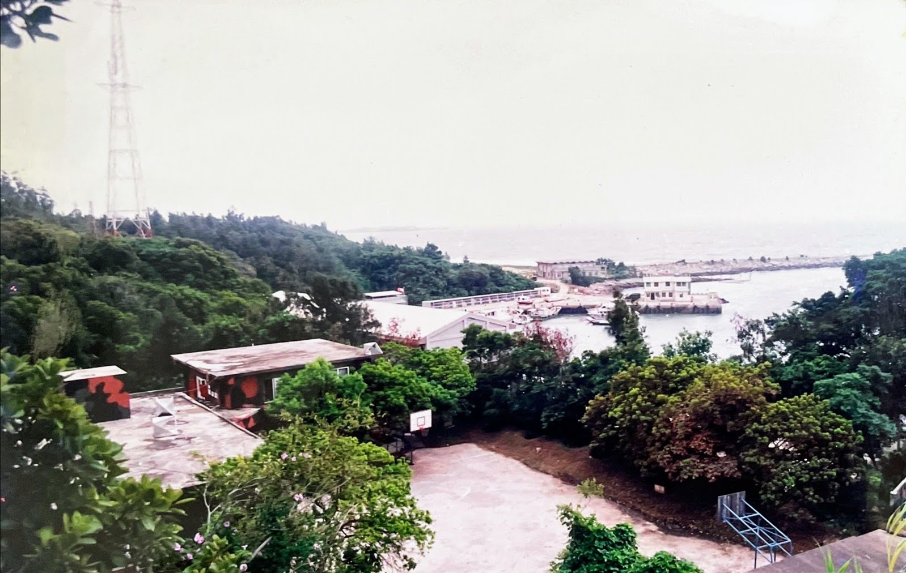

# 序

楊維中 a.k.a zonble

敬這片海灣 
敬這片星空 
敬我的弟兄 
敬那個我們搞過 
也搞過我們的 
精實案

## 2001 年序

「…在精實案一開始，我們工兵營就被斷了糧，同時又得投入一項因為精實案新編成部隊點閱所需的大工程。在狀況三戰備與繁複的文書作業中，我們終於完成了精實案部隊重新編成，但是隨即帶來將近半年的人事資訊與薪餉發放作業的大混亂。而精實案所帶來的不合理制度與編裝，在部隊實務中所出現的嚴重問題，這時才正要開始…。」

「…防區狀況三即將生效，目的就是要驗證精實案後，防區各部隊已經成為量小、質精、戰力強的新一代鋼鐵勁旅。」

## 2022 年序

我在 2001 年，在當時相當普及的明日報個人新聞台服務上，發表了《防區狀況三生效－驗證精實案》，中間有一些網站轉載，之後也曾經發行過實體書籍，但只有刊出前九章。前兩部的第一到第十四章，是 2001 年發表的內容，至於十五章以後的第三部，是 2022 年新增的章節。在 2001 年剛發表時，原文中隱藏了一些防區的實際地點與事件的名稱，在當時有些遮遮掩掩的樂趣，但二十多年過去後，沒有刻意隱藏的必要，而且反而影響了與後面一些章節的連貫，因此改回原本的名稱。

在這個時候閱讀，大概需要注意一下這個故事的時空背景。國軍後來還有很多新的措施、規定與政策，這就只是一個當時的故事。而在當時的氣氛下，其實這是一個有點危險的故事。

這個故事當中出現不少人物，但就像你看鋼彈動畫作品一樣，鋼彈當中有阿姆羅、夏亞、卡謬等等每一代角色，但是鋼彈系列的主角其實就是－鋼彈，而這個故事真正的主角，正是當時正在進行當中的國軍精實案。金門防區那年的駐軍從三萬人裁到兩萬人，金東、金西、南雄、烈嶼等師改編成聯兵旅，各種減免役期的政策也剛要開始。

這個故事發生在 1999 年的金門防衛司令部直屬工兵營，2013 年精粹案之後，又縮編成只剩工兵連。當時工兵營下共有四個連隊，分別為營部連與工一、二、三連，主要發生在營部以及營部連，駐地金湖鎮漁村。當時其他部隊的人，其實很羨慕我們接近山外─一個金東阿兵哥常去的鬧區。

這個故事描寫的是組織設計與基層營連實務嚴重脫節的背景下，一群大專文書兵如何完成精實案任務。組織設計與實務脫節之處，在於許多部隊明明有被安排的任務或是日常事務，卻沒有可以因應這項任務的職缺安排，具體表現出來的，就是大量的違規支援調用與以兵代士、以士代官、甚至以兵代官，而這兩個現象，最後都發生嚴重的問題。

當上級單位有一項任務卻缺乏人力完成，又沒有職缺時，就很有可能要求下級單位派人支援上級單位，所以，某個應該屬於某個基層連隊的人，很可能長期不在連隊上，支援單位也不見得妥善管理支援人員，於是導致像 1999 年的軍史館命案—在軍史館支援的士兵殺害了為了學校軍訓作業高中女生。軍史館命案後，軍中也開始大量清查部隊中的支援調用情形。

而以士代官、以兵代官，更是貫穿了這整個故事：部隊有某項需要參謀軍官的工作，但由於組織上並沒有設計這個職缺，所以就交由士官兵辦理；或，軍官將自己該負責的大量職務，交給義務役士官或是士兵辦理（我們可能叫他們業務士、文書兵、參一二三四政戰、各級裝備保管人），造成的結果是部隊中實際的權力關係混亂，領導統御失靈。義務役士官兵理應聽從軍官的指揮，但士官兵手上，卻可能會有影響軍官的職掌業務。這導致，義務役士官兵在「菜」的時候，在軍中完全沒有任何權力，卻必須負擔軍官的業務責任，但是到「老」的時候，又可能對業務帶來的甜頭食髓知味，因此得寸進尺、不服管教。

我自己，甚至我相信各個部隊的義務役業務士，大概都經歷過這種從菜到老的過程，你也可以在這個故事當中，看到一個文書兵怎樣為了生存，變得愈來愈大膽。但，以士代官、以兵代官這種普遍的現象，根本完完全全是錯的。

這個故事大概除了「骯髒」、「塊石」幾章，其餘並不會太好讀，因為牽涉到了一些國軍的業務運作，以參一（人事）為主，以及少量的參三（作戰）業務，在各參文書中，我相信參四業務在精實案過程中應該更加繁重，但我對此實在了解太少。在這個故事剛發表的時候，故事中的內容，甚至可以直接教會一個新兵上手業務。我相信絕大多數人不會接觸到這些國軍業務，尤其是外島的特殊規定，不過，如果你願意花時間閱讀這些跟業務有關的部分，我可以保證，你可以把《防區狀況三生效－驗證精實案》，看成是一本當時的國軍人事作業笑話大全。而很多笑話，說不定在你正在閱讀此書的時候，還依然存在。

### 時間軸

這個故事的每章都有各自的主題，雖然大致還是按照時間安排，為了敘事的連貫，不見得每個事件都按照時間出現。在閱讀這個故事的時候，可以參考以下時間軸：

- 八十八年二月
    - [防區] 故事開始，某人到部，開始擔任工兵營營部參一，掌管收發與返台差假業務
    - [骯髒] 防衛部工兵營停止分發新米
- 八十八年三月
    - [協調] 南雄旅工兵連改編成工兵排作業
    - [塊石] 幹訓班校閱場工程
- 八十八年四月
    - [協調] 南雄旅工兵連編成完成
    - [協調] 南雄旅人員（包括約翰）改分配工兵營
    - [塊石] 幹訓班校閱場工程
- 八十八年五月
    - [狀況三上下] 擎天操演（防區狀況三生效）
    - [狀況三上下] 同心演練
    - [狀況三上下] 擎天廳擴大月會
    - [塊石] 幹訓班校閱場工程
    - [參一] 差假業務督導
- 八十八年六月
    - [編成] 防衛部直屬部隊編成作業，包括工兵營
    - [參一] 軍史館命案
- 八十八年七月
    - [編成] 工兵營全營存在嚴重人差
    - [休假] 軍訓成績可折抵義務役役期，高中職畢業可折抵 14 天，大專畢業可折抵 28 天
- 八十八年八月
    - [編成] 工兵營全營存在嚴重人差
    - [編成] 應該要有精實案專長鑑測，但是並沒有實施
    - [裝備] 營長交接
    - [裝備] 水泥預拌車撞上軍械室
    - [裝備] 準備高裝檢
- 八十八年九月
    - [休假] 高裝檢
    - [休假] 防衛部為了爭取更多兵員，要求將只要佔到士官缺的兵員都當成士官計算
    - [休假] 差假督導
    - [休假] 營部連發生逃兵事件
    - [休假] 七月公布的役期縮減衝擊退伍令與返台假作業
    - [休假] 工一連許柏崙後送
    - [休假] 九二一地震，大批人員返台
- 八十八年十月
    - [編成] 工兵營全營存在嚴重人差
    - [休假] 約翰返台
    - [休假|正義] 丹恩颱風，全防區大停電
    - [士官] 工兵營大量送士官訓
- 八十八年十一月
    - [正義] 約翰、人官同時返台
    - [正義] 雲林縣縣長補選
    - [士官] 防區射擊競賽
    - [精實|壯遊] 某個平凡的星期四
- 八十八年十二月
    - [壯遊] 開始支援政戰部
- 八十九年二月
    - [士官] 工兵營一次到部 27 名校訓預士
    - [士官] 五名輪車技工受保養訓可晉升士官，但營部連已經有 40 人有士官資格
- 八十九年三月
    - [士官] 營部連士官大爆滿
    - [壯遊] 基層營連系列報導開始
- 八十九年四月
    - [士官] 營部連士官大爆滿
- 八十九年五月
    - [壯遊] 新任總統就職後馬上訪問防區
- 八十九七月
    - [壯遊] 支援結束
- 八十九八月
    - [精實] 莒光園地主持人粟奕倩過世

### 場景

金防部工兵營與營部連的駐地，從 2007 年之後，變成了金湖鎮的資源回收站。以前防衛部有什麼其他部隊不要的人，都往工兵營丟，把工兵營當成垃圾場，我個人也覺得這個營區當時收了不少軍中垃圾，沒想到後來真的變成垃圾場了。由於金門縣政府並沒有大幅變更駐地中的建築物，加上平時仍然有清潔隊使用，《防區狀況三生效－驗證精實案》當時的場景仍然相當完整，甚至在 Google 地圖上找「金湖鎮公所清潔隊」就可以找到，而且可以看到空照圖。在 Google 地圖中，金門大部分其他駐地，是被塗掉、無法看見的。

[連結](https://www.google.com/maps/place/%E9%87%91%E9%96%80%E7%B8%A3%E9%87%91%E6%B9%96%E9%8E%AE%E5%85%AC%E6%89%80%E6%B8%85%E6%BD%94%E9%9A%8A/@24.4301715,118.4093947,380a,35y,39.38t/data=!3m1!1e3!4m5!3m4!1s0x3414a489606dcf0d:0x952bd5cf0c93d0fa!8m2!3d24.4331063!4d118.4096928!5m1!1e4)

工兵營在斜坡上，營部連在上方，營部在下方，所以故事中說「在營部連上面」，就是這個意思。變成金湖鎮清潔隊之後，比較明顯的改變，是大門的位置，原本的大門在正上方，很明顯不適合垃圾車出入，所以金門縣政府在從前往新湖漁港的市港路又開了一個新的入口，並且蓋了新的垃圾車停車場。

<iframe src="https://www.google.com/maps/d/u/0/embed?mid=1maPavfoWPIPNJ9Wz24I6Vi5bJoRS7sE&ehbc=2E312F" width="640" height="480"></iframe>

上方地圖中的黃線，就是在「狀況三」一章中提到的散兵坑分布。

故事中說到的海龍坑道，現在也開放觀光，現在叫做漁村小艇坑道，從新湖漁港旁邊有個步道可以走過去，在步道上也可以看到整個料羅灣與料羅港。
